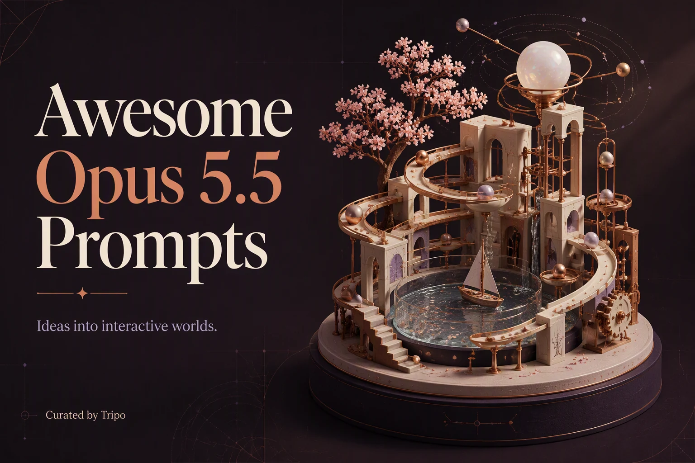

<!-- Generated from Growth CMS by templates/readme.md. Edit content in CMS; run npm run sync. -->

# Awesome Opus 5.5 Prompts

[](https://github.com/sindresorhus/awesome) [](https://github.com/TripoGrowthLab/awesome-opus-5-5-prompts/stargazers) [](LICENSE) [](https://github.com/TripoGrowthLab/awesome-opus-5-5-prompts/actions/workflows/sync-prompts.yml) [](CONTRIBUTING.md)

<p>
  <a href="README.md"></a>
  <a href="README.zh-CN.md"></a>
  <a href="docs/catalog.zh-Hant.md"></a>
  <a href="docs/catalog.ja.md"></a>
  <a href="docs/catalog.ko.md"></a>
  <a href="docs/catalog.es.md"></a>
  <a href="docs/catalog.pt.md"></a>
  <a href="docs/catalog.de.md"></a>
  <a href="docs/catalog.fr.md"></a>
  <a href="docs/catalog.it.md"></a>
  <a href="docs/catalog.ru.md"></a>
  <a href="docs/catalog.tr.md"></a>
  <a href="docs/catalog.uk.md"></a>
  <a href="docs/catalog.vi.md"></a>
</p>

> 想比较更多模型的创作方式？浏览 [Awesome 3D Prompts](https://github.com/TripoGrowthLab/awesome-3d-prompts) 与 [Astra 提示词库](https://github.com/TripoGrowthLab/awesome-astra-prompts)。

<a href="https://www.tripo3d.ai/zh/3d-prompts/models/claude-opus-5-5?utm_source=github&amp;utm_medium=referral&amp;utm_campaign=awesome_opus_5_5_prompts&amp;utm_content=readme_hero"></a>

**用 Opus 5.5，把一个想法做成可玩的 3D 世界。**

来自真实作品的 Claude Opus 5.5 提示词，覆盖 Three.js 场景、浏览器游戏、动画与模拟。 每条案例保留作者与来源；先看效果，再复制提示词，改成自己的作品。

**63 条案例 · 1 个模型 · 14 种语言 · 1 条附源码**

[开始使用](#start-here) · [按用途浏览](#browse) · [最新案例](#latest) · [完整目录](docs/catalog.zh.md) · [项目源码](docs/with-code.md)

<a id="start-here"></a>

## 开始使用

1. **先选效果。** 按用途或模型挑一个案例，点击预览图进入详情，体验作品。
2. **再改提示词。** 展开下方提示词并复制，替换主题、风格和交互。需要参考图的案例请一起提供参考素材；通用流程和完整参考上下文见详情页。
3. **做出自己的版本。** 在相应的编程助手或 3D 工作流中运行，检查画面、操作和性能。有项目源码时，可先从原项目开始。

<a id="browse"></a>

## 按用途浏览

| 按用途浏览 | 案例 |
| :--- | ---: |
| [游戏](docs/catalog.zh.md#category-games) | 12 |
| [场景](docs/catalog.zh.md#category-3d-scenes) | 10 |
| [资产](docs/catalog.zh.md#category-3d-assets) | 3 |
| [互动](docs/catalog.zh.md#category-interactive-3d) | 12 |
| [动画](docs/catalog.zh.md#category-animation-simulation) | 26 |

### 按模型浏览

| 按模型浏览 | 案例 |
| :--- | ---: |
| [Claude Opus 5.5](docs/catalog.zh.md#model-claude-opus-5-5) | 63 |


<a id="latest"></a>

## 最新案例

[完整目录 (63) →](docs/catalog.zh.md)

<a id="claude-opus-5-5-2105672081358876788"></a>

### 动画浮空矿山微缩世界

[Koldo Huici](https://x.com/koldo2k) · 2026-10-01 · Claude Opus 5.5 · 场景

<a href="https://www.tripo3d.ai/zh/3d-prompts/claude-opus-5-5-2105672081358876788"></a>

<details>
<summary>提示词</summary>

```text
在 Blender 中使用 Python 制作一个等距视角的浮空微缩世界，并将动画设置为无缝循环：一座小型矿山岛上有一座层叠式山体、两条隧道，以及一条穿过山体并循环行驶的铁路；岛上还有一个池塘，溪流从边缘倾泻而下形成瀑布，剖切面上的岩层中嵌有发光水晶。矿工是小型 Claude 机器人：一个正在开采水晶矿脉，却被蝙蝠吓了一跳；一个操作起重机，将水晶倒入每一辆经过的矿车；一个在池塘里钓鱼；还有一个乘坐矿车。在矿井入口上方挂一块木制的 “TOKENS” 标牌。每个动作都要配合同步音效。
```

</details>

<details>
<summary>作者原始提示词</summary>

```text
Make an isometric floating mini-world in Blender, animated with Python, as a seamless loop: a small mine island with a terraced mountain, two tunnels and a railway that loops through the mountain, a pond whose stream falls off the edge as a waterfall, and rock layers with glowing crystals on the cut sides. The workers are little Claude bots: one mines a crystal vein and gets startled by a bat, one runs a crane that dumps crystals into each passing cart, one fishes in the pond, and one rides a cart. Put a wooden "TOKENS" sign over the mine entrance. Sound synced to every action.
```

</details>

[查看详情 ↗](https://www.tripo3d.ai/zh/3d-prompts/claude-opus-5-5-2105672081358876788) · [查看原帖](https://x.com/koldo2k/status/2105672083908825404) · [返回案例导航](#latest)

---

<a id="claude-opus-5-5-2105669581226570012"></a>

### Blockworld

[semperphoenix.com](https://semperphoenix.com/) · 2026-10-01 · Claude Opus 5.5 · 游戏

<a href="https://www.tripo3d.ai/zh/3d-prompts/claude-opus-5-5-2105669581226570012"></a>

<details>
<summary>提示词</summary>

```text
能否创建一个《我的世界》克隆版？
```

</details>

<details>
<summary>作者原始提示词</summary>

```text
Can you create a Minecraft clone?
```

</details>

[查看详情 ↗](https://www.tripo3d.ai/zh/3d-prompts/claude-opus-5-5-2105669581226570012) · [查看原帖](https://semperphoenix.com/lab) · [返回案例导航](#latest)

---

<a id="claude-opus-5-5-2105659005817462972"></a>

### Three.js 中巨龙袭击中世纪城堡

[ReconScribe](https://x.com/ReconScribe) · 2026-10-01 · Claude Opus 5.5 · 场景

<a href="https://www.tripo3d.ai/zh/3d-prompts/claude-opus-5-5-2105659005817462972"></a>

<details>
<summary>提示词</summary>

```text
一条巨龙正在袭击中世纪城堡及其村庄，场景使用 Three.js 构建。
```

</details>

<details>
<summary>作者原始提示词</summary>

```text
a giant dragon attacking a medieval castle and its village, built in Three.js.
```

</details>

[查看详情 ↗](https://www.tripo3d.ai/zh/3d-prompts/claude-opus-5-5-2105659005817462972) · [查看原帖](https://x.com/ReconScribe/status/2105659005817462972) · [返回案例导航](#latest)

---

<a id="claude-opus-5-5-2105607558467559666"></a>

### 可抓取拉伸的 WebGPU 3D 软糖章鱼

[林悦己Cheer](https://x.com/cheerselflin) · 2026-10-01 · Claude Opus 5.5 · 互动

<a href="https://www.tripo3d.ai/zh/3d-prompts/claude-opus-5-5-2105607558467559666"></a>

<details>
<summary>提示词</summary>

```text
创建一个 token 预算为 200,000 的 Goal。结束时报告实际消耗 token、预算使用率和运行时间；如果能够获得输入、缓存输入、输出 token 的拆分，则按照当前模型价格估算美元费用，并明确列出计算依据。我知道是订阅额度，但是我们可以换算成api计费

Create “Octo Jelly” - a beautiful, interactive 3D gummy octopus that users can grab, stretch, and squish directly in their browser. Deliver a complete single-file HTML experience using genuine WebGPU.
ART DIRECTION
Make the octopus look like a premium translucent gummy candy: a rounded head, eight curled tentacles, small suction cups, and a cute, understated face.
Use a warm off-white background, soft studio lighting, and a subtle ground shadow. Keep the scene elegant and uncluttered, with the octopus large and centered.
GEOMETRY AND MATERIAL

* Generate all geometry procedurally. No external models or image files.
* Connect all eight tentacles smoothly to the body, without visible gaps or floating parts.
* Add rounded suction cups that stay attached as the tentacles deform.
* Use glossy, translucent jelly with thickness-dependent color absorption, refraction, soft internal light scattering, and delicate rim highlights.
* Thick areas should have richer color; thin tentacle tips should transmit more light.
* Avoid opaque plastic, blown-out highlights, and visible mesh seams.

SOFT-BODY PHYSICS
Use a stable mass-spring or position-based dynamics system with elastic constraints and approximate volume preservation.

* The head should feel soft but substantial.
* Tentacles should be more flexible than the head, especially near their tips.
* Allow users to grab the head or any tentacle at the clicked location.
* Pulling should deform the nearby geometry first, then elastically pull the rest of the body.
* On release, the octopus should wobble and gradually settle into its original shape.
* Tentacles should react independently, with slightly delayed motion.
* Include gravity, floor collisions, friction, and damping.
* Prevent tentacles from passing through the floor.
* Clamp extreme stretching and use fixed simulation steps so strong pulls do not break the model.
* Do not fake softness by scaling or rotating the entire octopus.

INTERACTION

* Left-click or touch the octopus to grab and stretch it.
* Right-drag or drag empty space to gently orbit the camera.
* Support a limited zoom range.
* Keep camera gestures separate from object dragging.
* Add “Give it a nudge,” “Reset,” “Pause,” and “Reset view” buttons.
* Include Firmness and Internal damping sliders.
* Add “¼ speed” and “Show mesh” toggles.
* Provide three color presets: Coral, Lagoon, and Grape. Change the material colors without resetting the simulation.

INTERFACE
Use a minimal editorial layout:

* Top left: small “MATERIAL STUDIES” label.
* Large italic serif heading: “Octo Jelly.”
* Caption: “Eight arms. A little wobble. A very soft creature.”
* Top right: a WebGPU status indicator.
* Right side: a compact “THE SPECIMEN” control panel.
* Bottom left: “Grab a tentacle. Pull gently. Let go.”

Use clean sans-serif text for controls, thin borders, and generous whitespace. Avoid heavy panels or decorative UI effects.
PERFORMANCE AND QUALITY

* Use real WebGPU rendering, not a 2D canvas imitation or prerecorded animation.
* Reuse geometry and buffers; do not rebuild meshes during dragging.
* Keep suction cups, eyes, and other details attached to the deforming body.
* Handle transparency without flickering, disappearing surfaces, or harsh black edges.
* Support desktop and mobile layouts.
* Show a clear fallback message if WebGPU is unavailable.
* Test repeated grabs, strong pulls, releases, floor collisions, palette changes, pause, and reset.

The result should feel like a little living gummy toy - glossy, squishy, expressive, and satisfying to stretch. Deliver the full working HTML, not a mockup or a code fragment.
```

</details>

[查看详情 ↗](https://www.tripo3d.ai/zh/3d-prompts/claude-opus-5-5-2105607558467559666) · [查看原帖](https://x.com/cheerselflin/status/2105607558467559666) · [返回案例导航](#latest)

---

<a id="claude-opus-5-5-2105439105798513059"></a>

### 深达 5 公里的岩浆房火山模拟

[Konstantin Saifoulline](https://x.com/konstantinsaifo) · 2026-09-30 · Claude Opus 5.5 · 动画

<a href="https://www.tripo3d.ai/zh/3d-prompts/claude-opus-5-5-2105439105798513059"></a>

<details>
<summary>提示词</summary>

```text
使用 Opus 5.5 构建火山模拟，岩浆房位于地下 5 公里处。
```

</details>

<details>
<summary>作者原始提示词</summary>

```text
Build with Opus 5.5 a volcano simulation. Magma chamber 5 km down.
```

</details>

[查看详情 ↗](https://www.tripo3d.ai/zh/3d-prompts/claude-opus-5-5-2105439105798513059) · [查看原帖](https://x.com/konstantinsaifo/status/2105439105798513059) · [返回案例导航](#latest)

---

<a id="claude-opus-5-5-2105353400040964192"></a>

### 果冻压机

[Vib3Coded](https://x.com/vib3coded) · 2026-09-30 · Claude Opus 5.5 · 互动

<a href="https://www.tripo3d.ai/zh/3d-prompts/claude-opus-5-5-2105353400040964192"></a>

<details>
<summary>提示词</summary>

```text
创建“Jelly Press”：用 HTML 制作一个单文件可交互 3D 玩具（所有 JS、CSS 和 WGSL 着色器都内嵌其中，除 Google Fonts 外不使用外部资源）。使用 WebGPU 渲染；如果缺少 WebGPU 或适配器，应显示简洁的回退提示，而不是空白页面。

概念
四种半透明的水果切片形果冻软糖，一次一个，放在液压压机的钢制底座上。玩家按住一个醒目的红色按钮，让压机下压。果冻会被压扁并向四周铺开，压力表读数上升；当高度压缩到超过一半时，果冻会爆裂成碎片。爆裂后游戏不会结束：玩家可以抓取碎片、拖动它们、将它们甩得到处都是，再次压扁它们。

果冻（底部水果按钮，按键 1–4）
1. 西瓜楔块（半圆盘状块体）：红色果肉、深色泪滴形瓜子、浅色果皮带和绿色条纹外皮。
2. 橙子切片（半圆盘）：橙色果肉分瓣，中间由细薄的白色筋膜隔开；带浅色白瓤和橙色果皮。
3. 无花果半片：粉色果肉中布满细小金色籽粒，外覆一层奶油色果肉和深紫色果皮。
4. 菠萝圈：金黄色纤维状果肉，带放射状纹理，中间有孔。
每种果冻都应看起来像真正的软糖：次表面散射、柔和的半透明效果、光泽高光，以及投射在暖色摄影棚地面上的柔和阴影（奶油色/米色，并进行色调映射）。

物理（CPU，固定 60 Hz 步长）
- 使用 XPBD 四面体软体模型，每步 8 次子迭代：每个四面体采用协旋转形状匹配、每个四面体的体积约束、严格的边应变限制（0.35×–1.8×）、边速度阻尼、带库仑摩擦的地面接触、滚动阻力，以及物体近乎静止时的轻微稳定处理。
- 在 CPU 上通过四面体中的重心嵌入对渲染网格进行蒙皮；每帧根据三角形重新计算法线。
- 压头模具是一个运动学圆形压板（半径约 1.05，边缘圆润，具有一定厚度，上方连接压杆）。它的下方充当带摩擦的天花板，上方充当平台，边缘充当侧壁。两根压机立柱为实体。
- 压力读数以 bar 为单位，来自压板的接触载荷，并按水果类型进行缩放。

爆裂
- 在果冻高度压缩到 52%–66% 之间的随机位置时断裂。
- 每回合开始后不久就在后台规划断裂，使爆裂瞬间完成。
- 根据带轻微倾斜切面的 3D Voronoi 单元生成 5–7 个大碎片。其中 3–4 个碎片的远端角落会被两组切割平面削掉，并进一步分成 2–4 个小碎片，形成参差不齐、带缺口的边缘。
- 根据四面体质心将四面体分配给各单元。为每个碎块复制粒子。
- 将过小的孤立块合并到相邻碎块中。
- 新生成的物体继承原有位置和速度。
- 将表面三角形与每个单元的半空间进行裁剪，并为每个切面填充干净的平面封口，展示水果内部（果肉、籽粒、筋膜）。不得出现拉伸三角形或孔洞。
- 将碎片向压机外侧和上方弹出。小碎片飞得更快、更高，并带有随机自旋翻滚。
- 显示醒目的斜体结果文案约 2.5 秒，然后淡出：“Splat.”（西瓜）、“Squeezed.”（橙子）、“Well, that's jam.”（无花果）、“Crushed.”（菠萝）。同时显示统计信息：“在 N bar、压至自身高度的 N% 时放弃抵抗。”

爆裂后：可玩模式
- 拾取：对蒙皮网格执行射线/三角形测试；触摸操作使用宽容的屏幕空间回退判定。
- 抓取时，将被抓区域（半径约 0.4，且仅包含该碎块的粒子）固定到面向摄像机的拖动平面上的目标点。小碎片整体移动；大碎片会像果冻一样拉伸和摆动。
- 松开时，按照指针速度将碎片甩出。
- 碎片之间会发生碰撞。如果发现某个粒子位于另一个碎块的四面体内部，就通过该碎块最近的表面面片将其推出，并施加摩擦。使用碎块 AABB 宽相位检测和表面四面体的空间哈希。
- 碎片不会离开场景：设置侧壁，并增加一条不可见的前缘，防止碎片落到控制区下方或摄像机后方。
- 压机仍可使用：按住按钮再次压扁碎片（不会发生第二次断裂）；点击“升起”抬高压板。
- 落地时播放湿润的“噗”声；抓取时播放轻微的黏糊声。
- 光标：悬停在碎片上时显示张开的手，拖动时显示握紧的手。拖动空白区域可环绕旋转摄像机。

界面（编辑性、极简）
- 左上角标题区：“JELLY PRESS”使用粗体窄体大写字母，其中“PRESS”填充黄色/黑色警示条纹。副标题：“Four gummies. One hydraulic press.”
- 右上角：重置和声音开关。
- 底部控制区：
  - 按压时逐步升级的说明文案：“Contact.” → “It's fine. It's jelly.” → “Getting wider.” → “That's a pancake now.” → “It's making a noise.” → “Please.”
  - 环绕红色 HOLD 按钮、Raise 按钮和大型数字 bar 读数的圆形压力表（0–400 bar 刻度，带红色区域）。
  - 带图标的水果按钮。
- 在可玩模式中，说明文案区域显示“Grab a piece. Throw it.”，并提供较小的“Press again”和“Next jelly”按钮。
- 控制：按住 Space 或 ArrowDown 进行按压，按 ArrowUp 升起，按 R 重置，按 1–4 选择水果。滚轮缩放；双击重置视图。
- 摄像机：采用低机位、接近工作台高度的视角；压机框架会根据水果调整偏航角，确保立柱不会挡住果冻。自动调整构图，让果冻位于标题区和底部控制区之间；支持手机竖屏显示，并使用更窄的场景。

声音（程序化 Web Audio，无音频文件）
液压马达嗡鸣声随压力升高而增强，高压时偶尔发出吱嘎声，压板停止时播放阀门撞击声，爆裂时播放响亮的爆裂声，落地时播放柔和的“噗”声，以及湿润的黏糊声。首次交互时解锁音频。

质量标准
- 笔记本电脑上流畅运行 60 fps。
- 在后台预热其他水果的网格和着色器，确保切换时即时完成。
- 遵循 prefers-reduced-motion 设置。
- 提供无障碍标签；压力表使用 role=meter，并显示 focus-visible 轮廓。
- 控制台无报错。页面绝不显示空白。
```

</details>

<details>
<summary>作者原始提示词</summary>

```text
Create "Jelly Press": a single-file interactive 3D toy in HTML (all JS, CSS and WGSL shaders inline, no external assets except Google Fonts). Render with WebGPU; if WebGPU or an adapter is missing, show a clean fallback message instead of a blank page.  CONCEPT Four translucent gummy jellies shaped like fruit slices sit one at a time on the steel bed of a hydraulic press. The player holds a big red button to lower the press. The jelly squashes and spreads, the pressure gauge climbs, and somewhere past half its height it bursts into pieces. After the burst the game does NOT end: the player can grab the pieces, drag them, throw them around, and squash them again.  THE JELLIES (chips at the bottom, keys 1–4) 1. Watermelon wedge (half-disc slab): red flesh with dark teardrop seeds, a pale rind band, a green striped skin. 2. Orange slice (half-disc): orange pulp segments separated by thin white membranes, pale pith, orange peel. 3. Fig half: pink flesh full of small golden seeds, a cream layer, a dark purple skin. 4. Pineapple ring: golden fibrous flesh with radial streaks and a hole in the middle. Each jelly should look like real gummy candy: subsurface scattering, soft translucency, glossy specular highlights, soft shadows on a warm studio floor (cream/beige, tone-mapped).  PHYSICS (CPU, fixed 60 Hz step) - XPBD tetrahedral soft body with 8 substeps: co-rotational per-tet shape matching, per-tet volume constraints, hard edge strain limits (0.35×–1.8×), edge velocity damping, floor contact with Coulomb friction, rolling resistance, and gentle settling when nearly still. - Render mesh skinned on the CPU through barycentric embedding in the tets; normals recomputed from triangles every frame. - The press die is a kinematic round platen (radius ~1.05, rounded edge, a thickness, a ram above it). It acts as a ceiling with friction below, a shelf on top, and a side wall at its rim. The two press posts are solid. - Pressure readout in bar comes from the platen's contact load, scaled per fruit.  THE BURST - Break at a random squash between 52% and 66% of the jelly's height. - Plan the fracture in the background shortly after each round starts, so the burst itself is instant. - 5–7 big pieces from 3D Voronoi cells with slightly tilted walls. On 3–4 of them, a far corner is chipped off by two cutting planes and split further into 2–4 small chips, which leaves jagged, notched edges. - Assign tets to cells by centroid. Duplicate particles per chunk. Merge tiny islands into their neighbours. - The new body adopts the old positions and velocities. - Clip the skin triangles against each cell's half-spaces, and fill every cut face with a clean flat cap showing the fruit's interior (flesh, seeds, membranes). No stretched triangles, no holes. - Kick pieces outward and upward from the press. Small chips fly faster and higher and tumble with random spin. - Show a big italic verdict for about 2.5 s, then fade it: "Splat." (melon), "Squeezed." (orange), "Well, that's jam." (fig), "Crushed." (pineapple). Include a stat line: "Gave up at N bar and N% of its height."  AFTER THE BURST: PLAY MODE - Picking: ray/triangle test against the skinned mesh, with a forgiving screen-space fallback for touch. - Grabbing pins the grabbed patch (radius ~0.4, only particles of that chunk) to a target on a camera-facing drag plane. Small chips move whole; big pieces stretch and swing like jelly. - Releasing throws the piece with the pointer's velocity. - Pieces collide with each other. A particle found inside another chunk's tet is pushed out through that chunk's nearest skin face, with friction. Use a chunk AABB broad phase and a spatial hash of skin tets. - Pieces stay on stage: side walls, plus an invisible front edge so nothing ends up under the controls or behind the camera. - The press still works: hold to squash the pieces again (no second fracture); Raise lifts the platen. - Wet "plop" sounds on landings; a small squelch on grab. - Cursor: open hand over pieces, closed hand while dragging. Dragging empty space orbits the camera.  UI (editorial, minimal) - Masthead top-left: "JELLY PRESS" in bold condensed caps, with "PRESS" filled in yellow/black hazard stripes. Subtitle: "Four gummies. One hydraulic press." - Top-right: Reset and Sound toggle. - Bottom deck:   - Caption line with escalating captions while pressing: "Contact." → "It's fine. It's jelly." → "Getting wider." → "That's a pancake now." → "It's making a noise." → "Please."   - Circular pressure dial (0–400 bar arc, red zone) around a red HOLD button, a Raise button, and a big numeric bar readout.   - Fruit chips with icons. - In play mode the caption slot shows "Grab a piece. Throw it." with small "Press again" and "Next jelly" buttons. - Controls: hold Space or ArrowDown to press, ArrowUp to raise, R to reset, 1–4 to pick a fruit. Wheel zooms; double-click resets the view. - Camera: low bench-level view; the press frame yaws per fruit so the posts never block the jelly. Framing adapts so the jelly sits between masthead and deck; works on phones (portrait) with a narrower stage.  SOUND (procedural Web Audio, no files) Hydraulic motor hum that rises with pressure, wet squelches, occasional creaks at high pressure, a valve clunk when the platen stops, a loud burst, soft plops on landing. Unlock on first interaction.  QUALITY BAR - Smooth 60 fps on a laptop. - Background warm-up of the other fruits' meshes and shaders so switching is instant. - Respect prefers-reduced-motion. - Accessible labels, a gauge with role=meter, focus-visible outlines. - No console errors. The page never goes blank.
```

</details>

[查看详情 ↗](https://www.tripo3d.ai/zh/3d-prompts/claude-opus-5-5-2105353400040964192) · [查看原帖](https://x.com/vib3coded/status/2105353559327887843) · [返回案例导航](#latest)

---

<a id="claude-opus-5-5-2105315982525014067"></a>

### SPARK — 绘画风格 3D 动画镜头

[Shikhar](https://x.com/xikhar) · 2026-09-30 · Claude Opus 5.5 · 动画

<a href="https://www.tripo3d.ai/zh/3d-prompts/claude-opus-5-5-2105315982525014067"></a>

<details>
<summary>提示词</summary>

```text
标题：“SPARK”

一段约 15 秒、采用动画剧集 Arcane（Fortiche）绘画风格的 3D 动画镜头。

使用 Blender 制作；如果其他工具效果更好，也可以使用其他工具。宽银幕，无对白。

GOAL

首要目标是在各个方面尽可能完美地复现 Arcane 的视觉风格与动画风格。观众应当相信这段作品出自同一家工作室。

请投入所需的时间和精力。完美复现其技法与视觉效果。无论需要多少时间，都要确保每个方面都尽善尽美。

场景（较为宽松——可自由调整）

一个小型机械生物（不要做人形），例如一只由黄铜和水晶构成的机械蛾，在夜晚杂乱的发明家工作台上苏醒。它的水晶核心点燃发光能量，随后在一阵火花旋涡中冲入空中。如果其他细节、构图或动作能更好地展现这种风格，可以进行调整。如果你愿意，也可以完全改为动画呈现其他内容——任何你选择的主题，只要是你最擅长的，并且同样能呈现出与 Arcane 完全一致的视觉效果。

PROCESS

1. 研究：在开始制作之前，深入研究 Arcane 的风格。查找 Fortiche 技法的参考资料与拆解分析（访谈、幕后制作资料、艺术家拆解等）。记录所有具有代表性的元素：纹理、着色、线稿、色彩、灯光、帧率、特效、摄影机和合成。

2. 风格指南：将研究成果整理成一份书面检查清单，并在制作动画前制作一张小型风格帧（单张静帧图像）。将其与参考静帧并排比较，持续修改，直到匹配为止。

3. 制作：按照检查清单进行建模、制作纹理、布光和动画。

4. 审核：反复将画面帧与 Arcane 的参考素材进行比较。列出所有能看出的差异并修正。持续重复，直到不再存在明显差异。

需要匹配的风格元素（至少包括以下内容）

- 每个表面都使用带有明显笔触的手绘纹理；不要呈现出程序化或照片写实的效果。

- 风格化的绘画式着色，光影形状经过设计，而非采用写实的衰减。

- 角色和物体按二拍制作动画，使用有力的姿势、利落的节奏、预备动作和变形帧；摄影机移动则按一拍保持流畅。

- 在 3D 画面上叠加手绘 2D 特效（火花、能量、烟雾、闪光、辉光），按二拍制作动画，并采用图形化的形态语言。

- 大胆而富有情绪的色彩：暖色光线对比高饱和发光点缀，色彩丰富的阴影，强烈的轮廓光，以及泛光效果。

- 绘画式合成：类似笔刷的滤镜、颗粒，以及覆盖在画面上的细微纹理。

- 电影感摄影机：浅景深、有目的的运动，以及撞击时的重量感。

SOUND

制作与动作和氛围相匹配的细致电影感声音设计。

尽可能提升一切要素的质量：动画、模型、纹理、特效、灯光和声音。使用任何必要的工具或程序。你可以在线研究参考资料并模仿相关技法，也可以复制某些内容，但不要直接使用并非由你制作的素材。让整个镜头保持统一的风格，使 3D、绘制纹理和 2D 特效看起来像一幅统一的手工创作图像。

不要使用记忆或之前的聊天记录。

你可以使用任何其他工具、程序、插件，字面意义上的任何东西。利用一切可用资源。

你可以采用不同于本文所述的制作流程，也可以制作不同于描述内容的动画，但最终效果必须尽可能接近电视动画 Arcane。让每个方面都尽善尽美，并做到完全一致。
```

</details>

<details>
<summary>作者原始提示词</summary>

```text
TITLE: "SPARK"

An around 15-second 3D animated shot in the painterly style of the show Arcane (Fortiche).

Made in Blender, or any other tool if superior. Widescreen, no dialogue.

GOAL

The top priority is replicating Arcane's visual and animation style as perfectly as possible, in every way. Someone watching should believe it came from the same studio.

Take as much time and effort as needed. Replicate the technique and look perfectly. Spend as much time as needed, ensuring it's perfect in every way.

SCENE (loose — adapt freely)

A small mechanical creature (not humanoid), something like a brass-and-crystal moth, wakes up on a cluttered inventor's workbench at night. Its crystal core ignites with glowing energy, and it bursts into the air in a swirl of sparks. Change the details, framing, or action if something else shows off the style better. You can animate something else completely different if you want—anything you pick, whatever you can do best—that will also look identical to Arcane.

PROCESS

1. RESEARCH: Before building anything, study Arcane's style in depth. Find references and breakdowns of Fortiche's technique (interviews, making-of material, artist breakdowns). Write down every defining element: textures, shading, line work, color, lighting, frame rate, effects, camera, compositing.

2. STYLE GUIDE: Turn that into a written checklist and a small style frame (a single still image) before animating. Compare it side by side with reference stills and revise until it matches.

3. BUILD: Model, texture, light, and animate following the checklist.

4. REVIEW: Compare frames against Arcane references repeatedly. List every difference you can see and fix it. Repeat until no noticeable differences remain.

STYLE ELEMENTS TO MATCH (at minimum)

- Hand-painted textures with visible brushstrokes on every surface; nothing looks procedural or photographic.

- Stylized, painterly shading with designed light/shadow shapes, not realistic falloff.

- Animation on 2s for characters/objects, with strong poses, snappy timing, anticipation, and smear frames; camera moves smooth on 1s.

- Hand-drawn 2D effects (sparks, energy, smoke, glints, glow) layered over the 3D, animated on 2s with graphic shape language.

- Bold, moody color: warm light vs. saturated glowing accents, rich colored shadows, strong rim light, bloom.

- Painterly compositing: brush-like filtering, grain, subtle texture over the image.

- Cinematic camera: shallow depth of field, purposeful movement, weight on impacts.

SOUND

Detailed, cinematic sound design that matches the action and mood.

Make everything as good as possible: animation, models, textures, effects, lighting, and sound. Use any tools or programs needed. You may study references online and imitate techniques, and copy things, but do not directly use assets you did not create. Keep the whole shot in one consistent style so the 3D, painted textures, and 2D effects feel like a single hand-crafted image.

Do not use memory or previous chats.

You can use any other tools, programs, plugins, literally anything. Use anything at your disposal.

You can use different processes than outlined in this, or animate something else than described, but it should absolutely look as close as possible to the TV show Arcane. Make it perfect in every way and identical.
```

</details>

[查看详情 ↗](https://www.tripo3d.ai/zh/3d-prompts/claude-opus-5-5-2105315982525014067) · [查看原帖](https://x.com/xikhar/status/2105317581695623329) · [返回案例导航](#latest)

---

<a id="claude-opus-5-5-2105302007896797351"></a>

### 卡点的3D球体下坠动画视频

[Gorden Sun](https://x.com/Gorden_Sun) · 2026-09-30 · Claude Opus 5.5 · 动画

<a href="https://www.tripo3d.ai/zh/3d-prompts/claude-opus-5-5-2105302007896797351"></a>

<details>
<summary>提示词</summary>

```text
卡点的3D球体下坠的动画视频：对标专业的Blender做的效果，音乐是多首经典的纯音乐，场景按音乐切换，3D球体下坠时在3D场景的物件中弹跳，按音乐的节奏点亮物件。带一些幽默的元素。
使用three.js制作，不要使用Blender制作
```

</details>

[查看详情 ↗](https://www.tripo3d.ai/zh/3d-prompts/claude-opus-5-5-2105302007896797351) · [查看原帖](https://x.com/Gorden_Sun/status/2105302007896797351) · [返回案例导航](#latest)

---

<a id="claude-opus-5-5-2105285992865272110"></a>

### 果冻压榨机

[Vib3Coded](https://x.com/vib3coded) · 2026-09-30 · Claude Opus 5.5 · 互动

<a href="https://www.tripo3d.ai/zh/3d-prompts/claude-opus-5-5-2105285992865272110"></a>

<details>
<summary>提示词</summary>

```text
创建“果冻压榨机”：一个单文件 HTML 互动 3D 玩具（所有 JS、CSS 和 WGSL 着色器均内联，除 Google Fonts 外不使用外部资源）。使用 WebGPU 渲染；如果缺少 WebGPU 或适配器，则显示清晰的备用提示，而不是空白页面。

CONCEPT
四种半透明的水果切片造型软糖果冻，每次一个，放在液压压榨机的钢制压台上。玩家按住一个醒目的红色按钮，让压头下降。果冻会被压扁并向外摊开，压力表读数上升；当高度压缩到超过一半时，果冻会爆裂成碎块。爆裂后游戏不会结束：玩家可以抓取碎块、拖动、抛掷，并再次挤压它们。

果冻种类（底部水果按钮，按键 1–4）
1. 西瓜楔形块（半圆盘状）：红色果肉带深色泪滴形瓜子，浅色果皮带和绿色条纹外皮。
2. 橙子切片（半圆盘状）：橙色果肉分瓣，中间由纤细的白色筋膜隔开，外层是浅色内皮和橙色果皮。
3. 无花果半块：粉色果肉中布满细小的金色籽粒，外有奶油色夹层和深紫色果皮。
4. 菠萝环：金黄色纤维状果肉带放射状纹理，中间有孔。
每种果冻都应呈现真实软糖的质感：次表面散射、柔和的半透明效果、光泽高光，以及投射在暖色工作室地面上的柔和阴影（奶油色/米色，经过色调映射）。

物理（CPU，固定 60 Hz 步进）
- 使用 XPBD 四面体软体，8 次子步进：每个四面体采用共旋转形状匹配、四面体体积约束、硬性边应变限制（0.35×–1.8×）、边速度阻尼、带库仑摩擦的地面接触、滚动阻力，以及接近静止时的轻柔稳定。
- 渲染网格通过四面体中的重心嵌入在 CPU 上进行蒙皮；每帧根据三角形重新计算法线。
- 压头是一个运动学圆形压板（半径约 1.05，边缘圆润，具有一定厚度，上方连接压杆）。压板下方作为带摩擦的顶面，上方作为搁板，边缘处作为侧壁。两根压机立柱为实体。
- 压力表的 bar 读数来自压板的接触载荷，并按水果类型进行缩放。

爆裂
- 在果冻高度的 52% 至 66% 之间随机选择一次挤压程度进行断裂。
- 每轮开始后不久就在后台规划断裂，因此爆裂本身必须瞬间完成。
- 由略微倾斜的 3D Voronoi 单元生成 5–7 个大碎块。其中 3–4 个碎块的远端角落由两个切割平面削去，再进一步分成 2–4 个小碎片，形成锯齿状、带缺口的边缘。
- 根据四面体质心将四面体分配给各单元。为每个碎块复制粒子。将微小孤岛合并到相邻碎块中。
- 新软体沿用原来的位置和速度。
- 将蒙皮三角形与每个单元的半空间进行裁剪，并为每个切面填充干净平整的封口面，展示水果内部（果肉、籽粒、筋膜）。不得出现拉伸三角形或空洞。
- 将碎块向压榨机外侧和上方弹出。小碎片飞得更快、更高，并带有随机旋转。
- 显示约 2.5 秒的大号斜体判词，然后淡出：“啪叽。”（西瓜）、“挤扁了。”（橙子）、“呃，这下成酱了。”（无花果）、“压碎。”（菠萝）。包含一行统计信息：“在 N bar、N% 高度时放弃抵抗。”

爆裂后：游玩模式
- 拾取：对蒙皮网格进行射线/三角形测试；针对触控操作提供宽松的屏幕空间备用判定。
- 抓取时，将被抓取区域（半径约 0.4，仅限该碎块中的粒子）固定到面向摄像机的拖动平面上的目标点。小碎片整体移动；大碎块则像果冻一样拉伸和摆动。
- 松开时，按照指针的速度将碎块抛出。
- 碎块之间会发生碰撞。如果某个粒子位于另一个碎块的四面体内部，就通过该碎块最近的蒙皮面将其推出，并施加摩擦。使用碎块 AABB 粗筛，以及蒙皮四面体的空间哈希。
- 碎块不会离开舞台：设置侧壁，并添加一条不可见的前缘，避免任何物体落到控制区下方或摄像机后方。
- 压榨机仍可使用：按住按钮再次挤压碎块（不会再次断裂）；“升起”按钮会抬起压板。
- 落地时播放湿润的“啪叽”声；抓取时播放轻微的挤压声。
- 光标：悬停在碎块上时显示张开手，拖动时显示握拳。拖动空白区域可环绕旋转摄像机。

界面（编辑风格，极简）
- 左上角标题栏：“JELLY PRESS”，使用粗体窄体大写字母，其中“PRESS”填充黄色/黑色警示条纹。副标题：“四颗软糖。一台液压压榨机。”
- 右上角：重置和声音开关。
- 底部控制台：
  - 挤压过程中显示逐步升级的字幕：“接触。”→“没事，只是果冻。”→“越来越宽了。”→“这已经是煎饼了。”→“它开始发出声音了。”→“求你了。”
  - 红色“按住”按钮周围放置圆形压力表盘（0–400 bar 刻度弧，带红色区域），旁边有“升起”按钮和大型数字压力读数。
  - 带图标的水果按钮。
- 游玩模式下，字幕区域显示“抓一块，扔出去。”，并配有较小的“再次挤压”和“下一个果冻”按钮。
- 操作：按住空格键或 ArrowDown 挤压，按 ArrowUp 升起，按 R 重置，按 1–4 选择水果。滚轮缩放；双击重置视角。
- 摄像机：采用低机位、工作台高度视角；压榨机框架会根据水果左右偏转，确保立柱不会挡住果冻。自动调整构图，使果冻位于标题栏和底部控制台之间；兼容手机竖屏显示，并使用更窄的舞台。

声音（程序化 Web Audio，无音频文件）
液压马达嗡鸣声随压力升高而增强，高压时偶尔发出吱嘎声，压板停止时播放阀门撞击声，爆裂时播放响亮的爆破声，落地时播放柔和的啪叽声。首次交互时解锁声音。

质量要求
- 笔记本电脑上保持流畅的 60 fps。
- 在后台预热其他水果的网格和着色器，确保切换瞬间完成。
- 遵循 prefers-reduced-motion 设置。
- 提供无障碍标签，压力表使用 role=meter，并显示 focus-visible 轮廓。
- 不得出现控制台错误。页面绝不能变成空白。
```

</details>

<details>
<summary>作者原始提示词</summary>

```text
Create "Jelly Press": a single-file interactive 3D toy in HTML (all JS, CSS and WGSL shaders inline, no external assets except Google Fonts). Render with WebGPU; if WebGPU or an adapter is missing, show a clean fallback message instead of a blank page.

CONCEPT
Four translucent gummy jellies shaped like fruit slices sit one at a time on the steel bed of a hydraulic press. The player holds a big red button to lower the press. The jelly squashes and spreads, the pressure gauge climbs, and somewhere past half its height it bursts into pieces. After the burst the game does NOT end: the player can grab the pieces, drag them, throw them around, and squash them again.

THE JELLIES (chips at the bottom, keys 1–4)
1. Watermelon wedge (half-disc slab): red flesh with dark teardrop seeds, a pale rind band, a green striped skin.
2. Orange slice (half-disc): orange pulp segments separated by thin white membranes, pale pith, orange peel.
3. Fig half: pink flesh full of small golden seeds, a cream layer, a dark purple skin.
4. Pineapple ring: golden fibrous flesh with radial streaks and a hole in the middle.
Each jelly should look like real gummy candy: subsurface scattering, soft translucency, glossy specular highlights, soft shadows on a warm studio floor (cream/beige, tone-mapped).

PHYSICS (CPU, fixed 60 Hz step)
- XPBD tetrahedral soft body with 8 substeps: co-rotational per-tet shape matching, per-tet volume constraints, hard edge strain limits (0.35×–1.8×), edge velocity damping, floor contact with Coulomb friction, rolling resistance, and gentle settling when nearly still.
- Render mesh skinned on the CPU through barycentric embedding in the tets; normals recomputed from triangles every frame.
- The press die is a kinematic round platen (radius ~1.05, rounded edge, a thickness, a ram above it). It acts as a ceiling with friction below, a shelf on top, and a side wall at its rim. The two press posts are solid.
- Pressure readout in bar comes from the platen's contact load, scaled per fruit.

THE BURST
- Break at a random squash between 52% and 66% of the jelly's height.
- Plan the fracture in the background shortly after each round starts, so the burst itself is instant.
- 5–7 big pieces from 3D Voronoi cells with slightly tilted walls. On 3–4 of them, a far corner is chipped off by two cutting planes and split further into 2–4 small chips, which leaves jagged, notched edges.
- Assign tets to cells by centroid. Duplicate particles per chunk. Merge tiny islands into their neighbours.
- The new body adopts the old positions and velocities.
- Clip the skin triangles against each cell's half-spaces, and fill every cut face with a clean flat cap showing the fruit's interior (flesh, seeds, membranes). No stretched triangles, no holes.
- Kick pieces outward and upward from the press. Small chips fly faster and higher and tumble with random spin.
- Show a big italic verdict for about 2.5 s, then fade it: "Splat." (melon), "Squeezed." (orange), "Well, that's jam." (fig), "Crushed." (pineapple). Include a stat line: "Gave up at N bar and N% of its height."

AFTER THE BURST: PLAY MODE
- Picking: ray/triangle test against the skinned mesh, with a forgiving screen-space fallback for touch.
- Grabbing pins the grabbed patch (radius ~0.4, only particles of that chunk) to a target on a camera-facing drag plane. Small chips move whole; big pieces stretch and swing like jelly.
- Releasing throws the piece with the pointer's velocity.
- Pieces collide with each other. A particle found inside another chunk's tet is pushed out through that chunk's nearest skin face, with friction. Use a chunk AABB broad phase and a spatial hash of skin tets.
- Pieces stay on stage: side walls, plus an invisible front edge so nothing ends up under the controls or behind the camera.
- The press still works: hold to squash the pieces again (no second fracture); Raise lifts the platen.
- Wet "plop" sounds on landings; a small squelch on grab.
- Cursor: open hand over pieces, closed hand while dragging. Dragging empty space orbits the camera.

UI (editorial, minimal)
- Masthead top-left: "JELLY PRESS" in bold condensed caps, with "PRESS" filled in yellow/black hazard stripes. Subtitle: "Four gummies. One hydraulic press."
- Top-right: Reset and Sound toggle.
- Bottom deck:
  - Caption line with escalating captions while pressing: "Contact." → "It's fine. It's jelly." → "Getting wider." → "That's a pancake now." → "It's making a noise." → "Please."
  - Circular pressure dial (0–400 bar arc, red zone) around a red HOLD button, a Raise button, and a big numeric bar readout.
  - Fruit chips with icons.
- In play mode the caption slot shows "Grab a piece. Throw it." with small "Press again" and "Next jelly" buttons.
- Controls: hold Space or ArrowDown to press, ArrowUp to raise, R to reset, 1–4 to pick a fruit. Wheel zooms; double-click resets the view.
- Camera: low bench-level view; the press frame yaws per fruit so the posts never block the jelly. Framing adapts so the jelly sits between masthead and deck; works on phones (portrait) with a narrower stage.

SOUND (procedural Web Audio, no files)
Hydraulic motor hum that rises with pressure, wet squelches, occasional creaks at high pressure, a valve clunk when the platen stops, a loud burst, soft plops on landing. Unlock on first interaction.

QUALITY BAR
- Smooth 60 fps on a laptop.
- Background warm-up of the other fruits' meshes and shaders so switching is instant.
- Respect prefers-reduced-motion.
- Accessible labels, a gauge with role=meter, focus-visible outlines.
- No console errors. The page never goes blank.
```

</details>

[查看详情 ↗](https://www.tripo3d.ai/zh/3d-prompts/claude-opus-5-5-2105285992865272110) · [查看原帖](https://x.com/vib3coded/status/2105286092651999619) · [返回案例导航](#latest)

---

<a id="claude-opus-5-5-2105246199653482872"></a>

### 单文件 HTML 中的回合制 ASCII Roguelike 游戏

[kriptoleidi](https://x.com/kriptoleidi) · 2026-09-30 · Claude Opus 5.5 · 游戏

<a href="https://www.tripo3d.ai/zh/3d-prompts/claude-opus-5-5-2105246199653482872"></a>

<details>
<summary>提示词</summary>

```text
扮演首席游戏设计师。在单个自包含的 HTML/JS/CSS 文件中，构建一款完整的回合制 ASCII Roguelike 游戏，不使用任何外部依赖。
1. 视觉效果：20 世纪 80 年代 CRT 显示器风格，黑底荧光绿文字（#00FF66），带柔和的扫描线光晕。
2. 程序化生成：40x22 的地图，由相互连通的房间和走廊组成。
3. 实体：@ 代表英雄，# 代表墙壁，. 代表地面，g 代表哥布林（5 点生命值），$ 代表金币，> 代表向下的楼梯。
4. 机制：回合制移动与战斗，追踪生命值和金币。
5. HUD：楼层编号、生命值条、战斗日志。采用永久死亡机制，并支持重新开始。
仅输出可运行的 HTML 代码。
```

</details>

<details>
<summary>作者原始提示词</summary>

```text
Act as a lead game designer. Build a complete, turn-based ASCII roguelike in a single self-contained HTML/JS/CSS file with zero external dependencies.
1. Visual: 1980s CRT monitor, phosphor green text (#00FF66) on black, soft scanline glow.
2. Procedural generation: 40x22 map, connected rooms and corridors.
3. Entities: @ hero, # wall, . floor, g goblin (5 HP), $ gold, > stairs down.
4. Mechanics: turn-based movement and combat, track HP and gold.
5. HUD: floor number, HP bar, combat log. Permadeath with restart.
Output only the working HTML code.
```

</details>

[查看详情 ↗](https://www.tripo3d.ai/zh/3d-prompts/claude-opus-5-5-2105246199653482872) · [查看原帖](https://x.com/kriptoleidi/status/2105246199653482872) · [返回案例导航](#latest)

---

<a id="claude-opus-5-5-2105245648723562584"></a>

### 创建《权力的游戏》世界

[DrstaOne](https://x.com/DrstaOne) · 2026-09-30 · Claude Opus 5.5 · 场景

<a href="https://www.tripo3d.ai/zh/3d-prompts/claude-opus-5-5-2105245648723562584"></a>

<details>
<summary>提示词</summary>

```text
&lt;创建《权力的游戏》世界&gt;
```

</details>

<details>
<summary>作者原始提示词</summary>

```text
&lt;create Game of thrones world&gt;
```

</details>

[查看详情 ↗](https://www.tripo3d.ai/zh/3d-prompts/claude-opus-5-5-2105245648723562584) · [查看原帖](https://x.com/DrstaOne/status/2105245648723562584) · [返回案例导航](#latest)

---

<a id="claude-opus-5-5-2105029713445949521"></a>

### 互动构造板块地震视频

[Ege](https://x.com/egeberkina) · 2026-09-29 · Claude Opus 5.5 · 动画

<a href="https://www.tripo3d.ai/zh/3d-prompts/claude-opus-5-5-2105029713445949521"></a>

<details>
<summary>提示词</summary>

```text
制作一支视觉震撼的 60 秒视频，通过互动式构造板块沙盘解释地震是如何发生的。

整体观感应像是在探索一套精美的实时模拟，而不是观看幻灯片或传统科普视频。

以地壳的简洁 3D 剖面图开场。两块构造板块缓慢地相互运动。将它们之间的断层可视化，表现摩擦如何锁住板块，同时应力逐渐积累。

随着压力增加，让模拟效果变得更加紧张：岩层发生形变，应力区域发光，细微震动开始出现，实时地震仪也开始产生反应。

随后触发地震。断层突然错动，释放出巨大的能量。表现地震波穿过地面的同时向四周辐射，然后向上转场至地表，景观和一座小城市开始震动。

将 P 波和 S 波在地球内部以不同方式传播的过程可视化，随后呈现最强烈的面波。展示建筑物如何根据其与震中的距离不同而产生不同反应。

最后镜头回到地下，揭示断层周围发生的较小余震，然后拉远镜头，展示完整的构造板块系统。

使用电影感动态图形、令人信服的物理模拟、富有戏剧性的尺度转场、高品质 3D 科学可视化、极简文字、动态标签、流畅的 UI 叠加层和无缝转场。

节奏应持续变化，每隔几秒就揭示新的内容，让完整的 60 秒始终保持视觉吸引力。

整体风格应像 Apple 品质的互动科学可视化作品，被转化为一支电影感动态图形视频。
```

</details>

<details>
<summary>作者原始提示词</summary>

```text
Create a visually stunning 60-second video explaining how an earthquake happens through an interactive tectonic sandbox.

Make it feel like we are watching someone explore a beautiful real-time simulation, not a slideshow or traditional educational video.

Start with a clean 3D cross-section of Earth’s crust. Two tectonic plates slowly move against each other. Visualize the fault between them and show friction locking the plates while stress gradually builds.

As pressure increases, make the simulation more intense: rock layers deform, stress zones glow, subtle vibrations begin, and a live seismograph starts reacting.

Then trigger the earthquake. The fault suddenly slips and releases a massive burst of energy. Show seismic waves radiating outward through the ground, then transition upward to the surface where the landscape and a small city begin shaking.

Visualize P-waves and S-waves traveling differently through the Earth, followed by the strongest surface waves. Show buildings reacting differently depending on distance from the epicenter.

End by zooming back underground to reveal smaller aftershocks around the fault, then pull out to show the complete tectonic system.

Use cinematic motion graphics, satisfying physics simulations, dramatic scale transitions, premium 3D scientific visualization, minimal typography, dynamic labels, smooth UI overlays and seamless transitions.

The pacing should constantly evolve and reveal something new every few seconds so the full 60 seconds stays visually engaging.

Make it feel like an Apple-quality interactive science visualization turned into a cinematic motion-design video.
```

</details>

[查看详情 ↗](https://www.tripo3d.ai/zh/3d-prompts/claude-opus-5-5-2105029713445949521) · [查看原帖](https://x.com/egeberkina/status/2105029713445949521) · [返回案例导航](#latest)

---

<a id="claude-opus-5-5-2104953406708175097"></a>

### Blender 中的机械式鲁布·戈德堡机

[Atarax](https://x.com/Kwazikot) · 2026-09-29 · Claude Opus 5.5 · 场景

<a href="https://www.tripo3d.ai/zh/3d-prompts/claude-opus-5-5-2104953406708175097"></a>

<details>
<summary>提示词</summary>

```text
在 Blender 中创建一台机械式鲁布·戈德堡机。使用齿轮、斜坡、球体和移动平台。以程序化方式构建，在每个主要步骤后检查场景，并修复明显的几何问题。
```

</details>

<details>
<summary>作者原始提示词</summary>

```text
Create a mechanical Rube Goldberg machine in Blender. Use gears, ramps, balls, and moving platforms. Build it procedurally, inspect the scene after each major step, and fix obvious geometry issues.
```

</details>

[查看详情 ↗](https://www.tripo3d.ai/zh/3d-prompts/claude-opus-5-5-2104953406708175097) · [查看原帖](https://x.com/Kwazikot/status/2104953406708175097) · [返回案例导航](#latest)

---

<a id="claude-opus-5-5-2104947552328261810"></a>

### 用 3JS 打造 Mario Kart 风格赛车游戏

[Tony](https://x.com/EnvolDev) · 2026-09-29 · Claude Opus 5.5 · 游戏

<a href="https://www.tripo3d.ai/zh/3d-prompts/claude-opus-5-5-2104947552328261810"></a>

<details>
<summary>提示词</summary>

```text
我需要你启动五个（Model）子代理，帮我打造一款 AAA 级品质的 Mario Kart 克隆游戏。请启动这些子代理，使用 3JS 完成游戏开发，整个过程中完全不要向我提问，完成后向我报告结果。
```

</details>

<details>
<summary>作者原始提示词</summary>

```text
I need you to launch five(Model) sub-agents and help me build a triple A quality game that is a clone of Mario Kart. What I want you to do is I want you to launch these sub-agents, build the game without asking me any questions at all, and use 3JS to build the game. And once you're done, report back to me.
```

</details>

[查看详情 ↗](https://www.tripo3d.ai/zh/3d-prompts/claude-opus-5-5-2104947552328261810) · [查看原帖](https://x.com/EnvolDev/status/2104947905442505205) · [返回案例导航](#latest)

---

<a id="claude-opus-5-5-2104919117262389255"></a>

### 可交互的卡通风格 3D 星球

[Aman](https://x.com/mdaman010) · 2026-09-29 · Claude Opus 5.5 · 互动

<a href="https://www.tripo3d.ai/zh/3d-prompts/claude-opus-5-5-2104919117262389255"></a>

<details>
<summary>提示词</summary>

```text
生成一个 ThreeJS 3D 卡通/漫画风格的星球，星球上充满生机：有云朵、山脉、城市建筑、汽车和环绕飞行的飞机。应支持环绕旋转和缩放查看细节。不得使用任何 harness。
```

</details>

<details>
<summary>作者原始提示词</summary>

```text
Output a ThreeJS 3D cartoony/comics-like planet, with vibrant life on it: clouds, mountains, city buildings, cars and plane romaing it. It should be possible to orbit around and zoom and see the details. No harness is to be used
```

</details>

[查看详情 ↗](https://www.tripo3d.ai/zh/3d-prompts/claude-opus-5-5-2104919117262389255) · [查看原帖](https://x.com/mdaman010/status/2104919846953869421) · [返回案例导航](#latest)

---

<a id="claude-opus-5-5-2104896325255037196"></a>

### 30 秒品牌 3D 动态图形视频

[Awa K. Penn](https://x.com/TawohAwa) · 2026-09-29 · Claude Opus 5.5 · 动画

<a href="https://www.tripo3d.ai/zh/3d-prompts/claude-opus-5-5-2104896325255037196"></a>

<details>
<summary>提示词</summary>

```text
为 https://t.co/71rvEGmB6D 制作一支惊艳的 30 秒动态图形视频，呈现顶尖动态设计师作品展示视频般的质感。先研究网站，再使用真实的品牌视觉、产品 UI、色彩和品牌信息。加入醒目的字体设计、3D 动态效果、UI 动画、快速转场，以及有力的 Logo 展示动画。
```

</details>

<details>
<summary>作者原始提示词</summary>

```text
Create a stunning 30-second motion graphics video for https://t.co/71rvEGmB6D that feels like an elite motion designer’s showreel. Study the website first and use the real brand, product UI, colours, and messaging. Use bold typography, 3D motion, animated UI, fast transitions, and a strong logo reveal.
```

</details>

[查看详情 ↗](https://www.tripo3d.ai/zh/3d-prompts/claude-opus-5-5-2104896325255037196) · [查看原帖](https://x.com/TawohAwa/status/2104896328300134868) · [返回案例导航](#latest)

---

<a id="claude-opus-5-5-2104837836507955401"></a>

### 地球图鉴：这颗充满生机的行星

[Gadgetify](https://x.com/Gdgtify) · 2026-09-29 · Claude Opus 5.5 · 互动

<a href="https://www.tripo3d.ai/zh/3d-prompts/claude-opus-5-5-2104837836507955401"></a>

<details>
<summary>提示词</summary>

```text
创建一套名为“地球图鉴：这颗充满生机的行星”的非凡交互式 SVG 体验。在一个完全自包含的 HTML 文件中，构建一座可深度探索的完整地球科学观测站。我必须能够将你输出的全部内容粘贴到文件中，直接用 Chrome 打开，并在无需服务器或网络连接的情况下使用。可以使用任何有帮助的库，但必须将所有必需的运行时代码和精选数据一并打包在这个 HTML 文件中。地球仪、区域地图、地形、海底、剖切图、仪器、图表、注释和特写插图必须主要使用 SVG 渲染。只返回一个代码块，其中包含完整可运行的 HTML。

核心目标

打造媲美 NASA 旗舰地球科学展览的视觉品质，同时具备交互式图鉴的探索深度。观众从壮丽地球前的轨道视角开始，可以旋转地球仪，在昼夜之间移动，选择真实地点，放大查看其地理环境，绘制剖面测线，穿过地表或海洋向下探索，并理解该地点如何融入整颗行星。整个体验应能奖励观众持续探索十分钟。它必须包含令人惊叹的逐步揭示、精准的交互和彼此关联的视图，而不只是一个带有信息弹窗的旋转地球仪。第一帧画面必须足够美观，可以独立作为一幅科学插图。

真正的多尺度探索系统

建立一套经过设计的尺度层级：

1. 轨道地球——完整地球仪、大气、昼夜分界线、大型地理形态和全球叠加层。
2. 大洲尺度——易于辨认的海岸线、地形起伏、主要河流、海盆和精选科学地理要素。
3. 区域尺度——详细地形、海底地形、等高线、标签和测量工具。
4. 局部场景——针对所选地点绘制的丰富景观或海洋环境。
5. 剖面视图——沿地理关联路径穿过陆地、冰层、海洋或地壳的剖面。
6. 细节视图——近距离观察冰川层、河道、断层、沉积层或海底构造等特征。

每个缩放级别都必须展示与其尺度相匹配、经过专门设计的新 SVG 细节。不要不断放大同一套低分辨率几何图形，直到画面变得空洞。过渡过程中必须保留地理身份。地球仪上选中的点必须与区域地图、局部场景、剖面测线和剖面视图相对应。

实现指针聚焦缩放、拖拽旋转地球仪、拖拽平移区域视图、双指缩放、键盘导航、返回、主页和重置视图。限制相机移动范围，并确保移动平滑。显示低调的比例尺和位置面包屑导航。手动交互必须能够平稳地中断任何自动相机旅程。

视觉方向

让地球成为视觉主体。使用深海洋蓝、浅水绿松石色、多样的植被绿、沙漠赭色、火山炭黑色、矿物灰、冰川白和精细的暖白色注释线。通过投影海岸线几何、变化的光照、大气散射效果、云层，以及经过谨慎控制的夜间灯光效果，营造可信的行星体积感；如果使用夜间灯光，必须嵌入适当且注明日期的数据源。使用精准的制图线稿、优雅的等高线、细微的材质纹理、易读的深度阴影和纤细的引导线。信息应在当前缩放级别有用时出现，而不是用标签铺满地球仪。界面应像一台经过精心打磨的科学仪器。避免通用仪表盘卡片、过度使用霓虹色和大型浮动文字面板。

全球地球

提供一个可旋转的 SVG 地球仪，并统一处理地理投影和坐标。旋转地球仪时，正确投影地貌、海洋特征、标签、选中标记、路线和昼夜分界线。隐藏背面的几何图形，不要让它们穿过行星显示出来。

为以下内容提供可切换的叠加层：

• 地形起伏。
• 海洋深度和海底结构。
• 主要河流和流域。
• 板块边界。
• 从嵌入的、注明日期的样本中选取的历史地震事件。
• 经纬网。
• 仅在嵌入数据支持的区域显示注明日期的地球观测样本。
• 干净的电影感视图。

每个叠加层都必须使用同一坐标系，并注明来源、日期、分辨率、单位和图例。当文件使用嵌入式快照时，不要将任何图层称为“实时”或“当前”。

六条完整设计的探险路线

为以下地点构建完整且彼此 distinct 的体验：

喜马拉雅山脉
分层展示山脉、山谷和冰川，提供有来源的区域高程剖面，并以清晰的视觉效果呈现穿过地形的剖面。

亚马孙盆地
展示易于辨认的河流结构、泛滥平原和支流，绘制森林剖面插图，并提供教育性的水流路径演示。

撒哈拉
展示沙丘、岩石地形、干涸河道和鲜明的地表材质，并提供地形剖面测线。区分插画式沙丘细节与有来源的大尺度高程数据。

东非大裂谷
展示区域湖泊和地形，提供沿断层方向的剖面，以及标注清晰的概念性构造演示。

马里亚纳海沟区域
在所选测线适用的范围内展示海面、陆架和深海几何，提供可拖拽的深度剖面、穿过水柱的下潜过程，以及细节丰富的海底场景插图。

南极洲
展示冰面、可获得时有来源的冰层/地形背景、剖面解读和季节性日照演示。

每条探险路线都必须包含：

• 有鲜明风格的开场构图。
• 在地球仪上的正确位置。
• 一张区域地图。
• 至少一个局部场景。
• 至少一个关联的剖面或曲线图。
• 一个独特且可正常工作的交互。
• 一段平滑返回轨道视角的旅程。

不要用通用的山脉、森林、沙漠或海洋绘图来替代地理身份。

五种关联的视图模式

地表
探索地形起伏、地貌特征、河流、冰层和海岸线，并根据缩放级别显示相应细节。

上空
探索日照、季节性几何、大气和任何嵌入的注明日期的观测数据。如果云层或天气为插画效果，必须标注为插画式情景。

地下
沿选定的地理剖面测线打开穿过地形、冰层、地壳或海洋的剖面。

行星
拉远至全球剖切视图，展示选定点与地球各层的关系。显示所选地点在地球仪和剖切图中的对应位置。

证据
展示所选特征或测量值背后的数据样本、来源、日期、分辨率、不确定性或已知局限，以及计算方法。

切换模式时必须保留选定地点、合理情况下的缩放上下文，以及时间线状态。

关联探索工具

测量
在地球仪或受支持的区域地图上选择两个点。绘制大圆航线，显示坐标和距离，并确保地球仪旋转时路线仍按正确投影显示。

剖面测线
在受支持的区域绘制或调整一条线。对其嵌入的高程或海底地形数据进行采样，生成剖面曲线。在地图上移动光标时，剖面曲线和剖面视图中的对应光标也必须同步移动。

比较
将两个选定地点并排放置。使用匹配的单位和明确的比例控制，比较它们的高程或深度、纬度、区域背景以及受支持的环境数据。

时间与日照
拖动调整一天中的时间和一年中的日期。使用有文档说明的模型，更新全球光照和季节性太阳几何。让插画式天气独立于这个时钟。

引导探险
提供一段穿越六种环境的简短电影式旅程。每一站都必须揭示一个交互，而不只是显示说明文字。导览必须可以跳过。

注释密度
在电影感、引导式和技术型标签级别之间切换，但不得改变底层地理信息。

海洋探索

将海底视为一片完整的景观。

在嵌入的地形起伏样本支持的范围内，展示陆架、陆坡、深海平原、洋脊和海沟。使用明确的垂直比例，并标注任何夸张显示。

在马里亚纳探险中，让观众穿过水柱下潜。同步更新深度、光照、色彩、基于明确简化模型的压力估算以及位置光标。

深海特写可以包含精美的生物和地质插画，但必须将具体生物和微地形标识为解读内容。有来源的海底地形数据与插画式局部景观必须保持可区分。

地球内部

提供一个 0–100% 的剖切滑块，平滑揭示地壳、地幔、外核和内核。在滑块处于中间位置时，地球仪仍应保持视觉上的连贯性。

在外表面显示选定的地理位置，并向地球内部延伸一条对齐的径向引导线。

加入教育性的地震波演示，并清楚说明所采用的简化模型。波线路径、移动标记和计时读数必须来自同一演示状态。

明确标注夸张显示的地层厚度、材质颜色或压缩时间。

三个交互式科学实验

1. 日照实验室
选择两个纬度，比较它们在一年中的每日太阳路径和日照时长。将图表与受光照的地球仪关联起来。

2. 地形起伏与海平面实验室
在受支持的沿海区域调整假设水位，并将其与嵌入的高程剖面进行比较。标注这是静态地形演示，不得将其呈现为沿海洪水预报。

3. 地震路径实验室
选择震源点和观测点，进行简化的教育性波动演示。根据所述模型显示路径和相对到达时间。将历史地震标记与假设实验分开。

每个实验都必须提供重置功能、可复现的输入、一致的单位，以及清晰返回地球仪或选定地点的链接。

数据与科学诚信

对数值结论和嵌入样本使用权威且注明出处的来源。适合的来源包括 NASA Earthdata 的精选注明日期的观测数据、NOAA ETOPO 的陆地和海洋地形起伏数据，以及 USGS 的精选历史地震记录。

使用适合放入单个 HTML 文件的精选、降采样数据。显示实际嵌入分辨率。当区域插图经过创作或简化时，绝不要声称其精度等同于源数据集。

始终清楚区分三类内容：

观测数据——有来源的测量结果或已发布的数据集样本。
派生值——根据明确命名的输入和可检查的方法计算得出。
插图或实验——创作的场景或假设模型。

不要虚构精确的高程、深度、地震位置、实时云层形态或测得的环境数值。

加入“来源与方法”面板，其中包含链接、数据集版本和日期、坐标参考系、单位、降采样方法、公式、不确定性或局限，以及署名信息。

所有特征都使用统一的经纬度约定。将地理坐标、物理测量值和夸张显示用的几何图形分开处理。

细节与视觉揭示

精心编排以下探索发现：

• 从轨道到区域的过渡始终让选定点保持在视野内。
• 等高线和标签只在观众到达其有用的尺度时出现。
• 一条河流从全球地图到局部流域始终保持可辨认。
• 高程光标在地图、剖面曲线和景观之间同步移动。
• 启用海底地形图层时，海岸线发生视觉转变。
• 南极剖面中的冰层逐步显现。
• 深海下潜过程中，海底逐渐出现，而不是突然切换场景。
• 从地球仪到内部剖切的过渡保留选定的地理位置。
• 不断变化的昼夜分界线将所选探险地点置于白昼或黑夜。
• 证据揭示将美丽的视觉元素与其背后的数据或模型联系起来。

优先加入能深化探索的细节，而不是装饰性粒子。

性能与验证

使用有界的 SVG 场景图、可复用符号、裁剪、蒙版和基于缩放级别的渲染。仅在一个场景可见时，不要让六个高细节场景全部保持激活。

支持桌面设备、触控设备、键盘导航、可见焦点和减少动态效果偏好。

验证以下内容：

• 每个重点地点都正确放置在地理位置上。
• 地球仪背面的特征确实被隐藏。
• 路线在旋转过程中始终附着于其坐标。
• 测量距离使用选定的坐标计算。
• 剖面测线数值来自嵌入样本。
• 地图、剖面曲线和剖面视图中的光标保持同步。
• 重置功能将实验恢复到初始状态。
• 时间控制只改变预期模型，不会静默修改无关数据。
• 来源和日期标签与嵌入图层相匹配。

显示任何自动检查的实际结果。不要硬编码一排“通过”标签。

确保从地球仪到局部场景再到剖面视图的完整路径适用于全部六条探险路线。如果实现范围迫使你做出取舍，应先完成这条关联旅程和核心科学工具，再添加可选视觉效果。

最终交付

最终结果应让人感觉是在单个文件中探索一颗行星：从轨道视角看令人惊叹，近距离探索时富有回报，并清楚说明哪些内容是观测数据、计算结果或插画。只返回一个代码块，其中包含完整可运行的 HTML 文档，并以 <!DOCTYPE html> 开头。我应该能够将其粘贴到一个 .html 文件中，用 Chrome 打开，旋转和缩放地球，进入六条探险路线中的任意一条，绘制关联的剖面测线，探索海洋和地球内部，比较地点，运行三个实验，查看来源，并平滑返回轨道视角。
```

</details>

<details>
<summary>作者原始提示词</summary>

```text
Create an extraordinary interactive SVG experience titled “EARTH ATLAS: THE LIVING PLANET.”  Build a complete, deeply explorable Earth science observatory in ONE self-contained HTML file. I must be able to paste your entire output into a file, open it directly in Chrome, and use it without a server or network connection.  Use whatever libraries help, but bundle all required runtime code and curated data inside that one HTML file. The globe, regional maps, terrain, seafloor, cutaways, instruments, charts, annotations, and close-up illustrations must be rendered primarily in SVG.  Return ONLY the complete working HTML in ONE code block.  THE AMBITION  Create the visual quality of a flagship NASA Earth-science exhibition combined with the depth of an interactive atlas.  The viewer begins in orbit before a magnificent Earth. They can rotate the globe, move through daylight and darkness, choose a real place, zoom into its geography, draw a transect, descend through its surface or ocean, and understand how that location fits into the whole planet.  The experience must reward ten minutes of exploration. It should contain striking reveals, precise interactions, and connected views—not merely a rotating globe with informational popups.  The first frame must be beautiful enough to serve as a standalone scientific illustration.  A TRUE MULTISCALE EXPLORATION SYSTEM  Build an authored hierarchy of scales:  1. ORBITAL EARTH — the full globe, atmosphere, day–night boundary, large geographic forms, and global overlays. 2. CONTINENTAL — recognizable coastlines, relief, major rivers, ocean basins, and selected scientific features. 3. REGIONAL — detailed terrain, bathymetry, contours, labels, and measurement tools. 4. LOCAL SCENE — a richly illustrated landscape or ocean environment specific to the selected place. 5. SECTIONAL VIEW — a geographically linked cross-section through land, ice, ocean, or crust. 6. DETAIL VIEW — close examination of a feature such as a glacier layer, river channel, fault, sediment bed, or seafloor formation.  Each zoom level must reveal newly authored SVG detail appropriate to its scale. Do not simply magnify the same low-resolution geometry until it becomes empty.  Preserve geographic identity across transitions. A selected point on the globe must correspond to the regional map, the local scene, its transect, and its section.  Implement zoom toward the pointer, drag-to-rotate the globe, drag-to-pan regional views, pinch zoom, keyboard navigation, Back, Home, and Reset View. Keep camera movement bounded and smooth.  Show a discreet scale bar and location breadcrumb. Manual interaction must interrupt any automated camera journey gracefully.  VISUAL DIRECTION  Make Earth the dominant visual element.  Use deep ocean blue, shallow-water turquoise, varied vegetation greens, desert ochre, volcanic charcoal, mineral grays, glacial white, and fine warm-white annotation lines.  Build convincing planetary volume through projected coastline geometry, changing illumination, atmospheric scattering effects, cloud layers, and a carefully controlled night-light treatment where an appropriate dated source is embedded.  Use precise cartographic linework, elegant contours, subtle material patterns, readable depth shading, and thin leader lines. Make information appear when useful at the current zoom level rather than covering the globe with labels.  The interface should feel like a refined scientific instrument. Avoid generic dashboard cards, excessive neon, and large floating text panels.  GLOBAL EARTH  Provide a rotatable SVG globe with consistent geographic projection and coordinate handling.  As the globe turns, correctly project landforms, ocean features, labels, selected markers, routes, and the terminator. Hide geometry on the far side rather than drawing it through the planet.  Include switchable overlays for:  • Physical relief. • Ocean depth and seafloor structure. • Major rivers and drainage basins. • Plate boundaries. • Selected historical earthquake events from an embedded dated sample. • Latitude–longitude grid. • Dated Earth-observation samples, only where embedded data supports them. • Clean cinematic view.  Every overlay must use the same coordinate system. Include its source, date, resolution, units, and legend.  Do not call any layer “live” or “current” when the file uses an embedded snapshot.  SIX FULLY AUTHORED EXPEDITIONS  Build complete, distinct experiences for:  HIMALAYA Layered mountain ranges, valleys, glaciers, a sourced regional elevation profile, and a visually clear section through the terrain.  AMAZON BASIN Recognizable river structure, floodplain and tributaries, an illustrated forest cross-section, and an educational water-path demonstration.  SAHARA Dunes, rocky terrain, dry channels, distinct surface materials, and a terrain transect. Distinguish illustrated dune detail from sourced large-scale elevation.  EAST AFRICAN RIFT Regional lakes and terrain, a fault-oriented cross-section, and a clearly labeled conceptual tectonic demonstration.  MARIANA TRENCH REGION Ocean surface, shelf and deep-ocean geometry where appropriate to the chosen transect, a draggable depth profile, a descent through the water column, and a detailed illustrated seafloor scene.  ANTARCTICA Ice surface, a sourced ice/terrain context where available, a sectional interpretation, and a seasonal sunlight demonstration.  Give every expedition:  • A strong authored opening composition. • Correct placement on the globe. • A regional map. • At least one local scene. • At least one linked cross-section or profile. • A unique working interaction. • A smooth journey back to orbit.  Do not reuse a generic mountain, forest, desert, or ocean drawing as a substitute for geographic identity.  FIVE CONNECTED VIEW MODES  SURFACE Explore topography, terrain features, rivers, ice, and coastlines with zoom-dependent detail.  ABOVE Explore sunlight, seasonal geometry, atmosphere, and any embedded dated observation. If clouds or weather are illustrative, label them as an illustrative scenario.  BELOW Open a section through terrain, ice, crust, or ocean along the selected geographic transect.  PLANET Pull back to a global cutaway showing how the selected point relates to Earth’s layers. Show the selected location’s corresponding position on the globe and cutaway.  EVIDENCE Reveal the data sample, source, date, resolution, uncertainty or known limitation, and calculation behind the selected feature or measurement.  Changing modes must preserve the selected location, zoom context where sensible, and timeline state.  LINKED EXPLORATION TOOLS  MEASURE Select two points on the globe or a supported regional map. Draw the great-circle route, display coordinates and distance, and keep the route correctly projected during globe rotation.  TRANSECT Draw or adjust a line across a supported region. Sample its embedded elevation or bathymetry data to produce a profile. Moving a cursor on the map must move its counterpart on the profile and sectional view.  COMPARE Place two selected locations side by side. Use matching units and explicit scale controls. Compare their elevation or depth, latitude, regional context, and supported environmental data.  TIME AND SUNLIGHT Scrub time of day and day of year. Update the global illumination and seasonal sun geometry with a documented model. Keep illustrative weather independent of this clock.  GUIDED EXPEDITION Offer a short cinematic journey through the six environments. Each stop must reveal an interaction, not merely display a caption. The tour must be skippable.  ANNOTATION DENSITY Switch between cinematic, guided, and technical label levels without altering the underlying geography.  OCEAN EXPLORATION  Treat the seafloor as a complete landscape.  Reveal shelves, slopes, abyssal regions, ridges, and trenches where supported by the embedded relief sample. Use an explicit vertical scale and label any exaggeration.  In the Mariana expedition, let the viewer descend through the water column. Update depth, light, color, pressure estimate under a stated simplified model, and the location cursor together.  The deep-sea close-up may contain beautiful illustrated life and geology, but its exact organisms and microterrain must be identified as interpretation. Sourced bathymetry and illustrated local scenery must remain distinguishable.  EARTH’S INTERIOR  Provide a 0–100% cutaway slider that smoothly reveals the crust, mantle, outer core, and inner core. The globe should remain visually coherent at intermediate slider positions.  Show the selected geographic location on the outer surface and an aligned radial guide into the interior.  Include an educational seismic-wave demonstration with a clearly stated simplified model. Its wave paths, moving markers, and timing readouts must derive from the same demonstration state.  Label exaggerated layer thickness, material colors, or compressed time explicitly.  THREE INTERACTIVE SCIENCE EXPERIMENTS  1. SUNLIGHT LAB Choose two latitudes and compare the modeled daily solar path and length of daylight across the year. Link the diagrams to the illuminated globe.  2. RELIEF AND SEA-LEVEL LAB At a supported coastal region, adjust a hypothetical water level and compare it with the embedded elevation profile. Label this a static topographic demonstration; do not present it as a coastal flood forecast.  3. SEISMIC PATH LAB Choose a source and observation points for a simplified educational wave demonstration. Show paths and relative arrival timing according to the stated model. Keep historical earthquake markers separate from the hypothetical experiment.  Each experiment must have Reset, reproducible inputs, consistent units, and a clear link back to the globe or selected place.  DATA AND SCIENTIFIC HONESTY  Use authoritative, cited sources for numerical claims and embedded samples. Appropriate sources include NASA Earthdata for selected dated observations, NOAA ETOPO for land and ocean relief, and USGS for selected historical earthquake records.  Use curated, downsampled data that fits inside one HTML file. Show the actual embedded resolution. Never claim that a regional illustration has the precision of the source dataset when its detail was authored or simplified.  Keep three categories visible:  OBSERVED DATA — a sourced measurement or published dataset sample. DERIVED VALUE — calculated from named inputs and an inspectable method. ILLUSTRATION OR EXPERIMENT — authored scenery or a hypothetical model.  Do not invent precise elevations, depths, earthquake positions, live cloud patterns, or measured environmental values.  Include a Sources and Methods panel with links, dataset versions and dates, coordinate reference, units, downsampling method, equations, uncertainty or limitations, and attribution.  Use a consistent latitude–longitude convention across every feature. Keep geographic coordinates, physical measurements, and exaggerated display geometry separate.  SMALL DETAILS AND VISUAL REVEALS  Include carefully choreographed discoveries:  • Orbit-to-region transitions that keep the chosen point in view. • Contours and labels that emerge only when the viewer reaches their useful scale. • A river that remains recognizable from global map to local basin. • An elevation cursor moving in synchrony across map, profile, and landscape. • A coastline that transforms visually when the bathymetry layer activates. • Ice layers that reveal themselves progressively in the Antarctic section. • A deep-ocean descent in which the seafloor appears gradually rather than as a sudden scene swap. • A globe-to-interior cutaway that preserves the selected geographic location. • A changing terminator that casts the chosen expedition into daylight or night. • An evidence reveal connecting a beautiful visual element to the data or model behind it.  Prioritize details that deepen exploration over decorative particles.  PERFORMANCE AND VERIFICATION  Use a bounded SVG scene graph, reusable symbols, clipping, masks, and zoom-dependent rendering. Avoid keeping all six high-detail scenes active when only one is visible.  Support desktop, touch devices, keyboard navigation, visible focus, and reduced-motion preferences.  Verify that:  • Every featured location is geographically placed correctly. • Hidden-side globe features are actually hidden. • Routes remain attached to their coordinates through rotation. • Measurement distances use the selected coordinates. • Transect values come from the embedded samples. • Map, profile, and section cursors remain synchronized. • Reset returns experiments to their initial states. • Time controls alter the intended model without silently modifying unrelated data. • Source and date labels match the embedded layers.  Show actual results for any automated checks. Do not hardcode a row of “passed” labels.  Make the complete path from globe to local scene to section work for all six expeditions. If implementation scope forces a tradeoff, complete that connected journey and the essential science tools before adding optional visual effects.  FINAL DELIVERY  The finished result should feel like an explorable planet inside a single file: stunning from orbit, rewarding at close range, and clear about what is observed, calculated, or illustrated.  Return ONLY ONE code block containing the ENTIRE working HTML document, beginning with <!DOCTYPE html>.  I should be able to paste it into one .html file, open it in Chrome, rotate and zoom Earth, enter any of the six expeditions, draw a linked transect, explore the ocean and interior, compare locations, run the three experiments, inspect the sources, and return smoothly to orbit.
```

</details>

[查看详情 ↗](https://www.tripo3d.ai/zh/3d-prompts/claude-opus-5-5-2104837836507955401) · [查看原帖](https://x.com/Gdgtify/status/2104837836507955401) · [返回案例导航](#latest)

---

<a id="claude-opus-5-5-2104831049020674144"></a>

### 交互式串联生产线仿真实验室

[أ.د. عبدالرحمن بن مشبب الأحمري](https://x.com/am_alahmari) · 2026-09-29 · Claude Opus 5.5 · 动画

<a href="https://www.tripo3d.ai/zh/3d-prompts/claude-opus-5-5-2104831049020674144"></a>

<details>
<summary>提示词</summary>

```text
构建一个带动画的交互式串联生产线离散事件仿真，输出为单个自包含的 HTML 文件（原生 JS + Canvas，除通过 cdnjs 加载的 Chart.js 外不使用任何外部库）。用途：帮助[制造系统]专业学生理解变异性、缓冲区和故障如何影响生产线性能。

生产线配置（用户可调整）
- 工位数量：[2–6]，默认值为[3]，每个工位可设置名称（例如：机加工、装配、检验）
- 每个工位：平均循环时间、分布类型（确定性、均匀、正态、三角、指数、对数正态）、变异系数（CV）
- 每个工位的故障：平均故障间隔时间（MTBF）和平均修复时间（MTTR）（指数分布），支持启用/停用切换
- 每个工位的质量：缺陷率（%），支持报废或返工循环选项
- 工位之间的缓冲区：容量为 0–10（0 = 服务完成后阻塞）
- 到达方式：无限原材料，或按速率 λ 生成的泊松到达
- 客户需求，用于计算节拍时间

ANIMATION
- 零件沿输送带移动，并根据所处阶段改变颜色（原材料、在制品、成品、报废品）
- 机器边框通过颜色显示状态：工作中（绿色）、阻塞（琥珀色）、待料（红色）、停机（灰色）；同时显示旋转齿轮图标和进度条
- 缓冲区槽位显示占用情况，并在已满时突出显示
- 控制项：播放/暂停、步进、重置、1x–50x 速度、预热期

关键绩效指标（实时仪表板）
1. 产出率（件/小时）与理论瓶颈产能对比
2. 平均在制品（WIP）数量及随时间变化的 WIP
3. 流动时间/制造提前期（平均值和第 95 百分位数）
4. Little 定律校验：WIP ≈ 产出率 × 流动时间
5. 各工位利用率及时间分解：工作中/阻塞/待料/停机（堆叠柱状图）
6. 各工位 OEE = 开动率 × 性能 × 质量
7. 瓶颈检测（基于有效运行时段的方法），并突出显示瓶颈
8. 节拍时间与各工位循环时间对比（生产线平衡图）
9. 生产线平衡效率 = Σ 循环时间 /（N × 最大循环时间）
10. 一次合格率、滚动产出合格率、报废数量
11. 各缓冲区的平均占用率
12. 各工位观测到的循环时间均值和 CV 与设定值对比

分析功能
- 重复运行模式：预热后运行 N 次、每次长度为 T 的重复仿真，报告产出率、WIP 和流动时间的均值 ± 95% 置信区间
- 实验模式：扫描缓冲区大小（或某个工位的 CV），并绘制产出率与参数的关系图
- 将结果导出为 CSV
- 预设场景：平衡生产线、明显瓶颈、高变异性、不可靠机器

DESIGN
- 简洁、响应式的布局，适配移动设备；支持浅色/深色模式
- 通过简短提示说明每项 KPI 及其计算公式
- 支持切换英 Arabic 双语标签
```

</details>

<details>
<summary>作者原始提示词</summary>

```text
Build an animated, interactive discrete-event simulation of a serial production line as a single self-contained HTML file (vanilla JS + Canvas, no external libraries except Chart.js from cdnjs). Purpose: teaching [Manufacturing Systems] students how variability, buffers, and breakdowns affect line performance.

LINE CONFIGURATION (user-adjustable)
- Number of stations: [2–6], default [3], each with a name (e.g., Machining, Assembly, Inspection)
- Per station: mean cycle time, distribution (Deterministic, Uniform, Normal, Triangular, Exponential, Lognormal), CV
- Breakdowns per station: MTBF and MTTR (exponential), on/off toggle
- Quality per station: defect rate (%), with scrap or rework-loop option
- Buffers between stations: capacity 0–10 (0 = blocking after service)
- Arrivals: unlimited raw material OR Poisson arrivals with rate λ
- Customer demand to compute takt time

ANIMATION
- Parts move along conveyors and change color by stage (raw, WIP, finished, scrap)
- Machine borders show state colors: Working (green), Blocked (amber), Starved (red), Down (gray), plus a rotating gear icon and a progress bar
- Buffer slots show occupancy and highlight when full
- Controls: Play/Pause, Step, Reset, speed 1x–50x, warm-up period

KEY PERFORMANCE MEASURES (live dashboard)
1. Throughput (parts/hr) vs theoretical bottleneck rate
2. Average WIP and WIP over time
3. Flow time / manufacturing lead time (mean and 95th percentile)
4. Little's Law check: WIP ≈ Throughput × Flow time
5. Per-station utilization with a time breakdown: working / blocked / starved / down (stacked bar)
6. OEE per station = Availability × Performance × Quality
7. Bottleneck detection (active-period method) and highlight the bottleneck
8. Takt time vs station cycle times (line balance chart)
9. Line balance efficiency = Σ cycle times / (N × max cycle time)
10. First-pass yield, rolled throughput yield, scrap count
11. Average buffer occupancy per buffer
12. Observed vs set cycle-time mean and CV per station

ANALYSIS FEATURES
- Replication mode: run N replications of length T after warm-up, report mean ± 95% confidence interval for throughput, WIP, and flow time
- Experiment mode: sweep buffer size (or one station's CV) and plot throughput vs parameter
- Export results to CSV
- Preset scenarios: Balanced line, Clear bottleneck, High variability, Unreliable machine

DESIGN
- Clean, responsive layout that works on mobile; light/dark mode
- Brief tooltip explaining each KPI and its formula
- Bilingual labels (English/Arabic) toggle
```

</details>

[查看详情 ↗](https://www.tripo3d.ai/zh/3d-prompts/claude-opus-5-5-2104831049020674144) · [查看原帖](https://x.com/am_alahmari/status/2104831051776335994) · [返回案例导航](#latest)

---

<a id="claude-opus-5-5-2104590334152056983"></a>

### 行走的建筑

[KOBATAKA｜Vibe Modeling](https://x.com/shion_takk) · 2026-09-28 · Claude Opus 5.5 · 动画

<a href="https://www.tripo3d.ai/zh/3d-prompts/claude-opus-5-5-2104590334152056983"></a>

<details>
<summary>提示词</summary>

```text
做一个会行走的建筑
```

</details>

<details>
<summary>作者原始提示词</summary>

```text
歩く建築作って
```

</details>

[查看详情 ↗](https://www.tripo3d.ai/zh/3d-prompts/claude-opus-5-5-2104590334152056983) · [查看原帖](https://x.com/shion_takk/status/2104590334152056983) · [返回案例导航](#latest)

---

<a id="claude-opus-5-5-2104571944842498150"></a>

### 可玩的像素风古罗马横版动作闯关游戏

[Koldo Huici](https://x.com/koldo2k) · 2026-09-28 · Claude Opus 5.5 · 游戏

<a href="https://www.tripo3d.ai/zh/3d-prompts/claude-opus-5-5-2104571944842498150"></a>

<details>
<summary>提示词</summary>

```text
使用 Magnific MCP，制作一款以古罗马为背景、可在移动设备上运行的像素风横版动作闯关游戏，并将其实现为单个 HTML 文件。先生成一张主视觉图，将其作为所有素材的风格参考，包括关卡、主角、敌人、战象首领和道具。使用图生视频并以绿幕背景制作角色动画，挑选能够循环播放的帧，抠除绿色背景，并确保所有动画采用统一的尺寸比例和调色板。加入触控操作、连招、盾牌、闪避、可投掷的罗马标枪、拾取物、1 分钟演示模式和芯片音乐 soundtrack。每次生成前告诉我所需的积分。
```

</details>

<details>
<summary>作者原始提示词</summary>

```text
Using the Magnific MCP, build a playable pixel-art beat 'em up set in ancient Rome, as one HTML file that works on mobile. Generate a key art first and use it as style reference for every asset: stage, hero, enemies, a war-elephant boss, items. Animate the characters with image-to-video on green screen, pick the frames that loop, key out the green and keep every animation on the same scale and palette. Add touch controls, combos, shield, dodge, a throwable pilum, pickups, a 1-minute demo mode and a chiptune soundtrack. Tell me the credit cost before each generation.
```

</details>

[查看详情 ↗](https://www.tripo3d.ai/zh/3d-prompts/claude-opus-5-5-2104571944842498150) · [查看原帖](https://x.com/koldo2k/status/2104571946989985812) · [返回案例导航](#latest)

---

<a id="claude-opus-5-5-2104514806443303238"></a>

### 可交互的 WebGPU 草莓蛋糕

[Ima Studio](https://x.com/ImaStudio_ai) · 2026-09-28 · Claude Opus 5.5 · 互动

<a href="https://www.tripo3d.ai/zh/3d-prompts/claude-opus-5-5-2104514806443303238"></a>

<details>
<summary>提示词</summary>

```text
立即构建一个名为“Strawberry Cake”的完整可交互 WebGPU 网站。 
使用原生 WebGPU + WGSL、程序化几何、鼠标/触摸操作和实时体积软体物理。不要使用 Three.js/Babylon.js、Canvas2D、外部资源、视频/GIF 或仅依靠 CSS 的变形。
视觉：高级韩式/日式草莓奶油蛋糕——低矮、宽大、圆润，具有枕头般柔软的质感；包含粉色蛋糕胚、奶油夹层、浅色糖霜、裱花奶油和草莓。暖象牙色背景，柔和的摄影棚灯光，呈现湿润可口的材质。
布局：左上角显示“SOFT STUDIES / NO.001”及斜体“Strawberry Cake”。右上角显示“WEBGPU · LIVE”。中央放置大型蛋糕。右侧控件：Hand/Knife、预设、Firmness、Damping、Drop、Reset、Pause、¼ speed、Show mesh。左下角显示：Mass、Volume、Kinetic、Pieces。
物理：使用稳定的 XPBD/共旋转软体，包含四面体模拟网格、平滑渲染网格、体积保持、阻尼、重力、地面摩擦和碎片碰撞。蛋糕应呈现柔软而有重量的感觉，释放后会持续晃动。
手部交互：按住=Press，向内拖动=Squeeze，向外拖动=Grab，快速释放=Throw。使用加权抓取、平滑的 3D 目标点、指针速度和动量。蛋糕保持自由状态；蛋糕交互输入优先于视角轨道控制。
切刀：使用程序化 3D 刀具。绘制切割线，并依次播放接触→压缩→刺入→切穿→抬起的动画。先变形再分裂；保持切缝纤薄。
必须支持重复切割：使用动态碎片列表；每一块碎片都必须保持可切割。将笔划转换为垂直切割平面，分割与其相交的碎片，创建新的软体网格/渲染网格，传递变形和速度，保留顶部配料，保持两半对齐，并更新 Pieces。支持 14 块以上的碎片以及多碎片切割。不要使用固定的整体/左半/右半状态。
Drop 释放所有碎片。Reset 恢复为一整块完整蛋糕，并将 Pieces=1。使用固定时间步长/子步，DPR≤2，限制不稳定性，避免 NaN/GPU 错误。暴露 window.__cake。
在本地运行，测试交互和重复切割，并持续迭代，直到整体效果精致完善。
```

</details>

<details>
<summary>作者原始提示词</summary>

```text
Build immediately a complete interactive WebGPU site called “Strawberry Cake.” 
Use genuine WebGPU + WGSL, procedural geometry, mouse/touch, and real-time volumetric soft-body physics. No Three.js/Babylon.js, Canvas2D, external assets, video/GIF, or CSS-only deformation.
Visual: premium Korean/Japanese strawberry shortcake—low, wide, rounded, pillow-soft, with pink sponge, cream layers, pale frosting, piped cream, and strawberries. Warm ivory background, soft studio light, edible moist materials.
Layout: top-left “SOFT STUDIES / NO.001” + italic “Strawberry Cake.” Top-right “WEBGPU · LIVE”. Large centered cake. Right controls: Hand/Knife, presets, Firmness, Damping, Drop, Reset, Pause, ¼ speed, Show mesh. Bottom-left: Mass, Volume, Kinetic, Pieces.
Physics: stable XPBD/co-rotational soft body with tetrahedral sim mesh, smooth render mesh, volume preservation, damping, gravity, floor friction, and piece collisions. Cake feels soft/heavy and wobbles after release.
Hand: hold=Press, inward drag=Squeeze, outward drag=Grab, fast release=Throw. Use weighted grabs, smoothed 3D target, pointer velocity and momentum. Cake remains free; cake input overrides orbit.
Knife: procedural 3D knife. Draw a cut line; animate contact→compression→penetration→breakthrough→lift. Deform before splitting; keep seam thin.
Repeated cutting is mandatory: use a dynamic pieces list; every piece stays cuttable. Convert strokes to vertical cut planes, split crossed pieces, create new soft-body/render meshes, transfer deformation/velocity, preserve toppings, keep halves aligned, update Pieces. Support 14+ pieces and multi-piece cuts. No fixed whole/left/right states.
Drop releases all pieces. Reset restores one intact cake and Pieces=1. Use fixed timestep/substeps, DPR≤2, clamp instability, avoid NaNs/GPU errors. Expose window.__cake.
Run locally, test interactions and repeated cutting, and iterate until polished.
```

</details>

[查看详情 ↗](https://www.tripo3d.ai/zh/3d-prompts/claude-opus-5-5-2104514806443303238) · [查看原帖](https://x.com/ImaStudio_ai/status/2104517586092458039) · [返回案例导航](#latest)

---

<a id="claude-opus-5-5-2104232297167716457"></a>

### 功能齐全的 LEGO Ford Model T 套装

[Alex Lieberman](https://x.com/businessbarista) · 2026-09-27 · Claude Opus 5.5 · 资产

<a href="https://www.tripo3d.ai/zh/3d-prompts/claude-opus-5-5-2104232297167716457"></a>

<details>
<summary>提示词</summary>

```text
我想制作一套最初的 Ford Model T LEGO 模型。

我希望它功能齐全，在可能的情况下加入运动和互动机制，并达到足以让 LEGO 大师级拼搭师引以为傲的品质。

我希望最终输出包括这套 LEGO 模型的渲染图、需要从 LEGO 订购的全部零件，以及组装说明书。
```

</details>

<details>
<summary>作者原始提示词</summary>

```text
I want to build a lego set of the original ford motel T.

I want it to be feature complete, include motion/interactivity where possible, and be of the quality a lego master builder would be proud of.

I want the final output to include a rendering of the lego set, all of the pieces i need to order from lego, and the instruction manual to build it.
```

</details>

[查看详情 ↗](https://www.tripo3d.ai/zh/3d-prompts/claude-opus-5-5-2104232297167716457) · [查看原帖](https://x.com/businessbarista/status/2104233375791718456) · [返回案例导航](#latest)

---

<a id="claude-opus-5-5-2104232013578617241"></a>

### 雪地小巷中的超写实多人第一人称射击游戏

[Zen](https://x.com/zenvnt) · 2026-09-27 · Claude Opus 5.5 · 游戏

<a href="https://www.tripo3d.ai/zh/3d-prompts/claude-opus-5-5-2104232013578617241"></a>

<details>
<summary>提示词</summary>

```text
为我制作一款超写实多人第一人称射击游戏。场景设定在一条铺满积雪、两侧是砖砌建筑的城市小巷中。加入一把具有干脆利落后坐力反馈、会抛出飞舞弹壳的突击步枪。添加可供射击的敌人、翻越机制，以及带血的屏幕受伤效果。让枪战拥有无可挑剔的命中判定，并自由发挥，将其打磨成一款完整游戏。
```

</details>

<details>
<summary>作者原始提示词</summary>

```text
Build me a hyper-realistic multiplayer FPS. Set it in a snowy city alleyway with brick buildings. Give me an assault rifle with crispy recoil and flying bullet casings. Add enemies to shoot, vaulting mechanics, and bloody screen damage effects. Make the gunplay hit-reg immaculate and just vibe it out into a full game.
```

</details>

[查看详情 ↗](https://www.tripo3d.ai/zh/3d-prompts/claude-opus-5-5-2104232013578617241) · [查看原帖](https://x.com/zenvnt/status/2104232358811676833) · [返回案例导航](#latest)

---

<a id="claude-opus-5-5-2104223449849761837"></a>

### 55 秒数据中心到原子的 3D 场景

[Crane](https://x.com/Cranefomo) · 2026-09-27 · Claude Opus 5.5 · 场景

<a href="https://www.tripo3d.ai/zh/3d-prompts/claude-opus-5-5-2104223449849761837"></a>

<details>
<summary>提示词</summary>

```text
为我制作一个 55 秒的 3D 场景。镜头飞入数据中心，打开一个机架，拆解一块 GPU，推进到芯片内部，穿过晶体管，最终落在一个硅原子上。右侧显示以米为单位的尺度标尺。标签使用客户的语言。可在浏览器中运行，使用单个文件，无需依赖。
```

</details>

<details>
<summary>作者原始提示词</summary>

```text
Give me a 55 second 3D scene. Camera flies into a data center, opens a rack, disassembles a GPU, zooms into the chip, passes through the transistors, lands on a single silicon atom. Scale rail on the right in meters. Labels in the client's language. Runs in a browser, one file, no dependencies.
```

</details>

[查看详情 ↗](https://www.tripo3d.ai/zh/3d-prompts/claude-opus-5-5-2104223449849761837) · [查看原帖](https://x.com/Cranefomo/status/2104223449849761837) · [返回案例导航](#latest)

---

<a id="claude-opus-5-5-2104204312624918810"></a>

### 动感十足的 30 秒 Kiiwi 动态设计宣传片

[Iniyan (ini)](https://x.com/iniyanai) · 2026-09-27 · Claude Opus 5.5 · 动画

<a href="https://www.tripo3d.ai/zh/3d-prompts/claude-opus-5-5-2104204312624918810"></a>

<details>
<summary>提示词</summary>

```text
制作一支动感十足的 30 秒动态设计视频，展现你作为一名出色动态设计师的非凡能力，用于 https://t.co/fCRvqmOamH.
```

</details>

<details>
<summary>作者原始提示词</summary>

```text
make a dynamic 30-second motion graphics video that shows what an incredible motion designer you are for https://t.co/fCRvqmOamH.
```

</details>

[查看详情 ↗](https://www.tripo3d.ai/zh/3d-prompts/claude-opus-5-5-2104204312624918810) · [查看原帖](https://x.com/iniyanai/status/2104204318085931054) · [返回案例导航](#latest)

---

<a id="claude-opus-5-5-2104193522715029657"></a>

### 三台载具变形合体的动画风格 3D CG

[風の民@](https://x.com/allforbigfire) · 2026-09-27 · Claude Opus 5.5 · 动画

<a href="https://www.tripo3d.ai/zh/3d-prompts/claude-opus-5-5-2104193522715029657"></a>

<details>
<summary>提示词</summary>

```text
请问能不能用动画风格 3D CG 制作这样一个场景：像机器人动画一样，三台载具变形合体成为机器人？
```

</details>

<details>
<summary>作者原始提示词</summary>

```text
もしかしてロボットアニメみたいな3機の乗り物が変形合体してロボットになるシーンもアニメ風3D CGで作れますか。
```

</details>

[查看详情 ↗](https://www.tripo3d.ai/zh/3d-prompts/claude-opus-5-5-2104193522715029657) · [查看原帖](https://x.com/allforbigfire/status/2104193522715029657) · [返回案例导航](#latest)

---

<a id="claude-opus-5-5-2104162483888062945"></a>

### Claude Code 的 AI 球体 UI 动效 — Opus 5.5

[leolee](https://x.com/listudio) · 2026-09-27 · Claude Opus 5.5 · 动画

<a href="https://www.tripo3d.ai/zh/3d-prompts/claude-opus-5-5-2104162483888062945"></a>

<details>
<summary>提示词</summary>

```text
向我询问：AI 代理为用户完成的任务（默认：规划并预订一次 3 天京都之旅）、配色（默认：暖灰色画布 #E6E3DE，纯黑/白 UI，球体是唯一的彩色元素——珍珠虹彩蓝 → 紫罗兰 → 桃色），以及一首约 120 BPM 的免版税歌曲（自行搜索 Mixkit，使用 numpy 测量 BPM，下载完整音轨前先向我展示 3 个候选及预览链接）。制作 Dribbble 级别的 AI 聊天代理工具 UI 概念动效。只有一个白色形状，绝不裁切：每个状态都是同一元素通过改变尺寸、圆角和颜色进行形变，内容切换时加入短暂模糊。核心是 GLSL“AI 球体”（流动、呼吸般的虹彩 blob——类似 ChatGPT / Siri 的语音球体），位于形状之外，作为贯穿始终的连续元素，并在影片中改变角色：待机主视觉 → 监听时对语音做出反应 → 缩小为输入栏中的头像 → 思考时加速旋转 → 显示答案时作为头像 → 任务完成时绽放 → 回到待机。每次变化都由光标通过真实点击和拖拽驱动。只使用一种简洁的 UI 字体（Geist）。全程使用弹簧动画，最多只有极轻微的过冲。镜头缩放，使每个状态约占画面的 60–75%。球体在每个节拍上都轻微脉动。最后一帧与第一帧相同，因此可以循环播放。禁止：弹跳式缓动、粒子爆发、UI 外框上的发光或渐变（球体是内容，不是 UI 外框）、不一致的图标线宽、无动作停顿，以及任何看起来像模板的效果。
120 BPM，8 小节 = 32 拍 = 16 秒，每一拍都要发生变化（第 n 拍位于 (n-1)*0.5s）：第 1 小节：球体待机，光标靠近 | 点击球体 → 形状拉伸为“LISTENING”胶囊，球体移动到其左侧，并随音节包络抖动 | 实时转录输入“Plan 3 days in Kyoto” | 输入“……under 1,500”，数值实时滚动 | 拖动超过 1,248 的“最便宜方案”滑块。第 6 小节：滑块 → 黑色滑动确认条“Book trip · $1,248” | 抓住旋钮向右拖动 | 超过终点 → 橡皮筋效果 | 松开 → 弹簧吸附到终点，箭头变为加载旋转图标。第 7 小节：→ 提示条“Trip booked” | 芯片“Flights ✓”“Ryokan ✓”弹出 | 球体绽放（颜色 + 缩放）| 提示条向球体方向收拢。第 8 小节：形状淡出，球体恢复为主视觉尺寸 | 稳定下来 | 随节拍呼吸，光标漂出 | 回到待机（循环）。
1. 使用一个自包含的 HTML 文件，尺寸为 1440x1440 方形；字体和不含音频的资源以内联 data URI 形式写入。所有样式都必须在纯 `seek(t)` 内根据时间计算：不得使用 CSS transition、计时器，也不得在帧之间保留状态；不得在 seek 内创建轨道。
2. 弹簧使用闭式阶跃响应。目标值多次变化的数值，等于每次变化对应一个弹簧的总和；要实现循环，将最后一个目标值作为起始值，并加上前两个循环的弹簧尾部（t + L、t + 2L），确保接缝处的位置和速度都匹配。阻尼比 ≥ 0.72。
3. 内容图层拥有独立的进入/退出时间窗：退出恰好落在节拍点，进入约晚 80ms 开始（不透明度 + 约 12px 的屏幕模糊 + 0.965→1 缩放），否则就让文本重叠。
4. 拖拽采用直接操控：按住期间，数值 = 起始值 +（cursorX − 按下时的 cursorX）；超过限制时应用 rubber(over, R) = R·(1 − e^(−over/R))；松开后，从松开位置和速度开始使用自由弹簧，运动至吸附目标。光标路径点格式为 [departure time, x, y]，并使用弹簧连接；最后一个路径点必须等于第一个，使循环前后的光标位置和速度连续。
5. 球体：使用 WebGL 片元着色器绘制到一个 OFFSCREEN 640×640 画布，然后在 seek 内同步 drawImage 到可见的 2D 画布中（在无头环境中直接截取 WebGL 画布并不可靠）。时间必须具有周期性：uniform 使用 (cos, sin)(2π·k·t/L)，其中 k 为整数（例如 k=2 和 k=5），绝不能使用原始 t。轮廓半径 = 0.74 + amp·noise(direction·1.4 + T)，在单位方向向量上采样（不要产生中心接缝）；表面使用球体法线上的低频域扭曲 3D 噪声，形成大面积平滑色带；16% 为珍珠白，带明亮的内部核心、小而锐利的高光（pow 70）和淡紫色菲涅耳边缘；下半部加深以体现体积；待机球体下方加入柔和的椭圆阴影。uniform：amp（待机 0.08，监听时加上音节包络，思考时再增加少量）、think（更强/更快的扭曲）、bloom（完成时的颜色爆发）。每个像素的噪声调用次数保持 ≤5 次。
6. 音频：使用 numpy 分析歌曲（频谱通量起音检测、锁相 BPM、通过底鼓 + 色度变化检测强拍、逐小节 RMS）。从一个能量完整的 8 小节乐句的强拍开始，使音频循环在乐句边界处衔接。较大的分析窗口会使估计的节拍提前约 15–25ms：使用 256 样本窗口重新测量剪辑点，并移动起始位置，直到残差中位数 < 2ms。将最后 60ms 与起点之前的 60ms 交叉淡化。使用 numpy 合成 UI 音效（点击、发送呼啸、抓取/放下、滴答、成功、提示音），并按各事件发生时间对应的实测峰值放置；多音符音效中第一音符保持最大音量。
7. 使用 Playwright Chromium 渲染：每帧取 4 个子帧，分布在半帧时间内（180° 快门，以帧时间为中心），使用 16 个并行 worker。每次 seek 后，等待两次 requestAnimationFrame 再截图；不要使用 screenshot(animations='disabled')。由于场景使用 WebGL，启动时加入 --use-gl=angle --use-angle=swiftshader --enable-unsafe-swiftshader --disable-gpu-watchdog（默认的 SwiftShader-Vulkan 路径大多数时候会丢失 WebGL 上下文）。将所有 RGBA 截图转换为 RGB。
8. 使用 ffmpeg 编码：-reinit_filter 0，tmix=frames=4，然后每 4 帧选取 1 帧，60fps，libx264 -crf 10 -x264-params aq-mode=3，AAC 256k，使用 -t 明确设置为准确时长。先确认当前 ffmpeg 版本中 tmix 实际平均的是哪些子帧，再选择 select 偏移量。另制作一个 crf 20 的分享版本和一个循环 3 次的副本。
9. 在完整渲染前：在每个节拍点以及其后 0.3 秒各渲染一帧，将它们拼成联系表，修复所有偏离网格、拥挤、裁切、不可读或缺少球体的问题。然后以完整分辨率抽查过渡帧。
10. 验证并报告：t=0 和 t=L 的截图逐像素一致；帧数 = 960，视频/音频准确时长均为 16.000 秒；接缝帧差异与相邻帧处于同一数量级；不存在 RGBA 子帧；最终音频的节拍偏移 < 10ms；抽样检查待机帧，确认每一帧都存在球体。
- 在 GLSL 中，e0 > e1 时 smoothstep(e0, e1, x) 未定义——SwiftShader 会返回 0，导致球体消失。始终写成 1.0 - smoothstep(lo, hi, x)。
- 软件 GL 上过重的着色器会触发 GPU watchdog（CONTEXT_LOST_WEBGL）：将画布保持为 640²，并降低噪声调用次数；每次测试都监听控制台中的上下文丢失消息。
- 任何被镜头缩放的元素都不要设置 will-change，否则文本会变模糊。
- 跟随元素（球体、头像）使用比形状略慢的弹簧，避免被形状边缘裁切。
- 图层顺序：带背景底板的元素必须位于其上的文本/图标之前。
- 不要用动画 transform 覆盖居中用的 translate()——应改为包裹在单独图层中。
- ffmpeg 的 -shortest 可能会丢弃最后一帧；请明确设置 -t。
- 最后一帧必须与第一帧完全一致，包括光标位置和速度，否则循环会卡顿。
先向我询问输入，先单独制作球体着色器原型（渲染 t=0、t=4、t=8，并证明 t=0 == t=16 逐像素一致；连续加载 8 个全新页面且无上下文丢失），然后在 8 小节节拍网格上以表格形式向我展示状态列表，等待我确认后再编写完整场景。
```

</details>

<details>
<summary>作者原始提示词</summary>

```text
Ask me for: the task the AI agent completes for the user (default: plan + book a 3-day Kyoto trip), the palette (default: warm-gray canvas #E6E3DE, pure black/white UI, the orb is the only colored thing — pearl iridescent blue → violet → peach), and a royalty-free song around 120 BPM (search Mixkit yourself, measure BPM with numpy, show me 3 candidates with preview links before downloading the full track). Use AskUserQuestion, max 4 questions per round, recommended option first. Dribbble-level UI concept motion for an AI chat agent tool. One white shape, never cut: every state is the same element morphing its size, radius and color while its content swaps with a short blur. The star is a GLSL "AI orb" (fluid, breathing, iridescent blob — like the ChatGPT / Siri voice orb) that lives OUTSIDE the shape as a continuity element and changes role through the film: idle hero → reacts to voice while listening → shrinks into the input bar as an avatar → swirls faster while thinking → avatar on the answer → blooms when the task completes → back to idle. A cursor drives every change with real clicks and drags. One clean UI font (Geist). Springs everywhere, a tiny overshoot at most. The camera zooms so each state fills ~60–75% of the frame. The orb pulses subtly on every beat. The last frame is the first frame, so it loops. Banned: bouncy easing, particle bursts, glows or gradients on UI chrome (the orb is content, not chrome), mismatched icon strokes, dead time, anything that looks like a template. 120 BPM, 8 bars = 32 beats = 16s, something happens on every beat (beat n at (n-1)*0.5s): Bar 1: orb idle, cursor approaches | click orb → shape stretches into a "LISTENING" pill, orb moves to its left and wobbles with a syllable envelope | live transcript types "Plan 3 days in Kyoto" | "…under 1,500, the value rolls live | drag past the 1,248 "cheapest plan" Bar 6: slider → black swipe-to-confirm "Book trip · $1,248" | grab the knob, drag right | past the end → rubber band | release → snaps to the end, arrow becomes a spinner Bar 7: → toast "Trip booked" | chips "Flights ✓" "Ryokan ✓" pop in | orb blooms (color + scale) | toast collapses toward the orb Bar 8: shape fades, orb grows back to hero size | settles | breathes on the beat, cursor drifts out | back to idle (loop) 1. One self-contained HTML file, square 1440x1440, fonts and audio-free assets inlined as data URIs. Every style is computed from time inside a pure `seek(t)`: no CSS transitions, no timers, no state carried between frames, never create tracks inside seek. 2. Springs are closed-form step responses. A value that changes target many times is the sum of one spring per change; to loop, take the LAST target as the start value and also add the spring tails of the previous two cycles (t + L, t + 2L) so position AND velocity match at the seam. Damping ratio ≥ 0.72. 3. Content layers have their own enter/exit windows: exit lands exactly on the beat, enter starts ~80ms later (opacity + ~12px screen blur + 0.965→1 scale), or text overlaps. 4. Drags are direct manipulation: while held, the value = start + (cursorX − cursorX at press); past a limit apply rubber(over, R) = R·(1 − e^(−over/R)); on release a free spring runs from the release position AND velocity to the snap target. Cursor waypoints are [departure time, x, y] on a spring; the final waypoint equals the first so the cursor's position and speed are continuous across the loop. 5. The orb: WebGL fragment shader drawn on an OFFSCREEN 640×640 canvas, then synchronously drawImage'd into a visible 2D canvas inside seek (screenshotting the WebGL canvas directly is unreliable headless). Time must be periodic: uniforms (cos, sin)(2π·k·t/L) with integer k (e.g. k=2 and k=5), never raw t. Silhouette radius = 0.74 + amp·noise(direction·1.4 + T) sampled on the unit direction vector (no center seam); surface = low-frequency domain-warped 3D noise on the sphere normal → large smooth color bands; 16% pearl white, a bright inner core, a small sharp specular (pow 70), a pale lilac fresnel rim; darker lower half for volume; soft elliptical shadow under the idle orb. Uniforms: amp (idle 0.08, + syllable envelope while listening, + a bit while thinking), think (stronger/faster warp), bloom (completion color burst). Keep ≤5 noise calls per pixel. 6. Audio: analyze the song with numpy (spectral-flux onset, phase-locked BPM, downbeat by kick + chroma change, per-bar RMS). Start on the downbeat of a full-energy 8-bar phrase so the audio loop lands on a phrase boundary. Large analysis windows estimate beats ~15–25ms early: re-measure the cut with a 256-sample window and shift the start until the median residual is < 2ms. Crossfade the last 60ms with the 60ms before the start. Synthesize UI sounds with numpy (click, send swoosh, grab/drop, tick, success, chime) and place each by its MEASURED PEAK on the event time; multi-note sounds keep the first note loudest. 7. Render with Playwright Chromium: 4 subframes per frame spread over half a frame (180° shutter, centered on the frame time), 16 parallel workers. After each seek, await two requestAnimationFrames before the screenshot; do NOT use screenshot(animations='disabled'). Because the scene uses WebGL, launch with --use-gl=angle --use-angle=swiftshader --enable-unsafe-swiftshader --disable-gpu-watchdog (the default SwiftShader-Vulkan path loses the WebGL context most of the time). Convert any RGBA screenshot to RGB. 8. Encode with ffmpeg: -reinit_filter 0, tmix=frames=4 then select every 4th frame, 60fps, libx264 -crf 10 -x264-params aq-mode=3, AAC 256k, -t exactly the duration. Verify which subframes tmix actually averages on your ffmpeg version before choosing the select offset. Also make a crf 20 share version and a 3× looped copy. 9. Before the full render: render one frame on each beat and one 0.3s after it, tile them into contact sheets, and fix anything off the grid, cramped, clipped, unreadable, or with the orb missing. Then spot-check transition frames at full resolution. 10. Verify and report: t=0 and t=L screenshots are pixel-identical; frame count = 960 and video/audio are exactly 16.000s; seam frame-diff is the same order as its neighbors; no RGBA subframes; beat offset of the final audio < 10ms; sample the idle frames to confirm the orb is present in every one. - smoothstep(e0, e1, x) with e0 > e1 is undefined in GLSL — SwiftShader returns 0 and the orb vanishes. Always write 1.0 - smoothstep(lo, hi, x). - A heavy shader on software GL triggers the GPU watchdog (CONTEXT_LOST_WEBGL): keep the canvas at 640² and the noise count low; listen for console context-loss messages in every test. - Never put will-change on anything the camera scales, or text renders blurry. - Followers (the orb, avatars) use a slightly slower spring than the shape so they never get clipped by its edge. - Layer order: anything with a background plate goes BEFORE the text/icons that sit on it. - Don't override a centering translate() with an animated transform — wrap it in a layer instead. - ffmpeg -shortest can drop the last frame; set -t explicitly. - Make the last frame identical to the first, cursor position and speed included, or the loop stutters. Ask me for the inputs, prototype the orb shader alone first (render t=0, t=4, t=8 and prove t=0 == t=16 pixel-for-pixel, with no context loss across 8 fresh page loads), then show me the state list on the 8-bar beat grid as a table and wait for my OK before writing the full scene.
```

</details>

[查看详情 ↗](https://www.tripo3d.ai/zh/3d-prompts/claude-opus-5-5-2104162483888062945) · [查看原帖](https://x.com/listudio/status/2104162483888062945) · [返回案例导航](#latest)

---

<a id="claude-opus-5-5-2103846630088716687"></a>

### 精致的 15 秒动态图形视频

[Tasher](https://x.com/Dannnnnok) · 2026-09-26 · Claude Opus 5.5 · 动画

<a href="https://www.tripo3d.ai/zh/3d-prompts/claude-opus-5-5-2103846630088716687"></a>

<details>
<summary>提示词</summary>

```text
我很想看看你作为动态设计师的实力。为了证明这一点，请创作一支精致的 15 秒动画图形视频，展示你的动态设计能力。这部作品将面向 X 上的 10,000 人展示，因此要做到视觉吸引力强、专业且令人难忘。充分发挥创意自由，尽你所能创作出最出色的成果
```

</details>

<details>
<summary>作者原始提示词</summary>

```text
I’m curious to see how strong you are as a motion designer. To prove it, create a polished 15-second animated graphic video that showcases your motion design skills. This piece will be presented to 10,000 people on X, so make it visually compelling, professional, and memorable. Take full creative freedom and make the strongest result you can
```

</details>

[查看详情 ↗](https://www.tripo3d.ai/zh/3d-prompts/claude-opus-5-5-2103846630088716687) · [查看原帖](https://x.com/Dannnnnok/status/2103847239885939019) · [返回案例导航](#latest)

---

<a id="claude-opus-5-5-2103822946800165270"></a>

### Minecraft 风格体素游戏，搭配高级着色器

[DreykØ](https://x.com/dreyk0o0) · 2026-09-26 · Claude Opus 5.5 · 游戏

<a href="https://www.tripo3d.ai/zh/3d-prompts/claude-opus-5-5-2103822946800165270"></a>

<details>
<summary>提示词</summary>

```text
在单个 HTML 文件中构建一款 Minecraft 风格的体素游戏，并确保能在浏览器中运行。
- 第一人称操作：WASD、鼠标视角、跳跃
- 程序化生成地形，包含山丘、水域和树木
- 使用鼠标放置和破坏方块，包含 5 种方块类型
- 高级着色器：动态太阳光、柔和阴影、环境光遮蔽、雾效、水面反射
- 在笔记本电脑上保持流畅的 60 fps
使用 CDN 加载 Three.js。进行测试，修复所有 bug，然后持续提升画面效果，直到尽可能接近真实感。
```

</details>

<details>
<summary>作者原始提示词</summary>

```text
Build a Minecraft-style voxel game in a single HTML file that runs in the browser.
- First-person controls: WASD, mouse look, jump
- Procedural terrain with hills, water and trees
- Place and break blocks with the mouse, 5 block types
- Advanced shaders: moving sun, soft shadows, ambient occlusion, fog, water reflections
- Smooth 60 fps on a laptop
Use Three.js from a CDN. Test it, fix every bug, then keep improving the visuals until it looks as realistic as possible.
```

</details>

[查看详情 ↗](https://www.tripo3d.ai/zh/3d-prompts/claude-opus-5-5-2103822946800165270) · [查看原帖](https://x.com/dreyk0o0/status/2103822946800165270) · [返回案例导航](#latest)

---

<a id="claude-opus-5-5-2103801834930606193"></a>

### Spotify 主题动态图形视频

[Brain](https://x.com/brainextends) · 2026-09-26 · Claude Opus 5.5 · 动画

<a href="https://www.tripo3d.ai/zh/3d-prompts/claude-opus-5-5-2103801834930606193"></a>

<details>
<summary>提示词</summary>

```text
根据以下简述，制作一支完整、精致的 Spotify 主题动态图形视频。本提示词内容独立完整：无需参考视频或外部素材。

<deliverables> 输出一支 18 秒 MP4，分辨率为 1920×1080，真实 60 fps，包含音乐和细微音效 提供完整可编辑源文件 在交付前完成动画构建、渲染、检查与优化 不要止步于分镜脚本、静帧图像或实现方案 </deliverables>
<art_direction>
一支高端音乐产品影片，呈现在一个大型、近黑色的圆角矩形舞台内部
舞台约占画布宽度的 80% 和高度的 75%，水平居中，并略低于垂直中心
舞台外使用柔和、有氛围感的绿色背景：左上角附近为明亮的祖母绿，两侧逐渐过渡为更深的森林绿，底部淡化至近黑色
舞台内部：
近黑色背景
白色主文字
低饱和灰色辅助文字
使用 Spotify 绿色 # 1ED760 突出重点和控件
使用一种简洁的无衬线字体，例如 Geist 或 Inter
图标描边保持一致，阴影克制
构图紧凑并居中，保留充足的负空间
文字应具有音乐产品广告的感觉，而不是夸张的演示文稿标题
不要添加外部说明文字、创作者水印、装饰性页脚或进度计数器
</art_direction>

<artwork> 为一首名为“Glass Tides”、艺人名为“AURA”的虚构曲目创作原创方形专辑封面
主视觉封面是一张流动的珠光液态丝绸与熔融玻璃的抽象微距图像
使用淡紫色、粉彩青色、腮红粉、香槟金和细微的薄荷绿
加入宽阔的三维褶皱、真实的反光高光、细致的纹理条带，以及一条醒目的扫掠式 S 形褶皱
铺满整个方形画面，不留边缘
主视觉封面上不得有文字、标志或边框
整支影片中始终一致地使用这张封面图

另外制作以下歌单封面：
“Late Nights”，使用芥末黄
“Good Energy”，使用粉色
“Deep Focus”，使用蓝色
“Daily Mix 1”“Daily Mix 2”和“Daily Mix 3”，使用相互协调的配色

这些封面应呈现完成度高的平面设计效果，使用醒目的字体和简洁的几何图形
</artwork>

<timeline> 0.0–0.6 秒：绿色 Spotify 图标平滑放大，进入深色舞台中央 以克制的轻微回弹营造自信的入场效果
0.6–1.5 秒：
图标过渡为位于两行居中文字上方的小型 Spotify 标识：
“Discover”
“new music”
第一行使用白色，第二行使用绿色
通过短促的垂直遮罩运动逐行显现
1.5–2.4 秒：
风格化的 Spotify 桌面界面上升进入画面
展示窄侧栏、“Made for you”、三张专辑卡片和少量辅助列表行
入场时使用细微的透视倾斜，随后稳定为正面视角
2.4–3.2 秒：
镜头靠近三张精选封面
在封面上方显示“New for you”
保持封面清晰，并在下方显示简短专辑标题
此时，一条窄小的圆角播放器条固定在舞台底部
3.2–4.0 秒：
精选卡片收拢为紧凑的“Fresh finds”列表
以轻微的交错节奏显现四行歌曲
每行包含缩略图、简短曲名、艺人名和小型菜单图标
4.0–4.9 秒：
过渡为一条横向排列的彩色歌单封面带
标题：“Every mood”
辅助文案：“Find what moves you”
封面带平滑地横向滑动，两端的封面被舞台边缘部分裁切
4.9–5.8 秒：
出现一个紧凑的搜索框
输入“Glass Tides”
在下方显示一条选中的结果，包含虹彩封面图、“AURA”和绿色播放图标

5.8–6.6 秒：
选中的封面扩展为大型居中封面
在下方显示“Glass Tides”，随后以绿色显示“AURA”
保持播放器条可见
6.6–7.5 秒：
同一张封面向左滑动
右侧出现曲目信息：
“Glass Tides”
“AURA”
“A new frequency”
添加圆角绿色播放按钮
协调封面移动与文字显现
7.5–8.3 秒：
一次短暂的品牌色变换，以绿色填满内侧舞台
封面收缩为较小的居中卡片
在下方放置小型深色 Spotify 标识
播放器短暂后退
8.3–9.8 秒：
回到深色舞台
同一张封面朝镜头大幅扩展，变得超大，并被圆角舞台裁切
恢复底部的播放器
在缩放速度最快的阶段使用受控的运动模糊

9.8–11.2 秒：
封面清除后，显现居中的文字主视觉：
“Find your”
“rhythm”
第一行使用白色，第二行使用绿色
播放器保持可见，并稳定地位于文字下方
11.2–12.5 秒：
显示“Made for your every day”
三张歌单封面以柔和的透视效果入场，并带有小幅相反方向的倾斜
它们在舞台中展开为六张较小的封面
辅助文案：“Your sound, always evolving”

12.5–14.0 秒：
歌单布局过渡为四张漂浮的专辑封面
包含虹彩主视觉封面
使用克制的旋转、透视、景深层级和叠放关系
保持运动协调，不要随机漂浮
14.0–15.2 秒：
封面向中心汇聚，并围绕绿色 Spotify 图标折叠
封面收回，图标成为视觉焦点
淡出播放器
Spotify 图标必须从汇聚封面所在的同一中心位置出现
15.2–18.0 秒：
图标略微向左移动，停在大型白色“Spotify”字标旁边
整个移动过程中，图标与字母始终保持分离
显现：
“Discover new music”
“every day”
第一行使用白色，第二行使用绿色
保持最终构图简洁，并一直持续到结尾
</timeline>
<persistent_player>
在中段的大部分镜头中，在内侧舞台底部附近保留一条窄小的圆角播放器条
包含：
主视觉封面的小型缩略图
“Glass Tides”和“AURA”
播放与切歌控件
细进度条
小型音量图标
低调的深色半透明样式，并配细边框
这一重复出现的播放器连接不断变化的镜头
其视觉层级必须始终低于封面图
</persistent_player>

<motion_quality>
匹配剪辑紧凑的高端产品影片所具有的能量感
大多数视觉概念持续约一秒，但转场要保持平滑
使用连续的加速与减速
优先使用临界阻尼弹簧或经过精细调校的平滑缓动
不要反复弹跳或出现大幅弹性过冲
在搜索、专辑详情、品牌卡片和缩放过程中，保持主视觉封面的识别性及其位置关系
使用位置匹配转场、协调缩放、遮罩显现和透视效果
离场标题必须在入场标题占据同一空间之前消失
避免文字重叠、突然的镜头复位、长时间空白间隔和任意的全画幅交叉淡化
所有超大封面和镜头移动都要干净地裁切在圆角舞台范围内
不要使用粒子、冲击波环、镜头光晕、镜头抖动或无关的素材库视频
</motion_quality>

<audio> 创建或选择一首约 120 BPM、可用于商业项目的电子音乐 使用干净的脉冲、温暖的贝斯、克制的旋律元素和细微的转场点缀 将重要的入场、选择、缩放和 Logo 显现与音乐事件对齐 音效音量低于音乐 不使用旁白 未经许可不得使用受版权保护的商业曲目 </audio>
<implementation_and_validation>
通过异步 window.seek(t) 函数，以绝对时间驱动构建确定性的动画
按任意顺序跳转帧时，每个变换、不透明度、遮罩和 UI 状态都必须可复现
导出期间不得依赖实时计时器、累积物理状态或 CSS transition 状态

以真实 60 fps 渲染，并使用空间抗锯齿
每个输出帧使用 3–5 个时间子帧采样，以实现克制的运动模糊
保持静止文字和封面图清晰
检查接触表和动态回放
检查快速标题变化、封面交接、缩放、封面汇聚以及最终字标的间距
验证帧时间戳均匀分布，并确认总时长为完整 18 秒
在交付最终 MP4 和可编辑源文件前修复视觉缺陷
</implementation_and_validation>
```

</details>

<details>
<summary>作者原始提示词</summary>

```text
Create a complete, polished Spotify-themed motion graphics video from the following brief. This prompt is self-contained: no reference video or supplied assets are required.

<deliverables> An 18-second MP4 at 1920×1080 and true 60 fps, with music and subtle sound effects Complete editable source Build, render, inspect, and refine the animation before delivering it Do not stop at a storyboard, still images, or an implementation plan </deliverables>
<art_direction>
A premium music-product film presented inside a large, nearly black rounded rectangular stage
The stage occupies roughly 80% of the canvas width and 75% of its height, centered horizontally and slightly below the vertical center
Outside the stage, use a soft atmospheric green background: luminous emerald near the upper-left corner, deeper forest green toward the sides, fading to near-black at the bottom
Inside the stage:
Near-black background
White primary typography
Muted gray secondary text
Spotify green # 1ED760 for emphasis and controls
One clean sans-serif font, such as Geist or Inter
Consistent icon strokes and restrained shadows
Keep compositions compact and centered, with substantial negative space
Text should feel like music-product advertising, not oversized presentation headings
Do not add an outer caption, creator watermark, decorative footer, or progress counter
</art_direction>

<artwork> Create original square album artwork for a fictional track called “Glass Tides” by “AURA”
The hero cover is an abstract macro image of flowing pearlescent liquid silk and molten glass
Use pastel lavender, powder cyan, blush pink, champagne gold, and subtle mint
Include broad three-dimensional folds, realistic reflective highlights, delicate striations, and a prominent sweeping S-shaped fold
Fill the square edge to edge
No text, logo, or border on this hero artwork
Use this same artwork consistently throughout the film

Create additional designed playlist sleeves:
“Late Nights” in mustard yellow
“Good Energy” in pink
“Deep Focus” in blue
“Daily Mix 1”, “Daily Mix 2”, and “Daily Mix 3” in complementary colors

These should look like finished graphic-design covers, with bold typography and simple geometric motifs
</artwork>

<timeline> 0.0–0.6 seconds: A green Spotify icon grows smoothly into the center of the dark stage Give it a confident arrival with minimal overshoot
0.6–1.5 seconds:
The icon transitions into a small Spotify identity above two centered lines:
“Discover”
“new music”
The first line is white; the second is green
Reveal them with short masked vertical movements
1.5–2.4 seconds:
A stylized Spotify desktop interface rises into view
Show a slim sidebar, “Made for you”, three album cards, and small supporting rows
Use a subtle perspective tilt during the entrance, settling toward a frontal view
2.4–3.2 seconds:
Move closer to the three featured covers
Show “New for you” above them
Keep the artwork crisp, with short album titles beneath
A narrow rounded player bar now anchors the bottom of the stage
3.2–4.0 seconds:
The featured cards withdraw into a compact “Fresh finds” list
Reveal four song rows with a slight stagger
Each row contains a thumbnail, short track title, artist, and a small menu icon
4.0–4.9 seconds:
Transition into a horizontal strip of colorful playlist covers
Heading: “Every mood”
Supporting line: “Find what moves you”
The strip slides smoothly sideways, with edge cards partially cropped by the stage
4.9–5.8 seconds:
A compact search field appears
Type “Glass Tides”
Reveal one selected result beneath it, with the iridescent artwork, “AURA”, and a green play icon

5.8–6.6 seconds:
The selected artwork expands into a large centered cover
Reveal “Glass Tides” underneath, followed by “AURA” in green
Keep the player bar visible
6.6–7.5 seconds:
The same cover slides left
Track information appears on the right:
“Glass Tides”
“AURA”
“A new frequency”
Add a rounded green Play button
Coordinate the cover movement and text reveals
7.5–8.3 seconds:
A brief brand-color transformation fills the inner stage with green
The artwork contracts into a smaller centered tile
Place a small dark Spotify identity underneath
The player briefly recedes
8.3–9.8 seconds:
Return to the dark stage
The same artwork expands dramatically toward the camera, becoming oversized and cropped by the rounded stage
Restore the player at the bottom
Use controlled motion blur during the fastest part of the zoom

9.8–11.2 seconds:
The artwork clears into a centered typographic statement:
“Find your”
“rhythm”
Use white for the first line and green for the second
The player remains visible and stable beneath it
11.2–12.5 seconds:
Show “Made for your every day”
Three playlist sleeves enter with gentle perspective and small opposing tilts
They spread into six smaller sleeves across the stage
Supporting line: “Your sound, always evolving”

12.5–14.0 seconds:
The playlist layout transitions into four floating album covers
Include the iridescent hero artwork
Use restrained rotation, perspective, depth ordering, and overlap
Keep their movement coordinated rather than randomly floating
14.0–15.2 seconds:
The covers converge toward the center and fold around a green Spotify icon
The artwork withdraws as the icon becomes the focal point
Fade the player away
The Spotify icon must emerge from the same central position as the converging covers
15.2–18.0 seconds:
The icon moves slightly left and settles beside a large white “Spotify” wordmark
Keep the icon and letters separated throughout the movement
Reveal:
“Discover new music”
“every day”
The first line is white; the second is green
Hold the finished composition cleanly through the end
</timeline>
<persistent_player>
For most of the middle sequence, keep one narrow rounded player bar near the bottom of the inner stage
Include:
Small hero-art thumbnail
“Glass Tides” and “AURA”
Play and skip controls
A thin progress track
A small volume icon
Subdued dark translucent styling with a fine border
This recurring player connects the changing shots
It must remain visually secondary to the artwork
</persistent_player>

<motion_quality>
Match the energy of a tightly edited premium product film
Most visual ideas last approximately one second, but transitions remain smooth
Use continuous acceleration and deceleration
Favor critically damped springs or carefully tuned smooth easing
No repeated bouncing or large elastic overshoots
Preserve the hero artwork’s identity and position relationships through search, album detail, brand tile, and zoom
Use match-position transitions, coordinated scaling, masked reveals, and perspective
Outgoing titles must disappear before incoming titles occupy the same space
Avoid overlapping text, sudden camera resets, long blank intervals, and arbitrary full-frame crossfades
Clip every oversized cover and camera move cleanly to the rounded stage
No particles, shockwave rings, lens flares, camera shake, or unrelated stock footage
</motion_quality>

<audio> Create or select commercially usable electronic music around 120 BPM Use a clean pulse, warm bass, restrained melodic elements, and subtle transition accents Align important entrances, selections, zooms, and the logo reveal with musical events Keep effects quieter than the music No voiceover Do not use copyrighted commercial tracks without permission </audio>
<implementation_and_validation>
Build a deterministic animation driven by absolute time through an async window. seek(t) function
Every transform, opacity, mask, and UI state must be reproducible when seeking frames in any order
Do not depend on live timers, accumulated physics, or CSS transition state during export

Render true 60 fps with spatial antialiasing
Use 3–5 temporal subframe samples per output frame for restrained motion blur
Keep stationary text and artwork sharp
Inspect contact sheets and moving playback
Check the fast heading changes, artwork handoffs, zoom, cover convergence, and final wordmark spacing
Verify evenly spaced frame timestamps and the full 18-second duration
Fix visual defects before delivering the final MP4 and editable source
</implementation_and_validation>
```

</details>

[查看详情 ↗](https://www.tripo3d.ai/zh/3d-prompts/claude-opus-5-5-2103801834930606193) · [查看原帖](https://x.com/brainextends/status/2103801834930606193) · [返回案例导航](#latest)

---

<a id="claude-opus-5-5-2103504887439065439"></a>

### 动态 15 秒动效作品集短片

[ajith\_io](https://x.com/ajith_io) · 2026-09-25 · Claude Opus 5.5 · 动画

<a href="https://www.tripo3d.ai/zh/3d-prompts/claude-opus-5-5-2103504887439065439"></a>

<details>
<summary>提示词</summary>

```text
制作一支充满动感的 15 秒动态图形视频，展现你作为顶尖动效设计师的非凡实力，就像用于简历的个人作品集短片。尽情发挥，做到极致。
```

</details>

<details>
<summary>作者原始提示词</summary>

```text
make a dynamic 15-second motion graphics video that shows what an incredible motion designer you are, like it's your showreel for a résumé. go all out.
```

</details>

[查看详情 ↗](https://www.tripo3d.ai/zh/3d-prompts/claude-opus-5-5-2103504887439065439) · [查看原帖](https://x.com/ajith_io/status/2103449416325890146) · [返回案例导航](#latest)

---

<a id="claude-opus-5-5-2103502454750920925"></a>

### WebGL2 沙盒生存游戏

[kepo](https://x.com/kepochnik) · 2026-09-25 · Claude Opus 5.5 · 游戏

<a href="https://www.tripo3d.ai/zh/3d-prompts/claude-opus-5-5-2103502454750920925"></a>

<details>
<summary>提示词</summary>

```text
制作一款浏览器沙盒游戏，整体体验参考 Minecraft，并尽可能贴近原作。游戏内所有文本均使用英文。操作方式：键盘和鼠标（桌面端）。  技术 - 单个 HTML 文件，使用原生 WebGL2，不使用第三方库。- 所有 16×16 纹理均通过代码以像素画形式生成（石头、泥土、草、木板、树叶、矿石、玻璃、水、熔岩等）。- 使用 WebAudio 合成声音：挖掘、脚步、放置方块、受伤、生物、爆炸以及舒缓的背景音乐。  世界 - 由 16×16×128 区块组成的无限世界，并支持设置种子。- 生物群系：平原、森林、桦木森林、针叶林、积雪苔原、沙漠、山地、海洋、海滩。- 洞穴（蜿蜒隧道和大型洞窟）、低层熔岩，以及按深度分布的矿石：煤、铁、金、钻石。- 三种树木、 tall grass、花朵、仙人掌、甘蔗、南瓜。- Minecraft 风格的光照：天空光和方块光（火把、荧石、熔岩）逐格扩散，并支持平滑光照和环境光遮蔽。- 昼夜循环：太阳、月亮、星星、日落、3D 云朵、距离雾、降雨。- 水和熔岩按液面高度流动；两个水源可形成无限水；水与熔岩接触后生成黑曜石或圆石。沙子和沙砾会下落。  玩家 - 第一人称视角，碰撞、跳跃、疾跑、潜行（不会从边缘掉落）、游泳、梯子、跌落伤害。- 方块破坏包含裂纹阶段和粒子效果；破坏时间取决于工具。- 显示手部和手持物品，并带有挥动动画。按 F5 切换第三人称视角。  生存 - 生命值、饥饿值、饱和度、水下氧气值。- 五种材料制成的工具，并带有耐久度；四种材料制成的盔甲。- 背包，包含 2×2 合成、3×3 工作台合成、使用燃料的熔炉、箱子和床（跳过夜晚并设置出生点）。- 物品掉落、死亡和重生。- 生物：猪、牛、羊、鸡（繁殖、剪羊毛）；夜间出现僵尸、使用弓箭的骷髅和蜘蛛。僵尸和骷髅在阳光下会燃烧。- 农业：锄头、种子、小麦生长、面包。门、栅栏、栅栏门、TNT。  创造 - 连按两次空格键飞行，瞬间破坏方块，包含所有方块的目录，并支持分页和搜索。  界面 - 带世界全景背景的标题界面、世界列表（创建/删除/游玩）、选项（视野角度、渲染距离、灵敏度、音量、亮度、界面缩放）。- 暂停菜单、死亡界面、HUD（快捷栏、生命值、饥饿值、护甲、氧气气泡）、F3 调试界面。- 支持命令的聊天：/gamemode、/time、/give、/tp、/summon、/weather。- 世界保存到 localStorage。  限制 - 不得使用 Minecraft 的名称、Logo、纹理或角色（Steve、Creeper 等）；为游戏取一个独立的名称，并自行设计生物。  测试 - 在无头浏览器中运行游戏，检查每个系统，并在交付前修复所有错误。
```

</details>

<details>
<summary>作者原始提示词</summary>

```text
Build a browser sandbox game in the spirit of Minecraft that feels as close to the original as possible. All in-game text in English. Controls: keyboard and mouse (desktop).  TECH - A single HTML file, plain WebGL2, no third-party libraries. - All 16×16 textures generated in code as pixel art (stone, dirt, grass, planks, leaves, ores, glass, water, lava, etc.). - Sounds synthesized with WebAudio: digging, footsteps, placing blocks, damage, mobs, explosions, calm background music.  WORLD - Infinite world made of 16×16×128 chunks, with a seed. - Biomes: plains, forest, birch forest, taiga, snowy tundra, desert, mountains, oceans, beaches. - Caves (winding tunnels and large caverns), lava at the lower levels, ores by depth: coal, iron, gold, diamonds. - Three tree types, tall grass, flowers, cacti, sugar cane, pumpkins. - Minecraft-style lighting: sky light and block light (torches, glowstone, lava) that spreads cell by cell, with smooth lighting and ambient occlusion. - Day/night cycle: sun, moon, stars, sunsets, 3D clouds, distance fog, rain. - Water and lava flow by levels; two sources make infinite water; water + lava make obsidian or cobblestone. Sand and gravel fall.  PLAYER - First person, collisions, jumping, sprinting, sneaking (doesn't fall off edges), swimming, ladders, fall damage. - Block breaking with crack stages and particles; break time depends on the tool. - Visible hand and held item with a swing animation. Third-person view on F5.  SURVIVAL - Health, hunger, saturation, air underwater. - Tools in 5 materials with durability, armor in 4 materials. - Inventory with 2×2 crafting, 3×3 crafting table, furnace with fuel, chests, bed (skip the night and set spawn). - Item drops, death and respawn. - Mobs: pigs, cows, sheep, chickens (breeding, shearing); at night zombies, skeletons with bows, spiders. Zombies and skeletons burn in sunlight. - Farming: hoe, seeds, wheat growth, bread. Doors, fences, fence gates, TNT.  CREATIVE - Flying on double-tap Space, instant block breaking, a catalog of all blocks with tabs and search.  UI - Title screen with a world panorama, world list (create / delete / play), options (FOV, render distance, sensitivity, sound, brightness, GUI scale). - Pause menu, death screen, HUD (hotbar, hearts, hunger, armor, air bubbles), F3 debug screen. - Chat with commands: /gamemode, /time, /give, /tp, /summon, /weather. - Worlds saved in localStorage.  RESTRICTIONS - Do not use Minecraft's name, logo, textures or characters (Steve, Creeper, etc.): give the game its own name and design your own mobs.  TESTING - Run the game in a headless browser, check every system and fix bugs before delivering.
```

</details>

[查看详情 ↗](https://www.tripo3d.ai/zh/3d-prompts/claude-opus-5-5-2103502454750920925) · [查看原帖](https://x.com/kepochnik/status/2103524317443363241) · [返回案例导航](#latest)

---

<a id="claude-opus-5-5-2103483174957597035"></a>

### 探索三维宝塔

[Build Fast with AI](https://x.com/BuildFastWithAI) · 2026-09-25 · Claude Opus 5.5 · 互动

<a href="https://www.tripo3d.ai/zh/3d-prompts/claude-opus-5-5-2103483174957597035"></a>

<details>
<summary>提示词</summary>

```text
编写代码，实现三维宝塔内的导航功能。
```

</details>

<details>
<summary>作者原始提示词</summary>

```text
Implement code to be able to navigate in a pagoda in 3D.
```

</details>

[查看详情 ↗](https://www.tripo3d.ai/zh/3d-prompts/claude-opus-5-5-2103483174957597035) · [查看原帖](https://x.com/BuildFastWithAI/status/2103483174957597035) · [返回案例导航](#latest)

---

<a id="claude-opus-5-5-2103480081809346597"></a>

### 可自由行走的动漫风樱花小镇 3D 场景

[Good FortuneX](https://x.com/pound75423) · 2026-09-25 · Claude Opus 5.5 · 互动

<a href="https://www.tripo3d.ai/zh/3d-prompts/claude-opus-5-5-2103480081809346597"></a>

<details>
<summary>提示词</summary>

```text
请使用 Three.js 构建一个“可自由行走的动漫风樱花小镇 3D 场景”，输出为单个 HTML 文件，然后发布为可分享的网页。

[技术限制]
- 只能使用 cdnjs 提供的 three.js r128（UMD 构建版本）。不得加载任何外部模型或图片——所有模型、纹理和店铺招牌都必须通过代码和 Canvas 程序化生成。
- 所有店名、招牌和角色均使用原创内容。不得模仿任何真实品牌或现有作品。
- 使用 MeshStandardMaterial 或 MeshPhongMaterial。避免使用高金属度和环境反射贴图（在部分电脑上，这些设置会导致物体渲染时失去颜色）。
- 按材质合并静态物体，减少网格数量，使其能在普通电脑上流畅运行；提供高 / 中 / 低画质切换。

[场景：“桜ヶ丘 (Sakuragaoka)”，春日下午的一座日本小镇]
1. 商店街：一条南北向主街道，两侧分布 20 多家店铺（拉面店、咖啡馆、自行车店、书店、花店、和果子店、药妆店、便利店等）。每家店铺都应具备：多行招牌（店名 + 英文名 + 电话号码）、带波浪裙边的条纹遮阳篷、向内凹进且具有明显纵深的店面，以及人行道展示物（水果箱、杂志架、食品模型展示柜、旋转理发店灯柱）。楼上有窗户、空调外机、晾晒衣物的阳台和屋顶电视天线。
2. 街道细节：布满架空电线的电线杆、悬挂商店街横幅的装饰路灯、节庆灯笼串、带黄色盲道的方形人行道砖、排水沟盖、写有“止まれ”的停车标志，以及公交车站。
3. 道口与列车：双线铁路。列车驶近时，道口红灯交替闪烁，警铃响起，栏杆落下。一列两节编组的通勤列车在车站停靠约 14 秒后驶离。车窗为透明材质，可以看到车内座椅和吊环。
4. 岛式站台车站：车站名牌、站台雨棚、长椅和自动售货机。
5. 樱花广场：一棵树龄 100 年的樱花树，树干周围设有环形长椅。
6. 稻荷神社：一座大型朱红色鸟居和一列小型鸟居、石灯笼、狐狸雕像、拜殿（铜绿色屋顶、千木、胜男木、赛钱箱和悬挂式铃铛）、手水舍、地藏像、绘马、神木，以及砂砾地面。
7. 河堤：两排樱花树形成樱花隧道，配有灯笼；远处有河流、对岸民居和山脉。

[樱花树制作方法（重点部分）]
- 以染井吉野樱为参考：树干较低处分成 3–4 根主枝，主枝再递归分叉三层。枝条向外伸展，末端略微下垂，整体呈伞状。
- 使用数万个“花簇卡片”制作树冠：在 Canvas 上绘制五瓣花朵（花瓣尖端带缺口、红色花心和雄蕊），并在花朵后方添加柔和的粉色底层。对卡片使用 alphaTest，并启用双面渲染。
- 在树冠内部添加一些粉色填充花团，增强体积感。外侧和上部更明亮，内部和下部带有温暖的玫红色阴影。
- 使用淡粉色，不要使用荧光粉。树冠随风轻轻摆动，每棵树下的地面都铺满落花，空中还要持续飘落花瓣（通过着色器实现）。

[角色]
- 制作 20 多名动漫风学生和居民：行走动画要包含膝部和肘部关节；在 Canvas 上绘制会眨眼的动漫脸部（大眼睛、高光、腮红）；刘海由独立发束组成；发型多样，包括长发、波波头、甩动马尾和双马尾；服装包括水手服、西装制服和便装。角色使用双色赛璐珞着色，并带深色描边。
- 人们会沿街行走、在广场聊天、在站台等车、在神社参拜，以及沿河堤骑自行车。

[车辆]
- 通过拉伸侧面轮廓来制作汽车模型（包括轮拱、车窗、车灯、日本车牌和旋转车轮）。汽车会在铁路道口前停车，警铃响起期间一直等待，直到栏杆升起。

[光照与时间段]
- 采用柔和的动漫背景风格：蓝天白云（通过着色器实现）、远处的淡淡雾气，以及带蓝紫色调的阴影。
- 可在“下午 / 黄昏 / 夜樱”之间切换。夜间，窗户、灯笼和街灯会亮起。

[控制方式]
- 第一人称：WASD 移动，Shift 奔跑，Space 跳跃，F 飞行，鼠标环顾四周（指针锁定），数字键传送到各个地点，H 隐藏界面，M 静音。
- 移动端：在屏幕左半边拖动以移动，在右半边拖动以环顾四周。
- 启用碰撞检测，玩家可以走上站台和台阶。
- 使用 Web Audio 生成环境音效：风声、鸟鸣、铁路道口警铃声和列车行驶声。
```

</details>

<details>
<summary>作者原始提示词</summary>

```text
Please use Three.js to build a "freely walkable 3D anime-style cherry blossom town" as a single HTML file, then publish it as a shareable web page.

[Technical constraints]
- Use only three.js r128 (UMD build) from cdnjs. Do not load any external models or images — generate all models, textures, and shop signs procedurally with code and Canvas.
- Use original content for all shop names, signs, and characters. Do not imitate any real brand or existing work.
- Use MeshStandardMaterial or MeshPhongMaterial. Avoid high metalness and environment reflection maps (on some computers they make objects render with no color).
- Merge static objects by material into a small number of meshes so it runs on ordinary computers; provide a High / Medium / Low quality switch.

[Scene: "桜ヶ丘 (Sakuragaoka)", a small Japanese town on a spring afternoon]
1. Shopping street: a north–south main street with 20+ shops on both sides (ramen shop, café, bicycle shop, bookstore, florist, Japanese sweets shop, drugstore, convenience store, etc.). Each shop has: a multi-line sign (shop name + English name + phone number), a striped awning with a scalloped valance, a recessed storefront with an interior that has visible depth, and a sidewalk display (fruit crates, magazine rack, food-sample case, a spinning barber pole). Upper floors have windows, AC units, balconies with hanging laundry, and rooftop TV antennas.
2. Street details: utility poles with lots of overhead wires, decorative street lamps with shopping-street banners, festival lantern strings, square sidewalk tiles with yellow tactile paving, drain grates, "止まれ" stop signs, and a bus stop.
3. Level crossing and trains: a double-track railway. When a train approaches, the crossing's red lights flash alternately, the bell rings, and the gates lower. A two-car commuter train stops at the station for about 14 seconds and then departs. The windows are transparent, so the seats and hand straps inside are visible.
4. Island-platform station: station name board, platform canopy, benches, and a vending machine.
5. Sakura plaza: a 100-year-old cherry tree with a circular bench around it.
6. Inari shrine: a large vermilion torii plus a row of small torii, stone lanterns, fox statues, a worship hall (copper-green roof, chigi, katsuogi, offering box, hanging bell), a purification fountain (temizuya), jizo statues, ema plaques, a sacred tree, and gravel ground.
7. Riverside levee: two rows of cherry trees forming a blossom tunnel, lanterns, a river, houses on the far bank, and distant mountains.

[How to build the cherry trees (key part)]
- Model them on Somei-Yoshino: the trunk splits low into 3–4 main limbs, which branch recursively three more levels. Branches spread outward and droop slightly at the tips, giving an overall umbrella shape.
- Build the canopy from tens of thousands of "blossom cluster cards": draw five-petal flowers on Canvas (notched petal tips, reddish centers, stamens) with a soft pink base layer behind the flowers. Use alphaTest and double-sided rendering for the cards.
- Add a few pink filler clumps inside the canopy for volume. The outer and upper parts are brighter; the inner and lower parts have warm rose-toned shadows.
- Use pale pink, not neon pink. The canopy sways gently in the wind, a carpet of fallen petals covers the ground under each tree, and petals keep falling through the air (done in a shader).

[Characters]
- 20+ anime-style students and townspeople: walking animation with knee and elbow joints, anime faces drawn on Canvas (large eyes, highlights, blush) that blink, bangs made of separate strands, a variety of hairstyles (long, bob, swinging ponytail, twin tails), sailor uniforms / blazer uniforms / casual clothes. Render characters with two-tone cel shading and a dark outline.
- People walk along the street, chat in the plaza, wait on the platform, pray at the shrine, and ride bicycles along the levee.

[Vehicles]
- Build cars by extruding a side-profile silhouette (with wheel arches, windows, lights, Japanese license plates, and spinning wheels). Cars stop before the level crossing, and while the bell is ringing they wait until the gates rise.

[Lighting and time of day]
- A soft anime-background look: blue sky with white clouds (shader), light haze in the distance, and shadows with a blue-violet tint.
- Switchable between Afternoon / Dusk / Night Sakura. At night, windows, lanterns, and street lamps light up.

[Controls]
- First-person: WASD to walk, Shift to run, Space to jump, F to fly, mouse to look around (pointer lock), number keys to teleport to each location, H to hide the UI, M to mute.
- Mobile: drag on the left half to walk, drag on the right half to look around.
- Collision is enabled, and the player can walk up onto the platform and steps.
- Use Web Audio to generate ambient sound: wind, birdsong, the level-crossing bell, and train running sounds.
```

</details>

[查看详情 ↗](https://www.tripo3d.ai/zh/3d-prompts/claude-opus-5-5-2103480081809346597) · [查看原帖](https://x.com/pound75423/status/2103480085319942353) · [返回案例导航](#latest)

---

<a id="claude-opus-5-5-2103428454355980558"></a>

### 生命循环动态设计动画

[Loïc](https://x.com/loicRambo) · 2026-09-25 · Claude Opus 5.5 · 动画

<a href="https://www.tripo3d.ai/zh/3d-prompts/claude-opus-5-5-2103428454355980558"></a>

<details>
<summary>提示词</summary>

```text
制作一支充满动感、时长 20 秒的动态设计与动画视频，展现你作为出色动态设计师和动画师的创作实力，就像用于简历的作品展示片。主题围绕生命循环展开，表现同一个人从童年到青春期，再到朝九晚五的生活、家庭生活、老年生活，最终走向死亡，然后在结尾衔接回开头，形成可循环播放的效果。放开手脚，尽情发挥，所需的一切手段都可以使用。
```

</details>

<details>
<summary>作者原始提示词</summary>

```text
make a dynamic 20-second motion graphics and animation video that shows what an incredible motion designer and animator you are, like it's your showreel for a résumé. make it about the cycle of life showing the same individual going from childhood to adolescence to the 9-5 cycle, to family life to elder life and death, then cutting ready to loop to the beginning.  go all out , use whatever you need.
```

</details>

[查看详情 ↗](https://www.tripo3d.ai/zh/3d-prompts/claude-opus-5-5-2103428454355980558) · [查看原帖](https://x.com/loicRambo/status/2103428454355980558) · [返回案例导航](#latest)

---

<a id="claude-opus-5-5-2103303303358534021"></a>

### 交互式 3D 海上火箭发射序列

[PEP PEPICH](https://x.com/Artless101) · 2026-09-25 · Claude Opus 5.5 · 动画

<a href="https://www.tripo3d.ai/zh/3d-prompts/claude-opus-5-5-2103303303358534021"></a>

<details>
<summary>提示词</summary>

```text
创建一个电影感十足、细节丰富且可交互的 3D 火箭发射场景：黎明时分，火箭从海上平台升空。将完整项目交付为一个可直接在 Chrome 中打开的 HTML 文件。使用 Three.js + WebGL 和程序化生成的资产。可行时将资产嵌入文件；渲染库可以使用稳定的 CDN。

艺术指导
营造从日出前深邃的蓝紫色海面，到大气层上方温暖阳光下的戏剧性转场。使用可信的比例、细致的材质、具有大气纵深的效果，以及经过精心构图的镜头角度。最终效果应如同一部经过精心打磨的微型航天电影。
火箭与发射平台
制作一枚可信的多级火箭，包括造型明确的锥形头部、面板接缝、结构环、级间连接、发动机喷口，以及可分成两半的有效载荷整流罩。

创建一个细节丰富的浮式发射平台，配备支撑塔、可收回的固定架、服务臂、栏杆、梯子、管道、设备、泛光灯和闪烁的警示灯。确保所有结构在物理上相互连接，位置关系正确。
发射序列
创建一个约 46 秒的序列：

镜头环绕平台进行开场展示。

服务臂和固定架收回。
发动机点火，照亮火箭、平台及附近海面。
火箭升空并加速时，烟雾在甲板上扩散。
镜头跟随火箭从大气层向太空爬升。
第一级分离并坠落。
第二级发动机点火。
整流罩分成两半并分离，露出卫星。
发动机关闭，卫星释放，太阳能板展开。
最后以卫星在轨道上的画面收尾，背景为弧形地球地平线与日出。
为展示效果压缩飞行时间线，同时保持运动连贯。避免位置突然变化、部件相互穿插或特效彼此脱离。
海洋、大气与特效
使用由动画着色器驱动的海浪，加入菲涅耳反射和温暖的发动机灯光反射。制作分层尾焰，包括明亮核心、较柔和的外围火焰和飘散的烟雾粒子。
烟雾应扩散、淡出，并对风产生响应。分级过程中，尾焰必须始终连接到正确的发动机。平滑地从大气薄雾过渡到深色星空和被阳光照亮的地球边缘。

镜头与交互
使用平滑的电影感镜头转场：广角开场镜头、低角度点火镜头、上升跟拍、级间分离，以及卫星特写。确保主体在竖屏和横屏布局中都清晰可见。

加入播放/暂停、重播，以及带事件标记的时间轴拖动条。跳转时必须重建正确的火箭配置、粒子状态、镜头位置和灯光状态。重播时必须彻底、干净地重置整个序列。
保持界面简洁、不喧宾夺主，并允许在录制时将其隐藏。

技术质量
使用与帧率无关的动画和高效的粒子系统。在适当情况下复用几何体和材质，正确处理窗口尺寸变化，并在视觉细节与流畅性能之间取得平衡。

在桌面浏览器中测试最终 HTML。检查控制台，并分别截取点火、升空、级间分离和卫星部署时的画面。在交付文件前，修复加载错误、裁剪问题、几何体问题、时间轴跳转故障和糟糕的镜头构图。
```

</details>

<details>
<summary>作者原始提示词</summary>

```text
Create a cinematic, highly detailed, interactive 3D rocket launch from an ocean platform at dawn. Deliver the complete project in one HTML file that opens directly in Chrome. Use Three.js + WebGL and procedural assets. Embed assets wherever practical; a reliable CDN may be used for the rendering library.

ART DIRECTION
Create a dramatic transition from a dark, blue-violet ocean before sunrise to warm sunlight above the atmosphere. Use convincing proportions, detailed materials, atmospheric depth, and carefully composed camera angles. The result should feel like a polished miniature spaceflight film.
ROCKET AND LAUNCH PLATFORM
Build a convincing multistage rocket with a shaped nose cone, panel seams, structural rings, interstage connections, engine nozzles, and a payload fairing that separates into two halves.

Create a detailed floating launch platform with a support tower, retracting strongback, service arms, railings, ladders, pipes, equipment, floodlights, and blinking warning beacons. Keep all structures physically connected and correctly positioned.
LAUNCH SEQUENCE
Create an approximately 46-second sequence:

Establishing camera move around the platform.

Service arms and strongback retract.
Engines ignite, illuminating the rocket, platform, and nearby water.
Smoke spreads across the deck as the rocket lifts off and accelerates.
The camera follows the climb from the atmosphere toward space.
The first stage separates and falls away.
The second-stage engine ignites.
The fairing halves separate, revealing a satellite.
The engine shuts down, the satellite deploys, and its solar panels unfold.
Finish with an orbital view of the satellite against Earth’s curved horizon and sunrise.
Compress the flight timeline for presentation while maintaining coherent motion. Avoid sudden position changes, intersecting components, or disconnected effects.
OCEAN, ATMOSPHERE, AND EFFECTS
Use animated shader-driven ocean waves with Fresnel reflections and warm engine-light reflections. Create layered exhaust with a bright core, softer outer flame, and drifting smoke particles.
Smoke should expand, fade, and respond to wind. Exhaust must remain attached to the correct engine through staging. Transition smoothly from atmospheric haze to a dark star field and Earth’s illuminated limb.

CAMERA AND INTERACTION
Use smooth cinematic camera transitions: wide establishing view, low-angle ignition shot, ascent tracking, stage separation, and satellite close-up. Keep the main subject visible in both portrait and landscape layouts.

Include play/pause, replay, and a scrubber with event markers. Seeking must reconstruct the correct rocket configuration, particle state, camera position, and lighting. Replaying must reset the entire sequence cleanly.
Keep the interface minimal and unobtrusive. Allow it to be hidden for recording.

TECHNICAL QUALITY
Use frame-rate-independent animation and efficient particle systems. Reuse geometry and materials where appropriate, handle resizing correctly, and balance visual detail with smooth performance.

Test the final HTML in a desktop browser. Inspect the console and capture screenshots at ignition, liftoff, staging, and satellite deployment. Fix loading errors, clipping, geometry problems, broken seeking, and poor camera framing before delivering the file.
```

</details>

[查看详情 ↗](https://www.tripo3d.ai/zh/3d-prompts/claude-opus-5-5-2103303303358534021) · [查看原帖](https://x.com/Artless101/status/2103303449831964679) · [返回案例导航](#latest)

---

<a id="claude-opus-5-5-2103257687492374597"></a>

### Claude Opus 5.5 的互动中世纪王国

[Vib3Coded](https://x.com/vib3coded) · 2026-09-24 · Claude Opus 5.5 · 互动

<a href="https://www.tripo3d.ai/zh/3d-prompts/claude-opus-5-5-2103257687492374597"></a>

<details>
<summary>提示词</summary>

```text
打造属于你自己的中世纪王国。
你的王国代表 Claude Opus 5.5。设计一座宏伟且富有历史感的城堡，通过建筑风格、纹章、色彩与氛围展现该模型的特质。在可信的中世纪环境中，你拥有完整的艺术创作自由。
不要只是在普通城堡上放置一个徽标。赋予你的王国鲜明的建筑风格和统一的视觉识别。为它设计独特的盾徽、王室色彩和原创纹章图案，并将这些元素展示在动态飘动的旗帜、盾牌、城门装饰以及城堡卫兵的服装上。在主入口上方展示王国名称。
使用 Three.js 和 WebGL 创建细节丰富、可交互的 3D 场景。将所有内容放在一个可直接用 Chrome 打开的独立 HTML 文件中。
城堡
打造一座令人信服的要塞，包含中央主堡、塔楼、雉堞、城墙、气势恢宏的门楼、可正常运作的吊桥和庭院。
细致制作石砌结构、拱形窗、木门、屋顶结构、楼梯、阳台、铁制构件和各种小型建筑细节。让建筑结构符合真实逻辑：塔楼需要有内部空间或足够可信的纵深，楼梯必须连接可进入的楼层，桥梁必须具备合理的支撑结构。
用适合你王国的优美景观环绕城堡，例如悬崖、丘陵、河流、护城河、森林或小村庄。从多个角度观看时，都要保持出色的构图和美感。
生机与互动
让王国充满生机：卫兵沿城墙巡逻，村民穿行于庭院，旗帜轻轻飘动，烟囱升起烟雾，鸟儿飞过，灯笼明暗闪烁。
让观众能够：
打开和关闭吊桥及主城门。
跟随一名巡逻卫兵。
在电影感总览、庭院和城垛视角之间切换。
自由旋转和缩放视角。
在白天、日落和夜晚之间切换。
让角色始终处于可行走的表面上。防止角色穿过墙壁、门或彼此。
灯光与氛围
打造能够清晰展现建筑结构的电影感灯光。使用柔和阴影、富有氛围感的景深、可信的水体效果（适用时）以及克制的后期处理。
夜间点亮窗户、火炬和灯笼，同时保留足够的可见度，让观众能够欣赏城堡。
以制作精良、完成度高的 3D 艺术作品为目标，展现独特的建筑风格和丰富细节。避免使用一堆显眼的基础几何体，也不要堆砌缺乏建筑功能的重复塔楼。
技术质量
在可行的情况下尽量程序化生成资源。将纹理和其他资源嵌入 HTML 文件中。不应需要本地服务器或构建步骤。
在适当情况下使用实例化和几何体批处理。确保动画和摄像机交互流畅。提供简洁、优雅的英文界面，并加入隐藏界面的按钮。
务必在桌面版 Chrome 中实际测试结果。截取屏幕截图、检查控制台、测试每一项交互，并修复渲染错误、悬浮物体、几何体穿插和摄像机问题。
让这座城堡在观众读到名称之前，就能被认出是“你的”王国。
返回完成后的独立 HTML 文件。
```

</details>

<details>
<summary>作者原始提示词</summary>

```text
Build your own medieval kingdom.
Your kingdom represents Claude Opus 5.5. Design a magnificent, historically inspired castle that expresses this model’s identity through architecture, heraldry, colors and atmosphere. You have complete artistic freedom within a believable medieval setting.
Do not simply place a logo on a generic castle. Give your kingdom a distinctive architectural character and a coherent visual identity. Invent its coat of arms, royal colors and an original heraldic emblem. Display them on animated banners, shields, gate decorations and the clothing of the castle guards. Place the kingdom’s name above the main entrance.
Create a richly detailed, interactive 3D scene using Three.js and WebGL. Deliver everything in one standalone HTML file that opens directly in Chrome.
THE CASTLE
Build a convincing fortress with a central keep, towers, battlements, curtain walls, an impressive gatehouse, a working drawbridge and a courtyard.
Include carefully modeled stonework, arched windows, wooden doors, roof structures, stairs, balconies, iron fittings and small architectural details. Make the structures believable: towers need interiors or convincing depth, stairs must connect to accessible floors, and bridges must have proper supports.
Surround the castle with an attractive landscape that suits your kingdom: cliffs, hills, a river, a moat, forests or a small village. Design a strong composition that looks beautiful from multiple angles.
LIFE AND INTERACTION
Bring the kingdom to life with guards patrolling the walls, villagers moving through the courtyard, gently waving banners, chimney smoke, birds and flickering lanterns.
Let the viewer:
Open and close the drawbridge and main gate.
Follow a guard on patrol.
Switch between a cinematic overview, the courtyard and the battlements.
Rotate and zoom freely.
Change between daylight, sunset and night.
Keep characters on walkable surfaces. Prevent them from passing through walls, doors or one another.
LIGHTING AND ATMOSPHERE
Create cinematic lighting that reveals the architecture clearly. Use soft shadows, atmospheric depth, convincing water where appropriate and restrained post-processing.
At night, illuminate windows, torches and lanterns while preserving enough visibility to appreciate the castle.
Aim for a sophisticated, finished 3D artwork with distinctive architecture and abundant detail. Avoid a collection of obvious primitive shapes or repetitive towers with no architectural purpose.
TECHNICAL QUALITY
Generate assets procedurally wherever practical. Embed textures and other assets inside the HTML. No local server or build step should be required.
Use instancing and geometry batching where appropriate. Keep animation and camera interaction smooth. Provide a minimal, elegant English interface and a button to hide it.
Actually test the result in desktop Chrome. Capture screenshots, inspect the console, test every interaction and fix rendering errors, floating objects, geometry intersections and camera problems.
Make this a castle people would recognize as YOUR kingdom, even before reading its name.
Return the completed standalone HTML file.
```

</details>

[查看详情 ↗](https://www.tripo3d.ai/zh/3d-prompts/claude-opus-5-5-2103257687492374597) · [查看原帖](https://x.com/vib3coded/status/2103257873203462412) · [返回案例导航](#latest)

---

<a id="claude-opus-5-5-2103145567945986461"></a>

### 留白：充满彩色玻璃光线的大教堂短片

[AGIおやZ](https://x.com/AGIOyaZ) · 2026-09-24 · Claude Opus 5.5 · 动画

<a href="https://www.tripo3d.ai/zh/3d-prompts/claude-opus-5-5-2103145567945986461"></a>

<details>
<summary>提示词</summary>

```text
请使用 three.js 制作一部竖屏 1080×1920、30 帧/秒、时长约36秒的短片。

【作品名】
留白

【希望呈现的体验】
这是一部让观众在完全没有人物出现的情况下，切身感受到被效率化追赶、不断失去时间的压迫感，以及获得留白的瞬间，人生被丰沛光芒填满的感受的影像。最后，地面上铺满彩色玻璃映出的光影，目标是让观众不由得屏住呼吸。

【场景】
・昏暗的石造大教堂内部。正面墙上只有一扇高15米、宽10米的尖拱形窗户
・强光从窗外以45度斜角射入，在石质地面上投下窗户形状的光影
・窗户安装彩色玻璃，中央为圣母，两侧为展开双翼的两位天使，上方设有玫瑰窗。设计必须原创，不得仿制现有作品，并采用左右对称构图

【时间结构】
0～3秒：从窗户射入的光线仍是没有色彩的白光。地面上出现柔和的白色光影
3～11秒：刻有“忙碌”“效率化”“紧急”“截止日期”等词语的灰色立方体，从房间前方接连飞来，逐渐填满窗户。飞来的速度不断加快，窗户被填得越满，房间就越暗
11～14秒：窗户被完全堵住，只剩黑暗与寂静
14～19秒：只有一个刻着“忙碌”的方块从窗户上脱落，坠下后化为光粒消失。一束鲜艳的彩色光线从空出的缺口射入
19～26秒：以第一个缺口为中心，方块接连脱落。缺口每增加一个，彩色光柱也随之增多，被遮挡的彩色玻璃逐渐显露出来
26～33秒：所有方块消失，镜头穿过光柱向上升起，从正上方俯视地面。整片地面上映出圣母与天使彩色玻璃般绚丽多彩的光影
33～36秒：整个画面被耀眼的光芒包围，最后一句话浮现，随后安静地结束

【文字（明朝体，低调地浮现后消失）】
・“每天，再快一点。”
・“再高效一点。”
・“回过神时，光已经照不进来了。”
・“试着放下一个吧。”
・“光会从空出来的地方照进来。”
・“那道光，比从前更加丰盈。”
・最后大字显示：“丰盛，栖居于留白之中”

【光线与质感】
・光柱染上彩色玻璃对应区域的色彩，空中的尘埃闪闪发光
・地面投影必须准确反映窗户当前打开的缺口（有方块的位置应呈现阴影）
・方块采用没有质感的哑光灰色，文字以白色刻印其上
・前半段使用冰冷的无彩色调，后半段使用宝石般的红、蓝、金色。通过色彩对比传达“变得更加丰盛”的感觉

【技术条件】
・将彩色玻璃图案生成为图像，并基于同一图案计算地面光影、光柱和窗户显示内容，确保三者一致
・让时间以1/30秒为步进精确推进，逐帧导出并制作成MP4

【收尾】
请实际渲染并检查每个场景，确认彩色玻璃图案投射到地面后仍能辨认出圣母与天使、文字清晰可读、动作衔接不突兀，修正后再交付。
```

</details>

<details>
<summary>作者原始提示词</summary>

```text
three.jsで、縦長1080×1920・30コマ/秒・約36秒の短編映像を作ってください。

【作品名】
余白

【見せたい体験】
効率化に追われて時間を失っていく感覚と、余白を手に入れた瞬間に人生が豊かな光で満たされていく感覚を、人物を一切登場させずに体感させる映像です。最後に床一面に浮かび上がるステンドグラスの光で、見た人が思わず息をのむことを目指します。

【舞台】
・薄暗い石造りの大聖堂の内部。正面の壁に、高さ15m・幅10mの尖頭アーチ型の窓が一つだけある
・窓の外からは、斜め45度の角度で強い光が差し込み、石の床に窓の形の光を落としている
・窓には、中央に聖母、両脇に翼を広げた二人の天使、上部にバラ窓を配したステンドグラスがはまっている。デザインは既存の作品を模さずオリジナルで、左右対称の構図にする

【時間の構成】
0〜3秒：窓から差す光は、まだ色のない白い光。床にやわらかな白い光の形
3〜11秒：「忙しい」「効率化」「至急」「締切」などの言葉が刻まれた灰色の立方体が、部屋の手前から次々と飛んできて窓を埋めていく。飛来のペースはどんどん加速し、窓が埋まるほど部屋は暗くなる
11〜14秒：窓は完全にふさがれ、闇と静寂
14〜19秒：「忙しい」のブロックが一つだけ窓から外れて落ち、光の粒になって消える。空いた穴から、鮮やかな色の一筋の光が差し込む
19〜26秒：最初の穴を中心に、ブロックが連鎖的に外れていく。穴が増えるたびに色とりどりの光の柱が増え、隠れていたステンドグラスが少しずつ姿を現す
26〜33秒：すべてのブロックが消え、カメラは光の柱をくぐり抜けて上昇し、真上から床を見下ろす。床一面に、聖母と天使のステンドグラスが色鮮やかな光として映し出されている
33〜36秒：画面全体がまばゆい光に包まれ、最後の言葉が浮かび、静かに終わる

【言葉（明朝体、控えめに浮かんでは消える）】
・「毎日、もっと速く。」
・「もっと、効率よく。」
・「気づけば、光が入らなくなっていた。」
・「ひとつ、手放してみる。」
・「空いたところから、光が入る。」
・「その光は、前より豊かだった。」
・最後に大きく：「豊かさは余白に宿る」

【光と質感】
・光の柱は、ステンドグラスのその場所の色に染まり、空中の塵がきらめく
・床の投影は、窓のどの穴が空いているかを正確に反映する（ブロックがある場所は影になる）
・ブロックは無機質なマットグレー。言葉は白く刻印されている
・前半は冷たく無彩色、後半は宝石のような赤・青・金。この色の対比で「豊かになった」ことを語る

【技術条件】
・ステンドグラスの絵柄は画像として生成し、床の光・光の柱・窓の表示はすべて同じ絵柄から計算して一致させる
・時間を1/30秒ずつ正確に進めて1コマずつ書き出し、MP4にする

【仕上げ】
各場面を実際に描画して確認し、ステンドグラスの絵柄が床の上で聖母と天使として読み取れるか、言葉が読めるか、動きが唐突でないかを直してから渡してください。
```

</details>

[查看详情 ↗](https://www.tripo3d.ai/zh/3d-prompts/claude-opus-5-5-2103145567945986461) · [查看原帖](https://x.com/AGIOyaZ/status/2103145567945986461) · [返回案例导航](#latest)

---

<a id="claude-opus-5-5-2103144530157687114"></a>

### Genshin Impact 风格的旧金山背景游戏

[Every 📧](https://x.com/every) · 2026-09-24 · Claude Opus 5.5 · 游戏

<a href="https://www.tripo3d.ai/zh/3d-prompts/claude-opus-5-5-2103144530157687114"></a>

<details>
<summary>提示词</summary>

```text
构建一款以旧金山为背景的 Genshin Impact 风格游戏。
```

</details>

<details>
<summary>作者原始提示词</summary>

```text
Build a Genshin Impact–style game set in San Francisco.
```

</details>

[查看详情 ↗](https://www.tripo3d.ai/zh/3d-prompts/claude-opus-5-5-2103144530157687114) · [查看原帖](https://x.com/every/status/2103144530157687114) · [返回案例导航](#latest)

---

<a id="claude-opus-5-5-2103116235009347650"></a>

### 电影化呈现：奥斯特里茨战役

[Winter](https://x.com/WinterArc2125) · 2026-09-24 · Claude Opus 5.5 · 动画

<a href="https://www.tripo3d.ai/zh/3d-prompts/claude-opus-5-5-2103116235009347650"></a>

**参考图片:** [1](https://media.tripogrowth.space/media/9420c404-1c47-48c2-a7ec-1b5dfdc1f057.jpg) · [2](https://media.tripogrowth.space/media/0e238466-f725-44b7-8cd2-dc436c9e66c2.jpg) · [3](https://pbs.twimg.com/media/HS_FTwwXcAIpMjc.jpg) · [4](https://pbs.twimg.com/media/HS_FWGXXUAA5LrJ.jpg)

<details>
<summary>提示词</summary>

```text
制作一部关于 1805 年奥斯特里茨战役、时长 4–5 分钟的电影化视频，完全通过代码生成。

深入研究这场战役，自行决定如何讲述故事、安排节奏、解释战略并呈现事件。我希望作品符合史实、充满戏剧性、易于理解，并在视觉上出类拔萃。

将所附画作作为视觉灵感，而不是必须遵循的严格风格。我很喜欢其中的规模感、氛围、烟雾、戏剧化天空、骑兵、密集军阵、地景以及混乱感。设法将这种感受转化为代码中的视觉效果——但如果你能创造出更出色的视觉语言，就放手去做。

不要让它看起来像普通的信息图或策略游戏。它应该是一部电影化的历史影片，只是恰好通过代码渲染完成。

创作方向完全由你掌控。给我一个惊喜。
```

</details>

<details>
<summary>作者原始提示词</summary>

```text
Create a 4–5 minute cinematic video about the Battle of Austerlitz (1805), built entirely in code.

Research the battle thoroughly and decide for yourself how to tell the story, structure the pacing, explain the strategy, and visualize the events. I want it to be historically accurate, dramatic, easy to understand, and visually exceptional.

Use the attached paintings as visual inspiration, not a strict style requirement. I love their scale, atmosphere, smoke, dramatic skies, cavalry, massed formations, landscape, and sense of chaos. Find a way to translate that feeling into code — but if you can invent a stronger visual language, do it.

Don't make it feel like a generic infographic or strategy game. It should feel like a cinematic historical film that happens to be rendered with code.

You have complete creative control. Surprise me.
```

</details>

[查看详情 ↗](https://www.tripo3d.ai/zh/3d-prompts/claude-opus-5-5-2103116235009347650) · [查看原帖](https://x.com/WinterArc2125/status/2103116689944502720) · [项目源码](https://github.com/WinterArc21/Battle-of-Austerlitz-Film) · [返回案例导航](#latest)

---

<a id="claude-opus-5-5-2103106070549757960"></a>

### 使用 Three.js 构建埃菲尔铁塔

[Pascual ⚡](https://x.com/0xPascual) · 2026-09-24 · Claude Opus 5.5 · 资产

<a href="https://www.tripo3d.ai/zh/3d-prompts/claude-opus-5-5-2103106070549757960"></a>

<details>
<summary>提示词</summary>

```text
使用 Three.js 构建埃菲尔铁塔。
```

</details>

<details>
<summary>作者原始提示词</summary>

```text
build the Eiffel Tower in Three.js.
```

</details>

[查看详情 ↗](https://www.tripo3d.ai/zh/3d-prompts/claude-opus-5-5-2103106070549757960) · [查看原帖](https://x.com/0xPascual/status/2103106070549757960) · [返回案例导航](#latest)

---

<a id="claude-opus-5-5-2103087766662009118"></a>

### Grid Genius 的皮克斯级 Three.js 动画

[Anil Rao K](https://x.com/Anilraok) · 2026-09-24 · Claude Opus 5.5 · 动画

<a href="https://www.tripo3d.ai/zh/3d-prompts/claude-opus-5-5-2103087766662009118"></a>

<details>
<summary>提示词</summary>

```text
我希望你构思一个能够巧妙推广 Grid Genius 的故事。故事甚至可以完全不出现 Grid Genius，但需要与我们的应用理念一致，并且发布到社交媒体后能帮助我们获得更多关注。然后，请使用 Three.js/JavaScript，根据你构思的故事制作一部完整的动画，达到皮克斯级别的质量。
```

</details>

<details>
<summary>作者原始提示词</summary>

```text
I want you to imagine a story, that subtly promotes grid genius. Or it can not even have grid genius, but something that aligns with our app and helps us get more eyeballs when posted on social media. Then using threejs/javascript I want you to create full animation, Pixar-level quality out of the story you imagine
```

</details>

[查看详情 ↗](https://www.tripo3d.ai/zh/3d-prompts/claude-opus-5-5-2103087766662009118) · [查看原帖](https://x.com/Anilraok/status/2103087766662009118) · [返回案例导航](#latest)

---

<a id="claude-opus-5-5-2103083781490176212"></a>

### 实时鹈鹕骑行游戏

[Yaowei Zheng \| LlamaFactory](https://x.com/code_hiyouga) · 2026-09-24 · Claude Opus 5.5 · 游戏

<a href="https://www.tripo3d.ai/zh/3d-prompts/claude-opus-5-5-2103083781490176212"></a>

<details>
<summary>提示词</summary>

```text
构建一款实时 3D 游戏：玩家操控一只鹈鹕骑车穿行于充满生机的海滨世界，游戏需包含物理效果、海浪、钓鱼、动态天气、电影化镜头、自动驾驶和自适应音乐。
```

</details>

<details>
<summary>作者原始提示词</summary>

```text
Build a real-time 3D game where a pelican cycles through a living seaside world, complete with physics, waves, fishing, dynamic weather, cinematic cameras, autopilot, and adaptive music.
```

</details>

[查看详情 ↗](https://www.tripo3d.ai/zh/3d-prompts/claude-opus-5-5-2103083781490176212) · [查看原帖](https://x.com/code_hiyouga/status/2103083781490176212) · [返回案例导航](#latest)

---

<a id="claude-opus-5-5-2103046279253168554"></a>

### 打造一座帝国城市

[EnzoXbt](https://x.com/Enzoxbt01) · 2026-09-24 · Claude Opus 5.5 · 场景

<a href="https://www.tripo3d.ai/zh/3d-prompts/claude-opus-5-5-2103046279253168554"></a>

<details>
<summary>提示词</summary>

```text
打造一座帝国城市
```

</details>

<details>
<summary>作者原始提示词</summary>

```text
BUILD AN IMPERIAL CITY
```

</details>

[查看详情 ↗](https://www.tripo3d.ai/zh/3d-prompts/claude-opus-5-5-2103046279253168554) · [查看原帖](https://x.com/Enzoxbt01/status/2103046279253168554) · [返回案例导航](#latest)

---

<a id="claude-opus-5-5-2102828216289566725"></a>

### 在 Three.js 中构建布加迪 Chiron Super Sport

[Sree](https://x.com/srikanthvaluri) · 2026-09-23 · Claude Opus 5.5 · 资产

<a href="https://www.tripo3d.ai/zh/3d-prompts/claude-opus-5-5-2102828216289566725"></a>

<details>
<summary>提示词</summary>

```text
在 Three.js 中构建布加迪 Chiron Super Sport。

不使用 3D 模型。不使用纹理。不使用资源。
```

</details>

<details>
<summary>作者原始提示词</summary>

```text
build a Bugatti Chiron Super Sport in Three.js.

No 3D model. No textures. No assets.
```

</details>

[查看详情 ↗](https://www.tripo3d.ai/zh/3d-prompts/claude-opus-5-5-2102828216289566725) · [查看原帖](https://x.com/srikanthvaluri/status/2102828216289566725) · [返回案例导航](#latest)

---

<a id="claude-opus-5-5-2102788371114246177"></a>

### Claude 成长训练蒙太奇

[Ishu Agrawal](https://x.com/ishuagra02) · 2026-09-23 · Claude Opus 5.5 · 动画

<a href="https://www.tripo3d.ai/zh/3d-prompts/claude-opus-5-5-2102788371114246177"></a>

<details>
<summary>提示词</summary>

```text
完全使用代码创建一段 30 秒动画，呈现一场成长训练蒙太奇。以《功夫熊猫》的训练片段为灵感，让 Claude 吉祥物担任主角，展示它自首次发布以来能力不断提升，涵盖互联网搜索、编写代码、创建 3D 模型以及解决人类最棘手的问题，并配以富有情感冲击力的音乐。
```

</details>

<details>
<summary>作者原始提示词</summary>

```text
Create a 30 second animation entirely in code featuring a growth montage, inspired by Kung Fu Panda's training sequence, with the Claude mascot as the main character, showcasing it getting more capable since its initial release across its skillset, such as searching the internet, writing code, creating 3D models, and solving humanity's hardest problems, with emotionally impactful music.
```

</details>

[查看详情 ↗](https://www.tripo3d.ai/zh/3d-prompts/claude-opus-5-5-2102788371114246177) · [查看原帖](https://x.com/ishuagra02/status/2102788832273801700) · [返回案例导航](#latest)

---

<a id="claude-opus-5-5-2102788223835463902"></a>

### 使用 Three.js 制作皮克斯级别的 90 年代卡通动画

[Shimecki](https://x.com/scheemunai) · 2026-09-23 · Claude Opus 5.5 · 动画

<a href="https://www.tripo3d.ai/zh/3d-prompts/claude-opus-5-5-2102788223835463902"></a>

<details>
<summary>提示词</summary>

```text
我希望你构思一个故事，然后使用 Three.js，根据你构思的故事制作一部完整动画，呈现皮克斯级别的 90 年代卡通品质。
```

</details>

<details>
<summary>作者原始提示词</summary>

```text
I want you to imagine a story. And then using threejs I want you to create full animation, Pixar-level quality 90s cartoon out of the story you imagine.
```

</details>

[查看详情 ↗](https://www.tripo3d.ai/zh/3d-prompts/claude-opus-5-5-2102788223835463902) · [查看原帖](https://x.com/scheemunai/status/2102788223835463902) · [返回案例导航](#latest)

---

<a id="claude-opus-5-5-2102781807179735211"></a>

### 无缝循环的代码水循环动画

[Higgsfield AI 🧩](https://x.com/higgsfield_ai) · 2026-09-23 · Claude Opus 5.5 · 动画

<a href="https://www.tripo3d.ai/zh/3d-prompts/claude-opus-5-5-2102781807179735211"></a>

<details>
<summary>提示词</summary>

```text
创建一个完全通过代码实现的水循环无缝循环动画。
```

</details>

<details>
<summary>作者原始提示词</summary>

```text
Create a seamless looping animation of the water cycle, entirely in code.
```

</details>

[查看详情 ↗](https://www.tripo3d.ai/zh/3d-prompts/claude-opus-5-5-2102781807179735211) · [查看原帖](https://x.com/higgsfield_ai/status/2102781807179735211) · [返回案例导航](#latest)

---

<a id="claude-opus-5-5-2102775461701091531"></a>

### CatWalk：奔跑在夜色街头的 3D 横版猫咪游戏

[BLITAST STUDIO](https://x.com/blitast_studio) · 2026-09-23 · Claude Opus 5.5 · 游戏

<a href="https://www.tripo3d.ai/zh/3d-prompts/claude-opus-5-5-2102775461701091531"></a>

<details>
<summary>提示词</summary>

```text
开始开发这款游戏吧
图形表现不限定使用 2D 还是 3D，请分析游戏系统等内容，选择更易于开发的方案即可
我个人倾向于 3D，但希望画面呈现横版动作游戏的感觉
我想通过照明等效果营造时尚的氛围，因此认为使用 3D 应该能实现更出色的画面表现（例如街灯或灯笼等效果）
我想制作的游戏名为 CatWalk
顾名思义
猫咪向侧面前进
猫步走台不断延伸，画面会自动滚动，玩家需要跟上滚动速度，仅通过跳跃等简单操作越过障碍物和缺口。这种玩法在紧张感和系统机制上，或许有些接近《Flappy Bird》。
不过，我希望画面成熟、酷帅，打造一款注重氛围的游戏
如果可以表现出猫咪柔韧优雅的行走、奔跑和跳跃动作，就再好不过了
关卡世界观由你决定，起初采用普通的夜晚街头之类的场景也可以
如果整体调暗一些，能够更好地表现间接照明等效果，我会非常满意
我知道有些内容可以实现，有些不行，也有些比较困难
请以我的这些需求为参考，开发出你认为可行的方案
首先实现一个关卡完整游玩一轮
```

</details>

<details>
<summary>作者原始提示词</summary>

```text
ゲームを開発しましょう
グラフィックは2D、3Dを問いませんがゲームのシステムなどを分析し開発しやすい方でいいです
個人的には3Dだが画面は横スクロールアクションみたいなものを想定してます
照明などでおしゃれな雰囲気などを出したいので3Dを使うことで美しい表現ができるのではないかと思っています（例：街灯やランタンのような表現など）
作りたいゲームは CatWalk というゲーム
名前の通りです
猫が横に進む
キャットウォークが続いており、画面は自動スクロールするので、その速さに合わせて障害物や穴をジャンプなどのシンプルな操作のみで越えていくスタイル。ある意味でフラッピー的な緊張感とシステムに近いかもしれない。
ただしグラフィックは大人かっこいい、雰囲気ゲーを目指したい
可能であれば猫のしなやかな歩き、走り、ジャンプが表現できればうれしい
ステージの世界観はお任せするが、最初は無難な夜のストリートなどでもいいかと
暗めにすることで間接照明などが美ししく表現できればかなり嬉しい
できることできないこと難しいことがあると思うので
この私の要望をヒントにあなたなりにできそうなものを開発してほしい
まずは１ステージのワンループができるように
```

</details>

[查看详情 ↗](https://www.tripo3d.ai/zh/3d-prompts/claude-opus-5-5-2102775461701091531) · [查看原帖](https://x.com/blitast_studio/status/2102775632933654585) · [返回案例导航](#latest)

---

<a id="claude-opus-5-5-2102740078347087940"></a>

### 《末班列车》赛博朋克巨型城市基准项目

[BuilderHelm](https://x.com/builderhelmai) · 2026-09-23 · Claude Opus 5.5 · 场景

<a href="https://www.tripo3d.ai/zh/3d-prompts/claude-opus-5-5-2102740078347087940"></a>

<details>
<summary>提示词</summary>

```text
在 Blender 中构建一座完整的赛博朋克巨型城市，包括主角列车、程序化建筑、高架轨道系统、雨景、体积氛围、电影感灯光、多组摄像机设置，以及一段完整的动画序列。
```

</details>

<details>
<summary>作者原始提示词</summary>

```text
build a complete cyberpunk megacity inside Blender with a hero train, procedural architecture, elevated rail systems, rain, volumetric atmosphere, cinematic lighting, multiple camera setups, and a full animated sequence.
```

</details>

[查看详情 ↗](https://www.tripo3d.ai/zh/3d-prompts/claude-opus-5-5-2102740078347087940) · [查看原帖](https://x.com/builderhelmai/status/2102740078347087940) · [返回案例导航](#latest)

---


<p align="center"><strong><a href="https://www.tripo3d.ai/zh/3d-prompts/models/claude-opus-5-5?utm_source=github&amp;utm_medium=referral&amp;utm_campaign=awesome_opus_5_5_prompts&amp;utm_content=catalog_footer">查看全部 63 条案例与在线演示 →</a></strong></p>

## 给你的作品补上角色和道具

交互已经跑通，接下来把占位物体换成你的设计。[用文字或图片制作 3D 资产](https://studio.tripo3d.ai/workspace/generate?utm_source=github&utm_medium=referral&utm_campaign=awesome_opus_5_5_prompts&utm_content=readme_assets)，检查模型效果，选择合适的下载方案，再导入游戏或场景继续创作。

## 分享好作品

[推荐一个案例](https://github.com/TripoGrowthLab/awesome-opus-5-5-prompts/issues/new?template=suggest-example.yml)，附上原作者、来源、可复用的提示词和效果预览。内容与翻译由 CMS 维护，仓库自动同步。参见[贡献指南](CONTRIBUTING.md)和[同步说明](docs/maintaining.md)。

由 [TripoGrowthLab](https://github.com/TripoGrowthLab) 整理。封面为概念插画，案例预览来自已署名创作者。[MIT 许可](LICENSE)适用于本仓库工具与原创文档；第三方材料保留原有权利。[署名与移除请求](RIGHTS.md)。
