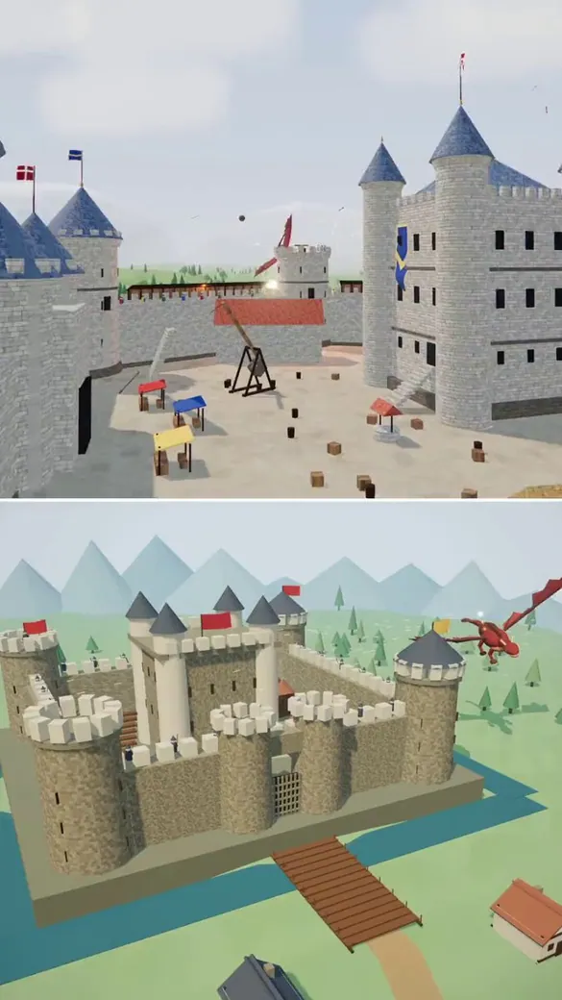
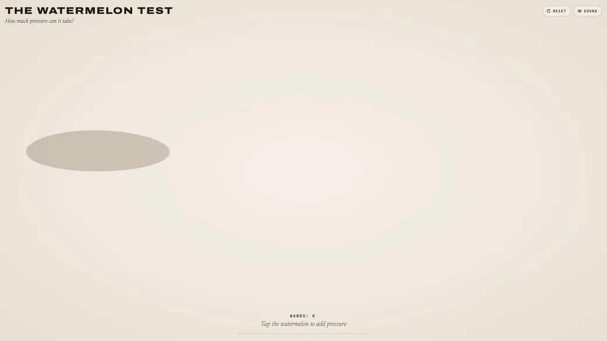
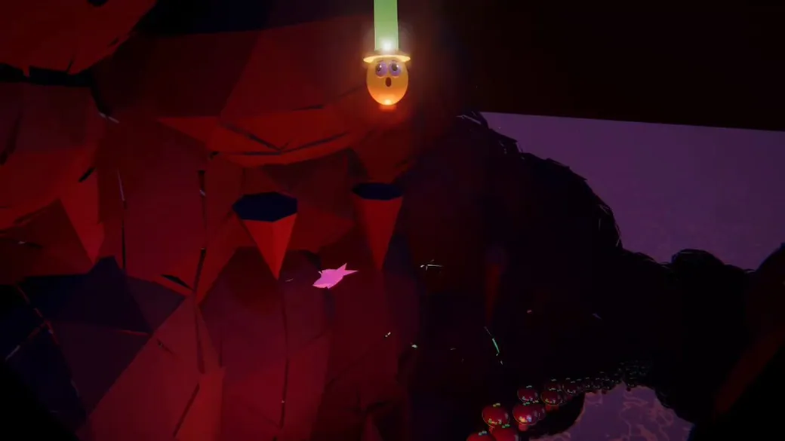
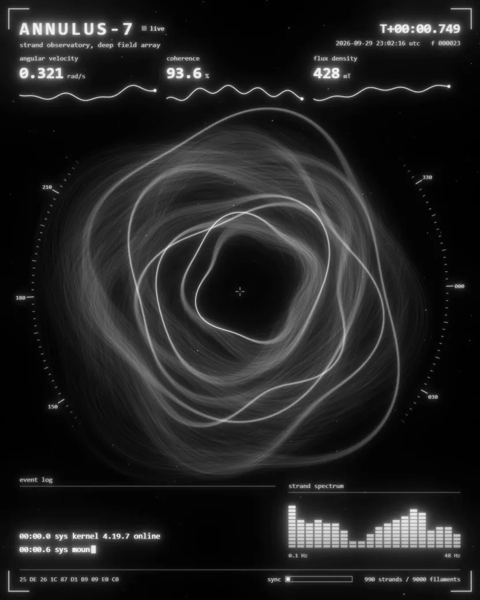
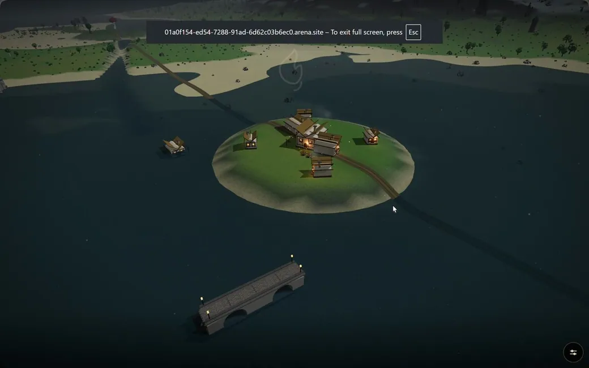

<!-- Generated from Growth CMS by templates/catalog.md. Edit content in CMS; run npm run sync. -->

# Awesome Opus 5.5 Prompts — 1 / 2

[← Awesome Opus 5.5 Prompts](../README.md)

<p>
  <a href="../docs/catalog.en.1.md"></a>
  <a href="../docs/catalog.zh.1.md"></a>
  <a href="../docs/catalog.zh-Hant.1.md"></a>
  <a href="../docs/catalog.ja.1.md"></a>
  <a href="../docs/catalog.ko.1.md"></a>
  <a href="../docs/catalog.es.1.md"></a>
  <a href="../docs/catalog.pt.1.md"></a>
  <a href="../docs/catalog.de.1.md"></a>
  <a href="../docs/catalog.fr.1.md"></a>
  <a href="../docs/catalog.it.1.md"></a>
  <a href="../docs/catalog.ru.1.md"></a>
  <a href="../docs/catalog.tr.1.md"></a>
  <a href="../docs/catalog.uk.1.md"></a>
  <a href="../docs/catalog.vi.1.md"></a>
</p>

[Vollständiger Katalog](catalog.de.md) · **1 / 2** · [→](catalog.de.2.md)

<a id="all-prompts"></a>

<details>
<summary>Beispiele ansehen (50)</summary>

- [Animierte Miniwelt mit schwebendem Bergwerk](#claude-opus-5-5-2105672081358876788)
- [Blockworld](#claude-opus-5-5-2105669581226570012)
- [Ein riesiger Drache greift in Three.js eine mittelalterliche Burg an](#claude-opus-5-5-2105659005817462972)
- [Greifbarer, dehnbarer 3D-Gummibärchen-Oktopus mit WebGPU](#claude-opus-5-5-2105607558467559666)
- [Vulkansimulation mit einer 5 km tiefen Magmakammer](#claude-opus-5-5-2105439105798513059)
- [Jelly Press](#claude-opus-5-5-2105353400040964192)
- [SPARK — Painterly-3D-Animationsshot](#claude-opus-5-5-2105315982525014067)
- [Beat-synchrones 3D-Video mit fallender Kugel](#claude-opus-5-5-2105302007896797351)
- [Jelly Press](#claude-opus-5-5-2105285992865272110)
- [Rundenbasiertes ASCII-Roguelike in einer einzigen HTML-Datei](#claude-opus-5-5-2105246199653482872)
- [Game-of-Thrones-Welt erstellen](#claude-opus-5-5-2105245648723562584)
- [Interaktives Erdbeben-Video in einer Tektonik-Sandbox](#claude-opus-5-5-2105029713445949521)
- [Mechanische Rube-Goldberg-Maschine in Blender](#claude-opus-5-5-2104953406708175097)
- [Erstelle einen Racer im Stil von Mario Kart mit 3JS](#claude-opus-5-5-2104947552328261810)
- [Interaktiver 3D-Planet im Cartoon-Stil](#claude-opus-5-5-2104919117262389255)
- [30-sekündiges 3D-Motion-Graphics-Video mit Markenbezug](#claude-opus-5-5-2104896325255037196)
- [EARTH ATLAS: DER LEBENDIGE PLANET](#claude-opus-5-5-2104837836507955401)
- [Interaktives Labor zur Simulation einer seriellen Produktionslinie](#claude-opus-5-5-2104831049020674144)
- [Laufende Architektur](#claude-opus-5-5-2104590334152056983)
- [Spielbares Pixel-Art-Beat-’em-up im antiken Rom](#claude-opus-5-5-2104571944842498150)
- [Interaktive WebGPU-Erdbeertorte](#claude-opus-5-5-2104514806443303238)
- [LEGO Ford Model T mit vollständigem Funktionsumfang](#claude-opus-5-5-2104232297167716457)
- [Hyperrealistischer Multiplayer-FPS in einer verschneiten Gasse](#claude-opus-5-5-2104232013578617241)
- [55-Sekunden-3D-Szene vom Rechenzentrum bis zum Atom](#claude-opus-5-5-2104223449849761837)
- [Dynamischer 30-sekündiger Kiiwi-Motion-Graphics-Promo](#claude-opus-5-5-2104204312624918810)
- [Anime-inspirierte 3D-CG: Drei Fahrzeuge transformieren sich und fusionieren](#claude-opus-5-5-2104193522715029657)
- [UI-Motion für eine KI-Orb in Claude Code – Opus 5.5](#claude-opus-5-5-2104162483888062945)
- [Poliertes 15-sekündiges Motion-Design-Video mit animierten Grafiken](#claude-opus-5-5-2103846630088716687)
- [Voxel-Spiel im Minecraft-Stil mit fortschrittlichen Shadern](#claude-opus-5-5-2103822946800165270)
- [Spotify-inspiriertes Motion-Graphics-Video](#claude-opus-5-5-2103801834930606193)
- [Dynamisches 15-sekündiges Motion-Design-Showreel](#claude-opus-5-5-2103504887439065439)
- [WebGL2-Sandbox-Survivalspiel](#claude-opus-5-5-2103502454750920925)
- [Durch eine 3D-Pagode navigieren](#claude-opus-5-5-2103483174957597035)
- [Frei begehbare 3D-Animestadt mit Kirschblüten](#claude-opus-5-5-2103480081809346597)
- [Motion-Graphics-Animation über den Kreislauf des Lebens](#claude-opus-5-5-2103428454355980558)
- [Interaktive 3D-Raketenstartsequenz über dem Ozean](#claude-opus-5-5-2103303303358534021)
- [Interaktives mittelalterliches Königreich für Claude Opus 5.5](#claude-opus-5-5-2103257687492374597)
- [Freiraum: Kurzfilm einer von Buntglaslicht erfüllten Kathedrale](#claude-opus-5-5-2103145567945986461)
- [Spiel im Stil von Genshin Impact in San Francisco](#claude-opus-5-5-2103144530157687114)
- [Film über die Schlacht bei Austerlitz – cinematisch erzählt](#claude-opus-5-5-2103116235009347650)
- [Den Eiffelturm in Three.js erstellen](#claude-opus-5-5-2103106070549757960)
- [Three.js-Animation auf Pixar-Niveau für Grid Genius](#claude-opus-5-5-2103087766662009118)
- [Echtzeit-Spiel mit einem Pelikan auf dem Fahrrad](#claude-opus-5-5-2103083781490176212)
- [Eine Kaiserstadt bauen](#claude-opus-5-5-2103046279253168554)
- [Einen Bugatti Chiron Super Sport in Three.js erstellen](#claude-opus-5-5-2102828216289566725)
- [Claudes Trainingsmontage zur Weiterentwicklung](#claude-opus-5-5-2102788371114246177)
- [Erstelle eine Cartoon-Animation im Stil der 90er auf Pixar-Niveau mit Three.js](#claude-opus-5-5-2102788223835463902)
- [Nahtlose, per Code erstellte Animation des Wasserkreislaufs](#claude-opus-5-5-2102781807179735211)
- [CatWalk: Ein 3D-Sidescroller mit einer Katze durch die Nacht](#claude-opus-5-5-2102775461701091531)
- [Der letzte Zug – Cyberpunk-Megacity-Benchmark](#claude-opus-5-5-2102740078347087940)

</details>
<a id="claude-opus-5-5-2105672081358876788"></a>

### Animierte Miniwelt mit schwebendem Bergwerk

[Koldo Huici](https://x.com/koldo2k) · 2026-10-01 · Claude Opus 5.5 · Szenen

<a href="https://www.tripo3d.ai/de/3d-prompts/claude-opus-5-5-2105672081358876788"></a>

**Prompt**

```text
Erstelle in Blender mit Python eine isometrische schwebende Miniwelt als nahtlosen Loop: eine kleine Bergbauinsel mit einem terrassierten Berg, zwei Tunneln und einer Grubenbahn, die durch den Berg fährt und eine Schleife bildet, einen Teich, dessen Bach über den Rand als Wasserfall hinabstürzt, sowie Gesteinsschichten mit leuchtenden Kristallen an den Schnittflächen. Die Arbeiter sind kleine Claude-Bots: Einer baut eine Kristallader ab und wird von einer Fledermaus erschreckt, einer bedient einen Kran und kippt Kristalle in jeden vorbeifahrenden Wagen, einer angelt im Teich und einer fährt in einem Wagen mit. Bringe über dem Bergwerkseingang ein Holzschild mit der Aufschrift „TOKENS“ an. Der Sound soll mit jeder Aktion synchronisiert sein.
```

<details>
<summary>Original-Prompt</summary>

```text
Make an isometric floating mini-world in Blender, animated with Python, as a seamless loop: a small mine island with a terraced mountain, two tunnels and a railway that loops through the mountain, a pond whose stream falls off the edge as a waterfall, and rock layers with glowing crystals on the cut sides. The workers are little Claude bots: one mines a crystal vein and gets startled by a bat, one runs a crane that dumps crystals into each passing cart, one fishes in the pond, and one rides a cart. Put a wooden "TOKENS" sign over the mine entrance. Sound synced to every action.
```

</details>

[Details ansehen ↗](https://www.tripo3d.ai/de/3d-prompts/claude-opus-5-5-2105672081358876788) · [Originalbeitrag](https://x.com/koldo2k/status/2105672083908825404) · [Zurück zu den Beispielen](#all-prompts)

---

<a id="claude-opus-5-5-2105669581226570012"></a>

### Blockworld

[semperphoenix.com](https://semperphoenix.com/) · 2026-10-01 · Claude Opus 5.5 · Spiele

<a href="https://www.tripo3d.ai/de/3d-prompts/claude-opus-5-5-2105669581226570012"></a>

**Prompt**

```text
Kannst du einen Minecraft-Klon erstellen?
```

<details>
<summary>Original-Prompt</summary>

```text
Can you create a Minecraft clone?
```

</details>

[Details ansehen ↗](https://www.tripo3d.ai/de/3d-prompts/claude-opus-5-5-2105669581226570012) · [Originalbeitrag](https://semperphoenix.com/lab) · [Zurück zu den Beispielen](#all-prompts)

---

<a id="claude-opus-5-5-2105659005817462972"></a>

### Ein riesiger Drache greift in Three.js eine mittelalterliche Burg an

[ReconScribe](https://x.com/ReconScribe) · 2026-10-01 · Claude Opus 5.5 · Szenen

<a href="https://www.tripo3d.ai/de/3d-prompts/claude-opus-5-5-2105659005817462972"></a>

**Prompt**

```text
ein riesiger Drache, der eine mittelalterliche Burg und ihr Dorf angreift, erstellt in Three.js.
```

<details>
<summary>Original-Prompt</summary>

```text
a giant dragon attacking a medieval castle and its village, built in Three.js.
```

</details>

[Details ansehen ↗](https://www.tripo3d.ai/de/3d-prompts/claude-opus-5-5-2105659005817462972) · [Originalbeitrag](https://x.com/ReconScribe/status/2105659005817462972) · [Zurück zu den Beispielen](#all-prompts)

---

<a id="claude-opus-5-5-2105607558467559666"></a>

### Greifbarer, dehnbarer 3D-Gummibärchen-Oktopus mit WebGPU

[林悦己Cheer](https://x.com/cheerselflin) · 2026-10-01 · Claude Opus 5.5 · Interaktiv

<a href="https://www.tripo3d.ai/de/3d-prompts/claude-opus-5-5-2105607558467559666"></a>

**Prompt**

```text
Erstelle ein Ziel mit einem Token-Budget von 200.000. Berichte am Ende über den tatsächlichen Tokenverbrauch, die Budgetauslastung und die Laufzeit. Wenn eine Aufschlüsselung in Eingabe-, Cache-Eingabe- und Ausgabe-Tokens verfügbar ist, schätze die Kosten in US-Dollar anhand der aktuellen Modellpreise und führe die Berechnungsgrundlage klar auf. Mir ist bewusst, dass es sich um ein Abonnementkontingent handelt, aber wir können es in API-Kosten umrechnen.

Erstelle „Octo Jelly“ – einen wunderschönen, interaktiven 3D-Gummibärchen-Oktopus, den Nutzer direkt im Browser greifen, dehnen und zusammendrücken können. Liefere eine vollständige Erfahrung als einzelne HTML-Datei mit echter WebGPU-Unterstützung.
GESTALTUNG
Der Oktopus soll wie ein hochwertiges, transparentes Gummibärchen aussehen: ein rundlicher Kopf, acht eingerollte Tentakel, kleine Saugnäpfe und ein niedliches, zurückhaltendes Gesicht.
Verwende einen warmen, gebrochen weißen Hintergrund, weiches Studiolicht und einen dezenten Bodenschatten. Halte die Szene elegant und übersichtlich, mit einem großen, zentral platzierten Oktopus.
GEOMETRIE UND MATERIAL

* Erzeuge die gesamte Geometrie prozedural. Keine externen Modelle oder Bilddateien.
* Verbinde alle acht Tentakel nahtlos mit dem Körper – ohne sichtbare Lücken oder schwebende Teile.
* Füge abgerundete Saugnäpfe hinzu, die auch bei der Verformung der Tentakel befestigt bleiben.
* Verwende ein glänzendes, transparentes Jelly-Material mit einer von der Dicke abhängigen Farbabsorption, Brechung, weicher Lichtstreuung im Inneren und dezenten Kantenlichtern.
* Dicke Bereiche sollen eine kräftigere Farbe haben; dünne Tentakelspitzen sollen mehr Licht durchlassen.
* Vermeide undurchsichtiges Plastik, überstrahlte Highlights und sichtbare Mesh-Nähte.

SOFT-BODY-PHYSIK
Verwende ein stabiles Masse-Feder-System oder eine positionsbasierte Dynamik mit elastischen Constraints und einer näherungsweisen Volumenerhaltung.

* Der Kopf soll weich, aber substanzvoll wirken.
* Die Tentakel sollen flexibler sein als der Kopf, besonders in der Nähe ihrer Spitzen.
* Nutzer sollen den Kopf oder jeden beliebigen Tentakel an der angeklickten Stelle greifen können.
* Beim Ziehen soll sich zunächst die nahegelegene Geometrie verformen und anschließend der restliche Körper elastisch mitgezogen werden.
* Nach dem Loslassen soll der Oktopus wackeln und allmählich in seine ursprüngliche Form zurückkehren.
* Die Tentakel sollen unabhängig voneinander reagieren und sich leicht verzögert bewegen.
* Integriere Gravitation, Kollisionen mit dem Boden, Reibung und Dämpfung.
* Verhindere, dass Tentakel den Boden durchdringen.
* Begrenze extremes Dehnen und verwende feste Simulationsschritte, damit starke Züge das Modell nicht zerstören.
* Simuliere die Weichheit nicht einfach durch Skalieren oder Drehen des gesamten Oktopus.

INTERACTION

* Mit Linksklick oder per Touch den Oktopus greifen und dehnen.
* Mit der rechten Maustaste ziehen oder durch Ziehen in einem leeren Bereich die Kamera sanft umkreisen.
* Einen begrenzten Zoombereich unterstützen.
* Kameragesten und Objektziehen voneinander trennen.
* Füge die Schaltflächen „Anstupsen“, „Zurücksetzen“, „Pause“ und „Ansicht zurücksetzen“ hinzu.
* Füge Regler für Festigkeit und interne Dämpfung hinzu.
* Füge Schalter für „¼ Geschwindigkeit“ und „Mesh anzeigen“ hinzu.
* Biete drei Farb-Presets an: Coral, Lagoon und Grape. Ändere die Materialfarben, ohne die Simulation zurückzusetzen.

INTERFACE
Verwende ein reduziertes, redaktionelles Layout:

* Oben links: ein kleines Label „MATERIAL STUDIES“.
* Große kursive Serifenschrift als Überschrift: „Octo Jelly“.
* Bildunterschrift: „Acht Arme. Ein kleines Wackeln. Ein sehr weiches Wesen.“
* Oben rechts: eine WebGPU-Statusanzeige.
* Rechte Seite: ein kompaktes Bedienfeld „THE SPECIMEN“.
* Unten links: „Greif einen Tentakel. Zieh vorsichtig. Lass los.“

Verwende eine klare serifenlose Schrift für die Bedienelemente, feine Rahmen und großzügige Abstände. Vermeide wuchtige Bedienfelder und dekorative UI-Effekte.
PERFORMANCE UND QUALITÄT

* Verwende echtes WebGPU-Rendering, keine Imitation mit einem 2D-Canvas und keine vorab aufgezeichnete Animation.
* Verwende Geometrie und Buffer wieder; baue die Meshes während des Ziehens nicht neu auf.
* Halte Saugnäpfe, Augen und andere Details am sich verformenden Körper befestigt.
* Behandle Transparenz ohne Flackern, verschwindende Oberflächen oder harte schwarze Kanten.
* Unterstütze Layouts für Desktop und Mobilgeräte.
* Zeige eine klare Fallback-Nachricht an, wenn WebGPU nicht verfügbar ist.
* Teste wiederholtes Greifen, kräftiges Ziehen, Loslassen, Bodenkollisionen, Palettenwechsel, Pause und Zurücksetzen.

Das Ergebnis soll sich wie ein kleines lebendiges Gummibärchen-Spielzeug anfühlen – glänzend, quetschweich, ausdrucksstark und befriedigend zu dehnen. Liefere die vollständige funktionsfähige HTML-Datei, kein Mock-up und kein Codefragment.
```

<details>
<summary>Original-Prompt</summary>

```text
创建一个 token 预算为 200,000 的 Goal。结束时报告实际消耗 token、预算使用率和运行时间；如果能够获得输入、缓存输入、输出 token 的拆分，则按照当前模型价格估算美元费用，并明确列出计算依据。我知道是订阅额度，但是我们可以换算成api计费

Create “Octo Jelly” - a beautiful, interactive 3D gummy octopus that users can grab, stretch, and squish directly in their browser. Deliver a complete single-file HTML experience using genuine WebGPU.
ART DIRECTION
Make the octopus look like a premium translucent gummy candy: a rounded head, eight curled tentacles, small suction cups, and a cute, understated face.
Use a warm off-white background, soft studio lighting, and a subtle ground shadow. Keep the scene elegant and uncluttered, with the octopus large and centered.
GEOMETRY AND MATERIAL

* Generate all geometry procedurally. No external models or image files.
* Connect all eight tentacles smoothly to the body, without visible gaps or floating parts.
* Add rounded suction cups that stay attached as the tentacles deform.
* Use glossy, translucent jelly with thickness-dependent color absorption, refraction, soft internal light scattering, and delicate rim highlights.
* Thick areas should have richer color; thin tentacle tips should transmit more light.
* Avoid opaque plastic, blown-out highlights, and visible mesh seams.

SOFT-BODY PHYSICS
Use a stable mass-spring or position-based dynamics system with elastic constraints and approximate volume preservation.

* The head should feel soft but substantial.
* Tentacles should be more flexible than the head, especially near their tips.
* Allow users to grab the head or any tentacle at the clicked location.
* Pulling should deform the nearby geometry first, then elastically pull the rest of the body.
* On release, the octopus should wobble and gradually settle into its original shape.
* Tentacles should react independently, with slightly delayed motion.
* Include gravity, floor collisions, friction, and damping.
* Prevent tentacles from passing through the floor.
* Clamp extreme stretching and use fixed simulation steps so strong pulls do not break the model.
* Do not fake softness by scaling or rotating the entire octopus.

INTERACTION

* Left-click or touch the octopus to grab and stretch it.
* Right-drag or drag empty space to gently orbit the camera.
* Support a limited zoom range.
* Keep camera gestures separate from object dragging.
* Add “Give it a nudge,” “Reset,” “Pause,” and “Reset view” buttons.
* Include Firmness and Internal damping sliders.
* Add “¼ speed” and “Show mesh” toggles.
* Provide three color presets: Coral, Lagoon, and Grape. Change the material colors without resetting the simulation.

INTERFACE
Use a minimal editorial layout:

* Top left: small “MATERIAL STUDIES” label.
* Large italic serif heading: “Octo Jelly.”
* Caption: “Eight arms. A little wobble. A very soft creature.”
* Top right: a WebGPU status indicator.
* Right side: a compact “THE SPECIMEN” control panel.
* Bottom left: “Grab a tentacle. Pull gently. Let go.”

Use clean sans-serif text for controls, thin borders, and generous whitespace. Avoid heavy panels or decorative UI effects.
PERFORMANCE AND QUALITY

* Use real WebGPU rendering, not a 2D canvas imitation or prerecorded animation.
* Reuse geometry and buffers; do not rebuild meshes during dragging.
* Keep suction cups, eyes, and other details attached to the deforming body.
* Handle transparency without flickering, disappearing surfaces, or harsh black edges.
* Support desktop and mobile layouts.
* Show a clear fallback message if WebGPU is unavailable.
* Test repeated grabs, strong pulls, releases, floor collisions, palette changes, pause, and reset.

The result should feel like a little living gummy toy - glossy, squishy, expressive, and satisfying to stretch. Deliver the full working HTML, not a mockup or a code fragment.
```

</details>

[Details ansehen ↗](https://www.tripo3d.ai/de/3d-prompts/claude-opus-5-5-2105607558467559666) · [Originalbeitrag](https://x.com/cheerselflin/status/2105607558467559666) · [Zurück zu den Beispielen](#all-prompts)

---

<a id="claude-opus-5-5-2105439105798513059"></a>

### Vulkansimulation mit einer 5 km tiefen Magmakammer

[Konstantin Saifoulline](https://x.com/konstantinsaifo) · 2026-09-30 · Claude Opus 5.5 · Animation

<a href="https://www.tripo3d.ai/de/3d-prompts/claude-opus-5-5-2105439105798513059"></a>

**Prompt**

```text
Erstelle mit Opus 5.5 eine Vulkansimulation. Die Magmakammer liegt 5 km tief.
```

<details>
<summary>Original-Prompt</summary>

```text
Build with Opus 5.5 a volcano simulation. Magma chamber 5 km down.
```

</details>

[Details ansehen ↗](https://www.tripo3d.ai/de/3d-prompts/claude-opus-5-5-2105439105798513059) · [Originalbeitrag](https://x.com/konstantinsaifo/status/2105439105798513059) · [Zurück zu den Beispielen](#all-prompts)

---

<a id="claude-opus-5-5-2105353400040964192"></a>

### Jelly Press

[Vib3Coded](https://x.com/vib3coded) · 2026-09-30 · Claude Opus 5.5 · Interaktiv

<a href="https://www.tripo3d.ai/de/3d-prompts/claude-opus-5-5-2105353400040964192"></a>

**Prompt**

```text
Erstelle „Jelly Press“: ein interaktives 3D-Spielzeug in einer einzigen HTML-Datei (sämtliches JS, CSS und alle WGSL-Shader inline, keine externen Assets außer Google Fonts). Rendere mit WebGPU. Falls WebGPU oder ein Adapter fehlt, zeige eine klare Fallback-Meldung statt einer leeren Seite.

KONZEPT
Vier durchscheinende Gummibonbons in Fruchtscheibenform liegen einzeln auf der Stahlplatte einer Hydraulikpresse. Der Spieler hält einen großen roten Knopf gedrückt, um die Presse abzusenken. Das Gummibonbon wird zerquetscht und breitet sich aus, die Druckanzeige steigt, und irgendwo ab einer Höhe von mehr als der Hälfte zerplatzt es in Stücke. Danach endet das Spiel NICHT: Der Spieler kann die Stücke greifen, ziehen, herumwerfen und erneut zerquetschen.

DIE GUMMIBONBONS (Chips unten, Tasten 1–4)
1. Wassermelonenstück (Halbscheibe): rotes Fruchtfleisch mit dunklen, tropfenförmigen Kernen, ein helles Rindenband und eine grün gestreifte Schale.
2. Orangenscheibe (Halbscheibe): orange Fruchtfleischsegmente, getrennt durch dünne weiße Häutchen, helles Mesokarp und Orangenschale.
3. Feigenhälfte: rosafarbenes Fruchtfleisch mit vielen kleinen goldenen Kernen, eine cremefarbene Schicht und dunkelviolette Schale.
4. Ananasring: goldenes, faseriges Fruchtfleisch mit radialen Streifen und einem Loch in der Mitte.

Jedes Gummibonbon soll wie echtes Fruchtgummi aussehen: Subsurface Scattering, weiche Transluzenz, glänzende spekulare Highlights und weiche Schatten auf einem warmen Studioboden (Creme/Beige, tonemapped).

PHYSIK (CPU, fester Schritt mit 60 Hz)
- XPBD-Tetraeder-Softbody mit 8 Substeps: korotationale Formanpassung pro Tetraeder, Volumen-Constraints pro Tetraeder, harte Grenzwerte für die Kantenverformung (0,35×–1,8×), Dämpfung der Kantengeschwindigkeit, Bodenkontakt mit Coulomb-Reibung, Rollwiderstand und sanftes Einpendeln bei nahezu vollständigem Stillstand.
- Das Render-Mesh wird auf der CPU über baryzentrisches Embedding in den Tetraedern geskinnt; die Normalen werden in jedem Frame aus den Dreiecken neu berechnet.
- Der Pressstempel ist eine kinematische runde Druckplatte (Radius ca. 1,05, abgerundete Kante, eigene Stärke und ein darüberliegender Stößel). Sie fungiert unten als Decke mit Reibung, oben als Ablage und an ihrem Rand als Seitenwand. Die beiden Pressensäulen sind massiv.
- Die Druckanzeige in bar wird aus der Kontaktlast der Druckplatte abgeleitet und je nach Frucht skaliert.

DAS ZERPLATZEN
- Bruch bei einer zufälligen Stauchung zwischen 52 % und 66 % der Höhe des Gummibonbons.
- Plane die Bruchstruktur kurz nach Beginn jeder Runde im Hintergrund, damit das Zerplatzen selbst sofort erfolgt.
- 5–7 große Stücke aus 3D-Voronoi-Zellen mit leicht geneigten Wänden. Bei 3–4 davon wird eine entfernte Ecke durch zwei Schnittebenen abgetrennt und anschließend weiter in 2–4 kleine Splitter geteilt, wodurch gezackte, eingekerbte Kanten entstehen.
- Weise die Tetraeder anhand ihres Schwerpunkts den Zellen zu. Dupliziere Partikel für jeden Bruchteil. Führe winzige Inseln mit ihren Nachbarn zusammen.
- Der neue Körper übernimmt die bisherigen Positionen und Geschwindigkeiten.
- Clipping der Skin-Dreiecke gegen die Halbräume jeder Zelle; fülle jede Schnittfläche mit einer sauberen, flachen Kappe, die das Innere der Frucht zeigt (Fruchtfleisch, Kerne, Häutchen). Keine verzogenen Dreiecke, keine Löcher.
- Schleudere die Stücke nach außen und oben aus der Presse. Kleine Splitter fliegen schneller und höher und trudeln mit zufälliger Rotation.
- Zeige etwa 2,5 s lang ein großes kursives Urteil und blende es anschließend aus: „Matsch.“ (Melone), „Ausgequetscht.“ (Orange), „Na, das ist jetzt Marmelade.“ (Feige), „Zerdrückt.“ (Ananas). Füge eine Statistikzeile hinzu: „Gab bei N bar und N % seiner Höhe auf.“

NACH DEM ZERPLATZEN: SPIELMODUS
- Aufheben: Ray-/Dreieckstest gegen das geskinte Mesh, mit einem toleranten Fallback im Bildschirmraum für Touch-Eingaben.
- Beim Greifen wird der erfasste Bereich (Radius ca. 0,4, nur Partikel dieses Bruchteils) an einem Zielpunkt auf einer zur Kamera ausgerichteten Ziehebene fixiert. Kleine Splitter bewegen sich als Ganzes; große Stücke dehnen und schwingen wie Gummibonbons.
- Beim Loslassen wird das Stück mit der Geschwindigkeit des Zeigers geworfen.
- Die Stücke kollidieren miteinander. Befindet sich ein Partikel innerhalb des Tetraeders eines anderen Bruchteils, wird es durch dessen nächstgelegene Skin-Fläche herausgedrückt, mit Reibung. Verwende eine Broad Phase über die AABBs der Bruchteile und einen Spatial Hash der Skin-Tetraeder.
- Die Stücke bleiben auf der Bühne: Seitenwände sowie eine unsichtbare vordere Kante verhindern, dass etwas unter den Steuerelementen oder hinter der Kamera landet.
- Die Presse funktioniert weiterhin: Gedrückthalten, um die Stücke erneut zu zerquetschen (kein zweiter Bruch); „Anheben“ hebt die Druckplatte.
- Feuchte „Plopp“-Sounds bei der Landung; ein leises Schmatzen beim Greifen.
- Cursor: offene Hand über den Stücken, geschlossene Hand beim Ziehen. Ziehen in leerem Raum orbitert die Kamera.

UI (redaktionell, minimal)
- Kopfzeile oben links: „JELLY PRESS“ in fetten, schmalen Versalien, wobei „PRESS“ mit gelb-schwarzen Warnstreifen gefüllt ist. Untertitel: „Vier Gummibonbons. Eine Hydraulikpresse.“
- Oben rechts: Zurücksetzen und Sound-Umschalter.
- Unteres Bedienfeld:
  - Beschriftungszeile mit ansteigenden Texten während des Pressens: „Kontakt.“ → „Alles gut. Ist ja nur Gummi.“ → „Wird breiter.“ → „Das ist jetzt ein Pfannkuchen.“ → „Es macht ein Geräusch.“ → „Bitte.“
  - Kreisförmige Druckanzeige (Bogen von 0–400 bar, roter Bereich) um einen roten HALTEN-Knopf, einen ANHEBEN-Knopf und eine große numerische Balkenanzeige.
  - Frucht-Chips mit Icons.
- Im Spielmodus zeigt der Beschriftungsbereich „Greif ein Stück. Wirf es.“ mit kleinen Schaltflächen „Erneut pressen“ und „Nächstes Gummibonbon“.
- Steuerung: Leertaste oder Pfeil nach unten gedrückt halten zum Pressen, Pfeil nach oben zum Anheben, R zum Zurücksetzen, 1–4 zur Auswahl einer Frucht. Mausrad zoomt; Doppelklick setzt die Ansicht zurück.
- Kamera: niedrige Perspektive auf Höhe der Werkbank; der Pressenrahmen dreht sich je nach Frucht um die Hochachse, damit die Säulen das Gummibonbon nie verdecken. Das Framing passt sich an, sodass das Gummibonbon zwischen Kopfzeile und Bedienfeld sitzt; funktioniert auch auf Smartphones im Hochformat mit einer schmaleren Bühne.

SOUND (prozedurales Web Audio, keine Dateien)
Hydraulisches Motorbrummen, das mit dem Druck ansteigt, feuchte Schmatzgeräusche, gelegentliches Knarzen bei hohem Druck, ein Ventilklacken beim Stoppen der Druckplatte, ein lautes Zerplatzen und sanfte Plopp-Geräusche bei der Landung. Beim ersten Interagieren freischalten.

QUALITÄTSANSPRUCH
- Flüssige 60 fps auf einem Laptop.
- Aufwärmen der Meshes und Shader der anderen Früchte im Hintergrund, damit der Wechsel sofort erfolgt.
- prefers-reduced-motion berücksichtigen.
- Zugängliche Labels, eine Anzeige mit role=meter und focus-visible-Umrandungen.
- Keine Fehler in der Konsole. Die Seite darf niemals leer bleiben.
```

<details>
<summary>Original-Prompt</summary>

```text
Create "Jelly Press": a single-file interactive 3D toy in HTML (all JS, CSS and WGSL shaders inline, no external assets except Google Fonts). Render with WebGPU; if WebGPU or an adapter is missing, show a clean fallback message instead of a blank page.  CONCEPT Four translucent gummy jellies shaped like fruit slices sit one at a time on the steel bed of a hydraulic press. The player holds a big red button to lower the press. The jelly squashes and spreads, the pressure gauge climbs, and somewhere past half its height it bursts into pieces. After the burst the game does NOT end: the player can grab the pieces, drag them, throw them around, and squash them again.  THE JELLIES (chips at the bottom, keys 1–4) 1. Watermelon wedge (half-disc slab): red flesh with dark teardrop seeds, a pale rind band, a green striped skin. 2. Orange slice (half-disc): orange pulp segments separated by thin white membranes, pale pith, orange peel. 3. Fig half: pink flesh full of small golden seeds, a cream layer, a dark purple skin. 4. Pineapple ring: golden fibrous flesh with radial streaks and a hole in the middle. Each jelly should look like real gummy candy: subsurface scattering, soft translucency, glossy specular highlights, soft shadows on a warm studio floor (cream/beige, tone-mapped).  PHYSICS (CPU, fixed 60 Hz step) - XPBD tetrahedral soft body with 8 substeps: co-rotational per-tet shape matching, per-tet volume constraints, hard edge strain limits (0.35×–1.8×), edge velocity damping, floor contact with Coulomb friction, rolling resistance, and gentle settling when nearly still. - Render mesh skinned on the CPU through barycentric embedding in the tets; normals recomputed from triangles every frame. - The press die is a kinematic round platen (radius ~1.05, rounded edge, a thickness, a ram above it). It acts as a ceiling with friction below, a shelf on top, and a side wall at its rim. The two press posts are solid. - Pressure readout in bar comes from the platen's contact load, scaled per fruit.  THE BURST - Break at a random squash between 52% and 66% of the jelly's height. - Plan the fracture in the background shortly after each round starts, so the burst itself is instant. - 5–7 big pieces from 3D Voronoi cells with slightly tilted walls. On 3–4 of them, a far corner is chipped off by two cutting planes and split further into 2–4 small chips, which leaves jagged, notched edges. - Assign tets to cells by centroid. Duplicate particles per chunk. Merge tiny islands into their neighbours. - The new body adopts the old positions and velocities. - Clip the skin triangles against each cell's half-spaces, and fill every cut face with a clean flat cap showing the fruit's interior (flesh, seeds, membranes). No stretched triangles, no holes. - Kick pieces outward and upward from the press. Small chips fly faster and higher and tumble with random spin. - Show a big italic verdict for about 2.5 s, then fade it: "Splat." (melon), "Squeezed." (orange), "Well, that's jam." (fig), "Crushed." (pineapple). Include a stat line: "Gave up at N bar and N% of its height."  AFTER THE BURST: PLAY MODE - Picking: ray/triangle test against the skinned mesh, with a forgiving screen-space fallback for touch. - Grabbing pins the grabbed patch (radius ~0.4, only particles of that chunk) to a target on a camera-facing drag plane. Small chips move whole; big pieces stretch and swing like jelly. - Releasing throws the piece with the pointer's velocity. - Pieces collide with each other. A particle found inside another chunk's tet is pushed out through that chunk's nearest skin face, with friction. Use a chunk AABB broad phase and a spatial hash of skin tets. - Pieces stay on stage: side walls, plus an invisible front edge so nothing ends up under the controls or behind the camera. - The press still works: hold to squash the pieces again (no second fracture); Raise lifts the platen. - Wet "plop" sounds on landings; a small squelch on grab. - Cursor: open hand over pieces, closed hand while dragging. Dragging empty space orbits the camera.  UI (editorial, minimal) - Masthead top-left: "JELLY PRESS" in bold condensed caps, with "PRESS" filled in yellow/black hazard stripes. Subtitle: "Four gummies. One hydraulic press." - Top-right: Reset and Sound toggle. - Bottom deck:   - Caption line with escalating captions while pressing: "Contact." → "It's fine. It's jelly." → "Getting wider." → "That's a pancake now." → "It's making a noise." → "Please."   - Circular pressure dial (0–400 bar arc, red zone) around a red HOLD button, a Raise button, and a big numeric bar readout.   - Fruit chips with icons. - In play mode the caption slot shows "Grab a piece. Throw it." with small "Press again" and "Next jelly" buttons. - Controls: hold Space or ArrowDown to press, ArrowUp to raise, R to reset, 1–4 to pick a fruit. Wheel zooms; double-click resets the view. - Camera: low bench-level view; the press frame yaws per fruit so the posts never block the jelly. Framing adapts so the jelly sits between masthead and deck; works on phones (portrait) with a narrower stage.  SOUND (procedural Web Audio, no files) Hydraulic motor hum that rises with pressure, wet squelches, occasional creaks at high pressure, a valve clunk when the platen stops, a loud burst, soft plops on landing. Unlock on first interaction.  QUALITY BAR - Smooth 60 fps on a laptop. - Background warm-up of the other fruits' meshes and shaders so switching is instant. - Respect prefers-reduced-motion. - Accessible labels, a gauge with role=meter, focus-visible outlines. - No console errors. The page never goes blank.
```

</details>

[Details ansehen ↗](https://www.tripo3d.ai/de/3d-prompts/claude-opus-5-5-2105353400040964192) · [Originalbeitrag](https://x.com/vib3coded/status/2105353559327887843) · [Zurück zu den Beispielen](#all-prompts)

---

<a id="claude-opus-5-5-2105315982525014067"></a>

### SPARK — Painterly-3D-Animationsshot

[Shikhar](https://x.com/xikhar) · 2026-09-30 · Claude Opus 5.5 · Animation

<a href="https://www.tripo3d.ai/de/3d-prompts/claude-opus-5-5-2105315982525014067"></a>

**Prompt**

```text
TITEL: „SPARK“

Ein etwa 15 Sekunden langer 3D-Animationsshot im malerischen Stil der Serie Arcane (Fortiche).

Erstellt in Blender oder einem anderen Tool, falls dieses besser geeignet ist. Breitbildformat, kein Dialog.

GOAL

Oberste Priorität ist die möglichst perfekte Nachbildung des visuellen Stils und Animationsstils von Arcane in jeder Hinsicht. Wer zusieht, soll glauben, der Shot stamme aus demselben Studio.

Nimm dir so viel Zeit und Mühe wie nötig. Bilde Technik und Look perfekt nach. Arbeite so lange daran, wie erforderlich, und stelle sicher, dass alles in jeder Hinsicht perfekt ist.

SZENE (frei gehalten – passe sie nach Belieben an)

Ein kleines mechanisches Wesen (nicht humanoid), etwa eine Motte aus Messing und Kristall, erwacht nachts auf der überladenen Werkbank eines Erfinders. Sein Kristallkern entzündet sich mit leuchtender Energie, und in einem Wirbel aus Funken schießt es in die Luft. Ändere Details, Bildausschnitt oder Handlung, wenn sich der Stil dadurch besser zur Geltung bringen lässt. Du kannst auch etwas völlig anderes animieren – ganz nach deiner Wahl und entsprechend dem, was du am besten umsetzen kannst –, solange es ebenfalls genauso aussieht wie Arcane.

PROCESS

1. RECHERCHE: Studiere den Stil von Arcane gründlich, bevor du irgendetwas erstellst. Suche nach Referenzen und Analysen der Technik von Fortiche (Interviews, Making-of-Material, Künstler- und Breakdown-Analysen). Notiere jedes charakteristische Element: Texturen, Shading, Linienführung, Farben, Beleuchtung, Bildrate, Effekte, Kamera und Compositing.

2. STYLEGUIDE: Verwandle diese Erkenntnisse vor der Animation in eine schriftliche Checkliste und ein kleines Styleframe (ein einzelnes Standbild). Vergleiche es nebeneinander mit Referenz-Standbildern und überarbeite es, bis es übereinstimmt.

3. UMSETZUNG: Modelliere, texturiere, beleuchte und animiere nach dieser Checkliste.

4. REVIEW: Vergleiche die Frames wiederholt mit Arcane-Referenzen. Liste jeden sichtbaren Unterschied auf und behebe ihn. Wiederhole den Vorgang, bis keine auffälligen Unterschiede mehr vorhanden sind.

ANZUPASSENDE STILELEMENTE (mindestens)

- Handgemalte Texturen mit sichtbaren Pinselstrichen auf jeder Oberfläche; nichts soll prozedural oder fotorealistisch wirken.

- Stilisierte, malerische Schattierung mit bewusst gestalteten Licht- und Schattenformen statt realistischem Lichtabfall.

- Figuren und Objekte auf Zweien animieren, mit starken Posen, knackigem Timing, Antizipation und Verwischbildern; Kamerabewegungen flüssig auf Einsern.

- Handgezeichnete 2D-Effekte (Funken, Energie, Rauch, Glanzlichter, Glow), über dem 3D-Look angelegt, auf Zweien animiert und mit grafischer Formensprache.

- Kräftige, stimmungsvolle Farben: warmes Licht im Kontrast zu gesättigten Leuchtakzenten, farbige, satte Schatten, starkes Kantenlicht und Bloom.

- Malerisches Compositing: pinselartige Filter, Körnung und eine dezente Textur über dem Bild.

- Filmische Kamera: geringe Schärfentiefe, gezielte Bewegungen und spürbares Gewicht bei Aufprallen.

SOUND

Detailliertes, filmisches Sounddesign, das zu Handlung und Stimmung passt.

Mach alles so gut wie möglich: Animation, Modelle, Texturen, Effekte, Beleuchtung und Sound. Verwende alle nötigen Tools oder Programme. Du darfst Referenzen online studieren und Techniken imitieren sowie Dinge kopieren, aber nutze keine Assets direkt, die du nicht selbst erstellt hast. Halte den gesamten Shot in einem konsistenten Stil, damit 3D, gemalte Texturen und 2D-Effekte wie ein einziges handgefertigtes Bild wirken.

Verwende weder dein Gedächtnis noch frühere Chats.

Du kannst beliebige andere Tools, Programme, Plugins – buchstäblich alles – verwenden. Nutze alles, was dir zur Verfügung steht.

Du kannst andere als die hier beschriebenen Abläufe verwenden oder etwas anderes als die beschriebene Szene animieren, aber es sollte unbedingt so nah wie möglich an der Fernsehserie Arcane aussehen. Mach alles in jeder Hinsicht perfekt und identisch.
```

<details>
<summary>Original-Prompt</summary>

```text
TITLE: "SPARK"

An around 15-second 3D animated shot in the painterly style of the show Arcane (Fortiche).

Made in Blender, or any other tool if superior. Widescreen, no dialogue.

GOAL

The top priority is replicating Arcane's visual and animation style as perfectly as possible, in every way. Someone watching should believe it came from the same studio.

Take as much time and effort as needed. Replicate the technique and look perfectly. Spend as much time as needed, ensuring it's perfect in every way.

SCENE (loose — adapt freely)

A small mechanical creature (not humanoid), something like a brass-and-crystal moth, wakes up on a cluttered inventor's workbench at night. Its crystal core ignites with glowing energy, and it bursts into the air in a swirl of sparks. Change the details, framing, or action if something else shows off the style better. You can animate something else completely different if you want—anything you pick, whatever you can do best—that will also look identical to Arcane.

PROCESS

1. RESEARCH: Before building anything, study Arcane's style in depth. Find references and breakdowns of Fortiche's technique (interviews, making-of material, artist breakdowns). Write down every defining element: textures, shading, line work, color, lighting, frame rate, effects, camera, compositing.

2. STYLE GUIDE: Turn that into a written checklist and a small style frame (a single still image) before animating. Compare it side by side with reference stills and revise until it matches.

3. BUILD: Model, texture, light, and animate following the checklist.

4. REVIEW: Compare frames against Arcane references repeatedly. List every difference you can see and fix it. Repeat until no noticeable differences remain.

STYLE ELEMENTS TO MATCH (at minimum)

- Hand-painted textures with visible brushstrokes on every surface; nothing looks procedural or photographic.

- Stylized, painterly shading with designed light/shadow shapes, not realistic falloff.

- Animation on 2s for characters/objects, with strong poses, snappy timing, anticipation, and smear frames; camera moves smooth on 1s.

- Hand-drawn 2D effects (sparks, energy, smoke, glints, glow) layered over the 3D, animated on 2s with graphic shape language.

- Bold, moody color: warm light vs. saturated glowing accents, rich colored shadows, strong rim light, bloom.

- Painterly compositing: brush-like filtering, grain, subtle texture over the image.

- Cinematic camera: shallow depth of field, purposeful movement, weight on impacts.

SOUND

Detailed, cinematic sound design that matches the action and mood.

Make everything as good as possible: animation, models, textures, effects, lighting, and sound. Use any tools or programs needed. You may study references online and imitate techniques, and copy things, but do not directly use assets you did not create. Keep the whole shot in one consistent style so the 3D, painted textures, and 2D effects feel like a single hand-crafted image.

Do not use memory or previous chats.

You can use any other tools, programs, plugins, literally anything. Use anything at your disposal.

You can use different processes than outlined in this, or animate something else than described, but it should absolutely look as close as possible to the TV show Arcane. Make it perfect in every way and identical.
```

</details>

[Details ansehen ↗](https://www.tripo3d.ai/de/3d-prompts/claude-opus-5-5-2105315982525014067) · [Originalbeitrag](https://x.com/xikhar/status/2105317581695623329) · [Zurück zu den Beispielen](#all-prompts)

---

<a id="claude-opus-5-5-2105302007896797351"></a>

### Beat-synchrones 3D-Video mit fallender Kugel

[Gorden Sun](https://x.com/Gorden_Sun) · 2026-09-30 · Claude Opus 5.5 · Animation

<a href="https://www.tripo3d.ai/de/3d-prompts/claude-opus-5-5-2105302007896797351"></a>

**Prompt**

```text
Erstelle ein Beat-synchrones 3D-Animationsvideo, in dem eine Kugel fällt und springt – mit einem Effekt auf professionellem Blender-Niveau. Verwende mehrere klassische Instrumentalstücke. Die Szenen wechseln passend zur Musik. Während die 3D-Kugel fällt, springt sie über Objekte in der 3D-Szene, und die Objekte leuchten im Rhythmus der Musik auf. Baue einige humorvolle Elemente ein.
Verwende three.js für die Umsetzung, nicht Blender.
```

<details>
<summary>Original-Prompt</summary>

```text
卡点的3D球体下坠的动画视频：对标专业的Blender做的效果，音乐是多首经典的纯音乐，场景按音乐切换，3D球体下坠时在3D场景的物件中弹跳，按音乐的节奏点亮物件。带一些幽默的元素。
使用three.js制作，不要使用Blender制作
```

</details>

[Details ansehen ↗](https://www.tripo3d.ai/de/3d-prompts/claude-opus-5-5-2105302007896797351) · [Originalbeitrag](https://x.com/Gorden_Sun/status/2105302007896797351) · [Zurück zu den Beispielen](#all-prompts)

---

<a id="claude-opus-5-5-2105285992865272110"></a>

### Jelly Press

[Vib3Coded](https://x.com/vib3coded) · 2026-09-30 · Claude Opus 5.5 · Interaktiv

<a href="https://www.tripo3d.ai/de/3d-prompts/claude-opus-5-5-2105285992865272110"></a>

**Prompt**

```text
Erstelle „Jelly Press“: ein interaktives 3D-Spielzeug als einzelne HTML-Datei (gesamtes JS, CSS und WGSL-Shader inline, keine externen Assets außer Google Fonts). Rendere mit WebGPU. Falls WebGPU oder ein Adapter fehlt, zeige eine saubere Fallback-Meldung statt einer leeren Seite.

CONCEPT
Vier durchscheinende Gummibonbons in Form von Fruchtscheiben liegen einzeln auf der Stahlplatte einer hydraulischen Presse. Der Spieler hält einen großen roten Knopf gedrückt, um die Presse abzusenken. Das Jelly wird zerquetscht und breitet sich aus, die Druckanzeige steigt, und irgendwo ab einer Höhe von mehr als der Hälfte zerplatzt es in Stücke. Nach dem Platzen endet das Spiel NICHT: Der Spieler kann die Teile greifen, ziehen, herumwerfen und erneut zerquetschen.

DIE JELLIES (Chips unten, Tasten 1–4)
1. Wassermelonenstück (halbkreisförmiger Block): rotes Fruchtfleisch mit dunklen, tropfenförmigen Kernen, ein helles Rindenband und eine grün gestreifte Schale.
2. Orangenscheibe (Halbkreis): orange Fruchtfleischsegmente, getrennt durch dünne weiße Häutchen, helles Mark und Orangenschale.
3. Feigenhälfte: rosafarbenes Fruchtfleisch voller kleiner goldener Kerne, eine cremefarbene Schicht und eine dunkelviolette Schale.
4. Ananasring: goldenes, faseriges Fruchtfleisch mit radialen Streifen und einem Loch in der Mitte.
Jedes Jelly soll wie echtes Fruchtgummi aussehen: Subsurface Scattering, weiche Transluzenz, glänzende spekulare Highlights und weiche Schatten auf einem warmen Studioboden (Creme/Beige, tone-mapped).

PHYSIK (CPU, fester Schritt mit 60 Hz)
- XPBD-Softbody aus Tetraedern mit 8 Substeps: ko-rotationales Shape Matching pro Tetraeder, Volumenbedingungen pro Tetraeder, harte Grenzwerte für die Kantenverzerrung (0,35×–1,8×), Dämpfung der Kantengeschwindigkeit, Bodenkontakt mit Coulomb-Reibung, Rollwiderstand und sanftes Einpendeln bei nahezu vollständigem Stillstand.
- Das Render-Mesh wird auf der CPU mithilfe baryzentrischer Einbettung in den Tetraedern verformt; die Normalen werden in jedem Frame aus den Dreiecken neu berechnet.
- Der Pressstempel ist eine kinematische runde Druckplatte (Radius ~1,05, abgerundete Kante, mit einer Stärke und einem darüberliegenden Presskolben). Er fungiert unten als Decke mit Reibung, oben als Ablage und an seinem Rand als Seitenwand. Die beiden Presspfosten sind massiv.
- Die Druckanzeige in bar wird aus der Kontaktlast der Druckplatte abgeleitet und je nach Frucht skaliert.

DAS PLATZEN
- Brich bei einer zufälligen Stauchung zwischen 52 % und 66 % der Jelly-Höhe.
- Plane den Bruch kurz nach Beginn jeder Runde im Hintergrund, damit das eigentliche Platzen sofort erfolgt.
- Erzeuge 5–7 große Teile aus 3D-Voronoi-Zellen mit leicht geneigten Wänden. Bei 3–4 davon wird eine entfernte Ecke durch zwei Schnittebenen abgetrennt und anschließend in 2–4 kleine Chips geteilt, wodurch gezackte, eingekerbte Kanten entstehen.
- Weise Tetraeder anhand ihres Schwerpunkts den Zellen zu. Dupliziere Partikel für jedes Teil. Führe winzige Inseln mit ihren Nachbarn zusammen.
- Der neue Körper übernimmt die alten Positionen und Geschwindigkeiten.
- Schneide die Dreiecke der Oberfläche an den Halbräumen jeder Zelle ab und fülle jede Schnittfläche mit einer sauberen, flachen Kappe, die das Innere der Frucht zeigt (Fruchtfleisch, Kerne, Häutchen). Keine verzogenen Dreiecke, keine Löcher.
- Stoße die Teile nach außen und oben aus der Presse. Kleine Chips fliegen schneller und höher und überschlagen sich mit zufälliger Rotation.
- Zeige etwa 2,5 s lang ein großes Urteil in Kursivschrift und blende es dann aus: „Matsch.“ (Melone), „Ausgequetscht.“ (Orange), „Na, das ist jetzt Marmelade.“ (Feige), „Zerquetscht.“ (Ananas). Füge eine Statistikzeile hinzu: „Aufgegeben bei N bar und N % seiner Höhe.“

NACH DEM PLATZEN: SPIELMODUS
- Auswahl: Ray-/Dreieckstest gegen das verformte Mesh, mit einer fehlertoleranten Screen-Space-Alternative für Touch.
- Beim Greifen wird der gegriffene Bereich (Radius ~0,4, nur Partikel dieses Teils) an ein Ziel auf einer kamerazugewandten Ziehebene angeheftet. Kleine Chips bewegen sich als Ganzes; große Teile dehnen und schwingen wie Jelly.
- Beim Loslassen wird das Teil mit der Geschwindigkeit des Zeigers geworfen.
- Teile kollidieren miteinander. Ein Partikel, das sich im Tetraeder eines anderen Teils befindet, wird durch die nächstgelegene Oberflächenfläche dieses Teils nach außen gedrückt – mit Reibung. Verwende eine AABB-Broad-Phase für die Teile und einen Spatial Hash der Oberflächen-Tetraeder.
- Die Teile bleiben auf der Bühne: Seitenwände sowie eine unsichtbare vordere Kante verhindern, dass etwas unter den Bedienelementen oder hinter der Kamera landet.
- Die Presse funktioniert weiterhin: Halte sie gedrückt, um die Teile erneut zu zerquetschen (kein zweiter Bruch); „Anheben“ hebt die Druckplatte an.
- Nasse „Plopp“-Geräusche bei der Landung, ein kleines Schmatzen beim Greifen.
- Cursor: offene Hand über Teilen, geschlossene Hand beim Ziehen. Das Ziehen über leerem Raum orbitert die Kamera.

UI (redaktionell, minimal)
- Kopfzeile oben links: „JELLY PRESS“ in fetten, schmalen Versalien, wobei „PRESS“ mit gelb-schwarzen Warnstreifen gefüllt ist. Untertitel: „Vier Gummis. Eine hydraulische Presse.“
- Oben rechts: Zurücksetzen und Ton-Schalter.
- Unteres Bedienfeld:
  - Beschriftungszeile mit steigenden Texten während des Pressens: „Kontakt.“ → „Alles gut. Ist nur Jelly.“ → „Wird breiter.“ → „Das ist jetzt ein Pfannkuchen.“ → „Es macht ein Geräusch.“ → „Bitte.“
  - Kreisförmige Druckanzeige (Bogen von 0–400 bar, roter Bereich) um einen roten HALTEN-Knopf, einen ANHEBEN-Knopf und eine große numerische Bar-Anzeige.
  - Frucht-Chips mit Symbolen.
- Im Spielmodus zeigt das Beschriftungsfeld „Greif dir ein Teil. Wirf es.“ mit kleinen Schaltflächen „Erneut pressen“ und „Nächstes Jelly“.
- Steuerung: Leertaste oder Pfeil nach unten gedrückt halten zum Pressen, Pfeil nach oben zum Anheben, R zum Zurücksetzen, 1–4 zur Auswahl einer Frucht. Das Mausrad zoomt; ein Doppelklick setzt die Ansicht zurück.
- Kamera: niedrige Ansicht auf Höhe der Werkbank; der Pressrahmen dreht sich je nach Frucht um die Y-Achse, damit die Pfosten das Jelly nie verdecken. Der Bildausschnitt passt sich an, sodass das Jelly zwischen Kopfzeile und Bedienfeld sitzt; funktioniert auch auf Smartphones im Hochformat mit einer schmaleren Bühne.

TON (prozedurales Web Audio, keine Dateien)
Hydraulisches Motorbrummen, das mit dem Druck ansteigt, nasses Schmatzen, gelegentliches Knarzen bei hohem Druck, ein Ventilklacken beim Anhalten der Druckplatte, ein lautes Platzen und sanfte Plopp-Geräusche bei der Landung. Beim ersten Interaktionsereignis freischalten.

QUALITÄTSANSPRUCH
- Flüssige 60 fps auf einem Laptop.
- Meshes und Shader der anderen Früchte im Hintergrund vorwärmen, damit der Wechsel sofort erfolgt.
- prefers-reduced-motion berücksichtigen.
- Zugängliche Beschriftungen, eine Anzeige mit role=meter und focus-visible-Umrisse.
- Keine Konsolenfehler. Die Seite darf niemals leer bleiben.
```

<details>
<summary>Original-Prompt</summary>

```text
Create "Jelly Press": a single-file interactive 3D toy in HTML (all JS, CSS and WGSL shaders inline, no external assets except Google Fonts). Render with WebGPU; if WebGPU or an adapter is missing, show a clean fallback message instead of a blank page.

CONCEPT
Four translucent gummy jellies shaped like fruit slices sit one at a time on the steel bed of a hydraulic press. The player holds a big red button to lower the press. The jelly squashes and spreads, the pressure gauge climbs, and somewhere past half its height it bursts into pieces. After the burst the game does NOT end: the player can grab the pieces, drag them, throw them around, and squash them again.

THE JELLIES (chips at the bottom, keys 1–4)
1. Watermelon wedge (half-disc slab): red flesh with dark teardrop seeds, a pale rind band, a green striped skin.
2. Orange slice (half-disc): orange pulp segments separated by thin white membranes, pale pith, orange peel.
3. Fig half: pink flesh full of small golden seeds, a cream layer, a dark purple skin.
4. Pineapple ring: golden fibrous flesh with radial streaks and a hole in the middle.
Each jelly should look like real gummy candy: subsurface scattering, soft translucency, glossy specular highlights, soft shadows on a warm studio floor (cream/beige, tone-mapped).

PHYSICS (CPU, fixed 60 Hz step)
- XPBD tetrahedral soft body with 8 substeps: co-rotational per-tet shape matching, per-tet volume constraints, hard edge strain limits (0.35×–1.8×), edge velocity damping, floor contact with Coulomb friction, rolling resistance, and gentle settling when nearly still.
- Render mesh skinned on the CPU through barycentric embedding in the tets; normals recomputed from triangles every frame.
- The press die is a kinematic round platen (radius ~1.05, rounded edge, a thickness, a ram above it). It acts as a ceiling with friction below, a shelf on top, and a side wall at its rim. The two press posts are solid.
- Pressure readout in bar comes from the platen's contact load, scaled per fruit.

THE BURST
- Break at a random squash between 52% and 66% of the jelly's height.
- Plan the fracture in the background shortly after each round starts, so the burst itself is instant.
- 5–7 big pieces from 3D Voronoi cells with slightly tilted walls. On 3–4 of them, a far corner is chipped off by two cutting planes and split further into 2–4 small chips, which leaves jagged, notched edges.
- Assign tets to cells by centroid. Duplicate particles per chunk. Merge tiny islands into their neighbours.
- The new body adopts the old positions and velocities.
- Clip the skin triangles against each cell's half-spaces, and fill every cut face with a clean flat cap showing the fruit's interior (flesh, seeds, membranes). No stretched triangles, no holes.
- Kick pieces outward and upward from the press. Small chips fly faster and higher and tumble with random spin.
- Show a big italic verdict for about 2.5 s, then fade it: "Splat." (melon), "Squeezed." (orange), "Well, that's jam." (fig), "Crushed." (pineapple). Include a stat line: "Gave up at N bar and N% of its height."

AFTER THE BURST: PLAY MODE
- Picking: ray/triangle test against the skinned mesh, with a forgiving screen-space fallback for touch.
- Grabbing pins the grabbed patch (radius ~0.4, only particles of that chunk) to a target on a camera-facing drag plane. Small chips move whole; big pieces stretch and swing like jelly.
- Releasing throws the piece with the pointer's velocity.
- Pieces collide with each other. A particle found inside another chunk's tet is pushed out through that chunk's nearest skin face, with friction. Use a chunk AABB broad phase and a spatial hash of skin tets.
- Pieces stay on stage: side walls, plus an invisible front edge so nothing ends up under the controls or behind the camera.
- The press still works: hold to squash the pieces again (no second fracture); Raise lifts the platen.
- Wet "plop" sounds on landings; a small squelch on grab.
- Cursor: open hand over pieces, closed hand while dragging. Dragging empty space orbits the camera.

UI (editorial, minimal)
- Masthead top-left: "JELLY PRESS" in bold condensed caps, with "PRESS" filled in yellow/black hazard stripes. Subtitle: "Four gummies. One hydraulic press."
- Top-right: Reset and Sound toggle.
- Bottom deck:
  - Caption line with escalating captions while pressing: "Contact." → "It's fine. It's jelly." → "Getting wider." → "That's a pancake now." → "It's making a noise." → "Please."
  - Circular pressure dial (0–400 bar arc, red zone) around a red HOLD button, a Raise button, and a big numeric bar readout.
  - Fruit chips with icons.
- In play mode the caption slot shows "Grab a piece. Throw it." with small "Press again" and "Next jelly" buttons.
- Controls: hold Space or ArrowDown to press, ArrowUp to raise, R to reset, 1–4 to pick a fruit. Wheel zooms; double-click resets the view.
- Camera: low bench-level view; the press frame yaws per fruit so the posts never block the jelly. Framing adapts so the jelly sits between masthead and deck; works on phones (portrait) with a narrower stage.

SOUND (procedural Web Audio, no files)
Hydraulic motor hum that rises with pressure, wet squelches, occasional creaks at high pressure, a valve clunk when the platen stops, a loud burst, soft plops on landing. Unlock on first interaction.

QUALITY BAR
- Smooth 60 fps on a laptop.
- Background warm-up of the other fruits' meshes and shaders so switching is instant.
- Respect prefers-reduced-motion.
- Accessible labels, a gauge with role=meter, focus-visible outlines.
- No console errors. The page never goes blank.
```

</details>

[Details ansehen ↗](https://www.tripo3d.ai/de/3d-prompts/claude-opus-5-5-2105285992865272110) · [Originalbeitrag](https://x.com/vib3coded/status/2105286092651999619) · [Zurück zu den Beispielen](#all-prompts)

---

<a id="claude-opus-5-5-2105246199653482872"></a>

### Rundenbasiertes ASCII-Roguelike in einer einzigen HTML-Datei

[kriptoleidi](https://x.com/kriptoleidi) · 2026-09-30 · Claude Opus 5.5 · Spiele

<a href="https://www.tripo3d.ai/de/3d-prompts/claude-opus-5-5-2105246199653482872"></a>

**Prompt**

```text
Agiere als leitender Game-Designer. Erstelle ein vollständiges, rundenbasiertes ASCII-Roguelike in einer einzigen eigenständigen HTML/JS/CSS-Datei ohne externe Abhängigkeiten.
1. Darstellung: CRT-Monitor der 1980er-Jahre, phosphorgrüner Text (#00FF66) auf schwarzem Hintergrund mit sanftem Scanline-Leuchten.
2. Prozedurale Generierung: Karte mit 40 × 22 Feldern, verbundene Räume und Korridore.
3. Entitäten: @ Held, # Wand, . Boden, g Goblin (5 LP), $ Gold, > Treppe nach unten.
4. Spielmechanik: rundenbasierte Bewegung und Kämpfe, LP und Gold verfolgen.
5. HUD: Ebenennummer, LP-Leiste, Kampfprotokoll. Permadeath mit Neustart.
Gib ausschließlich den funktionierenden HTML-Code aus.
```

<details>
<summary>Original-Prompt</summary>

```text
Act as a lead game designer. Build a complete, turn-based ASCII roguelike in a single self-contained HTML/JS/CSS file with zero external dependencies.
1. Visual: 1980s CRT monitor, phosphor green text (#00FF66) on black, soft scanline glow.
2. Procedural generation: 40x22 map, connected rooms and corridors.
3. Entities: @ hero, # wall, . floor, g goblin (5 HP), $ gold, > stairs down.
4. Mechanics: turn-based movement and combat, track HP and gold.
5. HUD: floor number, HP bar, combat log. Permadeath with restart.
Output only the working HTML code.
```

</details>

[Details ansehen ↗](https://www.tripo3d.ai/de/3d-prompts/claude-opus-5-5-2105246199653482872) · [Originalbeitrag](https://x.com/kriptoleidi/status/2105246199653482872) · [Zurück zu den Beispielen](#all-prompts)

---

<a id="claude-opus-5-5-2105245648723562584"></a>

### Game-of-Thrones-Welt erstellen

[DrstaOne](https://x.com/DrstaOne) · 2026-09-30 · Claude Opus 5.5 · Szenen

<a href="https://www.tripo3d.ai/de/3d-prompts/claude-opus-5-5-2105245648723562584"></a>

**Prompt**

```text
&lt;Erstelle eine Game-of-Thrones-Welt&gt;
```

<details>
<summary>Original-Prompt</summary>

```text
&lt;create Game of thrones world&gt;
```

</details>

[Details ansehen ↗](https://www.tripo3d.ai/de/3d-prompts/claude-opus-5-5-2105245648723562584) · [Originalbeitrag](https://x.com/DrstaOne/status/2105245648723562584) · [Zurück zu den Beispielen](#all-prompts)

---

<a id="claude-opus-5-5-2105029713445949521"></a>

### Interaktives Erdbeben-Video in einer Tektonik-Sandbox

[Ege](https://x.com/egeberkina) · 2026-09-29 · Claude Opus 5.5 · Animation

<a href="https://www.tripo3d.ai/de/3d-prompts/claude-opus-5-5-2105029713445949521"></a>

**Prompt**

```text
Erstelle ein visuell beeindruckendes 60-sekündiges Video, das anhand einer interaktiven Tektonik-Sandbox erklärt, wie ein Erdbeben entsteht.

Es soll wirken, als würden wir jemandem beim Erkunden einer beeindruckenden Echtzeit-Simulation zusehen – nicht wie bei einer Slideshow oder einem klassischen Lehrvideo.

Beginne mit einem klaren 3D-Querschnitt durch die Erdkruste. Zwei tektonische Platten bewegen sich langsam gegeneinander. Visualisiere die Verwerfung zwischen ihnen und zeige, wie Reibung die Platten blockiert, während sich allmählich Spannung aufbaut.

Wenn der Druck zunimmt, soll die Simulation intensiver werden: Gesteinsschichten verformen sich, Spannungszonen beginnen zu leuchten, erste subtile Vibrationen setzen ein und ein Live-Seismograf reagiert.

Löse anschließend das Erdbeben aus. Die Verwerfung rutscht plötzlich ab und setzt eine gewaltige Energiemenge frei. Zeige, wie sich seismische Wellen durch den Untergrund nach außen ausbreiten, und schwenke dann nach oben zur Oberfläche, wo Landschaft und Kleinstadt zu beben beginnen.

Visualisiere, wie sich P-Wellen und S-Wellen auf unterschiedliche Weise durch die Erde ausbreiten, gefolgt von den stärksten Oberflächenwellen. Zeige, wie Gebäude je nach ihrer Entfernung zum Epizentrum unterschiedlich reagieren.

Zoome zum Schluss wieder in den Untergrund, um kleinere Nachbeben rund um die Verwerfung sichtbar zu machen, und ziehe dich anschließend zurück, bis das vollständige tektonische System zu sehen ist.

Verwende kinematische Motion Graphics, überzeugende Physiksimulationen, dramatische Maßstabswechsel, hochwertige wissenschaftliche 3D-Visualisierung, minimale Typografie, dynamische Beschriftungen, flüssige UI-Overlays und nahtlose Übergänge.

Das Tempo soll sich ständig weiterentwickeln und alle paar Sekunden etwas Neues enthüllen, damit die vollen 60 Sekunden visuell fesselnd bleiben.

Es soll wirken wie eine interaktive Wissenschaftsvisualisierung in Apple-Qualität, umgesetzt als kinematisches Motion-Design-Video.
```

<details>
<summary>Original-Prompt</summary>

```text
Create a visually stunning 60-second video explaining how an earthquake happens through an interactive tectonic sandbox.

Make it feel like we are watching someone explore a beautiful real-time simulation, not a slideshow or traditional educational video.

Start with a clean 3D cross-section of Earth’s crust. Two tectonic plates slowly move against each other. Visualize the fault between them and show friction locking the plates while stress gradually builds.

As pressure increases, make the simulation more intense: rock layers deform, stress zones glow, subtle vibrations begin, and a live seismograph starts reacting.

Then trigger the earthquake. The fault suddenly slips and releases a massive burst of energy. Show seismic waves radiating outward through the ground, then transition upward to the surface where the landscape and a small city begin shaking.

Visualize P-waves and S-waves traveling differently through the Earth, followed by the strongest surface waves. Show buildings reacting differently depending on distance from the epicenter.

End by zooming back underground to reveal smaller aftershocks around the fault, then pull out to show the complete tectonic system.

Use cinematic motion graphics, satisfying physics simulations, dramatic scale transitions, premium 3D scientific visualization, minimal typography, dynamic labels, smooth UI overlays and seamless transitions.

The pacing should constantly evolve and reveal something new every few seconds so the full 60 seconds stays visually engaging.

Make it feel like an Apple-quality interactive science visualization turned into a cinematic motion-design video.
```

</details>

[Details ansehen ↗](https://www.tripo3d.ai/de/3d-prompts/claude-opus-5-5-2105029713445949521) · [Originalbeitrag](https://x.com/egeberkina/status/2105029713445949521) · [Zurück zu den Beispielen](#all-prompts)

---

<a id="claude-opus-5-5-2104953406708175097"></a>

### Mechanische Rube-Goldberg-Maschine in Blender

[Atarax](https://x.com/Kwazikot) · 2026-09-29 · Claude Opus 5.5 · Szenen

<a href="https://www.tripo3d.ai/de/3d-prompts/claude-opus-5-5-2104953406708175097"></a>

**Prompt**

```text
Erstelle eine mechanische Rube-Goldberg-Maschine in Blender. Verwende Zahnräder, Rampen, Kugeln und bewegliche Plattformen. Erzeuge sie prozedural, prüfe die Szene nach jedem wichtigen Schritt und behebe offensichtliche Geometriefehler.
```

<details>
<summary>Original-Prompt</summary>

```text
Create a mechanical Rube Goldberg machine in Blender. Use gears, ramps, balls, and moving platforms. Build it procedurally, inspect the scene after each major step, and fix obvious geometry issues.
```

</details>

[Details ansehen ↗](https://www.tripo3d.ai/de/3d-prompts/claude-opus-5-5-2104953406708175097) · [Originalbeitrag](https://x.com/Kwazikot/status/2104953406708175097) · [Zurück zu den Beispielen](#all-prompts)

---

<a id="claude-opus-5-5-2104947552328261810"></a>

### Erstelle einen Racer im Stil von Mario Kart mit 3JS

[Tony](https://x.com/EnvolDev) · 2026-09-29 · Claude Opus 5.5 · Spiele

<a href="https://www.tripo3d.ai/de/3d-prompts/claude-opus-5-5-2104947552328261810"></a>

**Prompt**

```text
Ich möchte, dass du fünf (Model-)Sub-Agents startest und mir dabei hilfst, ein Spiel in Triple-A-Qualität als Klon von Mario Kart zu entwickeln. Starte diese Sub-Agents, entwickle das Spiel vollständig ohne mir irgendwelche Fragen zu stellen und nutze 3JS für die Umsetzung. Sobald du fertig bist, gib mir eine Rückmeldung.
```

<details>
<summary>Original-Prompt</summary>

```text
I need you to launch five(Model) sub-agents and help me build a triple A quality game that is a clone of Mario Kart. What I want you to do is I want you to launch these sub-agents, build the game without asking me any questions at all, and use 3JS to build the game. And once you're done, report back to me.
```

</details>

[Details ansehen ↗](https://www.tripo3d.ai/de/3d-prompts/claude-opus-5-5-2104947552328261810) · [Originalbeitrag](https://x.com/EnvolDev/status/2104947905442505205) · [Zurück zu den Beispielen](#all-prompts)

---

<a id="claude-opus-5-5-2104919117262389255"></a>

### Interaktiver 3D-Planet im Cartoon-Stil

[Aman](https://x.com/mdaman010) · 2026-09-29 · Claude Opus 5.5 · Interaktiv

<a href="https://www.tripo3d.ai/de/3d-prompts/claude-opus-5-5-2104919117262389255"></a>

**Prompt**

```text
Erzeuge einen comicartigen 3D-Planeten im Cartoon-Stil mit ThreeJS und lebendigen Details: Wolken, Berge, Stadtgebäude, Autos und ein Flugzeug, das ihn umkreist. Der Planet sollte sich drehen und zoomen lassen, damit die Details sichtbar werden. Verwende kein Harness.
```

<details>
<summary>Original-Prompt</summary>

```text
Output a ThreeJS 3D cartoony/comics-like planet, with vibrant life on it: clouds, mountains, city buildings, cars and plane romaing it. It should be possible to orbit around and zoom and see the details. No harness is to be used
```

</details>

[Details ansehen ↗](https://www.tripo3d.ai/de/3d-prompts/claude-opus-5-5-2104919117262389255) · [Originalbeitrag](https://x.com/mdaman010/status/2104919846953869421) · [Zurück zu den Beispielen](#all-prompts)

---

<a id="claude-opus-5-5-2104896325255037196"></a>

### 30-sekündiges 3D-Motion-Graphics-Video mit Markenbezug

[Awa K. Penn](https://x.com/TawohAwa) · 2026-09-29 · Claude Opus 5.5 · Animation

<a href="https://www.tripo3d.ai/de/3d-prompts/claude-opus-5-5-2104896325255037196"></a>

**Prompt**

```text
Erstelle für https://t.co/71rvEGmB6D ein beeindruckendes, 30-sekündiges Motion-Graphics-Video, das wie das Showreel eines erstklassigen Motion Designers wirkt. Analysiere zuerst die Website und verwende die echte Marke, Produkt-UI, Farben und Botschaften. Setze markante Typografie, 3D-Motion, animierte UI, schnelle Übergänge und einen starken Logo-Reveal ein.
```

<details>
<summary>Original-Prompt</summary>

```text
Create a stunning 30-second motion graphics video for https://t.co/71rvEGmB6D that feels like an elite motion designer’s showreel. Study the website first and use the real brand, product UI, colours, and messaging. Use bold typography, 3D motion, animated UI, fast transitions, and a strong logo reveal.
```

</details>

[Details ansehen ↗](https://www.tripo3d.ai/de/3d-prompts/claude-opus-5-5-2104896325255037196) · [Originalbeitrag](https://x.com/TawohAwa/status/2104896328300134868) · [Zurück zu den Beispielen](#all-prompts)

---

<a id="claude-opus-5-5-2104837836507955401"></a>

### EARTH ATLAS: DER LEBENDIGE PLANET

[Gadgetify](https://x.com/Gdgtify) · 2026-09-29 · Claude Opus 5.5 · Interaktiv

<a href="https://www.tripo3d.ai/de/3d-prompts/claude-opus-5-5-2104837836507955401"></a>

**Prompt**

```text
Erstelle eine außergewöhnliche interaktive SVG-Erfahrung mit dem Titel „EARTH ATLAS: THE LIVING PLANET“. Baue ein vollständiges, umfassend erkundbares Erdbeobachtungs- und Geowissenschafts-Observatorium in EINER eigenständigen HTML-Datei. Ich muss die gesamte Ausgabe in eine Datei kopieren, sie direkt in Chrome öffnen und ohne Server oder Netzwerkverbindung verwenden können. Nutze beliebige hilfreiche Bibliotheken, aber bündele sämtlichen benötigten Laufzeitcode und alle kuratierten Daten in dieser einen HTML-Datei. Der Globus, regionale Karten, Gelände, Meeresboden, Schnittansichten, Instrumente, Diagramme, Annotationen und Detailillustrationen müssen überwiegend in SVG gerendert werden. Gib NUR das vollständige, funktionierende HTML in EINEM Codeblock zurück.

DER ANSPRUCH
Erzeuge die visuelle Qualität einer großen NASA-Ausstellung zur Erdwissenschaft, kombiniert mit der Tiefe eines interaktiven Atlas. Die Betrachtenden beginnen im Orbit vor einer prachtvollen Erde. Sie können den Globus drehen, sich durch Tag und Nacht bewegen, einen realen Ort auswählen, in seine Geografie hineinzoomen, einen Transekt einzeichnen, durch Oberfläche oder Ozean absteigen und verstehen, wie dieser Ort in den gesamten Planeten eingebettet ist.

Die Erfahrung muss zehn Minuten Erkundung belohnen. Sie sollte eindrucksvolle Enthüllungen, präzise Interaktionen und verknüpfte Ansichten enthalten – nicht lediglich einen drehenden Globus mit Informations-Pop-ups. Das erste Bild muss schön genug sein, um als eigenständige wissenschaftliche Illustration zu funktionieren.

EIN ECHTES MEHRMAßSTÄBLICHES ERKUNDUNGSSYSTEM
Baue eine gestaltete Hierarchie von Maßstäben auf:

1. ORBITALE ERDE – der vollständige Globus, Atmosphäre, Tag-Nacht-Grenze, große geografische Formen und globale Overlays.
2. KONTINENTAL – erkennbare Küstenlinien, Relief, große Flüsse, Ozeanbecken und ausgewählte wissenschaftliche Merkmale.
3. REGIONAL – detailliertes Gelände, Bathymetrie, Höhenlinien, Beschriftungen und Messwerkzeuge.
4. LOKALE SZENE – eine reich illustrierte Landschafts- oder Meeresumgebung, die spezifisch für den ausgewählten Ort ist.
5. SCHNITTANSICHT – ein geografisch verknüpfter Querschnitt durch Land, Eis, Ozean oder Erdkruste.
6. DETAILANSICHT – die Nahbetrachtung eines Merkmals wie einer Gletscherschicht, eines Flussbetts, einer Verwerfung, einer Sedimentschicht oder einer Meeresbodenformation.

Jede Zoomstufe muss neu erstellte SVG-Details zeigen, die für ihren Maßstab geeignet sind. Vergrößere nicht einfach dieselbe Geometrie mit niedriger Auflösung, bis sie leer wirkt.

Bewahre die geografische Identität über alle Übergänge hinweg. Ein ausgewählter Punkt auf dem Globus muss der regionalen Karte, der lokalen Szene, seinem Transekt und seinem Schnitt entsprechen.

Implementiere Zoom zum Mauszeiger, Ziehen zum Drehen des Globus, Ziehen zum Verschieben regionaler Ansichten, Pinch-Zoom, Tastaturnavigation sowie Zurück, Startseite und Ansicht zurücksetzen. Begrenze Kamerabewegungen und halte sie flüssig. Zeige eine dezente Maßstabsleiste und eine Standort-Breadcrumb-Navigation. Manuelle Interaktion muss jede automatische Kamerafahrt elegant unterbrechen.

VISUELLE AUSRICHTUNG
Die Erde ist das dominante visuelle Element.

Verwende tiefes Ozeanblau, Türkis für flache Gewässer, abwechslungsreiche Vegetationsgrüns, Wüstenocker, vulkanisches Anthrazit, Mineralgrau, Gletscherweiß und feine warmweiße Annotationslinien.

Erzeuge ein überzeugendes planetarisches Volumen durch projizierte Küstenliniengeometrie, wechselnde Beleuchtung, atmosphärische Streueffekte, Wolkenschichten und eine sorgfältig kontrollierte Darstellung nächtlicher Lichter, sofern eine geeignete Quelle mit Datum eingebettet ist.

Verwende präzise kartografische Linien, elegante Höhenlinien, subtile Materialmuster, gut lesbare Schattierungen der Tiefenwirkung und dünne Führungslinien. Informationen sollen erscheinen, wenn sie auf der aktuellen Zoomstufe nützlich sind, statt den Globus mit Beschriftungen zu bedecken.

Die Benutzeroberfläche soll sich wie ein ausgereiftes wissenschaftliches Instrument anfühlen. Vermeide generische Dashboard-Karten, übermäßiges Neon und große schwebende Textfelder.

DIE GLOBALE ERDE
Stelle einen drehbaren SVG-Globus mit konsistenter geografischer Projektion und Koordinatenverarbeitung bereit.

Wenn sich der Globus dreht, müssen Landformen, Meeresmerkmale, Beschriftungen, ausgewählte Marker, Routen und der Terminator korrekt projiziert werden. Verberge Geometrie auf der Rückseite, statt sie durch den Planeten hindurch zu zeichnen.

Füge umschaltbare Overlays hinzu für:
• Physisches Relief.
• Meerestiefen und Meeresbodenstruktur.
• Große Flüsse und Entwässerungsbecken.
• Plattengrenzen.
• Ausgewählte historische Erdbebenereignisse aus einem eingebetteten, datierten Beispieldatensatz.
• Breiten- und Längengradnetz.
• Datierte Erdbeobachtungsproben, ausschließlich dort, wo eingebettete Daten sie unterstützen.
• Eine klare filmische Ansicht.

Jedes Overlay muss dasselbe Koordinatensystem verwenden. Füge Quelle, Datum, Auflösung, Einheiten und Legende hinzu.

Bezeichne keine Ebene als live oder aktuell, wenn die Datei einen eingebetteten Snapshot verwendet.

SECHS VOLLSTÄNDIG AUSGEARBEITETE EXPEDITIONEN
Baue vollständige, klar unterscheidbare Erlebnisse für:

HIMALAYA
Geschichtete Gebirgsketten, Täler, Gletscher, ein belegtes regionales Höhenprofil und ein visuell klarer Schnitt durch das Gelände.

AMAZONASBECKEN
Erkennbare Flussstruktur, Überschwemmungsebene und Nebenflüsse, ein illustrierter Waldquerschnitt und eine lehrreiche Demonstration des Wasserwegs.

SAHARA
Dünen, Felsgelände, trockene Flussläufe, unterschiedliche Oberflächenmaterialien und ein Gelände-Transekt. Unterscheide illustrierte Detailelemente der Dünen von großmaßstäblicher, belegter Höhendatengrundlage.

OSTAFRIKANISCHER GRABEN
Regionale Seen und Geländeformen, ein an der Verwerfung ausgerichteter Querschnitt und eine klar beschriftete konzeptionelle Demonstration tektonischer Prozesse.

REGION DES MARIANENGRABENS
Meeresoberfläche sowie Schelf- und Tiefseegeometrie, sofern sie für den ausgewählten Transekt geeignet sind, ein verschiebbares Tiefenprofil, ein Abstieg durch die Wassersäule und eine detailliert illustrierte Meeresbodenszene.

ANTARKTIS
Eisoberfläche, ein belegter Eis-/Geländekontext, sofern verfügbar, eine Schnittinterpretation und eine Demonstration des jahreszeitlichen Sonnenlichts.

Gib jeder Expedition:
• Eine starke, eigens gestaltete Eröffnungskomposition.
• Die korrekte Position auf dem Globus.
• Eine regionale Karte.
• Mindestens eine lokale Szene.
• Mindestens einen verknüpften Querschnitt oder ein Profil.
• Eine einzigartige funktionierende Interaktion.
• Eine flüssige Rückreise in den Orbit.

Verwende keine generische Berg-, Wald-, Wüsten- oder Ozeandarstellung als Ersatz für geografische Identität.

FÜNF VERKNÜPFTE ANSICHTSMODI
OBERFLÄCHE
Erkunde Topografie, Geländeformen, Flüsse, Eis und Küstenlinien mit zoomabhängigen Details.

DARÜBER
Erkunde Sonnenlicht, jahreszeitliche Geometrie, Atmosphäre und eingebettete datierte Beobachtungen. Wenn Wolken oder Wetter illustrativ sind, kennzeichne sie als illustrative Darstellung.

DARUNTER
Öffne entlang des ausgewählten geografischen Transekts einen Schnitt durch Gelände, Eis, Erdkruste oder Ozean.

PLANET
Zoome heraus zu einem globalen Schnitt, der zeigt, wie der ausgewählte Punkt zu den Erdschichten in Beziehung steht. Zeige die entsprechende Position des ausgewählten Ortes auf Globus und Schnittansicht.

NACHWEIS
Zeige den Datensatz, die Quelle, das Datum, die Auflösung, die Unsicherheit oder bekannte Einschränkungen sowie die Berechnung hinter dem ausgewählten Merkmal oder der Messung.

Beim Wechsel des Modus müssen der ausgewählte Ort, der Zoomkontext, soweit sinnvoll, und der Zeitachsenstatus erhalten bleiben.

VERKNÜPFTE ERKUNDUNGSWERKZEUGE
MESSEN
Wähle zwei Punkte auf dem Globus oder einer unterstützten regionalen Karte aus. Zeichne die Großkreisroute ein, zeige Koordinaten und Entfernung an und halte die Route während der Globusdrehung korrekt projiziert.

TRANSEKT
Zeichne eine Linie über eine unterstützte Region oder passe sie an. Werte die eingebetteten Höhen- oder Bathymetriedaten entlang dieser Linie aus, um ein Profil zu erzeugen. Wenn ein Cursor auf der Karte bewegt wird, muss sich sein Gegenstück im Profil und in der Schnittansicht mitbewegen.

VERGLEICHEN
Platziere zwei ausgewählte Orte nebeneinander. Verwende übereinstimmende Einheiten und eindeutige Maßstabssteuerungen. Vergleiche Höhe oder Tiefe, Breitengrad, regionalen Kontext und unterstützte Umweltdaten.

ZEIT UND SONNENLICHT
Verschiebe die Tageszeit und den Tag des Jahres. Aktualisiere die globale Beleuchtung und die jahreszeitliche Sonnengeometrie anhand eines dokumentierten Modells. Halte illustratives Wetter unabhängig von dieser Uhr.

GEFÜHRTE EXPEDITION
Biete eine kurze filmische Reise durch die sechs Umgebungen. Jeder Halt muss eine Interaktion enthüllen und nicht lediglich eine Bildunterschrift anzeigen. Die Tour muss überspringbar sein.

ANNOTATIONSDICHTE
Wechsle zwischen filmischen, geführten und technischen Beschriftungsstufen, ohne die zugrunde liegende Geografie zu verändern.

OZEANERKUNDUNG
Behandle den Meeresboden als vollständige Landschaft.

Zeige Schelfbereiche, Hänge, abyssale Regionen, Rücken und Gräben, sofern dies durch das eingebettete Reliefbeispiel unterstützt wird. Verwende einen expliziten vertikalen Maßstab und kennzeichne jede Überhöhung.

Lass die Betrachtenden in der Marianen-Expedition durch die Wassersäule absteigen. Aktualisiere gemeinsam Tiefe, Licht, Farbe, eine Druckschätzung nach einem ausdrücklich genannten vereinfachten Modell und den Standort-Cursor.

Die Tiefsee-Nahansicht darf schöne illustrierte Lebewesen und Geologie enthalten, doch die exakten Organismen und das Mikrorelief müssen als Interpretation gekennzeichnet werden. Belegte Bathymetrie und illustrierte lokale Szenerie müssen unterscheidbar bleiben.

DAS ERDINNERE
Stelle einen Schnittansichtsregler von 0 bis 100 % bereit, der Kruste, Mantel, äußeren Kern und inneren Kern fließend sichtbar macht. Der Globus muss auch bei Zwischenpositionen des Reglers visuell konsistent bleiben.

Zeige den ausgewählten geografischen Ort auf der äußeren Oberfläche und eine ausgerichtete radiale Führung ins Erdinnere.

Füge eine lehrreiche Demonstration seismischer Wellen mit einem klar angegebenen vereinfachten Modell hinzu. Ihre Wellenpfade, bewegten Marker und Zeitanzeigen müssen aus demselben Demonstrationsstatus abgeleitet werden.

Kennzeichne Überhöhungen der Schichtdicke, Materialfarben oder komprimierte Zeit ausdrücklich.

DREI INTERAKTIVE WISSENSCHAFTLICHE EXPERIMENTE
1. SONNENLICHT-LABOR
Wähle zwei Breitengrade und vergleiche den modellierten täglichen Sonnenverlauf sowie die Tageslänge über das Jahr hinweg. Verknüpfe die Diagramme mit dem beleuchteten Globus.

2. RELIEF- UND MEERESSPIEGEL-LABOR
Passe in einer unterstützten Küstenregion einen hypothetischen Wasserstand an und vergleiche ihn mit dem eingebetteten Höhenprofil. Kennzeichne dies als statische topografische Demonstration; stelle es nicht als Prognose einer Küstenüberflutung dar.

3. SEISMISCHES-PFADE-LABOR
Wähle Quell- und Beobachtungspunkte für eine vereinfachte lehrreiche Wellendemonstration. Zeige Pfade und relative Ankunftszeiten gemäß dem angegebenen Modell. Halte historische Erdbebenmarker vom hypothetischen Experiment getrennt.

Jedes Experiment muss über Zurücksetzen, reproduzierbare Eingaben, konsistente Einheiten und eine klare Verknüpfung zum Globus oder ausgewählten Ort verfügen.

DATEN UND WISSENSCHAFTLICHE REDLICHKEIT
Verwende maßgebliche, zitierte Quellen für numerische Aussagen und eingebettete Beispiele. Geeignete Quellen sind NASA Earthdata für ausgewählte datierte Beobachtungen, NOAA ETOPO für Land- und Meeresrelief sowie USGS für ausgewählte historische Erdbebendatensätze.

Verwende kuratierte, heruntergerechnete Daten, die in eine einzelne HTML-Datei passen. Zeige die tatsächlich eingebettete Auflösung. Behaupte niemals, dass eine regionale Illustration die Präzision des Quelldatensatzes besitzt, wenn ihre Details gestaltet oder vereinfacht wurden.

Halte drei Kategorien sichtbar:
BEOBACHTETE DATEN – eine belegte Messung oder ein veröffentlichter Datensatz-Ausschnitt.
ABGELEITETER WERT – berechnet aus benannten Eingaben und einer überprüfbaren Methode.
ILLUSTRATION ODER EXPERIMENT – gestaltete Szenerie oder hypothetisches Modell.

Erfinde keine präzisen Höhen, Tiefen, Erdbebenpositionen, aktuellen Wolkenmuster oder gemessenen Umweltwerte.

Füge ein Panel Quellen und Methoden mit Links, Datensatzversionen und Datumsangaben, Koordinatenreferenz, Einheiten, Methode zur Datenreduktion, Gleichungen, Unsicherheiten oder Einschränkungen sowie Quellenangaben hinzu.

Verwende für jedes Merkmal dieselbe Konvention für Breiten- und Längengrade. Halte geografische Koordinaten, physikalische Messungen und überhöhte Darstellungsgeometrie getrennt.

KLEINE DETAILS UND VISUELLE ENTHÜLLUNGEN
Baue sorgfältig choreografierte Entdeckungen ein:
• Übergänge vom Orbit zur Region, bei denen der ausgewählte Punkt im Blick bleibt.
• Höhenlinien und Beschriftungen, die erst erscheinen, wenn die Betrachtenden ihren sinnvollen Maßstab erreichen.
• Einen Fluss, der von der Weltkarte bis zum lokalen Becken erkennbar bleibt.
• Einen Höhen-Cursor, der sich synchron über Karte, Profil und Landschaft bewegt.
• Eine Küstenlinie, die sich visuell verändert, sobald das Bathymetrie-Overlay aktiviert wird.
• Eisschichten, die sich im Antarktis-Schnitt schrittweise enthüllen.
• Einen Abstieg in die Tiefsee, bei dem der Meeresboden allmählich statt durch einen abrupten Szenenwechsel erscheint.
• Einen Globus-Schnitt ins Erdinnere, der den ausgewählten geografischen Ort bewahrt.
• Einen wechselnden Terminator, der die ausgewählte Expedition in Tageslicht oder Nacht taucht.
• Eine Nachweisansicht, die ein beeindruckendes visuelles Element mit den zugrunde liegenden Daten oder dem Modell verbindet.

Priorisiere Details, die die Erkundung vertiefen, statt dekorative Partikel einzusetzen.

PERFORMANCE UND ÜBERPRÜFUNG
Verwende einen begrenzten SVG-Szenengraphen, wiederverwendbare Symbole, Clipping, Masken und zoomabhängiges Rendering. Halte nicht alle sechs detaillierten Szenen aktiv, wenn nur eine sichtbar ist.

Unterstütze Desktopgeräte, Touchgeräte, Tastaturnavigation, sichtbaren Fokus und Einstellungen für reduzierte Bewegung.

Überprüfe, dass:
• jeder hervorgehobene Ort geografisch korrekt platziert ist;
• Merkmale auf der verdeckten Globusseite tatsächlich verborgen sind;
• Routen während der Drehung an ihren Koordinaten haften bleiben;
• Messentfernungen die ausgewählten Koordinaten verwenden;
• Transektwerte aus den eingebetteten Beispielen stammen;
• die Cursor in Karte, Profil und Schnitt synchron bleiben;
• Zurücksetzen die Experimente in ihren Ausgangszustand versetzt;
• Zeitsteuerungen das vorgesehene Modell verändern, ohne andere Daten stillschweigend zu ändern;
• Quellen- und Datumsangaben mit den eingebetteten Ebenen übereinstimmen.

Zeige die tatsächlichen Ergebnisse aller automatisierten Prüfungen. Hardcode keine Reihe von Beschriftungen mit dem Status bestanden.

Mache den vollständigen Weg vom Globus über die lokale Szene bis zur Schnittansicht für alle sechs Expeditionen funktionsfähig. Wenn der Implementierungsumfang einen Zielkonflikt erzwingt, vervollständige diese verknüpfte Reise und die wesentlichen wissenschaftlichen Werkzeuge, bevor du optionale visuelle Effekte hinzufügst.

ABSCHLIEßENDE AUSGABE
Das fertige Ergebnis soll sich wie ein erkundbarer Planet in einer einzigen Datei anfühlen: aus dem Orbit beeindruckend, aus der Nähe lohnend und eindeutig darin, was beobachtet, berechnet oder illustriert ist.

Gib NUR EINEN Codeblock mit dem GESAMTEN funktionierenden HTML-Dokument zurück, beginnend mit <!DOCTYPE html>. Ich sollte es in eine einzige .html-Datei kopieren, in Chrome öffnen, die Erde drehen und zoomen, eine der sechs Expeditionen aufrufen, einen verknüpften Transekt einzeichnen, Ozean und Erdinneres erkunden, Orte vergleichen, die drei Experimente durchführen, die Quellen prüfen und reibungslos in den Orbit zurückkehren können.
```

<details>
<summary>Original-Prompt</summary>

```text
Create an extraordinary interactive SVG experience titled “EARTH ATLAS: THE LIVING PLANET.”  Build a complete, deeply explorable Earth science observatory in ONE self-contained HTML file. I must be able to paste your entire output into a file, open it directly in Chrome, and use it without a server or network connection.  Use whatever libraries help, but bundle all required runtime code and curated data inside that one HTML file. The globe, regional maps, terrain, seafloor, cutaways, instruments, charts, annotations, and close-up illustrations must be rendered primarily in SVG.  Return ONLY the complete working HTML in ONE code block.  THE AMBITION  Create the visual quality of a flagship NASA Earth-science exhibition combined with the depth of an interactive atlas.  The viewer begins in orbit before a magnificent Earth. They can rotate the globe, move through daylight and darkness, choose a real place, zoom into its geography, draw a transect, descend through its surface or ocean, and understand how that location fits into the whole planet.  The experience must reward ten minutes of exploration. It should contain striking reveals, precise interactions, and connected views—not merely a rotating globe with informational popups.  The first frame must be beautiful enough to serve as a standalone scientific illustration.  A TRUE MULTISCALE EXPLORATION SYSTEM  Build an authored hierarchy of scales:  1. ORBITAL EARTH — the full globe, atmosphere, day–night boundary, large geographic forms, and global overlays. 2. CONTINENTAL — recognizable coastlines, relief, major rivers, ocean basins, and selected scientific features. 3. REGIONAL — detailed terrain, bathymetry, contours, labels, and measurement tools. 4. LOCAL SCENE — a richly illustrated landscape or ocean environment specific to the selected place. 5. SECTIONAL VIEW — a geographically linked cross-section through land, ice, ocean, or crust. 6. DETAIL VIEW — close examination of a feature such as a glacier layer, river channel, fault, sediment bed, or seafloor formation.  Each zoom level must reveal newly authored SVG detail appropriate to its scale. Do not simply magnify the same low-resolution geometry until it becomes empty.  Preserve geographic identity across transitions. A selected point on the globe must correspond to the regional map, the local scene, its transect, and its section.  Implement zoom toward the pointer, drag-to-rotate the globe, drag-to-pan regional views, pinch zoom, keyboard navigation, Back, Home, and Reset View. Keep camera movement bounded and smooth.  Show a discreet scale bar and location breadcrumb. Manual interaction must interrupt any automated camera journey gracefully.  VISUAL DIRECTION  Make Earth the dominant visual element.  Use deep ocean blue, shallow-water turquoise, varied vegetation greens, desert ochre, volcanic charcoal, mineral grays, glacial white, and fine warm-white annotation lines.  Build convincing planetary volume through projected coastline geometry, changing illumination, atmospheric scattering effects, cloud layers, and a carefully controlled night-light treatment where an appropriate dated source is embedded.  Use precise cartographic linework, elegant contours, subtle material patterns, readable depth shading, and thin leader lines. Make information appear when useful at the current zoom level rather than covering the globe with labels.  The interface should feel like a refined scientific instrument. Avoid generic dashboard cards, excessive neon, and large floating text panels.  GLOBAL EARTH  Provide a rotatable SVG globe with consistent geographic projection and coordinate handling.  As the globe turns, correctly project landforms, ocean features, labels, selected markers, routes, and the terminator. Hide geometry on the far side rather than drawing it through the planet.  Include switchable overlays for:  • Physical relief. • Ocean depth and seafloor structure. • Major rivers and drainage basins. • Plate boundaries. • Selected historical earthquake events from an embedded dated sample. • Latitude–longitude grid. • Dated Earth-observation samples, only where embedded data supports them. • Clean cinematic view.  Every overlay must use the same coordinate system. Include its source, date, resolution, units, and legend.  Do not call any layer “live” or “current” when the file uses an embedded snapshot.  SIX FULLY AUTHORED EXPEDITIONS  Build complete, distinct experiences for:  HIMALAYA Layered mountain ranges, valleys, glaciers, a sourced regional elevation profile, and a visually clear section through the terrain.  AMAZON BASIN Recognizable river structure, floodplain and tributaries, an illustrated forest cross-section, and an educational water-path demonstration.  SAHARA Dunes, rocky terrain, dry channels, distinct surface materials, and a terrain transect. Distinguish illustrated dune detail from sourced large-scale elevation.  EAST AFRICAN RIFT Regional lakes and terrain, a fault-oriented cross-section, and a clearly labeled conceptual tectonic demonstration.  MARIANA TRENCH REGION Ocean surface, shelf and deep-ocean geometry where appropriate to the chosen transect, a draggable depth profile, a descent through the water column, and a detailed illustrated seafloor scene.  ANTARCTICA Ice surface, a sourced ice/terrain context where available, a sectional interpretation, and a seasonal sunlight demonstration.  Give every expedition:  • A strong authored opening composition. • Correct placement on the globe. • A regional map. • At least one local scene. • At least one linked cross-section or profile. • A unique working interaction. • A smooth journey back to orbit.  Do not reuse a generic mountain, forest, desert, or ocean drawing as a substitute for geographic identity.  FIVE CONNECTED VIEW MODES  SURFACE Explore topography, terrain features, rivers, ice, and coastlines with zoom-dependent detail.  ABOVE Explore sunlight, seasonal geometry, atmosphere, and any embedded dated observation. If clouds or weather are illustrative, label them as an illustrative scenario.  BELOW Open a section through terrain, ice, crust, or ocean along the selected geographic transect.  PLANET Pull back to a global cutaway showing how the selected point relates to Earth’s layers. Show the selected location’s corresponding position on the globe and cutaway.  EVIDENCE Reveal the data sample, source, date, resolution, uncertainty or known limitation, and calculation behind the selected feature or measurement.  Changing modes must preserve the selected location, zoom context where sensible, and timeline state.  LINKED EXPLORATION TOOLS  MEASURE Select two points on the globe or a supported regional map. Draw the great-circle route, display coordinates and distance, and keep the route correctly projected during globe rotation.  TRANSECT Draw or adjust a line across a supported region. Sample its embedded elevation or bathymetry data to produce a profile. Moving a cursor on the map must move its counterpart on the profile and sectional view.  COMPARE Place two selected locations side by side. Use matching units and explicit scale controls. Compare their elevation or depth, latitude, regional context, and supported environmental data.  TIME AND SUNLIGHT Scrub time of day and day of year. Update the global illumination and seasonal sun geometry with a documented model. Keep illustrative weather independent of this clock.  GUIDED EXPEDITION Offer a short cinematic journey through the six environments. Each stop must reveal an interaction, not merely display a caption. The tour must be skippable.  ANNOTATION DENSITY Switch between cinematic, guided, and technical label levels without altering the underlying geography.  OCEAN EXPLORATION  Treat the seafloor as a complete landscape.  Reveal shelves, slopes, abyssal regions, ridges, and trenches where supported by the embedded relief sample. Use an explicit vertical scale and label any exaggeration.  In the Mariana expedition, let the viewer descend through the water column. Update depth, light, color, pressure estimate under a stated simplified model, and the location cursor together.  The deep-sea close-up may contain beautiful illustrated life and geology, but its exact organisms and microterrain must be identified as interpretation. Sourced bathymetry and illustrated local scenery must remain distinguishable.  EARTH’S INTERIOR  Provide a 0–100% cutaway slider that smoothly reveals the crust, mantle, outer core, and inner core. The globe should remain visually coherent at intermediate slider positions.  Show the selected geographic location on the outer surface and an aligned radial guide into the interior.  Include an educational seismic-wave demonstration with a clearly stated simplified model. Its wave paths, moving markers, and timing readouts must derive from the same demonstration state.  Label exaggerated layer thickness, material colors, or compressed time explicitly.  THREE INTERACTIVE SCIENCE EXPERIMENTS  1. SUNLIGHT LAB Choose two latitudes and compare the modeled daily solar path and length of daylight across the year. Link the diagrams to the illuminated globe.  2. RELIEF AND SEA-LEVEL LAB At a supported coastal region, adjust a hypothetical water level and compare it with the embedded elevation profile. Label this a static topographic demonstration; do not present it as a coastal flood forecast.  3. SEISMIC PATH LAB Choose a source and observation points for a simplified educational wave demonstration. Show paths and relative arrival timing according to the stated model. Keep historical earthquake markers separate from the hypothetical experiment.  Each experiment must have Reset, reproducible inputs, consistent units, and a clear link back to the globe or selected place.  DATA AND SCIENTIFIC HONESTY  Use authoritative, cited sources for numerical claims and embedded samples. Appropriate sources include NASA Earthdata for selected dated observations, NOAA ETOPO for land and ocean relief, and USGS for selected historical earthquake records.  Use curated, downsampled data that fits inside one HTML file. Show the actual embedded resolution. Never claim that a regional illustration has the precision of the source dataset when its detail was authored or simplified.  Keep three categories visible:  OBSERVED DATA — a sourced measurement or published dataset sample. DERIVED VALUE — calculated from named inputs and an inspectable method. ILLUSTRATION OR EXPERIMENT — authored scenery or a hypothetical model.  Do not invent precise elevations, depths, earthquake positions, live cloud patterns, or measured environmental values.  Include a Sources and Methods panel with links, dataset versions and dates, coordinate reference, units, downsampling method, equations, uncertainty or limitations, and attribution.  Use a consistent latitude–longitude convention across every feature. Keep geographic coordinates, physical measurements, and exaggerated display geometry separate.  SMALL DETAILS AND VISUAL REVEALS  Include carefully choreographed discoveries:  • Orbit-to-region transitions that keep the chosen point in view. • Contours and labels that emerge only when the viewer reaches their useful scale. • A river that remains recognizable from global map to local basin. • An elevation cursor moving in synchrony across map, profile, and landscape. • A coastline that transforms visually when the bathymetry layer activates. • Ice layers that reveal themselves progressively in the Antarctic section. • A deep-ocean descent in which the seafloor appears gradually rather than as a sudden scene swap. • A globe-to-interior cutaway that preserves the selected geographic location. • A changing terminator that casts the chosen expedition into daylight or night. • An evidence reveal connecting a beautiful visual element to the data or model behind it.  Prioritize details that deepen exploration over decorative particles.  PERFORMANCE AND VERIFICATION  Use a bounded SVG scene graph, reusable symbols, clipping, masks, and zoom-dependent rendering. Avoid keeping all six high-detail scenes active when only one is visible.  Support desktop, touch devices, keyboard navigation, visible focus, and reduced-motion preferences.  Verify that:  • Every featured location is geographically placed correctly. • Hidden-side globe features are actually hidden. • Routes remain attached to their coordinates through rotation. • Measurement distances use the selected coordinates. • Transect values come from the embedded samples. • Map, profile, and section cursors remain synchronized. • Reset returns experiments to their initial states. • Time controls alter the intended model without silently modifying unrelated data. • Source and date labels match the embedded layers.  Show actual results for any automated checks. Do not hardcode a row of “passed” labels.  Make the complete path from globe to local scene to section work for all six expeditions. If implementation scope forces a tradeoff, complete that connected journey and the essential science tools before adding optional visual effects.  FINAL DELIVERY  The finished result should feel like an explorable planet inside a single file: stunning from orbit, rewarding at close range, and clear about what is observed, calculated, or illustrated.  Return ONLY ONE code block containing the ENTIRE working HTML document, beginning with <!DOCTYPE html>.  I should be able to paste it into one .html file, open it in Chrome, rotate and zoom Earth, enter any of the six expeditions, draw a linked transect, explore the ocean and interior, compare locations, run the three experiments, inspect the sources, and return smoothly to orbit.
```

</details>

[Details ansehen ↗](https://www.tripo3d.ai/de/3d-prompts/claude-opus-5-5-2104837836507955401) · [Originalbeitrag](https://x.com/Gdgtify/status/2104837836507955401) · [Zurück zu den Beispielen](#all-prompts)

---

<a id="claude-opus-5-5-2104831049020674144"></a>

### Interaktives Labor zur Simulation einer seriellen Produktionslinie

[أ.د. عبدالرحمن بن مشبب الأحمري](https://x.com/am_alahmari) · 2026-09-29 · Claude Opus 5.5 · Animation

<a href="https://www.tripo3d.ai/de/3d-prompts/claude-opus-5-5-2104831049020674144"></a>

**Prompt**

```text
Erstelle eine animierte, interaktive ereignisdiskrete Simulation einer seriellen Produktionslinie als eine einzige, vollständig eigenständige HTML-Datei (Vanilla JS + Canvas, keine externen Bibliotheken außer Chart.js von cdnjs). Zweck: Studierenden der [Fertigungssysteme] vermitteln, wie Variabilität, Puffer und Ausfälle die Leistung einer Linie beeinflussen.

LINIENKONFIGURATION (vom Benutzer anpassbar)
- Anzahl der Stationen: [2–6], Standardwert [3], jeweils mit einem Namen (z. B. Bearbeitung, Montage, Prüfung)
- Pro Station: mittlere Zykluszeit, Verteilung (deterministisch, Gleichverteilung, Normalverteilung, Dreiecksverteilung, Exponentialverteilung, Lognormalverteilung), Variationskoeffizient (CV)
- Ausfälle pro Station: MTBF und MTTR (exponentiell), Ein-/Ausschalter
- Qualität pro Station: Fehlerquote (%), mit Option für Ausschuss oder Nacharbeitskreislauf
- Puffer zwischen den Stationen: Kapazität 0–10 (0 = Blockierung nach der Bearbeitung)
- Ankünfte: unbegrenzt verfügbares Rohmaterial ODER Poisson-Ankünfte mit Rate λ
- Kundennachfrage zur Berechnung der Taktzeit

ANIMATION
- Teile bewegen sich über Förderbänder und ändern ihre Farbe je nach Prozessstufe (roh, WIP, fertig, Ausschuss)
- Maschinenrahmen zeigen den Status anhand von Farben: In Betrieb (grün), Blockiert (gelb), Materialmangel (rot), Ausgefallen (grau), zusätzlich mit einem rotierenden Zahnradsymbol und einem Fortschrittsbalken
- Pufferplätze zeigen die Belegung an und werden bei voller Auslastung hervorgehoben
- Steuerelemente: Start/Pause, Schritt, Zurücksetzen, Geschwindigkeit 1x–50x, Aufwärmphase

WICHTIGE LEISTUNGSKENNZAHLEN (Live-Dashboard)
1. Durchsatz (Teile/h) im Vergleich zur theoretischen Engpassrate
2. Durchschnittlicher WIP-Bestand und WIP-Verlauf über die Zeit
3. Durchlaufzeit / Fertigungsdurchlaufzeit (Mittelwert und 95. Perzentil)
4. Prüfung des Little’schen Gesetzes: WIP ≈ Durchsatz × Durchlaufzeit
5. Auslastung pro Station mit zeitlicher Aufschlüsselung: in Betrieb / blockiert / Materialmangel / ausgefallen (gestapeltes Balkendiagramm)
6. OEE pro Station = Verfügbarkeit × Leistung × Qualität
7. Engpasserkennung (Methode anhand aktiver Zeiträume) und Hervorhebung des Engpasses
8. Taktzeit im Vergleich zu den Zykluszeiten der Stationen (Linienbalancierungsdiagramm)
9. Effizienz der Linienbalance = Σ Zykluszeiten / (N × maximale Zykluszeit)
10. First-Pass-Yield, Rolled Throughput Yield, Ausschussmenge
11. Durchschnittliche Pufferbelegung je Puffer
12. Beobachteter Mittelwert und CV der Zykluszeit je Station im Vergleich zu den Sollwerten

ANALYSEFUNKTIONEN
- Replikationsmodus: Führe nach der Aufwärmphase N Replikationen der Länge T aus und gib für Durchsatz, WIP und Durchlaufzeit den Mittelwert ± 95-%-Konfidenzintervall aus
- Experimentmodus: Variiere die Puffergröße (oder den CV einer Station) und zeichne den Durchsatz in Abhängigkeit vom Parameter auf
- Ergebnisse als CSV exportieren
- Voreingestellte Szenarien: Ausgeglichene Linie, Engpass beseitigen, Hohe Variabilität, Unzuverlässige Maschine

DESIGN
- Übers übersichtliches, responsives Layout für Mobilgeräte; Hell-/Dunkelmodus
- Kurzer Tooltip mit Erläuterung jeder KPI und ihrer Formel
- Umschaltbare zweisprachige Beschriftungen (Englisch/Arabisch)
```

<details>
<summary>Original-Prompt</summary>

```text
Build an animated, interactive discrete-event simulation of a serial production line as a single self-contained HTML file (vanilla JS + Canvas, no external libraries except Chart.js from cdnjs). Purpose: teaching [Manufacturing Systems] students how variability, buffers, and breakdowns affect line performance.

LINE CONFIGURATION (user-adjustable)
- Number of stations: [2–6], default [3], each with a name (e.g., Machining, Assembly, Inspection)
- Per station: mean cycle time, distribution (Deterministic, Uniform, Normal, Triangular, Exponential, Lognormal), CV
- Breakdowns per station: MTBF and MTTR (exponential), on/off toggle
- Quality per station: defect rate (%), with scrap or rework-loop option
- Buffers between stations: capacity 0–10 (0 = blocking after service)
- Arrivals: unlimited raw material OR Poisson arrivals with rate λ
- Customer demand to compute takt time

ANIMATION
- Parts move along conveyors and change color by stage (raw, WIP, finished, scrap)
- Machine borders show state colors: Working (green), Blocked (amber), Starved (red), Down (gray), plus a rotating gear icon and a progress bar
- Buffer slots show occupancy and highlight when full
- Controls: Play/Pause, Step, Reset, speed 1x–50x, warm-up period

KEY PERFORMANCE MEASURES (live dashboard)
1. Throughput (parts/hr) vs theoretical bottleneck rate
2. Average WIP and WIP over time
3. Flow time / manufacturing lead time (mean and 95th percentile)
4. Little's Law check: WIP ≈ Throughput × Flow time
5. Per-station utilization with a time breakdown: working / blocked / starved / down (stacked bar)
6. OEE per station = Availability × Performance × Quality
7. Bottleneck detection (active-period method) and highlight the bottleneck
8. Takt time vs station cycle times (line balance chart)
9. Line balance efficiency = Σ cycle times / (N × max cycle time)
10. First-pass yield, rolled throughput yield, scrap count
11. Average buffer occupancy per buffer
12. Observed vs set cycle-time mean and CV per station

ANALYSIS FEATURES
- Replication mode: run N replications of length T after warm-up, report mean ± 95% confidence interval for throughput, WIP, and flow time
- Experiment mode: sweep buffer size (or one station's CV) and plot throughput vs parameter
- Export results to CSV
- Preset scenarios: Balanced line, Clear bottleneck, High variability, Unreliable machine

DESIGN
- Clean, responsive layout that works on mobile; light/dark mode
- Brief tooltip explaining each KPI and its formula
- Bilingual labels (English/Arabic) toggle
```

</details>

[Details ansehen ↗](https://www.tripo3d.ai/de/3d-prompts/claude-opus-5-5-2104831049020674144) · [Originalbeitrag](https://x.com/am_alahmari/status/2104831051776335994) · [Zurück zu den Beispielen](#all-prompts)

---

<a id="claude-opus-5-5-2104590334152056983"></a>

### Laufende Architektur

[KOBATAKA｜Vibe Modeling](https://x.com/shion_takk) · 2026-09-28 · Claude Opus 5.5 · Animation

<a href="https://www.tripo3d.ai/de/3d-prompts/claude-opus-5-5-2104590334152056983"></a>

**Prompt**

```text
Erstelle eine laufende Architektur
```

<details>
<summary>Original-Prompt</summary>

```text
歩く建築作って
```

</details>

[Details ansehen ↗](https://www.tripo3d.ai/de/3d-prompts/claude-opus-5-5-2104590334152056983) · [Originalbeitrag](https://x.com/shion_takk/status/2104590334152056983) · [Zurück zu den Beispielen](#all-prompts)

---

<a id="claude-opus-5-5-2104571944842498150"></a>

### Spielbares Pixel-Art-Beat-’em-up im antiken Rom

[Koldo Huici](https://x.com/koldo2k) · 2026-09-28 · Claude Opus 5.5 · Spiele

<a href="https://www.tripo3d.ai/de/3d-prompts/claude-opus-5-5-2104571944842498150"></a>

**Prompt**

```text
Erstelle mit dem Magnific MCP ein spielbares Pixel-Art-Beat-’em-up im antiken Rom als einzelne HTML-Datei, die auf Mobilgeräten funktioniert. Erzeuge zuerst die Key Art und nutze sie als Stilreferenz für alle Assets: Level, Held, Gegner, einen Kriegselefanten als Boss und Items. Animierte die Figuren per Bild-zu-Video vor Greenscreen, wähle die Frames aus, die sich loopen lassen, entferne den Greenscreen und halte alle Animationen in derselben Größe und Farbpalette. Füge Touch-Steuerung, Combos, Schild, Ausweichmanöver, ein werfbares Pilum, Pickups, einen einminütigen Demomodus und einen Chiptune-Soundtrack hinzu. Nenne mir vor jeder Generierung die Credit-Kosten.
```

<details>
<summary>Original-Prompt</summary>

```text
Using the Magnific MCP, build a playable pixel-art beat 'em up set in ancient Rome, as one HTML file that works on mobile. Generate a key art first and use it as style reference for every asset: stage, hero, enemies, a war-elephant boss, items. Animate the characters with image-to-video on green screen, pick the frames that loop, key out the green and keep every animation on the same scale and palette. Add touch controls, combos, shield, dodge, a throwable pilum, pickups, a 1-minute demo mode and a chiptune soundtrack. Tell me the credit cost before each generation.
```

</details>

[Details ansehen ↗](https://www.tripo3d.ai/de/3d-prompts/claude-opus-5-5-2104571944842498150) · [Originalbeitrag](https://x.com/koldo2k/status/2104571946989985812) · [Zurück zu den Beispielen](#all-prompts)

---

<a id="claude-opus-5-5-2104514806443303238"></a>

### Interaktive WebGPU-Erdbeertorte

[Ima Studio](https://x.com/ImaStudio_ai) · 2026-09-28 · Claude Opus 5.5 · Interaktiv

<a href="https://www.tripo3d.ai/de/3d-prompts/claude-opus-5-5-2104514806443303238"></a>

**Prompt**

```text
Erstelle sofort eine vollständige interaktive WebGPU-Website namens „Strawberry Cake“. 
Verwende echtes WebGPU + WGSL, prozedurale Geometrie, Maus-/Touch-Steuerung und volumetrische Soft-Body-Physik in Echtzeit. Kein Three.js/Babylon.js, kein Canvas2D, keine externen Assets, kein Video/GIF und keine Deformation ausschließlich per CSS.
Visual: eine hochwertige koreanische/japanische Erdbeer-Sahnetorte – niedrig, breit, rund und kissenweich, mit rosafarbenem Biskuit, Cremeschichten, hellem Frosting, aufgespritzter Creme und Erdbeeren. Warm elfenbeinfarbener Hintergrund, weiches Studiolicht, essbar-feuchte Materialien.
Layout: oben links „SOFT STUDIES / NO.001“ + kursiv „Strawberry Cake“. Oben rechts „WEBGPU · LIVE“. Große, mittig platzierte Torte. Bedienelemente rechts: Hand/Messer, Voreinstellungen, Festigkeit, Dämpfung, Fallenlassen, Zurücksetzen, Pause, ¼ Geschwindigkeit, Mesh anzeigen. Unten links: Masse, Volumen, Kinetik, Stücke.
Physik: stabiler XPBD-/ko-rotationaler Soft Body mit tetraedrischem Simulations-Mesh, glattem Render-Mesh, Volumenerhaltung, Dämpfung, Gravitation, Bodenreibung und Kollisionen zwischen Stücken. Die Torte fühlt sich weich und schwer an und wackelt nach dem Loslassen.
Hand: halten = Drücken, nach innen ziehen = Quetschen, nach außen ziehen = Greifen, schnelles Loslassen = Werfen. Verwende gewichtete Griffe, ein geglättetes 3D-Ziel sowie Zeigergeschwindigkeit und Impuls. Die Torte bleibt frei beweglich; Eingaben für die Torte haben Vorrang vor der Orbit-Steuerung.
Messer: prozedurales 3D-Messer. Zeichne eine Schnittlinie; animiere Kontakt → Kompression → Eindringen → Durchbruch → Anheben. Vor dem Teilen deformieren; die Naht dünn halten.
Wiederholtes Schneiden ist zwingend: Verwende eine dynamische Liste von Stücken; jedes Stück muss weiterhin schneidbar bleiben. Wandle Striche in vertikale Schnittebenen um, teile geschnittene Stücke, erstelle neue Soft-Body-/Render-Meshes, übertrage Deformation und Geschwindigkeit, erhalte die Toppings, halte die Hälften ausgerichtet und aktualisiere die Stückanzahl. Unterstütze 14 oder mehr Stücke und Schnitte durch mehrere Stücke. Keine fest vorgegebenen Zustände für die ganze Torte bzw. links/rechts.
Beim Fallenlassen werden alle Stücke freigegeben. Zurücksetzen stellt eine ungeteilte Torte wieder her und setzt Stücke=1. Verwende ein festes Zeitschrittverfahren mit Substeps, DPR≤2, begrenze Instabilitäten und vermeide NaNs/GPU-Fehler. Mache window.__cake zugänglich.
Lokal ausführen, Interaktionen und wiederholtes Schneiden testen und so lange iterieren, bis alles ausgereift ist.
```

<details>
<summary>Original-Prompt</summary>

```text
Build immediately a complete interactive WebGPU site called “Strawberry Cake.” 
Use genuine WebGPU + WGSL, procedural geometry, mouse/touch, and real-time volumetric soft-body physics. No Three.js/Babylon.js, Canvas2D, external assets, video/GIF, or CSS-only deformation.
Visual: premium Korean/Japanese strawberry shortcake—low, wide, rounded, pillow-soft, with pink sponge, cream layers, pale frosting, piped cream, and strawberries. Warm ivory background, soft studio light, edible moist materials.
Layout: top-left “SOFT STUDIES / NO.001” + italic “Strawberry Cake.” Top-right “WEBGPU · LIVE”. Large centered cake. Right controls: Hand/Knife, presets, Firmness, Damping, Drop, Reset, Pause, ¼ speed, Show mesh. Bottom-left: Mass, Volume, Kinetic, Pieces.
Physics: stable XPBD/co-rotational soft body with tetrahedral sim mesh, smooth render mesh, volume preservation, damping, gravity, floor friction, and piece collisions. Cake feels soft/heavy and wobbles after release.
Hand: hold=Press, inward drag=Squeeze, outward drag=Grab, fast release=Throw. Use weighted grabs, smoothed 3D target, pointer velocity and momentum. Cake remains free; cake input overrides orbit.
Knife: procedural 3D knife. Draw a cut line; animate contact→compression→penetration→breakthrough→lift. Deform before splitting; keep seam thin.
Repeated cutting is mandatory: use a dynamic pieces list; every piece stays cuttable. Convert strokes to vertical cut planes, split crossed pieces, create new soft-body/render meshes, transfer deformation/velocity, preserve toppings, keep halves aligned, update Pieces. Support 14+ pieces and multi-piece cuts. No fixed whole/left/right states.
Drop releases all pieces. Reset restores one intact cake and Pieces=1. Use fixed timestep/substeps, DPR≤2, clamp instability, avoid NaNs/GPU errors. Expose window.__cake.
Run locally, test interactions and repeated cutting, and iterate until polished.
```

</details>

[Details ansehen ↗](https://www.tripo3d.ai/de/3d-prompts/claude-opus-5-5-2104514806443303238) · [Originalbeitrag](https://x.com/ImaStudio_ai/status/2104517586092458039) · [Zurück zu den Beispielen](#all-prompts)

---

<a id="claude-opus-5-5-2104232297167716457"></a>

### LEGO Ford Model T mit vollständigem Funktionsumfang

[Alex Lieberman](https://x.com/businessbarista) · 2026-09-27 · Claude Opus 5.5 · Assets

<a href="https://www.tripo3d.ai/de/3d-prompts/claude-opus-5-5-2104232297167716457"></a>

**Prompt**

```text
Ich möchte ein LEGO-Set des originalen Ford Model T bauen.

Es soll einen vollständigen Funktionsumfang bieten, nach Möglichkeit bewegliche und interaktive Elemente enthalten und eine Qualität haben, auf die ein LEGO Master Builder stolz wäre.

Die finale Ausgabe soll eine Darstellung des LEGO-Sets, alle LEGO-Teile, die ich bestellen muss, und die Bauanleitung enthalten.
```

<details>
<summary>Original-Prompt</summary>

```text
I want to build a lego set of the original ford motel T.

I want it to be feature complete, include motion/interactivity where possible, and be of the quality a lego master builder would be proud of.

I want the final output to include a rendering of the lego set, all of the pieces i need to order from lego, and the instruction manual to build it.
```

</details>

[Details ansehen ↗](https://www.tripo3d.ai/de/3d-prompts/claude-opus-5-5-2104232297167716457) · [Originalbeitrag](https://x.com/businessbarista/status/2104233375791718456) · [Zurück zu den Beispielen](#all-prompts)

---

<a id="claude-opus-5-5-2104232013578617241"></a>

### Hyperrealistischer Multiplayer-FPS in einer verschneiten Gasse

[Zen](https://x.com/zenvnt) · 2026-09-27 · Claude Opus 5.5 · Spiele

<a href="https://www.tripo3d.ai/de/3d-prompts/claude-opus-5-5-2104232013578617241"></a>

**Prompt**

```text
Erstelle einen hyperrealistischen Multiplayer-FPS. Schauplatz ist eine verschneite Gasse in der Stadt, gesäumt von Backsteingebäuden. Statte mich mit einem Sturmgewehr mit knackigem Rückstoßverhalten und herausfliegenden Patronenhülsen aus. Füge Gegner zum Beschießen, eine Vaulting-Mechanik und blutige Schadenseffekte auf dem Bildschirm hinzu. Sorge für eine makellose Trefferregistrierung beim Gunplay und entwickle daraus einfach ein vollständiges Spiel.
```

<details>
<summary>Original-Prompt</summary>

```text
Build me a hyper-realistic multiplayer FPS. Set it in a snowy city alleyway with brick buildings. Give me an assault rifle with crispy recoil and flying bullet casings. Add enemies to shoot, vaulting mechanics, and bloody screen damage effects. Make the gunplay hit-reg immaculate and just vibe it out into a full game.
```

</details>

[Details ansehen ↗](https://www.tripo3d.ai/de/3d-prompts/claude-opus-5-5-2104232013578617241) · [Originalbeitrag](https://x.com/zenvnt/status/2104232358811676833) · [Zurück zu den Beispielen](#all-prompts)

---

<a id="claude-opus-5-5-2104223449849761837"></a>

### 55-Sekunden-3D-Szene vom Rechenzentrum bis zum Atom

[Crane](https://x.com/Cranefomo) · 2026-09-27 · Claude Opus 5.5 · Szenen

<a href="https://www.tripo3d.ai/de/3d-prompts/claude-opus-5-5-2104223449849761837"></a>

**Prompt**

```text
Erstelle eine 55-sekündige 3D-Szene. Die Kamera fliegt in ein Rechenzentrum, öffnet ein Rack, zerlegt eine GPU, zoomt in den Chip hinein, bewegt sich durch die Transistoren und landet schließlich bei einem einzelnen Siliziumatom. Rechts befindet sich eine Maßstabsleiste in Metern. Die Beschriftungen sollen in der Sprache des Kunden erscheinen. Die Szene läuft im Browser, in einer einzigen Datei und ohne Abhängigkeiten.
```

<details>
<summary>Original-Prompt</summary>

```text
Give me a 55 second 3D scene. Camera flies into a data center, opens a rack, disassembles a GPU, zooms into the chip, passes through the transistors, lands on a single silicon atom. Scale rail on the right in meters. Labels in the client's language. Runs in a browser, one file, no dependencies.
```

</details>

[Details ansehen ↗](https://www.tripo3d.ai/de/3d-prompts/claude-opus-5-5-2104223449849761837) · [Originalbeitrag](https://x.com/Cranefomo/status/2104223449849761837) · [Zurück zu den Beispielen](#all-prompts)

---

<a id="claude-opus-5-5-2104204312624918810"></a>

### Dynamischer 30-sekündiger Kiiwi-Motion-Graphics-Promo

[Iniyan (ini)](https://x.com/iniyanai) · 2026-09-27 · Claude Opus 5.5 · Animation

<a href="https://www.tripo3d.ai/de/3d-prompts/claude-opus-5-5-2104204312624918810"></a>

**Prompt**

```text
Erstelle ein dynamisches 30-sekündiges Motion-Graphics-Video, das zeigt, was für ein herausragender Motion Designer du für https://t.co/fCRvqmOamH. bist.
```

<details>
<summary>Original-Prompt</summary>

```text
make a dynamic 30-second motion graphics video that shows what an incredible motion designer you are for https://t.co/fCRvqmOamH.
```

</details>

[Details ansehen ↗](https://www.tripo3d.ai/de/3d-prompts/claude-opus-5-5-2104204312624918810) · [Originalbeitrag](https://x.com/iniyanai/status/2104204318085931054) · [Zurück zu den Beispielen](#all-prompts)

---

<a id="claude-opus-5-5-2104193522715029657"></a>

### Anime-inspirierte 3D-CG: Drei Fahrzeuge transformieren sich und fusionieren

[風の民@](https://x.com/allforbigfire) · 2026-09-27 · Claude Opus 5.5 · Animation

<a href="https://www.tripo3d.ai/de/3d-prompts/claude-opus-5-5-2104193522715029657"></a>

**Prompt**

```text
Können Sie vielleicht auch eine Anime-inspirierte 3D-CG-Szene erstellen, in der sich drei Fahrzeuge wie in einem Roboter-Anime verwandeln und zu einem Roboter fusionieren?
```

<details>
<summary>Original-Prompt</summary>

```text
もしかしてロボットアニメみたいな3機の乗り物が変形合体してロボットになるシーンもアニメ風3D CGで作れますか。
```

</details>

[Details ansehen ↗](https://www.tripo3d.ai/de/3d-prompts/claude-opus-5-5-2104193522715029657) · [Originalbeitrag](https://x.com/allforbigfire/status/2104193522715029657) · [Zurück zu den Beispielen](#all-prompts)

---

<a id="claude-opus-5-5-2104162483888062945"></a>

### UI-Motion für eine KI-Orb in Claude Code – Opus 5.5

[leolee](https://x.com/listudio) · 2026-09-27 · Claude Opus 5.5 · Animation

<a href="https://www.tripo3d.ai/de/3d-prompts/claude-opus-5-5-2104162483888062945"></a>

**Prompt**

```text
Frage mich nach: der Aufgabe, die der KI-Agent für den Nutzer erledigt (Standard: eine 3-tägige Kyoto-Reise planen und buchen), der Farbpalette (Standard: warmgraue Fläche #E6E3DE, reinweiße und tiefschwarze UI, die Orb ist das einzige farbige Element – perlmuttartig irisierendes Blau → Violett → Pfirsich) und einem lizenzfreien Song mit etwa 120 BPM (durchsuche Mixkit selbst, ermittle die BPM mit numpy und zeige mir vor dem Herunterladen des vollständigen Tracks 3 Kandidaten mit Vorschau-Links). UI-Konzept-Motion für ein KI-Chat-Agenten-Tool auf Dribbble-Niveau. Verwende eine klare UI-Schrift (Geist). Nutze überall Springs, mit höchstens einem winzigen Überschwingen. Die Kamera zoomt so, dass jeder Zustand etwa 60–75 % des Bildes einnimmt. Eine weiße Form, niemals zerschnitten: Jeder Zustand ist dasselbe Element, das seine Größe, seinen Radius und seine Farbe verändert, während sein Inhalt mit einer kurzen Unschärfe wechselt. Der Star ist eine GLSL-„AI orb“ (flüssiger, atmender, irisierender Blob – wie die Sprach-Orb von ChatGPT / Siri), die als verbindendes Element AUSSERHALB der Form lebt und im Film ihre Rolle wechselt: ruhiger Hero-Zustand → reagiert beim Zuhören auf die Stimme → schrumpft als Avatar in die Eingabeleiste → wirbelt beim Nachdenken schneller → Avatar in der Antwort → blüht auf, wenn die Aufgabe abgeschlossen ist → zurück in den Ruhezustand. Ein Cursor steuert jede Änderung mit echten Klicks und Ziehbewegungen. Das UI-Chrome darf keine wippenden Easing-Kurven, Partikel-Explosionen, Glows oder Farbverläufe enthalten (die Orb ist Inhalt, kein Chrome), keine uneinheitlichen Icon-Strichstärken, keine Leerlaufzeiten und nichts, was wie ein Template aussieht. Die Orb pulsiert bei jedem Beat subtil. Das letzte Bild ist das erste Bild, damit die Animation nahtlos loopt. 120 BPM, 8 Takte = 32 Beats = 16 s, bei jedem Beat passiert etwas (Beat n bei (n-1)*0,5 s): Takt 1: Orb im Ruhezustand, Cursor nähert sich | Orb anklicken → Form wird zu einem „LISTENING“-Pill, Orb bewegt sich links daneben und wackelt mit einer Silbenhüllkurve | Live-Transkript tippt „Plan 3 days in Kyoto“ | „…under 1,500“, der Wert läuft live weiter | über die 1,248 hinausziehen | „cheapest plan“ Takt 6: Slider → schwarze Swipe-to-confirm-Fläche „Book trip · $1,248“ | den Regler greifen, nach rechts ziehen | über das Ende hinaus → Gummiband-Effekt | loslassen → springt ans Ende, der Pfeil wird zum Spinner Takt 7: → Toast „Trip booked“ | Chips „Flights ✓“ und „Ryokan ✓“ erscheinen | Orb blüht auf (Farbe + Skalierung) | Toast klappt zur Orb hin ein Takt 8: Form blendet aus, Orb wächst wieder auf Hero-Größe | kommt zur Ruhe | atmet im Beat, Cursor driftet hinaus | zurück in den Ruhezustand (Loop) 1. Eine in sich geschlossene HTML-Datei, quadratisch mit 1440×1440, Schriften und Audio-freie Assets als Data-URIs eingebettet. Jeder Stil wird innerhalb eines reinen `seek(t)` aus der Zeit berechnet: keine CSS-Transitions, keine Timer, kein zwischen Frames übertragener Zustand, niemals Tracks innerhalb von seek erzeugen. 2. Springs sind geschlossene Step-Response-Lösungen. Ein Wert, der sein Ziel mehrfach ändert, ist die Summe eines Springs pro Änderung. Für den Loop wird das LETZTE Ziel als Startwert verwendet; zusätzlich werden die Ausschwingvorgänge der beiden vorherigen Zyklen (t + L, t + 2L) addiert, damit Position UND Geschwindigkeit an der Nahtstelle übereinstimmen. Dämpfungsverhältnis ≥ 0,72. 3. Inhaltsebenen haben eigene Ein- und Ausblendefenster: Das Ausblenden endet exakt auf dem Beat, das Einblenden beginnt etwa 80 ms später (Deckkraft + etwa 12 px Bildschirmunschärfe + Skalierung von 0,965 auf 1), oder Text überlappt. 4. Ziehbewegungen sind direkte Manipulation: Während die Maustaste gehalten wird, gilt Wert = Startwert + (cursorX − cursorX beim Drücken); über einem Limit wird rubber(over, R) = R·(1 − e^(−over/R)) angewendet; beim Loslassen läuft ein freier Spring von der Position UND Geschwindigkeit beim Loslassen zum Snap-Ziel. Cursor-Wegpunkte sind [Abfahrtszeit, x, y] auf einem Spring; der letzte Wegpunkt entspricht dem ersten, damit Position und Geschwindigkeit des Cursors über den Loop hinweg kontinuierlich bleiben. 5. Die Orb: Ein WebGL-Fragment-Shader wird auf einem OFFSCREEN-Canvas mit 640×640 gezeichnet und anschließend innerhalb von seek synchron per drawImage in ein sichtbares 2D-Canvas gezeichnet (Screenshots des WebGL-Canvas direkt aufzunehmen ist im Headless-Modus unzuverlässig). Die Zeit muss periodisch sein: uniforms (cos, sin)(2π·k·t/L) mit ganzzahligem k (z. B. k=2 und k=5), niemals rohes t. Silhouettenradius = 0.74 + amp·noise(direction·1.4 + T), abgetastet auf dem Einheitsrichtungsvektor (keine Naht in der Mitte); Oberfläche = niederfrequentes, domain-verzerrtes 3D-Rauschen auf der Kugelnormalen → große, weiche Farbbänder; 16 % perlmuttartiges Weiß, ein helles inneres Zentrum, ein kleiner scharfer Specular-Glanz (pow 70), ein blasser lilafarbener Fresnel-Rand; dunklere untere Hälfte für Volumen; weicher elliptischer Schatten unter der ruhenden Orb. Uniforms: amp (Ruhezustand 0,08, + Silbenhüllkurve beim Zuhören, + etwas beim Nachdenken), think (stärkere/schnellere Verzerrung), bloom (Farbexplosion beim Abschluss). Höchstens 5 Rauschaufrufe pro Pixel. 6. Audio: Analysiere den Song mit numpy (Onset-Erkennung per Spectral Flux, phasenverriegelte BPM, Downbeat über Kick + Chroma-Änderung, RMS pro Takt). Starte auf dem Downbeat einer vollständigen, energiereichen 8-Takt-Phrase, damit der Audio-Loop an einer Phrasengrenze endet. Große Analysefenster schätzen Beats etwa 15–25 ms zu früh: Miss den Schnitt mit einem Fenster von 256 Samples erneut und verschiebe den Start, bis der Medianrest < 2 ms beträgt. Überblende die letzten 60 ms mit den 60 ms vor dem Start. Synthetisiere UI-Sounds mit numpy (Klick, Sende-Swoosh, Greifen/Ablegen, Tick, Erfolg, Chime) und platziere jeden anhand seines GEMESSENEN Peaks auf der Ereigniszeit; bei Sounds mit mehreren Tönen bleibt der erste Ton am lautesten. 7. Rendere mit Playwright Chromium: 4 Subframes pro Frame, über eine halbe Frame-Dauer verteilt (180°-Shutter, um die Frame-Zeit zentriert), 16 parallele Worker. Warte nach jedem seek zwei requestAnimationFrames vor dem Screenshot; verwende NICHT screenshot(animations='disabled'). Da die Szene WebGL nutzt, starte mit --use-gl=angle --use-angle=swiftshader --enable-unsafe-swiftshader --disable-gpu-watchdog (der standardmäßige SwiftShader-Vulkan-Pfad verliert meistens den WebGL-Kontext). Konvertiere alle RGBA-Screenshots in RGB. 8. Kodiere mit ffmpeg: -reinit_filter 0, tmix=frames=4, dann jeden 4. Frame auswählen, 60 fps, libx264 -crf 10 -x264-params aq-mode=3, AAC 256k, -t exakt auf die Dauer setzen. Überprüfe, welche Subframes tmix in deiner ffmpeg-Version tatsächlich mittelt, bevor du den Offset für select festlegst. Erstelle außerdem eine Version zum Teilen mit crf 20 und eine dreifach geloopte Kopie. 9. Vor dem vollständigen Rendern: Rendere auf jedem Beat und 0,3 s danach jeweils ein Bild, kachele sie zu Kontaktbögen und korrigiere alles, was nicht am Raster sitzt, beengt, abgeschnitten oder unleserlich ist oder bei dem die Orb fehlt. Überprüfe anschließend stichprobenartig Übergangsframes in voller Auflösung. 10. Überprüfe und melde: Screenshots bei t=0 und t=L sind pixelidentisch; Frameanzahl = 960 und Video/Audio sind exakt 16,000 s lang; die Frame-Differenz an der Nahtstelle liegt in derselben Größenordnung wie bei den benachbarten Frames; keine RGBA-Subframes; Beat-Offset des finalen Audios < 10 ms; überprüfe anhand der Idle-Frames, dass die Orb in jedem einzelnen vorhanden ist. – smoothstep(e0, e1, x) mit e0 > e1 ist in GLSL undefiniert – SwiftShader gibt 0 zurück und die Orb verschwindet. Schreibe immer 1.0 - smoothstep(lo, hi, x). – Ein aufwendiger Shader auf Software-GL löst den GPU-Watchdog aus (CONTEXT_LOST_WEBGL): Halte das Canvas bei 640² und die Anzahl der Rauschaufrufe niedrig; achte in jedem Test auf Context-Loss-Meldungen in der Konsole. – Verwende will-change niemals für Elemente, die von der Kamera skaliert werden, sonst wird Text unscharf gerendert. – Follower (die Orb, Avatare) verwenden einen etwas langsameren Spring als die Form, damit sie niemals an deren Rand abgeschnitten werden. – Ebenenreihenfolge: Alles mit einer Hintergrundfläche kommt VOR den Text/Icons, die darauf liegen. – Überschreibe einen zentrierenden translate() nicht mit einem animierten transform – verwende stattdessen eine zusätzliche Ebene als Wrapper. – ffmpeg -shortest kann den letzten Frame weglassen; setze -t explizit. – Der letzte Frame muss mit dem ersten identisch sein, einschließlich Cursorposition und -geschwindigkeit, sonst ruckelt der Loop. Frage mich nach den Eingaben, prototypisiere zunächst nur den Orb-Shader (rendere t=0, t=4, t=8 und beweise t=0 == t=16 Pixel für Pixel, ohne Kontextverlust bei 8 neuen Seitenaufrufen), zeige mir anschließend die Zustandsliste auf dem 8-Takt-Beat-Raster als Tabelle und warte auf mein OK, bevor du die vollständige Szene schreibst.
```

<details>
<summary>Original-Prompt</summary>

```text
Ask me for: the task the AI agent completes for the user (default: plan + book a 3-day Kyoto trip), the palette (default: warm-gray canvas #E6E3DE, pure black/white UI, the orb is the only colored thing — pearl iridescent blue → violet → peach), and a royalty-free song around 120 BPM (search Mixkit yourself, measure BPM with numpy, show me 3 candidates with preview links before downloading the full track). Use AskUserQuestion, max 4 questions per round, recommended option first. Dribbble-level UI concept motion for an AI chat agent tool. One white shape, never cut: every state is the same element morphing its size, radius and color while its content swaps with a short blur. The star is a GLSL "AI orb" (fluid, breathing, iridescent blob — like the ChatGPT / Siri voice orb) that lives OUTSIDE the shape as a continuity element and changes role through the film: idle hero → reacts to voice while listening → shrinks into the input bar as an avatar → swirls faster while thinking → avatar on the answer → blooms when the task completes → back to idle. A cursor drives every change with real clicks and drags. One clean UI font (Geist). Springs everywhere, a tiny overshoot at most. The camera zooms so each state fills ~60–75% of the frame. The orb pulses subtly on every beat. The last frame is the first frame, so it loops. Banned: bouncy easing, particle bursts, glows or gradients on UI chrome (the orb is content, not chrome), mismatched icon strokes, dead time, anything that looks like a template. 120 BPM, 8 bars = 32 beats = 16s, something happens on every beat (beat n at (n-1)*0.5s): Bar 1: orb idle, cursor approaches | click orb → shape stretches into a "LISTENING" pill, orb moves to its left and wobbles with a syllable envelope | live transcript types "Plan 3 days in Kyoto" | "…under 1,500, the value rolls live | drag past the 1,248 "cheapest plan" Bar 6: slider → black swipe-to-confirm "Book trip · $1,248" | grab the knob, drag right | past the end → rubber band | release → snaps to the end, arrow becomes a spinner Bar 7: → toast "Trip booked" | chips "Flights ✓" "Ryokan ✓" pop in | orb blooms (color + scale) | toast collapses toward the orb Bar 8: shape fades, orb grows back to hero size | settles | breathes on the beat, cursor drifts out | back to idle (loop) 1. One self-contained HTML file, square 1440x1440, fonts and audio-free assets inlined as data URIs. Every style is computed from time inside a pure `seek(t)`: no CSS transitions, no timers, no state carried between frames, never create tracks inside seek. 2. Springs are closed-form step responses. A value that changes target many times is the sum of one spring per change; to loop, take the LAST target as the start value and also add the spring tails of the previous two cycles (t + L, t + 2L) so position AND velocity match at the seam. Damping ratio ≥ 0.72. 3. Content layers have their own enter/exit windows: exit lands exactly on the beat, enter starts ~80ms later (opacity + ~12px screen blur + 0.965→1 scale), or text overlaps. 4. Drags are direct manipulation: while held, the value = start + (cursorX − cursorX at press); past a limit apply rubber(over, R) = R·(1 − e^(−over/R)); on release a free spring runs from the release position AND velocity to the snap target. Cursor waypoints are [departure time, x, y] on a spring; the final waypoint equals the first so the cursor's position and speed are continuous across the loop. 5. The orb: WebGL fragment shader drawn on an OFFSCREEN 640×640 canvas, then synchronously drawImage'd into a visible 2D canvas inside seek (screenshotting the WebGL canvas directly is unreliable headless). Time must be periodic: uniforms (cos, sin)(2π·k·t/L) with integer k (e.g. k=2 and k=5), never raw t. Silhouette radius = 0.74 + amp·noise(direction·1.4 + T) sampled on the unit direction vector (no center seam); surface = low-frequency domain-warped 3D noise on the sphere normal → large smooth color bands; 16% pearl white, a bright inner core, a small sharp specular (pow 70), a pale lilac fresnel rim; darker lower half for volume; soft elliptical shadow under the idle orb. Uniforms: amp (idle 0.08, + syllable envelope while listening, + a bit while thinking), think (stronger/faster warp), bloom (completion color burst). Keep ≤5 noise calls per pixel. 6. Audio: analyze the song with numpy (spectral-flux onset, phase-locked BPM, downbeat by kick + chroma change, per-bar RMS). Start on the downbeat of a full-energy 8-bar phrase so the audio loop lands on a phrase boundary. Large analysis windows estimate beats ~15–25ms early: re-measure the cut with a 256-sample window and shift the start until the median residual is < 2ms. Crossfade the last 60ms with the 60ms before the start. Synthesize UI sounds with numpy (click, send swoosh, grab/drop, tick, success, chime) and place each by its MEASURED PEAK on the event time; multi-note sounds keep the first note loudest. 7. Render with Playwright Chromium: 4 subframes per frame spread over half a frame (180° shutter, centered on the frame time), 16 parallel workers. After each seek, await two requestAnimationFrames before the screenshot; do NOT use screenshot(animations='disabled'). Because the scene uses WebGL, launch with --use-gl=angle --use-angle=swiftshader --enable-unsafe-swiftshader --disable-gpu-watchdog (the default SwiftShader-Vulkan path loses the WebGL context most of the time). Convert any RGBA screenshot to RGB. 8. Encode with ffmpeg: -reinit_filter 0, tmix=frames=4 then select every 4th frame, 60fps, libx264 -crf 10 -x264-params aq-mode=3, AAC 256k, -t exactly the duration. Verify which subframes tmix actually averages on your ffmpeg version before choosing the select offset. Also make a crf 20 share version and a 3× looped copy. 9. Before the full render: render one frame on each beat and one 0.3s after it, tile them into contact sheets, and fix anything off the grid, cramped, clipped, unreadable, or with the orb missing. Then spot-check transition frames at full resolution. 10. Verify and report: t=0 and t=L screenshots are pixel-identical; frame count = 960 and video/audio are exactly 16.000s; seam frame-diff is the same order as its neighbors; no RGBA subframes; beat offset of the final audio < 10ms; sample the idle frames to confirm the orb is present in every one. - smoothstep(e0, e1, x) with e0 > e1 is undefined in GLSL — SwiftShader returns 0 and the orb vanishes. Always write 1.0 - smoothstep(lo, hi, x). - A heavy shader on software GL triggers the GPU watchdog (CONTEXT_LOST_WEBGL): keep the canvas at 640² and the noise count low; listen for console context-loss messages in every test. - Never put will-change on anything the camera scales, or text renders blurry. - Followers (the orb, avatars) use a slightly slower spring than the shape so they never get clipped by its edge. - Layer order: anything with a background plate goes BEFORE the text/icons that sit on it. - Don't override a centering translate() with an animated transform — wrap it in a layer instead. - ffmpeg -shortest can drop the last frame; set -t explicitly. - Make the last frame identical to the first, cursor position and speed included, or the loop stutters. Ask me for the inputs, prototype the orb shader alone first (render t=0, t=4, t=8 and prove t=0 == t=16 pixel-for-pixel, with no context loss across 8 fresh page loads), then show me the state list on the 8-bar beat grid as a table and wait for my OK before writing the full scene.
```

</details>

[Details ansehen ↗](https://www.tripo3d.ai/de/3d-prompts/claude-opus-5-5-2104162483888062945) · [Originalbeitrag](https://x.com/listudio/status/2104162483888062945) · [Zurück zu den Beispielen](#all-prompts)

---

<a id="claude-opus-5-5-2103846630088716687"></a>

### Poliertes 15-sekündiges Motion-Design-Video mit animierten Grafiken

[Tasher](https://x.com/Dannnnnok) · 2026-09-26 · Claude Opus 5.5 · Animation

<a href="https://www.tripo3d.ai/de/3d-prompts/claude-opus-5-5-2103846630088716687"></a>

**Prompt**

```text
Ich bin gespannt, wie gut du als Motion Designer bist. Beweise es, indem du ein poliertes, 15-sekündiges animiertes Grafikvideo erstellst, das deine Motion-Design-Fähigkeiten zeigt. Dieses Stück wird 10.000 Menschen auf X präsentiert. Gestalte es daher visuell überzeugend, professionell und einprägsam. Nutze deine kreative Freiheit vollständig und liefere das bestmögliche Ergebnis.
```

<details>
<summary>Original-Prompt</summary>

```text
I’m curious to see how strong you are as a motion designer. To prove it, create a polished 15-second animated graphic video that showcases your motion design skills. This piece will be presented to 10,000 people on X, so make it visually compelling, professional, and memorable. Take full creative freedom and make the strongest result you can
```

</details>

[Details ansehen ↗](https://www.tripo3d.ai/de/3d-prompts/claude-opus-5-5-2103846630088716687) · [Originalbeitrag](https://x.com/Dannnnnok/status/2103847239885939019) · [Zurück zu den Beispielen](#all-prompts)

---

<a id="claude-opus-5-5-2103822946800165270"></a>

### Voxel-Spiel im Minecraft-Stil mit fortschrittlichen Shadern

[DreykØ](https://x.com/dreyk0o0) · 2026-09-26 · Claude Opus 5.5 · Spiele

<a href="https://www.tripo3d.ai/de/3d-prompts/claude-opus-5-5-2103822946800165270"></a>

**Prompt**

```text
Erstelle ein Voxel-Spiel im Minecraft-Stil als einzelne HTML-Datei, die im Browser läuft.
- Steuerung aus der Ego-Perspektive: WASD, Mausblick, Springen
- Prozedural generiertes Terrain mit Hügeln, Wasser und Bäumen
- Platziere und entferne Blöcke mit der Maus; 5 Blocktypen
- Fortschrittliche Shader: wandernde Sonne, weiche Schatten, Umgebungsverdeckung, Nebel, Wasserreflexionen
- Flüssige 60 FPS auf einem Laptop
Verwende Three.js von einem CDN. Teste das Spiel, behebe jeden Fehler und verbessere anschließend die Darstellung weiter, bis sie so realistisch wie möglich aussieht.
```

<details>
<summary>Original-Prompt</summary>

```text
Build a Minecraft-style voxel game in a single HTML file that runs in the browser.
- First-person controls: WASD, mouse look, jump
- Procedural terrain with hills, water and trees
- Place and break blocks with the mouse, 5 block types
- Advanced shaders: moving sun, soft shadows, ambient occlusion, fog, water reflections
- Smooth 60 fps on a laptop
Use Three.js from a CDN. Test it, fix every bug, then keep improving the visuals until it looks as realistic as possible.
```

</details>

[Details ansehen ↗](https://www.tripo3d.ai/de/3d-prompts/claude-opus-5-5-2103822946800165270) · [Originalbeitrag](https://x.com/dreyk0o0/status/2103822946800165270) · [Zurück zu den Beispielen](#all-prompts)

---

<a id="claude-opus-5-5-2103801834930606193"></a>

### Spotify-inspiriertes Motion-Graphics-Video

[Brain](https://x.com/brainextends) · 2026-09-26 · Claude Opus 5.5 · Animation

<a href="https://www.tripo3d.ai/de/3d-prompts/claude-opus-5-5-2103801834930606193"></a>

**Prompt**

```text
Erstelle anhand des folgenden Briefings ein vollständiges, hochwertiges Spotify-inspiriertes Motion-Graphics-Video. Dieser Prompt ist eigenständig: Es werden weder ein Referenzvideo noch bereitgestellte Assets benötigt.

<deliverables> Eine 18-sekündige MP4 mit 1920×1080 und echten 60 fps, inklusive Musik und subtiler Soundeffekte Vollständig editierbare Quelldatei Animation vor der Ausgabe erstellen, rendern, prüfen und verfeinern Nicht bei einem Storyboard, Standbildern oder einem Implementierungsplan aufhören </deliverables>
<art_direction>
Ein hochwertiger Musik-Produktfilm, präsentiert innerhalb einer großen, nahezu schwarzen Bühne mit abgerundeten Ecken
Die Bühne nimmt etwa 80 % der Canvas-Breite und 75 % ihrer Höhe ein, ist horizontal zentriert und liegt etwas unterhalb der vertikalen Mitte
Außerhalb der Bühne einen weichen, atmosphärischen grünen Hintergrund verwenden: leuchtendes Smaragdgrün nahe der oberen linken Ecke, zu den Seiten hin dunkleres Waldgrün, unten in nahezu Schwarz übergehend
Innerhalb der Bühne:
Nahezu schwarzer Hintergrund
Weiße Primärtypografie
Gedämpfter grauer Sekundärtext
Spotify-Grün # 1ED760 für Hervorhebungen und Bedienelemente
Eine klare serifenlose Schrift, etwa Geist oder Inter
Einheitliche Linienstärken der Icons und zurückhaltende Schatten
Kompositionen kompakt und zentriert halten, mit großzügigem Negativraum
Der Text soll wie Werbung für ein Musikprodukt wirken, nicht wie übergroße Präsentationsüberschriften
Keine äußere Bildunterschrift, kein Creator-Wasserzeichen, keinen dekorativen Footer und keinen Fortschrittszähler hinzufügen
</art_direction>

<artwork> Erstelle ein originales quadratisches Album-Artwork für einen fiktiven Track namens „Glass Tides“ von „AURA“
Das zentrale Cover ist ein abstraktes Makrobild aus fließender, perlmuttartiger Flüssigseide und geschmolzenem Glas
Pastelllavendel, Puderzian, Blassrosa, Champagnergold und dezentes Mintgrün verwenden
Breite dreidimensionale Falten, realistische reflektierende Glanzlichter, feine Striemen und eine markante, geschwungene S-förmige Falte integrieren
Das Quadrat vollständig bis an die Ränder füllen
Kein Text, Logo oder Rahmen auf diesem zentralen Artwork
Dasselbe Artwork im gesamten Film konsistent verwenden

Zusätzliche gestaltete Playlist-Cover erstellen:
„Late Nights“ in Senfgelb
„Good Energy“ in Pink
„Deep Focus“ in Blau
„Daily Mix 1“, „Daily Mix 2“ und „Daily Mix 3“ in komplementären Farben

Sie sollen wie fertige Grafikdesign-Cover aussehen, mit markanter Typografie und einfachen geometrischen Motiven
</artwork>

<timeline> 0.0–0.6 Sekunden: Ein grünes Spotify-Icon wächst gleichmäßig in die Mitte der dunklen Bühne. Mit minimalem Überschwingen selbstbewusst einblenden
0.6–1.5 Sekunden:
Das Icon geht in eine kleine Spotify-Identität über, oberhalb von zwei zentrierten Zeilen:
„Discover“
„new music“
Die erste Zeile ist weiß, die zweite grün
Beide mit kurzen maskierten vertikalen Bewegungen einblenden
1.5–2.4 Sekunden:
Eine stilisierte Spotify-Desktopoberfläche fährt ins Bild
Eine schmale Seitenleiste, „Made for you“, drei Albumkarten und kleine ergänzende Zeilen zeigen
Beim Einblenden eine subtile perspektivische Neigung verwenden, die sich zu einer Frontalansicht beruhigt
2.4–3.2 Sekunden:
Näher an die drei hervorgehobenen Cover heranfahren
Darüber „New for you“ anzeigen
Das Artwork gestochen scharf halten, darunter kurze Albumtitel
Eine schmale Player-Leiste mit abgerundeten Ecken verankert sich nun am unteren Bühnenrand
3.2–4.0 Sekunden:
Die hervorgehobenen Karten ziehen sich zu einer kompakten Liste „Fresh finds“ zurück
Vier Songzeilen mit leichtem Stagger einblenden
Jede Zeile enthält ein Thumbnail, einen kurzen Tracktitel, den Interpreten und ein kleines Menüsymbol
4.0–4.9 Sekunden:
In einen horizontalen Streifen farbenfroher Playlist-Cover überblenden
Überschrift: „Every mood“
Begleitzeile: „Find what moves you“
Der Streifen gleitet gleichmäßig seitwärts, wobei die äußeren Karten von der Bühne teilweise abgeschnitten werden
4.9–5.8 Sekunden:
Ein kompaktes Suchfeld erscheint
„Glass Tides“ eingeben
Darunter ein ausgewähltes Ergebnis mit dem irisierenden Artwork, „AURA“ und einem grünen Play-Icon einblenden

5.8–6.6 Sekunden:
Das ausgewählte Artwork zu einem großen, zentrierten Cover vergrößern
Darunter „Glass Tides“ und anschließend „AURA“ in Grün einblenden
Die Player-Leiste sichtbar halten
6.6–7.5 Sekunden:
Dasselbe Cover nach links schieben
Rechts erscheinen die Trackinformationen:
„Glass Tides“
„AURA“
„A new frequency“
Einen grünen Play-Button mit abgerundeten Ecken hinzufügen
Die Bewegung des Covers und die Texteinblendungen koordinieren
7.5–8.3 Sekunden:
Eine kurze Transformation in der Markenfarbe füllt die innere Bühne mit Grün
Das Artwork zu einem kleineren, zentrierten Kachel-Element verkleinern
Darunter eine kleine dunkle Spotify-Identität platzieren
Der Player tritt kurz in den Hintergrund
8.3–9.8 Sekunden:
Zur dunklen Bühne zurückkehren
Dasselbe Artwork dramatisch zur Kamera hin vergrößern, bis es übergroß ist und von der Bühne mit abgerundeten Ecken angeschnitten wird
Den Player am unteren Rand wiederherstellen
Während des schnellsten Teils des Zooms kontrollierte Bewegungsunschärfe verwenden

9.8–11.2 Sekunden:
Das Artwork in eine zentrierte typografische Aussage überführen:
„Find your“
„rhythm“
Die erste Zeile weiß, die zweite grün setzen
Der Player bleibt darunter sichtbar und stabil
11.2–12.5 Sekunden:
„Made for your every day“ anzeigen
Drei Playlist-Cover mit sanfter Perspektive und leicht entgegengesetzten Neigungen einblenden
Sie über die Bühne verteilt zu sechs kleineren Covern auffächern
Begleitzeile: „Your sound, always evolving“

12.5–14.0 Sekunden:
Das Playlist-Layout in vier schwebende Album-Cover überführen
Das irisierende zentrale Artwork einbeziehen
Zurückhaltende Rotation, Perspektive, Tiefenstaffelung und Überlappungen verwenden
Die Bewegungen koordinieren, statt die Elemente zufällig schweben zu lassen
14.0–15.2 Sekunden:
Die Cover zur Mitte hin zusammenführen und um ein grünes Spotify-Icon falten
Das Artwork zurückziehen, während das Icon zum Fokus wird
Den Player ausblenden
Das Spotify-Icon muss aus derselben zentralen Position hervorgehen, aus der die Cover zusammenlaufen
15.2–18.0 Sekunden:
Das Icon etwas nach links bewegen und neben einem großen weißen „Spotify“-Schriftzug zur Ruhe kommen lassen
Icon und Buchstaben während der gesamten Bewegung getrennt halten
Einblenden:
„Discover new music“
„every day“
Die erste Zeile ist weiß, die zweite grün
Die fertige Komposition bis zum Ende sauber halten
</timeline>
<persistent_player>
Während des Großteils der mittleren Sequenz eine schmale Player-Leiste mit abgerundeten Ecken nahe dem unteren Rand der inneren Bühne beibehalten
Enthalten:
Kleines Thumbnail des zentralen Artworks
„Glass Tides“ und „AURA“
Play- und Skip-Steuerung
Eine dünne Fortschrittsleiste
Ein kleines Lautstärkesymbol
Zurückhaltendes, dunkel-transluzentes Design mit feinem Rahmen
Dieser wiederkehrende Player verbindet die wechselnden Einstellungen
Er muss gegenüber dem Artwork visuell im Hintergrund bleiben
</persistent_player>

<motion_quality>
Die Energie eines präzise geschnittenen Premium-Produktfilms treffen
Die meisten visuellen Ideen dauern ungefähr eine Sekunde, die Übergänge bleiben jedoch fließend
Kontinuierliche Beschleunigung und Abbremsung verwenden
Kritisch gedämpfte Springs oder sorgfältig abgestimmtes Smooth Easing bevorzugen
Kein wiederholtes Bouncen und kein starkes elastisches Überschwingen
Identität und Positionsbeziehungen des zentralen Artworks über Suche, Albumdetail, Marken-Kachel und Zoom hinweg bewahren
Match-Position-Transitions, koordiniertes Skalieren, maskierte Einblendungen und Perspektive verwenden
Ausgehende Titel müssen verschwinden, bevor eingehende Titel denselben Platz einnehmen
Überlappenden Text, abrupte Kamera-Resets, lange leere Intervalle und beliebige Crossfades über das gesamte Bild vermeiden
Jedes übergroße Cover und jede Kamerabewegung sauber an der Bühne mit abgerundeten Ecken clippen
Keine Partikel, Schockwellenringe, Lens Flares, Kamerawackler oder themenfremdes Stock-Footage
</motion_quality>

<audio> Komponiere oder wähle elektronischer Musik um 120 BPM, die kommerziell genutzt werden darf. Verwende einen klaren Puls, warme Bässe, zurückhaltende melodische Elemente und subtile Übergangsakzente. Wichtige Einblendungen, Auswahlen, Zooms und die Logo-Enthüllung an musikalischen Ereignissen ausrichten. Effekte leiser als die Musik halten. Kein Voice-over. Keine urheberrechtlich geschützten kommerziellen Tracks ohne Genehmigung verwenden </audio>
<implementation_and_validation>
Eine deterministische, über absolute Zeit gesteuerte Animation mit einer async window.seek(t)-Funktion erstellen
Jede Transformation, Deckkraft, Maske und jeder UI-Zustand muss reproduzierbar sein, wenn Frames in beliebiger Reihenfolge angesteuert werden
Beim Export nicht von Live-Timern, akkumulierter Physik oder dem Zustand von CSS-Transitions abhängen

Mit echten 60 fps und räumlichem Antialiasing rendern
Für kontrollierte Bewegungsunschärfe 3–5 zeitliche Subframe-Samples pro ausgegebenem Frame verwenden
Statischen Text und Artwork scharf halten
Kontaktbögen und die Wiedergabe in Bewegung prüfen
Schnelle Überschriftenwechsel, Artwork-Übergaben, Zoom, Cover-Zusammenführung und den Abstand im finalen Schriftzug kontrollieren
Gleichmäßig verteilte Frame-Zeitstempel und die vollständige Dauer von 18 Sekunden überprüfen
Visuelle Fehler vor der Ausgabe der finalen MP4 und der editierbaren Quelldatei beheben
</implementation_and_validation>
```

<details>
<summary>Original-Prompt</summary>

```text
Create a complete, polished Spotify-themed motion graphics video from the following brief. This prompt is self-contained: no reference video or supplied assets are required.

<deliverables> An 18-second MP4 at 1920×1080 and true 60 fps, with music and subtle sound effects Complete editable source Build, render, inspect, and refine the animation before delivering it Do not stop at a storyboard, still images, or an implementation plan </deliverables>
<art_direction>
A premium music-product film presented inside a large, nearly black rounded rectangular stage
The stage occupies roughly 80% of the canvas width and 75% of its height, centered horizontally and slightly below the vertical center
Outside the stage, use a soft atmospheric green background: luminous emerald near the upper-left corner, deeper forest green toward the sides, fading to near-black at the bottom
Inside the stage:
Near-black background
White primary typography
Muted gray secondary text
Spotify green # 1ED760 for emphasis and controls
One clean sans-serif font, such as Geist or Inter
Consistent icon strokes and restrained shadows
Keep compositions compact and centered, with substantial negative space
Text should feel like music-product advertising, not oversized presentation headings
Do not add an outer caption, creator watermark, decorative footer, or progress counter
</art_direction>

<artwork> Create original square album artwork for a fictional track called “Glass Tides” by “AURA”
The hero cover is an abstract macro image of flowing pearlescent liquid silk and molten glass
Use pastel lavender, powder cyan, blush pink, champagne gold, and subtle mint
Include broad three-dimensional folds, realistic reflective highlights, delicate striations, and a prominent sweeping S-shaped fold
Fill the square edge to edge
No text, logo, or border on this hero artwork
Use this same artwork consistently throughout the film

Create additional designed playlist sleeves:
“Late Nights” in mustard yellow
“Good Energy” in pink
“Deep Focus” in blue
“Daily Mix 1”, “Daily Mix 2”, and “Daily Mix 3” in complementary colors

These should look like finished graphic-design covers, with bold typography and simple geometric motifs
</artwork>

<timeline> 0.0–0.6 seconds: A green Spotify icon grows smoothly into the center of the dark stage Give it a confident arrival with minimal overshoot
0.6–1.5 seconds:
The icon transitions into a small Spotify identity above two centered lines:
“Discover”
“new music”
The first line is white; the second is green
Reveal them with short masked vertical movements
1.5–2.4 seconds:
A stylized Spotify desktop interface rises into view
Show a slim sidebar, “Made for you”, three album cards, and small supporting rows
Use a subtle perspective tilt during the entrance, settling toward a frontal view
2.4–3.2 seconds:
Move closer to the three featured covers
Show “New for you” above them
Keep the artwork crisp, with short album titles beneath
A narrow rounded player bar now anchors the bottom of the stage
3.2–4.0 seconds:
The featured cards withdraw into a compact “Fresh finds” list
Reveal four song rows with a slight stagger
Each row contains a thumbnail, short track title, artist, and a small menu icon
4.0–4.9 seconds:
Transition into a horizontal strip of colorful playlist covers
Heading: “Every mood”
Supporting line: “Find what moves you”
The strip slides smoothly sideways, with edge cards partially cropped by the stage
4.9–5.8 seconds:
A compact search field appears
Type “Glass Tides”
Reveal one selected result beneath it, with the iridescent artwork, “AURA”, and a green play icon

5.8–6.6 seconds:
The selected artwork expands into a large centered cover
Reveal “Glass Tides” underneath, followed by “AURA” in green
Keep the player bar visible
6.6–7.5 seconds:
The same cover slides left
Track information appears on the right:
“Glass Tides”
“AURA”
“A new frequency”
Add a rounded green Play button
Coordinate the cover movement and text reveals
7.5–8.3 seconds:
A brief brand-color transformation fills the inner stage with green
The artwork contracts into a smaller centered tile
Place a small dark Spotify identity underneath
The player briefly recedes
8.3–9.8 seconds:
Return to the dark stage
The same artwork expands dramatically toward the camera, becoming oversized and cropped by the rounded stage
Restore the player at the bottom
Use controlled motion blur during the fastest part of the zoom

9.8–11.2 seconds:
The artwork clears into a centered typographic statement:
“Find your”
“rhythm”
Use white for the first line and green for the second
The player remains visible and stable beneath it
11.2–12.5 seconds:
Show “Made for your every day”
Three playlist sleeves enter with gentle perspective and small opposing tilts
They spread into six smaller sleeves across the stage
Supporting line: “Your sound, always evolving”

12.5–14.0 seconds:
The playlist layout transitions into four floating album covers
Include the iridescent hero artwork
Use restrained rotation, perspective, depth ordering, and overlap
Keep their movement coordinated rather than randomly floating
14.0–15.2 seconds:
The covers converge toward the center and fold around a green Spotify icon
The artwork withdraws as the icon becomes the focal point
Fade the player away
The Spotify icon must emerge from the same central position as the converging covers
15.2–18.0 seconds:
The icon moves slightly left and settles beside a large white “Spotify” wordmark
Keep the icon and letters separated throughout the movement
Reveal:
“Discover new music”
“every day”
The first line is white; the second is green
Hold the finished composition cleanly through the end
</timeline>
<persistent_player>
For most of the middle sequence, keep one narrow rounded player bar near the bottom of the inner stage
Include:
Small hero-art thumbnail
“Glass Tides” and “AURA”
Play and skip controls
A thin progress track
A small volume icon
Subdued dark translucent styling with a fine border
This recurring player connects the changing shots
It must remain visually secondary to the artwork
</persistent_player>

<motion_quality>
Match the energy of a tightly edited premium product film
Most visual ideas last approximately one second, but transitions remain smooth
Use continuous acceleration and deceleration
Favor critically damped springs or carefully tuned smooth easing
No repeated bouncing or large elastic overshoots
Preserve the hero artwork’s identity and position relationships through search, album detail, brand tile, and zoom
Use match-position transitions, coordinated scaling, masked reveals, and perspective
Outgoing titles must disappear before incoming titles occupy the same space
Avoid overlapping text, sudden camera resets, long blank intervals, and arbitrary full-frame crossfades
Clip every oversized cover and camera move cleanly to the rounded stage
No particles, shockwave rings, lens flares, camera shake, or unrelated stock footage
</motion_quality>

<audio> Create or select commercially usable electronic music around 120 BPM Use a clean pulse, warm bass, restrained melodic elements, and subtle transition accents Align important entrances, selections, zooms, and the logo reveal with musical events Keep effects quieter than the music No voiceover Do not use copyrighted commercial tracks without permission </audio>
<implementation_and_validation>
Build a deterministic animation driven by absolute time through an async window. seek(t) function
Every transform, opacity, mask, and UI state must be reproducible when seeking frames in any order
Do not depend on live timers, accumulated physics, or CSS transition state during export

Render true 60 fps with spatial antialiasing
Use 3–5 temporal subframe samples per output frame for restrained motion blur
Keep stationary text and artwork sharp
Inspect contact sheets and moving playback
Check the fast heading changes, artwork handoffs, zoom, cover convergence, and final wordmark spacing
Verify evenly spaced frame timestamps and the full 18-second duration
Fix visual defects before delivering the final MP4 and editable source
</implementation_and_validation>
```

</details>

[Details ansehen ↗](https://www.tripo3d.ai/de/3d-prompts/claude-opus-5-5-2103801834930606193) · [Originalbeitrag](https://x.com/brainextends/status/2103801834930606193) · [Zurück zu den Beispielen](#all-prompts)

---

<a id="claude-opus-5-5-2103504887439065439"></a>

### Dynamisches 15-sekündiges Motion-Design-Showreel

[ajith\_io](https://x.com/ajith_io) · 2026-09-25 · Claude Opus 5.5 · Animation

<a href="https://www.tripo3d.ai/de/3d-prompts/claude-opus-5-5-2103504887439065439"></a>

**Prompt**

```text
Erstelle ein dynamisches 15-sekündiges Motion-Graphics-Video, das zeigt, was für ein herausragender Motion Designer du bist – als wäre es dein Showreel für eine Bewerbung. Gib alles.
```

<details>
<summary>Original-Prompt</summary>

```text
make a dynamic 15-second motion graphics video that shows what an incredible motion designer you are, like it's your showreel for a résumé. go all out.
```

</details>

[Details ansehen ↗](https://www.tripo3d.ai/de/3d-prompts/claude-opus-5-5-2103504887439065439) · [Originalbeitrag](https://x.com/ajith_io/status/2103449416325890146) · [Zurück zu den Beispielen](#all-prompts)

---

<a id="claude-opus-5-5-2103502454750920925"></a>

### WebGL2-Sandbox-Survivalspiel

[kepo](https://x.com/kepochnik) · 2026-09-25 · Claude Opus 5.5 · Spiele

<a href="https://www.tripo3d.ai/de/3d-prompts/claude-opus-5-5-2103502454750920925"></a>

**Prompt**

```text
Erstelle ein Browser-Sandbox-Spiel im Geist von Minecraft, das sich so nah wie möglich am Original anfühlt. Alle Texte im Spiel auf Englisch. Steuerung: Tastatur und Maus (Desktop).  TECHNIK – Eine einzige HTML-Datei, reines WebGL2, keine Bibliotheken von Drittanbietern. – Alle 16×16-Texturen werden per Code als Pixel-Art erzeugt (Stein, Erde, Gras, Bretter, Blätter, Erze, Glas, Wasser, Lava usw.). – Sounds werden mit WebAudio synthetisiert: Graben, Schritte, Platzieren von Blöcken, Schaden, Kreaturen, Explosionen und ruhige Hintergrundmusik.  WELT – Unendliche Welt aus 16×16×128 großen Chunks mit Seed. – Biome: Ebenen, Wald, Birkenwald, Taiga, verschneite Tundra, Wüste, Berge, Ozeane und Strände. – Höhlen (gewundene Tunnel und große Kavernen), Lava in den unteren Ebenen, Erze abhängig von der Tiefe: Kohle, Eisen, Gold und Diamanten. – Drei Baumarten, hohes Gras, Blumen, Kakteen, Zuckerrohr und Kürbisse. – Beleuchtung im Minecraft-Stil: Himmelslicht und Blocklicht (Fackeln, Glowstone, Lava), das sich Zelle für Zelle ausbreitet, mit weicher Beleuchtung und Ambient Occlusion. – Tag-Nacht-Zyklus: Sonne, Mond, Sterne, Sonnenuntergänge, 3D-Wolken, Entfernungsnebel und Regen. – Wasser und Lava fließen stufenweise; zwei Wasserquellen erzeugen unendlich viel Wasser; Wasser + Lava ergeben Obsidian oder Bruchstein. Sand und Kies fallen.  SPIELER – Egoperspektive, Kollisionen, Springen, Sprinten, Schleichen (fällt nicht über Kanten), Schwimmen, Leitern und Fallschaden. – Blöcke mit Rissstufen und Partikeleffekten abbauen; die Abbauzeit hängt vom Werkzeug ab. – Sichtbare Hand und sichtbarer gehaltener Gegenstand mit Schwinganimation. Ansicht aus der dritten Person mit F5.  ÜBERLEBEN – Gesundheit, Hunger, Sättigung und Luft unter Wasser. – Werkzeuge aus 5 Materialien mit Haltbarkeit sowie Rüstungen aus 4 Materialien. – Inventar mit 2×2-Crafting, 3×3-Crafting-Tisch, Ofen mit Brennstoff, Truhen und Bett (Nacht überspringen und Spawnpunkt festlegen). – Gegenstands-Drops, Tod und Respawn. – Kreaturen: Schweine, Kühe, Schafe und Hühner (Zucht, Scheren); nachts Zombies, Skelette mit Bögen und Spinnen. Zombies und Skelette verbrennen im Sonnenlicht. – Landwirtschaft: Hacke, Samen, Weizenwachstum und Brot. Türen, Zäune, Zauntore und TNT.  KREATIVMODUS – Durch zweimaliges Drücken der Leertaste fliegen, Blöcke sofort abbauen, Katalog aller Blöcke mit Tabs und Suche.  UI – Titelbildschirm mit Weltpanorama, Weltliste (erstellen / löschen / spielen), Optionen (Sichtfeld, Sichtweite, Empfindlichkeit, Ton, Helligkeit und GUI-Skalierung). – Pausenmenü, Todesbildschirm, HUD (Schnellzugriffsleiste, Herzen, Hunger, Rüstung, Luftblasen) und F3-Debugbildschirm. – Chat mit Befehlen: /gamemode, /time, /give, /tp, /summon, /weather. – Welten in localStorage speichern.  EINSCHRÄNKUNGEN – Verwende nicht den Namen, das Logo, die Texturen oder die Charaktere von Minecraft (Steve, Creeper usw.): Gib dem Spiel einen eigenen Namen und entwirf eigene Kreaturen.  TESTS – Führe das Spiel in einem Headless-Browser aus, überprüfe jedes System und behebe vor der Auslieferung alle Fehler.
```

<details>
<summary>Original-Prompt</summary>

```text
Build a browser sandbox game in the spirit of Minecraft that feels as close to the original as possible. All in-game text in English. Controls: keyboard and mouse (desktop).  TECH - A single HTML file, plain WebGL2, no third-party libraries. - All 16×16 textures generated in code as pixel art (stone, dirt, grass, planks, leaves, ores, glass, water, lava, etc.). - Sounds synthesized with WebAudio: digging, footsteps, placing blocks, damage, mobs, explosions, calm background music.  WORLD - Infinite world made of 16×16×128 chunks, with a seed. - Biomes: plains, forest, birch forest, taiga, snowy tundra, desert, mountains, oceans, beaches. - Caves (winding tunnels and large caverns), lava at the lower levels, ores by depth: coal, iron, gold, diamonds. - Three tree types, tall grass, flowers, cacti, sugar cane, pumpkins. - Minecraft-style lighting: sky light and block light (torches, glowstone, lava) that spreads cell by cell, with smooth lighting and ambient occlusion. - Day/night cycle: sun, moon, stars, sunsets, 3D clouds, distance fog, rain. - Water and lava flow by levels; two sources make infinite water; water + lava make obsidian or cobblestone. Sand and gravel fall.  PLAYER - First person, collisions, jumping, sprinting, sneaking (doesn't fall off edges), swimming, ladders, fall damage. - Block breaking with crack stages and particles; break time depends on the tool. - Visible hand and held item with a swing animation. Third-person view on F5.  SURVIVAL - Health, hunger, saturation, air underwater. - Tools in 5 materials with durability, armor in 4 materials. - Inventory with 2×2 crafting, 3×3 crafting table, furnace with fuel, chests, bed (skip the night and set spawn). - Item drops, death and respawn. - Mobs: pigs, cows, sheep, chickens (breeding, shearing); at night zombies, skeletons with bows, spiders. Zombies and skeletons burn in sunlight. - Farming: hoe, seeds, wheat growth, bread. Doors, fences, fence gates, TNT.  CREATIVE - Flying on double-tap Space, instant block breaking, a catalog of all blocks with tabs and search.  UI - Title screen with a world panorama, world list (create / delete / play), options (FOV, render distance, sensitivity, sound, brightness, GUI scale). - Pause menu, death screen, HUD (hotbar, hearts, hunger, armor, air bubbles), F3 debug screen. - Chat with commands: /gamemode, /time, /give, /tp, /summon, /weather. - Worlds saved in localStorage.  RESTRICTIONS - Do not use Minecraft's name, logo, textures or characters (Steve, Creeper, etc.): give the game its own name and design your own mobs.  TESTING - Run the game in a headless browser, check every system and fix bugs before delivering.
```

</details>

[Details ansehen ↗](https://www.tripo3d.ai/de/3d-prompts/claude-opus-5-5-2103502454750920925) · [Originalbeitrag](https://x.com/kepochnik/status/2103524317443363241) · [Zurück zu den Beispielen](#all-prompts)

---

<a id="claude-opus-5-5-2103483174957597035"></a>

### Durch eine 3D-Pagode navigieren

[Build Fast with AI](https://x.com/BuildFastWithAI) · 2026-09-25 · Claude Opus 5.5 · Interaktiv

<a href="https://www.tripo3d.ai/de/3d-prompts/claude-opus-5-5-2103483174957597035"></a>

**Prompt**

```text
Implementiere Code, mit dem man sich in einer Pagode in 3D bewegen kann.
```

<details>
<summary>Original-Prompt</summary>

```text
Implement code to be able to navigate in a pagoda in 3D.
```

</details>

[Details ansehen ↗](https://www.tripo3d.ai/de/3d-prompts/claude-opus-5-5-2103483174957597035) · [Originalbeitrag](https://x.com/BuildFastWithAI/status/2103483174957597035) · [Zurück zu den Beispielen](#all-prompts)

---

<a id="claude-opus-5-5-2103480081809346597"></a>

### Frei begehbare 3D-Animestadt mit Kirschblüten

[Good FortuneX](https://x.com/pound75423) · 2026-09-25 · Claude Opus 5.5 · Interaktiv

<a href="https://www.tripo3d.ai/de/3d-prompts/claude-opus-5-5-2103480081809346597"></a>

**Prompt**

```text
Verwende Three.js, um eine „frei begehbare 3D-Animestadt mit Kirschblüten“ als einzelne HTML-Datei zu erstellen, und veröffentliche sie anschließend als teilbare Webseite.

[Technische Einschränkungen]
- Verwende ausschließlich three.js r128 (UMD-Build) von cdnjs. Lade keine externen Modelle oder Bilder – erzeuge alle Modelle, Texturen und Ladenschilder prozedural per Code und Canvas.
- Verwende für alle Ladennamen, Schilder und Figuren eigene Inhalte. Imitiere keine reale Marke und kein bestehendes Werk.
- Verwende MeshStandardMaterial oder MeshPhongMaterial. Vermeide hohe Metallizität und Environment-Reflection-Maps (auf manchen Computern werden Objekte dadurch ohne Farbe gerendert).
- Führe statische Objekte nach Material zu einer kleinen Anzahl von Meshes zusammen, damit die Szene auf gewöhnlichen Computern flüssig läuft; biete einen Qualitätsregler mit Hoch / Mittel / Niedrig an.

[Szene: „桜ヶ丘 (Sakuragaoka)“, eine kleine japanische Stadt an einem Frühlingsnachmittag]
1. Einkaufsstraße: eine in Nord-Süd-Richtung verlaufende Hauptstraße mit mehr als 20 Geschäften auf beiden Seiten (Ramen-Restaurant, Café, Fahrradladen, Buchhandlung, Blumenladen, Geschäft für japanische Süßigkeiten, Drogerie, Convenience-Store usw.). Jedes Geschäft verfügt über: ein mehrzeiliges Schild (Geschäftsname + englischer Name + Telefonnummer), eine gestreifte Markise mit geschwungener Volantkante, ein zurückgesetztes Schaufenster mit sichtbar tiefem Innenraum sowie eine Auslage auf dem Gehweg (Obstkisten, Zeitschriftenständer, Vitrine mit Speisenattrappen, rotierender Friseursalon-Leuchtturm). Die oberen Stockwerke haben Fenster, Klimaanlagen, Balkone mit aufgehängter Wäsche und TV-Antennen auf den Dächern.
2. Straßendetails: Strommasten mit vielen Freileitungen, dekorative Straßenlaternen mit Bannern der Einkaufsstraße, aufgespannte Festlaternen, quadratische Gehwegplatten mit gelben taktilen Leitstreifen, Abflussgitter, „止まれ“-Stoppschilder und eine Bushaltestelle.
3. Bahnübergang und Züge: eine zweigleisige Bahnstrecke. Nähert sich ein Zug, blinken die roten Lichter des Bahnübergangs abwechselnd, die Glocke läutet und die Schranken senken sich. Ein zweiteiliger Pendlerzug hält etwa 14 Sekunden am Bahnhof und fährt dann weiter. Die Fenster sind transparent, sodass Sitze und Haltegriffe im Inneren sichtbar sind.
4. Bahnhof mit Mittelbahnsteig: Bahnhofsschild, Bahnsteigüberdachung, Bänke und ein Verkaufsautomat.
5. Sakura-Platz: ein 100 Jahre alter Kirschbaum mit einer runden Bank um den Stamm.
6. Inari-Schrein: ein großes zinnoberrotes Torii sowie eine Reihe kleiner Torii, Steinlaternen, Fuchsstatuen, eine Gebetshalle (kupfergrünes Dach, Chigi, Katsuogi, Opferkasten, hängende Glocke), ein Waschbrunnen (Temizuya), Jizō-Statuen, Ema-Holztafeln, ein heiliger Baum und ein kiesbedeckter Boden.
7. Uferdeich: zwei Reihen von Kirschbäumen, die einen Blütentunnel bilden, Laternen, ein Fluss, Häuser am gegenüberliegenden Ufer und entfernte Berge.

[So erstellst du die Kirschbäume (zentraler Bestandteil)]
- Orientiere sie an Somei-Yoshino-Kirschbäumen: Der Stamm teilt sich tief unten in 3–4 Hauptäste, die sich über drei weitere Ebenen rekursiv verzweigen. Die Äste breiten sich nach außen aus und hängen an den Spitzen leicht herab, sodass insgesamt eine Schirmform entsteht.
- Erzeuge die Krone aus zehntausenden „Blütencluster-Karten“: Zeichne fünfblättrige Blüten auf Canvas (eingekerbte Blütenspitzen, rötliche Zentren, Staubblätter) und lege eine zartrosa Basisschicht hinter die Blüten. Verwende für die Karten alphaTest und zweiseitiges Rendering.
- Füge im Inneren der Krone einige rosafarbene Füllbüschel für mehr Volumen hinzu. Die äußeren und oberen Bereiche sind heller; die inneren und unteren Bereiche haben warm roséfarbene Schatten.
- Verwende blasses Rosa, kein Neonpink. Die Krone bewegt sich sanft im Wind, unter jedem Baum bedeckt ein Teppich aus herabgefallenen Blütenblättern den Boden, und weitere Blütenblätter fallen durch die Luft (über einen Shader).

[Figuren]
- Erzeuge mehr als 20 Schüler und Einwohner im Anime-Stil: Gehanimationen mit Knie- und Ellbogengelenken sowie auf Canvas gezeichnete Anime-Gesichter (große Augen, Glanzlichter, gerötete Wangen), die blinzeln. Der Pony besteht aus einzelnen Strähnen. Verwende verschiedene Frisuren (langes Haar, Bob, schwingender Pferdeschwanz, Zöpfe) sowie Matrosenuniformen, Blazeruniformen und Alltagskleidung. Rendere die Figuren mit zweifarbiger Cel-Shading-Optik und dunkler Kontur.
- Die Menschen gehen durch die Straße, unterhalten sich auf dem Platz, warten am Bahnsteig, beten am Schrein und fahren mit Fahrrädern am Deich entlang.

[Fahrzeuge]
- Erstelle Autos, indem du eine Silhouette im Seitenprofil extrudierst (mit Radkästen, Fenstern, Leuchten, japanischen Kennzeichen und drehenden Rädern). Die Autos halten vor dem Bahnübergang und warten während des Läutens, bis sich die Schranken heben.

[Beleuchtung und Tageszeit]
- Erzeuge eine weiche Anime-Hintergrundoptik: blauer Himmel mit weißen Wolken (Shader), leichter Dunst in der Ferne und Schatten mit einem blauvioletten Farbton.
- Wechsel zwischen Nachmittag / Dämmerung / Sakura-Nacht. Nachts leuchten Fenster, Laternen und Straßenlampen.

[Steuerung]
- Ego-Perspektive: Mit WASD laufen, mit Shift rennen, mit der Leertaste springen, mit F fliegen, mit der Maus umsehen (Pointer Lock), mit den Zahlentasten zu den einzelnen Orten teleportieren, mit H die Benutzeroberfläche ausblenden und mit M stummschalten.
- Mobil: Auf der linken Bildschirmhälfte ziehen, um zu laufen, und auf der rechten Hälfte ziehen, um sich umzusehen.
- Kollisionen sind aktiviert; der Spieler kann auf den Bahnsteig und über Stufen gehen.
- Verwende Web Audio, um Umgebungsgeräusche zu erzeugen: Wind, Vogelgezwitscher, die Glocke des Bahnübergangs und Zuggeräusche.
```

<details>
<summary>Original-Prompt</summary>

```text
Please use Three.js to build a "freely walkable 3D anime-style cherry blossom town" as a single HTML file, then publish it as a shareable web page.

[Technical constraints]
- Use only three.js r128 (UMD build) from cdnjs. Do not load any external models or images — generate all models, textures, and shop signs procedurally with code and Canvas.
- Use original content for all shop names, signs, and characters. Do not imitate any real brand or existing work.
- Use MeshStandardMaterial or MeshPhongMaterial. Avoid high metalness and environment reflection maps (on some computers they make objects render with no color).
- Merge static objects by material into a small number of meshes so it runs on ordinary computers; provide a High / Medium / Low quality switch.

[Scene: "桜ヶ丘 (Sakuragaoka)", a small Japanese town on a spring afternoon]
1. Shopping street: a north–south main street with 20+ shops on both sides (ramen shop, café, bicycle shop, bookstore, florist, Japanese sweets shop, drugstore, convenience store, etc.). Each shop has: a multi-line sign (shop name + English name + phone number), a striped awning with a scalloped valance, a recessed storefront with an interior that has visible depth, and a sidewalk display (fruit crates, magazine rack, food-sample case, a spinning barber pole). Upper floors have windows, AC units, balconies with hanging laundry, and rooftop TV antennas.
2. Street details: utility poles with lots of overhead wires, decorative street lamps with shopping-street banners, festival lantern strings, square sidewalk tiles with yellow tactile paving, drain grates, "止まれ" stop signs, and a bus stop.
3. Level crossing and trains: a double-track railway. When a train approaches, the crossing's red lights flash alternately, the bell rings, and the gates lower. A two-car commuter train stops at the station for about 14 seconds and then departs. The windows are transparent, so the seats and hand straps inside are visible.
4. Island-platform station: station name board, platform canopy, benches, and a vending machine.
5. Sakura plaza: a 100-year-old cherry tree with a circular bench around it.
6. Inari shrine: a large vermilion torii plus a row of small torii, stone lanterns, fox statues, a worship hall (copper-green roof, chigi, katsuogi, offering box, hanging bell), a purification fountain (temizuya), jizo statues, ema plaques, a sacred tree, and gravel ground.
7. Riverside levee: two rows of cherry trees forming a blossom tunnel, lanterns, a river, houses on the far bank, and distant mountains.

[How to build the cherry trees (key part)]
- Model them on Somei-Yoshino: the trunk splits low into 3–4 main limbs, which branch recursively three more levels. Branches spread outward and droop slightly at the tips, giving an overall umbrella shape.
- Build the canopy from tens of thousands of "blossom cluster cards": draw five-petal flowers on Canvas (notched petal tips, reddish centers, stamens) with a soft pink base layer behind the flowers. Use alphaTest and double-sided rendering for the cards.
- Add a few pink filler clumps inside the canopy for volume. The outer and upper parts are brighter; the inner and lower parts have warm rose-toned shadows.
- Use pale pink, not neon pink. The canopy sways gently in the wind, a carpet of fallen petals covers the ground under each tree, and petals keep falling through the air (done in a shader).

[Characters]
- 20+ anime-style students and townspeople: walking animation with knee and elbow joints, anime faces drawn on Canvas (large eyes, highlights, blush) that blink, bangs made of separate strands, a variety of hairstyles (long, bob, swinging ponytail, twin tails), sailor uniforms / blazer uniforms / casual clothes. Render characters with two-tone cel shading and a dark outline.
- People walk along the street, chat in the plaza, wait on the platform, pray at the shrine, and ride bicycles along the levee.

[Vehicles]
- Build cars by extruding a side-profile silhouette (with wheel arches, windows, lights, Japanese license plates, and spinning wheels). Cars stop before the level crossing, and while the bell is ringing they wait until the gates rise.

[Lighting and time of day]
- A soft anime-background look: blue sky with white clouds (shader), light haze in the distance, and shadows with a blue-violet tint.
- Switchable between Afternoon / Dusk / Night Sakura. At night, windows, lanterns, and street lamps light up.

[Controls]
- First-person: WASD to walk, Shift to run, Space to jump, F to fly, mouse to look around (pointer lock), number keys to teleport to each location, H to hide the UI, M to mute.
- Mobile: drag on the left half to walk, drag on the right half to look around.
- Collision is enabled, and the player can walk up onto the platform and steps.
- Use Web Audio to generate ambient sound: wind, birdsong, the level-crossing bell, and train running sounds.
```

</details>

[Details ansehen ↗](https://www.tripo3d.ai/de/3d-prompts/claude-opus-5-5-2103480081809346597) · [Originalbeitrag](https://x.com/pound75423/status/2103480085319942353) · [Zurück zu den Beispielen](#all-prompts)

---

<a id="claude-opus-5-5-2103428454355980558"></a>

### Motion-Graphics-Animation über den Kreislauf des Lebens

[Loïc](https://x.com/loicRambo) · 2026-09-25 · Claude Opus 5.5 · Animation

<a href="https://www.tripo3d.ai/de/3d-prompts/claude-opus-5-5-2103428454355980558"></a>

**Prompt**

```text
Erstelle ein dynamisches, 20-sekündiges Motion-Graphics- und Animationsvideo, das zeigt, was für ein herausragender Motion-Designer und Animator du bist – wie ein Showreel für deinen Lebenslauf. Thematisiere den Kreislauf des Lebens und begleite dieselbe Person von der Kindheit über die Jugend und den 9-to-5-Arbeitsalltag bis zum Familienleben, ins hohe Alter und schließlich zum Tod. Schneide anschließend so, dass der Film nahtlos zum Anfang zurückloop’t. Geh voll aufs Ganze und nutze alles, was du brauchst.
```

<details>
<summary>Original-Prompt</summary>

```text
make a dynamic 20-second motion graphics and animation video that shows what an incredible motion designer and animator you are, like it's your showreel for a résumé. make it about the cycle of life showing the same individual going from childhood to adolescence to the 9-5 cycle, to family life to elder life and death, then cutting ready to loop to the beginning.  go all out , use whatever you need.
```

</details>

[Details ansehen ↗](https://www.tripo3d.ai/de/3d-prompts/claude-opus-5-5-2103428454355980558) · [Originalbeitrag](https://x.com/loicRambo/status/2103428454355980558) · [Zurück zu den Beispielen](#all-prompts)

---

<a id="claude-opus-5-5-2103303303358534021"></a>

### Interaktive 3D-Raketenstartsequenz über dem Ozean

[PEP PEPICH](https://x.com/Artless101) · 2026-09-25 · Claude Opus 5.5 · Animation

<a href="https://www.tripo3d.ai/de/3d-prompts/claude-opus-5-5-2103303303358534021"></a>

**Prompt**

```text
Erstelle bei Tagesanbruch einen filmischen, hochdetaillierten und interaktiven 3D-Raketenstart von einer Plattform im Ozean. Liefere das vollständige Projekt in einer einzigen HTML-Datei, die direkt in Chrome geöffnet werden kann. Verwende Three.js + WebGL und prozedural erzeugte Assets. Bette Assets nach Möglichkeit ein; für die Rendering-Bibliothek kann ein zuverlässiges CDN verwendet werden.

KÜNSTLERISCHE AUSRICHTUNG
Erzeuge einen dramatischen Übergang von einem dunklen, blauvioletten Ozean vor Sonnenaufgang zu warmem Sonnenlicht oberhalb der Atmosphäre. Verwende überzeugende Proportionen, detaillierte Materialien, atmosphärische Tiefenwirkung und sorgfältig komponierte Kamerawinkel. Das Ergebnis soll wie ein ausgearbeiteter Kurzfilm über einen Raumflug wirken.
RAKETE UND STARTPLATTFORM
Baue eine überzeugende mehrstufige Rakete mit geformter Raketenspitze, Plattenfugen, strukturellen Ringen, Verbindungen zwischen den Stufen, Triebwerksdüsen und einer Nutzlastverkleidung, die sich in zwei Hälften teilt.

Erstelle eine detaillierte schwimmende Startplattform mit Startturm, einfahrbarer Stützstruktur, Versorgungsarmen, Geländern, Leitern, Rohren, Ausrüstung, Flutlicht und blinkenden Warnleuchten. Achte darauf, dass alle Strukturen physisch miteinander verbunden und korrekt positioniert sind.
STARTSEQUENZ
Erstelle eine Sequenz von ungefähr 46 Sekunden:

Einleitende Kamerafahrt um die Plattform.

Versorgungsarme und Stützstruktur fahren zurück.
Die Triebwerke zünden und beleuchten die Rakete, die Plattform und das Wasser in der Umgebung.
Rauch breitet sich über dem Deck aus, während die Rakete abhebt und beschleunigt.
Die Kamera verfolgt den Aufstieg von der Atmosphäre bis in den Weltraum.
Die erste Stufe trennt sich und fällt zurück.
Das Triebwerk der zweiten Stufe zündet.
Die beiden Hälften der Nutzlastverkleidung trennen sich und geben einen Satelliten frei.
Das Triebwerk schaltet ab, der Satellit wird ausgesetzt und seine Solarpanels entfalten sich.
Beende die Sequenz mit einer Orbitansicht des Satelliten vor dem gekrümmten Horizont der Erde und dem Sonnenaufgang.
Komprimiere den Flugverlauf für die Präsentation, aber erhalte eine konsistente Bewegung. Vermeide abrupte Positionswechsel, sich überschneidende Komponenten und voneinander losgelöste Effekte.
OZEAN, ATMOSPHÄRE UND EFFEKTE
Verwende animierte, Shader-gesteuerte Wellen mit Fresnel-Reflexionen und warmen Reflexionen des Triebwerkslichts. Erzeuge einen mehrschichtigen Abgasstrahl mit hellem Kern, weicherer äußerer Flamme und driftenden Rauchpartikeln.
Der Rauch soll sich ausdehnen, verblassen und auf Wind reagieren. Der Abgasstrahl muss während der Stufentrennung am jeweils richtigen Triebwerk befestigt bleiben. Sorge für einen fließenden Übergang von atmosphärischem Dunst zu einem dunklen Sternenfeld und dem beleuchteten Erdrand.

KAMERA UND INTERAKTION
Verwende fließende filmische Kamerafahrten: eine weite Einleitungsansicht, eine Zündaufnahme aus niedriger Perspektive, eine den Aufstieg verfolgende Kamera, die Stufentrennung und eine Nahaufnahme des Satelliten. Das Hauptmotiv muss sowohl im Hoch- als auch im Querformat sichtbar bleiben.

Füge Wiedergabe/Pause, Wiederholung und eine Zeitleiste mit Ereignismarkierungen hinzu. Beim Springen innerhalb der Sequenz müssen die korrekte Raketenkonfiguration, der Partikelzustand, die Kameraposition und die Beleuchtung rekonstruiert werden. Eine erneute Wiedergabe muss die gesamte Sequenz sauber zurücksetzen.
Halte die Benutzeroberfläche minimal und unaufdringlich. Sie muss für Aufnahmen ausgeblendet werden können.

TECHNISCHE QUALITÄT
Verwende framerate-unabhängige Animationen und effiziente Partikelsysteme. Wiederverwende Geometrie und Materialien, wo es sinnvoll ist, behandle Größenänderungen korrekt und finde ein ausgewogenes Verhältnis zwischen visuellen Details und flüssiger Performance.

Teste die fertige HTML-Datei in einem Desktop-Browser. Überprüfe die Konsole und erstelle Screenshots bei der Zündung, beim Abheben, bei der Stufentrennung und bei der Satellitenaussetzung. Behebe vor der Auslieferung Ladefehler, Clipping, Geometrieprobleme, fehlerhaftes Springen in der Zeitleiste und ungünstige Bildkompositionen.
```

<details>
<summary>Original-Prompt</summary>

```text
Create a cinematic, highly detailed, interactive 3D rocket launch from an ocean platform at dawn. Deliver the complete project in one HTML file that opens directly in Chrome. Use Three.js + WebGL and procedural assets. Embed assets wherever practical; a reliable CDN may be used for the rendering library.

ART DIRECTION
Create a dramatic transition from a dark, blue-violet ocean before sunrise to warm sunlight above the atmosphere. Use convincing proportions, detailed materials, atmospheric depth, and carefully composed camera angles. The result should feel like a polished miniature spaceflight film.
ROCKET AND LAUNCH PLATFORM
Build a convincing multistage rocket with a shaped nose cone, panel seams, structural rings, interstage connections, engine nozzles, and a payload fairing that separates into two halves.

Create a detailed floating launch platform with a support tower, retracting strongback, service arms, railings, ladders, pipes, equipment, floodlights, and blinking warning beacons. Keep all structures physically connected and correctly positioned.
LAUNCH SEQUENCE
Create an approximately 46-second sequence:

Establishing camera move around the platform.

Service arms and strongback retract.
Engines ignite, illuminating the rocket, platform, and nearby water.
Smoke spreads across the deck as the rocket lifts off and accelerates.
The camera follows the climb from the atmosphere toward space.
The first stage separates and falls away.
The second-stage engine ignites.
The fairing halves separate, revealing a satellite.
The engine shuts down, the satellite deploys, and its solar panels unfold.
Finish with an orbital view of the satellite against Earth’s curved horizon and sunrise.
Compress the flight timeline for presentation while maintaining coherent motion. Avoid sudden position changes, intersecting components, or disconnected effects.
OCEAN, ATMOSPHERE, AND EFFECTS
Use animated shader-driven ocean waves with Fresnel reflections and warm engine-light reflections. Create layered exhaust with a bright core, softer outer flame, and drifting smoke particles.
Smoke should expand, fade, and respond to wind. Exhaust must remain attached to the correct engine through staging. Transition smoothly from atmospheric haze to a dark star field and Earth’s illuminated limb.

CAMERA AND INTERACTION
Use smooth cinematic camera transitions: wide establishing view, low-angle ignition shot, ascent tracking, stage separation, and satellite close-up. Keep the main subject visible in both portrait and landscape layouts.

Include play/pause, replay, and a scrubber with event markers. Seeking must reconstruct the correct rocket configuration, particle state, camera position, and lighting. Replaying must reset the entire sequence cleanly.
Keep the interface minimal and unobtrusive. Allow it to be hidden for recording.

TECHNICAL QUALITY
Use frame-rate-independent animation and efficient particle systems. Reuse geometry and materials where appropriate, handle resizing correctly, and balance visual detail with smooth performance.

Test the final HTML in a desktop browser. Inspect the console and capture screenshots at ignition, liftoff, staging, and satellite deployment. Fix loading errors, clipping, geometry problems, broken seeking, and poor camera framing before delivering the file.
```

</details>

[Details ansehen ↗](https://www.tripo3d.ai/de/3d-prompts/claude-opus-5-5-2103303303358534021) · [Originalbeitrag](https://x.com/Artless101/status/2103303449831964679) · [Zurück zu den Beispielen](#all-prompts)

---

<a id="claude-opus-5-5-2103257687492374597"></a>

### Interaktives mittelalterliches Königreich für Claude Opus 5.5

[Vib3Coded](https://x.com/vib3coded) · 2026-09-24 · Claude Opus 5.5 · Interaktiv

<a href="https://www.tripo3d.ai/de/3d-prompts/claude-opus-5-5-2103257687492374597"></a>

**Prompt**

```text
Erstelle dein eigenes mittelalterliches Königreich.
Dein Königreich repräsentiert Claude Opus 5.5. Entwirf eine prächtige, historisch inspirierte Burg, die die Identität dieses Modells durch Architektur, Heraldik, Farben und Atmosphäre zum Ausdruck bringt. Innerhalb eines glaubwürdigen mittelalterlichen Szenarios hast du vollständige künstlerische Freiheit.
Platziere nicht einfach ein Logo auf einer generischen Burg. Verleihe deinem Königreich einen unverwechselbaren architektonischen Charakter und eine stimmige visuelle Identität. Erfinde sein Wappen, seine königlichen Farben und ein eigenes heraldisches Emblem. Zeige sie auf animierten Bannern, Schilden, Tordekorationen und der Kleidung der Burgwachen. Platziere den Namen des Königreichs über dem Haupteingang.
Erstelle mit Three.js und WebGL eine detailreiche, interaktive 3D-Szene. Liefere alles in einer einzigen eigenständigen HTML-Datei, die direkt in Chrome geöffnet werden kann.
DIE BURG
Baue eine überzeugende Festung mit Bergfried, Türmen, Zinnen, Ringmauern, einem eindrucksvollen Torhaus, einer funktionierenden Zugbrücke und einem Burghof.
Modelliere sorgfältig ausgeführtes Mauerwerk, Bogenfenster, Holztüren, Dachkonstruktionen, Treppen, Balkone, Eisenbeschläge und zahlreiche kleine architektonische Details. Gestalte die Strukturen glaubwürdig: Türme brauchen Innenräume oder eine überzeugende Tiefenwirkung, Treppen müssen zugängliche Stockwerke verbinden und Brücken geeignete Stützen haben.
Umgib die Burg mit einer attraktiven Landschaft, die zu deinem Königreich passt: Klippen, Hügel, einen Fluss, einen Burggraben, Wälder oder ein kleines Dorf. Entwickle eine starke Komposition, die aus mehreren Blickwinkeln eindrucksvoll wirkt.
LEBEN UND INTERAKTION
Erwecke das Königreich mit Wachen zum Leben, die die Mauern patrouillieren, Dorfbewohnern, die sich durch den Burghof bewegen, sanft im Wind wehenden Bannern, Rauch aus Schornsteinen, Vögeln und flackernden Laternen.
Lass die Betrachtenden:
die Zugbrücke und das Haupttor öffnen und schließen.
eine Wache auf ihrer Patrouille begleiten.
zwischen einer filmischen Übersicht, dem Burghof und den Zinnen wechseln.
die Ansicht frei drehen und zoomen.
zwischen Tageslicht, Sonnenuntergang und Nacht wechseln.
Halte die Charaktere auf begehbaren Oberflächen. Verhindere, dass sie durch Mauern, Türen oder andere Charaktere hindurchgehen.
BELEUCHTUNG UND ATMOSPHÄRE
Erzeuge eine filmische Beleuchtung, die die Architektur klar zur Geltung bringt. Verwende weiche Schatten, atmosphärische Tiefenwirkung, überzeugendes Wasser, wo es passend ist, und ein zurückhaltendes Post-Processing.
Beleuchte nachts Fenster, Fackeln und Laternen, ohne die Sicht so stark einzuschränken, dass die Burg nicht mehr zur Geltung kommt.
Strebe ein anspruchsvolles, fertig ausgearbeitetes 3D-Kunstwerk mit unverwechselbarer Architektur und einer Fülle an Details an. Vermeide eine Ansammlung offensichtlicher Primitive oder sich wiederholender Türme ohne architektonischen Zweck.
TECHNISCHE QUALITÄT
Erzeuge Assets, wann immer praktikabel, prozedural. Bette Texturen und andere Assets in die HTML-Datei ein. Es dürfen weder ein lokaler Server noch ein Build-Schritt erforderlich sein.
Verwende, wo sinnvoll, Instancing und Geometrie-Batching. Halte Animationen und Kamerainteraktionen flüssig. Stelle eine minimalistische, elegante englischsprachige Oberfläche sowie eine Schaltfläche zum Ausblenden bereit.
Teste das Ergebnis tatsächlich in Chrome für Desktop-Systeme. Erstelle Screenshots, überprüfe die Konsole, teste jede Interaktion und behebe Rendering-Fehler, schwebende Objekte, Geometrieüberschneidungen und Kameraprobleme.
Gestalte eine Burg, die Menschen als DEIN Königreich erkennen würden, noch bevor sie den Namen gelesen haben.
Gib die fertiggestellte eigenständige HTML-Datei zurück.
```

<details>
<summary>Original-Prompt</summary>

```text
Build your own medieval kingdom.
Your kingdom represents Claude Opus 5.5. Design a magnificent, historically inspired castle that expresses this model’s identity through architecture, heraldry, colors and atmosphere. You have complete artistic freedom within a believable medieval setting.
Do not simply place a logo on a generic castle. Give your kingdom a distinctive architectural character and a coherent visual identity. Invent its coat of arms, royal colors and an original heraldic emblem. Display them on animated banners, shields, gate decorations and the clothing of the castle guards. Place the kingdom’s name above the main entrance.
Create a richly detailed, interactive 3D scene using Three.js and WebGL. Deliver everything in one standalone HTML file that opens directly in Chrome.
THE CASTLE
Build a convincing fortress with a central keep, towers, battlements, curtain walls, an impressive gatehouse, a working drawbridge and a courtyard.
Include carefully modeled stonework, arched windows, wooden doors, roof structures, stairs, balconies, iron fittings and small architectural details. Make the structures believable: towers need interiors or convincing depth, stairs must connect to accessible floors, and bridges must have proper supports.
Surround the castle with an attractive landscape that suits your kingdom: cliffs, hills, a river, a moat, forests or a small village. Design a strong composition that looks beautiful from multiple angles.
LIFE AND INTERACTION
Bring the kingdom to life with guards patrolling the walls, villagers moving through the courtyard, gently waving banners, chimney smoke, birds and flickering lanterns.
Let the viewer:
Open and close the drawbridge and main gate.
Follow a guard on patrol.
Switch between a cinematic overview, the courtyard and the battlements.
Rotate and zoom freely.
Change between daylight, sunset and night.
Keep characters on walkable surfaces. Prevent them from passing through walls, doors or one another.
LIGHTING AND ATMOSPHERE
Create cinematic lighting that reveals the architecture clearly. Use soft shadows, atmospheric depth, convincing water where appropriate and restrained post-processing.
At night, illuminate windows, torches and lanterns while preserving enough visibility to appreciate the castle.
Aim for a sophisticated, finished 3D artwork with distinctive architecture and abundant detail. Avoid a collection of obvious primitive shapes or repetitive towers with no architectural purpose.
TECHNICAL QUALITY
Generate assets procedurally wherever practical. Embed textures and other assets inside the HTML. No local server or build step should be required.
Use instancing and geometry batching where appropriate. Keep animation and camera interaction smooth. Provide a minimal, elegant English interface and a button to hide it.
Actually test the result in desktop Chrome. Capture screenshots, inspect the console, test every interaction and fix rendering errors, floating objects, geometry intersections and camera problems.
Make this a castle people would recognize as YOUR kingdom, even before reading its name.
Return the completed standalone HTML file.
```

</details>

[Details ansehen ↗](https://www.tripo3d.ai/de/3d-prompts/claude-opus-5-5-2103257687492374597) · [Originalbeitrag](https://x.com/vib3coded/status/2103257873203462412) · [Zurück zu den Beispielen](#all-prompts)

---

<a id="claude-opus-5-5-2103145567945986461"></a>

### Freiraum: Kurzfilm einer von Buntglaslicht erfüllten Kathedrale

[AGIおやZ](https://x.com/AGIOyaZ) · 2026-09-24 · Claude Opus 5.5 · Animation

<a href="https://www.tripo3d.ai/de/3d-prompts/claude-opus-5-5-2103145567945986461"></a>

**Prompt**

```text
Erstellen Sie mit three.js einen vertikalen Kurzfilm mit 1080×1920 Pixeln, 30 Bildern pro Sekunde und einer Länge von etwa 36 Sekunden.

【Titel】
Freiraum

【Gewünschtes Erlebnis】
Der Film soll spürbar machen, wie man im Streben nach Effizienz seine Zeit verliert – und wie sich das Leben in dem Moment mit reichem Licht erfüllt, in dem man Freiraum gewinnt. Dabei dürfen keinerlei Personen auftreten. Am Ende soll das über den gesamten Boden hinweg erscheinende Buntglaslicht den Betrachter unwillkürlich den Atem anhalten lassen.

【Schauplatz】
・Innenraum einer dämmrigen steinernen Kathedrale. In der vorderen Wand befindet sich nur ein einziges, 15 m hohes und 10 m breites Spitzbogenfenster
・Von außen fällt starkes Licht in einem Winkel von 45 Grad ein und wirft die Form des Fensters auf den Steinboden
・Das Fenster ist mit einem Buntglasfenster versehen: In der Mitte die Gottesmutter, zu beiden Seiten je ein Engel mit ausgebreiteten Flügeln und darüber eine Rosette. Das Design ist original und ahmt kein bestehendes Werk nach; die Komposition ist symmetrisch.

【Zeitlicher Ablauf】
0–3 Sekunden: Das Licht, das durch das Fenster fällt, ist zunächst farblos und weiß. Eine weiche weiße Lichtform liegt auf dem Boden
3–11 Sekunden: Graue Würfel mit eingravierten Begriffen wie „Beschäftigt“, „Effizienz“, „Dringend“ und „Frist“ fliegen einer nach dem anderen aus dem Vordergrund des Raums heran und füllen das Fenster. Ihr Tempo beschleunigt sich immer weiter; je stärker das Fenster verschlossen wird, desto dunkler wird der Raum
11–14 Sekunden: Das Fenster ist vollständig versperrt; Dunkelheit und Stille
14–19 Sekunden: Ein einziger Block mit dem Wort „Beschäftigt“ löst sich aus dem Fenster, fällt zu Boden und verschwindet als Lichtpartikel. Durch die entstandene Öffnung fällt ein Strahl in leuchtenden Farben
19–26 Sekunden: Ausgehend von der ersten Öffnung lösen sich die Blöcke nach und nach in einer Kettenreaktion. Mit jeder weiteren Öffnung kommen mehr farbenprächtige Lichtstrahlen hinzu, und das verborgene Buntglasfenster wird allmählich sichtbar
26–33 Sekunden: Alle Blöcke verschwinden. Die Kamera steigt durch die Lichtstrahlen hindurch nach oben und blickt senkrecht von oben auf den Boden. Über die gesamte Fläche werden die Gottesmutter und die Engel des Buntglasfensters als farbenprächtiges Licht projiziert
33–36 Sekunden: Der gesamte Bildschirm wird von blendendem Licht erfüllt. Die letzte Botschaft erscheint, dann endet der Film ruhig

【Texteinblendungen (in Minchō-Schrift, dezent ein- und ausblendend)】
・„Jeden Tag noch schneller.“
・„Noch effizienter.“
・„Ehe ich mich versah, fiel kein Licht mehr herein.“
・„Ich lasse einmal etwas los.“
・„Wo Raum entsteht, fällt Licht herein.“
・„Dieses Licht war reicher als zuvor.“
・Am Ende groß: „Fülle wohnt im Freiraum“

【Licht und Materialität】
・Die Lichtstrahlen nehmen die Farbe der jeweiligen Stelle im Buntglasfenster an, während Staubpartikel in der Luft glitzern
・Die Projektion auf dem Boden muss exakt widerspiegeln, welche Öffnungen im Fenster frei sind (an den Stellen mit Blöcken liegt Schatten)
・Die Blöcke sind in einem sachlichen Matteg​​rau gehalten. Die Begriffe sind weiß eingraviert
・Die erste Hälfte ist kühl und unbunt, die zweite zeigt juwelenartige Farben in Rot, Blau und Gold. Dieser Kontrast soll vermitteln, dass die Welt reicher geworden ist

【Technische Bedingungen】
・Das Motiv des Buntglasfensters wird als Bild generiert. Bodenlicht, Lichtstrahlen und die Darstellung im Fenster müssen alle aus demselben Motiv berechnet werden und exakt übereinstimmen
・Die Zeit wird präzise in Schritten von 1/30 Sekunde fortgeschrieben; jedes Einzelbild wird gerendert und anschließend zu einer MP4-Datei zusammengesetzt

【Fertigstellung】
Rendern und prüfen Sie jede Szene tatsächlich. Korrigieren Sie sie anschließend, falls das Buntglasmotiv auf dem Boden nicht als Gottesmutter und Engel erkennbar ist, die Texte nicht lesbar sind oder Bewegungen abrupt wirken, und übergeben Sie erst danach das Ergebnis.
```

<details>
<summary>Original-Prompt</summary>

```text
three.jsで、縦長1080×1920・30コマ/秒・約36秒の短編映像を作ってください。

【作品名】
余白

【見せたい体験】
効率化に追われて時間を失っていく感覚と、余白を手に入れた瞬間に人生が豊かな光で満たされていく感覚を、人物を一切登場させずに体感させる映像です。最後に床一面に浮かび上がるステンドグラスの光で、見た人が思わず息をのむことを目指します。

【舞台】
・薄暗い石造りの大聖堂の内部。正面の壁に、高さ15m・幅10mの尖頭アーチ型の窓が一つだけある
・窓の外からは、斜め45度の角度で強い光が差し込み、石の床に窓の形の光を落としている
・窓には、中央に聖母、両脇に翼を広げた二人の天使、上部にバラ窓を配したステンドグラスがはまっている。デザインは既存の作品を模さずオリジナルで、左右対称の構図にする

【時間の構成】
0〜3秒：窓から差す光は、まだ色のない白い光。床にやわらかな白い光の形
3〜11秒：「忙しい」「効率化」「至急」「締切」などの言葉が刻まれた灰色の立方体が、部屋の手前から次々と飛んできて窓を埋めていく。飛来のペースはどんどん加速し、窓が埋まるほど部屋は暗くなる
11〜14秒：窓は完全にふさがれ、闇と静寂
14〜19秒：「忙しい」のブロックが一つだけ窓から外れて落ち、光の粒になって消える。空いた穴から、鮮やかな色の一筋の光が差し込む
19〜26秒：最初の穴を中心に、ブロックが連鎖的に外れていく。穴が増えるたびに色とりどりの光の柱が増え、隠れていたステンドグラスが少しずつ姿を現す
26〜33秒：すべてのブロックが消え、カメラは光の柱をくぐり抜けて上昇し、真上から床を見下ろす。床一面に、聖母と天使のステンドグラスが色鮮やかな光として映し出されている
33〜36秒：画面全体がまばゆい光に包まれ、最後の言葉が浮かび、静かに終わる

【言葉（明朝体、控えめに浮かんでは消える）】
・「毎日、もっと速く。」
・「もっと、効率よく。」
・「気づけば、光が入らなくなっていた。」
・「ひとつ、手放してみる。」
・「空いたところから、光が入る。」
・「その光は、前より豊かだった。」
・最後に大きく：「豊かさは余白に宿る」

【光と質感】
・光の柱は、ステンドグラスのその場所の色に染まり、空中の塵がきらめく
・床の投影は、窓のどの穴が空いているかを正確に反映する（ブロックがある場所は影になる）
・ブロックは無機質なマットグレー。言葉は白く刻印されている
・前半は冷たく無彩色、後半は宝石のような赤・青・金。この色の対比で「豊かになった」ことを語る

【技術条件】
・ステンドグラスの絵柄は画像として生成し、床の光・光の柱・窓の表示はすべて同じ絵柄から計算して一致させる
・時間を1/30秒ずつ正確に進めて1コマずつ書き出し、MP4にする

【仕上げ】
各場面を実際に描画して確認し、ステンドグラスの絵柄が床の上で聖母と天使として読み取れるか、言葉が読めるか、動きが唐突でないかを直してから渡してください。
```

</details>

[Details ansehen ↗](https://www.tripo3d.ai/de/3d-prompts/claude-opus-5-5-2103145567945986461) · [Originalbeitrag](https://x.com/AGIOyaZ/status/2103145567945986461) · [Zurück zu den Beispielen](#all-prompts)

---

<a id="claude-opus-5-5-2103144530157687114"></a>

### Spiel im Stil von Genshin Impact in San Francisco

[Every 📧](https://x.com/every) · 2026-09-24 · Claude Opus 5.5 · Spiele

<a href="https://www.tripo3d.ai/de/3d-prompts/claude-opus-5-5-2103144530157687114"></a>

**Prompt**

```text
Erstelle ein Spiel im Stil von Genshin Impact, das in San Francisco spielt.
```

<details>
<summary>Original-Prompt</summary>

```text
Build a Genshin Impact–style game set in San Francisco.
```

</details>

[Details ansehen ↗](https://www.tripo3d.ai/de/3d-prompts/claude-opus-5-5-2103144530157687114) · [Originalbeitrag](https://x.com/every/status/2103144530157687114) · [Zurück zu den Beispielen](#all-prompts)

---

<a id="claude-opus-5-5-2103116235009347650"></a>

### Film über die Schlacht bei Austerlitz – cinematisch erzählt

[Winter](https://x.com/WinterArc2125) · 2026-09-24 · Claude Opus 5.5 · Animation

<a href="https://www.tripo3d.ai/de/3d-prompts/claude-opus-5-5-2103116235009347650"></a>

**Referenzbilder:** [1](https://media.tripogrowth.space/media/9420c404-1c47-48c2-a7ec-1b5dfdc1f057.jpg) · [2](https://media.tripogrowth.space/media/0e238466-f725-44b7-8cd2-dc436c9e66c2.jpg) · [3](https://pbs.twimg.com/media/HS_FTwwXcAIpMjc.jpg) · [4](https://pbs.twimg.com/media/HS_FWGXXUAA5LrJ.jpg)

**Prompt**

```text
Erstelle ein 4–5-minütiges cinematisches Video über die Schlacht bei Austerlitz (1805), vollständig per Code umgesetzt.

Recherchiere die Schlacht gründlich und entscheide selbst, wie du die Geschichte erzählst, den Spannungsbogen strukturierst, die Strategie erklärst und die Ereignisse visualisierst. Das Ergebnis soll historisch akkurat, dramatisch, leicht verständlich und visuell herausragend sein.

Nutze die beigefügten Gemälde als visuelle Inspiration, nicht als verbindliche Stilvorgabe. Ich liebe ihren Maßstab, ihre Atmosphäre, den Rauch, die dramatischen Himmel, die Kavallerie, die geschlossenen Formationen, die Landschaft und das Gefühl des Chaos. Finde eine Möglichkeit, dieses Gefühl in Code zu übersetzen – wenn dir jedoch eine noch stärkere visuelle Sprache einfällt, setze sie um.

Es soll nicht wie eine generische Infografik oder ein Strategiespiel wirken. Es soll sich wie ein historischer Kinofilm anfühlen, der zufällig mit Code gerendert wurde.

Du hast vollständige kreative Kontrolle. Überrasche mich.
```

<details>
<summary>Original-Prompt</summary>

```text
Create a 4–5 minute cinematic video about the Battle of Austerlitz (1805), built entirely in code.

Research the battle thoroughly and decide for yourself how to tell the story, structure the pacing, explain the strategy, and visualize the events. I want it to be historically accurate, dramatic, easy to understand, and visually exceptional.

Use the attached paintings as visual inspiration, not a strict style requirement. I love their scale, atmosphere, smoke, dramatic skies, cavalry, massed formations, landscape, and sense of chaos. Find a way to translate that feeling into code — but if you can invent a stronger visual language, do it.

Don't make it feel like a generic infographic or strategy game. It should feel like a cinematic historical film that happens to be rendered with code.

You have complete creative control. Surprise me.
```

</details>

[Details ansehen ↗](https://www.tripo3d.ai/de/3d-prompts/claude-opus-5-5-2103116235009347650) · [Originalbeitrag](https://x.com/WinterArc2125/status/2103116689944502720) · [Quellcode](https://github.com/WinterArc21/Battle-of-Austerlitz-Film) · [Zurück zu den Beispielen](#all-prompts)

---

<a id="claude-opus-5-5-2103106070549757960"></a>

### Den Eiffelturm in Three.js erstellen

[Pascual ⚡](https://x.com/0xPascual) · 2026-09-24 · Claude Opus 5.5 · Assets

<a href="https://www.tripo3d.ai/de/3d-prompts/claude-opus-5-5-2103106070549757960"></a>

**Prompt**

```text
Erstelle den Eiffelturm in Three.js.
```

<details>
<summary>Original-Prompt</summary>

```text
build the Eiffel Tower in Three.js.
```

</details>

[Details ansehen ↗](https://www.tripo3d.ai/de/3d-prompts/claude-opus-5-5-2103106070549757960) · [Originalbeitrag](https://x.com/0xPascual/status/2103106070549757960) · [Zurück zu den Beispielen](#all-prompts)

---

<a id="claude-opus-5-5-2103087766662009118"></a>

### Three.js-Animation auf Pixar-Niveau für Grid Genius

[Anil Rao K](https://x.com/Anilraok) · 2026-09-24 · Claude Opus 5.5 · Animation

<a href="https://www.tripo3d.ai/de/3d-prompts/claude-opus-5-5-2103087766662009118"></a>

**Prompt**

```text
Ich möchte, dass du dir eine Story ausdenkst, die Grid Genius subtil bewirbt. Sie muss Grid Genius nicht einmal erwähnen, sollte aber zu unserer App passen und uns dabei helfen, in den sozialen Medien mehr Aufmerksamkeit zu erzielen. Erstelle anschließend mit Three.js/JavaScript auf Grundlage der von dir entwickelten Story eine vollständige Animation in Pixar-Qualität.
```

<details>
<summary>Original-Prompt</summary>

```text
I want you to imagine a story, that subtly promotes grid genius. Or it can not even have grid genius, but something that aligns with our app and helps us get more eyeballs when posted on social media. Then using threejs/javascript I want you to create full animation, Pixar-level quality out of the story you imagine
```

</details>

[Details ansehen ↗](https://www.tripo3d.ai/de/3d-prompts/claude-opus-5-5-2103087766662009118) · [Originalbeitrag](https://x.com/Anilraok/status/2103087766662009118) · [Zurück zu den Beispielen](#all-prompts)

---

<a id="claude-opus-5-5-2103083781490176212"></a>

### Echtzeit-Spiel mit einem Pelikan auf dem Fahrrad

[Yaowei Zheng \| LlamaFactory](https://x.com/code_hiyouga) · 2026-09-24 · Claude Opus 5.5 · Spiele

<a href="https://www.tripo3d.ai/de/3d-prompts/claude-opus-5-5-2103083781490176212"></a>

**Prompt**

```text
Erstelle ein 3D-Echtzeitspiel, in dem ein Pelikan durch eine lebendige Küstenwelt radelt – mit Physik, Wellen, Angeln, dynamischem Wetter, filmischen Kameras, Autopilot und adaptiver Musik.
```

<details>
<summary>Original-Prompt</summary>

```text
Build a real-time 3D game where a pelican cycles through a living seaside world, complete with physics, waves, fishing, dynamic weather, cinematic cameras, autopilot, and adaptive music.
```

</details>

[Details ansehen ↗](https://www.tripo3d.ai/de/3d-prompts/claude-opus-5-5-2103083781490176212) · [Originalbeitrag](https://x.com/code_hiyouga/status/2103083781490176212) · [Zurück zu den Beispielen](#all-prompts)

---

<a id="claude-opus-5-5-2103046279253168554"></a>

### Eine Kaiserstadt bauen

[EnzoXbt](https://x.com/Enzoxbt01) · 2026-09-24 · Claude Opus 5.5 · Szenen

<a href="https://www.tripo3d.ai/de/3d-prompts/claude-opus-5-5-2103046279253168554"></a>

**Prompt**

```text
BAUE EINE KAISERSTADT
```

<details>
<summary>Original-Prompt</summary>

```text
BUILD AN IMPERIAL CITY
```

</details>

[Details ansehen ↗](https://www.tripo3d.ai/de/3d-prompts/claude-opus-5-5-2103046279253168554) · [Originalbeitrag](https://x.com/Enzoxbt01/status/2103046279253168554) · [Zurück zu den Beispielen](#all-prompts)

---

<a id="claude-opus-5-5-2102828216289566725"></a>

### Einen Bugatti Chiron Super Sport in Three.js erstellen

[Sree](https://x.com/srikanthvaluri) · 2026-09-23 · Claude Opus 5.5 · Assets

<a href="https://www.tripo3d.ai/de/3d-prompts/claude-opus-5-5-2102828216289566725"></a>

**Prompt**

```text
Erstelle einen Bugatti Chiron Super Sport in Three.js.

Kein 3D-Modell. Keine Texturen. Keine Assets.
```

<details>
<summary>Original-Prompt</summary>

```text
build a Bugatti Chiron Super Sport in Three.js.

No 3D model. No textures. No assets.
```

</details>

[Details ansehen ↗](https://www.tripo3d.ai/de/3d-prompts/claude-opus-5-5-2102828216289566725) · [Originalbeitrag](https://x.com/srikanthvaluri/status/2102828216289566725) · [Zurück zu den Beispielen](#all-prompts)

---

<a id="claude-opus-5-5-2102788371114246177"></a>

### Claudes Trainingsmontage zur Weiterentwicklung

[Ishu Agrawal](https://x.com/ishuagra02) · 2026-09-23 · Claude Opus 5.5 · Animation

<a href="https://www.tripo3d.ai/de/3d-prompts/claude-opus-5-5-2102788371114246177"></a>

**Prompt**

```text
Erstelle eine 30-sekündige Animation vollständig per Code. Im Mittelpunkt steht eine von der Trainingssequenz aus Kung Fu Panda inspirierte Entwicklungsmontage mit dem Claude-Maskottchen als Hauptfigur. Zeige, wie Claude seit seiner ersten Veröffentlichung immer leistungsfähiger wird – unter anderem beim Suchen im Internet, Schreiben von Code, Erstellen von 3D-Modellen und Lösen der schwierigsten Probleme der Menschheit. Untermale die Animation mit emotional eindringlicher Musik.
```

<details>
<summary>Original-Prompt</summary>

```text
Create a 30 second animation entirely in code featuring a growth montage, inspired by Kung Fu Panda's training sequence, with the Claude mascot as the main character, showcasing it getting more capable since its initial release across its skillset, such as searching the internet, writing code, creating 3D models, and solving humanity's hardest problems, with emotionally impactful music.
```

</details>

[Details ansehen ↗](https://www.tripo3d.ai/de/3d-prompts/claude-opus-5-5-2102788371114246177) · [Originalbeitrag](https://x.com/ishuagra02/status/2102788832273801700) · [Zurück zu den Beispielen](#all-prompts)

---

<a id="claude-opus-5-5-2102788223835463902"></a>

### Erstelle eine Cartoon-Animation im Stil der 90er auf Pixar-Niveau mit Three.js

[Shimecki](https://x.com/scheemunai) · 2026-09-23 · Claude Opus 5.5 · Animation

<a href="https://www.tripo3d.ai/de/3d-prompts/claude-opus-5-5-2102788223835463902"></a>

**Prompt**

```text
Ich möchte, dass du dir eine Geschichte ausdenkst. Erstelle anschließend mit threejs daraus eine vollständige Animation in Cartoon-Qualität der 90er auf Pixar-Niveau.
```

<details>
<summary>Original-Prompt</summary>

```text
I want you to imagine a story. And then using threejs I want you to create full animation, Pixar-level quality 90s cartoon out of the story you imagine.
```

</details>

[Details ansehen ↗](https://www.tripo3d.ai/de/3d-prompts/claude-opus-5-5-2102788223835463902) · [Originalbeitrag](https://x.com/scheemunai/status/2102788223835463902) · [Zurück zu den Beispielen](#all-prompts)

---

<a id="claude-opus-5-5-2102781807179735211"></a>

### Nahtlose, per Code erstellte Animation des Wasserkreislaufs

[Higgsfield AI 🧩](https://x.com/higgsfield_ai) · 2026-09-23 · Claude Opus 5.5 · Animation

<a href="https://www.tripo3d.ai/de/3d-prompts/claude-opus-5-5-2102781807179735211"></a>

**Prompt**

```text
Erstelle eine nahtlos wiederholte Animation des Wasserkreislaufs, vollständig per Code.
```

<details>
<summary>Original-Prompt</summary>

```text
Create a seamless looping animation of the water cycle, entirely in code.
```

</details>

[Details ansehen ↗](https://www.tripo3d.ai/de/3d-prompts/claude-opus-5-5-2102781807179735211) · [Originalbeitrag](https://x.com/higgsfield_ai/status/2102781807179735211) · [Zurück zu den Beispielen](#all-prompts)

---

<a id="claude-opus-5-5-2102775461701091531"></a>

### CatWalk: Ein 3D-Sidescroller mit einer Katze durch die Nacht

[BLITAST STUDIO](https://x.com/blitast_studio) · 2026-09-23 · Claude Opus 5.5 · Spiele

<a href="https://www.tripo3d.ai/de/3d-prompts/claude-opus-5-5-2102775461701091531"></a>

**Prompt**

```text
Entwickeln wir ein Spiel
Die Grafik kann 2D oder 3D sein. Analysiere die Spielsysteme und entscheide dich für den Ansatz, der sich leichter umsetzen lässt
Persönlich stelle ich mir 3D vor, aber das Spiel soll sich wie ein seitlich scrollendes Actionspiel spielen
Ich möchte mit der Beleuchtung eine stilvolle Atmosphäre erzeugen und glaube, dass sich mit 3D eine besonders ansprechende Darstellung erreichen lässt (zum Beispiel mit Straßenlaternen oder Laternen)
Das Spiel, das ich entwickeln möchte, heißt CatWalk
Der Name sagt es bereits
Eine Katze bewegt sich seitwärts
Der Catwalk setzt sich fort und der Bildschirm scrollt automatisch. Die Katze muss Hindernisse und Lücken mit einfachen Aktionen wie Springen im Tempo des Scrollings überwinden. In gewisser Hinsicht könnte das an die Spannung und das Spielsystem von Flappy erinnern
Die Grafik soll jedoch stilvoll, erwachsen und atmosphärisch wirken
Wenn möglich, wäre es schön, den geschmeidigen Gang, Lauf und Sprung der Katze darzustellen
Die Gestaltung der Spielwelt überlasse ich dir; für den Anfang wäre eine gewöhnliche nächtliche Straße aber völlig in Ordnung
Wenn eine dunklere Farbgebung eine stimmungsvolle Darstellung indirekter Beleuchtung ermöglicht, würde mich das sehr freuen
Mir ist bewusst, dass es Dinge gibt, die möglich, unmöglich oder schwierig umzusetzen sind
Entwickle auf Grundlage meiner Wünsche etwas, das du deiner Einschätzung nach umsetzen kannst
Zunächst soll ein Level einen vollständigen Loop spielbar bieten
```

<details>
<summary>Original-Prompt</summary>

```text
ゲームを開発しましょう
グラフィックは2D、3Dを問いませんがゲームのシステムなどを分析し開発しやすい方でいいです
個人的には3Dだが画面は横スクロールアクションみたいなものを想定してます
照明などでおしゃれな雰囲気などを出したいので3Dを使うことで美しい表現ができるのではないかと思っています（例：街灯やランタンのような表現など）
作りたいゲームは CatWalk というゲーム
名前の通りです
猫が横に進む
キャットウォークが続いており、画面は自動スクロールするので、その速さに合わせて障害物や穴をジャンプなどのシンプルな操作のみで越えていくスタイル。ある意味でフラッピー的な緊張感とシステムに近いかもしれない。
ただしグラフィックは大人かっこいい、雰囲気ゲーを目指したい
可能であれば猫のしなやかな歩き、走り、ジャンプが表現できればうれしい
ステージの世界観はお任せするが、最初は無難な夜のストリートなどでもいいかと
暗めにすることで間接照明などが美ししく表現できればかなり嬉しい
できることできないこと難しいことがあると思うので
この私の要望をヒントにあなたなりにできそうなものを開発してほしい
まずは１ステージのワンループができるように
```

</details>

[Details ansehen ↗](https://www.tripo3d.ai/de/3d-prompts/claude-opus-5-5-2102775461701091531) · [Originalbeitrag](https://x.com/blitast_studio/status/2102775632933654585) · [Zurück zu den Beispielen](#all-prompts)

---

<a id="claude-opus-5-5-2102740078347087940"></a>

### Der letzte Zug – Cyberpunk-Megacity-Benchmark

[BuilderHelm](https://x.com/builderhelmai) · 2026-09-23 · Claude Opus 5.5 · Szenen

<a href="https://www.tripo3d.ai/de/3d-prompts/claude-opus-5-5-2102740078347087940"></a>

**Prompt**

```text
Erstelle in Blender eine vollständige Cyberpunk-Megacity mit einem Hero-Zug, prozeduraler Architektur, Hochbahnsystemen, Regen, volumetrischer Atmosphäre, filmischer Beleuchtung, mehreren Kamera-Setups und einer vollständigen animierten Sequenz.
```

<details>
<summary>Original-Prompt</summary>

```text
build a complete cyberpunk megacity inside Blender with a hero train, procedural architecture, elevated rail systems, rain, volumetric atmosphere, cinematic lighting, multiple camera setups, and a full animated sequence.
```

</details>

[Details ansehen ↗](https://www.tripo3d.ai/de/3d-prompts/claude-opus-5-5-2102740078347087940) · [Originalbeitrag](https://x.com/builderhelmai/status/2102740078347087940) · [Zurück zu den Beispielen](#all-prompts)

---


[Vollständiger Katalog](catalog.de.md) · **1 / 2** · [→](catalog.de.2.md)

<p align="center"><strong><a href="https://www.tripo3d.ai/de/3d-prompts/models/claude-opus-5-5?utm_source=github&amp;utm_medium=referral&amp;utm_campaign=awesome_opus_5_5_prompts&amp;utm_content=catalog_footer">Vollständiger Katalog →</a></strong></p>
