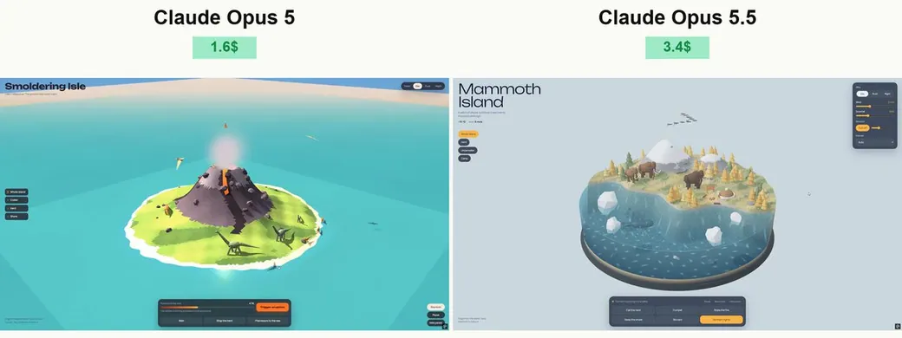

<!-- Generated from Growth CMS by templates/catalog.md. Edit content in CMS; run npm run sync. -->

# Awesome Opus 5.5 Prompts — 2 / 2

[← Awesome Opus 5.5 Prompts](../README.md)

<p>
  <a href="../docs/catalog.en.2.md"></a>
  <a href="../docs/catalog.zh.2.md"></a>
  <a href="../docs/catalog.zh-Hant.2.md"></a>
  <a href="../docs/catalog.ja.2.md"></a>
  <a href="../docs/catalog.ko.2.md"></a>
  <a href="../docs/catalog.es.2.md"></a>
  <a href="../docs/catalog.pt.2.md"></a>
  <a href="../docs/catalog.de.2.md"></a>
  <a href="../docs/catalog.fr.2.md"></a>
  <a href="../docs/catalog.it.2.md"></a>
  <a href="../docs/catalog.ru.2.md"></a>
  <a href="../docs/catalog.tr.2.md"></a>
  <a href="../docs/catalog.uk.2.md"></a>
  <a href="../docs/catalog.vi.2.md"></a>
</p>

[전체 카탈로그](catalog.ko.md) · [←](catalog.ko.1.md) · **2 / 2**

<a id="all-prompts"></a>

<details>
<summary>사례 둘러보기 (1)</summary>

- [인터랙티브 3D 선사시대 섬](#claude-opus-5-5-2102450239923720440)

</details>
<a id="claude-opus-5-5-2102450239923720440"></a>

### 인터랙티브 3D 선사시대 섬

[Vib3Coded](https://x.com/vib3coded) · 2026-09-22 · Claude Opus 5.5 · 인터랙티브

<a href="https://www.tripo3d.ai/ko/3d-prompts/claude-opus-5-5-2102450239923720440"></a>

**프롬프트**

```text
Three.js와 WebGL을 사용해 아름답고 디테일이 뛰어난 완전한 인터랙티브 3D 선사시대 섬을 제작하세요. Chrome에서 바로 열 수 있는 독립 실행형 HTML 파일 하나로 모든 결과물을 제공하세요. 가능한 경우 에셋을 파일에 임베드하세요.

비주얼 방향
바다로 둘러싸인 크고 둥근 섬을 만들고, 투명한 수중 단면을 구현하세요. 결과물은 풍성한 식생, 생동감 있는 공룡, 질감이 풍부한 머티리얼, 분위기 있는 라이팅, 완성도 높은 애니메이션을 갖춘 프리미엄 미니어처 세계처럼 보여야 합니다. 단순한 기하학적 도형이 아니라 일관성 있는 스타일라이즈드 아트 디렉션을 사용하세요.
ISLAND
해변, 바위 절벽, 울창한 선사시대 숲, 거대한 양치식물, 폭포, 담수 연못, 화산이 어우러진 다양한 지형을 만드세요. 작은 연구 기지, 목재 보도, 관찰 플랫폼, 보급 상자, 공룡 둥지도 추가하세요. 섬은 공룡들이 서로 다른 구역 사이를 자연스럽게 이동할 수 있을 만큼 넓게 구성하세요.

수중 단면
물은 섬 주변을 감싸는 깊고 둥근 형태의 볼륨으로 만들고, 측면을 통해 수중 풍경이 뚜렷하게 보이게 하세요. 텍스처가 적용된 해저, 바위, 수생 식물, 물고기, 기포, 그리고 수면 아래를 헤엄치는 초록색 해양 파충류를 포함하세요. 일반적인 육상 공룡을 물속에 배치하지 말고 잠수함도 추가하지 마세요.
애니메이션 웨이브, 프레넬 반사, 수중 빛무늬, 해안선의 포말과 물보라를 사용하세요. 투명도 정렬 아티팩트와 섬과 물 사이에 보이는 틈이 발생하지 않게 하세요.

DINOSAURS
긴 목의 용각류, 트리케라톱스, 스테고사우루스, 대형 수각류, 소형 무리 동물 등 서로 구분되는 여러 종을 포함하세요. 머리 위를 선회하는 익룡도 추가하세요.
모든 종에 알아보기 쉬운 해부학적 특징, 형태가 잡힌 몸체, 관절이 표현된 팔다리, 디테일한 머리, 꼬리, 종에 맞는 피부 패턴을 부여하세요. 완성된 공룡을 뻔한 박스나 서로 분리된 구체만 조합해 만들지 마세요.

자연스러운 애니메이션
관절 위치가 정확한 계층형 스켈레톤을 사용하세요. 보행에는 명확한 지지 구간과 스윙 구간이 있어야 하며, 발은 접지 중 제자리에 유지되고 각 걸음마다 자연스럽게 들어 올려져야 합니다. 보폭은 이동 속도에 맞추세요.

지형 샘플링과 역운동학을 사용해 발이 지면에 닿아 있도록 하세요. 체중 이동, 미세한 몸의 움직임, 균형 잡힌 꼬리 움직임, 머리 회전, 호흡을 추가하세요. 공룡이 떠 있거나 미끄러지거나 지면과 교차하거나 건물, 바위, 나무 또는 서로를 통과하는 일이 절대 없도록 하세요.
장애물 회피와 안전한 이동 경로를 사용하세요. 종마다 이동 속도, 보행 패턴, 행동이 달라야 합니다. 해양 동물은 이동 방향을 향해야 합니다.

INTERACTION
사용자가 다음을 수행할 수 있게 하세요.

카메라를 자유롭게 회전하고 확대·축소하며 수중 단면을 살펴볼 수 있게 하세요.
공룡을 선택하면 부드럽게 움직이는 카메라가 해당 공룡을 따라가게 하세요.

적절한 위치에 먹이를 놓고 주변 공룡들이 다가와 먹는 모습을 관찰할 수 있게 하세요.

물을 마시기, 쉬기, 울음소리 내기, 무리 이동을 실행할 수 있게 하세요.

둥지를 탐험하고 새끼가 부화해 나오는 모습을 관찰할 수 있게 하세요.
물보라를 일으키며 해양 파충류가 수면 위로 올라오는 장면을 실행할 수 있게 하세요.
낮, 노을, 밤 사이를 전환할 수 있게 하세요.
비, 바람, 화산 활동을 조절할 수 있게 하세요.
시뮬레이션을 일시 정지하고 장면을 초기화할 수 있게 하세요.
모든 컨트롤이 명확하고 눈에 보이는 반응을 일으키게 하세요. 상호작용을 반복해서 사용할 수 있도록 하고, 애니메이션이 겹쳐 캐릭터 포즈가 망가지는 것을 방지하세요.
분위기와 오디오
흔들리는 식생, 흘러가는 구름, 새, 곤충, 빗방울 파티클, 밤에 따뜻하게 빛나는 연구 기지를 추가하세요. 잔잔한 분위기의 음악과 환경음을 포함하고, 정상적으로 작동하는 음악 토글과 볼륨 슬라이더를 제공하세요. 오디오는 사용자가 상호작용한 후에만 시작하세요.
INTERFACE
영어 레이블을 사용하는 작고 세련된 인터페이스를 구성하세요. 장면이 중심이 되도록 하고 섬을 가리는 큰 패널은 피하세요. 데스크톱과 모바일에 맞게 레이아웃을 반응형으로 만드세요.
기술적 완성도
반복되는 식생과 소품에는 인스턴싱을 사용하고, 효율적인 지오메트리, 적절한 그림자, 절제된 포스트 프로세싱을 적용하세요. 시각적 풍부함과 원활한 실시간 성능 사이의 균형을 맞추세요.
목업이 아닌 완성된 장면을 제작하세요. 최종 HTML을 데스크톱 브라우저에서 직접 테스트하고, 스크린샷과 콘솔을 확인하며, 모든 상호작용을 실행해 보세요. 전달하기 전에 로딩 오류, 공중에 뜨는 공룡, 발 미끄러짐, 깨진 충돌 처리, 물 아티팩트, 카메라 문제를 수정하세요.
```

<details>
<summary>작성자의 원본 프롬프트</summary>

```text
Create a beautiful, highly detailed, fully interactive 3D prehistoric island using Three.js and WebGL. Deliver everything in a single standalone HTML file that opens directly in Chrome. Embed assets wherever possible.

VISUAL DIRECTION
Build a large, rounded island surrounded by an ocean with a transparent underwater cross-section. The result should feel like a premium miniature world: lush vegetation, expressive dinosaurs, rich materials, atmospheric lighting, and polished animation. Use a cohesive, stylized art direction rather than basic geometric shapes.
ISLAND
Create varied terrain with beaches, rocky cliffs, dense prehistoric forests, giant ferns, a waterfall, a freshwater pond, and a volcano. Add a small research station, wooden walkways, observation platforms, supply crates, and dinosaur nests. Make the island spacious enough for dinosaurs to move naturally between distinct areas.

WATER CROSS-SECTION
The water must form a deep, rounded volume around the island, with clearly visible underwater scenery through its sides. Include a textured seabed, rocks, aquatic plants, fish, bubbles, and a green marine reptile swimming beneath the surface. Do not place ordinary land dinosaurs underwater, and do not add a submarine.
Use animated waves, Fresnel reflections, underwater light patterns, shoreline foam, and splashes. Avoid transparency sorting artifacts and visible gaps between the island and water.

DINOSAURS
Include several distinct species, such as a long-necked sauropod, Triceratops, Stegosaurus, a large theropod, and smaller herd animals. Add pterosaurs circling overhead.
Give every species recognizable anatomy, shaped bodies, articulated limbs, detailed heads, tails, and appropriate skin patterns. Avoid assembling the finished dinosaurs from obvious boxes or disconnected spheres.

NATURAL ANIMATION
Use hierarchical skeletons with correctly positioned joints. Walking must have distinct stance and swing phases: feet stay planted during contact and lift cleanly during each step. Match stride length to movement speed.

Use terrain sampling and inverse kinematics to keep feet on the ground. Add weight shifts, subtle body movement, balanced tail motion, head turns, and breathing. Dinosaurs must never float, slide, intersect the ground, or walk through buildings, rocks, trees, or each other.
Use obstacle avoidance and safe paths. Different species should have different movement speeds, gait patterns, and behaviors. Marine animals must face their direction of travel.

INTERACTION
Allow users to:

Rotate the camera freely, zoom, and inspect the underwater cross-section.
Select a dinosaur and follow it with a smoothly moving camera.

Place food in suitable locations and watch nearby dinosaurs approach and eat.

Trigger drinking, resting, calling, and herd movement.

Explore nests and watch a hatchling emerge.
Trigger a marine reptile surfacing with a splash.
Switch between daylight, sunset, and night.
Adjust rain, wind, and volcanic activity.
Pause the simulation and reset the scene.
Make every control produce a clear, visible response. Keep interactions repeatable and prevent overlapping animations from breaking character poses.
ATMOSPHERE AND AUDIO
Add moving foliage, drifting clouds, birds, insects, rain particles, and warm research-station lights at night. Include quiet atmospheric music and environmental sounds with a working music toggle and volume slider. Start audio only after user interaction.
INTERFACE
Use a compact, elegant interface with English labels. Keep the scene dominant and avoid large panels covering the island. Make the layout responsive for desktop and mobile.
TECHNICAL QUALITY
Use instancing for repeated vegetation and props, efficient geometry, appropriate shadows, and restrained post-processing. Balance visual richness with smooth real-time performance.
Build a complete scene, not a mockup. Test the final HTML directly in a desktop browser, inspect screenshots and the console, exercise every interaction, and fix loading errors, floating dinosaurs, foot sliding, broken collisions, water artifacts, and camera problems before delivery.
```

</details>

[자세히 보기 ↗](https://www.tripo3d.ai/ko/3d-prompts/claude-opus-5-5-2102450239923720440) · [원본 게시물](https://x.com/vib3coded/status/2102450842070569099) · [사례 목록으로](#all-prompts)

---


[전체 카탈로그](catalog.ko.md) · [←](catalog.ko.1.md) · **2 / 2**

<p align="center"><strong><a href="https://www.tripo3d.ai/ko/3d-prompts/models/claude-opus-5-5?utm_source=github&amp;utm_medium=referral&amp;utm_campaign=awesome_opus_5_5_prompts&amp;utm_content=catalog_footer">전체 카탈로그 →</a></strong></p>
