<!-- Generated from Growth CMS by templates/catalog.md. Edit content in CMS; run npm run sync. -->

# Awesome Opus 5.5 Prompts — 1 / 1

[← Awesome Opus 5.5 Prompts](../README.md)

<p>
  <a href="../docs/catalog.en.1.md"></a>
  <a href="../docs/catalog.zh.1.md"></a>
  <a href="../docs/catalog.zh-Hant.1.md"></a>
  <a href="../docs/catalog.ja.1.md"></a>
  <a href="../docs/catalog.ko.1.md"></a>
  <a href="../docs/catalog.es.1.md"></a>
  <a href="../docs/catalog.pt.1.md"></a>
  <a href="../docs/catalog.de.1.md"></a>
  <a href="../docs/catalog.fr.1.md"></a>
  <a href="../docs/catalog.it.1.md"></a>
  <a href="../docs/catalog.ru.1.md"></a>
  <a href="../docs/catalog.tr.1.md"></a>
  <a href="../docs/catalog.uk.1.md"></a>
  <a href="../docs/catalog.vi.1.md"></a>
</p>

[Catálogo completo](catalog.pt.md) · **1 / 1**

<a id="all-prompts"></a>

<details>
<summary>Explorar exemplos (26)</summary>

- [Respiro: um curta-metragem em uma catedral repleta de luz de vitrais](#claude-opus-5-5-2103145567945986461)
- [Jogo no estilo de Genshin Impact ambientado em San Francisco](#claude-opus-5-5-2103144530157687114)
- [Filme cinematográfico: Batalha de Austerlitz](#claude-opus-5-5-2103116235009347650)
- [Crie a Torre Eiffel em Three.js](#claude-opus-5-5-2103106070549757960)
- [Animação em Three.js com qualidade de nível Pixar para o Grid Genius](#claude-opus-5-5-2103087766662009118)
- [Jogo de ciclismo com pelicano em tempo real](#claude-opus-5-5-2103083781490176212)
- [Crie uma cidade imperial](#claude-opus-5-5-2103046279253168554)
- [Crie um Bugatti Chiron Super Sport no Three.js](#claude-opus-5-5-2102828216289566725)
- [Montagem de treinamento da evolução do Claude](#claude-opus-5-5-2102788371114246177)
- [Crie uma animação de desenho dos anos 90, com qualidade Pixar, em Three.js](#claude-opus-5-5-2102788223835463902)
- [Animação codificada e contínua do ciclo da água](#claude-opus-5-5-2102781807179735211)
- [CatWalk: um jogo 3D de plataforma lateral com um gato correndo pela cidade à noite](#claude-opus-5-5-2102775461701091531)
- [Benchmark da megacidade cyberpunk O Último Trem](#claude-opus-5-5-2102740078347087940)
- [Animação de futebol em estilo voxel](#claude-opus-5-5-2102739444256383089)
- [Site interativo sobre planetas imaginários](#claude-opus-5-5-2102729710174196022)
- [Simulação Interativa de Fluido Neon Euleriano](#claude-opus-5-5-2102565611473661963)
- [Página web interativa de paisagem 3D de um vale japonês de cerejeiras](#claude-opus-5-5-2102565403109085669)
- [Modelo do acidente de Hundenberg e vídeo realista](#claude-opus-5-5-2102547809140355250)
- [Renderização 3D em 360° de uma quadra de handebol a partir de uma imagem](#claude-opus-5-5-2102544406117286004)
- [Plano de fundo procedural 3D para menu principal do Three.js a partir de uma imagem](#claude-opus-5-5-2102544196808667471)
- [Máquina 3D de Rube Goldberg autônoma](#claude-opus-5-5-2102544078927741369)
- [Jogo interativo de animais de fazenda no estilo de Peter Rabbit](#claude-opus-5-5-2102538762731565085)
- [Navio pirata cinematográfico e interativo ao pôr do sol](#claude-opus-5-5-2102533729746882985)
- [Mundo infinito gerado proceduralmente em Three.js](#claude-opus-5-5-2102529695908806728)
- [Simulação interativa de evacuação de multidões](#claude-opus-5-5-2102467667978572092)
- [Ilha pré-histórica 3D interativa](#claude-opus-5-5-2102450239923720440)

</details>
<a id="claude-opus-5-5-2103145567945986461"></a>

### Respiro: um curta-metragem em uma catedral repleta de luz de vitrais

[AGIおやZ](https://x.com/AGIOyaZ) · 2026-09-24 · Claude Opus 5.5 · Animação

<a href="https://www.tripo3d.ai/pt/3d-prompts/claude-opus-5-5-2103145567945986461"></a>

**Prompt**

```text
Crie em three.js um curta-metragem vertical de 1080×1920, a 30 quadros por segundo, com aproximadamente 36 segundos. 

【Nome da obra】
Respiro

【Experiência desejada】
Este vídeo deve fazer o espectador sentir, sem a aparição de nenhum personagem, como é perder tempo ao ser pressionado pela busca por eficiência e como a vida se enche de uma luz abundante no instante em que se conquista espaço para respirar. No final, o objetivo é provocar um suspiro diante da luz dos vitrais que surge por todo o piso.

【Cenário】
・Interior de uma catedral de pedra pouco iluminada. Na parede frontal, há apenas uma janela em arco ogival, com 15 m de altura e 10 m de largura
・Do lado de fora da janela, uma luz intensa incide em um ângulo de 45 graus, projetando no piso de pedra uma forma luminosa com o contorno da janela
・A janela contém um vitral com a Virgem Maria ao centro, dois anjos com as asas abertas nas laterais e uma rosácea na parte superior. O design deve ser original, sem imitar obras existentes, e ter uma composição simétrica

【Estrutura temporal】
0 a 3 segundos: a luz que entra pela janela ainda é branca e sem cor. Uma forma suave de luz branca aparece no piso
3 a 11 segundos: cubos cinza com palavras gravadas, como “Ocupado”, “Eficiência”, “Urgente” e “Prazo”, voam um após o outro da parte dianteira da sala e vão preenchendo a janela. O ritmo dos voos acelera cada vez mais; à medida que a janela é bloqueada, a sala escurece
11 a 14 segundos: a janela fica completamente bloqueada; escuridão e silêncio
14 a 19 segundos: um único bloco com a palavra “Ocupado” se solta da janela, cai e desaparece transformando-se em partículas de luz. Um feixe de luz de cores vibrantes entra pelo espaço vazio
19 a 26 segundos: começando pelo primeiro espaço aberto, os blocos se soltam em cadeia. A cada novo espaço, surgem mais colunas de luz multicoloridas, e o vitral oculto vai aparecendo aos poucos
26 a 33 segundos: todos os blocos desaparecem, e a câmera atravessa as colunas de luz, sobe e passa a observar o piso diretamente de cima. Por toda a superfície, o vitral da Virgem Maria e dos anjos aparece projetado como uma luz de cores vibrantes
33 a 36 segundos: a tela inteira é envolvida por uma luz ofuscante, a última frase surge e o vídeo termina em silêncio

【Textos (em uma fonte serifada, surgindo e desaparecendo de forma discreta)】
・“Todo dia, mais rápido.”
・“Com ainda mais eficiência.”
・“Quando percebi, a luz já não entrava mais.”
・“Vou abrir mão de uma coisa.”
・“A luz entra por onde há espaço.”
・“Essa luz era mais abundante do que antes.”
・No final, em destaque: “A riqueza mora no respiro”

【Luz e textura】
・As colunas de luz assumem as cores do vitral em suas respectivas posições, e a poeira suspensa no ar cintila
・A projeção no piso deve refletir com precisão quais partes da janela estão abertas (os locais ocupados por blocos ficam na sombra)
・Os blocos têm um acabamento cinza fosco e inorgânico. As palavras são gravadas em branco
・A primeira metade deve ser fria e sem cores; a segunda, em vermelho, azul e dourado com aspecto de pedras preciosas. O contraste entre essas cores deve comunicar que tudo se tornou mais abundante

【Requisitos técnicos】
・Gere a arte do vitral como uma imagem e calcule o brilho no piso, as colunas de luz e a exibição na janela a partir dessa mesma arte, garantindo que tudo coincida
・Avance o tempo com precisão de 1/30 de segundo, exportando cada quadro individualmente para gerar um MP4

【Finalização】
Renderize e verifique cada cena de verdade. Antes de entregar, corrija o que for necessário para garantir que a arte do vitral possa ser reconhecida no piso como a Virgem Maria e os anjos, que os textos estejam legíveis e que os movimentos não pareçam bruscos.
```

<details>
<summary>Prompt original</summary>

```text
three.jsで、縦長1080×1920・30コマ/秒・約36秒の短編映像を作ってください。

【作品名】
余白

【見せたい体験】
効率化に追われて時間を失っていく感覚と、余白を手に入れた瞬間に人生が豊かな光で満たされていく感覚を、人物を一切登場させずに体感させる映像です。最後に床一面に浮かび上がるステンドグラスの光で、見た人が思わず息をのむことを目指します。

【舞台】
・薄暗い石造りの大聖堂の内部。正面の壁に、高さ15m・幅10mの尖頭アーチ型の窓が一つだけある
・窓の外からは、斜め45度の角度で強い光が差し込み、石の床に窓の形の光を落としている
・窓には、中央に聖母、両脇に翼を広げた二人の天使、上部にバラ窓を配したステンドグラスがはまっている。デザインは既存の作品を模さずオリジナルで、左右対称の構図にする

【時間の構成】
0〜3秒：窓から差す光は、まだ色のない白い光。床にやわらかな白い光の形
3〜11秒：「忙しい」「効率化」「至急」「締切」などの言葉が刻まれた灰色の立方体が、部屋の手前から次々と飛んできて窓を埋めていく。飛来のペースはどんどん加速し、窓が埋まるほど部屋は暗くなる
11〜14秒：窓は完全にふさがれ、闇と静寂
14〜19秒：「忙しい」のブロックが一つだけ窓から外れて落ち、光の粒になって消える。空いた穴から、鮮やかな色の一筋の光が差し込む
19〜26秒：最初の穴を中心に、ブロックが連鎖的に外れていく。穴が増えるたびに色とりどりの光の柱が増え、隠れていたステンドグラスが少しずつ姿を現す
26〜33秒：すべてのブロックが消え、カメラは光の柱をくぐり抜けて上昇し、真上から床を見下ろす。床一面に、聖母と天使のステンドグラスが色鮮やかな光として映し出されている
33〜36秒：画面全体がまばゆい光に包まれ、最後の言葉が浮かび、静かに終わる

【言葉（明朝体、控えめに浮かんでは消える）】
・「毎日、もっと速く。」
・「もっと、効率よく。」
・「気づけば、光が入らなくなっていた。」
・「ひとつ、手放してみる。」
・「空いたところから、光が入る。」
・「その光は、前より豊かだった。」
・最後に大きく：「豊かさは余白に宿る」

【光と質感】
・光の柱は、ステンドグラスのその場所の色に染まり、空中の塵がきらめく
・床の投影は、窓のどの穴が空いているかを正確に反映する（ブロックがある場所は影になる）
・ブロックは無機質なマットグレー。言葉は白く刻印されている
・前半は冷たく無彩色、後半は宝石のような赤・青・金。この色の対比で「豊かになった」ことを語る

【技術条件】
・ステンドグラスの絵柄は画像として生成し、床の光・光の柱・窓の表示はすべて同じ絵柄から計算して一致させる
・時間を1/30秒ずつ正確に進めて1コマずつ書き出し、MP4にする

【仕上げ】
各場面を実際に描画して確認し、ステンドグラスの絵柄が床の上で聖母と天使として読み取れるか、言葉が読めるか、動きが唐突でないかを直してから渡してください。
```

</details>

[Ver detalhes ↗](https://www.tripo3d.ai/pt/3d-prompts/claude-opus-5-5-2103145567945986461) · [Publicação original](https://x.com/AGIOyaZ/status/2103145567945986461) · [Voltar aos exemplos](#all-prompts)

---

<a id="claude-opus-5-5-2103144530157687114"></a>

### Jogo no estilo de Genshin Impact ambientado em San Francisco

[Every 📧](https://x.com/every) · 2026-09-24 · Claude Opus 5.5 · Jogos

<a href="https://www.tripo3d.ai/pt/3d-prompts/claude-opus-5-5-2103144530157687114"></a>

**Prompt**

```text
Crie um jogo no estilo de Genshin Impact ambientado em San Francisco.
```

<details>
<summary>Prompt original</summary>

```text
Build a Genshin Impact–style game set in San Francisco.
```

</details>

[Ver detalhes ↗](https://www.tripo3d.ai/pt/3d-prompts/claude-opus-5-5-2103144530157687114) · [Publicação original](https://x.com/every/status/2103144530157687114) · [Voltar aos exemplos](#all-prompts)

---

<a id="claude-opus-5-5-2103116235009347650"></a>

### Filme cinematográfico: Batalha de Austerlitz

[Winter](https://x.com/WinterArc2125) · 2026-09-24 · Claude Opus 5.5 · Animação

<a href="https://www.tripo3d.ai/pt/3d-prompts/claude-opus-5-5-2103116235009347650">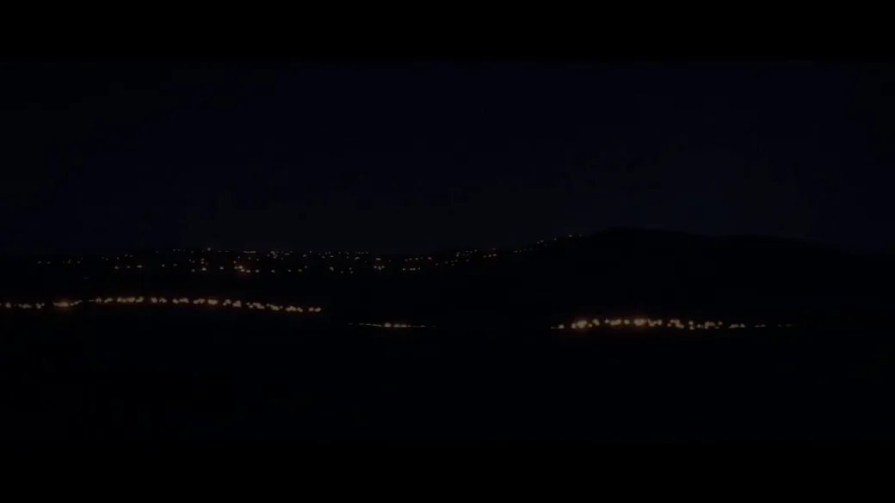</a>

**Imagens de referência:** [1](https://media.tripogrowth.space/media/9420c404-1c47-48c2-a7ec-1b5dfdc1f057.jpg) · [2](https://media.tripogrowth.space/media/0e238466-f725-44b7-8cd2-dc436c9e66c2.jpg) · [3](https://pbs.twimg.com/media/HS_FTwwXcAIpMjc.jpg) · [4](https://pbs.twimg.com/media/HS_FWGXXUAA5LrJ.jpg)

**Prompt**

```text
Crie um vídeo cinematográfico de 4 a 5 minutos sobre a Batalha de Austerlitz (1805), desenvolvido inteiramente com código.

Pesquise a batalha a fundo e decida por conta própria como contar a história, estruturar o ritmo, explicar a estratégia e visualizar os acontecimentos. Quero que seja historicamente preciso, dramático, fácil de entender e visualmente excepcional.

Use as pinturas anexadas como inspiração visual, não como uma exigência rígida de estilo. Adoro a escala, a atmosfera, a fumaça, os céus dramáticos, a cavalaria, as formações compactas, a paisagem e a sensação de caos presentes nelas. Encontre uma maneira de traduzir essa sensação para o código — mas, se conseguir inventar uma linguagem visual ainda mais marcante, faça isso.

Não deixe que pareça um infográfico genérico ou um jogo de estratégia. Deve transmitir a sensação de um filme histórico cinematográfico que, por acaso, foi renderizado com código.

Você tem total liberdade criativa. Surpreenda-me.
```

<details>
<summary>Prompt original</summary>

```text
Create a 4–5 minute cinematic video about the Battle of Austerlitz (1805), built entirely in code.

Research the battle thoroughly and decide for yourself how to tell the story, structure the pacing, explain the strategy, and visualize the events. I want it to be historically accurate, dramatic, easy to understand, and visually exceptional.

Use the attached paintings as visual inspiration, not a strict style requirement. I love their scale, atmosphere, smoke, dramatic skies, cavalry, massed formations, landscape, and sense of chaos. Find a way to translate that feeling into code — but if you can invent a stronger visual language, do it.

Don't make it feel like a generic infographic or strategy game. It should feel like a cinematic historical film that happens to be rendered with code.

You have complete creative control. Surprise me.
```

</details>

[Ver detalhes ↗](https://www.tripo3d.ai/pt/3d-prompts/claude-opus-5-5-2103116235009347650) · [Publicação original](https://x.com/WinterArc2125/status/2103116689944502720) · [Código-fonte](https://github.com/WinterArc21/Battle-of-Austerlitz-Film) · [Voltar aos exemplos](#all-prompts)

---

<a id="claude-opus-5-5-2103106070549757960"></a>

### Crie a Torre Eiffel em Three.js

[Pascual ⚡](https://x.com/0xPascual) · 2026-09-24 · Claude Opus 5.5 · Recursos

<a href="https://www.tripo3d.ai/pt/3d-prompts/claude-opus-5-5-2103106070549757960"></a>

**Prompt**

```text
crie a Torre Eiffel em Three.js.
```

<details>
<summary>Prompt original</summary>

```text
build the Eiffel Tower in Three.js.
```

</details>

[Ver detalhes ↗](https://www.tripo3d.ai/pt/3d-prompts/claude-opus-5-5-2103106070549757960) · [Publicação original](https://x.com/0xPascual/status/2103106070549757960) · [Voltar aos exemplos](#all-prompts)

---

<a id="claude-opus-5-5-2103087766662009118"></a>

### Animação em Three.js com qualidade de nível Pixar para o Grid Genius

[Anil Rao K](https://x.com/Anilraok) · 2026-09-24 · Claude Opus 5.5 · Animação

<a href="https://www.tripo3d.ai/pt/3d-prompts/claude-opus-5-5-2103087766662009118">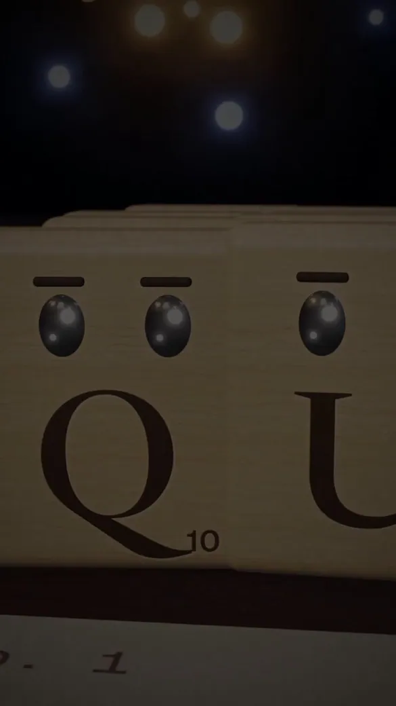</a>

**Prompt**

```text
Quero que você imagine uma história que promova sutilmente o Grid Genius. Ela também pode nem mencionar o Grid Genius, desde que esteja alinhada ao nosso app e nos ajude a alcançar mais pessoas quando for publicada nas redes sociais. Depois, usando Three.js/JavaScript, quero que você crie uma animação completa, com qualidade de nível Pixar, baseada na história que imaginou.
```

<details>
<summary>Prompt original</summary>

```text
I want you to imagine a story, that subtly promotes grid genius. Or it can not even have grid genius, but something that aligns with our app and helps us get more eyeballs when posted on social media. Then using threejs/javascript I want you to create full animation, Pixar-level quality out of the story you imagine
```

</details>

[Ver detalhes ↗](https://www.tripo3d.ai/pt/3d-prompts/claude-opus-5-5-2103087766662009118) · [Publicação original](https://x.com/Anilraok/status/2103087766662009118) · [Voltar aos exemplos](#all-prompts)

---

<a id="claude-opus-5-5-2103083781490176212"></a>

### Jogo de ciclismo com pelicano em tempo real

[Yaowei Zheng \| LlamaFactory](https://x.com/code_hiyouga) · 2026-09-24 · Claude Opus 5.5 · Jogos

<a href="https://www.tripo3d.ai/pt/3d-prompts/claude-opus-5-5-2103083781490176212">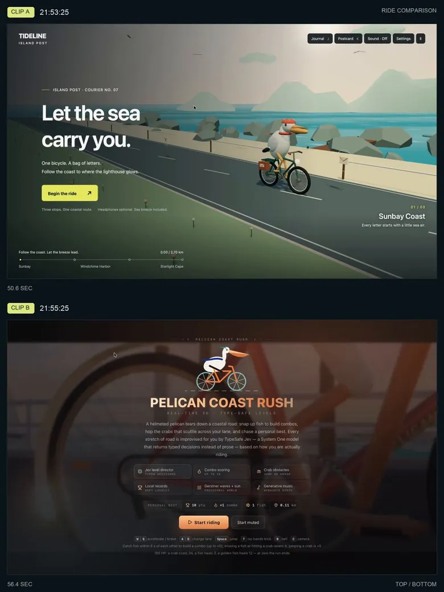</a>

**Prompt**

```text
Crie um jogo 3D em tempo real em que um pelicano pedala por um mundo litorâneo vivo, com física, ondas, pesca, clima dinâmico, câmeras cinematográficas, piloto automático e música adaptativa.
```

<details>
<summary>Prompt original</summary>

```text
Build a real-time 3D game where a pelican cycles through a living seaside world, complete with physics, waves, fishing, dynamic weather, cinematic cameras, autopilot, and adaptive music.
```

</details>

[Ver detalhes ↗](https://www.tripo3d.ai/pt/3d-prompts/claude-opus-5-5-2103083781490176212) · [Publicação original](https://x.com/code_hiyouga/status/2103083781490176212) · [Voltar aos exemplos](#all-prompts)

---

<a id="claude-opus-5-5-2103046279253168554"></a>

### Crie uma cidade imperial

[EnzoXbt](https://x.com/Enzoxbt01) · 2026-09-24 · Claude Opus 5.5 · Cenas

<a href="https://www.tripo3d.ai/pt/3d-prompts/claude-opus-5-5-2103046279253168554"></a>

**Prompt**

```text
CRIE UMA CIDADE IMPERIAL
```

<details>
<summary>Prompt original</summary>

```text
BUILD AN IMPERIAL CITY
```

</details>

[Ver detalhes ↗](https://www.tripo3d.ai/pt/3d-prompts/claude-opus-5-5-2103046279253168554) · [Publicação original](https://x.com/Enzoxbt01/status/2103046279253168554) · [Voltar aos exemplos](#all-prompts)

---

<a id="claude-opus-5-5-2102828216289566725"></a>

### Crie um Bugatti Chiron Super Sport no Three.js

[Sree](https://x.com/srikanthvaluri) · 2026-09-23 · Claude Opus 5.5 · Recursos

<a href="https://www.tripo3d.ai/pt/3d-prompts/claude-opus-5-5-2102828216289566725"></a>

**Prompt**

```text
crie um Bugatti Chiron Super Sport no Three.js.

Sem modelo 3D. Sem texturas. Sem assets.
```

<details>
<summary>Prompt original</summary>

```text
build a Bugatti Chiron Super Sport in Three.js.

No 3D model. No textures. No assets.
```

</details>

[Ver detalhes ↗](https://www.tripo3d.ai/pt/3d-prompts/claude-opus-5-5-2102828216289566725) · [Publicação original](https://x.com/srikanthvaluri/status/2102828216289566725) · [Voltar aos exemplos](#all-prompts)

---

<a id="claude-opus-5-5-2102788371114246177"></a>

### Montagem de treinamento da evolução do Claude

[Ishu Agrawal](https://x.com/ishuagra02) · 2026-09-23 · Claude Opus 5.5 · Animação

<a href="https://www.tripo3d.ai/pt/3d-prompts/claude-opus-5-5-2102788371114246177">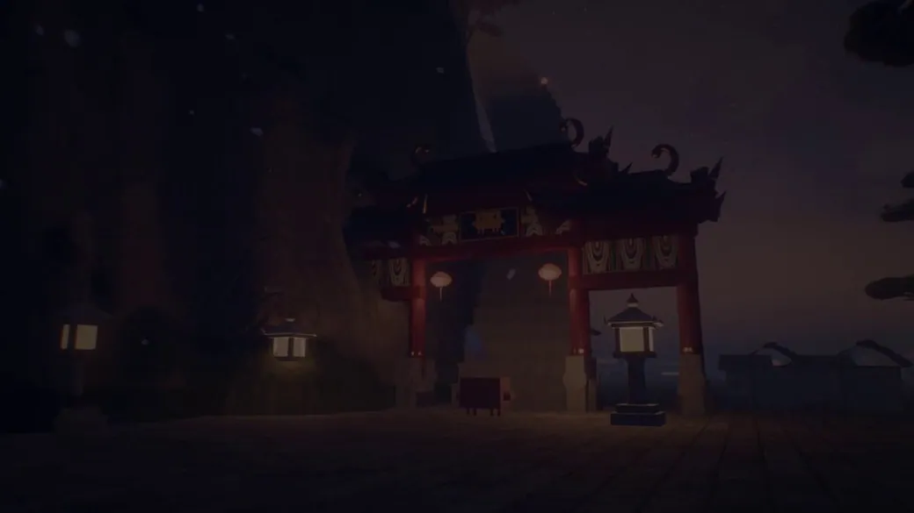</a>

**Prompt**

```text
Crie uma animação de 30 segundos inteiramente em código, apresentando uma montagem de evolução inspirada na sequência de treinamento de Kung Fu Panda, com o mascote Claude como personagem principal. Mostre-o se tornando mais capaz desde seu lançamento inicial em diversas habilidades, como pesquisar na internet, escrever código, criar modelos 3D e resolver os problemas mais difíceis da humanidade, com uma trilha sonora emocionante.
```

<details>
<summary>Prompt original</summary>

```text
Create a 30 second animation entirely in code featuring a growth montage, inspired by Kung Fu Panda's training sequence, with the Claude mascot as the main character, showcasing it getting more capable since its initial release across its skillset, such as searching the internet, writing code, creating 3D models, and solving humanity's hardest problems, with emotionally impactful music.
```

</details>

[Ver detalhes ↗](https://www.tripo3d.ai/pt/3d-prompts/claude-opus-5-5-2102788371114246177) · [Publicação original](https://x.com/ishuagra02/status/2102788832273801700) · [Voltar aos exemplos](#all-prompts)

---

<a id="claude-opus-5-5-2102788223835463902"></a>

### Crie uma animação de desenho dos anos 90, com qualidade Pixar, em Three.js

[Shimecki](https://x.com/scheemunai) · 2026-09-23 · Claude Opus 5.5 · Animação

<a href="https://www.tripo3d.ai/pt/3d-prompts/claude-opus-5-5-2102788223835463902">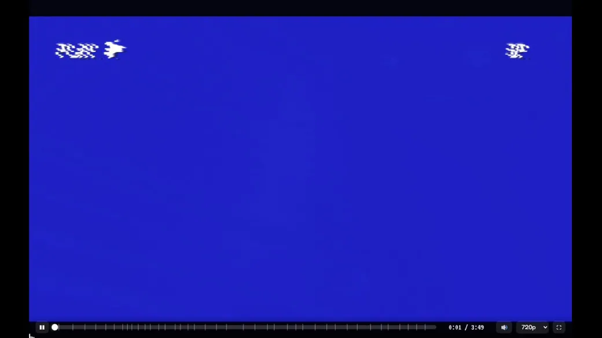</a>

**Prompt**

```text
Quero que você imagine uma história. Depois, usando Three.js, quero que crie uma animação completa, com qualidade Pixar e estilo de desenho dos anos 90, baseada na história que imaginou.
```

<details>
<summary>Prompt original</summary>

```text
I want you to imagine a story. And then using threejs I want you to create full animation, Pixar-level quality 90s cartoon out of the story you imagine.
```

</details>

[Ver detalhes ↗](https://www.tripo3d.ai/pt/3d-prompts/claude-opus-5-5-2102788223835463902) · [Publicação original](https://x.com/scheemunai/status/2102788223835463902) · [Voltar aos exemplos](#all-prompts)

---

<a id="claude-opus-5-5-2102781807179735211"></a>

### Animação codificada e contínua do ciclo da água

[Higgsfield AI 🧩](https://x.com/higgsfield_ai) · 2026-09-23 · Claude Opus 5.5 · Animação

<a href="https://www.tripo3d.ai/pt/3d-prompts/claude-opus-5-5-2102781807179735211"></a>

**Prompt**

```text
Crie uma animação em loop contínuo do ciclo da água, inteiramente com código.
```

<details>
<summary>Prompt original</summary>

```text
Create a seamless looping animation of the water cycle, entirely in code.
```

</details>

[Ver detalhes ↗](https://www.tripo3d.ai/pt/3d-prompts/claude-opus-5-5-2102781807179735211) · [Publicação original](https://x.com/higgsfield_ai/status/2102781807179735211) · [Voltar aos exemplos](#all-prompts)

---

<a id="claude-opus-5-5-2102775461701091531"></a>

### CatWalk: um jogo 3D de plataforma lateral com um gato correndo pela cidade à noite

[BLITAST STUDIO](https://x.com/blitast_studio) · 2026-09-23 · Claude Opus 5.5 · Jogos

<a href="https://www.tripo3d.ai/pt/3d-prompts/claude-opus-5-5-2102775461701091531"></a>

**Prompt**

```text
Vamos desenvolver um jogo
Os gráficos podem ser 2D ou 3D; analise o sistema do jogo e outros aspectos e escolha a opção que facilitar o desenvolvimento
Pessoalmente, imagino algo em 3D, mas com uma apresentação de ação em plataforma com rolagem lateral
Quero criar uma atmosfera elegante usando iluminação e outros recursos, então acredito que o 3D possa proporcionar uma apresentação visual bonita (por exemplo, com postes de luz e lanternas)
O jogo que quero criar se chama CatWalk
Como o nome sugere
Um gato avança lateralmente
A passarela continua enquanto a tela rola automaticamente, e o jogador precisa superar obstáculos e buracos, acompanhando essa velocidade e usando apenas comandos simples, como o salto. De certa forma, a tensão e o sistema podem lembrar Flappy Bird.
No entanto, quero gráficos sofisticados e estilosos, com foco em uma experiência atmosférica
Se possível, gostaria que fosse possível representar os movimentos ágeis e elegantes do gato ao caminhar, correr e saltar
Fica a seu critério definir o universo da fase, mas, no início, uma rua noturna convencional já seria uma boa opção
Eu ficaria muito satisfeito se uma paleta mais escura permitisse destacar bem a iluminação indireta
Sei que haverá coisas possíveis, impossíveis e difíceis de fazer
Usando meus pedidos como inspiração, desenvolva algo que você considere viável
Primeiro, faça com que seja possível jogar uma fase durante uma volta completa
```

<details>
<summary>Prompt original</summary>

```text
ゲームを開発しましょう
グラフィックは2D、3Dを問いませんがゲームのシステムなどを分析し開発しやすい方でいいです
個人的には3Dだが画面は横スクロールアクションみたいなものを想定してます
照明などでおしゃれな雰囲気などを出したいので3Dを使うことで美しい表現ができるのではないかと思っています（例：街灯やランタンのような表現など）
作りたいゲームは CatWalk というゲーム
名前の通りです
猫が横に進む
キャットウォークが続いており、画面は自動スクロールするので、その速さに合わせて障害物や穴をジャンプなどのシンプルな操作のみで越えていくスタイル。ある意味でフラッピー的な緊張感とシステムに近いかもしれない。
ただしグラフィックは大人かっこいい、雰囲気ゲーを目指したい
可能であれば猫のしなやかな歩き、走り、ジャンプが表現できればうれしい
ステージの世界観はお任せするが、最初は無難な夜のストリートなどでもいいかと
暗めにすることで間接照明などが美ししく表現できればかなり嬉しい
できることできないこと難しいことがあると思うので
この私の要望をヒントにあなたなりにできそうなものを開発してほしい
まずは１ステージのワンループができるように
```

</details>

[Ver detalhes ↗](https://www.tripo3d.ai/pt/3d-prompts/claude-opus-5-5-2102775461701091531) · [Publicação original](https://x.com/blitast_studio/status/2102775632933654585) · [Voltar aos exemplos](#all-prompts)

---

<a id="claude-opus-5-5-2102740078347087940"></a>

### Benchmark da megacidade cyberpunk O Último Trem

[BuilderHelm](https://x.com/builderhelmai) · 2026-09-23 · Claude Opus 5.5 · Cenas

<a href="https://www.tripo3d.ai/pt/3d-prompts/claude-opus-5-5-2102740078347087940">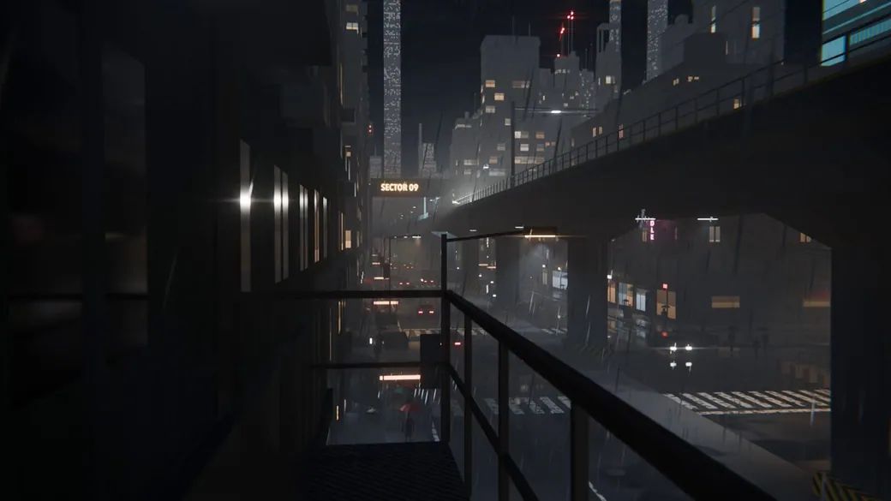</a>

**Prompt**

```text
crie uma megacidade cyberpunk completa no Blender, com um trem de destaque, arquitetura procedural, sistemas ferroviários elevados, chuva, atmosfera volumétrica, iluminação cinematográfica, várias configurações de câmera e uma sequência animada completa.
```

<details>
<summary>Prompt original</summary>

```text
build a complete cyberpunk megacity inside Blender with a hero train, procedural architecture, elevated rail systems, rain, volumetric atmosphere, cinematic lighting, multiple camera setups, and a full animated sequence.
```

</details>

[Ver detalhes ↗](https://www.tripo3d.ai/pt/3d-prompts/claude-opus-5-5-2102740078347087940) · [Publicação original](https://x.com/builderhelmai/status/2102740078347087940) · [Voltar aos exemplos](#all-prompts)

---

<a id="claude-opus-5-5-2102739444256383089"></a>

### Animação de futebol em estilo voxel

[Delusionals](https://x.com/AGI_FromWalmart) · 2026-09-23 · Claude Opus 5.5 · Animação

<a href="https://www.tripo3d.ai/pt/3d-prompts/claude-opus-5-5-2102739444256383089">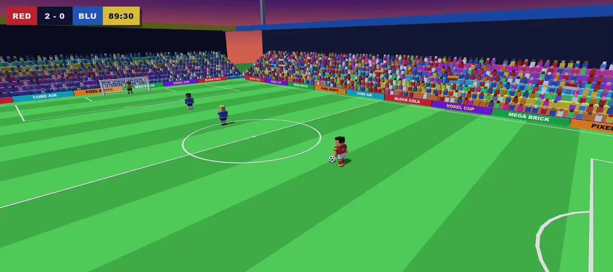</a>

**Prompt**

```text
Crie um único arquivo HTML com Three.js (CDN) para uma animação simples de futebol em estilo voxel. Um jogador em blocos dribla passando por 2 defensores e marca um gol espetacular, com partículas de comemoração. Visual de estádio colorido. Gere SOMENTE o código HTML completo.
```

<details>
<summary>Prompt original</summary>

```text
Create a single HTML file with Three.js (CDN) for a simple voxel-style soccer animation. A blocky player dribbles past 2 defenders and scores a spectacular goal with celebration particles. Colorful stadium look. Output ONLY the full HTML code.
```

</details>

[Ver detalhes ↗](https://www.tripo3d.ai/pt/3d-prompts/claude-opus-5-5-2102739444256383089) · [Publicação original](https://x.com/AGI_FromWalmart/status/2102739444256383089) · [Voltar aos exemplos](#all-prompts)

---

<a id="claude-opus-5-5-2102729710174196022"></a>

### Site interativo sobre planetas imaginários

[Kappaemme](https://x.com/Kappaemme1926) · 2026-09-23 · Claude Opus 5.5 · Interativo

<a href="https://www.tripo3d.ai/pt/3d-prompts/claude-opus-5-5-2102729710174196022">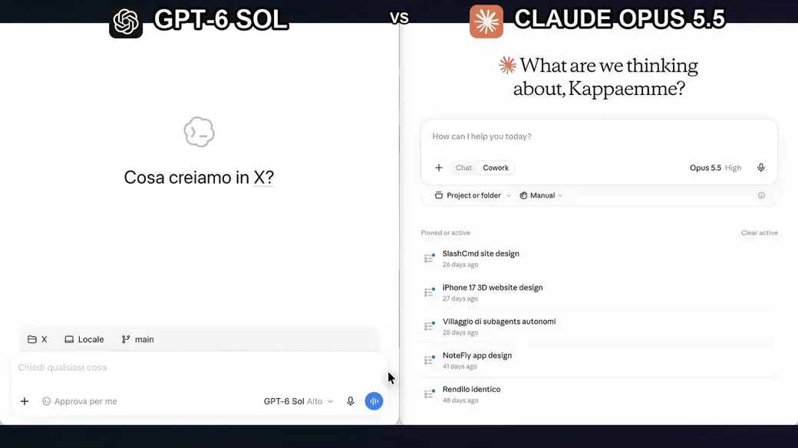</a>

**Prompt**

```text
crie um site interativo sobre planetas imaginários.
```

<details>
<summary>Prompt original</summary>

```text
build an interactive website about imaginary planets.
```

</details>

[Ver detalhes ↗](https://www.tripo3d.ai/pt/3d-prompts/claude-opus-5-5-2102729710174196022) · [Publicação original](https://x.com/Kappaemme1926/status/2102729710174196022) · [Voltar aos exemplos](#all-prompts)

---

<a id="claude-opus-5-5-2102565611473661963"></a>

### Simulação Interativa de Fluido Neon Euleriano

[theailoser](https://x.com/theailoser) · 2026-09-23 · Claude Opus 5.5 · Animação

<a href="https://www.tripo3d.ai/pt/3d-prompts/claude-opus-5-5-2102565611473661963"></a>

**Prompt**

```text
Escreva um documento HTML completo em um único arquivo contendo uma Simulação Interativa de Fluido Neon Euleriano de alto desempenho e acelerada por GPU.

Requisitos técnicos e estéticos rigorosos:

1. Arquitetura e desempenho:
   - Arquivo único: todo o HTML, CSS e JavaScript/shaders GLSL devem estar incorporados.
   - Zero dependências externas: WebGL 1.0 ou 2.0 puro (sem Three.js, sem Pixi e sem bibliotecas externas).
   - Dinâmica de fluidos calculada na GPU: a simulação deve ser executada inteiramente por meio de Framebuffer Objects (FBOs) em pingue-pongue, usando shaders de fragmento personalizados para:
     a) Advecção (velocidade e tinta)
     b) Cálculo da divergência
     c) Solucionador da equação de Poisson para a pressão (iteração de Jacobi, 20 a 30 iterações por quadro)
     d) Subtração do gradiente / projeção da velocidade
     e) Confinamento da vorticidade (adiciona redemoinhos turbulentos e impede que o fluido se transforme em uma massa opaca e borrada).

2. Fidelidade visual (o visual de "fumaça neon"):
   - Fundo de vazio totalmente preto (`#050508`).
   - Use composição aditiva / High Dynamic Range para a injeção de tinta.
   - Paleta dinâmica: cada movimento rápido do cursor ou arraste por toque deve injetar tinta neon de alta luminosidade, que percorre suavemente tons cibernéticos vibrantes (ciano elétrico `#00F0FF`, magenta intenso `#FF007F`, ultravioleta profundo e dourado radiante).
   - Aprimoramentos no shader de exibição: inclua um passe de pós-processamento diretamente no shader de renderização final, aplicando bloom/glow sutil, tone mapping e aberração cromática ao redor das bordas espiraladas do fluido.

3. Interação:
   - Mouse e toque: movimentos rápidos do cursor ou arrastes devem injetar velocidade proporcional à velocidade do mouse, junto com tinta brilhante e densa.
   - Movimento ambiente passivo: quando estiver ocioso, gere ruído curl procedural sutil ou vórtices suaves à deriva para que o canvas nunca fique completamente estático.
   - Controles: um HUD de glassmorphism elegante e ultraminimalista, posicionado em um canto (com ocultação automática durante a inatividade):
     * Slider de viscosidade
     * Slider de dissipação / persistência da tinta
     * Slider do raio do splat
     * Botão "Limpar canvas"
     * Botão de alternância para percorrer os temas de cores (Cyberpunk, Inferno Térmico, Bioluminescente Profundo).

4. Acabamento de produção:
   - Gerencie automaticamente telas de alta densidade de pixels e `resize` eventos sem esticar nem limpar as texturas dos FBOs.
   - Faça uma verificação de fallback elegante para o suporte a texturas de ponto flutuante (`OES_texture_float` / `OES_texture_half_float`).
   - Código limpo, sem bugs e totalmente implementado, sem placeholders nem comentários truncados.

Retorne apenas o arquivo HTML totalmente preenchido, pronto para ser executado diretamente no Chrome/Safari/Firefox.
```

<details>
<summary>Prompt original</summary>

```text
Write a complete, single-file HTML document containing a high-performance, GPU-accelerated interactive Eulerian Neon Fluid Simulation.

Strict Technical & Aesthetic Requirements:

1. Architecture & Performance:
   - Single-file: All HTML, CSS, and JavaScript/GLSL shaders inline.
   - Zero external dependencies: Pure WebGL 1.0 or 2.0 (no Three.js, no Pixi, no external libraries).
   - GPU-Computed Fluid Dynamics: The simulation must run entirely via ping-pong Framebuffer Objects (FBOs) using custom fragment shaders for:
     a) Advection (velocity & dye)
     b) Divergence calculation
     c) Pressure Poisson solver (Jacobi iteration, 20-30 iterations per frame)
     d) Gradient subtraction / velocity projection
     e) Vorticity confinement (adds turbulent swirls and prevents the fluid from turning into dull, blurry mush).

2. Visual Fidelity (The "Neon Smoke" Look):
   - Pitch-black void background (`#050508`).
   - Additive / High-Dynamic-Range blending for dye injection.
   - Dynamic palette: Each cursor flick or touch drag injects high-luminosity neon dye that cycles smoothly through vivid cyber hues (electric cyan `#00F0FF`, hot magenta `#FF007F`, deep ultraviolet, and radiant gold).
   - Display shader enhancements: Include a post-processing pass directly in the final render shader that applies subtle bloom/glow, tone mapping, and chromatic aberration around the swirling edges of the fluid.

3. Interaction:
   - Mouse & Touch: Rapid cursor movement or dragging injects velocity proportional to mouse speed, along with dense glowing dye.
   - Passive Ambient Motion: When idle, generate subtle procedural curl noise or gentle drifting vortices so the canvas is never completely static.
   - Controls: A sleek, ultra-minimal glassmorphism HUD tucked into a corner (with auto-hide on inactivity):
     * Viscosity slider
     * Dye dissipation / persistence slider
     * Splat radius slider
     * "Clear Canvas" button
     * Toggle button to cycle color themes (Cyberpunk, Thermal Inferno, Bioluminescent Deep).

4. Production Polish:
   - Automatically handle high-DPI displays and `resize` events without stretching or clearing the FBO textures.
   - Graceful fallback check for floating-point texture support (`OES_texture_float` / `OES_texture_half_float`).
   - Clean, bug-free, fully implemented code with zero placeholders or truncated comments.

Return only the fully populated HTML file ready to run directly in Chrome/Safari/Firefox.
```

</details>

[Ver detalhes ↗](https://www.tripo3d.ai/pt/3d-prompts/claude-opus-5-5-2102565611473661963) · [Publicação original](https://x.com/theailoser/status/2102565612874596411) · [Voltar aos exemplos](#all-prompts)

---

<a id="claude-opus-5-5-2102565403109085669"></a>

### Página web interativa de paisagem 3D de um vale japonês de cerejeiras

[宝玉](https://x.com/dotey) · 2026-09-23 · Claude Opus 5.5 · Interativo

<a href="https://www.tripo3d.ai/pt/3d-prompts/claude-opus-5-5-2102565403109085669"></a>

**Prompt**

```text
Crie diretamente uma página web de paisagem 3D bem acabada e interativa em tempo real no navegador.

Tema: vale japonês de cerejeiras.
Use HTML, CSS e JavaScript. Não gere imagens nem entregue apenas uma proposta de design,
e não tente simular 3D com uma única imagem de fundo e efeito de paralaxe. Quero um produto final realmente funcional e navegável.

【1. Direcionamento da obra】

Crie uma paisagem de vale completa e contínua, com profundidade e camadas de distância,
não um pequeno objeto isolado, uma ilha flutuante, uma maquete sobre uma base ou uma simples demonstração técnica.

O estilo deve ser voxel art moderno e detalhado:
mantenha a linguagem visual da geometria cúbica, mas com imagem em alta resolução, antialiasing e iluminação e sombras refinadas.
Não use pixelização retrô de baixa resolução, não empilhe blocos grandes e grosseiros nem aplique um filtro de pixels à imagem.

A qualidade visual é prioridade. É melhor ter alguns recursos a menos do que sacrificar composição, materiais e iluminação.

【2. Como usar imagens de referência】

Se houver imagens de referência, primeiro compreenda sua composição, suas camadas de profundidade, escala, iluminação e relações de cor.
Use apenas a atmosfera e a linguagem visual como referência e redesenhe a cena,
sem copiar as posições de construções, árvores, montanhas e estradas nem recriá-las em escala 1:1.

A imagem de referência não é um recurso de fundo da página. A cena precisa ser formada por geometria 3D real.

【3. Composição da cena】

Ao abrir a página, ela já deve exibir uma composição completa e atraente,
sem exigir que o usuário gire a câmera para encontrar um ângulo bonito.

Use uma câmera em perspectiva, não uma câmera isométrica inclinada, típica de maquetes.
A imagem deve ter primeiro plano, plano intermediário e plano de fundo bem definidos:

Primeiro plano:
uma cerejeira antiga e marcante, acompanhada de rochas, vegetação, lanternas de pedra e algumas flores caídas,
formando uma moldura natural nas bordas da imagem, mas sem bloquear o rio, a ponte e as construções principais.

Plano intermediário:
um rio sinuoso conduz o olhar para dentro da cena, com uma ponte de madeira vermelha atravessando a água;
a vila, as casas de chá, o santuário e as trilhas devem acompanhar o relevo, com conexões reais de circulação entre as construções.
O terreno deve ter ondulações, margens e transições naturais, em vez de modelos distribuídos uniformemente sobre uma superfície plana.

Plano de fundo:
um pagode de vários níveis na encosta, florestas em diferentes distâncias, cordilheiras e montanhas nevadas ao longe.
Represente a distância com variações de escala, oclusão, mudanças de temperatura de cor e perspectiva atmosférica,
em vez de apenas reduzir o tamanho dos objetos distantes.

Não preencha tudo de maneira uniforme. É preciso criar hierarquia, variação de densidade, áreas de respiro e um foco visual claro.

【4. Forma e qualidade visual】

Cerejeira:
o tronco deve ter curvas, ramificações e raízes; a copa deve ser formada por grupos irregulares de flores,
com espaços vazios, variações de espessura e galhos visíveis. Não a transforme em algumas esferas ou blocos regulares.

Construções:
os telhados devem ter camadas de telhas, beirais, vigas, pilares e treliças nas janelas;
as construções devem variar em função, volume e altura. Não cubra o vale com cópias da mesma casa.

Terreno:
nas margens, inclua pedras úmidas, moitas e transições de vegetação.
Evite degraus regulares demais, listras repetitivas, padrões quadriculados e uma grade procedural evidente.

Água:
a superfície precisa refletir os elementos ao redor e ter ondulações moderadas, variações de profundidade e uma transição natural junto às margens.
Sempre que possível, use reflexos da própria cena; ao reduzir a qualidade por motivos de desempenho, preserve a credibilidade visual.
Não substitua a água por ruído piscante, distorções intensas ou um grande plano azul uniforme.

Detalhes:
você pode incluir alguns peixes koi, flores caídas, vaga-lumes, uma cachoeira e pássaros voando ao longe,
mas tudo deve contribuir para a atmosfera, sem deixar a imagem poluída.
Não amontoe detalhes apenas para alegar uma grande quantidade de modelos.

【5. Cores e atmosfera】

A configuração padrão deve ser a hora azul:
um vale e montanhas distantes em tons frios, flores de cerejeira em rosa suave e a luz quente, sem estouro, de lanternas e janelas.
Concentre a luz quente nos locais com presença humana, sem tingir todo o ambiente de laranja.

Use sombras suaves, variação de luz e sombra nas áreas de contato entre objetos, exposição equilibrada,
bloom sutil, antialiasing e névoa atmosférica com camadas de distância.

Evite imagem esbranquiçada ou acinzentada, saturação excessiva, névoa cobrindo toda a tela, luz estourada e serrilhado evidente.
A geometria cúbica pode ser nítida, mas o render não pode parecer grosseiro.

Ofereça também as atmosferas “amanhecer” e “chuva”;
ao alternar entre elas, altere em conjunto o céu, a luz ambiente, a névoa e os efeitos locais,
em vez de apenas mudar a cor do fundo.

【6. Interação e interface】

Ofereça quatro câmeras planejadas:
panorama do vale, ângulo baixo à beira do rio, trilha do templo e vista superior da encosta.
A transição deve ser suave, e cada câmera precisa ter valor compositivo próprio.

Interação básica:
arrastar com o mouse para observar e usar a roda do mouse para dar zoom ou avançar; no touch, permitir arrastar e aplicar zoom com pinça.
Ofereça recursos para redefinir a câmera, ocultar a interface e salvar a imagem atual.

Aprimoramentos opcionais:
exploração livre, passeio lento da câmera e som ambiente.
O som ambiente deve vir desativado por padrão e só tocar depois que o usuário clicar para ativá-lo.
Os recursos extras não podem prejudicar o acabamento da cena padrão.

A interface deve ser discreta e bem projetada, mantendo a paisagem como protagonista.
Posicione o título e a barra de controles nas bordas, sem cobrir o foco visual.
No desktop e no celular, não pode haver botões saindo da tela, textos sobrepostos ou controles impossíveis de usar.

【7. Engenharia e desempenho】

É permitido usar Three.js / WebGL e dependências CDN com versões fixas e compatíveis entre si.
Priorize recursos de renderização maduros; não reescreva uma engine inteira em nome de “zero dependências”.

Mantenha o HTML, CSS e JavaScript escritos por você, sempre que possível, organizados em um único arquivo HTML.
Gere a paisagem com geometria e materiais procedurais, sem depender de imagens externas ou recursos de modelos 3D.

Para objetos repetidos, use métodos adequados de renderização em lote ou instanciada;
controle de forma equilibrada a subdivisão, as sombras, os reflexos e a resolução de renderização.
Ofereça os modos alta qualidade e leve; no celular, use por padrão configurações mais leves.
Não aumente indefinidamente a quantidade de voxels apenas para obter mais detalhes.

Inclua uma indicação de carregamento, uma mensagem caso o WebGL não seja compatível e o tratamento de erros necessário.
Não reproduza áudio automaticamente quando o som não estiver ativado; respeite a preferência do sistema por reduzir efeitos de movimento.

【8. Verificação antes da entrega】

Não entregue o projeto imediatamente após terminar o código.

Se o ambiente atual permitir executar a página no navegador e fazer capturas de tela, abra-a de fato primeiro,
verifique a câmera padrão, as quatro vistas, a troca de atmosferas e o layout em desktop e celular,
e depois corrija, com base nas capturas, problemas evidentes de composição, exposição, oclusão e renderização.

Verifique principalmente:
se há tela vazia, falha no carregamento ou erros no console;
se há interseções de geometria, cintilação, artefatos nas sombras, estouro de exposição ou anomalias na água;
se a imagem padrão realmente parece uma paisagem completa, e não uma pequena maquete;
se os botões funcionam de verdade e se saem da tela no celular.

Você pode usar capturas de tela do navegador para a verificação, mas não chame ferramentas de geração de imagens.
Descreva honestamente os testes que não foram concluídos; não afirme que algo foi verificado quando não foi.

Entrega final:
1. Um arquivo HTML que exista de fato e possa ser aberto, ou uma prévia interativa compatível com o ambiente atual.
2. Se for possível fazer capturas de tela, anexe uma captura real da renderização no navegador.
3. Inclua uma breve explicação dos controles e das condições necessárias para executar o projeto.

Conclua a produção diretamente; tome decisões de design coerentes por conta própria nos detalhes não essenciais,
sem devolver repetidamente para mim decisões de implementação que você mesmo pode resolver.
```

<details>
<summary>Prompt original</summary>

```text
请直接制作一个可以在浏览器中实时交互的高完成度 3D 景观网页。

主题：日式樱花山谷。
使用 HTML、CSS、JavaScript 实现。不要生成图片，不要只给设计方案，
不要用一张背景图加视差效果冒充 3D。我要的是实际可运行、可游览的成品。

【一、作品定位】

这是一片完整、连续、有远近层次的山谷景观，
不是孤立的小摆件、悬浮岛、带底座的沙盘，也不是单纯的技术演示。

风格是现代精细体素 / voxel art：
保留立方体几何的造型语言，但画面应高分辨率、抗锯齿、光影细腻。
不要复古低分辨率像素化，不要粗大积木堆砌，不要给画面套像素滤镜。

视觉质量优先。宁可少几个功能，也不要牺牲构图、材质和光照。

【二、参考图的使用方式】

如果附有参考图，请先理解它的构图层次、尺度、光线和色彩关系。
仅借鉴氛围与视觉语言，重新设计场景，
不要照搬建筑、树木、山体和道路的位置，不要 1:1 复刻。

参考图不是网页里的背景素材。场景本身必须由真实 3D 几何构成。

【三、场景构图】

默认打开时就应呈现一幅完整、有吸引力的画面，
不需要用户先旋转镜头才能找到好看的角度。

采用透视相机，而不是沙盘式等距俯视相机。
画面有明确的前景、中景、远景：

前景：
一株有存在感的古老樱花树，配合岩石、草木、石灯笼和少量落花，
形成画面边缘的自然框景，但不能挡住河流、桥和主要建筑。

中景：
一条蜿蜒河流引导视线进入画面，红色木桥横跨河面；
村落、茶屋、神社和小径顺着地势分布，建筑之间有真实的通行关系。
地面有起伏、岸线和自然过渡，不是平面上均匀摆放模型。

远景：
山坡上的多层塔、不同距离的森林和山脊，以及远处的雪山。
用尺度变化、遮挡、冷暖变化和空气透视表现距离，
而不是仅仅把远处物体缩小。

不要把所有元素均匀铺满。需要主次、疏密、留白和清楚的视觉焦点。

【四、造型与画面质量】

樱花树：
树干有转折、分叉和根部，树冠由不规则花簇组成，
有间隙、厚薄变化和可见枝条。不要做成几个规则球体或方块团。

建筑：
屋顶有层叠瓦片、挑檐、梁柱和窗格；
不同建筑有用途、体量和高度差异，不要复制同一栋房子铺满山谷。

地形：
岸边有湿润石块、草丛和植被过渡。
避免过于规律的台阶、重复条纹、棋盘格和明显的程序生成网格。

水面：
必须能够反映周围景物，具有适度的波纹、深浅变化和岸边过渡。
尽量使用实际场景反射；需要性能降级时也应保持视觉可信。
不要用闪烁噪声、强烈扭曲或一整块蓝色平面代替水。

细节：
可以有少量锦鲤、落花、萤火虫、瀑布和远处飞鸟，
但都应服务于氛围，不能让画面显得嘈杂。
不要为了宣称模型数量而堆砌细节。

【五、色彩与氛围】

默认是蓝调时刻：
偏冷的山谷与远山，柔和的粉色樱花，温暖但不过曝的灯笼和窗光。
暖光集中在有人活动的地方，不要把整个环境染成橙色。

需要柔和阴影、物体接触处的明暗、合理的曝光、
克制的泛光、抗锯齿和有距离层次的薄雾。

避免发白、灰蒙、过度饱和、满屏浓雾、过曝灯光和明显锯齿。
方块几何可以清晰，但渲染本身不能粗糙。

另提供“清晨”和“雨中”两种氛围；
切换时应同步改变天空、环境光、雾和局部效果，
不是仅仅修改背景颜色。

【六、交互与界面】

提供四个经过设计的镜头：
山谷全景、河边低机位、寺庙小径、山坡俯瞰。
切换应平滑，每个镜头都需要有独立的构图价值。

基础交互：
鼠标拖动观察、滚轮缩放或前进，触屏支持拖动和双指缩放。
提供重置视角、隐藏界面和保存当前画面的功能。

可选增强：
自由探索、缓慢镜头巡游、环境音。
环境音默认关闭，只在用户主动点击后播放。
额外功能不能影响默认画面的完成度。

界面要克制、有设计感，以景观为主。
标题和控制条放在边缘，不遮挡视觉焦点。
桌面和手机都不能出现按钮越界、文字重叠或无法操作的问题。

【七、工程与性能】

允许使用 Three.js / WebGL，以及版本固定、互相兼容的 CDN 依赖。
优先使用成熟渲染能力，不要为了“零依赖”重写整套引擎。

自写的 HTML、CSS、JavaScript 尽量整理在一个 HTML 文件中。
景物由程序化几何和材质生成，不依赖外部图片或 3D 模型资源。

重复物体采用适合的批量或实例化绘制方式；
合理控制细分、阴影、反射和渲染分辨率。
提供高画质和轻量模式，手机默认使用较轻设置。
不要靠无限增加体素数量换取细节。

加入加载提示、WebGL 不支持时的提示和必要的错误处理。
没有开启声音时不要自动播放；尊重减少动态效果的系统偏好。

【八、交付前验收】

不要写完代码就立即交付。

如果当前环境支持浏览器运行和截图，请先实际打开页面，
检查默认镜头、四个视角、氛围切换、桌面和手机布局，
再根据截图修正明显的构图、曝光、遮挡和渲染问题。

重点检查：
是否存在空白画面、加载失败、控制台错误；
是否有穿模、闪烁、阴影条纹、过曝、水面异常；
默认画面是否真正像完整景观，而不是小型沙盘；
功能按钮是否实际可用，移动端是否越界。

可以使用浏览器截图验收，但不要调用图像生成工具。
没有完成的测试要如实说明，不要声称已经验证。

最终交付：
1. 实际存在、可以打开的 HTML 文件，或当前环境支持的交互预览。
2. 如能截图，附一张真实浏览器渲染截图。
3. 简短说明操作方式和必要的运行条件。

请直接完成制作；非关键细节自行作出一致的设计选择，
不要把可以自行解决的实现问题反复交给我决定。
```

</details>

[Ver detalhes ↗](https://www.tripo3d.ai/pt/3d-prompts/claude-opus-5-5-2102565403109085669) · [Publicação original](https://x.com/dotey/status/2102565403109085669) · [Voltar aos exemplos](#all-prompts)

---

<a id="claude-opus-5-5-2102547809140355250"></a>

### Modelo do acidente de Hundenberg e vídeo realista

[AImanhasnoname](https://x.com/aimanhasnoname) · 2026-09-22 · Claude Opus 5.5 · Animação

<a href="https://www.tripo3d.ai/pt/3d-prompts/claude-opus-5-5-2102547809140355250"></a>

**Prompt**

```text
crie um modelo do Hundenberg no Blender e um vídeo realista do acidente.
```

<details>
<summary>Prompt original</summary>

```text
make me a model of the Hundenberg on blender make me a realistic video of the accident.
```

</details>

[Ver detalhes ↗](https://www.tripo3d.ai/pt/3d-prompts/claude-opus-5-5-2102547809140355250) · [Publicação original](https://x.com/aimanhasnoname/status/2102547809140355250) · [Voltar aos exemplos](#all-prompts)

---

<a id="claude-opus-5-5-2102544406117286004"></a>

### Renderização 3D em 360° de uma quadra de handebol a partir de uma imagem

[ハンドボール人「布施千佳純」](https://x.com/chikaidev) · 2026-09-22 · Claude Opus 5.5 · Cenas

<a href="https://www.tripo3d.ai/pt/3d-prompts/claude-opus-5-5-2102544406117286004">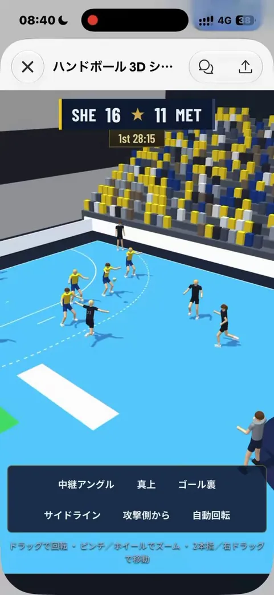</a>

**Imagens de referência:** [1](https://media.tripogrowth.space/media/6a116b62-88ce-491b-b4ba-eed6d9c9f168.jpg) · [2](https://pbs.twimg.com/media/HS29xCPaYAAcMmd.jpg)

**Prompt**

```text
Renderize em 3D a quadra de handebol, o gol, o árbitro, os jogadores e a bola presentes na imagem, permitindo visualização livre em 360°, de qualquer ângulo. Reproduza com precisão a pose de cada pessoa e as cores dos objetos.
```

<details>
<summary>Prompt original</summary>

```text
画像内のハンドボールコート、ゴール、レフェリー、プレイヤー、ボールを3dレンダリングして、360度自由角度から見れるようにして。各人物の姿勢まで、また物体の色まで正確に再現して。
```

</details>

[Ver detalhes ↗](https://www.tripo3d.ai/pt/3d-prompts/claude-opus-5-5-2102544406117286004) · [Publicação original](https://x.com/chikaidev/status/2102545257372213581) · [Voltar aos exemplos](#all-prompts)

---

<a id="claude-opus-5-5-2102544196808667471"></a>

### Plano de fundo procedural 3D para menu principal do Three.js a partir de uma imagem

[Majid Manzarpour](https://x.com/majidmanzarpour) · 2026-09-22 · Claude Opus 5.5 · Cenas

<a href="https://www.tripo3d.ai/pt/3d-prompts/claude-opus-5-5-2102544196808667471">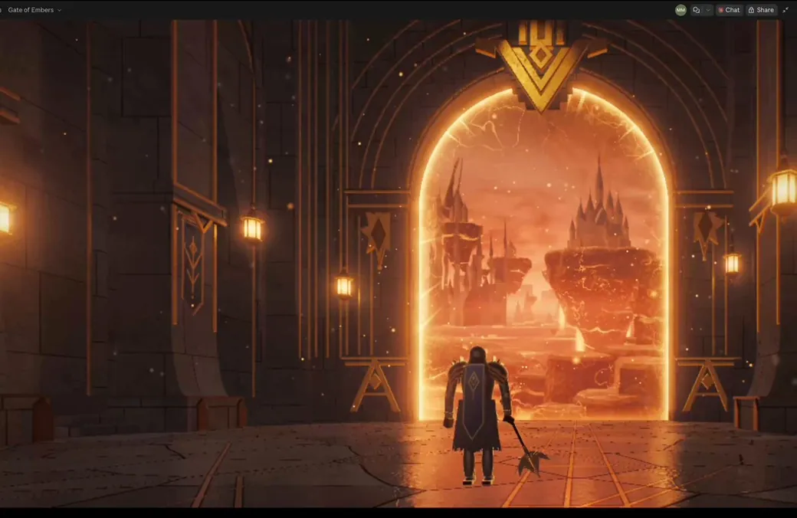</a>

**Imagens de referência:** [1](https://media.tripogrowth.space/media/de4534b1-fda8-4736-8558-09b7283f646a.jpg) · [2](https://pbs.twimg.com/media/HS28q6mWMAAxONB.jpg)

**Prompt**

```text
recrie esta imagem com perfeição como um plano de fundo totalmente procedural e animado para o menu principal em 3D com Three.js, em um único arquivo HTML
```

<details>
<summary>Prompt original</summary>

```text
recreate this perfectly, fully procedural, animated, main menu background in three.js 3D single HTML file
```

</details>

[Ver detalhes ↗](https://www.tripo3d.ai/pt/3d-prompts/claude-opus-5-5-2102544196808667471) · [Publicação original](https://x.com/majidmanzarpour/status/2102544198335373576) · [Voltar aos exemplos](#all-prompts)

---

<a id="claude-opus-5-5-2102544078927741369"></a>

### Máquina 3D de Rube Goldberg autônoma

[leo](https://x.com/leogao25) · 2026-09-22 · Claude Opus 5.5 · Animação

<a href="https://www.tripo3d.ai/pt/3d-prompts/claude-opus-5-5-2102544078927741369">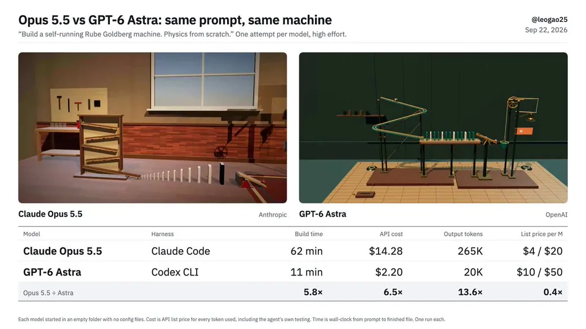</a>

**Prompt**

```text
Crie uma máquina 3D de Rube Goldberg que funcione sozinha, em um único index.html autocontido no diretório atual.

A sequência, nesta ordem:
1. Uma bolinha de gude é solta no topo e desce rolando por uma série de rampas em zigue-zague.
2. Ela derruba uma fileira de pelo menos 12 dominós.
3. O último dominó inclina uma gangorra, que lança uma bolinha em um balde suspenso.
4. O peso do balde o puxa para baixo; sua corda passa por uma polia e puxa um sino, que balança visivelmente.
5. O mesmo movimento ergue uma bandeira em um mastro. A bandeira chegar ao topo é o fim da sequência.

Regras:
- Escreva a física por conta própria: não use biblioteca de física. Todo movimento após a liberação da bolinha de gude deve vir da sua simulação (corpos rígidos, colisões, restrições, corda e polia). Não use animação com keyframes nem movimento interpolado de nenhuma parte da máquina.
- Você pode carregar o Three.js de uma CDN para a renderização. Nada mais externo: não use imagens, modelos ou fontes.
- O projeto deve funcionar sem interação do usuário: iniciar automaticamente ao carregar a página, usar uma câmera cinematográfica que acompanhe a ação e concluir toda a sequência em cerca de 15–20 segundos. Depois que a bandeira subir, aguarde 2 segundos, redefina e repita a sequência.
- Determinístico: use um intervalo de tempo fixo e nenhuma aleatoriedade sem seed, para que todas as execuções tenham a mesma aparência.
- Preencha a janela do navegador. A gravação de tela será feita em 1280×720.
- Não exiba texto na tela nem qualquer tipo de interface.
- Capriche no visual: use iluminação, sombras, materiais e um cenário que façam a engenhoca parecer real.
```

<details>
<summary>Prompt original</summary>

```text
Build a 3D Rube Goldberg machine that runs itself, as a single self-contained index.html in the current directory.

The chain, in order:
1. A marble is released at the top and rolls down a series of zig-zag ramps.
2. It knocks over a line of at least 12 dominoes.
3. The last domino tips a seesaw, which launches a small ball into a hanging bucket.
4. The bucket's weight pulls it down; its rope runs over a pulley and yanks a bell, which visibly swings.
5. The same motion raises a flag up a pole. The flag reaching the top is the finish.

Rules:
- Write the physics yourself: no physics library. Every motion after the marble is released must come from your simulation (rigid bodies, collisions, constraints, rope/pulley). No keyframed animation or tweened motion of any machine part.
- You may load three.js from a CDN for rendering. Nothing else external: no images, models, or fonts.
- It must run with no user input: start automatically on page load, use a cinematic camera that follows the action, and complete the whole chain in about 15–20 seconds. After the flag is up, hold for 2 seconds, then reset and replay.
- Deterministic: fixed timestep and no unseeded randomness, so every run looks the same.
- Fill the browser window. It will be screen-recorded at 1280×720.
- No on-screen text or UI of any kind.
- Make it look good: lighting, shadows, materials, and a setting that makes it feel like a real contraption.
```

</details>

[Ver detalhes ↗](https://www.tripo3d.ai/pt/3d-prompts/claude-opus-5-5-2102544078927741369) · [Publicação original](https://x.com/leogao25/status/2102544081863717153) · [Voltar aos exemplos](#all-prompts)

---

<a id="claude-opus-5-5-2102538762731565085"></a>

### Jogo interativo de animais de fazenda no estilo de Peter Rabbit

[mblaso](https://x.com/blaso96) · 2026-09-22 · Claude Opus 5.5 · Jogos

<a href="https://www.tripo3d.ai/pt/3d-prompts/claude-opus-5-5-2102538762731565085">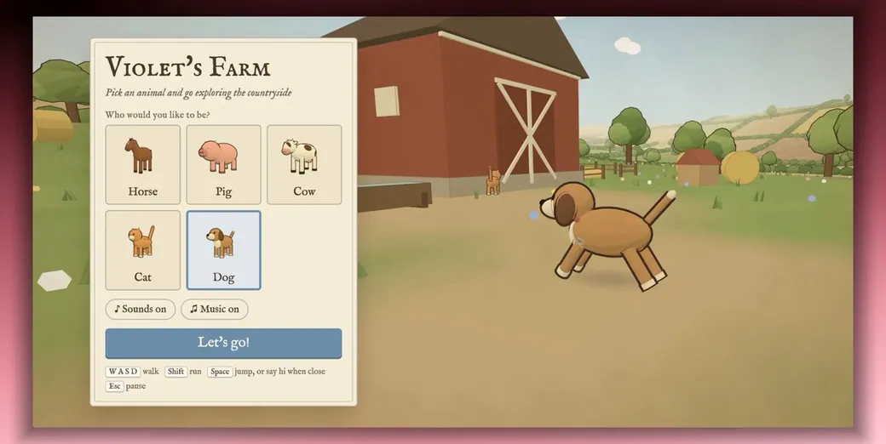</a>

**Prompt**

```text
"Crie um jogo interativo de animais de fazenda usando o design/estilo artístico de "Peter Rabbit"
menu principal = sons ativados/desativados + seletor de animais (cavalo, porco, vaca, gato, cachorro)
esc = pausar: voltar ao ponto inicial/menu principal
use WASD para se movimentar
barra de espaço para pular e interagir com outros animais quando estiver por perto
as interações são aleatorizadas quando a proximidade é detectada
é possível interagir emitindo sons para o outro animal (diferentes dos sons passivos dele) e "dar um toquezinho nele"
itens interativos: água para beber, feno para comer e frutas para comer. 
terceira pessoa, mas como se a câmera estivesse ligeiramente atrás e acima do animal
sons ambientes: pássaros e aviões no céu (aleatoriamente)
cenário = área rural, celeiro e vila agrícola com casas (não é possível entrar nas casas)
Tenha assets suficientes para prender a atenção, mas não tantos a ponto de exigir um acabamento de produção; isso serve apenas para passar 15 minutos do meu dia com minha filha e se divertir
react, svg, js, webgl, threejs, ou o que for necessário para que a experiência fique "boa""
```

<details>
<summary>Prompt original</summary>

```text
"Create a interactive farm animal game using the design/art style of "Peter Rabbit"
main menu = sounds on/off + animal picker (horse, pig, cow, cat, dog)
esc = pause: reset back to spawn/main menu/
wasd to move around
spacebar to jump and to interact with other animals when near
interactions are randomized upon proximity detection
interactions can be make sounds at the other animal (unique from their passive sounds) "boop them"
interactible with: water to drink, hay to eat, fruit to eat. 
3rd person but as if the camera was slightly behind the animal and above it
ambience animals are birds, airplanes in the sky (randomly)
setting= farmland, barn, farming village with houses (cant enter houses)
Enough assets to capture attention, but not enough that it needs to be deemed production grade, this is just to capture 15 minutes out of my day with my daughter and have fun
react, svg, js, webgl, threejs, whatever is necessary to make it feel "good""
```

</details>

[Ver detalhes ↗](https://www.tripo3d.ai/pt/3d-prompts/claude-opus-5-5-2102538762731565085) · [Publicação original](https://x.com/blaso96/status/2102538764749037738) · [Voltar aos exemplos](#all-prompts)

---

<a id="claude-opus-5-5-2102533729746882985"></a>

### Navio pirata cinematográfico e interativo ao pôr do sol

[Vib3Coded](https://x.com/vib3coded) · 2026-09-22 · Claude Opus 5.5 · Cenas

<a href="https://www.tripo3d.ai/pt/3d-prompts/claude-opus-5-5-2102533729746882985"></a>

**Prompt**

```text
Crie do zero uma cena 3D totalmente interativa de um navio pirata navegando por um oceano dinâmico ao pôr do sol. O estilo visual deve ser cinematográfico e estilizado, não fotorrealista, mas ainda assim excepcionalmente rico, detalhado, refinado e visualmente sofisticado. Modele o navio, o oceano, o céu, a iluminação, os materiais, as velas, o rigging, os canhões, os pequenos detalhes estruturais, a espuma do mar, a esteira, as partículas, a animação, o trabalho de câmera, a composição, a profundidade atmosférica e a gradação de cores. O resultado final deve transmitir a qualidade de uma obra 3D premium, produzida em alto nível, e não de um protótipo, demonstração técnica ou cena de baixa qualidade. Comece com uma página completamente em branco. Não reutilize nem dependa de nenhum projeto ou cena anterior. Você pode criar os assets por conta própria ou usar assets e bibliotecas confiáveis, de código aberto e de boa procedência quando necessário. Requisitos obrigatórios: nenhum texto de qualquer tipo pode aparecer em nenhum lugar da cena. Não inclua títulos, nomes, logotipos, descrições, créditos, rótulos ou instruções de controle em nenhum idioma. Entregue o projeto inteiro como um único arquivo de página independente, que possa ser aberto diretamente em um navegador, com os assets incorporados nele tanto quanto for razoavelmente possível. O oceano, o navio, as velas e a câmera devem ser animados de forma natural e fluida. Evite câmera lenta artificial ou movimentos lentos e pesados. O navio deve transmitir a sensação de estar realmente se deslocando pela água. Não use formas geométricas primitivas como resultado final. Crie um navio pirata visualmente convincente e detalhado, incluindo um casco cuidadosamente modelado, mastros, velas, rigging, cordas, canhões, corrimões, lanternas, estruturas do convés e detalhes claramente visíveis em pequena escala. A iluminação deve revelar com clareza a geometria e os materiais do navio. Crie uma atmosfera rica de pôr do sol, sombreamento profundo no oceano, reflexos, espuma do mar convincente e uma esteira detalhada atrás e ao redor da embarcação. Mantenha um equilíbrio sólido entre qualidade visual e desempenho em tempo real, preservando a interação e a animação fluidas sem sacrificar a qualidade de forma evidente. Use automaticamente as habilidades, ferramentas, bibliotecas, técnicas e assets disponíveis mais adequados para alcançar o melhor resultado. Não espere que eu especifique quais tecnologias usar. Teste de fato o resultado final em um navegador para desktop. Capture screenshots visuais, inspecione o console do navegador em busca de erros e corrija todos os problemas visíveis ou técnicos encontrados, incluindo geometria deformada, telas pretas, falhas no carregamento de assets, animação quebrada, composição ruim, artefatos de renderização ou problemas de câmera. No final, verifique se o arquivo final abre e funciona diretamente, se a cena não contém texto algum e se não restam erros de execução ou carregamento. Depois, conclua a tarefa com apenas uma resposta breve.
```

<details>
<summary>Prompt original</summary>

```text
Create from scratch a fully interactive 3D scene of a pirate ship sailing across a dynamic ocean at sunset. The visual style should be cinematic and stylized rather than photorealistic, while still being exceptionally rich, detailed, polished, and visually sophisticated. Build the ship, ocean, sky, lighting, materials, sails, rigging, cannons, small structural details, sea foam, wake, particles, animation, camera work, composition, atmospheric depth, and color grading. The final result should feel like a premium, high-production 3D artwork, not a prototype, technical demo, or low-quality scene. Start from a completely blank page. Do not reuse or depend on any previous project or scene. You may create the assets yourself or use reliable, trusted, open-source assets and libraries when necessary. Mandatory requirements: No text of any kind may appear anywhere inside the scene. No titles, names, logos, descriptions, credits, labels, or control instructions in any language. Deliver the entire project as one final standalone page file that can be opened directly in a web browser, with assets embedded inside it as much as reasonably possible. The ocean, ship, sails, and camera must all be animated naturally and smoothly. Avoid artificial slow motion or sluggish movement. The ship should feel like it is genuinely moving through the water. Do not rely on primitive geometric shapes as the finished result. Build a visually convincing and detailed pirate ship, including a carefully shaped hull, masts, sails, rigging, ropes, cannons, railings, lanterns, deck structures, and clearly visible small-scale details. Lighting must reveal the ship's geometry and materials clearly. Create a rich sunset atmosphere, deep ocean shading, reflections, convincing sea foam, and a detailed sailing wake behind and around the vessel. Maintain a strong balance between visual quality and real-time performance, preserving smooth interaction and animation without making an obvious sacrifice in quality. Automatically use the most appropriate skills, tools, libraries, techniques, and available assets needed to achieve the best result. Do not wait for me to specify which technologies to use. Actually test the finished result in a desktop web browser. Capture visual screenshots, inspect the browser console for errors, and fix every visible or technical issue you find, including distorted geometry, black screens, failed asset loading, broken animation, poor composition, rendering artifacts, or camera problems. At the end, verify that the final file opens and works directly, that the scene contains no text whatsoever, and that there are no remaining runtime or loading errors. Then finish the task with only a brief response.
```

</details>

[Ver detalhes ↗](https://www.tripo3d.ai/pt/3d-prompts/claude-opus-5-5-2102533729746882985) · [Publicação original](https://x.com/vib3coded/status/2102534606121746589) · [Voltar aos exemplos](#all-prompts)

---

<a id="claude-opus-5-5-2102529695908806728"></a>

### Mundo infinito gerado proceduralmente em Three.js

[🥔🥔🥔](https://x.com/argofowl) · 2026-09-22 · Claude Opus 5.5 · Jogos

<a href="https://www.tripo3d.ai/pt/3d-prompts/claude-opus-5-5-2102529695908806728"></a>

**Prompt**

```text
crie um novo projeto na minha pasta de projetos chamado "endless-game": um mundo infinito, gerado proceduralmente com Three.js no navegador, que eu possa explorar livremente e simplesmente curtir. Cada área deve ser gerada aleatoriamente, com surpresas por toda parte, não importa por quanto tempo eu jogue. O jogo deve transmitir uma sensação calma, relaxante e realmente divertida, como a atmosfera aconchegante e satisfatória de um simulador de supermercado, mas não deve ser um jogo de supermercado. Quero um mundo muito interessante para percorrer, com entidades que eu possa encontrar e com as quais possa interagir, além de gráficos incríveis. Defina um objetivo claro para o projeto, continue trabalhando até alcançá-lo e reproduza um toque sonoro quando tudo estiver pronto para eu jogar e testar.
```

<details>
<summary>Prompt original</summary>

```text
create a new project in my projects folder called "endless-game": an endless, procedurally generated world built with three.js in the browser that i can roam freely and just enjoy. every area should be randomly generated, with surprises everywhere no matter how long i play. it should feel calm, relaxing and genuinely fun, like the cozy, satisfying vibe of a supermarket simulator, but it shouldn't be a supermarket game. i want a really interesting world to walk around in, with entities i can meet and interact with, and really cool graphics. set a clear goal for the project, keep working until you reach it, and play a sound chime when it's done and ready for me to play and test.
```

</details>

[Ver detalhes ↗](https://www.tripo3d.ai/pt/3d-prompts/claude-opus-5-5-2102529695908806728) · [Publicação original](https://x.com/argofowl/status/2102529695908806728) · [Voltar aos exemplos](#all-prompts)

---

<a id="claude-opus-5-5-2102467667978572092"></a>

### Simulação interativa de evacuação de multidões

[Dom](https://x.com/dominikmartn) · 2026-09-22 · Claude Opus 5.5 · Animação

<a href="https://www.tripo3d.ai/pt/3d-prompts/claude-opus-5-5-2102467667978572092">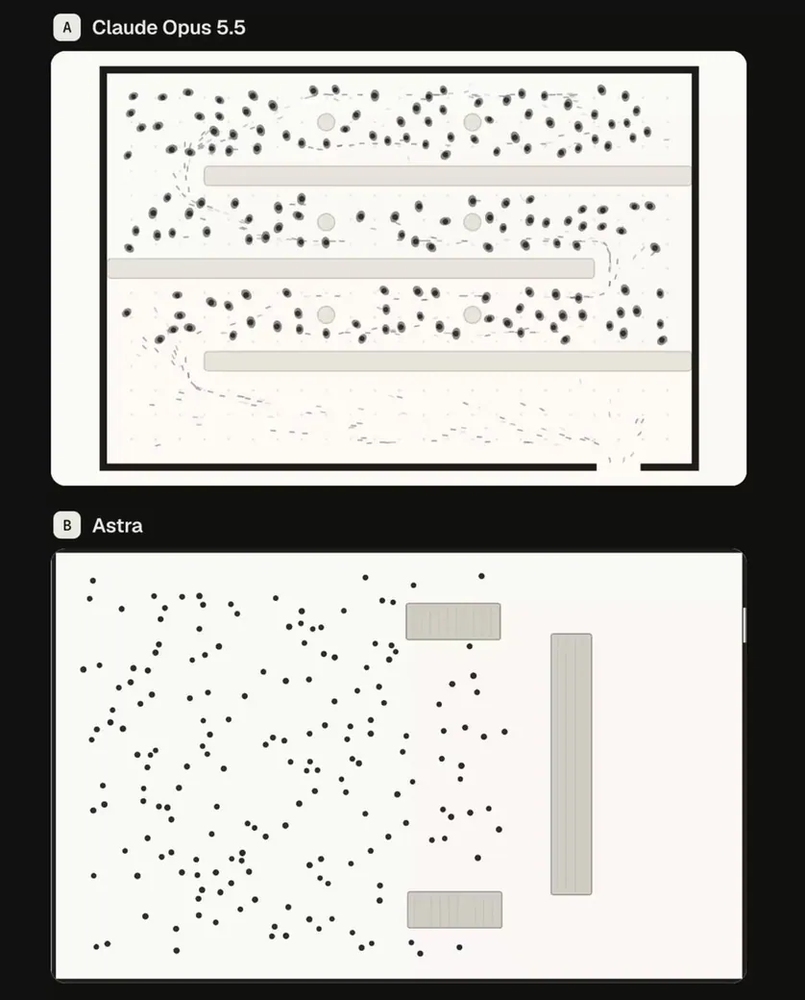</a>

**Prompt**

```text
Crie uma simulação interativa de evacuação de multidões e mostre onde surgem gargalos.
```

<details>
<summary>Prompt original</summary>

```text
build an interactive crowd evacuation sim and see where it jams
```

</details>

[Ver detalhes ↗](https://www.tripo3d.ai/pt/3d-prompts/claude-opus-5-5-2102467667978572092) · [Publicação original](https://x.com/dominikmartn/status/2102467667978572092) · [Voltar aos exemplos](#all-prompts)

---

<a id="claude-opus-5-5-2102450239923720440"></a>

### Ilha pré-histórica 3D interativa

[Vib3Coded](https://x.com/vib3coded) · 2026-09-22 · Claude Opus 5.5 · Interativo

<a href="https://www.tripo3d.ai/pt/3d-prompts/claude-opus-5-5-2102450239923720440">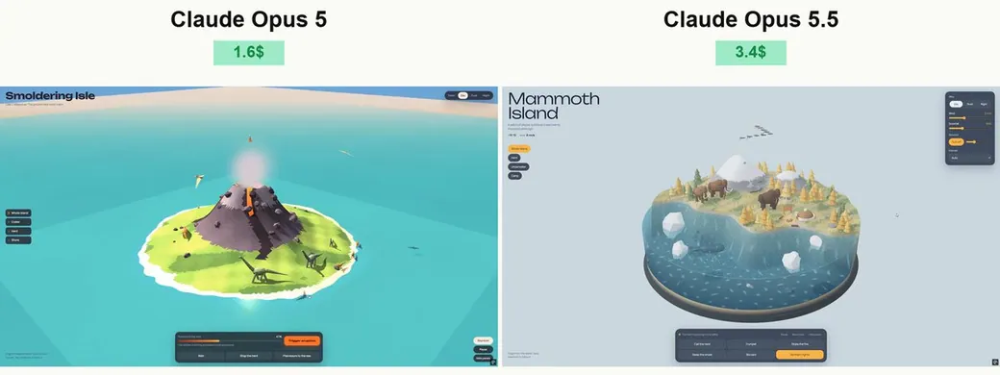</a>

**Prompt**

```text
Crie uma ilha pré-histórica 3D bonita, altamente detalhada e totalmente interativa usando Three.js e WebGL. Entregue tudo em um único arquivo HTML autônomo que abra diretamente no Chrome. Incorpore os assets sempre que possível.

DIREÇÃO VISUAL
Construa uma ilha grande e arredondada cercada por um oceano, com uma seção transversal subaquática transparente. O resultado deve transmitir a sensação de um mundo em miniatura premium: vegetação exuberante, dinossauros expressivos, materiais ricos, iluminação atmosférica e animação refinada. Use uma direção de arte estilizada e coesa, em vez de formas geométricas básicas.
ISLAND
Crie um terreno variado com praias, penhascos rochosos, florestas pré-históricas densas, samambaias gigantes, uma cachoeira, um lago de água doce e um vulcão. Adicione uma pequena estação de pesquisa, passarelas de madeira, plataformas de observação, caixas de suprimentos e ninhos de dinossauro. Faça a ilha ser espaçosa o bastante para que os dinossauros se movimentem naturalmente entre áreas distintas.

SEÇÃO TRANSVERSAL DA ÁGUA
A água deve formar um volume profundo e arredondado ao redor da ilha, com o cenário subaquático claramente visível através de suas laterais. Inclua um fundo do mar texturizado, rochas, plantas aquáticas, peixes, bolhas e um réptil marinho verde nadando abaixo da superfície. Não coloque dinossauros terrestres comuns debaixo d’água nem adicione um submarino.
Use ondas animadas, reflexos de Fresnel, padrões de luz subaquáticos, espuma na margem e respingos. Evite artefatos de ordenação de transparência e espaços visíveis entre a ilha e a água.

DINOSAURS
Inclua várias espécies distintas, como um saurópode de pescoço longo, Triceratops, Stegosaurus, um grande terópode e animais de rebanho menores. Adicione pterossauros circulando no alto.
Dê a cada espécie uma anatomia reconhecível, corpos bem modelados, membros articulados, cabeças detalhadas, caudas e padrões de pele apropriados. Evite montar os dinossauros finalizados a partir de caixas óbvias ou esferas desconectadas.

ANIMAÇÃO NATURAL
Use esqueletos hierárquicos com articulações posicionadas corretamente. A caminhada deve ter fases distintas de apoio e balanço: os pés permanecem firmes no chão durante o contato e se elevam de forma limpa a cada passo. Ajuste o comprimento da passada à velocidade de movimento.

Use amostragem do terreno e cinemática inversa para manter os pés no chão. Adicione mudanças de peso, movimentos corporais sutis, movimento equilibrado da cauda, giros de cabeça e respiração. Os dinossauros nunca devem flutuar, deslizar, atravessar o chão ou passar através de construções, rochas, árvores ou uns dos outros.
Use desvio de obstáculos e caminhos seguros. Espécies diferentes devem ter velocidades de movimento, padrões de marcha e comportamentos distintos. Os animais marinhos devem estar voltados para a direção em que se deslocam.

INTERACTION
Permita que os usuários:

Girem a câmera livremente, usem zoom e inspecionem a seção transversal subaquática.
Selecionem um dinossauro e o acompanhem com uma câmera que se mova suavemente.

Coloquem comida em locais adequados e observem os dinossauros próximos se aproximarem e comerem.

Acionem ações de beber, descansar e chamar, além do movimento do rebanho.

Explorem ninhos e observem um filhote sair do ovo.
Acionem a subida à superfície de um réptil marinho com um respingo.
Alternem entre dia, pôr do sol e noite.
Ajustem a chuva, o vento e a atividade vulcânica.
Pausem a simulação e redefinam a cena.
Façam com que cada controle produza uma resposta clara e visível. Mantenha as interações repetíveis e impeça que animações sobrepostas quebrem as poses dos personagens.
ATMOSFERA E ÁUDIO
Adicione folhagens em movimento, nuvens à deriva, pássaros, insetos, partículas de chuva e luzes quentes da estação de pesquisa à noite. Inclua música ambiente suave e sons do ambiente, com um controle de música e um slider de volume funcionais. Inicie o áudio somente após a interação do usuário.
INTERFACE
Use uma interface compacta e elegante, com rótulos em inglês. Mantenha a cena em destaque e evite painéis grandes cobrindo a ilha. Faça o layout ser responsivo para desktop e dispositivos móveis.
QUALIDADE TÉCNICA
Use instancing para vegetação e objetos repetidos, geometria eficiente, sombras adequadas e pós-processamento moderado. Equilibre a riqueza visual com um desempenho suave em tempo real.
Crie uma cena completa, não um mockup. Teste o HTML final diretamente em um navegador para desktop, inspecione as capturas de tela e o console, exercite todas as interações e corrija erros de carregamento, dinossauros flutuando, deslizamento dos pés, colisões quebradas, artefatos na água e problemas de câmera antes da entrega.
```

<details>
<summary>Prompt original</summary>

```text
Create a beautiful, highly detailed, fully interactive 3D prehistoric island using Three.js and WebGL. Deliver everything in a single standalone HTML file that opens directly in Chrome. Embed assets wherever possible.

VISUAL DIRECTION
Build a large, rounded island surrounded by an ocean with a transparent underwater cross-section. The result should feel like a premium miniature world: lush vegetation, expressive dinosaurs, rich materials, atmospheric lighting, and polished animation. Use a cohesive, stylized art direction rather than basic geometric shapes.
ISLAND
Create varied terrain with beaches, rocky cliffs, dense prehistoric forests, giant ferns, a waterfall, a freshwater pond, and a volcano. Add a small research station, wooden walkways, observation platforms, supply crates, and dinosaur nests. Make the island spacious enough for dinosaurs to move naturally between distinct areas.

WATER CROSS-SECTION
The water must form a deep, rounded volume around the island, with clearly visible underwater scenery through its sides. Include a textured seabed, rocks, aquatic plants, fish, bubbles, and a green marine reptile swimming beneath the surface. Do not place ordinary land dinosaurs underwater, and do not add a submarine.
Use animated waves, Fresnel reflections, underwater light patterns, shoreline foam, and splashes. Avoid transparency sorting artifacts and visible gaps between the island and water.

DINOSAURS
Include several distinct species, such as a long-necked sauropod, Triceratops, Stegosaurus, a large theropod, and smaller herd animals. Add pterosaurs circling overhead.
Give every species recognizable anatomy, shaped bodies, articulated limbs, detailed heads, tails, and appropriate skin patterns. Avoid assembling the finished dinosaurs from obvious boxes or disconnected spheres.

NATURAL ANIMATION
Use hierarchical skeletons with correctly positioned joints. Walking must have distinct stance and swing phases: feet stay planted during contact and lift cleanly during each step. Match stride length to movement speed.

Use terrain sampling and inverse kinematics to keep feet on the ground. Add weight shifts, subtle body movement, balanced tail motion, head turns, and breathing. Dinosaurs must never float, slide, intersect the ground, or walk through buildings, rocks, trees, or each other.
Use obstacle avoidance and safe paths. Different species should have different movement speeds, gait patterns, and behaviors. Marine animals must face their direction of travel.

INTERACTION
Allow users to:

Rotate the camera freely, zoom, and inspect the underwater cross-section.
Select a dinosaur and follow it with a smoothly moving camera.

Place food in suitable locations and watch nearby dinosaurs approach and eat.

Trigger drinking, resting, calling, and herd movement.

Explore nests and watch a hatchling emerge.
Trigger a marine reptile surfacing with a splash.
Switch between daylight, sunset, and night.
Adjust rain, wind, and volcanic activity.
Pause the simulation and reset the scene.
Make every control produce a clear, visible response. Keep interactions repeatable and prevent overlapping animations from breaking character poses.
ATMOSPHERE AND AUDIO
Add moving foliage, drifting clouds, birds, insects, rain particles, and warm research-station lights at night. Include quiet atmospheric music and environmental sounds with a working music toggle and volume slider. Start audio only after user interaction.
INTERFACE
Use a compact, elegant interface with English labels. Keep the scene dominant and avoid large panels covering the island. Make the layout responsive for desktop and mobile.
TECHNICAL QUALITY
Use instancing for repeated vegetation and props, efficient geometry, appropriate shadows, and restrained post-processing. Balance visual richness with smooth real-time performance.
Build a complete scene, not a mockup. Test the final HTML directly in a desktop browser, inspect screenshots and the console, exercise every interaction, and fix loading errors, floating dinosaurs, foot sliding, broken collisions, water artifacts, and camera problems before delivery.
```

</details>

[Ver detalhes ↗](https://www.tripo3d.ai/pt/3d-prompts/claude-opus-5-5-2102450239923720440) · [Publicação original](https://x.com/vib3coded/status/2102450842070569099) · [Voltar aos exemplos](#all-prompts)

---


[Catálogo completo](catalog.pt.md) · **1 / 1**

<p align="center"><strong><a href="https://www.tripo3d.ai/pt/3d-prompts/models/claude-opus-5-5?utm_source=github&amp;utm_medium=referral&amp;utm_campaign=awesome_opus_5_5_prompts&amp;utm_content=catalog_footer">Catálogo completo →</a></strong></p>
