<!-- Generated from Growth CMS by templates/catalog.md. Edit content in CMS; run npm run sync. -->

# Awesome Opus 5.5 Prompts — 1 / 2

[← Awesome Opus 5.5 Prompts](../README.md)

<p>
  <a href="../docs/catalog.en.1.md"></a>
  <a href="../docs/catalog.zh.1.md"></a>
  <a href="../docs/catalog.zh-Hant.1.md"></a>
  <a href="../docs/catalog.ja.1.md"></a>
  <a href="../docs/catalog.ko.1.md"></a>
  <a href="../docs/catalog.es.1.md"></a>
  <a href="../docs/catalog.pt.1.md"></a>
  <a href="../docs/catalog.de.1.md"></a>
  <a href="../docs/catalog.fr.1.md"></a>
  <a href="../docs/catalog.it.1.md"></a>
  <a href="../docs/catalog.ru.1.md"></a>
  <a href="../docs/catalog.tr.1.md"></a>
  <a href="../docs/catalog.uk.1.md"></a>
  <a href="../docs/catalog.vi.1.md"></a>
</p>

[Полный каталог](catalog.ru.md) · **1 / 2** · [→](catalog.ru.2.md)

<a id="all-prompts"></a>

<details>
<summary>Посмотреть примеры (50)</summary>

- [Механическая машина Руба Голдберга в Blender](#claude-opus-5-5-2104953406708175097)
- [Гоночная игра в стиле Mario Kart на 3JS](#claude-opus-5-5-2104947552328261810)
- [Интерактивная мультяшная 3D-планета](#claude-opus-5-5-2104919117262389255)
- [30-секундный брендированный 3D-ролик в стиле моушн-дизайна](#claude-opus-5-5-2104896325255037196)
- [АТЛАС ЗЕМЛИ: ЖИВАЯ ПЛАНЕТА](#claude-opus-5-5-2104837836507955401)
- [Интерактивная лаборатория по моделированию последовательной производственной линии](#claude-opus-5-5-2104831049020674144)
- [Ходячая архитектура](#claude-opus-5-5-2104590334152056983)
- [Играбельный пиксельный beat ’em up в Древнем Риме](#claude-opus-5-5-2104571944842498150)
- [Интерактивный клубничный торт на WebGPU](#claude-opus-5-5-2104514806443303238)
- [Полнофункциональный набор LEGO Ford Model T](#claude-opus-5-5-2104232297167716457)
- [Гиперреалистичный многопользовательский FPS в заснеженном переулке](#claude-opus-5-5-2104232013578617241)
- [55-секундная 3D-сцена: от дата-центра до атома](#claude-opus-5-5-2104223449849761837)
- [Динамичный 30-секундный проморолик Kiiwi в формате моушн-графики](#claude-opus-5-5-2104204312624918810)
- [Аниме-стилизованная 3D-сцена с тремя транспортными средствами, которые трансформируются и объединяются](#claude-opus-5-5-2104193522715029657)
- [Моушен UI с ИИ-орбом для Claude Code — Opus 5.5](#claude-opus-5-5-2104162483888062945)
- [Профессиональный 15-секундный ролик с моушн-дизайном и графикой](#claude-opus-5-5-2103846630088716687)
- [Воксельная игра в стиле Minecraft с продвинутыми шейдерами](#claude-opus-5-5-2103822946800165270)
- [Моушн-дизайн-видео в стиле Spotify](#claude-opus-5-5-2103801834930606193)
- [Динамичный 15-секундный шоурил по моушн-дизайну](#claude-opus-5-5-2103504887439065439)
- [Воксельная survival-игра-песочница на WebGL2](#claude-opus-5-5-2103502454750920925)
- [Навигация по 3D-пагоде](#claude-opus-5-5-2103483174957597035)
- [Свободно исследуемый 3D-город с сакурой в стиле аниме](#claude-opus-5-5-2103480081809346597)
- [Анимация в моушн-графике «Цикл жизни»](#claude-opus-5-5-2103428454355980558)
- [Интерактивная 3D-сцена запуска ракеты над океаном](#claude-opus-5-5-2103303303358534021)
- [Интерактивное средневековое королевство для Claude Opus 5.5](#claude-opus-5-5-2103257687492374597)
- [Пустота: короткометражный фильм о соборе, наполненном светом витражей](#claude-opus-5-5-2103145567945986461)
- [Игра в стиле Genshin Impact в Сан-Франциско](#claude-opus-5-5-2103144530157687114)
- [Кинематографичный фильм о битве при Аустерлице](#claude-opus-5-5-2103116235009347650)
- [Создайте Эйфелеву башню в Three.js](#claude-opus-5-5-2103106070549757960)
- [Анимация на Three.js уровня Pixar для Grid Genius](#claude-opus-5-5-2103087766662009118)
- [Игра в реальном времени: пеликан на велосипеде](#claude-opus-5-5-2103083781490176212)
- [Создайте имперский город](#claude-opus-5-5-2103046279253168554)
- [Создание Bugatti Chiron Super Sport в Three.js](#claude-opus-5-5-2102828216289566725)
- [Тренировочный монтаж роста возможностей Claude](#claude-opus-5-5-2102788371114246177)
- [Создайте мультфильм в стиле 90-х с качеством уровня Pixar на Three.js](#claude-opus-5-5-2102788223835463902)
- [Зацикленная анимация круговорота воды, созданная кодом](#claude-opus-5-5-2102781807179735211)
- [CatWalk: 3D-игра про кота, мчащегося по ночному городу](#claude-opus-5-5-2102775461701091531)
- [Бенчмарк киберпанк-мегаполиса «Последний поезд»](#claude-opus-5-5-2102740078347087940)
- [Воксельная футбольная анимация](#claude-opus-5-5-2102739444256383089)
- [Интерактивный сайт о вымышленных планетах](#claude-opus-5-5-2102729710174196022)
- [Интерактивная эйлерова неоновая симуляция жидкости](#claude-opus-5-5-2102565611473661963)
- [Интерактивный 3D-ландшафт японской сакурной долины](#claude-opus-5-5-2102565403109085669)
- [Модель аварии Hundenberg и реалистичное видео](#claude-opus-5-5-2102547809140355250)
- [360-градусный 3D-рендеринг гандбольной площадки по изображению](#claude-opus-5-5-2102544406117286004)
- [Процедурный 3D-фон главного меню в Three.js по изображению](#claude-opus-5-5-2102544196808667471)
- [Самозапускающаяся 3D-машина Руба Голдберга](#claude-opus-5-5-2102544078927741369)
- [Интерактивная игра о фермерских животных в стиле «Питера Кролика»](#claude-opus-5-5-2102538762731565085)
- [Кинематографичный интерактивный пиратский корабль на закате](#claude-opus-5-5-2102533729746882985)
- [Бесконечный процедурно генерируемый мир на Three.js](#claude-opus-5-5-2102529695908806728)
- [Интерактивная симуляция эвакуации толпы](#claude-opus-5-5-2102467667978572092)

</details>
<a id="claude-opus-5-5-2104953406708175097"></a>

### Механическая машина Руба Голдберга в Blender

[Atarax](https://x.com/Kwazikot) · 2026-09-29 · Claude Opus 5.5 · Сцены

<a href="https://www.tripo3d.ai/ru/3d-prompts/claude-opus-5-5-2104953406708175097">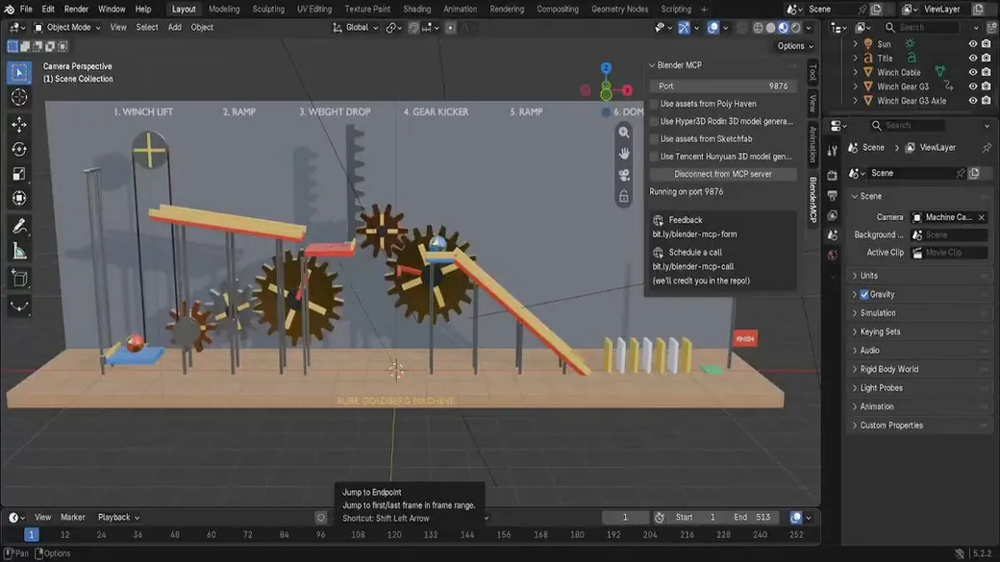</a>

**Промпт**

```text
Создайте в Blender механическую машину Руба Голдберга. Используйте шестерни, наклонные рампы, шары и движущиеся платформы. Соберите сцену процедурно, проверяйте её после каждого основного этапа и исправляйте очевидные проблемы с геометрией.
```

<details>
<summary>Исходный промпт автора</summary>

```text
Create a mechanical Rube Goldberg machine in Blender. Use gears, ramps, balls, and moving platforms. Build it procedurally, inspect the scene after each major step, and fix obvious geometry issues.
```

</details>

[Подробнее ↗](https://www.tripo3d.ai/ru/3d-prompts/claude-opus-5-5-2104953406708175097) · [Исходная публикация](https://x.com/Kwazikot/status/2104953406708175097) · [Назад к примерам](#all-prompts)

---

<a id="claude-opus-5-5-2104947552328261810"></a>

### Гоночная игра в стиле Mario Kart на 3JS

[Tony](https://x.com/EnvolDev) · 2026-09-29 · Claude Opus 5.5 · Игры

<a href="https://www.tripo3d.ai/ru/3d-prompts/claude-opus-5-5-2104947552328261810">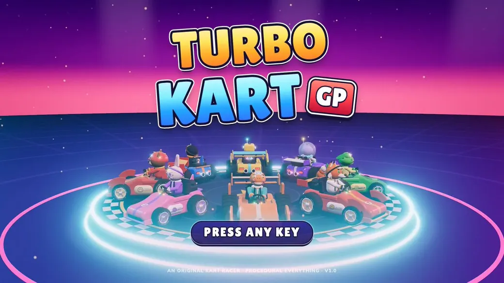</a>

**Промпт**

```text
Мне нужно, чтобы ты запустил пять субагентов (Model) и помог мне создать игру уровня AAA — клон Mario Kart. Я хочу, чтобы ты запустил этих субагентов, создал игру, не задавая мне вообще никаких вопросов, и использовал 3JS для её разработки. Когда закончишь, сообщи мне об этом.
```

<details>
<summary>Исходный промпт автора</summary>

```text
I need you to launch five(Model) sub-agents and help me build a triple A quality game that is a clone of Mario Kart. What I want you to do is I want you to launch these sub-agents, build the game without asking me any questions at all, and use 3JS to build the game. And once you're done, report back to me.
```

</details>

[Подробнее ↗](https://www.tripo3d.ai/ru/3d-prompts/claude-opus-5-5-2104947552328261810) · [Исходная публикация](https://x.com/EnvolDev/status/2104947905442505205) · [Назад к примерам](#all-prompts)

---

<a id="claude-opus-5-5-2104919117262389255"></a>

### Интерактивная мультяшная 3D-планета

[Aman](https://x.com/mdaman010) · 2026-09-29 · Claude Opus 5.5 · Интерактив

<a href="https://www.tripo3d.ai/ru/3d-prompts/claude-opus-5-5-2104919117262389255">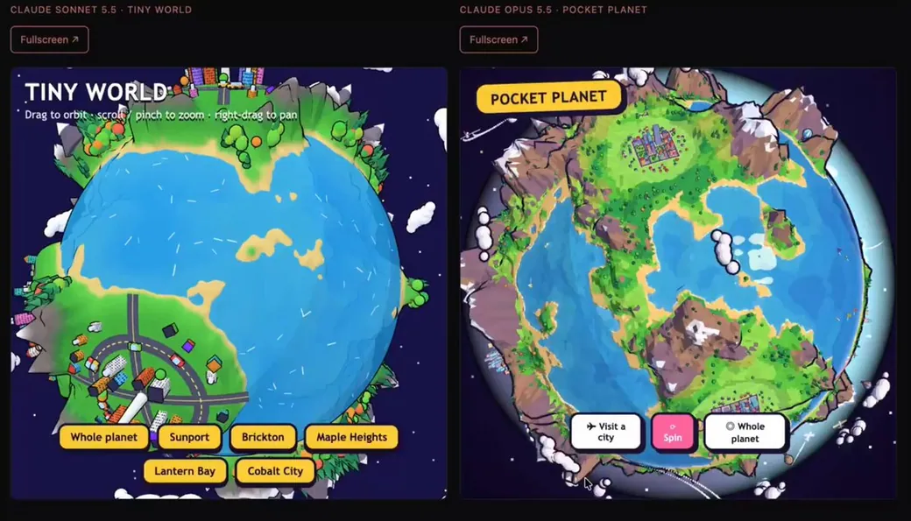</a>

**Промпт**

```text
Создайте мультяшную 3D-планету в стиле комикса на ThreeJS с яркой живой атмосферой: облаками, горами, городскими зданиями, автомобилями и самолётом, который летает вокруг неё. Планету должно быть можно вращать и масштабировать, чтобы рассматривать детали. Не используйте тестовую обвязку.
```

<details>
<summary>Исходный промпт автора</summary>

```text
Output a ThreeJS 3D cartoony/comics-like planet, with vibrant life on it: clouds, mountains, city buildings, cars and plane romaing it. It should be possible to orbit around and zoom and see the details. No harness is to be used
```

</details>

[Подробнее ↗](https://www.tripo3d.ai/ru/3d-prompts/claude-opus-5-5-2104919117262389255) · [Исходная публикация](https://x.com/mdaman010/status/2104919846953869421) · [Назад к примерам](#all-prompts)

---

<a id="claude-opus-5-5-2104896325255037196"></a>

### 30-секундный брендированный 3D-ролик в стиле моушн-дизайна

[Awa K. Penn](https://x.com/TawohAwa) · 2026-09-29 · Claude Opus 5.5 · Анимация

<a href="https://www.tripo3d.ai/ru/3d-prompts/claude-opus-5-5-2104896325255037196"></a>

**Промпт**

```text
Создай впечатляющий 30-секундный ролик в стиле моушн-дизайна для https://t.co/71rvEGmB6D — как шоурил элитного моушн-дизайнера. Сначала изучи сайт, затем используй реальные элементы бренда, интерфейс продукта, фирменные цвета и сообщения. Добавь выразительную типографику, 3D-анимацию, анимированный интерфейс, быстрые переходы и эффектное появление логотипа.
```

<details>
<summary>Исходный промпт автора</summary>

```text
Create a stunning 30-second motion graphics video for https://t.co/71rvEGmB6D that feels like an elite motion designer’s showreel. Study the website first and use the real brand, product UI, colours, and messaging. Use bold typography, 3D motion, animated UI, fast transitions, and a strong logo reveal.
```

</details>

[Подробнее ↗](https://www.tripo3d.ai/ru/3d-prompts/claude-opus-5-5-2104896325255037196) · [Исходная публикация](https://x.com/TawohAwa/status/2104896328300134868) · [Назад к примерам](#all-prompts)

---

<a id="claude-opus-5-5-2104837836507955401"></a>

### АТЛАС ЗЕМЛИ: ЖИВАЯ ПЛАНЕТА

[Gadgetify](https://x.com/Gdgtify) · 2026-09-29 · Claude Opus 5.5 · Интерактив

<a href="https://www.tripo3d.ai/ru/3d-prompts/claude-opus-5-5-2104837836507955401">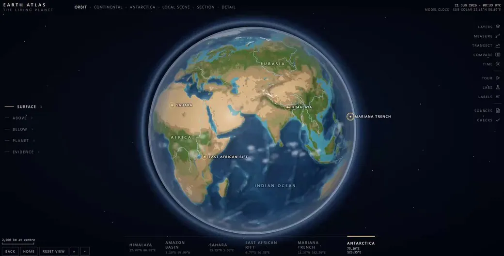</a>

**Промпт**

```text
Создай необычный интерактивный SVG-проект под названием «АТЛАС ЗЕМЛИ: ЖИВАЯ ПЛАНЕТА». Построй полноценную, детально исследуемую обсерваторию наук о Земле в ОДНОМ автономном HTML-файле. Я должен иметь возможность вставить весь твой вывод в файл, открыть его напрямую в Chrome и пользоваться им без сервера и подключения к сети. Используй любые полезные библиотеки, но включи весь необходимый исполняемый код и подготовленные данные в этот единственный HTML-файл. Глобус, региональные карты, рельеф, морское дно, разрезы, инструменты, графики, аннотации и иллюстрации крупным планом должны преимущественно отображаться в SVG.

Верни ТОЛЬКО полностью рабочий HTML в ОДНОМ блоке кода.

АМБИЦИЯ

Создай визуальное качество флагманской выставки NASA о науках о Земле, сочетая его с глубиной интерактивного атласа. Зритель начинает путешествие на орбите перед великолепной Землёй. Он может вращать глобус, перемещаться между светом и тьмой, выбирать реальное место, приближаться к его географии, проводить профиль, погружаться под поверхность или в океан и понимать, как эта точка связана со всей планетой.

Взаимодействие должно вознаграждать десять минут исследования. Нужны эффектные открытия, точные взаимодействия и связанные между собой виды — не просто вращающийся глобус с информационными всплывающими окнами. Первый кадр должен быть достаточно красивым, чтобы служить самостоятельной научной иллюстрацией.

ПОЛНОЦЕННАЯ СИСТЕМА МНОГОМАСШТАБНОГО ИССЛЕДОВАНИЯ

Построй продуманную иерархию масштабов:

1. ОРБИТАЛЬНАЯ ЗЕМЛЯ — весь глобус, атмосфера, граница дня и ночи, крупные географические формы и глобальные слои данных.
2. КОНТИНЕНТАЛЬНЫЙ МАСШТАБ — узнаваемые береговые линии, рельеф, крупные реки, океанические бассейны и выбранные научные объекты.
3. РЕГИОНАЛЬНЫЙ МАСШТАБ — детальный рельеф, батиметрия, изолинии, подписи и инструменты измерений.
4. ЛОКАЛЬНАЯ СЦЕНА — богато иллюстрированный ландшафт или океанская среда, характерные для выбранного места.
5. ВИД В РАЗРЕЗЕ — географически связанный профиль через сушу, лёд, океан или земную кору.
6. ДЕТАЛЬНЫЙ ВИД — изучение крупным планом такого объекта, как слой ледника, русло реки, разлом, осадочный пласт или форма рельефа морского дна.

На каждом уровне масштаба должны появляться новые, специально созданные SVG-детали, соответствующие этому масштабу. Не увеличивай одну и ту же низкополигональную геометрию до тех пор, пока она не превратится в пустое место.

Сохраняй географическую идентичность во время переходов. Выбранная точка на глобусе должна соответствовать региональной карте, локальной сцене, её профилю и разрезу.

Реализуй масштабирование к указателю, вращение глобуса перетаскиванием, панорамирование региональных видов перетаскиванием, масштабирование жестом pinch, навигацию с клавиатуры, команды «Назад», «Домой» и «Сбросить вид». Ограничь перемещение камеры и сделай его плавным. Показывай ненавязчивую масштабную линейку и хлебные крошки местоположения. Ручное взаимодействие должно корректно прерывать автоматическое перемещение камеры.

ВИЗУАЛЬНОЕ НАПРАВЛЕНИЕ

Сделай Землю главным визуальным элементом. Используй глубокий океанский синий, бирюзовый цвет мелководья, разнообразные зелёные оттенки растительности, охру пустынь, вулканический угольный, минеральные серые, ледниковый белый и тонкие линии аннотаций тёплого белого цвета.

Создай убедительный объём планеты с помощью спроектированной геометрии береговых линий, меняющегося освещения, эффектов рассеяния в атмосфере, слоёв облаков и тщательно дозированного отображения ночных огней, если встроен подходящий датированный источник.

Используй точную картографическую графику, элегантные изолинии, ненавязчивые текстурные паттерны материалов, читаемое затенение глубины и тонкие линии-выноски. Показывай информацию тогда, когда она полезна на текущем уровне масштаба, а не закрывай глобус множеством подписей.

Интерфейс должен напоминать продуманный научный прибор. Избегай шаблонных карточек дашборда, избытка неона и крупных плавающих текстовых панелей.

ГЛОБАЛЬНАЯ ЗЕМЛЯ

Создай вращаемый SVG-глобус с согласованной географической проекцией и обработкой координат. При вращении глобуса корректно проецируй формы суши, океанические объекты, подписи, выбранные маркеры, маршруты и терминатор. Скрывай геометрию дальней стороны, не прорисовывай её насквозь.

Добавь переключаемые слои:
• Физический рельеф.
• Глубина океана и строение морского дна.
• Крупные реки и бассейны стока.
• Границы литосферных плит.
• Выбранные исторические землетрясения из встроенной датированной выборки.
• Сетка широт и долгот.
• Датированные образцы наблюдений Земли — только там, где это подтверждается встроенными данными.
• Чистый кинематографичный вид.

Каждый слой должен использовать одну и ту же систему координат. Укажи его источник, дату, разрешение, единицы измерения и легенду.

Не называй слой «живым» или «текущим», если в файле используется встроенный снимок.

ШЕСТЬ ПОЛНОСТЬЮ ПРОРАБОТАННЫХ ЭКСПЕДИЦИЙ

Создай полноценные, различающиеся между собой сценарии для следующих регионов:

ГИМАЛАИ
Ярусные горные хребты, долины, ледники, снабжённый источником региональный профиль высот и наглядный разрез рельефа.

БАССЕЙН АМАЗОНКИ
Узнаваемая речная сеть, пойма и притоки, иллюстрированный разрез леса и образовательная демонстрация пути воды.

САХАРА
Дюны, каменистый рельеф, сухие русла, различные материалы поверхности и профиль рельефа. Отличай иллюстрированные детали дюн от данных о крупномасштабной высоте, полученных из источника.

ВОСТОЧНО-АФРИКАНСКИЙ РИФТ
Региональные озёра и рельеф, разрез вдоль разлома и наглядно подписанная концептуальная демонстрация тектоники.

РАЙОН МАРИАНСКОЙ ВПАДИНЫ
Поверхность океана, шельф и геометрия глубокого океана, если они уместны для выбранного профиля, перетаскиваемый профиль глубины, погружение через толщу воды и детально иллюстрированная сцена морского дна.

АНТАРКТИДА
Ледяная поверхность, контекст льда и рельефа на основе источника, если доступен, интерпретация в разрезе и демонстрация сезонного солнечного освещения.

Для каждой экспедиции предусмотрены:
• Сильная авторская вступительная композиция.
• Корректное положение на глобусе.
• Региональная карта.
• Как минимум одна локальная сцена.
• Как минимум один связанный разрез или профиль.
• Уникальное рабочее взаимодействие.
• Плавное возвращение на орбиту.

Не заменяй географическую специфику универсальным рисунком гор, леса, пустыни или океана.

ПЯТЬ СВЯЗАННЫХ РЕЖИМОВ ПРОСМОТРА

ПОВЕРХНОСТЬ
Исследуй топографию, особенности рельефа, реки, лёд и береговые линии с детализацией, зависящей от масштаба.

СВЕРХУ
Изучай солнечное освещение, сезонную геометрию, атмосферу и любые встроенные датированные наблюдения. Если облака или погода представлены иллюстративно, пометь их как иллюстративный сценарий.

СНИЗУ
Открывай разрез рельефа, льда, земной коры или океана вдоль выбранного географического профиля.

ПЛАНЕТА
Отдаляйся к глобальному разрезу и показывай, как выбранная точка связана со слоями Земли. Отображай соответствующее положение выбранного места и на глобусе, и на разрезе.

ДАННЫЕ
Показывай образец данных, источник, дату, разрешение, погрешность или известное ограничение, а также расчёт, лежащий в основе выбранного объекта или измерения.

При смене режима сохраняй выбранное место, контекст масштаба, если это уместно, и состояние временной шкалы.

СВЯЗАННЫЕ ИНСТРУМЕНТЫ ИССЛЕДОВАНИЯ

ИЗМЕРЕНИЕ
Выбирай две точки на глобусе или поддерживаемой региональной карте. Строй маршрут по большому кругу, отображай координаты и расстояние и сохраняй корректную проекцию маршрута при вращении глобуса.

ПРОФИЛЬ
Рисуй или корректируй линию в поддерживаемом регионе. Выбирай вдоль неё значения из встроенных данных о высоте или батиметрии и создавай профиль. Перемещение курсора по карте должно синхронно перемещать его аналог на профиле и в разрезе.

СРАВНЕНИЕ
Размещай два выбранных места рядом. Используй одинаковые единицы измерения и явные элементы управления масштабом. Сравнивай их высоту или глубину, широту, региональный контекст и доступные экологические данные.

ВРЕМЯ И СОЛНЕЧНЫЙ СВЕТ
Изменяй время суток и день года. Обновляй глобальное освещение и сезонную геометрию Солнца по документированной модели. Не связывай иллюстративную погоду с этими часами.

УПРАВЛЯЕМАЯ ЭКСПЕДИЦИЯ
Предложи короткое кинематографичное путешествие через шесть сред. На каждой остановке должно раскрываться взаимодействие, а не просто отображаться подпись. Тур должен поддерживать пропуск.

ПЛОТНОСТЬ АННОТАЦИЙ
Переключай кинематографичный, управляемый и технический уровни подписей, не изменяя исходную географию.

ИССЛЕДОВАНИЕ ОКЕАНА

Рассматривай морское дно как полноценный ландшафт. Показывай шельфы, склоны, абиссальные области, хребты и впадины там, где это поддерживается встроенным образцом рельефа. Используй явный вертикальный масштаб и подписывай любое преувеличение.

В экспедиции к Марианской впадине дай зрителю возможность погружаться через толщу воды. Одновременно обновляй глубину, освещённость, цвет, оценку давления по указанной упрощённой модели и курсор местоположения.

На крупном плане глубоководья могут присутствовать красивые иллюстрированные организмы и геология, но конкретные организмы и микрорельеф должны быть обозначены как интерпретация. Батиметрия из источника и иллюстрированная локальная сцена должны оставаться различимыми.

ВНУТРЕННЕЕ СТРОЕНИЕ ЗЕМЛИ

Добавь ползунок разреза от 0 до 100%, который плавно открывает земную кору, мантию, внешнее и внутреннее ядро. Глобус должен сохранять визуальную целостность на промежуточных положениях ползунка.

Показывай выбранное географическое место на внешней поверхности и проведённую по радиусу направляющую во внутренние слои.

Добавь образовательную демонстрацию сейсмических волн с чётко указанной упрощённой моделью. Траектории волн, движущиеся маркеры и показания времени должны рассчитываться из одного и того же состояния демонстрации.

Явно подписывай преувеличенную толщину слоёв, цвета материалов или сжатие времени.

ТРИ ИНТЕРАКТИВНЫХ НАУЧНЫХ ЭКСПЕРИМЕНТА

1. ЛАБОРАТОРИЯ СОЛНЕЧНОГО СВЕТА
Выбирай две широты и сравнивай расчётную суточную траекторию Солнца и продолжительность светового дня в течение года. Связывай диаграммы с освещённым глобусом.

2. ЛАБОРАТОРИЯ РЕЛЬЕФА И УРОВНЯ МОРЯ
В поддерживаемом прибрежном регионе изменяй гипотетический уровень воды и сравнивай его со встроенным профилем высот. Подписывай это как статическую топографическую демонстрацию; не выдавай её за прогноз прибрежного затопления.

3. ЛАБОРАТОРИЯ СЕЙСМИЧЕСКИХ ТРАЕКТОРИЙ
Выбирай источник и точки наблюдения для упрощённой образовательной демонстрации волн. Показывай траектории и относительное время прибытия в соответствии с указанной моделью. Исторические маркеры землетрясений должны оставаться отдельными от гипотетического эксперимента.

У каждого эксперимента должны быть кнопка «Сброс», воспроизводимые входные данные, согласованные единицы измерения и понятная связь с глобусом или выбранным местом.

ДАННЫЕ И НАУЧНАЯ ДОБРОСОВЕСТНОСТЬ

Используй авторитетные источники с указанием ссылок для числовых утверждений и встроенных образцов. Подходящие источники включают NASA Earthdata для выбранных датированных наблюдений, NOAA ETOPO для рельефа суши и океана и USGS для отдельных исторических записей о землетрясениях.

Используй подготовленные данные с уменьшенной выборкой, которые помещаются в один HTML-файл. Показывай фактическое разрешение встроенных данных. Никогда не утверждай, что региональная иллюстрация обладает точностью исходного набора данных, если её детали созданы автором или упрощены.

Держи видимыми три категории:

НАБЛЮДАЕМЫЕ ДАННЫЕ — измерение из источника или опубликованный образец набора данных.
ПРОИЗВОДНОЕ ЗНАЧЕНИЕ — значение, рассчитанное по указанным входным данным проверяемым методом.
ИЛЛЮСТРАЦИЯ ИЛИ ЭКСПЕРИМЕНТ — авторская сцена или гипотетическая модель.

Не выдумывай точные высоты, глубины, координаты землетрясений, актуальные схемы облачности или измеренные значения параметров окружающей среды.

Добавь панель «Источники и методы» со ссылками, версиями и датами наборов данных, системой отсчёта координат, единицами измерения, методом уменьшения выборки, уравнениями, погрешностью или ограничениями и атрибуцией.

Используй единое соглашение о широте и долготе для всех объектов. Разделяй географические координаты, физические измерения и преувеличенную геометрию отображения.

МЕЛКИЕ ДЕТАЛИ И ВИЗУАЛЬНЫЕ ОТКРЫТИЯ

Добавь тщательно выстроенные открытия:
• Переходы от орбиты к региону, сохраняющие выбранную точку в поле зрения.
• Изолинии и подписи, появляющиеся только на полезном для них масштабе.
• Реку, которая остаётся узнаваемой от глобальной карты до локального бассейна.
• Курсор высоты, синхронно перемещающийся по карте, профилю и ландшафту.
• Береговую линию, визуально преображающуюся при включении слоя батиметрии.
• Слои льда, постепенно открывающиеся в разрезе Антарктиды.
• Погружение в глубокий океан, при котором морское дно проявляется постепенно, а не возникает после внезапной смены сцены.
• Разрез от глобуса к внутренним слоям, сохраняющий выбранное географическое место.
• Изменяющийся терминатор, погружающий выбранную экспедицию в день или ночь.
• Раскрытие данных, связывающее красивый визуальный элемент с лежащими за ним данными или моделью.

Отдавай приоритет деталям, углубляющим исследование, а не декоративным частицам.

ПРОИЗВОДИТЕЛЬНОСТЬ И ПРОВЕРКА

Используй ограниченный граф сцены SVG, повторно используемые символы, обрезку, маски и отрисовку с учётом масштаба. Не держи активными все шесть детализированных сцен, когда видна только одна.

Поддерживай настольные компьютеры, сенсорные устройства, навигацию с клавиатуры, видимый фокус и настройки уменьшения анимации.

Проверь, что:
• Каждое представленное место географически размещено корректно.
• Объекты дальней стороны глобуса действительно скрыты.
• Маршруты остаются привязанными к своим координатам при вращении.
• Расстояния измерений используют выбранные координаты.
• Значения профиля берутся из встроенных образцов.
• Курсоры карты, профиля и разреза остаются синхронизированными.
• Сброс возвращает эксперименты в исходное состояние.
• Элементы управления временем меняют нужную модель, не изменяя незаметно несвязанные данные.
• Подписи источников и дат соответствуют встроенным слоям.

Показывай фактические результаты автоматических проверок. Не прописывай жёстко ряд подписей «пройдено».

Сделай полный путь от глобуса к локальной сцене и затем к разрезу рабочим для всех шести экспедиций. Если масштаб реализации требует компромисса, сначала заверши эту связанную цепочку и основные научные инструменты, а уже потом добавляй необязательные визуальные эффекты.

ФИНАЛЬНАЯ ПОСТАВКА

Готовый результат должен ощущаться как исследуемая планета внутри одного файла: впечатляющая с орбиты, увлекательная при приближении и честно показывающая, что является наблюдаемыми данными, расчётом или иллюстрацией.

Верни ТОЛЬКО ОДИН блок кода, содержащий ВЕСЬ рабочий HTML-документ и начинающийся с <!DOCTYPE html>.

Я должен иметь возможность вставить его в один файл .html, открыть в Chrome, вращать и масштабировать Землю, войти в любую из шести экспедиций, построить связанный профиль, исследовать океан и внутренние слои, сравнить места, запустить три эксперимента, изучить источники и плавно вернуться на орбиту.
```

<details>
<summary>Исходный промпт автора</summary>

```text
Create an extraordinary interactive SVG experience titled “EARTH ATLAS: THE LIVING PLANET.”  Build a complete, deeply explorable Earth science observatory in ONE self-contained HTML file. I must be able to paste your entire output into a file, open it directly in Chrome, and use it without a server or network connection.  Use whatever libraries help, but bundle all required runtime code and curated data inside that one HTML file. The globe, regional maps, terrain, seafloor, cutaways, instruments, charts, annotations, and close-up illustrations must be rendered primarily in SVG.  Return ONLY the complete working HTML in ONE code block.  THE AMBITION  Create the visual quality of a flagship NASA Earth-science exhibition combined with the depth of an interactive atlas.  The viewer begins in orbit before a magnificent Earth. They can rotate the globe, move through daylight and darkness, choose a real place, zoom into its geography, draw a transect, descend through its surface or ocean, and understand how that location fits into the whole planet.  The experience must reward ten minutes of exploration. It should contain striking reveals, precise interactions, and connected views—not merely a rotating globe with informational popups.  The first frame must be beautiful enough to serve as a standalone scientific illustration.  A TRUE MULTISCALE EXPLORATION SYSTEM  Build an authored hierarchy of scales:  1. ORBITAL EARTH — the full globe, atmosphere, day–night boundary, large geographic forms, and global overlays. 2. CONTINENTAL — recognizable coastlines, relief, major rivers, ocean basins, and selected scientific features. 3. REGIONAL — detailed terrain, bathymetry, contours, labels, and measurement tools. 4. LOCAL SCENE — a richly illustrated landscape or ocean environment specific to the selected place. 5. SECTIONAL VIEW — a geographically linked cross-section through land, ice, ocean, or crust. 6. DETAIL VIEW — close examination of a feature such as a glacier layer, river channel, fault, sediment bed, or seafloor formation.  Each zoom level must reveal newly authored SVG detail appropriate to its scale. Do not simply magnify the same low-resolution geometry until it becomes empty.  Preserve geographic identity across transitions. A selected point on the globe must correspond to the regional map, the local scene, its transect, and its section.  Implement zoom toward the pointer, drag-to-rotate the globe, drag-to-pan regional views, pinch zoom, keyboard navigation, Back, Home, and Reset View. Keep camera movement bounded and smooth.  Show a discreet scale bar and location breadcrumb. Manual interaction must interrupt any automated camera journey gracefully.  VISUAL DIRECTION  Make Earth the dominant visual element.  Use deep ocean blue, shallow-water turquoise, varied vegetation greens, desert ochre, volcanic charcoal, mineral grays, glacial white, and fine warm-white annotation lines.  Build convincing planetary volume through projected coastline geometry, changing illumination, atmospheric scattering effects, cloud layers, and a carefully controlled night-light treatment where an appropriate dated source is embedded.  Use precise cartographic linework, elegant contours, subtle material patterns, readable depth shading, and thin leader lines. Make information appear when useful at the current zoom level rather than covering the globe with labels.  The interface should feel like a refined scientific instrument. Avoid generic dashboard cards, excessive neon, and large floating text panels.  GLOBAL EARTH  Provide a rotatable SVG globe with consistent geographic projection and coordinate handling.  As the globe turns, correctly project landforms, ocean features, labels, selected markers, routes, and the terminator. Hide geometry on the far side rather than drawing it through the planet.  Include switchable overlays for:  • Physical relief. • Ocean depth and seafloor structure. • Major rivers and drainage basins. • Plate boundaries. • Selected historical earthquake events from an embedded dated sample. • Latitude–longitude grid. • Dated Earth-observation samples, only where embedded data supports them. • Clean cinematic view.  Every overlay must use the same coordinate system. Include its source, date, resolution, units, and legend.  Do not call any layer “live” or “current” when the file uses an embedded snapshot.  SIX FULLY AUTHORED EXPEDITIONS  Build complete, distinct experiences for:  HIMALAYA Layered mountain ranges, valleys, glaciers, a sourced regional elevation profile, and a visually clear section through the terrain.  AMAZON BASIN Recognizable river structure, floodplain and tributaries, an illustrated forest cross-section, and an educational water-path demonstration.  SAHARA Dunes, rocky terrain, dry channels, distinct surface materials, and a terrain transect. Distinguish illustrated dune detail from sourced large-scale elevation.  EAST AFRICAN RIFT Regional lakes and terrain, a fault-oriented cross-section, and a clearly labeled conceptual tectonic demonstration.  MARIANA TRENCH REGION Ocean surface, shelf and deep-ocean geometry where appropriate to the chosen transect, a draggable depth profile, a descent through the water column, and a detailed illustrated seafloor scene.  ANTARCTICA Ice surface, a sourced ice/terrain context where available, a sectional interpretation, and a seasonal sunlight demonstration.  Give every expedition:  • A strong authored opening composition. • Correct placement on the globe. • A regional map. • At least one local scene. • At least one linked cross-section or profile. • A unique working interaction. • A smooth journey back to orbit.  Do not reuse a generic mountain, forest, desert, or ocean drawing as a substitute for geographic identity.  FIVE CONNECTED VIEW MODES  SURFACE Explore topography, terrain features, rivers, ice, and coastlines with zoom-dependent detail.  ABOVE Explore sunlight, seasonal geometry, atmosphere, and any embedded dated observation. If clouds or weather are illustrative, label them as an illustrative scenario.  BELOW Open a section through terrain, ice, crust, or ocean along the selected geographic transect.  PLANET Pull back to a global cutaway showing how the selected point relates to Earth’s layers. Show the selected location’s corresponding position on the globe and cutaway.  EVIDENCE Reveal the data sample, source, date, resolution, uncertainty or known limitation, and calculation behind the selected feature or measurement.  Changing modes must preserve the selected location, zoom context where sensible, and timeline state.  LINKED EXPLORATION TOOLS  MEASURE Select two points on the globe or a supported regional map. Draw the great-circle route, display coordinates and distance, and keep the route correctly projected during globe rotation.  TRANSECT Draw or adjust a line across a supported region. Sample its embedded elevation or bathymetry data to produce a profile. Moving a cursor on the map must move its counterpart on the profile and sectional view.  COMPARE Place two selected locations side by side. Use matching units and explicit scale controls. Compare their elevation or depth, latitude, regional context, and supported environmental data.  TIME AND SUNLIGHT Scrub time of day and day of year. Update the global illumination and seasonal sun geometry with a documented model. Keep illustrative weather independent of this clock.  GUIDED EXPEDITION Offer a short cinematic journey through the six environments. Each stop must reveal an interaction, not merely display a caption. The tour must be skippable.  ANNOTATION DENSITY Switch between cinematic, guided, and technical label levels without altering the underlying geography.  OCEAN EXPLORATION  Treat the seafloor as a complete landscape.  Reveal shelves, slopes, abyssal regions, ridges, and trenches where supported by the embedded relief sample. Use an explicit vertical scale and label any exaggeration.  In the Mariana expedition, let the viewer descend through the water column. Update depth, light, color, pressure estimate under a stated simplified model, and the location cursor together.  The deep-sea close-up may contain beautiful illustrated life and geology, but its exact organisms and microterrain must be identified as interpretation. Sourced bathymetry and illustrated local scenery must remain distinguishable.  EARTH’S INTERIOR  Provide a 0–100% cutaway slider that smoothly reveals the crust, mantle, outer core, and inner core. The globe should remain visually coherent at intermediate slider positions.  Show the selected geographic location on the outer surface and an aligned radial guide into the interior.  Include an educational seismic-wave demonstration with a clearly stated simplified model. Its wave paths, moving markers, and timing readouts must derive from the same demonstration state.  Label exaggerated layer thickness, material colors, or compressed time explicitly.  THREE INTERACTIVE SCIENCE EXPERIMENTS  1. SUNLIGHT LAB Choose two latitudes and compare the modeled daily solar path and length of daylight across the year. Link the diagrams to the illuminated globe.  2. RELIEF AND SEA-LEVEL LAB At a supported coastal region, adjust a hypothetical water level and compare it with the embedded elevation profile. Label this a static topographic demonstration; do not present it as a coastal flood forecast.  3. SEISMIC PATH LAB Choose a source and observation points for a simplified educational wave demonstration. Show paths and relative arrival timing according to the stated model. Keep historical earthquake markers separate from the hypothetical experiment.  Each experiment must have Reset, reproducible inputs, consistent units, and a clear link back to the globe or selected place.  DATA AND SCIENTIFIC HONESTY  Use authoritative, cited sources for numerical claims and embedded samples. Appropriate sources include NASA Earthdata for selected dated observations, NOAA ETOPO for land and ocean relief, and USGS for selected historical earthquake records.  Use curated, downsampled data that fits inside one HTML file. Show the actual embedded resolution. Never claim that a regional illustration has the precision of the source dataset when its detail was authored or simplified.  Keep three categories visible:  OBSERVED DATA — a sourced measurement or published dataset sample. DERIVED VALUE — calculated from named inputs and an inspectable method. ILLUSTRATION OR EXPERIMENT — authored scenery or a hypothetical model.  Do not invent precise elevations, depths, earthquake positions, live cloud patterns, or measured environmental values.  Include a Sources and Methods panel with links, dataset versions and dates, coordinate reference, units, downsampling method, equations, uncertainty or limitations, and attribution.  Use a consistent latitude–longitude convention across every feature. Keep geographic coordinates, physical measurements, and exaggerated display geometry separate.  SMALL DETAILS AND VISUAL REVEALS  Include carefully choreographed discoveries:  • Orbit-to-region transitions that keep the chosen point in view. • Contours and labels that emerge only when the viewer reaches their useful scale. • A river that remains recognizable from global map to local basin. • An elevation cursor moving in synchrony across map, profile, and landscape. • A coastline that transforms visually when the bathymetry layer activates. • Ice layers that reveal themselves progressively in the Antarctic section. • A deep-ocean descent in which the seafloor appears gradually rather than as a sudden scene swap. • A globe-to-interior cutaway that preserves the selected geographic location. • A changing terminator that casts the chosen expedition into daylight or night. • An evidence reveal connecting a beautiful visual element to the data or model behind it.  Prioritize details that deepen exploration over decorative particles.  PERFORMANCE AND VERIFICATION  Use a bounded SVG scene graph, reusable symbols, clipping, masks, and zoom-dependent rendering. Avoid keeping all six high-detail scenes active when only one is visible.  Support desktop, touch devices, keyboard navigation, visible focus, and reduced-motion preferences.  Verify that:  • Every featured location is geographically placed correctly. • Hidden-side globe features are actually hidden. • Routes remain attached to their coordinates through rotation. • Measurement distances use the selected coordinates. • Transect values come from the embedded samples. • Map, profile, and section cursors remain synchronized. • Reset returns experiments to their initial states. • Time controls alter the intended model without silently modifying unrelated data. • Source and date labels match the embedded layers.  Show actual results for any automated checks. Do not hardcode a row of “passed” labels.  Make the complete path from globe to local scene to section work for all six expeditions. If implementation scope forces a tradeoff, complete that connected journey and the essential science tools before adding optional visual effects.  FINAL DELIVERY  The finished result should feel like an explorable planet inside a single file: stunning from orbit, rewarding at close range, and clear about what is observed, calculated, or illustrated.  Return ONLY ONE code block containing the ENTIRE working HTML document, beginning with <!DOCTYPE html>.  I should be able to paste it into one .html file, open it in Chrome, rotate and zoom Earth, enter any of the six expeditions, draw a linked transect, explore the ocean and interior, compare locations, run the three experiments, inspect the sources, and return smoothly to orbit.
```

</details>

[Подробнее ↗](https://www.tripo3d.ai/ru/3d-prompts/claude-opus-5-5-2104837836507955401) · [Исходная публикация](https://x.com/Gdgtify/status/2104837836507955401) · [Назад к примерам](#all-prompts)

---

<a id="claude-opus-5-5-2104831049020674144"></a>

### Интерактивная лаборатория по моделированию последовательной производственной линии

[أ.د. عبدالرحمن بن مشبب الأحمري](https://x.com/am_alahmari) · 2026-09-29 · Claude Opus 5.5 · Анимация

<a href="https://www.tripo3d.ai/ru/3d-prompts/claude-opus-5-5-2104831049020674144">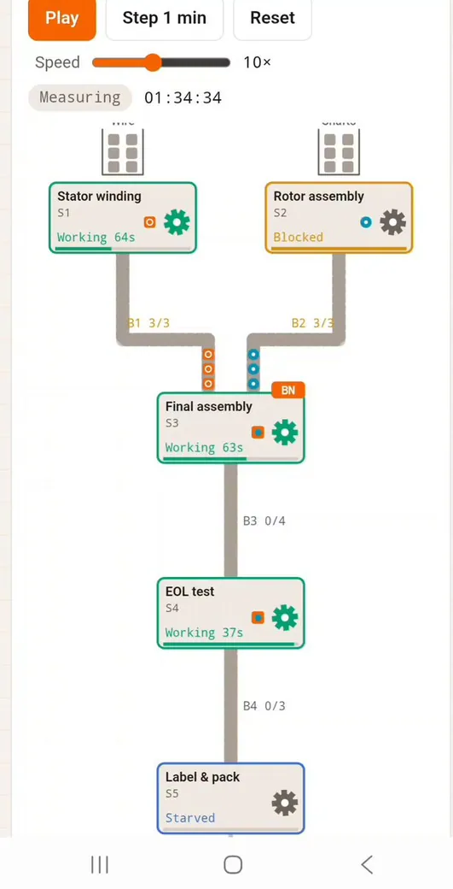</a>

**Промпт**

```text
Создайте анимированную интерактивную дискретно-событийную модель последовательной производственной линии в виде одного автономного HTML-файла (ванильный JS + Canvas; без внешних библиотек, кроме Chart.js с cdnjs). Назначение: обучать студентов по дисциплине [Производственные системы] тому, как вариативность, буферы и отказы влияют на производительность линии.

КОНФИГУРАЦИЯ ЛИНИИ (настраивается пользователем)
- Количество рабочих станций: [2–6], по умолчанию [3]; для каждой задаётся название (например, Механическая обработка, Сборка, Контроль)
- Для каждой станции: среднее время цикла, распределение (детерминированное, равномерное, нормальное, треугольное, экспоненциальное, логнормальное), CV
- Отказы каждой станции: MTBF и MTTR (экспоненциальное распределение), переключатель вкл./выкл.
- Качество каждой станции: доля дефектов (%), с вариантом отправки в брак или в цикл доработки
- Буферы между станциями: вместимость 0–10 (0 = блокировка после обслуживания)
- Поступление материалов: неограниченный поток сырья или пуассоновский поток с интенсивностью λ
- Клиентский спрос для расчёта такта

ANIMATION
- Детали перемещаются по конвейерам и меняют цвет в зависимости от этапа (сырьё, НЗП, готовая продукция, брак)
- Рамки станков отображают состояние цветом: работа (зелёный), блокировка (янтарный), отсутствие заготовок (красный), простой из-за отказа (серый); также показываются вращающийся значок шестерёнки и индикатор выполнения
- Ячейки буферов показывают заполненность и выделяются при полном заполнении
- Управление: воспроизведение/пауза, шаг, сброс, скорость 1x–50x, период разогрева

КЛЮЧЕВЫЕ ПОКАЗАТЕЛИ ЭФФЕКТИВНОСТИ (панель мониторинга в реальном времени)
1. Пропускная способность (деталей/ч) в сравнении с теоретической производительностью узкого места
2. Средний объём НЗП и изменение объёма НЗП во времени
3. Время прохождения / производственный цикл (среднее значение и 95-й перцентиль)
4. Проверка закона Литтла: НЗП ≈ Пропускная способность × Время прохождения
5. Загрузка каждой станции с разбивкой времени: работа / блокировка / отсутствие заготовок / простой из-за отказа (накопительная столбчатая диаграмма)
6. OEE каждой станции = Доступность × Производительность × Качество
7. Определение узкого места (метод активного периода) и его выделение
8. Такт в сравнении со временем цикла станций (диаграмма баланса линии)
9. Эффективность баланса линии = Σ времён цикла / (N × максимальное время цикла)
10. Выход годных с первого прохода, сквозной выход годных, количество бракованных деталей
11. Средняя заполненность каждого буфера
12. Наблюдаемые и заданные среднее время цикла и CV для каждой станции

ИНСТРУМЕНТЫ АНАЛИЗА
- Режим репликаций: выполнить N репликаций длительностью T после периода разогрева и вывести среднее значение ± 95%-ный доверительный интервал для пропускной способности, НЗП и времени прохождения
- Режим эксперимента: перебрать значения вместимости буфера (или CV одной станции) и построить график зависимости пропускной способности от параметра
- Экспорт результатов в CSV
- Предустановленные сценарии: Сбалансированная линия, Явное узкое место, Высокая вариативность, Ненадёжный станок

DESIGN
- Чистый адаптивный интерфейс для мобильных устройств; светлая и тёмная темы
- Краткая всплывающая подсказка с пояснением каждого KPI и его формулы
- Переключатель двуязычных подписей (английский/арабский)
```

<details>
<summary>Исходный промпт автора</summary>

```text
Build an animated, interactive discrete-event simulation of a serial production line as a single self-contained HTML file (vanilla JS + Canvas, no external libraries except Chart.js from cdnjs). Purpose: teaching [Manufacturing Systems] students how variability, buffers, and breakdowns affect line performance.

LINE CONFIGURATION (user-adjustable)
- Number of stations: [2–6], default [3], each with a name (e.g., Machining, Assembly, Inspection)
- Per station: mean cycle time, distribution (Deterministic, Uniform, Normal, Triangular, Exponential, Lognormal), CV
- Breakdowns per station: MTBF and MTTR (exponential), on/off toggle
- Quality per station: defect rate (%), with scrap or rework-loop option
- Buffers between stations: capacity 0–10 (0 = blocking after service)
- Arrivals: unlimited raw material OR Poisson arrivals with rate λ
- Customer demand to compute takt time

ANIMATION
- Parts move along conveyors and change color by stage (raw, WIP, finished, scrap)
- Machine borders show state colors: Working (green), Blocked (amber), Starved (red), Down (gray), plus a rotating gear icon and a progress bar
- Buffer slots show occupancy and highlight when full
- Controls: Play/Pause, Step, Reset, speed 1x–50x, warm-up period

KEY PERFORMANCE MEASURES (live dashboard)
1. Throughput (parts/hr) vs theoretical bottleneck rate
2. Average WIP and WIP over time
3. Flow time / manufacturing lead time (mean and 95th percentile)
4. Little's Law check: WIP ≈ Throughput × Flow time
5. Per-station utilization with a time breakdown: working / blocked / starved / down (stacked bar)
6. OEE per station = Availability × Performance × Quality
7. Bottleneck detection (active-period method) and highlight the bottleneck
8. Takt time vs station cycle times (line balance chart)
9. Line balance efficiency = Σ cycle times / (N × max cycle time)
10. First-pass yield, rolled throughput yield, scrap count
11. Average buffer occupancy per buffer
12. Observed vs set cycle-time mean and CV per station

ANALYSIS FEATURES
- Replication mode: run N replications of length T after warm-up, report mean ± 95% confidence interval for throughput, WIP, and flow time
- Experiment mode: sweep buffer size (or one station's CV) and plot throughput vs parameter
- Export results to CSV
- Preset scenarios: Balanced line, Clear bottleneck, High variability, Unreliable machine

DESIGN
- Clean, responsive layout that works on mobile; light/dark mode
- Brief tooltip explaining each KPI and its formula
- Bilingual labels (English/Arabic) toggle
```

</details>

[Подробнее ↗](https://www.tripo3d.ai/ru/3d-prompts/claude-opus-5-5-2104831049020674144) · [Исходная публикация](https://x.com/am_alahmari/status/2104831051776335994) · [Назад к примерам](#all-prompts)

---

<a id="claude-opus-5-5-2104590334152056983"></a>

### Ходячая архитектура

[KOBATAKA｜Vibe Modeling](https://x.com/shion_takk) · 2026-09-28 · Claude Opus 5.5 · Анимация

<a href="https://www.tripo3d.ai/ru/3d-prompts/claude-opus-5-5-2104590334152056983"></a>

**Промпт**

```text
Создай ходячую архитектуру
```

<details>
<summary>Исходный промпт автора</summary>

```text
歩く建築作って
```

</details>

[Подробнее ↗](https://www.tripo3d.ai/ru/3d-prompts/claude-opus-5-5-2104590334152056983) · [Исходная публикация](https://x.com/shion_takk/status/2104590334152056983) · [Назад к примерам](#all-prompts)

---

<a id="claude-opus-5-5-2104571944842498150"></a>

### Играбельный пиксельный beat ’em up в Древнем Риме

[Koldo Huici](https://x.com/koldo2k) · 2026-09-28 · Claude Opus 5.5 · Игры

<a href="https://www.tripo3d.ai/ru/3d-prompts/claude-opus-5-5-2104571944842498150"></a>

**Промпт**

```text
С помощью Magnific MCP создай играбельный пиксельный beat ’em up в сеттинге Древнего Рима — одним HTML-файлом, который работает на мобильных устройствах. Сначала создай ключевой арт и используй его как референс стиля для всех ассетов: уровня, героя, врагов, босса — боевого слона — и предметов. Анимируй персонажей с помощью image-to-video на зелёном фоне, выбери кадры, образующие зацикленные анимации, убери зелёный фон хромакеем и сохрани для всех анимаций одинаковые масштаб и палитру. Добавь сенсорное управление, комбо, щит, уклонение, метательное копьё-пилум, предметы для подбора, демонстрационный режим длительностью 1 минуту и саундтрек в стиле чиптюн. Перед каждой генерацией сообщай стоимость в кредитах.
```

<details>
<summary>Исходный промпт автора</summary>

```text
Using the Magnific MCP, build a playable pixel-art beat 'em up set in ancient Rome, as one HTML file that works on mobile. Generate a key art first and use it as style reference for every asset: stage, hero, enemies, a war-elephant boss, items. Animate the characters with image-to-video on green screen, pick the frames that loop, key out the green and keep every animation on the same scale and palette. Add touch controls, combos, shield, dodge, a throwable pilum, pickups, a 1-minute demo mode and a chiptune soundtrack. Tell me the credit cost before each generation.
```

</details>

[Подробнее ↗](https://www.tripo3d.ai/ru/3d-prompts/claude-opus-5-5-2104571944842498150) · [Исходная публикация](https://x.com/koldo2k/status/2104571946989985812) · [Назад к примерам](#all-prompts)

---

<a id="claude-opus-5-5-2104514806443303238"></a>

### Интерактивный клубничный торт на WebGPU

[Ima Studio](https://x.com/ImaStudio_ai) · 2026-09-28 · Claude Opus 5.5 · Интерактив

<a href="https://www.tripo3d.ai/ru/3d-prompts/claude-opus-5-5-2104514806443303238">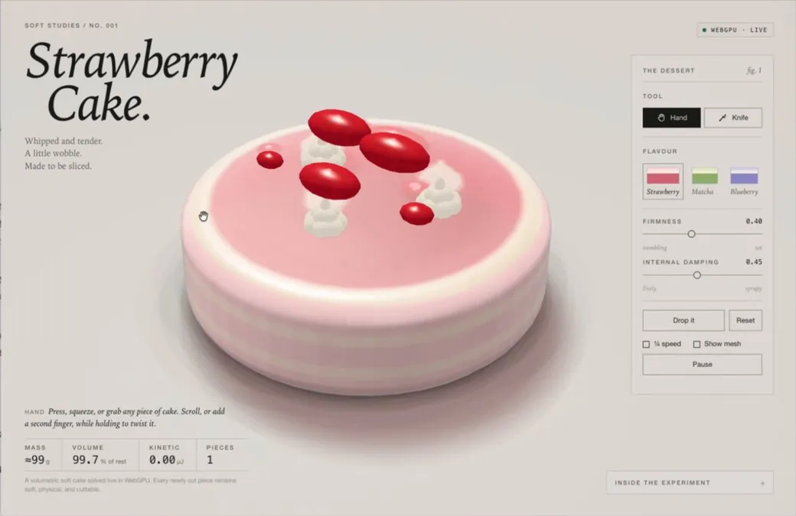</a>

**Промпт**

```text
Сразу создайте полноценный интерактивный сайт на WebGPU под названием «Strawberry Cake». 
Используйте настоящий WebGPU + WGSL, процедурную геометрию, управление мышью и касаниями, а также физику мягкого тела в реальном времени с объёмной симуляцией. Не используйте Three.js/Babylon.js, Canvas2D, внешние ресурсы, видео/GIF или деформацию только средствами CSS.
Визуальный стиль: премиальный корейский/японский клубничный бисквитный торт — низкий, широкий, округлый, мягкий, как подушка; с розовым бисквитом, слоями крема, светлой глазурью, отсаженным кремом и клубникой. Тёплый фон цвета слоновой кости, мягкий студийный свет, аппетитные влажные материалы.
Компоновка: в левом верхнем углу — «SOFT STUDIES / NO.001» и курсивом «Strawberry Cake». В правом верхнем углу — «WEBGPU · LIVE». Большой торт по центру. Панель управления справа: Рука/Нож, пресеты, Жёсткость, Демпфирование, Бросок, Сброс, Пауза, ¼ скорости, Показать сетку. В левом нижнем углу: Масса, Объём, Кинетическая энергия, Куски.
Физика: стабильная XPBD/коротационная модель мягкого тела с тетраэдральной расчётной сеткой, сглаженной сеткой для рендера, сохранением объёма, демпфированием, гравитацией, трением о поверхность и столкновениями между кусками. Торт должен ощущаться мягким и тяжёлым и покачиваться после отпускания.
Рука: удержание = Нажатие, движение внутрь = Сжатие, движение наружу = Захват, быстрое отпускание = Бросок. Используйте взвешенные захваты, сглаженную трёхмерную цель, скорость указателя и импульс. Торт остаётся свободным; ввод для взаимодействия с тортом имеет приоритет над вращением сцены.
Нож: процедурный 3D-нож. Нарисуйте линию разреза и анимируйте последовательность «контакт → сжатие → проникновение → прорезание → подъём». Сначала деформируйте торт, затем разделяйте его; шов должен оставаться тонким.
Повторные разрезы обязательны: используйте динамический список кусков; каждый кусок должен оставаться доступным для разрезания. Преобразуйте штрихи в вертикальные плоскости разреза, разделяйте пересечённые куски, создавайте новые мягкотельные и рендер-сетки, переносите деформацию и скорость, сохраняйте топпинги, удерживайте половинки выровненными и обновляйте показатель «Куски». Поддерживайте 14 и более кусков, а также разрезы сразу нескольких кусков. Не используйте фиксированные состояния целого торта, левой и правой частей.
Кнопка «Бросок» должна отпускать все куски. «Сброс» восстанавливает один целый торт и значение «Куски» = 1. Используйте фиксированный шаг времени и подшаги, DPR≤2, ограничивайте нестабильность и не допускайте NaN/ошибок GPU. Откройте window.__cake.
Запустите проект локально, протестируйте взаимодействия и повторные разрезы, затем дорабатывайте его, пока результат не станет полностью отполированным.
```

<details>
<summary>Исходный промпт автора</summary>

```text
Build immediately a complete interactive WebGPU site called “Strawberry Cake.” 
Use genuine WebGPU + WGSL, procedural geometry, mouse/touch, and real-time volumetric soft-body physics. No Three.js/Babylon.js, Canvas2D, external assets, video/GIF, or CSS-only deformation.
Visual: premium Korean/Japanese strawberry shortcake—low, wide, rounded, pillow-soft, with pink sponge, cream layers, pale frosting, piped cream, and strawberries. Warm ivory background, soft studio light, edible moist materials.
Layout: top-left “SOFT STUDIES / NO.001” + italic “Strawberry Cake.” Top-right “WEBGPU · LIVE”. Large centered cake. Right controls: Hand/Knife, presets, Firmness, Damping, Drop, Reset, Pause, ¼ speed, Show mesh. Bottom-left: Mass, Volume, Kinetic, Pieces.
Physics: stable XPBD/co-rotational soft body with tetrahedral sim mesh, smooth render mesh, volume preservation, damping, gravity, floor friction, and piece collisions. Cake feels soft/heavy and wobbles after release.
Hand: hold=Press, inward drag=Squeeze, outward drag=Grab, fast release=Throw. Use weighted grabs, smoothed 3D target, pointer velocity and momentum. Cake remains free; cake input overrides orbit.
Knife: procedural 3D knife. Draw a cut line; animate contact→compression→penetration→breakthrough→lift. Deform before splitting; keep seam thin.
Repeated cutting is mandatory: use a dynamic pieces list; every piece stays cuttable. Convert strokes to vertical cut planes, split crossed pieces, create new soft-body/render meshes, transfer deformation/velocity, preserve toppings, keep halves aligned, update Pieces. Support 14+ pieces and multi-piece cuts. No fixed whole/left/right states.
Drop releases all pieces. Reset restores one intact cake and Pieces=1. Use fixed timestep/substeps, DPR≤2, clamp instability, avoid NaNs/GPU errors. Expose window.__cake.
Run locally, test interactions and repeated cutting, and iterate until polished.
```

</details>

[Подробнее ↗](https://www.tripo3d.ai/ru/3d-prompts/claude-opus-5-5-2104514806443303238) · [Исходная публикация](https://x.com/ImaStudio_ai/status/2104517586092458039) · [Назад к примерам](#all-prompts)

---

<a id="claude-opus-5-5-2104232297167716457"></a>

### Полнофункциональный набор LEGO Ford Model T

[Alex Lieberman](https://x.com/businessbarista) · 2026-09-27 · Claude Opus 5.5 · 3D-ассеты

<a href="https://www.tripo3d.ai/ru/3d-prompts/claude-opus-5-5-2104232297167716457"></a>

**Промпт**

```text
Я хочу собрать набор LEGO с оригинальным Ford Model T.

Он должен быть полнофункциональным, по возможности включать подвижные и интерактивные элементы и обладать качеством, которым гордился бы мастер LEGO.

В итоговый результат должны входить рендер набора LEGO, все детали, которые нужно заказать у LEGO, и инструкция по его сборке.
```

<details>
<summary>Исходный промпт автора</summary>

```text
I want to build a lego set of the original ford motel T.

I want it to be feature complete, include motion/interactivity where possible, and be of the quality a lego master builder would be proud of.

I want the final output to include a rendering of the lego set, all of the pieces i need to order from lego, and the instruction manual to build it.
```

</details>

[Подробнее ↗](https://www.tripo3d.ai/ru/3d-prompts/claude-opus-5-5-2104232297167716457) · [Исходная публикация](https://x.com/businessbarista/status/2104233375791718456) · [Назад к примерам](#all-prompts)

---

<a id="claude-opus-5-5-2104232013578617241"></a>

### Гиперреалистичный многопользовательский FPS в заснеженном переулке

[Zen](https://x.com/zenvnt) · 2026-09-27 · Claude Opus 5.5 · Игры

<a href="https://www.tripo3d.ai/ru/3d-prompts/claude-opus-5-5-2104232013578617241">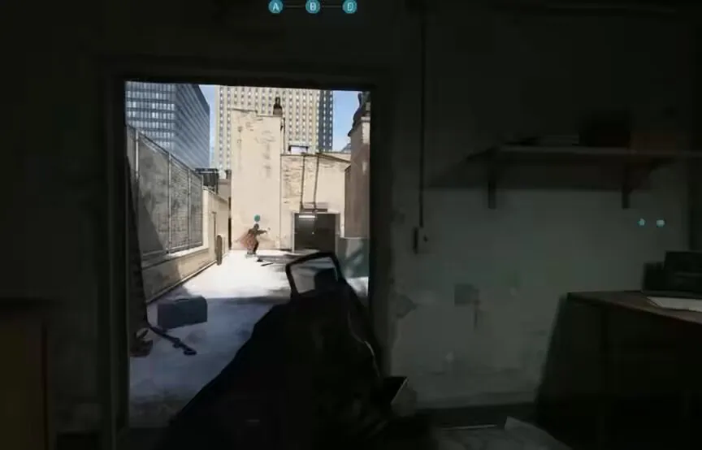</a>

**Промпт**

```text
Создай гиперреалистичный многопользовательский FPS. Действие происходит в заснеженном городском переулке с кирпичными зданиями. Добавь штурмовую винтовку с чёткой отдачей и разлетающимися гильзами. Добавь врагов для стрельбы, механику перелезания через препятствия и кровавые эффекты повреждений на экране. Сделай стрельбу с безупречной регистрацией попаданий и доведи всё до полноценной игры в том же духе.
```

<details>
<summary>Исходный промпт автора</summary>

```text
Build me a hyper-realistic multiplayer FPS. Set it in a snowy city alleyway with brick buildings. Give me an assault rifle with crispy recoil and flying bullet casings. Add enemies to shoot, vaulting mechanics, and bloody screen damage effects. Make the gunplay hit-reg immaculate and just vibe it out into a full game.
```

</details>

[Подробнее ↗](https://www.tripo3d.ai/ru/3d-prompts/claude-opus-5-5-2104232013578617241) · [Исходная публикация](https://x.com/zenvnt/status/2104232358811676833) · [Назад к примерам](#all-prompts)

---

<a id="claude-opus-5-5-2104223449849761837"></a>

### 55-секундная 3D-сцена: от дата-центра до атома

[Crane](https://x.com/Cranefomo) · 2026-09-27 · Claude Opus 5.5 · Сцены

<a href="https://www.tripo3d.ai/ru/3d-prompts/claude-opus-5-5-2104223449849761837">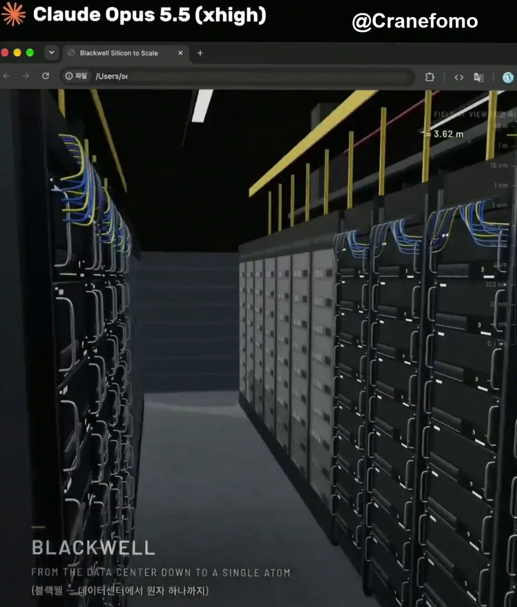</a>

**Промпт**

```text
Создай 3D-сцену длительностью 55 секунд. Камера влетает в дата-центр, открывает серверную стойку, разбирает GPU, приближает изображение к чипу, проходит сквозь транзисторы и останавливается у отдельного атома кремния. Справа размести шкалу масштаба в метрах. Подписи должны быть на языке клиента. Сцена должна запускаться в браузере, содержаться в одном файле и не иметь зависимостей.
```

<details>
<summary>Исходный промпт автора</summary>

```text
Give me a 55 second 3D scene. Camera flies into a data center, opens a rack, disassembles a GPU, zooms into the chip, passes through the transistors, lands on a single silicon atom. Scale rail on the right in meters. Labels in the client's language. Runs in a browser, one file, no dependencies.
```

</details>

[Подробнее ↗](https://www.tripo3d.ai/ru/3d-prompts/claude-opus-5-5-2104223449849761837) · [Исходная публикация](https://x.com/Cranefomo/status/2104223449849761837) · [Назад к примерам](#all-prompts)

---

<a id="claude-opus-5-5-2104204312624918810"></a>

### Динамичный 30-секундный проморолик Kiiwi в формате моушн-графики

[Iniyan (ini)](https://x.com/iniyanai) · 2026-09-27 · Claude Opus 5.5 · Анимация

<a href="https://www.tripo3d.ai/ru/3d-prompts/claude-opus-5-5-2104204312624918810"></a>

**Промпт**

```text
создай динамичное 30-секундное видео в формате моушн-графики, демонстрирующее, каким невероятным моушн-дизайнером ты являешься, для https://t.co/fCRvqmOamH.
```

<details>
<summary>Исходный промпт автора</summary>

```text
make a dynamic 30-second motion graphics video that shows what an incredible motion designer you are for https://t.co/fCRvqmOamH.
```

</details>

[Подробнее ↗](https://www.tripo3d.ai/ru/3d-prompts/claude-opus-5-5-2104204312624918810) · [Исходная публикация](https://x.com/iniyanai/status/2104204318085931054) · [Назад к примерам](#all-prompts)

---

<a id="claude-opus-5-5-2104193522715029657"></a>

### Аниме-стилизованная 3D-сцена с тремя транспортными средствами, которые трансформируются и объединяются

[風の民@](https://x.com/allforbigfire) · 2026-09-27 · Claude Opus 5.5 · Анимация

<a href="https://www.tripo3d.ai/ru/3d-prompts/claude-opus-5-5-2104193522715029657">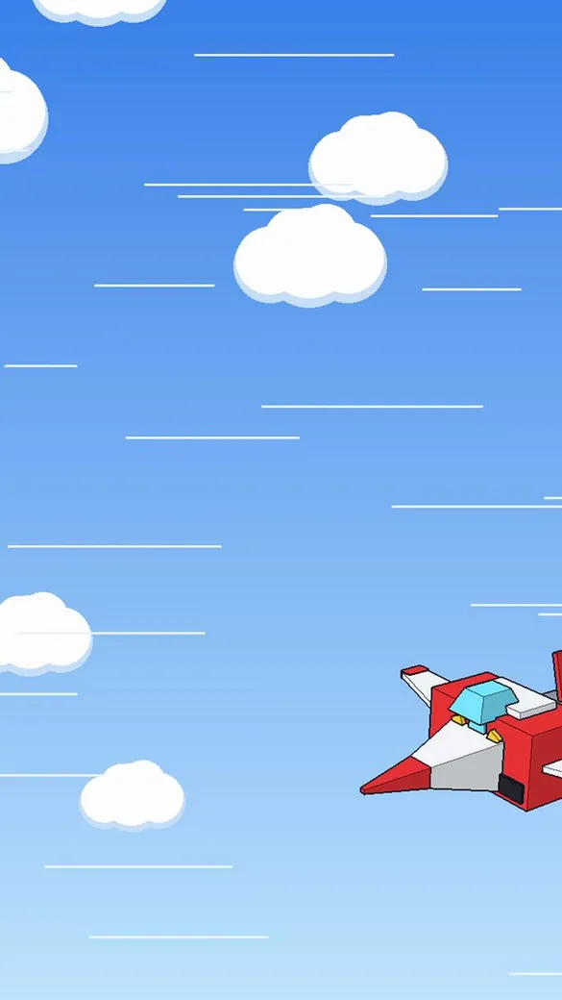</a>

**Промпт**

```text
А можно ли создать в формате аниме-стилизованной 3D-графики сцену, где три транспортных средства, как в аниме про роботов, трансформируются, объединяются и превращаются в робота?
```

<details>
<summary>Исходный промпт автора</summary>

```text
もしかしてロボットアニメみたいな3機の乗り物が変形合体してロボットになるシーンもアニメ風3D CGで作れますか。
```

</details>

[Подробнее ↗](https://www.tripo3d.ai/ru/3d-prompts/claude-opus-5-5-2104193522715029657) · [Исходная публикация](https://x.com/allforbigfire/status/2104193522715029657) · [Назад к примерам](#all-prompts)

---

<a id="claude-opus-5-5-2104162483888062945"></a>

### Моушен UI с ИИ-орбом для Claude Code — Opus 5.5

[leolee](https://x.com/listudio) · 2026-09-27 · Claude Opus 5.5 · Анимация

<a href="https://www.tripo3d.ai/ru/3d-prompts/claude-opus-5-5-2104162483888062945">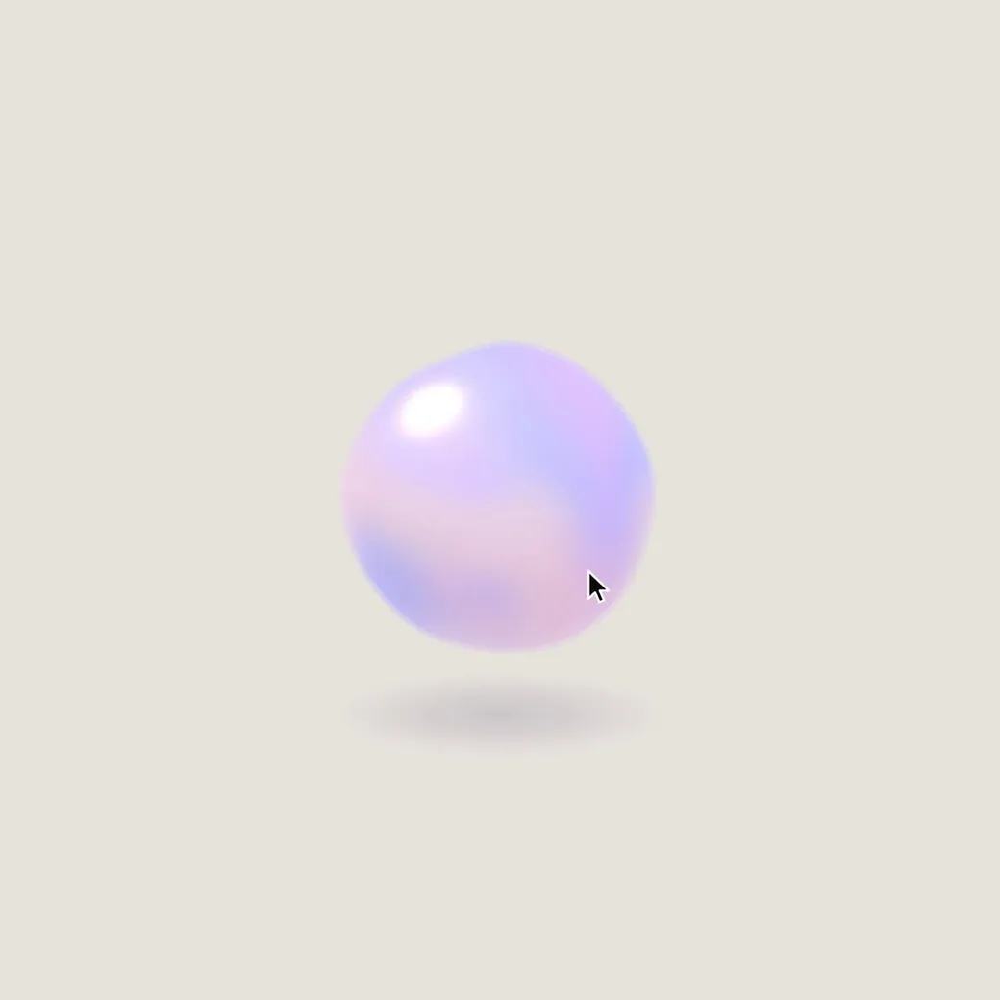</a>

**Промпт**

```text
Запроси у меня: задачу, которую ИИ-агент выполняет для пользователя (по умолчанию — спланировать и забронировать 3-дневную поездку в Киото), палитру (по умолчанию: холст тёплого серого цвета #E6E3DE, UI полностью в чёрном и белом, единственный цветной объект — орб: перламутровый перелив от синего к фиолетовому и персиковому) и трек без роялти примерно на 120 BPM (самостоятельно найди его на Mixkit, измерь BPM с помощью numpy и покажи мне 3 варианта со ссылками на превью до скачивания полного трека). Используй AskUserQuestion, не более 4 вопросов за один раунд, рекомендуемый вариант — первым. Концептуальный моушен интерфейса уровня Dribbble для инструмента с ИИ-чатом. Одна белая форма, которую нельзя разрезать: в каждом состоянии это один и тот же элемент, меняющий размер, радиус и цвет, а его содержимое заменяется с коротким размытием. Главный элемент — GLSL-«ИИ-орб» (текучая, дышащая, переливающаяся органическая форма — как голосовой орб ChatGPT / Siri), который находится СНАРУЖИ формы и служит элементом непрерывности, меняя свою роль по ходу ролика: герой в состоянии ожидания → реагирует на голос во время прослушивания → сжимается в строку ввода и становится аватаром → быстрее закручивается во время обдумывания → аватар рядом с ответом → расцветает после выполнения задачи → возвращается в состояние ожидания. Курсор управляет каждым изменением с помощью настоящих кликов и перетаскиваний. Один чистый UI-шрифт (Geist). Пружинная анимация повсюду, максимальный небольшой перелёт. Камера приближает каждый стейт так, чтобы он занимал примерно 60–75% кадра. Орб слегка пульсирует на каждом бите. Последний кадр совпадает с первым, поэтому ролик зацикливается. Запрещено: упругая анимация с отскоком, всплески частиц, свечение или градиенты на элементах UI-хрома (орб — содержимое, а не хром), несовпадающая толщина штрихов иконок, пустые паузы и всё, что выглядит как шаблон. 120 BPM, 8 тактов = 32 бита = 16 с, что-то происходит на каждом бите (бит n в момент (n-1)*0.5 с): Такт 1: орб в состоянии ожидания, курсор приближается | клик по орбу → форма растягивается в пилюлю «LISTENING», орб перемещается влево и покачивается по слоговой огибающей | в расшифровке в реальном времени печатается «Plan 3 days in Kyoto» | «…under 1,500, значение прокручивается в реальном времени | перетащи за 1,248 «cheapest plan» Такт 6: слайдер → чёрный свайп для подтверждения «Book trip · $1,248» | возьми ползунок и перетащи вправо | после конца → резиновая деформация | отпусти → ползунок пружинит к конечной позиции, стрелка превращается в спиннер Такт 7: → тост «Trip booked» | чипы «Flights ✓» и «Ryokan ✓» появляются | орб расцветает (цвет + масштаб) | тост схлопывается в сторону орба Такт 8: форма исчезает, орб снова увеличивается до размера героя | стабилизируется | дышит в такт, курсор уходит за пределы кадра | возвращение в состояние ожидания (цикл) 1. Один автономный HTML-файл, квадрат 1440×1440, шрифты и аудиосвободные ресурсы встроены как data URI. Все стили вычисляются из времени внутри чистого `seek(t)`: никаких CSS-переходов, таймеров и состояния, сохраняемого между кадрами; никогда не создавай треки внутри seek. 2. Пружины — замкнутые решения переходных характеристик. Значение, для которого цель меняется много раз, представляет собой сумму одной пружины на каждое изменение; для зацикливания возьми ПОСЛЕДНЮЮ цель как начальное значение и также добавь хвосты пружин двух предыдущих циклов (t + L, t + 2L), чтобы на стыке совпадали И позиция, И скорость. Коэффициент демпфирования ≥ 0.72. 3. У слоёв контента должны быть собственные окна появления и исчезновения: исчезновение завершается точно на бите, появление начинается примерно через 80 мс (прозрачность + размытие экрана примерно на 12 px + масштабирование 0.965→1), либо текст перекрывается. 4. Перетаскивания должны быть прямой манипуляцией: пока кнопка удерживается, значение = start + (cursorX − cursorX at press); при выходе за ограничение применяй rubber(over, R) = R·(1 − e^(−over/R)); при отпускании свободная пружина запускается из позиции И скорости в момент отпускания к целевой позиции привязки. Маршрут курсора задаётся точками [время отправления, x, y] на пружине; последняя точка должна совпадать с первой, чтобы позиция и скорость курсора непрерывно переходили через границу цикла. 5. Орб: фрагментный шейдер WebGL рисуется на OFFSCREEN-холсте 640×640, затем синхронно копируется через drawImage на видимый 2D-холст внутри seek (в headless-режиме надёжно делать скриншот WebGL-холста напрямую нельзя). Время должно быть периодическим: uniforms (cos, sin)(2π·k·t/L) с целым k (например, k=2 и k=5), никогда не используй необработанное t. Радиус силуэта = 0.74 + amp·noise(direction·1.4 + T), значение noise выбирается по единичному вектору направления (без шва в центре); поверхность = низкочастотный 3D-шум с искажением домена на нормали сферы → крупные плавные цветовые полосы; 16% перламутрового белого, яркое внутреннее ядро, небольшой резкий блик (pow 70), светло-лиловый ободок fresnel; более тёмная нижняя половина для создания объёма; мягкая эллиптическая тень под орбом в состоянии ожидания. Uniforms: amp (в состоянии ожидания 0.08, + слоговая огибающая во время прослушивания, + немного во время обдумывания), think (более сильное и быстрое искажение), bloom (всплеск цвета при завершении). Не более 5 вызовов noise на пиксель. 6. Аудио: проанализируй трек с помощью numpy (начало по spectral flux, BPM с фазовой привязкой, сильная доля по кику + изменению chroma, RMS для каждого такта). Начинай на сильной доле фразы из 8 тактов с полной энергией, чтобы аудиопетля проходила границу фразы. Большие окна анализа оценивают биты примерно на 15–25 мс раньше: повторно измерь место среза с окном в 256 сэмплов и смещай начало, пока медианный остаток не станет < 2 мс. Сделай кроссфейд последних 60 мс с 60 мс перед началом. Синтезируй звуки интерфейса с помощью numpy (клик, swoosh отправки, захват/отпускание, тик, успех, колокольчик) и размещай каждый по его ИЗМЕРЕННОМУ ПИКУ в момент события; в многотональных звуках первая нота должна быть самой громкой. 7. Рендерь в Playwright Chromium: 4 субкадра на кадр, распределённых по половине кадра (затвор 180°, центрирование относительно времени кадра), 16 параллельных воркеров. После каждого seek дождись двух requestAnimationFrames перед скриншотом; НЕ используй screenshot(animations='disabled'). Поскольку в сцене используется WebGL, запускай с --use-gl=angle --use-angle=swiftshader --enable-unsafe-swiftshader --disable-gpu-watchdog (стандартный путь SwiftShader-Vulkan чаще всего теряет контекст WebGL). Любой скриншот RGBA преобразуй в RGB. 8. Кодируй через ffmpeg: -reinit_filter 0, tmix=frames=4, затем выбирай каждый 4-й кадр, 60 fps, libx264 -crf 10 -x264-params aq-mode=3, AAC 256k, -t с точной длительностью. Перед выбором смещения select проверь, какие именно субкадры усредняет tmix в используемой версии ffmpeg. Также сделай версию для публикации с crf 20 и копию, зацикленную 3 раза. 9. Перед полным рендером отрендерь по одному кадру на каждый бит и ещё один через 0,3 с после него, собери их в контактные листы и исправь всё, что не попадает в сетку, выглядит тесным, обрезано, нечитаемо или не содержит орба. Затем выборочно проверь кадры переходов в полном разрешении. 10. Проверь и сообщи: скриншоты при t=0 и t=L идентичны до пикселя; число кадров = 960, а длительность видео и аудио — ровно 16,000 с; разница кадров на стыке имеет тот же порядок, что и у соседних кадров; субкадров RGBA нет; смещение бита финального аудио < 10 мс; проверь кадры состояния ожидания, чтобы убедиться, что орб присутствует на каждом. - smoothstep(e0, e1, x) с e0 > e1 не определён в GLSL — SwiftShader возвращает 0, и орб исчезает. Всегда пиши 1.0 - smoothstep(lo, hi, x). - Тяжёлый шейдер на программном GL запускает сторожевой таймер GPU (CONTEXT_LOST_WEBGL): оставь холст размером 640² и небольшое число вызовов noise; в каждом тесте отслеживай сообщения о потере контекста в консоли. - Никогда не добавляй will-change к объектам, масштабируемым камерой, иначе текст будет размытым. - Элементы, следующие за другими (орб, аватары), используют немного более медленную пружину, чем форма, чтобы их края никогда не обрезались. - Порядок слоёв: всё, у чего есть фоновая плашка, должно идти ПЕРЕД текстом и иконками, расположенными на ней. - Не переопределяй центрирующий translate() анимируемым transform — вместо этого оберни элемент в отдельный слой. - ffmpeg -shortest может отбросить последний кадр; явно задай -t. - Последний кадр должен быть идентичен первому, включая положение и скорость курсора, иначе цикл будет дёргаться. Запроси у меня входные данные, сначала отдельно прототипируй шейдер орба (отрендерь t=0, t=4, t=8 и докажи попиксельное равенство t=0 == t=16, не допустив потери контекста при 8 последовательных загрузках новых страниц), затем покажи мне список состояний на сетке битов 8 тактов в виде таблицы и дождись моего OK перед написанием полной сцены.
```

<details>
<summary>Исходный промпт автора</summary>

```text
Ask me for: the task the AI agent completes for the user (default: plan + book a 3-day Kyoto trip), the palette (default: warm-gray canvas #E6E3DE, pure black/white UI, the orb is the only colored thing — pearl iridescent blue → violet → peach), and a royalty-free song around 120 BPM (search Mixkit yourself, measure BPM with numpy, show me 3 candidates with preview links before downloading the full track). Use AskUserQuestion, max 4 questions per round, recommended option first. Dribbble-level UI concept motion for an AI chat agent tool. One white shape, never cut: every state is the same element morphing its size, radius and color while its content swaps with a short blur. The star is a GLSL "AI orb" (fluid, breathing, iridescent blob — like the ChatGPT / Siri voice orb) that lives OUTSIDE the shape as a continuity element and changes role through the film: idle hero → reacts to voice while listening → shrinks into the input bar as an avatar → swirls faster while thinking → avatar on the answer → blooms when the task completes → back to idle. A cursor drives every change with real clicks and drags. One clean UI font (Geist). Springs everywhere, a tiny overshoot at most. The camera zooms so each state fills ~60–75% of the frame. The orb pulses subtly on every beat. The last frame is the first frame, so it loops. Banned: bouncy easing, particle bursts, glows or gradients on UI chrome (the orb is content, not chrome), mismatched icon strokes, dead time, anything that looks like a template. 120 BPM, 8 bars = 32 beats = 16s, something happens on every beat (beat n at (n-1)*0.5s): Bar 1: orb idle, cursor approaches | click orb → shape stretches into a "LISTENING" pill, orb moves to its left and wobbles with a syllable envelope | live transcript types "Plan 3 days in Kyoto" | "…under 1,500, the value rolls live | drag past the 1,248 "cheapest plan" Bar 6: slider → black swipe-to-confirm "Book trip · $1,248" | grab the knob, drag right | past the end → rubber band | release → snaps to the end, arrow becomes a spinner Bar 7: → toast "Trip booked" | chips "Flights ✓" "Ryokan ✓" pop in | orb blooms (color + scale) | toast collapses toward the orb Bar 8: shape fades, orb grows back to hero size | settles | breathes on the beat, cursor drifts out | back to idle (loop) 1. One self-contained HTML file, square 1440x1440, fonts and audio-free assets inlined as data URIs. Every style is computed from time inside a pure `seek(t)`: no CSS transitions, no timers, no state carried between frames, never create tracks inside seek. 2. Springs are closed-form step responses. A value that changes target many times is the sum of one spring per change; to loop, take the LAST target as the start value and also add the spring tails of the previous two cycles (t + L, t + 2L) so position AND velocity match at the seam. Damping ratio ≥ 0.72. 3. Content layers have their own enter/exit windows: exit lands exactly on the beat, enter starts ~80ms later (opacity + ~12px screen blur + 0.965→1 scale), or text overlaps. 4. Drags are direct manipulation: while held, the value = start + (cursorX − cursorX at press); past a limit apply rubber(over, R) = R·(1 − e^(−over/R)); on release a free spring runs from the release position AND velocity to the snap target. Cursor waypoints are [departure time, x, y] on a spring; the final waypoint equals the first so the cursor's position and speed are continuous across the loop. 5. The orb: WebGL fragment shader drawn on an OFFSCREEN 640×640 canvas, then synchronously drawImage'd into a visible 2D canvas inside seek (screenshotting the WebGL canvas directly is unreliable headless). Time must be periodic: uniforms (cos, sin)(2π·k·t/L) with integer k (e.g. k=2 and k=5), never raw t. Silhouette radius = 0.74 + amp·noise(direction·1.4 + T) sampled on the unit direction vector (no center seam); surface = low-frequency domain-warped 3D noise on the sphere normal → large smooth color bands; 16% pearl white, a bright inner core, a small sharp specular (pow 70), a pale lilac fresnel rim; darker lower half for volume; soft elliptical shadow under the idle orb. Uniforms: amp (idle 0.08, + syllable envelope while listening, + a bit while thinking), think (stronger/faster warp), bloom (completion color burst). Keep ≤5 noise calls per pixel. 6. Audio: analyze the song with numpy (spectral-flux onset, phase-locked BPM, downbeat by kick + chroma change, per-bar RMS). Start on the downbeat of a full-energy 8-bar phrase so the audio loop lands on a phrase boundary. Large analysis windows estimate beats ~15–25ms early: re-measure the cut with a 256-sample window and shift the start until the median residual is < 2ms. Crossfade the last 60ms with the 60ms before the start. Synthesize UI sounds with numpy (click, send swoosh, grab/drop, tick, success, chime) and place each by its MEASURED PEAK on the event time; multi-note sounds keep the first note loudest. 7. Render with Playwright Chromium: 4 subframes per frame spread over half a frame (180° shutter, centered on the frame time), 16 parallel workers. After each seek, await two requestAnimationFrames before the screenshot; do NOT use screenshot(animations='disabled'). Because the scene uses WebGL, launch with --use-gl=angle --use-angle=swiftshader --enable-unsafe-swiftshader --disable-gpu-watchdog (the default SwiftShader-Vulkan path loses the WebGL context most of the time). Convert any RGBA screenshot to RGB. 8. Encode with ffmpeg: -reinit_filter 0, tmix=frames=4 then select every 4th frame, 60fps, libx264 -crf 10 -x264-params aq-mode=3, AAC 256k, -t exactly the duration. Verify which subframes tmix actually averages on your ffmpeg version before choosing the select offset. Also make a crf 20 share version and a 3× looped copy. 9. Before the full render: render one frame on each beat and one 0.3s after it, tile them into contact sheets, and fix anything off the grid, cramped, clipped, unreadable, or with the orb missing. Then spot-check transition frames at full resolution. 10. Verify and report: t=0 and t=L screenshots are pixel-identical; frame count = 960 and video/audio are exactly 16.000s; seam frame-diff is the same order as its neighbors; no RGBA subframes; beat offset of the final audio < 10ms; sample the idle frames to confirm the orb is present in every one. - smoothstep(e0, e1, x) with e0 > e1 is undefined in GLSL — SwiftShader returns 0 and the orb vanishes. Always write 1.0 - smoothstep(lo, hi, x). - A heavy shader on software GL triggers the GPU watchdog (CONTEXT_LOST_WEBGL): keep the canvas at 640² and the noise count low; listen for console context-loss messages in every test. - Never put will-change on anything the camera scales, or text renders blurry. - Followers (the orb, avatars) use a slightly slower spring than the shape so they never get clipped by its edge. - Layer order: anything with a background plate goes BEFORE the text/icons that sit on it. - Don't override a centering translate() with an animated transform — wrap it in a layer instead. - ffmpeg -shortest can drop the last frame; set -t explicitly. - Make the last frame identical to the first, cursor position and speed included, or the loop stutters. Ask me for the inputs, prototype the orb shader alone first (render t=0, t=4, t=8 and prove t=0 == t=16 pixel-for-pixel, with no context loss across 8 fresh page loads), then show me the state list on the 8-bar beat grid as a table and wait for my OK before writing the full scene.
```

</details>

[Подробнее ↗](https://www.tripo3d.ai/ru/3d-prompts/claude-opus-5-5-2104162483888062945) · [Исходная публикация](https://x.com/listudio/status/2104162483888062945) · [Назад к примерам](#all-prompts)

---

<a id="claude-opus-5-5-2103846630088716687"></a>

### Профессиональный 15-секундный ролик с моушн-дизайном и графикой

[Tasher](https://x.com/Dannnnnok) · 2026-09-26 · Claude Opus 5.5 · Анимация

<a href="https://www.tripo3d.ai/ru/3d-prompts/claude-opus-5-5-2103846630088716687"></a>

**Промпт**

```text
Мне интересно увидеть, насколько вы сильны в моушн-дизайне. Чтобы это доказать, создайте профессионально выполненный 15-секундный анимированный графический ролик, демонстрирующий ваши навыки моушн-дизайна. Этот ролик увидят 10 000 человек в X, поэтому сделайте его визуально выразительным, профессиональным и запоминающимся. Полностью полагайтесь на свою творческую свободу и добейтесь наилучшего результата.
```

<details>
<summary>Исходный промпт автора</summary>

```text
I’m curious to see how strong you are as a motion designer. To prove it, create a polished 15-second animated graphic video that showcases your motion design skills. This piece will be presented to 10,000 people on X, so make it visually compelling, professional, and memorable. Take full creative freedom and make the strongest result you can
```

</details>

[Подробнее ↗](https://www.tripo3d.ai/ru/3d-prompts/claude-opus-5-5-2103846630088716687) · [Исходная публикация](https://x.com/Dannnnnok/status/2103847239885939019) · [Назад к примерам](#all-prompts)

---

<a id="claude-opus-5-5-2103822946800165270"></a>

### Воксельная игра в стиле Minecraft с продвинутыми шейдерами

[DreykØ](https://x.com/dreyk0o0) · 2026-09-26 · Claude Opus 5.5 · Игры

<a href="https://www.tripo3d.ai/ru/3d-prompts/claude-opus-5-5-2103822946800165270"></a>

**Промпт**

```text
Создай воксельную игру в стиле Minecraft в одном HTML-файле, которая запускается в браузере.
- Управление от первого лица: WASD, обзор мышью, прыжок
- Процедурно генерируемый ландшафт с холмами, водой и деревьями
- Установка и разрушение блоков мышью, 5 типов блоков
- Продвинутые шейдеры: движущееся солнце, мягкие тени, затенение от окружающей среды, туман, отражения в воде
- Стабильные 60 кадров/с на ноутбуке
Подключи Three.js через CDN. Протестируй игру, исправь все ошибки, затем продолжай улучшать графику, пока она не станет максимально реалистичной.
```

<details>
<summary>Исходный промпт автора</summary>

```text
Build a Minecraft-style voxel game in a single HTML file that runs in the browser.
- First-person controls: WASD, mouse look, jump
- Procedural terrain with hills, water and trees
- Place and break blocks with the mouse, 5 block types
- Advanced shaders: moving sun, soft shadows, ambient occlusion, fog, water reflections
- Smooth 60 fps on a laptop
Use Three.js from a CDN. Test it, fix every bug, then keep improving the visuals until it looks as realistic as possible.
```

</details>

[Подробнее ↗](https://www.tripo3d.ai/ru/3d-prompts/claude-opus-5-5-2103822946800165270) · [Исходная публикация](https://x.com/dreyk0o0/status/2103822946800165270) · [Назад к примерам](#all-prompts)

---

<a id="claude-opus-5-5-2103801834930606193"></a>

### Моушн-дизайн-видео в стиле Spotify

[Brain](https://x.com/brainextends) · 2026-09-26 · Claude Opus 5.5 · Анимация

<a href="https://www.tripo3d.ai/ru/3d-prompts/claude-opus-5-5-2103801834930606193">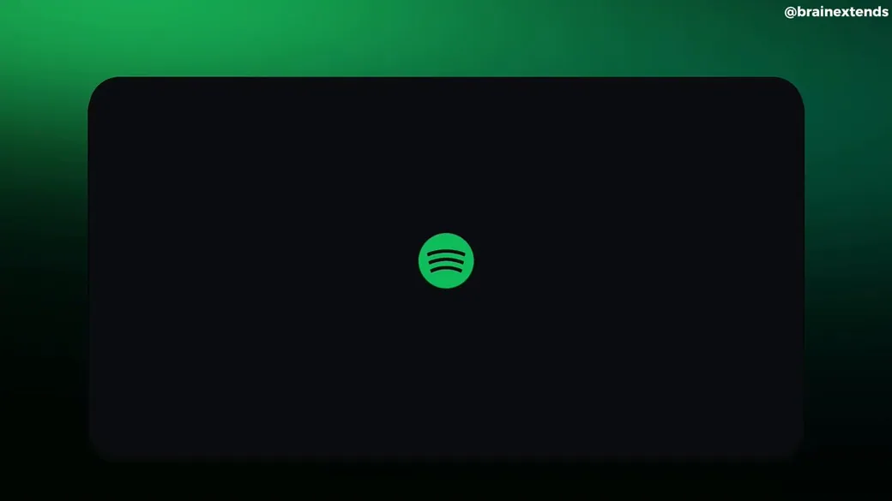</a>

**Промпт**

```text
Создайте полностью готовое, отполированное моушн-дизайн-видео в стиле Spotify по следующему брифу. Этот промпт самодостаточен: референсное видео и предоставленные ассеты не требуются.

<deliverables> MP4 длительностью 18 секунд, разрешением 1920×1080 и настоящей частотой 60 fps, с музыкой и тонкими звуковыми эффектами Редактируемый исходник целиком Соберите, отрендерьте, проверьте и доработайте анимацию перед выдачей результата Не останавливайтесь на раскадровке, статичных изображениях или плане реализации </deliverables>
<art_direction>
Премиальный рекламный ролик музыкального продукта, представленный внутри большой почти чёрной сцены со скруглёнными углами
Сцена занимает примерно 80% ширины и 75% высоты холста, расположена по центру горизонтали и немного ниже вертикального центра
За пределами сцены используйте мягкий атмосферный зелёный фон: светящийся изумрудный оттенок в левом верхнем углу, более глубокий лесной зелёный по бокам, переходящий в почти чёрный у нижнего края
Внутри сцены:
Почти чёрный фон
Основная типографика белого цвета
Вторичный текст приглушённого серого цвета
Spotify-зелёный # 1ED760 для акцентов и элементов управления
Один чистый гротескный шрифт, например Geist или Inter
Единая толщина линий иконок и сдержанные тени
Композиции должны быть компактными и центрированными, с большим количеством негативного пространства
Текст должен восприниматься как реклама музыкального продукта, а не как крупные заголовки презентации
Не добавляйте внешнюю подпись, водяной знак автора, декоративный футер или счётчик прогресса
</art_direction>

<artwork> Создайте оригинальную квадратную обложку альбома для вымышленного трека «Glass Tides» исполнителя «AURA»
Главная обложка — абстрактное макроизображение струящегося перламутрового жидкого шёлка и расплавленного стекла
Используйте пастельные оттенки лавандового, пудрово-цианового, нежно-розового, шампанского золота и лёгкого мятного
Добавьте широкие объёмные складки, реалистичные блики, тонкие прожилки и заметную широкую складку в форме буквы S
Заполните квадрат от края до края
На главной обложке не должно быть текста, логотипа или рамки
Последовательно используйте эту же обложку на протяжении всего фильма

Создайте дополнительные оформленные обложки плейлистов:
«Late Nights» — горчично-жёлтая
«Good Energy» — розовая
«Deep Focus» — синяя
«Daily Mix 1», «Daily Mix 2» и «Daily Mix 3» — в сочетающихся цветах

Они должны выглядеть как завершённые графические обложки с выразительной типографикой и простыми геометрическими мотивами
</artwork>

<timeline> 0,0–0,6 секунды: Зелёная иконка Spotify плавно увеличивается в центре тёмной сцены. Задайте уверенное появление с минимальным перелётом
0,6–1,5 секунды:
Иконка превращается в небольшую фирменную связку Spotify над двумя центрированными строками:
«Discover»
«new music»
Первая строка белая, вторая — зелёная
Покажите их короткими вертикальными движениями в маске
1,5–2,4 секунды:
Стилизованный интерфейс Spotify для компьютера поднимается в поле зрения
Покажите узкую боковую панель, «Made for you», три карточки альбомов и небольшие вспомогательные строки
Во время появления используйте лёгкий перспективный наклон, постепенно переходящий во фронтальный вид
2,4–3,2 секунды:
Приблизьтесь к трём главным обложкам
Разместите над ними заголовок «New for you»
Сохраните чёткость обложек, добавьте под ними короткие названия альбомов
Теперь в нижней части сцены появляется узкая панель плеера со скруглёнными углами
3,2–4,0 секунды:
Главные карточки складываются в компактный список «Fresh finds»
Покажите четыре строки треков с небольшим последовательным смещением по времени
Каждая строка содержит миниатюру, короткое название трека, имя исполнителя и небольшую иконку меню
4,0–4,9 секунды:
Перейдите к горизонтальной ленте красочных обложек плейлистов
Заголовок: «Every mood»
Вспомогательная строка: «Find what moves you»
Лента плавно скользит вбок, а крайние карточки частично обрезаются границами сцены
4,9–5,8 секунды:
Появляется компактное поле поиска
Введите «Glass Tides»
Покажите под ним один выбранный результат с переливающейся обложкой, «AURA» и зелёной иконкой воспроизведения

5,8–6,6 секунды:
Выбранная обложка увеличивается до крупного изображения по центру
Покажите под ней «Glass Tides», а ниже — «AURA» зелёного цвета
Панель плеера должна оставаться видимой
6,6–7,5 секунды:
Та же обложка сдвигается влево
Справа появляется информация о треке:
«Glass Tides»
«AURA»
«A new frequency»
Добавьте зелёную кнопку Play со скруглёнными углами
Синхронизируйте движение обложки и появление текста
7,5–8,3 секунды:
Короткое преобразование в фирменном цвете заполняет внутреннюю сцену зелёным
Обложка сжимается до небольшой плитки по центру
Разместите под ней небольшую тёмную фирменную связку Spotify
Плеер на короткое время отступает на второй план
8,3–9,8 секунды:
Вернитесь к тёмной сцене
Та же обложка резко увеличивается по направлению к камере, становится огромной и обрезается скруглёнными границами сцены
Верните плеер в нижнюю часть
Используйте контролируемое размытие в движении на самом быстром участке приближения

9,8–11,2 секунды:
Обложка исчезает, уступая место центрированному типографическому сообщению:
«Find your»
«rhythm»
Первая строка белая, вторая — зелёная
Плеер остаётся видимым и неподвижным под текстом
11,2–12,5 секунды:
Покажите «Made for your every day»
Три обложки плейлистов появляются с лёгкой перспективой и небольшими наклонами в разные стороны
Они распределяются в шесть небольших обложек по всей сцене
Вспомогательная строка: «Your sound, always evolving»

12,5–14,0 секунды:
Композиция с плейлистами переходит в четыре парящие обложки альбомов
Добавьте переливающуюся главную обложку
Используйте сдержанное вращение, перспективу, распределение по глубине и перекрытия
Движение должно быть скоординированным, а не случайным
14,0–15,2 секунды:
Обложки сходятся к центру и складываются вокруг зелёной иконки Spotify
Обложка отступает, а иконка становится главным визуальным акцентом
Плавно уберите плеер
Иконка Spotify должна появиться из той же центральной точки, к которой сходятся обложки
15,2–18,0 секунды:
Иконка немного смещается влево и останавливается рядом с крупным белым логотипом Spotify
На протяжении движения между иконкой и буквами должно сохраняться расстояние
Покажите:
«Discover new music»
«every day»
Первая строка белая, вторая — зелёная
Чисто удерживайте готовую композицию до самого конца
</timeline>
<persistent_player>
На большей части средней последовательности сохраняйте одну узкую панель плеера со скруглёнными углами в нижней части внутренней сцены
Добавьте:
Небольшую миниатюру главной обложки
«Glass Tides» и «AURA»
Кнопки воспроизведения и переключения треков
Тонкую шкалу прогресса
Небольшую иконку громкости
Приглушённое тёмное полупрозрачное оформление с тонкой рамкой
Этот повторяющийся плеер связывает сменяющиеся кадры
Он должен оставаться визуально второстепенным по отношению к обложке
</persistent_player>

<motion_quality>
Передайте энергию динамично смонтированного премиального рекламного ролика
Большинство визуальных идей длится примерно одну секунду, но переходы остаются плавными
Используйте непрерывное ускорение и замедление
Отдавайте предпочтение критически затухающим пружинам или тщательно настроенному плавному сглаживанию
Не используйте повторяющиеся отскоки или сильные упругие перелёты
Сохраняйте узнаваемость главной обложки и взаимное расположение объектов при переходах от поиска к деталям альбома, фирменной плитке и приближению
Используйте переходы с совпадением позиции, согласованное масштабирование, появления через маску и перспективу
Исходные заголовки должны исчезать до того, как на то же место попадут новые
Избегайте перекрытия текста, резких сбросов камеры, длинных пустых интервалов и произвольных полноэкранных кроссфейдов
Аккуратно обрезайте каждую слишком крупную обложку и движение камеры по границам сцены со скруглёнными углами
Никаких частиц, колец ударной волны, бликов объектива, тряски камеры или нерелевантных стоковых кадров
</motion_quality>

<audio> Создайте или выберите электронную музыку, пригодную для коммерческого использования, примерно на 120 BPM. Используйте чистый пульс, тёплый бас, сдержанные мелодические элементы и тонкие акценты переходов. Синхронизируйте важные появления, выбор элементов, приближения и появление логотипа с музыкальными событиями. Эффекты должны быть тише музыки. Без закадрового голоса. Не используйте коммерческие треки, защищённые авторским правом, без разрешения </audio>
<implementation_and_validation>
Соберите детерминированную анимацию, управляемую абсолютным временем через асинхронную функцию window.seek(t)
Каждое преобразование, значение прозрачности, маска и состояние интерфейса должны воспроизводиться при переходе к кадрам в любом порядке
При экспорте не полагайтесь на таймеры реального времени, накопленную физику или состояние CSS-переходов

Рендерьте с настоящей частотой 60 fps и пространственным сглаживанием
Используйте 3–5 временных субкадровых сэмплов на выходной кадр для сдержанного размытия в движении
Сохраняйте неподвижный текст и обложку резкими
Проверьте контактные листы и воспроизведение в движении
Проверьте быстрые смены заголовков, передачу обложки, приближение, схождение обложек и интервалы в финальном логотипе
Убедитесь в равномерном распределении временных меток кадров и полной длительности 18 секунд
Исправьте визуальные дефекты перед выдачей финального MP4 и редактируемого исходника
</implementation_and_validation>
```

<details>
<summary>Исходный промпт автора</summary>

```text
Create a complete, polished Spotify-themed motion graphics video from the following brief. This prompt is self-contained: no reference video or supplied assets are required.

<deliverables> An 18-second MP4 at 1920×1080 and true 60 fps, with music and subtle sound effects Complete editable source Build, render, inspect, and refine the animation before delivering it Do not stop at a storyboard, still images, or an implementation plan </deliverables>
<art_direction>
A premium music-product film presented inside a large, nearly black rounded rectangular stage
The stage occupies roughly 80% of the canvas width and 75% of its height, centered horizontally and slightly below the vertical center
Outside the stage, use a soft atmospheric green background: luminous emerald near the upper-left corner, deeper forest green toward the sides, fading to near-black at the bottom
Inside the stage:
Near-black background
White primary typography
Muted gray secondary text
Spotify green # 1ED760 for emphasis and controls
One clean sans-serif font, such as Geist or Inter
Consistent icon strokes and restrained shadows
Keep compositions compact and centered, with substantial negative space
Text should feel like music-product advertising, not oversized presentation headings
Do not add an outer caption, creator watermark, decorative footer, or progress counter
</art_direction>

<artwork> Create original square album artwork for a fictional track called “Glass Tides” by “AURA”
The hero cover is an abstract macro image of flowing pearlescent liquid silk and molten glass
Use pastel lavender, powder cyan, blush pink, champagne gold, and subtle mint
Include broad three-dimensional folds, realistic reflective highlights, delicate striations, and a prominent sweeping S-shaped fold
Fill the square edge to edge
No text, logo, or border on this hero artwork
Use this same artwork consistently throughout the film

Create additional designed playlist sleeves:
“Late Nights” in mustard yellow
“Good Energy” in pink
“Deep Focus” in blue
“Daily Mix 1”, “Daily Mix 2”, and “Daily Mix 3” in complementary colors

These should look like finished graphic-design covers, with bold typography and simple geometric motifs
</artwork>

<timeline> 0.0–0.6 seconds: A green Spotify icon grows smoothly into the center of the dark stage Give it a confident arrival with minimal overshoot
0.6–1.5 seconds:
The icon transitions into a small Spotify identity above two centered lines:
“Discover”
“new music”
The first line is white; the second is green
Reveal them with short masked vertical movements
1.5–2.4 seconds:
A stylized Spotify desktop interface rises into view
Show a slim sidebar, “Made for you”, three album cards, and small supporting rows
Use a subtle perspective tilt during the entrance, settling toward a frontal view
2.4–3.2 seconds:
Move closer to the three featured covers
Show “New for you” above them
Keep the artwork crisp, with short album titles beneath
A narrow rounded player bar now anchors the bottom of the stage
3.2–4.0 seconds:
The featured cards withdraw into a compact “Fresh finds” list
Reveal four song rows with a slight stagger
Each row contains a thumbnail, short track title, artist, and a small menu icon
4.0–4.9 seconds:
Transition into a horizontal strip of colorful playlist covers
Heading: “Every mood”
Supporting line: “Find what moves you”
The strip slides smoothly sideways, with edge cards partially cropped by the stage
4.9–5.8 seconds:
A compact search field appears
Type “Glass Tides”
Reveal one selected result beneath it, with the iridescent artwork, “AURA”, and a green play icon

5.8–6.6 seconds:
The selected artwork expands into a large centered cover
Reveal “Glass Tides” underneath, followed by “AURA” in green
Keep the player bar visible
6.6–7.5 seconds:
The same cover slides left
Track information appears on the right:
“Glass Tides”
“AURA”
“A new frequency”
Add a rounded green Play button
Coordinate the cover movement and text reveals
7.5–8.3 seconds:
A brief brand-color transformation fills the inner stage with green
The artwork contracts into a smaller centered tile
Place a small dark Spotify identity underneath
The player briefly recedes
8.3–9.8 seconds:
Return to the dark stage
The same artwork expands dramatically toward the camera, becoming oversized and cropped by the rounded stage
Restore the player at the bottom
Use controlled motion blur during the fastest part of the zoom

9.8–11.2 seconds:
The artwork clears into a centered typographic statement:
“Find your”
“rhythm”
Use white for the first line and green for the second
The player remains visible and stable beneath it
11.2–12.5 seconds:
Show “Made for your every day”
Three playlist sleeves enter with gentle perspective and small opposing tilts
They spread into six smaller sleeves across the stage
Supporting line: “Your sound, always evolving”

12.5–14.0 seconds:
The playlist layout transitions into four floating album covers
Include the iridescent hero artwork
Use restrained rotation, perspective, depth ordering, and overlap
Keep their movement coordinated rather than randomly floating
14.0–15.2 seconds:
The covers converge toward the center and fold around a green Spotify icon
The artwork withdraws as the icon becomes the focal point
Fade the player away
The Spotify icon must emerge from the same central position as the converging covers
15.2–18.0 seconds:
The icon moves slightly left and settles beside a large white “Spotify” wordmark
Keep the icon and letters separated throughout the movement
Reveal:
“Discover new music”
“every day”
The first line is white; the second is green
Hold the finished composition cleanly through the end
</timeline>
<persistent_player>
For most of the middle sequence, keep one narrow rounded player bar near the bottom of the inner stage
Include:
Small hero-art thumbnail
“Glass Tides” and “AURA”
Play and skip controls
A thin progress track
A small volume icon
Subdued dark translucent styling with a fine border
This recurring player connects the changing shots
It must remain visually secondary to the artwork
</persistent_player>

<motion_quality>
Match the energy of a tightly edited premium product film
Most visual ideas last approximately one second, but transitions remain smooth
Use continuous acceleration and deceleration
Favor critically damped springs or carefully tuned smooth easing
No repeated bouncing or large elastic overshoots
Preserve the hero artwork’s identity and position relationships through search, album detail, brand tile, and zoom
Use match-position transitions, coordinated scaling, masked reveals, and perspective
Outgoing titles must disappear before incoming titles occupy the same space
Avoid overlapping text, sudden camera resets, long blank intervals, and arbitrary full-frame crossfades
Clip every oversized cover and camera move cleanly to the rounded stage
No particles, shockwave rings, lens flares, camera shake, or unrelated stock footage
</motion_quality>

<audio> Create or select commercially usable electronic music around 120 BPM Use a clean pulse, warm bass, restrained melodic elements, and subtle transition accents Align important entrances, selections, zooms, and the logo reveal with musical events Keep effects quieter than the music No voiceover Do not use copyrighted commercial tracks without permission </audio>
<implementation_and_validation>
Build a deterministic animation driven by absolute time through an async window. seek(t) function
Every transform, opacity, mask, and UI state must be reproducible when seeking frames in any order
Do not depend on live timers, accumulated physics, or CSS transition state during export

Render true 60 fps with spatial antialiasing
Use 3–5 temporal subframe samples per output frame for restrained motion blur
Keep stationary text and artwork sharp
Inspect contact sheets and moving playback
Check the fast heading changes, artwork handoffs, zoom, cover convergence, and final wordmark spacing
Verify evenly spaced frame timestamps and the full 18-second duration
Fix visual defects before delivering the final MP4 and editable source
</implementation_and_validation>
```

</details>

[Подробнее ↗](https://www.tripo3d.ai/ru/3d-prompts/claude-opus-5-5-2103801834930606193) · [Исходная публикация](https://x.com/brainextends/status/2103801834930606193) · [Назад к примерам](#all-prompts)

---

<a id="claude-opus-5-5-2103504887439065439"></a>

### Динамичный 15-секундный шоурил по моушн-дизайну

[ajith\_io](https://x.com/ajith_io) · 2026-09-25 · Claude Opus 5.5 · Анимация

<a href="https://www.tripo3d.ai/ru/3d-prompts/claude-opus-5-5-2103504887439065439"></a>

**Промпт**

```text
создай динамичное 15-секундное видео в жанре моушн-графики, которое покажет, каким невероятным моушн-дизайнером ты являешься, — словно это твой шоурил для резюме. Выложись по полной.
```

<details>
<summary>Исходный промпт автора</summary>

```text
make a dynamic 15-second motion graphics video that shows what an incredible motion designer you are, like it's your showreel for a résumé. go all out.
```

</details>

[Подробнее ↗](https://www.tripo3d.ai/ru/3d-prompts/claude-opus-5-5-2103504887439065439) · [Исходная публикация](https://x.com/ajith_io/status/2103449416325890146) · [Назад к примерам](#all-prompts)

---

<a id="claude-opus-5-5-2103502454750920925"></a>

### Воксельная survival-игра-песочница на WebGL2

[kepo](https://x.com/kepochnik) · 2026-09-25 · Claude Opus 5.5 · Игры

<a href="https://www.tripo3d.ai/ru/3d-prompts/claude-opus-5-5-2103502454750920925">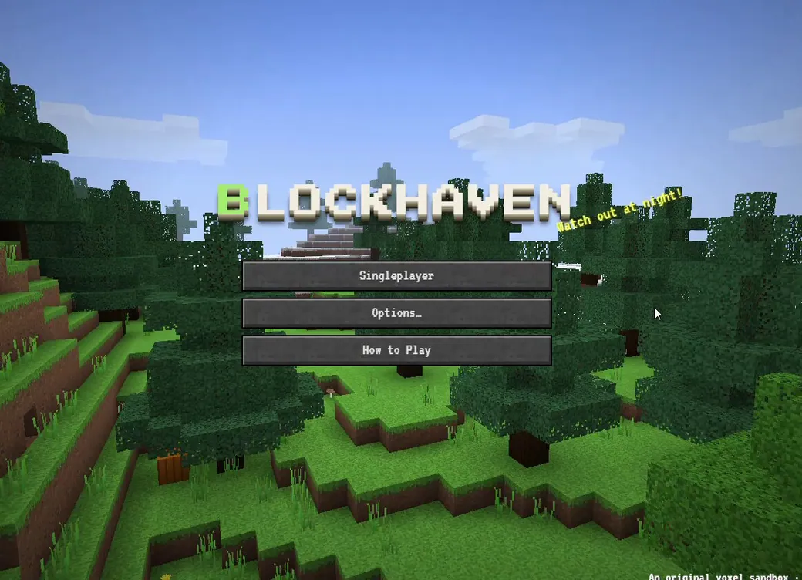</a>

**Промпт**

```text
Создай браузерную игру-песочницу в духе Minecraft, максимально близкую к оригиналу по ощущениям. Весь внутриигровой текст должен быть на английском. Управление: клавиатура и мышь (для компьютера).  ТЕХНИЧЕСКИЕ ТРЕБОВАНИЯ — Один HTML-файл, чистый WebGL2, без сторонних библиотек. — Все текстуры размером 16×16 генерируются в коде в виде пиксельной графики (камень, земля, трава, доски, листья, руды, стекло, вода, лава и т. д.). — Звуки синтезируются с помощью WebAudio: копание, шаги, установка блоков, получение урона, мобы, взрывы, спокойная фоновая музыка.  МИР — Бесконечный мир из чанков размером 16×16×128 с использованием сида. — Биомы: равнины, лес, берёзовый лес, тайга, заснеженная тундра, пустыня, горы, океаны, пляжи. — Пещеры (извилистые туннели и большие подземелья), лава на нижних уровнях, руды распределены по глубине: уголь, железо, золото, алмазы. — Три вида деревьев, высокая трава, цветы, кактусы, сахарный тростник, тыквы. — Освещение в стиле Minecraft: небесный свет и блочный свет (факелы, светокамень, лава), распространяющиеся по ячейкам, с плавным освещением и затенением окружающей среды. — Цикл дня и ночи: солнце, луна, звёзды, закаты, объёмные облака, туман вдали, дождь. — Вода и лава текут по уровням; два источника создают бесконечный поток воды; вода + лава образуют обсидиан или булыжник. Песок и гравий падают.  ИГРОК — Вид от первого лица, столкновения, прыжки, бег, скрытное передвижение (персонаж не сходит с краёв), плавание, лестницы, урон от падения. — Разрушение блоков с визуальными стадиями появления трещин и частицами; время разрушения зависит от инструмента. — Видимая рука и предмет в руке с анимацией взмаха. Вид от третьего лица — по клавише F5.  ВЫЖИВАНИЕ — Здоровье, голод, насыщение, запас воздуха под водой. — Инструменты из 5 материалов с прочностью, броня из 4 материалов. — Инвентарь с сеткой крафтинга 2×2, верстаком 3×3, печью с топливом, сундуками и кроватью (пропуск ночи и установка точки возрождения). — Выпадение предметов, смерть и возрождение. — Мобы: свиньи, коровы, овцы, куры (разведение, стрижка); ночью — зомби, скелеты с луками, пауки. Зомби и скелеты сгорают на солнце. — Фермерство: мотыга, семена, рост пшеницы, хлеб. Двери, заборы, калитки, TNT.  ТВОРЧЕСКИЙ РЕЖИМ — Полёт по двойному нажатию Space, мгновенное разрушение блоков, каталог всех блоков с вкладками и поиском.  ИНТЕРФЕЙС — Титульный экран с панорамой мира, список миров (создать / удалить / играть), настройки (угол обзора, дальность прорисовки, чувствительность, звук, яркость, масштаб интерфейса). — Меню паузы, экран смерти, HUD (панель быстрого доступа, сердца, голод, броня, пузырьки воздуха), отладочный экран F3. — Чат с командами: /gamemode, /time, /give, /tp, /summon, /weather. — Миры сохраняются в localStorage.  ОГРАНИЧЕНИЯ — Не используй название, логотип, текстуры или персонажей Minecraft (Steve, Creeper и т. п.): придумай для игры собственное название и разработай собственных мобов.  ТЕСТИРОВАНИЕ — Запусти игру в безголовом браузере, проверь все системы и исправь ошибки до передачи результата.
```

<details>
<summary>Исходный промпт автора</summary>

```text
Build a browser sandbox game in the spirit of Minecraft that feels as close to the original as possible. All in-game text in English. Controls: keyboard and mouse (desktop).  TECH - A single HTML file, plain WebGL2, no third-party libraries. - All 16×16 textures generated in code as pixel art (stone, dirt, grass, planks, leaves, ores, glass, water, lava, etc.). - Sounds synthesized with WebAudio: digging, footsteps, placing blocks, damage, mobs, explosions, calm background music.  WORLD - Infinite world made of 16×16×128 chunks, with a seed. - Biomes: plains, forest, birch forest, taiga, snowy tundra, desert, mountains, oceans, beaches. - Caves (winding tunnels and large caverns), lava at the lower levels, ores by depth: coal, iron, gold, diamonds. - Three tree types, tall grass, flowers, cacti, sugar cane, pumpkins. - Minecraft-style lighting: sky light and block light (torches, glowstone, lava) that spreads cell by cell, with smooth lighting and ambient occlusion. - Day/night cycle: sun, moon, stars, sunsets, 3D clouds, distance fog, rain. - Water and lava flow by levels; two sources make infinite water; water + lava make obsidian or cobblestone. Sand and gravel fall.  PLAYER - First person, collisions, jumping, sprinting, sneaking (doesn't fall off edges), swimming, ladders, fall damage. - Block breaking with crack stages and particles; break time depends on the tool. - Visible hand and held item with a swing animation. Third-person view on F5.  SURVIVAL - Health, hunger, saturation, air underwater. - Tools in 5 materials with durability, armor in 4 materials. - Inventory with 2×2 crafting, 3×3 crafting table, furnace with fuel, chests, bed (skip the night and set spawn). - Item drops, death and respawn. - Mobs: pigs, cows, sheep, chickens (breeding, shearing); at night zombies, skeletons with bows, spiders. Zombies and skeletons burn in sunlight. - Farming: hoe, seeds, wheat growth, bread. Doors, fences, fence gates, TNT.  CREATIVE - Flying on double-tap Space, instant block breaking, a catalog of all blocks with tabs and search.  UI - Title screen with a world panorama, world list (create / delete / play), options (FOV, render distance, sensitivity, sound, brightness, GUI scale). - Pause menu, death screen, HUD (hotbar, hearts, hunger, armor, air bubbles), F3 debug screen. - Chat with commands: /gamemode, /time, /give, /tp, /summon, /weather. - Worlds saved in localStorage.  RESTRICTIONS - Do not use Minecraft's name, logo, textures or characters (Steve, Creeper, etc.): give the game its own name and design your own mobs.  TESTING - Run the game in a headless browser, check every system and fix bugs before delivering.
```

</details>

[Подробнее ↗](https://www.tripo3d.ai/ru/3d-prompts/claude-opus-5-5-2103502454750920925) · [Исходная публикация](https://x.com/kepochnik/status/2103524317443363241) · [Назад к примерам](#all-prompts)

---

<a id="claude-opus-5-5-2103483174957597035"></a>

### Навигация по 3D-пагоде

[Build Fast with AI](https://x.com/BuildFastWithAI) · 2026-09-25 · Claude Opus 5.5 · Интерактив

<a href="https://www.tripo3d.ai/ru/3d-prompts/claude-opus-5-5-2103483174957597035">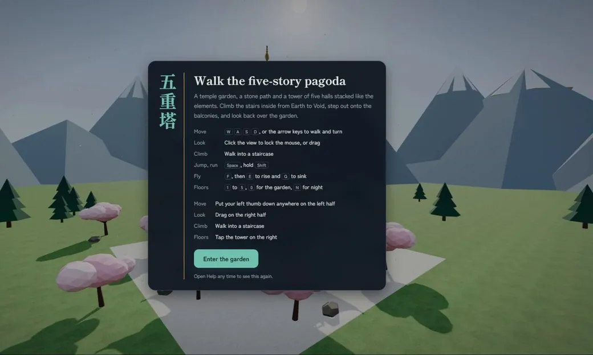</a>

**Промпт**

```text
Напишите код, позволяющий перемещаться внутри пагоды в 3D-пространстве.
```

<details>
<summary>Исходный промпт автора</summary>

```text
Implement code to be able to navigate in a pagoda in 3D.
```

</details>

[Подробнее ↗](https://www.tripo3d.ai/ru/3d-prompts/claude-opus-5-5-2103483174957597035) · [Исходная публикация](https://x.com/BuildFastWithAI/status/2103483174957597035) · [Назад к примерам](#all-prompts)

---

<a id="claude-opus-5-5-2103480081809346597"></a>

### Свободно исследуемый 3D-город с сакурой в стиле аниме

[Good FortuneX](https://x.com/pound75423) · 2026-09-25 · Claude Opus 5.5 · Интерактив

<a href="https://www.tripo3d.ai/ru/3d-prompts/claude-opus-5-5-2103480081809346597"></a>

**Промпт**

```text
С помощью Three.js создайте «свободно исследуемый 3D-город с сакурой в стиле аниме» в виде одного HTML-файла, а затем опубликуйте его как веб-страницу, доступную по ссылке.

[Технические ограничения]
- Используйте только three.js r128 (UMD-сборка) с cdnjs. Не загружайте внешние модели и изображения — процедурно создайте все модели, текстуры и вывески магазинов с помощью кода и Canvas.
- Используйте оригинальные названия магазинов, вывески и персонажей. Не имитируйте реальные бренды и существующие произведения.
- Используйте MeshStandardMaterial или MeshPhongMaterial. Избегайте высокой металличности и карт отражения окружения: на некоторых компьютерах из-за них объекты могут отображаться без цвета.
- Объедините статичные объекты по материалам в небольшое количество мешей, чтобы сцена работала на обычных компьютерах; добавьте переключатель качества High / Medium / Low.

[Сцена: «桜ヶ丘 (Sakuragaoka)», небольшой японский городок весенним днём]
1. Торговая улица: главная улица, идущая с севера на юг, с более чем 20 магазинами по обеим сторонам (раменная, кафе, веломагазин, книжный магазин, цветочный магазин, магазин японских сладостей, аптека, магазин у дома и т. д.). У каждого магазина должны быть: многострочная вывеска (название магазина + название на английском + номер телефона), полосатый навес с фестончатым краем, утопленный фасад с хорошо видимой глубиной интерьера и уличная витрина (ящики с фруктами, стойка с журналами, витрина с муляжами еды, вращающийся парикмахерский столб). На верхних этажах — окна, кондиционеры, балконы с развешанным бельём и телевизионные антенны на крышах.
2. Детали улицы: опоры с множеством воздушных проводов, декоративные фонари с баннерами торговой улицы, гирлянды праздничных фонариков, квадратная плитка тротуаров с жёлтой тактильной разметкой, решётки ливневых стоков, знаки «止まれ» и автобусная остановка.
3. Железнодорожный переезд и поезда: двухпутная железная дорога. При приближении поезда красные огни переезда мигают попеременно, звонит колокол, а шлагбаумы опускаются. Двухвагонный пригородный поезд останавливается на станции примерно на 14 секунд, а затем отправляется. Окна прозрачные, поэтому внутри видны сиденья и поручни.
4. Станция с островной платформой: табличка с названием станции, навес над платформой, скамейки и торговый автомат.
5. Площадь с сакурой: столетнее вишнёвое дерево с круглой скамьёй вокруг ствола.
6. Святилище Инари: большие ярко-красные тории и ряд маленьких тории, каменные фонари, статуи лис, зал поклонения (медно-зелёная крыша, элементы chigi и katsuogi, ящик для подношений, подвесной колокол), фонтан для ритуального омовения (temizuya), статуи Дзидзо, дощечки эма, священное дерево и гравийное покрытие.
7. Набережная: два ряда вишнёвых деревьев, образующие цветочный тоннель, фонари, река, дома на дальнем берегу и горы вдали.

[Как создать вишнёвые деревья (ключевая часть)]
- Ориентируйтесь на сорт Сомэй-ёсино: ствол низко разделяется на 3–4 основные ветви, которые рекурсивно ветвятся ещё на три уровня. Ветви расходятся в стороны и слегка поникают на концах, формируя общий зонтичный силуэт.
- Создайте крону из десятков тысяч «карточек цветочных кластеров»: нарисуйте на Canvas пятилистные цветы с выемками на кончиках лепестков, красноватыми центрами и тычинками, а под цветами добавьте мягкий розовый базовый слой. Для карточек используйте alphaTest и рендеринг с двух сторон.
- Добавьте несколько розовых объёмных комков внутри кроны. Внешние и верхние участки должны быть светлее, а внутренние и нижние — с тёплыми розовыми тенями.
- Используйте нежно-розовый цвет, а не неоново-розовый. Крона должна плавно колыхаться на ветру, землю под каждым деревом должен покрывать ковёр из опавших лепестков, а лепестки должны постоянно падать в воздухе — с помощью шейдера.

[Персонажи]
- Более 20 персонажей в стиле аниме — школьники и жители города: анимация ходьбы с суставами коленей и локтей, лица в стиле аниме, нарисованные на Canvas (большие глаза, блики, румянец), которые моргают, отдельные пряди чёлки, разнообразные причёски (длинные волосы, каре, качающийся хвост, два хвостика), матроски, школьные пиджаки и повседневная одежда. Рендерьте персонажей с двухцветным цел-шейдингом и тёмным контуром.
- Люди ходят по улице, общаются на площади, ждут на платформе, молятся в святилище и ездят на велосипедах по набережной.

[Транспорт]
- Создайте автомобили экструзией силуэта в боковой проекции (с колёсными арками, окнами, фарами, японскими номерными знаками и вращающимися колёсами). Автомобили останавливаются перед переездом и во время звонка колокола ждут, пока шлагбаумы не поднимутся.

[Освещение и время суток]
- Мягкий вид аниме-фона: голубое небо с белыми облаками (шейдер), лёгкая дымка вдали и тени с сине-фиолетовым оттенком.
- Переключение между режимами Afternoon / Dusk / Night Sakura. Ночью должны загораться окна, фонари и уличные светильники.

[Управление]
- Вид от первого лица: WASD — ходьба, Shift — бег, Space — прыжок, F — полёт, мышь — осмотр (блокировка указателя), цифровые клавиши — телепортация в каждую локацию, H — скрыть интерфейс, M — выключить звук.
- Мобильные устройства: проводите пальцем по левой половине экрана для перемещения, по правой — для осмотра.
- Коллизии включены; игрок может подняться на платформу и преодолевать ступени.
- Используйте Web Audio для генерации эмбиентного звука: ветра, пения птиц, колокола переезда и шума движущегося поезда.
```

<details>
<summary>Исходный промпт автора</summary>

```text
Please use Three.js to build a "freely walkable 3D anime-style cherry blossom town" as a single HTML file, then publish it as a shareable web page.

[Technical constraints]
- Use only three.js r128 (UMD build) from cdnjs. Do not load any external models or images — generate all models, textures, and shop signs procedurally with code and Canvas.
- Use original content for all shop names, signs, and characters. Do not imitate any real brand or existing work.
- Use MeshStandardMaterial or MeshPhongMaterial. Avoid high metalness and environment reflection maps (on some computers they make objects render with no color).
- Merge static objects by material into a small number of meshes so it runs on ordinary computers; provide a High / Medium / Low quality switch.

[Scene: "桜ヶ丘 (Sakuragaoka)", a small Japanese town on a spring afternoon]
1. Shopping street: a north–south main street with 20+ shops on both sides (ramen shop, café, bicycle shop, bookstore, florist, Japanese sweets shop, drugstore, convenience store, etc.). Each shop has: a multi-line sign (shop name + English name + phone number), a striped awning with a scalloped valance, a recessed storefront with an interior that has visible depth, and a sidewalk display (fruit crates, magazine rack, food-sample case, a spinning barber pole). Upper floors have windows, AC units, balconies with hanging laundry, and rooftop TV antennas.
2. Street details: utility poles with lots of overhead wires, decorative street lamps with shopping-street banners, festival lantern strings, square sidewalk tiles with yellow tactile paving, drain grates, "止まれ" stop signs, and a bus stop.
3. Level crossing and trains: a double-track railway. When a train approaches, the crossing's red lights flash alternately, the bell rings, and the gates lower. A two-car commuter train stops at the station for about 14 seconds and then departs. The windows are transparent, so the seats and hand straps inside are visible.
4. Island-platform station: station name board, platform canopy, benches, and a vending machine.
5. Sakura plaza: a 100-year-old cherry tree with a circular bench around it.
6. Inari shrine: a large vermilion torii plus a row of small torii, stone lanterns, fox statues, a worship hall (copper-green roof, chigi, katsuogi, offering box, hanging bell), a purification fountain (temizuya), jizo statues, ema plaques, a sacred tree, and gravel ground.
7. Riverside levee: two rows of cherry trees forming a blossom tunnel, lanterns, a river, houses on the far bank, and distant mountains.

[How to build the cherry trees (key part)]
- Model them on Somei-Yoshino: the trunk splits low into 3–4 main limbs, which branch recursively three more levels. Branches spread outward and droop slightly at the tips, giving an overall umbrella shape.
- Build the canopy from tens of thousands of "blossom cluster cards": draw five-petal flowers on Canvas (notched petal tips, reddish centers, stamens) with a soft pink base layer behind the flowers. Use alphaTest and double-sided rendering for the cards.
- Add a few pink filler clumps inside the canopy for volume. The outer and upper parts are brighter; the inner and lower parts have warm rose-toned shadows.
- Use pale pink, not neon pink. The canopy sways gently in the wind, a carpet of fallen petals covers the ground under each tree, and petals keep falling through the air (done in a shader).

[Characters]
- 20+ anime-style students and townspeople: walking animation with knee and elbow joints, anime faces drawn on Canvas (large eyes, highlights, blush) that blink, bangs made of separate strands, a variety of hairstyles (long, bob, swinging ponytail, twin tails), sailor uniforms / blazer uniforms / casual clothes. Render characters with two-tone cel shading and a dark outline.
- People walk along the street, chat in the plaza, wait on the platform, pray at the shrine, and ride bicycles along the levee.

[Vehicles]
- Build cars by extruding a side-profile silhouette (with wheel arches, windows, lights, Japanese license plates, and spinning wheels). Cars stop before the level crossing, and while the bell is ringing they wait until the gates rise.

[Lighting and time of day]
- A soft anime-background look: blue sky with white clouds (shader), light haze in the distance, and shadows with a blue-violet tint.
- Switchable between Afternoon / Dusk / Night Sakura. At night, windows, lanterns, and street lamps light up.

[Controls]
- First-person: WASD to walk, Shift to run, Space to jump, F to fly, mouse to look around (pointer lock), number keys to teleport to each location, H to hide the UI, M to mute.
- Mobile: drag on the left half to walk, drag on the right half to look around.
- Collision is enabled, and the player can walk up onto the platform and steps.
- Use Web Audio to generate ambient sound: wind, birdsong, the level-crossing bell, and train running sounds.
```

</details>

[Подробнее ↗](https://www.tripo3d.ai/ru/3d-prompts/claude-opus-5-5-2103480081809346597) · [Исходная публикация](https://x.com/pound75423/status/2103480085319942353) · [Назад к примерам](#all-prompts)

---

<a id="claude-opus-5-5-2103428454355980558"></a>

### Анимация в моушн-графике «Цикл жизни»

[Loïc](https://x.com/loicRambo) · 2026-09-25 · Claude Opus 5.5 · Анимация

<a href="https://www.tripo3d.ai/ru/3d-prompts/claude-opus-5-5-2103428454355980558">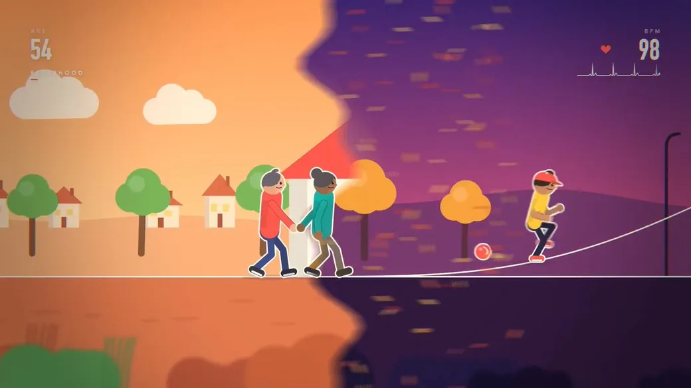</a>

**Промпт**

```text
Создай динамичное 20-секундное видео в жанре моушн-дизайна и анимации, которое показывает, насколько ты невероятный моушн-дизайнер и аниматор — словно это твой шоурил для резюме. Расскажи о жизненном цикле одного и того же человека: от детства к подростковому возрасту, затем к офисной рутине с 9 до 17, семейной жизни, старости и смерти. После этого сделай монтажный переход, готовый зациклить видео и вернуть его к началу. Выложись по полной и используй всё необходимое.
```

<details>
<summary>Исходный промпт автора</summary>

```text
make a dynamic 20-second motion graphics and animation video that shows what an incredible motion designer and animator you are, like it's your showreel for a résumé. make it about the cycle of life showing the same individual going from childhood to adolescence to the 9-5 cycle, to family life to elder life and death, then cutting ready to loop to the beginning.  go all out , use whatever you need.
```

</details>

[Подробнее ↗](https://www.tripo3d.ai/ru/3d-prompts/claude-opus-5-5-2103428454355980558) · [Исходная публикация](https://x.com/loicRambo/status/2103428454355980558) · [Назад к примерам](#all-prompts)

---

<a id="claude-opus-5-5-2103303303358534021"></a>

### Интерактивная 3D-сцена запуска ракеты над океаном

[PEP PEPICH](https://x.com/Artless101) · 2026-09-25 · Claude Opus 5.5 · Анимация

<a href="https://www.tripo3d.ai/ru/3d-prompts/claude-opus-5-5-2103303303358534021"></a>

**Промпт**

```text
Создайте кинематографичную, высокодетализированную интерактивную 3D-сцену запуска ракеты со стартовой платформы в океане на рассвете. Поставьте весь проект в один HTML-файл, который напрямую открывается в Chrome. Используйте Three.js + WebGL и процедурно создаваемые ресурсы. По возможности встраивайте ресурсы в файл; для библиотеки рендеринга можно использовать надёжный CDN.

ХУДОЖЕСТВЕННОЕ НАПРАВЛЕНИЕ
Создайте драматичный переход от тёмного сине-фиолетового океана перед рассветом к тёплому солнечному свету над атмосферой. Используйте убедительные пропорции, детализированные материалы, атмосферную перспективу и тщательно выстроенные ракурсы камеры. Результат должен восприниматься как отполированный миниатюрный фильм о космическом полёте.
РАКЕТА И СТАРТОВАЯ ПЛАТФОРМА
Создайте убедительную многоступенчатую ракету с оформленным носовым обтекателем, швами панелей, силовыми кольцами, межступенчатыми соединениями, соплами двигателей и головным обтекателем, который разделяется на две половины.

Создайте детализированную плавучую стартовую платформу с опорной башней, убираемой монтажной фермой, сервисными рычагами, ограждениями, лестницами, трубами, оборудованием, прожекторами и мигающими сигнальными маяками. Все конструкции должны быть физически соединены и правильно расположены.
ПОСЛЕДОВАТЕЛЬНОСТЬ ЗАПУСКА
Создайте последовательность продолжительностью примерно 46 секунд:

Начальный облёт камеры вокруг платформы.

Сервисные рычаги и монтажная ферма убираются.
Двигатели запускаются, освещая ракету, платформу и ближайшую воду.
Дым распространяется по палубе, пока ракета отрывается от платформы и набирает скорость.
Камера сопровождает подъём ракеты из атмосферы в космос.
Первая ступень отделяется и отлетает.
Запускается двигатель второй ступени.
Половины обтекателя расходятся, открывая спутник.
Двигатель выключается, спутник отделяется, а его солнечные панели раскрываются.
Завершите сцену орбитальным видом на спутник на фоне изогнутого горизонта Земли и рассвета.
Сожмите временную шкалу полёта для презентации, сохранив согласованность движения. Избегайте резких скачков положения, пересечения компонентов и несвязанных эффектов.
ОКЕАН, АТМОСФЕРА И ЭФФЕКТЫ
Используйте анимированные волны океана на основе шейдеров с отражениями Френеля и тёплыми отражениями света от двигателей. Создайте многослойный выхлоп: яркое ядро, более мягкое внешнее пламя и дрейфующие частицы дыма.
Дым должен расширяться, рассеиваться и реагировать на ветер. Выхлоп на всех этапах должен оставаться прикреплённым к соответствующему двигателю. Плавно переходите от атмосферной дымки к тёмному звёздному небу и освещённому краю Земли.

КАМЕРА И ВЗАИМОДЕЙСТВИЕ
Используйте плавные кинематографичные переходы камеры: общий начальный план, ракурс снизу в момент запуска, сопровождение подъёма, разделение ступеней и крупный план спутника. Главный объект должен оставаться видимым как в портретной, так и в альбомной ориентации.

Добавьте кнопки воспроизведения и паузы, повторный запуск и ползунок перемотки с маркерами событий. Переход к любой позиции должен восстанавливать корректную конфигурацию ракеты, состояние частиц, положение камеры и освещение. Повторное воспроизведение должно полностью и корректно сбрасывать последовательность.
Интерфейс должен быть минимальным и ненавязчивым. Предусмотрите возможность скрыть его для записи.

ТЕХНИЧЕСКОЕ КАЧЕСТВО
Используйте анимацию, независимую от частоты кадров, и эффективные системы частиц. По возможности переиспользуйте геометрию и материалы, корректно обрабатывайте изменение размеров окна и находите баланс между визуальной детализацией и плавной производительностью.

Проверьте итоговый HTML в браузере на компьютере. Просмотрите консоль и сделайте скриншоты в моменты запуска двигателей, отрыва от платформы, разделения ступеней и развёртывания спутника. Перед передачей файла исправьте ошибки загрузки, обрезание объектов, проблемы с геометрией, неисправную перемотку и неудачную композицию кадра.
```

<details>
<summary>Исходный промпт автора</summary>

```text
Create a cinematic, highly detailed, interactive 3D rocket launch from an ocean platform at dawn. Deliver the complete project in one HTML file that opens directly in Chrome. Use Three.js + WebGL and procedural assets. Embed assets wherever practical; a reliable CDN may be used for the rendering library.

ART DIRECTION
Create a dramatic transition from a dark, blue-violet ocean before sunrise to warm sunlight above the atmosphere. Use convincing proportions, detailed materials, atmospheric depth, and carefully composed camera angles. The result should feel like a polished miniature spaceflight film.
ROCKET AND LAUNCH PLATFORM
Build a convincing multistage rocket with a shaped nose cone, panel seams, structural rings, interstage connections, engine nozzles, and a payload fairing that separates into two halves.

Create a detailed floating launch platform with a support tower, retracting strongback, service arms, railings, ladders, pipes, equipment, floodlights, and blinking warning beacons. Keep all structures physically connected and correctly positioned.
LAUNCH SEQUENCE
Create an approximately 46-second sequence:

Establishing camera move around the platform.

Service arms and strongback retract.
Engines ignite, illuminating the rocket, platform, and nearby water.
Smoke spreads across the deck as the rocket lifts off and accelerates.
The camera follows the climb from the atmosphere toward space.
The first stage separates and falls away.
The second-stage engine ignites.
The fairing halves separate, revealing a satellite.
The engine shuts down, the satellite deploys, and its solar panels unfold.
Finish with an orbital view of the satellite against Earth’s curved horizon and sunrise.
Compress the flight timeline for presentation while maintaining coherent motion. Avoid sudden position changes, intersecting components, or disconnected effects.
OCEAN, ATMOSPHERE, AND EFFECTS
Use animated shader-driven ocean waves with Fresnel reflections and warm engine-light reflections. Create layered exhaust with a bright core, softer outer flame, and drifting smoke particles.
Smoke should expand, fade, and respond to wind. Exhaust must remain attached to the correct engine through staging. Transition smoothly from atmospheric haze to a dark star field and Earth’s illuminated limb.

CAMERA AND INTERACTION
Use smooth cinematic camera transitions: wide establishing view, low-angle ignition shot, ascent tracking, stage separation, and satellite close-up. Keep the main subject visible in both portrait and landscape layouts.

Include play/pause, replay, and a scrubber with event markers. Seeking must reconstruct the correct rocket configuration, particle state, camera position, and lighting. Replaying must reset the entire sequence cleanly.
Keep the interface minimal and unobtrusive. Allow it to be hidden for recording.

TECHNICAL QUALITY
Use frame-rate-independent animation and efficient particle systems. Reuse geometry and materials where appropriate, handle resizing correctly, and balance visual detail with smooth performance.

Test the final HTML in a desktop browser. Inspect the console and capture screenshots at ignition, liftoff, staging, and satellite deployment. Fix loading errors, clipping, geometry problems, broken seeking, and poor camera framing before delivering the file.
```

</details>

[Подробнее ↗](https://www.tripo3d.ai/ru/3d-prompts/claude-opus-5-5-2103303303358534021) · [Исходная публикация](https://x.com/Artless101/status/2103303449831964679) · [Назад к примерам](#all-prompts)

---

<a id="claude-opus-5-5-2103257687492374597"></a>

### Интерактивное средневековое королевство для Claude Opus 5.5

[Vib3Coded](https://x.com/vib3coded) · 2026-09-24 · Claude Opus 5.5 · Интерактив

<a href="https://www.tripo3d.ai/ru/3d-prompts/claude-opus-5-5-2103257687492374597"></a>

**Промпт**

```text
Создайте собственное средневековое королевство.
Ваше королевство представляет Claude Opus 5.5. Спроектируйте великолепный замок, вдохновлённый историей, который выражает индивидуальность этой модели через архитектуру, геральдику, цвета и атмосферу. Вы полностью свободны в художественном выборе, но сеттинг должен оставаться правдоподобным для Средневековья.
Не ограничивайтесь размещением логотипа на типовом замке. Придайте королевству distinctive архитектурный характер и цельный визуальный образ. Придумайте герб, королевские цвета и оригинальную геральдическую эмблему. Разместите их на анимированных знамёнах, щитах, украшениях ворот и одежде замковой стражи. Поместите название королевства над главным входом.
Создайте насыщенную деталями интерактивную 3D-сцену с использованием Three.js и WebGL. Всё должно находиться в одном автономном HTML-файле, который можно напрямую открыть в Chrome.
ЗАМОК
Постройте убедительную крепость с центральной цитаделью, башнями, зубчатыми стенами, куртинными стенами, внушительными надвратными сооружениями, работающим подъёмным мостом и внутренним двором.
Добавьте тщательно смоделированную каменную кладку, арочные окна, деревянные двери, конструкции крыш, лестницы, балконы, железные элементы и небольшие архитектурные детали. Сделайте сооружения правдоподобными: у башен должны быть интерьеры или убедительная глубина, лестницы должны вести на доступные этажи, а мосты — иметь надёжные опоры.
Окружите замок привлекательным ландшафтом, соответствующим вашему королевству: скалами, холмами, рекой, рвом, лесами или небольшой деревней. Выстройте выразительную композицию, которая красиво выглядит с разных ракурсов.
ЖИЗНЬ И ВЗАИМОДЕЙСТВИЕ
Оживите королевство: пусть стражники патрулируют стены, жители проходят через внутренний двор, знамёна слегка развеваются, из труб идёт дым, летают птицы, а фонари мерцают.
Дайте зрителю возможность:
Открывать и закрывать подъёмный мост и главные ворота.
Следовать за патрулирующим стражником.
Переключаться между кинематографичным общим видом, внутренним двором и крепостными стенами.
Свободно вращать камеру и масштабировать изображение.
Переключаться между дневным светом, закатом и ночью.
Перемещайте персонажей только по доступным для ходьбы поверхностям. Не допускайте, чтобы они проходили сквозь стены, двери или друг друга.
ОСВЕЩЕНИЕ И АТМОСФЕРА
Создайте кинематографичное освещение, которое чётко раскрывает архитектуру. Используйте мягкие тени, атмосферную глубину, правдоподобную воду там, где это уместно, и сдержанную постобработку.
Ночью подсветите окна, факелы и фонари, сохранив достаточную видимость, чтобы замок оставался хорошо различимым.
Стремитесь к сложной, законченной 3D-работе с самобытной архитектурой и множеством деталей. Избегайте набора очевидных примитивов или повторяющихся башен, лишённых архитектурного назначения.
ТЕХНИЧЕСКОЕ КАЧЕСТВО
По возможности создавайте ассеты процедурно. Встраивайте текстуры и другие ресурсы непосредственно в HTML. Локальный сервер и этап сборки не должны требоваться.
Где уместно, используйте инстансинг и объединение геометрии. Обеспечьте плавную анимацию и удобное управление камерой. Добавьте минималистичный элегантный интерфейс на английском языке и кнопку для его скрытия.
Фактически протестируйте результат в Chrome для компьютера. Сделайте скриншоты, проверьте консоль, протестируйте все взаимодействия и исправьте ошибки рендеринга, парящие объекты, пересечения геометрии и проблемы с камерой.
Сделайте замок таким, чтобы люди узнавали в нём ИМЕННО ваше королевство ещё до того, как прочитают его название.
Верните готовый автономный HTML-файл.
```

<details>
<summary>Исходный промпт автора</summary>

```text
Build your own medieval kingdom.
Your kingdom represents Claude Opus 5.5. Design a magnificent, historically inspired castle that expresses this model’s identity through architecture, heraldry, colors and atmosphere. You have complete artistic freedom within a believable medieval setting.
Do not simply place a logo on a generic castle. Give your kingdom a distinctive architectural character and a coherent visual identity. Invent its coat of arms, royal colors and an original heraldic emblem. Display them on animated banners, shields, gate decorations and the clothing of the castle guards. Place the kingdom’s name above the main entrance.
Create a richly detailed, interactive 3D scene using Three.js and WebGL. Deliver everything in one standalone HTML file that opens directly in Chrome.
THE CASTLE
Build a convincing fortress with a central keep, towers, battlements, curtain walls, an impressive gatehouse, a working drawbridge and a courtyard.
Include carefully modeled stonework, arched windows, wooden doors, roof structures, stairs, balconies, iron fittings and small architectural details. Make the structures believable: towers need interiors or convincing depth, stairs must connect to accessible floors, and bridges must have proper supports.
Surround the castle with an attractive landscape that suits your kingdom: cliffs, hills, a river, a moat, forests or a small village. Design a strong composition that looks beautiful from multiple angles.
LIFE AND INTERACTION
Bring the kingdom to life with guards patrolling the walls, villagers moving through the courtyard, gently waving banners, chimney smoke, birds and flickering lanterns.
Let the viewer:
Open and close the drawbridge and main gate.
Follow a guard on patrol.
Switch between a cinematic overview, the courtyard and the battlements.
Rotate and zoom freely.
Change between daylight, sunset and night.
Keep characters on walkable surfaces. Prevent them from passing through walls, doors or one another.
LIGHTING AND ATMOSPHERE
Create cinematic lighting that reveals the architecture clearly. Use soft shadows, atmospheric depth, convincing water where appropriate and restrained post-processing.
At night, illuminate windows, torches and lanterns while preserving enough visibility to appreciate the castle.
Aim for a sophisticated, finished 3D artwork with distinctive architecture and abundant detail. Avoid a collection of obvious primitive shapes or repetitive towers with no architectural purpose.
TECHNICAL QUALITY
Generate assets procedurally wherever practical. Embed textures and other assets inside the HTML. No local server or build step should be required.
Use instancing and geometry batching where appropriate. Keep animation and camera interaction smooth. Provide a minimal, elegant English interface and a button to hide it.
Actually test the result in desktop Chrome. Capture screenshots, inspect the console, test every interaction and fix rendering errors, floating objects, geometry intersections and camera problems.
Make this a castle people would recognize as YOUR kingdom, even before reading its name.
Return the completed standalone HTML file.
```

</details>

[Подробнее ↗](https://www.tripo3d.ai/ru/3d-prompts/claude-opus-5-5-2103257687492374597) · [Исходная публикация](https://x.com/vib3coded/status/2103257873203462412) · [Назад к примерам](#all-prompts)

---

<a id="claude-opus-5-5-2103145567945986461"></a>

### Пустота: короткометражный фильм о соборе, наполненном светом витражей

[AGIおやZ](https://x.com/AGIOyaZ) · 2026-09-24 · Claude Opus 5.5 · Анимация

<a href="https://www.tripo3d.ai/ru/3d-prompts/claude-opus-5-5-2103145567945986461"></a>

**Промпт**

```text
Создайте в three.js короткометражный фильм в портретной ориентации 1080×1920, 30 кадров/с, продолжительностью около 36 секунд. 

【Название作品】
Пустота

【Желаемый эффект】
Это видео должно без единого персонажа передать ощущение, как из-за постоянной гонки за эффективностью мы теряем время, а в момент обретения свободного пространства жизнь наполняется богатым светом. В финале свет витража, проступающий на всём полу, должен заставить зрителя невольно затаить дыхание.

【Сцена】
・Интерьер погружённого в полумрак каменного собора. На дальней стене находится только одно окно в форме стрельчатой арки высотой 15 м и шириной 10 м
・Снаружи через окно под углом 45 градусов падает яркий свет, отбрасывая на каменный пол световое пятно в форме окна
・В окно вставлен витраж: в центре — Дева Мария, по обеим сторонам — два ангела с расправленными крыльями, в верхней части — роза. Дизайн должен быть оригинальным, не копировать существующие произведения и иметь симметричную композицию

【Временная структура】
0–3 секунды: свет, проникающий через окно, пока ещё бесцветный и белый. На полу — мягкое белое световое пятно
3–11 секунд: серые кубы с выгравированными словами «Занят», «Оптимизация», «Срочно», «Дедлайн» и другими подобными выражениями один за другим влетают с переднего плана и заполняют окно. Темп их появления постоянно ускоряется, а по мере заполнения окна помещение погружается во тьму
11–14 секунд: окно полностью закрыто, вокруг царят тьма и тишина
14–19 секунд: только один блок со словом «Занят» отделяется от окна и падает вниз, превращаясь в частицы света и исчезая. Через образовавшееся отверстие пробивается яркий луч насыщенного цвета
19–26 секунд: начиная с первого отверстия блоки один за другим отделяются от окна. С каждым новым отверстием становится больше разноцветных световых столбов, а скрытый витраж постепенно открывается взгляду
26–33 секунды: все блоки исчезают, камера проходит сквозь световые столбы и поднимается, чтобы посмотреть на пол строго сверху. Весь пол покрыт проекцией витража с Девой Марией и ангелами, сияющей яркими цветами
33–36 секунд: весь экран окутывает ослепительный свет, появляется финальная фраза, и видео тихо завершается

【Текстовые фразы (сдержанно появляются и исчезают, шрифт минcho)】
・«Каждый день — ещё быстрее.»
・«Ещё эффективнее.»
・«И вдруг я заметил: свет больше не проникает внутрь.»
・«Попробую отпустить хотя бы что-то одно.»
・«Свет проникает туда, где освободилось место.»
・«И этот свет оказался богаче прежнего.»
・В финале крупно: «Изобилие рождается в свободном пространстве»

【Свет и материалы】
・Световые столбы окрашены в цвет соответствующего участка витража, а взвешенная в воздухе пыль мерцает
・Проекция на полу должна точно отражать, какие отверстия в окне открыты: участки, закрытые блоками, остаются в тени
・Блоки выполнены из матового серого материала с безликим индустриальным видом. Надписи выгравированы белым цветом
・В первой половине преобладают холодные ахроматические тона, во второй — похожие на драгоценные камни красный, синий и золотой. Этот контраст должен передавать ощущение обретённого изобилия

【Технические условия】
・Изображение витража сгенерируйте как текстуру, а свет на полу, световые столбы и изображение в окне рассчитайте на основе одного и того же изображения, чтобы они полностью совпадали
・Точно продвигайте время с шагом 1/30 секунды, экспортируйте каждый кадр отдельно и соберите их в MP4

【Финальная проверка】
Отрендерьте и проверьте каждую сцену в реальном виде. Перед передачей исправьте результат, если на проекции пола нельзя распознать Деву Марию и ангелов, если текст плохо читается или движения выглядят резкими и неестественными.
```

<details>
<summary>Исходный промпт автора</summary>

```text
three.jsで、縦長1080×1920・30コマ/秒・約36秒の短編映像を作ってください。

【作品名】
余白

【見せたい体験】
効率化に追われて時間を失っていく感覚と、余白を手に入れた瞬間に人生が豊かな光で満たされていく感覚を、人物を一切登場させずに体感させる映像です。最後に床一面に浮かび上がるステンドグラスの光で、見た人が思わず息をのむことを目指します。

【舞台】
・薄暗い石造りの大聖堂の内部。正面の壁に、高さ15m・幅10mの尖頭アーチ型の窓が一つだけある
・窓の外からは、斜め45度の角度で強い光が差し込み、石の床に窓の形の光を落としている
・窓には、中央に聖母、両脇に翼を広げた二人の天使、上部にバラ窓を配したステンドグラスがはまっている。デザインは既存の作品を模さずオリジナルで、左右対称の構図にする

【時間の構成】
0〜3秒：窓から差す光は、まだ色のない白い光。床にやわらかな白い光の形
3〜11秒：「忙しい」「効率化」「至急」「締切」などの言葉が刻まれた灰色の立方体が、部屋の手前から次々と飛んできて窓を埋めていく。飛来のペースはどんどん加速し、窓が埋まるほど部屋は暗くなる
11〜14秒：窓は完全にふさがれ、闇と静寂
14〜19秒：「忙しい」のブロックが一つだけ窓から外れて落ち、光の粒になって消える。空いた穴から、鮮やかな色の一筋の光が差し込む
19〜26秒：最初の穴を中心に、ブロックが連鎖的に外れていく。穴が増えるたびに色とりどりの光の柱が増え、隠れていたステンドグラスが少しずつ姿を現す
26〜33秒：すべてのブロックが消え、カメラは光の柱をくぐり抜けて上昇し、真上から床を見下ろす。床一面に、聖母と天使のステンドグラスが色鮮やかな光として映し出されている
33〜36秒：画面全体がまばゆい光に包まれ、最後の言葉が浮かび、静かに終わる

【言葉（明朝体、控えめに浮かんでは消える）】
・「毎日、もっと速く。」
・「もっと、効率よく。」
・「気づけば、光が入らなくなっていた。」
・「ひとつ、手放してみる。」
・「空いたところから、光が入る。」
・「その光は、前より豊かだった。」
・最後に大きく：「豊かさは余白に宿る」

【光と質感】
・光の柱は、ステンドグラスのその場所の色に染まり、空中の塵がきらめく
・床の投影は、窓のどの穴が空いているかを正確に反映する（ブロックがある場所は影になる）
・ブロックは無機質なマットグレー。言葉は白く刻印されている
・前半は冷たく無彩色、後半は宝石のような赤・青・金。この色の対比で「豊かになった」ことを語る

【技術条件】
・ステンドグラスの絵柄は画像として生成し、床の光・光の柱・窓の表示はすべて同じ絵柄から計算して一致させる
・時間を1/30秒ずつ正確に進めて1コマずつ書き出し、MP4にする

【仕上げ】
各場面を実際に描画して確認し、ステンドグラスの絵柄が床の上で聖母と天使として読み取れるか、言葉が読めるか、動きが唐突でないかを直してから渡してください。
```

</details>

[Подробнее ↗](https://www.tripo3d.ai/ru/3d-prompts/claude-opus-5-5-2103145567945986461) · [Исходная публикация](https://x.com/AGIOyaZ/status/2103145567945986461) · [Назад к примерам](#all-prompts)

---

<a id="claude-opus-5-5-2103144530157687114"></a>

### Игра в стиле Genshin Impact в Сан-Франциско

[Every 📧](https://x.com/every) · 2026-09-24 · Claude Opus 5.5 · Игры

<a href="https://www.tripo3d.ai/ru/3d-prompts/claude-opus-5-5-2103144530157687114"></a>

**Промпт**

```text
Создай игру в стиле Genshin Impact, действие которой происходит в Сан-Франциско.
```

<details>
<summary>Исходный промпт автора</summary>

```text
Build a Genshin Impact–style game set in San Francisco.
```

</details>

[Подробнее ↗](https://www.tripo3d.ai/ru/3d-prompts/claude-opus-5-5-2103144530157687114) · [Исходная публикация](https://x.com/every/status/2103144530157687114) · [Назад к примерам](#all-prompts)

---

<a id="claude-opus-5-5-2103116235009347650"></a>

### Кинематографичный фильм о битве при Аустерлице

[Winter](https://x.com/WinterArc2125) · 2026-09-24 · Claude Opus 5.5 · Анимация

<a href="https://www.tripo3d.ai/ru/3d-prompts/claude-opus-5-5-2103116235009347650"></a>

**Референсы:** [1](https://media.tripogrowth.space/media/9420c404-1c47-48c2-a7ec-1b5dfdc1f057.jpg) · [2](https://media.tripogrowth.space/media/0e238466-f725-44b7-8cd2-dc436c9e66c2.jpg) · [3](https://pbs.twimg.com/media/HS_FTwwXcAIpMjc.jpg) · [4](https://pbs.twimg.com/media/HS_FWGXXUAA5LrJ.jpg)

**Промпт**

```text
Создайте 4–5-минутное кинематографичное видео о битве при Аустерлице (1805), полностью созданное средствами кода.

Тщательно изучите битву и самостоятельно решите, как рассказать эту историю, выстроить темп повествования, объяснить стратегию и визуализировать события. Видео должно быть исторически достоверным, драматичным, понятным и визуально впечатляющим.

Используйте приложенные картины как источник визуального вдохновения, а не как обязательное стилевое требование. Мне нравятся их масштаб, атмосфера, дым, драматичное небо, кавалерия, плотные боевые построения, ландшафт и ощущение хаоса. Найдите способ передать это настроение средствами кода — но если сможете придумать более выразительный визуальный язык, используйте его.

Видео не должно напоминать типичную инфографику или стратегическую игру. Это должен быть кинематографичный исторический фильм, который лишь создан с помощью кода.

У вас полная творческая свобода. Удивите меня.
```

<details>
<summary>Исходный промпт автора</summary>

```text
Create a 4–5 minute cinematic video about the Battle of Austerlitz (1805), built entirely in code.

Research the battle thoroughly and decide for yourself how to tell the story, structure the pacing, explain the strategy, and visualize the events. I want it to be historically accurate, dramatic, easy to understand, and visually exceptional.

Use the attached paintings as visual inspiration, not a strict style requirement. I love their scale, atmosphere, smoke, dramatic skies, cavalry, massed formations, landscape, and sense of chaos. Find a way to translate that feeling into code — but if you can invent a stronger visual language, do it.

Don't make it feel like a generic infographic or strategy game. It should feel like a cinematic historical film that happens to be rendered with code.

You have complete creative control. Surprise me.
```

</details>

[Подробнее ↗](https://www.tripo3d.ai/ru/3d-prompts/claude-opus-5-5-2103116235009347650) · [Исходная публикация](https://x.com/WinterArc2125/status/2103116689944502720) · [Исходный код](https://github.com/WinterArc21/Battle-of-Austerlitz-Film) · [Назад к примерам](#all-prompts)

---

<a id="claude-opus-5-5-2103106070549757960"></a>

### Создайте Эйфелеву башню в Three.js

[Pascual ⚡](https://x.com/0xPascual) · 2026-09-24 · Claude Opus 5.5 · 3D-ассеты

<a href="https://www.tripo3d.ai/ru/3d-prompts/claude-opus-5-5-2103106070549757960">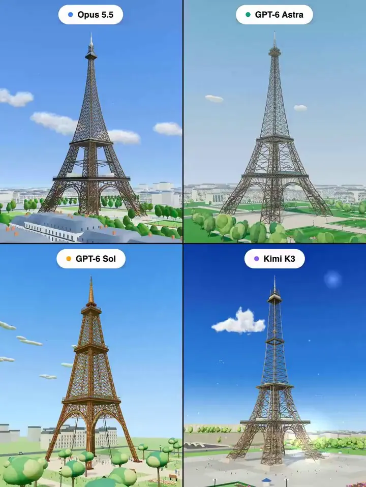</a>

**Промпт**

```text
создайте Эйфелеву башню в Three.js.
```

<details>
<summary>Исходный промпт автора</summary>

```text
build the Eiffel Tower in Three.js.
```

</details>

[Подробнее ↗](https://www.tripo3d.ai/ru/3d-prompts/claude-opus-5-5-2103106070549757960) · [Исходная публикация](https://x.com/0xPascual/status/2103106070549757960) · [Назад к примерам](#all-prompts)

---

<a id="claude-opus-5-5-2103087766662009118"></a>

### Анимация на Three.js уровня Pixar для Grid Genius

[Anil Rao K](https://x.com/Anilraok) · 2026-09-24 · Claude Opus 5.5 · Анимация

<a href="https://www.tripo3d.ai/ru/3d-prompts/claude-opus-5-5-2103087766662009118"></a>

**Промпт**

```text
Я хочу, чтобы вы придумали историю, которая ненавязчиво продвигает Grid Genius. Впрочем, Grid Genius может в ней вообще не упоминаться — главное, чтобы история соответствовала нашему приложению и помогла привлечь больше внимания в соцсетях. Затем с помощью Three.js и JavaScript создайте по этой истории полноценную анимацию кинематографического качества, сравнимого с Pixar.
```

<details>
<summary>Исходный промпт автора</summary>

```text
I want you to imagine a story, that subtly promotes grid genius. Or it can not even have grid genius, but something that aligns with our app and helps us get more eyeballs when posted on social media. Then using threejs/javascript I want you to create full animation, Pixar-level quality out of the story you imagine
```

</details>

[Подробнее ↗](https://www.tripo3d.ai/ru/3d-prompts/claude-opus-5-5-2103087766662009118) · [Исходная публикация](https://x.com/Anilraok/status/2103087766662009118) · [Назад к примерам](#all-prompts)

---

<a id="claude-opus-5-5-2103083781490176212"></a>

### Игра в реальном времени: пеликан на велосипеде

[Yaowei Zheng \| LlamaFactory](https://x.com/code_hiyouga) · 2026-09-24 · Claude Opus 5.5 · Игры

<a href="https://www.tripo3d.ai/ru/3d-prompts/claude-opus-5-5-2103083781490176212"></a>

**Промпт**

```text
Создайте 3D-игру в реальном времени, в которой пеликан катается на велосипеде по живому прибрежному миру с физикой, волнами, рыбалкой, динамической погодой, кинематографичными камерами, автопилотом и адаптивной музыкой.
```

<details>
<summary>Исходный промпт автора</summary>

```text
Build a real-time 3D game where a pelican cycles through a living seaside world, complete with physics, waves, fishing, dynamic weather, cinematic cameras, autopilot, and adaptive music.
```

</details>

[Подробнее ↗](https://www.tripo3d.ai/ru/3d-prompts/claude-opus-5-5-2103083781490176212) · [Исходная публикация](https://x.com/code_hiyouga/status/2103083781490176212) · [Назад к примерам](#all-prompts)

---

<a id="claude-opus-5-5-2103046279253168554"></a>

### Создайте имперский город

[EnzoXbt](https://x.com/Enzoxbt01) · 2026-09-24 · Claude Opus 5.5 · Сцены

<a href="https://www.tripo3d.ai/ru/3d-prompts/claude-opus-5-5-2103046279253168554"></a>

**Промпт**

```text
СОЗДАЙТЕ ИМПЕРСКИЙ ГОРОД
```

<details>
<summary>Исходный промпт автора</summary>

```text
BUILD AN IMPERIAL CITY
```

</details>

[Подробнее ↗](https://www.tripo3d.ai/ru/3d-prompts/claude-opus-5-5-2103046279253168554) · [Исходная публикация](https://x.com/Enzoxbt01/status/2103046279253168554) · [Назад к примерам](#all-prompts)

---

<a id="claude-opus-5-5-2102828216289566725"></a>

### Создание Bugatti Chiron Super Sport в Three.js

[Sree](https://x.com/srikanthvaluri) · 2026-09-23 · Claude Opus 5.5 · 3D-ассеты

<a href="https://www.tripo3d.ai/ru/3d-prompts/claude-opus-5-5-2102828216289566725"></a>

**Промпт**

```text
создай Bugatti Chiron Super Sport в Three.js.

Без 3D-модели. Без текстур. Без ассетов.
```

<details>
<summary>Исходный промпт автора</summary>

```text
build a Bugatti Chiron Super Sport in Three.js.

No 3D model. No textures. No assets.
```

</details>

[Подробнее ↗](https://www.tripo3d.ai/ru/3d-prompts/claude-opus-5-5-2102828216289566725) · [Исходная публикация](https://x.com/srikanthvaluri/status/2102828216289566725) · [Назад к примерам](#all-prompts)

---

<a id="claude-opus-5-5-2102788371114246177"></a>

### Тренировочный монтаж роста возможностей Claude

[Ishu Agrawal](https://x.com/ishuagra02) · 2026-09-23 · Claude Opus 5.5 · Анимация

<a href="https://www.tripo3d.ai/ru/3d-prompts/claude-opus-5-5-2102788371114246177">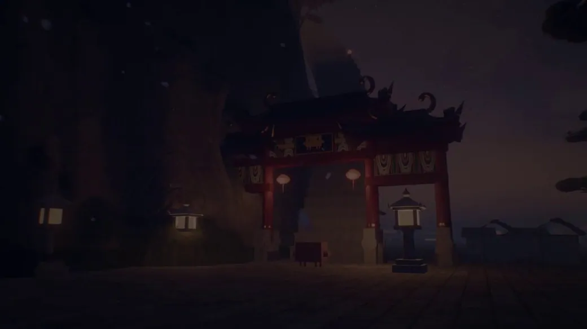</a>

**Промпт**

```text
Создай 30-секундную анимацию, полностью сгенерированную кодом: монтаж роста возможностей в духе тренировочной сцены из «Кунг-фу Панды», где главным персонажем выступает маскот Claude. Покажи, как с момента своего первого выпуска он становится всё более способным в разных задачах: ищет информацию в интернете, пишет код, создаёт 3D-модели и решает сложнейшие проблемы человечества. Добавь эмоционально насыщенную музыку.
```

<details>
<summary>Исходный промпт автора</summary>

```text
Create a 30 second animation entirely in code featuring a growth montage, inspired by Kung Fu Panda's training sequence, with the Claude mascot as the main character, showcasing it getting more capable since its initial release across its skillset, such as searching the internet, writing code, creating 3D models, and solving humanity's hardest problems, with emotionally impactful music.
```

</details>

[Подробнее ↗](https://www.tripo3d.ai/ru/3d-prompts/claude-opus-5-5-2102788371114246177) · [Исходная публикация](https://x.com/ishuagra02/status/2102788832273801700) · [Назад к примерам](#all-prompts)

---

<a id="claude-opus-5-5-2102788223835463902"></a>

### Создайте мультфильм в стиле 90-х с качеством уровня Pixar на Three.js

[Shimecki](https://x.com/scheemunai) · 2026-09-23 · Claude Opus 5.5 · Анимация

<a href="https://www.tripo3d.ai/ru/3d-prompts/claude-opus-5-5-2102788223835463902">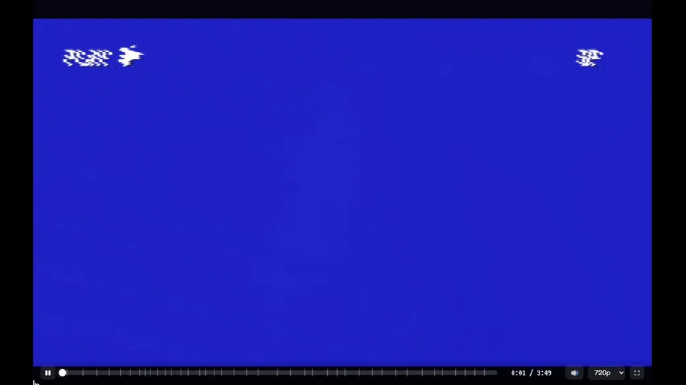</a>

**Промпт**

```text
Придумай историю. Затем с помощью Three.js создай по этой истории полноценную анимацию в стиле мультфильмов 90-х с качеством уровня Pixar.
```

<details>
<summary>Исходный промпт автора</summary>

```text
I want you to imagine a story. And then using threejs I want you to create full animation, Pixar-level quality 90s cartoon out of the story you imagine.
```

</details>

[Подробнее ↗](https://www.tripo3d.ai/ru/3d-prompts/claude-opus-5-5-2102788223835463902) · [Исходная публикация](https://x.com/scheemunai/status/2102788223835463902) · [Назад к примерам](#all-prompts)

---

<a id="claude-opus-5-5-2102781807179735211"></a>

### Зацикленная анимация круговорота воды, созданная кодом

[Higgsfield AI 🧩](https://x.com/higgsfield_ai) · 2026-09-23 · Claude Opus 5.5 · Анимация

<a href="https://www.tripo3d.ai/ru/3d-prompts/claude-opus-5-5-2102781807179735211">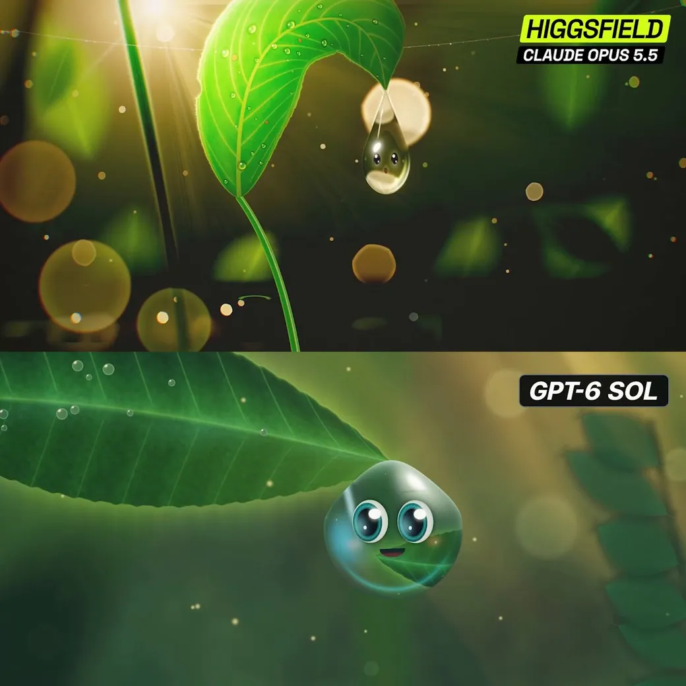</a>

**Промпт**

```text
Создайте бесшовную зацикленную анимацию круговорота воды, полностью написанную в коде.
```

<details>
<summary>Исходный промпт автора</summary>

```text
Create a seamless looping animation of the water cycle, entirely in code.
```

</details>

[Подробнее ↗](https://www.tripo3d.ai/ru/3d-prompts/claude-opus-5-5-2102781807179735211) · [Исходная публикация](https://x.com/higgsfield_ai/status/2102781807179735211) · [Назад к примерам](#all-prompts)

---

<a id="claude-opus-5-5-2102775461701091531"></a>

### CatWalk: 3D-игра про кота, мчащегося по ночному городу

[BLITAST STUDIO](https://x.com/blitast_studio) · 2026-09-23 · Claude Opus 5.5 · Игры

<a href="https://www.tripo3d.ai/ru/3d-prompts/claude-opus-5-5-2102775461701091531">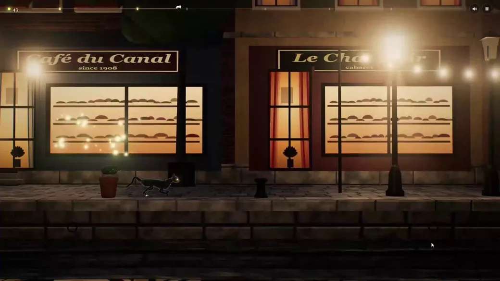</a>

**Промпт**

```text
Давайте разработаем игру
Графика может быть 2D или 3D — выберите вариант, который будет проще реализовать с учётом анализа игровой системы и других аспектов
Лично я представляю её в 3D, но по структуре это должно быть что-то вроде сайд-скроллера с экшеном
Я думаю, что 3D позволит добиться красивой визуальной подачи и стильной атмосферы за счёт освещения и других эффектов — например, уличных фонарей и ламп
Игра, которую я хочу сделать, называется CatWalk
Название говорит само за себя
Кот движется вправо
Путь в виде подиума продолжается, а экран прокручивается автоматически, поэтому игрок должен в нужный момент простыми действиями, например прыжком, преодолевать препятствия и провалы, подстраиваясь под скорость прокрутки. По напряжению и механике это может быть чем-то похоже на Flappy Bird.
При этом графика должна быть стильной, взрослой и эффектной, с упором на атмосферу
Было бы здорово, если бы удалось передать плавную пластику кота при ходьбе, беге и прыжках
Мир уровня оставляю на ваше усмотрение, но для начала подойдёт что-нибудь нейтральное, например ночная улица
Будет особенно здорово, если за счёт затемнённой палитры удастся красиво показать рассеянное и акцентное освещение
Понимаю, что есть вещи, которые можно сделать, нельзя сделать или сложно реализовать
Поэтому, опираясь на мои пожелания, разработайте то, что, на ваш взгляд, вам по силам
Для начала сделайте один полностью проходимый цикл одного уровня
```

<details>
<summary>Исходный промпт автора</summary>

```text
ゲームを開発しましょう
グラフィックは2D、3Dを問いませんがゲームのシステムなどを分析し開発しやすい方でいいです
個人的には3Dだが画面は横スクロールアクションみたいなものを想定してます
照明などでおしゃれな雰囲気などを出したいので3Dを使うことで美しい表現ができるのではないかと思っています（例：街灯やランタンのような表現など）
作りたいゲームは CatWalk というゲーム
名前の通りです
猫が横に進む
キャットウォークが続いており、画面は自動スクロールするので、その速さに合わせて障害物や穴をジャンプなどのシンプルな操作のみで越えていくスタイル。ある意味でフラッピー的な緊張感とシステムに近いかもしれない。
ただしグラフィックは大人かっこいい、雰囲気ゲーを目指したい
可能であれば猫のしなやかな歩き、走り、ジャンプが表現できればうれしい
ステージの世界観はお任せするが、最初は無難な夜のストリートなどでもいいかと
暗めにすることで間接照明などが美ししく表現できればかなり嬉しい
できることできないこと難しいことがあると思うので
この私の要望をヒントにあなたなりにできそうなものを開発してほしい
まずは１ステージのワンループができるように
```

</details>

[Подробнее ↗](https://www.tripo3d.ai/ru/3d-prompts/claude-opus-5-5-2102775461701091531) · [Исходная публикация](https://x.com/blitast_studio/status/2102775632933654585) · [Назад к примерам](#all-prompts)

---

<a id="claude-opus-5-5-2102740078347087940"></a>

### Бенчмарк киберпанк-мегаполиса «Последний поезд»

[BuilderHelm](https://x.com/builderhelmai) · 2026-09-23 · Claude Opus 5.5 · Сцены

<a href="https://www.tripo3d.ai/ru/3d-prompts/claude-opus-5-5-2102740078347087940">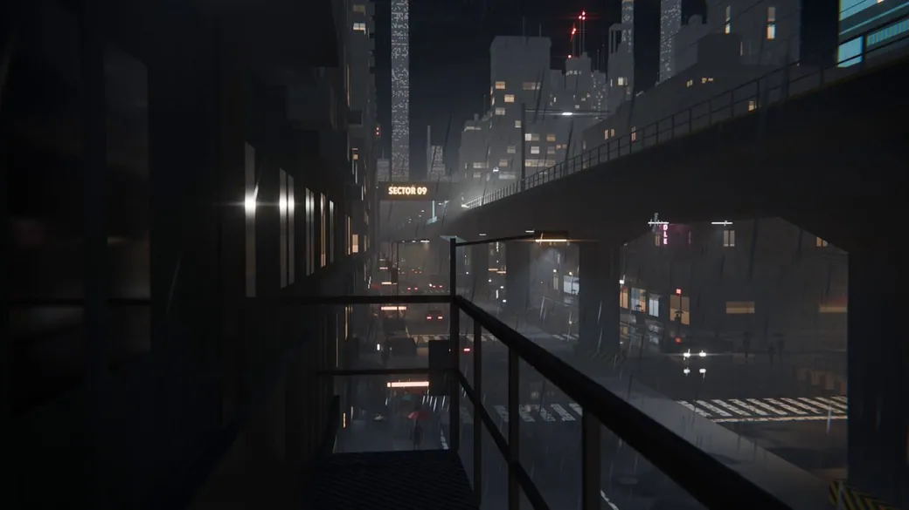</a>

**Промпт**

```text
создай в Blender полноценный киберпанк-мегаполис с поездом-героем, процедурной архитектурой, надземной железнодорожной системой, дождём, объёмной атмосферой, кинематографичным освещением, несколькими вариантами камер и полноценной анимированной сценой.
```

<details>
<summary>Исходный промпт автора</summary>

```text
build a complete cyberpunk megacity inside Blender with a hero train, procedural architecture, elevated rail systems, rain, volumetric atmosphere, cinematic lighting, multiple camera setups, and a full animated sequence.
```

</details>

[Подробнее ↗](https://www.tripo3d.ai/ru/3d-prompts/claude-opus-5-5-2102740078347087940) · [Исходная публикация](https://x.com/builderhelmai/status/2102740078347087940) · [Назад к примерам](#all-prompts)

---

<a id="claude-opus-5-5-2102739444256383089"></a>

### Воксельная футбольная анимация

[Delusionals](https://x.com/AGI_FromWalmart) · 2026-09-23 · Claude Opus 5.5 · Анимация

<a href="https://www.tripo3d.ai/ru/3d-prompts/claude-opus-5-5-2102739444256383089">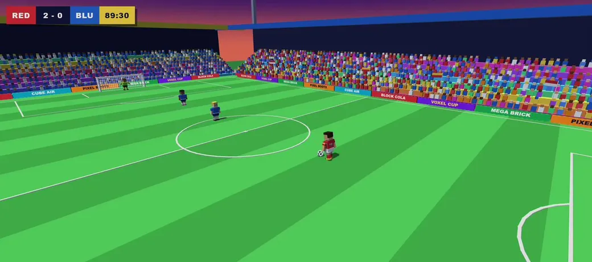</a>

**Промпт**

```text
Создайте один HTML-файл с Three.js (CDN) для простой футбольной анимации в воксельном стиле. Блочный игрок обводит 2 защитников и забивает эффектный гол, после чего появляются праздничные частицы. Красочный вид стадиона. Выведите ТОЛЬКО полный HTML-код.
```

<details>
<summary>Исходный промпт автора</summary>

```text
Create a single HTML file with Three.js (CDN) for a simple voxel-style soccer animation. A blocky player dribbles past 2 defenders and scores a spectacular goal with celebration particles. Colorful stadium look. Output ONLY the full HTML code.
```

</details>

[Подробнее ↗](https://www.tripo3d.ai/ru/3d-prompts/claude-opus-5-5-2102739444256383089) · [Исходная публикация](https://x.com/AGI_FromWalmart/status/2102739444256383089) · [Назад к примерам](#all-prompts)

---

<a id="claude-opus-5-5-2102729710174196022"></a>

### Интерактивный сайт о вымышленных планетах

[Kappaemme](https://x.com/Kappaemme1926) · 2026-09-23 · Claude Opus 5.5 · Интерактив

<a href="https://www.tripo3d.ai/ru/3d-prompts/claude-opus-5-5-2102729710174196022">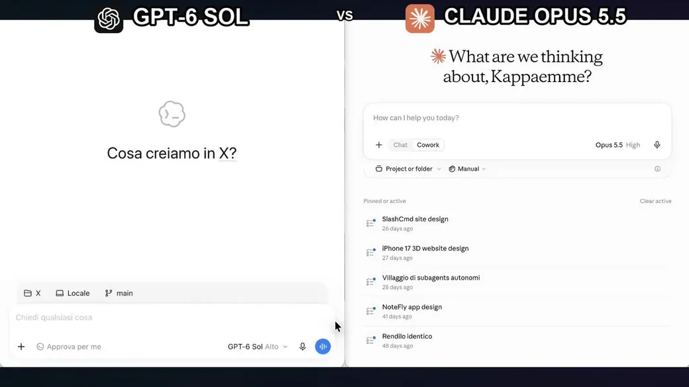</a>

**Промпт**

```text
создай интерактивный сайт о вымышленных планетах.
```

<details>
<summary>Исходный промпт автора</summary>

```text
build an interactive website about imaginary planets.
```

</details>

[Подробнее ↗](https://www.tripo3d.ai/ru/3d-prompts/claude-opus-5-5-2102729710174196022) · [Исходная публикация](https://x.com/Kappaemme1926/status/2102729710174196022) · [Назад к примерам](#all-prompts)

---

<a id="claude-opus-5-5-2102565611473661963"></a>

### Интерактивная эйлерова неоновая симуляция жидкости

[theailoser](https://x.com/theailoser) · 2026-09-23 · Claude Opus 5.5 · Анимация

<a href="https://www.tripo3d.ai/ru/3d-prompts/claude-opus-5-5-2102565611473661963"></a>

**Промпт**

```text
Создайте полный HTML-документ в одном файле, содержащий высокопроизводительную интерактивную эйлерову симуляцию неоновой жидкости с ускорением на GPU.

Строгие технические и визуальные требования:

1. Архитектура и производительность:
   — Один файл: весь HTML, CSS и JavaScript/GLSL-шейдеры должны быть встроены в документ.
   — Ноль внешних зависимостей: только чистый WebGL 1.0 или 2.0 (без Three.js, Pixi и сторонних библиотек).
   — Расчёт гидродинамики на GPU: симуляция должна полностью выполняться через чередующиеся объекты кадрового буфера (FBO) с пользовательскими фрагментными шейдерами для:
     a) Адвекции (скорости и красителя)
     b) Расчёта дивергенции
     c) Решателя уравнения Пуассона для давления (итерации Якоби, 20–30 итераций за кадр)
     d) Вычитания градиента / проекции скорости
     e) Удержания завихренности (добавляет турбулентные вихри и не даёт жидкости превратиться в тусклую размытую массу).

2. Визуальная выразительность (эффект «неонового дыма»):
   — Фон — абсолютно чёрное пространство (`#050508`).
   — Для инъекции красителя используйте аддитивное смешивание и расширенный динамический диапазон.
   — Динамическая палитра: каждое резкое движение курсора или перетаскивание пальцем должно добавлять яркий неоновый краситель, плавно меняющийся между насыщенными киберпанковыми оттенками (электрический циан `#00F0FF`, яркая маджента `#FF007F`, глубокий ультрафиолет и сияющее золото).
   — Улучшения шейдера отображения: добавьте прямо в финальный шейдер рендера постобработку с лёгким свечением/bloom, тональным отображением и хроматической аберрацией по краям закручивающейся жидкости.

3. Взаимодействие:
   — Мышь и сенсорный ввод: быстрое движение курсора или перетаскивание должно добавлять скорость, пропорциональную скорости движения мыши, а также плотный светящийся краситель.
   — Пассивное фоновое движение: в состоянии покоя генерируйте лёгкий процедурный curl noise или плавно дрейфующие вихри, чтобы холст никогда не оставался полностью статичным.
   — Управление: компактный ультраминималистичный стекломорфный HUD, скрытый в углу и автоматически исчезающий при бездействии:
     * Ползунок вязкости
     * Ползунок диссипации / сохранения красителя
     * Ползунок радиуса импульса
     * Кнопка «Очистить холст»
     * Кнопка переключения цветовых тем (Cyberpunk, Thermal Inferno, Bioluminescent Deep).

4. Финальная полировка:
   — Автоматически поддерживайте дисплеи с высокой плотностью пикселей и обрабатывайте события `resize` без растягивания или очистки текстур FBO.
   — Предусмотрите корректную проверку поддержки текстур с плавающей точкой (`OES_texture_float` / `OES_texture_half_float`).
   — Предоставьте чистый, полностью реализованный код без ошибок, заглушек и оборванных комментариев.

Верните только полностью заполненный HTML-файл, готовый к непосредственному запуску в Chrome/Safari/Firefox.
```

<details>
<summary>Исходный промпт автора</summary>

```text
Write a complete, single-file HTML document containing a high-performance, GPU-accelerated interactive Eulerian Neon Fluid Simulation.

Strict Technical & Aesthetic Requirements:

1. Architecture & Performance:
   - Single-file: All HTML, CSS, and JavaScript/GLSL shaders inline.
   - Zero external dependencies: Pure WebGL 1.0 or 2.0 (no Three.js, no Pixi, no external libraries).
   - GPU-Computed Fluid Dynamics: The simulation must run entirely via ping-pong Framebuffer Objects (FBOs) using custom fragment shaders for:
     a) Advection (velocity & dye)
     b) Divergence calculation
     c) Pressure Poisson solver (Jacobi iteration, 20-30 iterations per frame)
     d) Gradient subtraction / velocity projection
     e) Vorticity confinement (adds turbulent swirls and prevents the fluid from turning into dull, blurry mush).

2. Visual Fidelity (The "Neon Smoke" Look):
   - Pitch-black void background (`#050508`).
   - Additive / High-Dynamic-Range blending for dye injection.
   - Dynamic palette: Each cursor flick or touch drag injects high-luminosity neon dye that cycles smoothly through vivid cyber hues (electric cyan `#00F0FF`, hot magenta `#FF007F`, deep ultraviolet, and radiant gold).
   - Display shader enhancements: Include a post-processing pass directly in the final render shader that applies subtle bloom/glow, tone mapping, and chromatic aberration around the swirling edges of the fluid.

3. Interaction:
   - Mouse & Touch: Rapid cursor movement or dragging injects velocity proportional to mouse speed, along with dense glowing dye.
   - Passive Ambient Motion: When idle, generate subtle procedural curl noise or gentle drifting vortices so the canvas is never completely static.
   - Controls: A sleek, ultra-minimal glassmorphism HUD tucked into a corner (with auto-hide on inactivity):
     * Viscosity slider
     * Dye dissipation / persistence slider
     * Splat radius slider
     * "Clear Canvas" button
     * Toggle button to cycle color themes (Cyberpunk, Thermal Inferno, Bioluminescent Deep).

4. Production Polish:
   - Automatically handle high-DPI displays and `resize` events without stretching or clearing the FBO textures.
   - Graceful fallback check for floating-point texture support (`OES_texture_float` / `OES_texture_half_float`).
   - Clean, bug-free, fully implemented code with zero placeholders or truncated comments.

Return only the fully populated HTML file ready to run directly in Chrome/Safari/Firefox.
```

</details>

[Подробнее ↗](https://www.tripo3d.ai/ru/3d-prompts/claude-opus-5-5-2102565611473661963) · [Исходная публикация](https://x.com/theailoser/status/2102565612874596411) · [Назад к примерам](#all-prompts)

---

<a id="claude-opus-5-5-2102565403109085669"></a>

### Интерактивный 3D-ландшафт японской сакурной долины

[宝玉](https://x.com/dotey) · 2026-09-23 · Claude Opus 5.5 · Интерактив

<a href="https://www.tripo3d.ai/ru/3d-prompts/claude-opus-5-5-2102565403109085669"></a>

**Промпт**

```text
Создай полноценную, качественно проработанную веб-страницу с 3D-ландшафтом, с которым можно взаимодействовать в браузере в реальном времени.

Тема: японская сакурная долина.
Используй HTML, CSS и JavaScript. Не создавай изображения и не ограничивайся дизайн-концепцией.
Не выдавай одну фоновую картинку с эффектом параллакса за 3D. Мне нужен реально работающий, пригодный для исследования готовый результат.

【1. Концепция проекта】

Это цельный, непрерывный ландшафт долины с глубиной и планами разной удалённости,
а не набор отдельных небольших объектов, парящий остров, диорама на подставке или просто техническая демонстрация.

Стиль — современный детализированный voxel art:
сохрани выразительный язык кубической геометрии, но сделай изображение высокодетализированным, сглаженным, с тонкой проработкой света и теней.
Не используй ретро-пикселизацию в низком разрешении, крупные грубые нагромождения блоков или пиксельный фильтр поверх изображения.

Визуальное качество важнее всего. Лучше отказаться от нескольких функций, чем жертвовать композицией, материалами и освещением.

【2. Использование референсов】

Если приложены референсы, сначала изучи их композиционные планы, масштаб, освещение и соотношение цветов.
Используй только атмосферу и визуальный язык, а сцену спроектируй заново.
Не копируй расположение зданий, деревьев, гор и дорог и не воспроизводи референс в масштабе 1:1.

Референс не является фоновым материалом для веб-страницы. Сама сцена должна быть построена из настоящей 3D-геометрии.

【3. Композиция сцены】

При открытии страницы сразу показывай цельный, привлекательный кадр,
чтобы пользователю не приходилось сначала вращать камеру в поисках удачного ракурса.

Используй перспективную камеру, а не изометрическую камеру с видом сверху, как в диораме.
В кадре должны быть чётко выражены передний, средний и дальний планы:

Передний план:
выразительное старое дерево сакуры, дополненное камнями, травой, растительностью, каменным фонарём и небольшим количеством опавших лепестков;
они образуют естественное обрамление по краям кадра, но не закрывают реку, мост и основные здания.

Средний план:
извилистая река ведёт взгляд в глубину кадра, а красный деревянный мост перекинут через неё;
деревня, чайный домик, святилище и тропинки распределены по рельефу, между зданиями предусмотрены реалистичные проходы.
Поверхность земли должна быть рельефной, с береговой линией и естественными переходами, а не с равномерно расставленными моделями на плоской поверхности.

Дальний план:
многоярусная пагода на склоне, леса на разном расстоянии, горные хребты и заснеженные вершины вдали.
Передавай расстояние изменением масштаба, перекрытиями, контрастом холодных и тёплых оттенков и воздушной перспективой,
а не простым уменьшением удалённых объектов.

Не заполняй все элементы равномерно. Нужны иерархия, ритм плотных и разреженных зон, свободное пространство и чёткий визуальный фокус.

【4. Форма и качество изображения】

Дерево сакуры:
ствол должен изгибаться, ветвиться и переходить в корни, а крона — состоять из неровных скоплений цветов
с просветами, различной толщиной и видимыми ветвями. Не превращай её в несколько правильных сфер или кубических комков.

Архитектура:
на крышах должны быть уложенные ярусами черепичные ряды, свесы, балки, колонны и переплёты окон;
разные здания должны отличаться назначением, объёмом и высотой — не заполняй долину копиями одного и того же дома.

Рельеф:
у берега добавь влажные камни, травяные заросли и постепенный переход к растительности.
Избегай слишком правильных ступеней, повторяющихся полос, шахматного рисунка и явно заметной процедурной сетки.

Вода:
водная поверхность должна отражать окружающий ландшафт, иметь умеренную рябь, изменения глубины и естественный переход у берегов.
По возможности используй отражения реальной сцены; даже при снижении качества ради производительности вода должна оставаться визуально правдоподобной.
Не заменяй воду мерцающим шумом, сильными искажениями или сплошной синей плоскостью.

Детали:
можно добавить немного карпов кои, опавших лепестков, светлячков, водопадов и птиц вдали,
но все они должны работать на атмосферу и не перегружать кадр.
Не нагромождай детали только ради демонстрации количества моделей.

【5. Цвет и атмосфера】

По умолчанию — режим синего часа:
холодные долина и дальние горы, мягкие розовые цветы сакуры, тёплый, но не пересвеченный свет фонарей и окон.
Тёплый свет должен быть сосредоточен в местах присутствия людей, а не окрашивать всю сцену в оранжевый цвет.

Используй мягкие тени, контактное затенение в местах соприкосновения объектов, корректную экспозицию,
сдержанный bloom, сглаживание и лёгкую туманную дымку с ощутимой глубиной.

Избегай выбеленного изображения, серой дымки, чрезмерной насыщенности, густого тумана на весь экран, пересвеченных источников света и заметных лесенок.
Кубическая геометрия может быть хорошо различима, но сам рендеринг не должен выглядеть грубо.

Добавь также два режима атмосферы — «Утро» и «Дождь»;
при переключении должны одновременно меняться небо, окружающее освещение, туман и локальные эффекты,
а не только цвет фона.

【6. Управление и интерфейс】

Предусмотри четыре продуманных ракурса:
панорама долины, низкая камера у реки, тропа к храму и вид на долину со склона сверху.
Переключение должно быть плавным, а каждый ракурс — иметь самостоятельную композиционную ценность.

Базовое управление:
перетаскивание мышью для осмотра, прокрутка колеса для приближения или движения вперёд; на сенсорных экранах — перетаскивание и масштабирование двумя пальцами.
Добавь сброс ракурса, скрытие интерфейса и сохранение текущего кадра.

Дополнительные возможности:
свободное исследование, медленный пролёт камеры и звуки окружения.
Звуки окружения по умолчанию отключены и включаются только после явного нажатия пользователя.
Дополнительные функции не должны ухудшать качество исходного кадра.

Интерфейс должен быть сдержанным и продуманным, с главным акцентом на ландшафте.
Размести заголовок и панель управления у краёв экрана, чтобы они не закрывали визуальный фокус.
На компьютере и телефоне кнопки не должны выходить за границы, текст не должен перекрываться, а элементы управления должны оставаться работоспособными.

【7. Разработка и производительность】

Разрешается использовать Three.js / WebGL и зафиксированные, совместимые между собой зависимости CDN.
Отдавай приоритет зрелым возможностям рендеринга, не переписывай целиком движок ради «нулевых зависимостей».

По возможности собери собственные HTML, CSS и JavaScript в одном HTML-файле.
Создавай объекты сцены процедурной геометрией и материалами, не используя внешние изображения или ресурсы 3D-моделей.

Для повторяющихся объектов используй подходящий батчинг или инстансинг;
разумно контролируй детализацию, тени, отражения и разрешение рендеринга.
Предусмотри режимы высокого качества и облегчённый режим; на телефонах по умолчанию используй более лёгкие настройки.
Не наращивай бесконечно количество вокселей ради дополнительных деталей.

Добавь индикатор загрузки, сообщение об отсутствии поддержки WebGL и необходимую обработку ошибок.
Не запускай звук автоматически, если он не включён; учитывай системную настройку уменьшения анимации.

【8. Проверка перед сдачей】

Не сдавай результат сразу после написания кода.

Если текущая среда поддерживает запуск браузера и создание скриншотов, сначала открой страницу и проверь
исходный ракурс, все четыре вида, переключение атмосферных режимов, а также компоновку на компьютере и телефоне,
после чего по скриншотам исправь очевидные проблемы композиции, экспозиции, перекрытий и рендеринга.

Особое внимание удели проверке:
нет ли пустого экрана, ошибок загрузки и ошибок в консоли;
нет ли пересечений геометрии, мерцания, полос на тенях, пересветов и проблем с водой;
действительно ли исходный кадр выглядит как цельный ландшафт, а не маленькая диорама;
работают ли кнопки и не выходит ли интерфейс за границы на мобильных устройствах.

Для проверки можно использовать скриншоты из браузера, но не вызывай инструменты генерации изображений.
Если какие-либо тесты не выполнены, честно сообщи об этом и не утверждай, что они пройдены.

Итоговый результат:
1. Фактически существующий HTML-файл, который можно открыть, либо интерактивный предпросмотр, поддерживаемый текущей средой.
2. Если доступно создание скриншотов, приложи один настоящий скриншот рендеринга в браузере.
3. Кратко опиши управление и необходимые условия запуска.

Сразу приступай к созданию; для второстепенных деталей самостоятельно принимай согласованные решения,
не перекладывай на меня снова и снова вопросы реализации, которые можешь решить сам.
```

<details>
<summary>Исходный промпт автора</summary>

```text
请直接制作一个可以在浏览器中实时交互的高完成度 3D 景观网页。

主题：日式樱花山谷。
使用 HTML、CSS、JavaScript 实现。不要生成图片，不要只给设计方案，
不要用一张背景图加视差效果冒充 3D。我要的是实际可运行、可游览的成品。

【一、作品定位】

这是一片完整、连续、有远近层次的山谷景观，
不是孤立的小摆件、悬浮岛、带底座的沙盘，也不是单纯的技术演示。

风格是现代精细体素 / voxel art：
保留立方体几何的造型语言，但画面应高分辨率、抗锯齿、光影细腻。
不要复古低分辨率像素化，不要粗大积木堆砌，不要给画面套像素滤镜。

视觉质量优先。宁可少几个功能，也不要牺牲构图、材质和光照。

【二、参考图的使用方式】

如果附有参考图，请先理解它的构图层次、尺度、光线和色彩关系。
仅借鉴氛围与视觉语言，重新设计场景，
不要照搬建筑、树木、山体和道路的位置，不要 1:1 复刻。

参考图不是网页里的背景素材。场景本身必须由真实 3D 几何构成。

【三、场景构图】

默认打开时就应呈现一幅完整、有吸引力的画面，
不需要用户先旋转镜头才能找到好看的角度。

采用透视相机，而不是沙盘式等距俯视相机。
画面有明确的前景、中景、远景：

前景：
一株有存在感的古老樱花树，配合岩石、草木、石灯笼和少量落花，
形成画面边缘的自然框景，但不能挡住河流、桥和主要建筑。

中景：
一条蜿蜒河流引导视线进入画面，红色木桥横跨河面；
村落、茶屋、神社和小径顺着地势分布，建筑之间有真实的通行关系。
地面有起伏、岸线和自然过渡，不是平面上均匀摆放模型。

远景：
山坡上的多层塔、不同距离的森林和山脊，以及远处的雪山。
用尺度变化、遮挡、冷暖变化和空气透视表现距离，
而不是仅仅把远处物体缩小。

不要把所有元素均匀铺满。需要主次、疏密、留白和清楚的视觉焦点。

【四、造型与画面质量】

樱花树：
树干有转折、分叉和根部，树冠由不规则花簇组成，
有间隙、厚薄变化和可见枝条。不要做成几个规则球体或方块团。

建筑：
屋顶有层叠瓦片、挑檐、梁柱和窗格；
不同建筑有用途、体量和高度差异，不要复制同一栋房子铺满山谷。

地形：
岸边有湿润石块、草丛和植被过渡。
避免过于规律的台阶、重复条纹、棋盘格和明显的程序生成网格。

水面：
必须能够反映周围景物，具有适度的波纹、深浅变化和岸边过渡。
尽量使用实际场景反射；需要性能降级时也应保持视觉可信。
不要用闪烁噪声、强烈扭曲或一整块蓝色平面代替水。

细节：
可以有少量锦鲤、落花、萤火虫、瀑布和远处飞鸟，
但都应服务于氛围，不能让画面显得嘈杂。
不要为了宣称模型数量而堆砌细节。

【五、色彩与氛围】

默认是蓝调时刻：
偏冷的山谷与远山，柔和的粉色樱花，温暖但不过曝的灯笼和窗光。
暖光集中在有人活动的地方，不要把整个环境染成橙色。

需要柔和阴影、物体接触处的明暗、合理的曝光、
克制的泛光、抗锯齿和有距离层次的薄雾。

避免发白、灰蒙、过度饱和、满屏浓雾、过曝灯光和明显锯齿。
方块几何可以清晰，但渲染本身不能粗糙。

另提供“清晨”和“雨中”两种氛围；
切换时应同步改变天空、环境光、雾和局部效果，
不是仅仅修改背景颜色。

【六、交互与界面】

提供四个经过设计的镜头：
山谷全景、河边低机位、寺庙小径、山坡俯瞰。
切换应平滑，每个镜头都需要有独立的构图价值。

基础交互：
鼠标拖动观察、滚轮缩放或前进，触屏支持拖动和双指缩放。
提供重置视角、隐藏界面和保存当前画面的功能。

可选增强：
自由探索、缓慢镜头巡游、环境音。
环境音默认关闭，只在用户主动点击后播放。
额外功能不能影响默认画面的完成度。

界面要克制、有设计感，以景观为主。
标题和控制条放在边缘，不遮挡视觉焦点。
桌面和手机都不能出现按钮越界、文字重叠或无法操作的问题。

【七、工程与性能】

允许使用 Three.js / WebGL，以及版本固定、互相兼容的 CDN 依赖。
优先使用成熟渲染能力，不要为了“零依赖”重写整套引擎。

自写的 HTML、CSS、JavaScript 尽量整理在一个 HTML 文件中。
景物由程序化几何和材质生成，不依赖外部图片或 3D 模型资源。

重复物体采用适合的批量或实例化绘制方式；
合理控制细分、阴影、反射和渲染分辨率。
提供高画质和轻量模式，手机默认使用较轻设置。
不要靠无限增加体素数量换取细节。

加入加载提示、WebGL 不支持时的提示和必要的错误处理。
没有开启声音时不要自动播放；尊重减少动态效果的系统偏好。

【八、交付前验收】

不要写完代码就立即交付。

如果当前环境支持浏览器运行和截图，请先实际打开页面，
检查默认镜头、四个视角、氛围切换、桌面和手机布局，
再根据截图修正明显的构图、曝光、遮挡和渲染问题。

重点检查：
是否存在空白画面、加载失败、控制台错误；
是否有穿模、闪烁、阴影条纹、过曝、水面异常；
默认画面是否真正像完整景观，而不是小型沙盘；
功能按钮是否实际可用，移动端是否越界。

可以使用浏览器截图验收，但不要调用图像生成工具。
没有完成的测试要如实说明，不要声称已经验证。

最终交付：
1. 实际存在、可以打开的 HTML 文件，或当前环境支持的交互预览。
2. 如能截图，附一张真实浏览器渲染截图。
3. 简短说明操作方式和必要的运行条件。

请直接完成制作；非关键细节自行作出一致的设计选择，
不要把可以自行解决的实现问题反复交给我决定。
```

</details>

[Подробнее ↗](https://www.tripo3d.ai/ru/3d-prompts/claude-opus-5-5-2102565403109085669) · [Исходная публикация](https://x.com/dotey/status/2102565403109085669) · [Назад к примерам](#all-prompts)

---

<a id="claude-opus-5-5-2102547809140355250"></a>

### Модель аварии Hundenberg и реалистичное видео

[AImanhasnoname](https://x.com/aimanhasnoname) · 2026-09-22 · Claude Opus 5.5 · Анимация

<a href="https://www.tripo3d.ai/ru/3d-prompts/claude-opus-5-5-2102547809140355250"></a>

**Промпт**

```text
Создай для меня модель Hundenberg в Blender и реалистичное видео аварии.
```

<details>
<summary>Исходный промпт автора</summary>

```text
make me a model of the Hundenberg on blender make me a realistic video of the accident.
```

</details>

[Подробнее ↗](https://www.tripo3d.ai/ru/3d-prompts/claude-opus-5-5-2102547809140355250) · [Исходная публикация](https://x.com/aimanhasnoname/status/2102547809140355250) · [Назад к примерам](#all-prompts)

---

<a id="claude-opus-5-5-2102544406117286004"></a>

### 360-градусный 3D-рендеринг гандбольной площадки по изображению

[ハンドボール人「布施千佳純」](https://x.com/chikaidev) · 2026-09-22 · Claude Opus 5.5 · Сцены

<a href="https://www.tripo3d.ai/ru/3d-prompts/claude-opus-5-5-2102544406117286004"></a>

**Референсы:** [1](https://media.tripogrowth.space/media/6a116b62-88ce-491b-b4ba-eed6d9c9f168.jpg) · [2](https://pbs.twimg.com/media/HS29xCPaYAAcMmd.jpg)

**Промпт**

```text
Отрендери в 3D изображённые на картинке гандбольную площадку, ворота, судью, игроков и мяч, чтобы сцену можно было свободно рассматривать под любым углом на все 360 градусов. Точно воспроизведи позы каждого человека и цвета всех объектов.
```

<details>
<summary>Исходный промпт автора</summary>

```text
画像内のハンドボールコート、ゴール、レフェリー、プレイヤー、ボールを3dレンダリングして、360度自由角度から見れるようにして。各人物の姿勢まで、また物体の色まで正確に再現して。
```

</details>

[Подробнее ↗](https://www.tripo3d.ai/ru/3d-prompts/claude-opus-5-5-2102544406117286004) · [Исходная публикация](https://x.com/chikaidev/status/2102545257372213581) · [Назад к примерам](#all-prompts)

---

<a id="claude-opus-5-5-2102544196808667471"></a>

### Процедурный 3D-фон главного меню в Three.js по изображению

[Majid Manzarpour](https://x.com/majidmanzarpour) · 2026-09-22 · Claude Opus 5.5 · Сцены

<a href="https://www.tripo3d.ai/ru/3d-prompts/claude-opus-5-5-2102544196808667471"></a>

**Референсы:** [1](https://media.tripogrowth.space/media/de4534b1-fda8-4736-8558-09b7283f646a.jpg) · [2](https://pbs.twimg.com/media/HS28q6mWMAAxONB.jpg)

**Промпт**

```text
идеально воссоздай этот полностью процедурный анимированный 3D-фон главного меню в Three.js в одном HTML-файле
```

<details>
<summary>Исходный промпт автора</summary>

```text
recreate this perfectly, fully procedural, animated, main menu background in three.js 3D single HTML file
```

</details>

[Подробнее ↗](https://www.tripo3d.ai/ru/3d-prompts/claude-opus-5-5-2102544196808667471) · [Исходная публикация](https://x.com/majidmanzarpour/status/2102544198335373576) · [Назад к примерам](#all-prompts)

---

<a id="claude-opus-5-5-2102544078927741369"></a>

### Самозапускающаяся 3D-машина Руба Голдберга

[leo](https://x.com/leogao25) · 2026-09-22 · Claude Opus 5.5 · Анимация

<a href="https://www.tripo3d.ai/ru/3d-prompts/claude-opus-5-5-2102544078927741369"></a>

**Промпт**

```text
Создай самозапускающуюся 3D-машину Руба Голдберга в виде одного автономного файла index.html в текущем каталоге.

Цепочка должна работать в следующем порядке:
1. В верхней точке отпускается шарик, который скатывается по нескольким зигзагообразным рампам.
2. Он опрокидывает ряд из как минимум 12 домино.
3. Последняя костяшка домино наклоняет качели, которые запускают небольшой шарик в подвесное ведро.
4. Под весом ведро опускается; его верёвка проходит через блок и дёргает колокол, который должен заметно раскачиваться.
5. Это же движение поднимает флаг по флагштоку. Завершением служит момент, когда флаг достигает вершины.

Правила:
- Напиши физику самостоятельно, без физических библиотек. Всякое движение после запуска шарика должно происходить благодаря твоей симуляции: твёрдые тела, столкновения, ограничения, верёвка и блок. Никакой заранее заданной покадровой анимации или интерполированного движения деталей машины.
- Для рендеринга можно загрузить three.js из CDN. Ничего другого извне использовать нельзя: никаких изображений, моделей или шрифтов.
- Всё должно работать без участия пользователя: автоматически запускаться при загрузке страницы, использовать кинематографичную камеру, следующую за действием, и полностью проходить всю цепочку примерно за 15–20 секунд. После подъёма флага выжди 2 секунды, затем сбрось состояние и запусти воспроизведение заново.
- Детерминированность: используй фиксированный шаг по времени и неинициализированную случайность не применяй, чтобы каждый запуск выглядел одинаково.
- Заполняй всё окно браузера. Запись экрана будет выполняться в разрешении 1280×720.
- Никакого текста на экране и интерфейса любого вида.
- Сделай сцену привлекательной: используй освещение, тени, материалы и окружение, чтобы конструкция выглядела как настоящий механизм.
```

<details>
<summary>Исходный промпт автора</summary>

```text
Build a 3D Rube Goldberg machine that runs itself, as a single self-contained index.html in the current directory.

The chain, in order:
1. A marble is released at the top and rolls down a series of zig-zag ramps.
2. It knocks over a line of at least 12 dominoes.
3. The last domino tips a seesaw, which launches a small ball into a hanging bucket.
4. The bucket's weight pulls it down; its rope runs over a pulley and yanks a bell, which visibly swings.
5. The same motion raises a flag up a pole. The flag reaching the top is the finish.

Rules:
- Write the physics yourself: no physics library. Every motion after the marble is released must come from your simulation (rigid bodies, collisions, constraints, rope/pulley). No keyframed animation or tweened motion of any machine part.
- You may load three.js from a CDN for rendering. Nothing else external: no images, models, or fonts.
- It must run with no user input: start automatically on page load, use a cinematic camera that follows the action, and complete the whole chain in about 15–20 seconds. After the flag is up, hold for 2 seconds, then reset and replay.
- Deterministic: fixed timestep and no unseeded randomness, so every run looks the same.
- Fill the browser window. It will be screen-recorded at 1280×720.
- No on-screen text or UI of any kind.
- Make it look good: lighting, shadows, materials, and a setting that makes it feel like a real contraption.
```

</details>

[Подробнее ↗](https://www.tripo3d.ai/ru/3d-prompts/claude-opus-5-5-2102544078927741369) · [Исходная публикация](https://x.com/leogao25/status/2102544081863717153) · [Назад к примерам](#all-prompts)

---

<a id="claude-opus-5-5-2102538762731565085"></a>

### Интерактивная игра о фермерских животных в стиле «Питера Кролика»

[mblaso](https://x.com/blaso96) · 2026-09-22 · Claude Opus 5.5 · Игры

<a href="https://www.tripo3d.ai/ru/3d-prompts/claude-opus-5-5-2102538762731565085">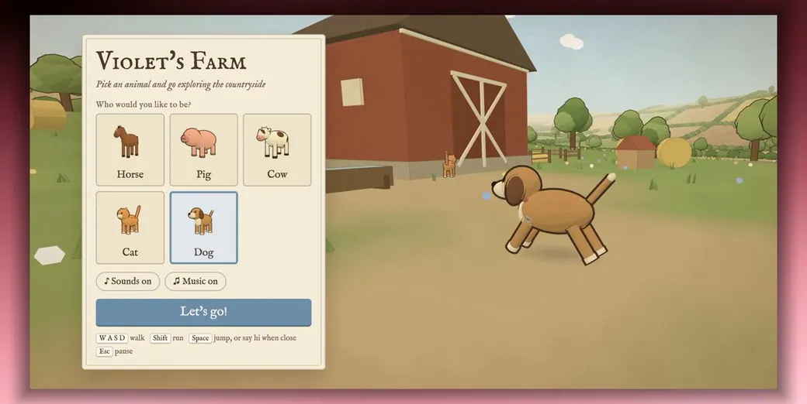</a>

**Промпт**

```text
"Создай интерактивную игру о фермерских животных в стиле «Питера Кролика»
главное меню = звуки вкл./выкл. + выбор животного (лошадь, свинья, корова, кошка, собака)
Esc = пауза: сброс до точки появления/возврат в главное меню/
перемещение с помощью WASD
пробел — прыжок и взаимодействие с другими животными, когда они находятся рядом
взаимодействия случайно выбираются при обнаружении близости
взаимодействия могут включать звуки в адрес другого животного (уникальные, отличающиеся от его пассивных звуков), «потыкать его носом»
можно взаимодействовать с водой, чтобы попить, сеном, чтобы поесть, и фруктами, чтобы поесть. 
вид от третьего лица, камера расположена немного позади животного и выше него
живые элементы окружения: птицы и самолёты в небе (появляются случайным образом)
место действия = фермерские угодья, амбар, фермерская деревня с домами (в дома нельзя войти)
Добавь достаточно ассетов, чтобы игра привлекала внимание, но не настолько много, чтобы она требовала производственного качества: это всего лишь способ провести 15 минут с дочерью и весело провести время
react, svg, js, webgl, threejs — используй всё необходимое, чтобы игра ощущалась «хорошо»"
```

<details>
<summary>Исходный промпт автора</summary>

```text
"Create a interactive farm animal game using the design/art style of "Peter Rabbit"
main menu = sounds on/off + animal picker (horse, pig, cow, cat, dog)
esc = pause: reset back to spawn/main menu/
wasd to move around
spacebar to jump and to interact with other animals when near
interactions are randomized upon proximity detection
interactions can be make sounds at the other animal (unique from their passive sounds) "boop them"
interactible with: water to drink, hay to eat, fruit to eat. 
3rd person but as if the camera was slightly behind the animal and above it
ambience animals are birds, airplanes in the sky (randomly)
setting= farmland, barn, farming village with houses (cant enter houses)
Enough assets to capture attention, but not enough that it needs to be deemed production grade, this is just to capture 15 minutes out of my day with my daughter and have fun
react, svg, js, webgl, threejs, whatever is necessary to make it feel "good""
```

</details>

[Подробнее ↗](https://www.tripo3d.ai/ru/3d-prompts/claude-opus-5-5-2102538762731565085) · [Исходная публикация](https://x.com/blaso96/status/2102538764749037738) · [Назад к примерам](#all-prompts)

---

<a id="claude-opus-5-5-2102533729746882985"></a>

### Кинематографичный интерактивный пиратский корабль на закате

[Vib3Coded](https://x.com/vib3coded) · 2026-09-22 · Claude Opus 5.5 · Сцены

<a href="https://www.tripo3d.ai/ru/3d-prompts/claude-opus-5-5-2102533729746882985">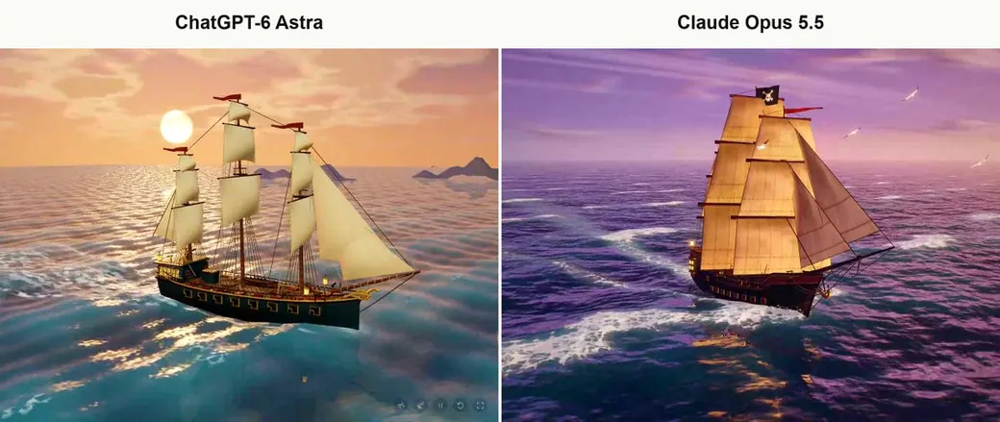</a>

**Промпт**

```text
Создай с нуля полностью интерактивную 3D-сцену с пиратским кораблём, который плывёт по динамичному океану на закате. Визуальный стиль должен быть кинематографичным и стилизованным, а не фотореалистичным, но при этом исключительно насыщенным, детализированным, отполированным и визуально продуманным. Создай корабль, океан, небо, освещение, материалы, паруса, такелаж, пушки, мелкие конструктивные детали, морскую пену, кильватерный след, частицы, анимацию, работу камеры, композицию, атмосферную перспективу и цветокоррекцию. Итог должен выглядеть как премиальная 3D-работа высокого production-уровня, а не прототип, техническая демонстрация или низкокачественная сцена. Начни с полностью пустой страницы. Не переиспользуй предыдущий проект или сцену и не опирайся на них. При необходимости можешь самостоятельно создать ассеты либо использовать надёжные проверенные ассеты и библиотеки с открытым исходным кодом. Обязательные требования: внутри сцены нигде не должно появляться никаких текстов. Запрещены заголовки, имена, логотипы, описания, титры, подписи и инструкции по управлению на любом языке. Представь весь проект в виде одного итогового автономного файла страницы, который можно напрямую открыть в веб-браузере; по возможности размести ассеты внутри него. Океан, корабль, паруса и камера должны двигаться естественно и плавно. Избегай искусственного замедленного режима и вялого движения. Должно ощущаться, что корабль действительно движется по воде. Не используй примитивные геометрические формы в качестве готового результата. Создай визуально убедительный детализированный пиратский корабль с тщательно сформированным корпусом, мачтами, парусами, такелажем, канатами, пушками, поручнями, фонарями, надпалубными конструкциями и хорошо заметными мелкими деталями. Освещение должно чётко раскрывать геометрию и материалы корабля. Создай насыщенную атмосферу заката, глубокие оттенки океана, отражения, убедительную морскую пену и детализированный кильватерный след позади судна и вокруг него. Соблюдай баланс между визуальным качеством и производительностью в реальном времени: сохрани плавное взаимодействие и анимацию, не допуская явного ухудшения качества. Автоматически используй наиболее подходящие навыки, инструменты, библиотеки, методы и доступные ассеты, необходимые для достижения наилучшего результата. Не жди, пока я укажу, какие технологии использовать. Обязательно протестируй готовый результат в веб-браузере на компьютере. Сделай визуальные скриншоты, проверь консоль браузера на наличие ошибок и исправь все обнаруженные визуальные и технические проблемы, включая искажённую геометрию, чёрный экран, ошибки загрузки ассетов, неработающую анимацию, неудачную композицию, артефакты рендеринга и проблемы с камерой. В конце убедись, что итоговый файл открывается и работает напрямую, в сцене вообще нет текста и не осталось ошибок выполнения или загрузки. После этого заверши задачу только кратким ответом.
```

<details>
<summary>Исходный промпт автора</summary>

```text
Create from scratch a fully interactive 3D scene of a pirate ship sailing across a dynamic ocean at sunset. The visual style should be cinematic and stylized rather than photorealistic, while still being exceptionally rich, detailed, polished, and visually sophisticated. Build the ship, ocean, sky, lighting, materials, sails, rigging, cannons, small structural details, sea foam, wake, particles, animation, camera work, composition, atmospheric depth, and color grading. The final result should feel like a premium, high-production 3D artwork, not a prototype, technical demo, or low-quality scene. Start from a completely blank page. Do not reuse or depend on any previous project or scene. You may create the assets yourself or use reliable, trusted, open-source assets and libraries when necessary. Mandatory requirements: No text of any kind may appear anywhere inside the scene. No titles, names, logos, descriptions, credits, labels, or control instructions in any language. Deliver the entire project as one final standalone page file that can be opened directly in a web browser, with assets embedded inside it as much as reasonably possible. The ocean, ship, sails, and camera must all be animated naturally and smoothly. Avoid artificial slow motion or sluggish movement. The ship should feel like it is genuinely moving through the water. Do not rely on primitive geometric shapes as the finished result. Build a visually convincing and detailed pirate ship, including a carefully shaped hull, masts, sails, rigging, ropes, cannons, railings, lanterns, deck structures, and clearly visible small-scale details. Lighting must reveal the ship's geometry and materials clearly. Create a rich sunset atmosphere, deep ocean shading, reflections, convincing sea foam, and a detailed sailing wake behind and around the vessel. Maintain a strong balance between visual quality and real-time performance, preserving smooth interaction and animation without making an obvious sacrifice in quality. Automatically use the most appropriate skills, tools, libraries, techniques, and available assets needed to achieve the best result. Do not wait for me to specify which technologies to use. Actually test the finished result in a desktop web browser. Capture visual screenshots, inspect the browser console for errors, and fix every visible or technical issue you find, including distorted geometry, black screens, failed asset loading, broken animation, poor composition, rendering artifacts, or camera problems. At the end, verify that the final file opens and works directly, that the scene contains no text whatsoever, and that there are no remaining runtime or loading errors. Then finish the task with only a brief response.
```

</details>

[Подробнее ↗](https://www.tripo3d.ai/ru/3d-prompts/claude-opus-5-5-2102533729746882985) · [Исходная публикация](https://x.com/vib3coded/status/2102534606121746589) · [Назад к примерам](#all-prompts)

---

<a id="claude-opus-5-5-2102529695908806728"></a>

### Бесконечный процедурно генерируемый мир на Three.js

[🥔🥔🥔](https://x.com/argofowl) · 2026-09-22 · Claude Opus 5.5 · Игры

<a href="https://www.tripo3d.ai/ru/3d-prompts/claude-opus-5-5-2102529695908806728"></a>

**Промпт**

```text
создай в папке моих проектов новый проект под названием "endless-game": бесконечный процедурно генерируемый мир на Three.js, работающий в браузере, который я смогу свободно исследовать и просто получать удовольствие от игры. Каждая область должна генерироваться случайным образом, а неожиданные находки должны встречаться повсюду, сколько бы я ни играл. Атмосфера должна быть спокойной, расслабляющей и по-настоящему увлекательной — с уютным и приятным ощущением, как в симуляторе супермаркета, но это не должна быть игра про супермаркет. Я хочу действительно интересный мир для прогулок, с сущностями, которых можно встретить и с которыми можно взаимодействовать, а также с очень эффектной графикой. Определи для проекта чёткую цель и продолжай работу, пока не достигнешь её. Когда проект будет готов для запуска, игры и тестирования, воспроизведи звуковой сигнал.
```

<details>
<summary>Исходный промпт автора</summary>

```text
create a new project in my projects folder called "endless-game": an endless, procedurally generated world built with three.js in the browser that i can roam freely and just enjoy. every area should be randomly generated, with surprises everywhere no matter how long i play. it should feel calm, relaxing and genuinely fun, like the cozy, satisfying vibe of a supermarket simulator, but it shouldn't be a supermarket game. i want a really interesting world to walk around in, with entities i can meet and interact with, and really cool graphics. set a clear goal for the project, keep working until you reach it, and play a sound chime when it's done and ready for me to play and test.
```

</details>

[Подробнее ↗](https://www.tripo3d.ai/ru/3d-prompts/claude-opus-5-5-2102529695908806728) · [Исходная публикация](https://x.com/argofowl/status/2102529695908806728) · [Назад к примерам](#all-prompts)

---

<a id="claude-opus-5-5-2102467667978572092"></a>

### Интерактивная симуляция эвакуации толпы

[Dom](https://x.com/dominikmartn) · 2026-09-22 · Claude Opus 5.5 · Анимация

<a href="https://www.tripo3d.ai/ru/3d-prompts/claude-opus-5-5-2102467667978572092"></a>

**Промпт**

```text
создай интерактивную симуляцию эвакуации толпы и покажи, где образуются заторы
```

<details>
<summary>Исходный промпт автора</summary>

```text
build an interactive crowd evacuation sim and see where it jams
```

</details>

[Подробнее ↗](https://www.tripo3d.ai/ru/3d-prompts/claude-opus-5-5-2102467667978572092) · [Исходная публикация](https://x.com/dominikmartn/status/2102467667978572092) · [Назад к примерам](#all-prompts)

---


[Полный каталог](catalog.ru.md) · **1 / 2** · [→](catalog.ru.2.md)

<p align="center"><strong><a href="https://www.tripo3d.ai/ru/3d-prompts/models/claude-opus-5-5?utm_source=github&amp;utm_medium=referral&amp;utm_campaign=awesome_opus_5_5_prompts&amp;utm_content=catalog_footer">Полный каталог →</a></strong></p>
