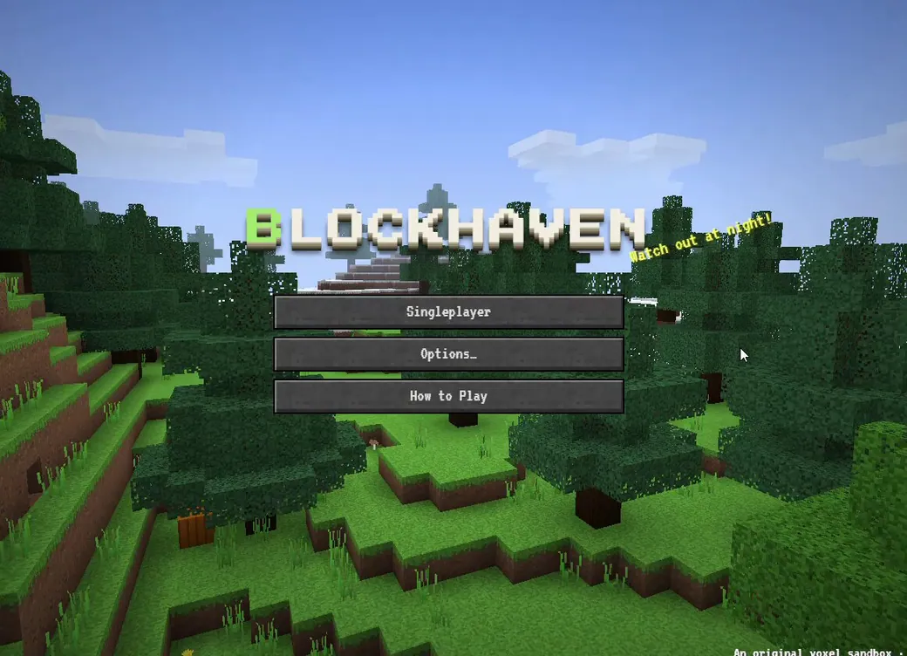
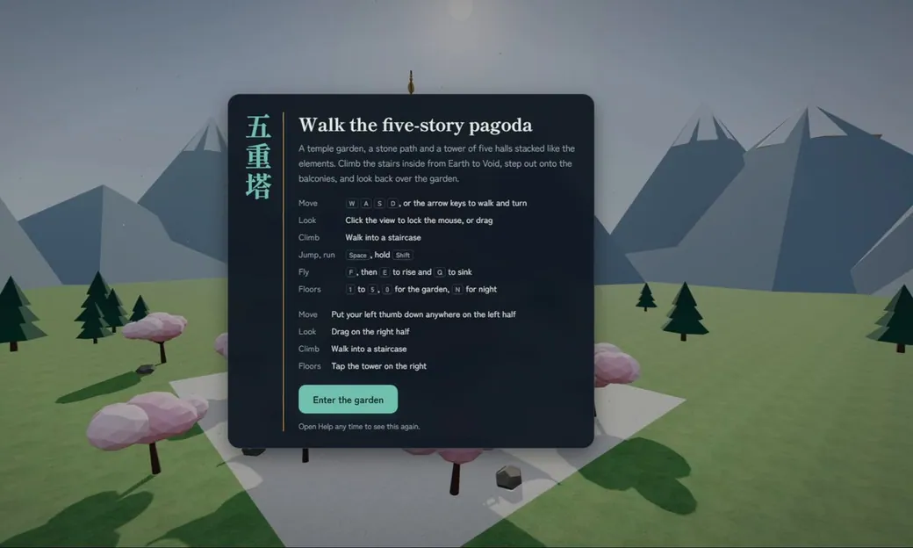
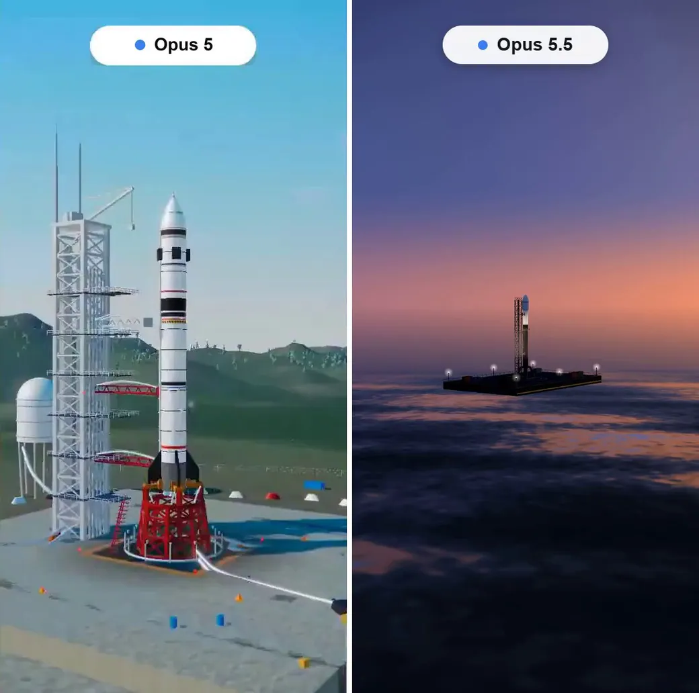
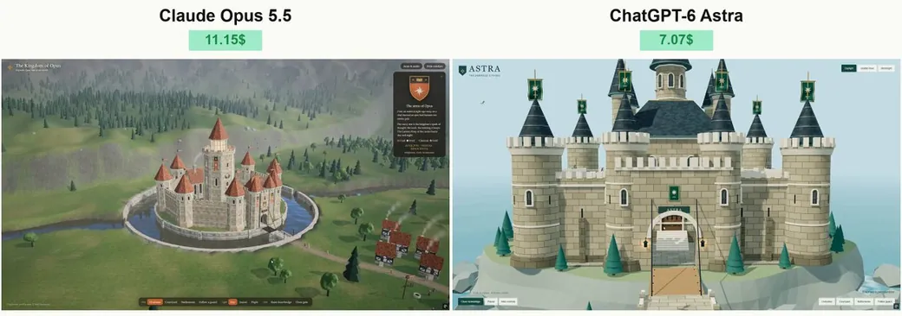

<!-- Generated from Growth CMS by templates/catalog.md. Edit content in CMS; run npm run sync. -->

# Awesome Opus 5.5 Prompts — 1 / 1

[← Awesome Opus 5.5 Prompts](../README.md)

<p>
  <a href="../docs/catalog.en.1.md"></a>
  <a href="../docs/catalog.zh.1.md"></a>
  <a href="../docs/catalog.zh-Hant.1.md"></a>
  <a href="../docs/catalog.ja.1.md"></a>
  <a href="../docs/catalog.ko.1.md"></a>
  <a href="../docs/catalog.es.1.md"></a>
  <a href="../docs/catalog.pt.1.md"></a>
  <a href="../docs/catalog.de.1.md"></a>
  <a href="../docs/catalog.fr.1.md"></a>
  <a href="../docs/catalog.it.1.md"></a>
  <a href="../docs/catalog.ru.1.md"></a>
  <a href="../docs/catalog.tr.1.md"></a>
  <a href="../docs/catalog.uk.1.md"></a>
  <a href="../docs/catalog.vi.1.md"></a>
</p>

[Повний каталог](catalog.uk.md) · **1 / 1**

<a id="all-prompts"></a>

<details>
<summary>Переглянути приклади (33)</summary>

- [Динамічний 15-секундний шоуріл із моушн-дизайну](#claude-opus-5-5-2103504887439065439)
- [WebGL2-гра у жанрі «пісочниця» на виживання](#claude-opus-5-5-2103502454750920925)
- [Навігація 3D-пагодою](#claude-opus-5-5-2103483174957597035)
- [Вільне дослідження 3D-містечка з сакурами в аніме-стилі](#claude-opus-5-5-2103480081809346597)
- [Моушн-графічна анімація «Життєвий цикл»](#claude-opus-5-5-2103428454355980558)
- [Інтерактивна 3D-послідовність запуску ракети над океаном](#claude-opus-5-5-2103303303358534021)
- [Інтерактивне середньовічне королівство для Claude Opus 5.5](#claude-opus-5-5-2103257687492374597)
- [Простір: короткометражне відео собору, наповненого світлом вітражів](#claude-opus-5-5-2103145567945986461)
- [Гра в стилі Genshin Impact у Сан-Франциско](#claude-opus-5-5-2103144530157687114)
- [Кінематографічний фільм про битву під Аустерліцем](#claude-opus-5-5-2103116235009347650)
- [Створіть Ейфелеву вежу в Three.js](#claude-opus-5-5-2103106070549757960)
- [Анімація рівня Pixar у Three.js для Grid Genius](#claude-opus-5-5-2103087766662009118)
- [Гра про пелікана-велосипедиста в реальному часі](#claude-opus-5-5-2103083781490176212)
- [Створіть імперське місто](#claude-opus-5-5-2103046279253168554)
- [Створіть Bugatti Chiron Super Sport у Three.js](#claude-opus-5-5-2102828216289566725)
- [Тренувальний монтаж розвитку Claude](#claude-opus-5-5-2102788371114246177)
- [Створіть мультфільм у стилі 90-х рівня Pixar за допомогою Three.js](#claude-opus-5-5-2102788223835463902)
- [Безшовна анімація кругообігу води, створена кодом](#claude-opus-5-5-2102781807179735211)
- [CatWalk: 3D-гра про кота, який мчить нічним містом у сайд-скролері](#claude-opus-5-5-2102775461701091531)
- [Бенчмарк кіберпанкового мегаполіса «Останній потяг»](#claude-opus-5-5-2102740078347087940)
- [Воксельна футбольна анімація](#claude-opus-5-5-2102739444256383089)
- [Інтерактивний вебсайт про вигадані планети](#claude-opus-5-5-2102729710174196022)
- [Інтерактивна ейлерова симуляція неонової рідини](#claude-opus-5-5-2102565611473661963)
- [Інтерактивний 3D-ландшафт японської сакурової долини](#claude-opus-5-5-2102565403109085669)
- [Модель аварії Hundenberg і реалістичне відео](#claude-opus-5-5-2102547809140355250)
- [3D-рендеринг гандбольного майданчика на 360° за зображенням](#claude-opus-5-5-2102544406117286004)
- [Процедурний 3D-фон головного меню в Three.js за зображенням](#claude-opus-5-5-2102544196808667471)
- [Автономна 3D-машина Руба Ґолдберґа](#claude-opus-5-5-2102544078927741369)
- [Інтерактивна гра про фермерських тварин у стилі «Кролика Пітера»](#claude-opus-5-5-2102538762731565085)
- [Кінематографічний інтерактивний піратський корабель на заході сонця](#claude-opus-5-5-2102533729746882985)
- [Нескінченний процедурно згенерований світ на Three.js](#claude-opus-5-5-2102529695908806728)
- [Інтерактивна симуляція евакуації натовпу](#claude-opus-5-5-2102467667978572092)
- [Інтерактивний 3D-острів доісторичної епохи](#claude-opus-5-5-2102450239923720440)

</details>
<a id="claude-opus-5-5-2103504887439065439"></a>

### Динамічний 15-секундний шоуріл із моушн-дизайну

[ajith\_io](https://x.com/ajith_io) · 2026-09-25 · Claude Opus 5.5 · Анімація

<a href="https://www.tripo3d.ai/uk/3d-prompts/claude-opus-5-5-2103504887439065439"></a>

**Промпт**

```text
створи динамічне 15-секундне відео з моушн-графікою, яке продемонструє, наскільки ти неймовірний моушн-дизайнер — наче це твій шоуріл для резюме. Викладайся на повну.
```

<details>
<summary>Оригінальний промпт автора</summary>

```text
make a dynamic 15-second motion graphics video that shows what an incredible motion designer you are, like it's your showreel for a résumé. go all out.
```

</details>

[Докладніше ↗](https://www.tripo3d.ai/uk/3d-prompts/claude-opus-5-5-2103504887439065439) · [Оригінальний допис](https://x.com/ajith_io/status/2103449416325890146) · [Назад до прикладів](#all-prompts)

---

<a id="claude-opus-5-5-2103502454750920925"></a>

### WebGL2-гра у жанрі «пісочниця» на виживання

[kepo](https://x.com/kepochnik) · 2026-09-25 · Claude Opus 5.5 · Ігри

<a href="https://www.tripo3d.ai/uk/3d-prompts/claude-opus-5-5-2103502454750920925"></a>

**Промпт**

```text
Створіть браузерну гру-пісочницю в дусі Minecraft, яка буде максимально схожою на оригінал. Увесь внутрішньоігровий текст — англійською. Керування: клавіатура та миша (настільний комп’ютер).

ТЕХНІЧНІ ВИМОГИ
- Один HTML-файл, чистий WebGL2, без сторонніх бібліотек.
- Усі текстури 16×16 генеруються в коді як піксель-арт (камінь, земля, трава, дошки, листя, руди, скло, вода, лава тощо).
- Звуки синтезуються за допомогою WebAudio: копання, кроки, встановлення блоків, отримання шкоди, моби, вибухи, спокійна фонова музика.

СВІТ
- Нескінченний світ із чанків розміром 16×16×128, із заданим seed.
- Біоми: рівнини, ліс, березовий ліс, тайга, сніжна тундра, пустеля, гори, океани, пляжі.
- Печери (звивисті тунелі та великі підземні порожнини), лава на нижніх рівнях, руди залежно від глибини: вугілля, залізо, золото, алмази.
- Три типи дерев, висока трава, квіти, кактуси, цукрова тростина, гарбузи.
- Освітлення в стилі Minecraft: світло неба та світло блоків (смолоскипи, світлокамінь, лава), що поширюються клітинка за клітинкою, із плавним освітленням і затіненням навколишнього середовища.
- Цикл дня і ночі: сонце, місяць, зорі, заходи сонця, тривимірні хмари, туман на відстані, дощ.
- Вода й лава течуть рівнями; два джерела утворюють нескінченну воду; вода + лава утворюють обсидіан або кругляк. Пісок і гравій падають.

ГРАВЕЦЬ
- Вид від першої особи, колізії, стрибки, біг, присідання (гравець не зісковзує з країв), плавання, драбини, шкода від падіння.
- Руйнування блоків зі стадіями тріщин і частинками; час руйнування залежить від інструмента.
- Видимі рука та предмет у руці з анімацією замаху. Вид від третьої особи за клавішею F5.

ВИЖИВАННЯ
- Здоров’я, голод, насичення, запас повітря під водою.
- Інструменти з 5 матеріалів, кожен із міцністю; броня з 4 матеріалів.
- Інвентар із крафтингом 2×2, верстак із сіткою 3×3, піч із паливом, скрині, ліжко (пропуск ночі та встановлення точки відродження).
- Випадання предметів, смерть і відродження.
- Моби: свині, корови, вівці, кури (розведення, стрижка); уночі — зомбі, скелети з луками, павуки. Зомбі та скелети горять на сонці.
- Фермерство: мотика, насіння, ріст пшениці, хліб. Двері, паркани, хвіртки, TNT.

ТВОРЧИЙ РЕЖИМ
- Політ подвійним натисканням пробілу, миттєве руйнування блоків, каталог усіх блоків із вкладками та пошуком.

ІНТЕРФЕЙС
- Титульний екран із панорамою світу, список світів (створити / видалити / грати), параметри (поле зору, дальність промальовування, чутливість, звук, яскравість, масштаб інтерфейсу).
- Меню паузи, екран смерті, HUD (панель швидкого доступу, сердечка, голод, броня, бульбашки повітря), екран налагодження F3.
- Чат із командами: /gamemode, /time, /give, /tp, /summon, /weather.
- Світи зберігаються в localStorage.

ОБМЕЖЕННЯ
- Не використовуйте назву, логотип, текстури чи персонажів Minecraft (Steve, Creeper тощо): дайте грі власну назву та розробіть власних мобів.

ТЕСТУВАННЯ
- Запустіть гру в безголовому браузері, перевірте кожну систему та виправте помилки перед передаванням результату.
```

<details>
<summary>Оригінальний промпт автора</summary>

```text
Build a browser sandbox game in the spirit of Minecraft that feels as close to the original as possible. All in-game text in English. Controls: keyboard and mouse (desktop).  TECH - A single HTML file, plain WebGL2, no third-party libraries. - All 16×16 textures generated in code as pixel art (stone, dirt, grass, planks, leaves, ores, glass, water, lava, etc.). - Sounds synthesized with WebAudio: digging, footsteps, placing blocks, damage, mobs, explosions, calm background music.  WORLD - Infinite world made of 16×16×128 chunks, with a seed. - Biomes: plains, forest, birch forest, taiga, snowy tundra, desert, mountains, oceans, beaches. - Caves (winding tunnels and large caverns), lava at the lower levels, ores by depth: coal, iron, gold, diamonds. - Three tree types, tall grass, flowers, cacti, sugar cane, pumpkins. - Minecraft-style lighting: sky light and block light (torches, glowstone, lava) that spreads cell by cell, with smooth lighting and ambient occlusion. - Day/night cycle: sun, moon, stars, sunsets, 3D clouds, distance fog, rain. - Water and lava flow by levels; two sources make infinite water; water + lava make obsidian or cobblestone. Sand and gravel fall.  PLAYER - First person, collisions, jumping, sprinting, sneaking (doesn't fall off edges), swimming, ladders, fall damage. - Block breaking with crack stages and particles; break time depends on the tool. - Visible hand and held item with a swing animation. Third-person view on F5.  SURVIVAL - Health, hunger, saturation, air underwater. - Tools in 5 materials with durability, armor in 4 materials. - Inventory with 2×2 crafting, 3×3 crafting table, furnace with fuel, chests, bed (skip the night and set spawn). - Item drops, death and respawn. - Mobs: pigs, cows, sheep, chickens (breeding, shearing); at night zombies, skeletons with bows, spiders. Zombies and skeletons burn in sunlight. - Farming: hoe, seeds, wheat growth, bread. Doors, fences, fence gates, TNT.  CREATIVE - Flying on double-tap Space, instant block breaking, a catalog of all blocks with tabs and search.  UI - Title screen with a world panorama, world list (create / delete / play), options (FOV, render distance, sensitivity, sound, brightness, GUI scale). - Pause menu, death screen, HUD (hotbar, hearts, hunger, armor, air bubbles), F3 debug screen. - Chat with commands: /gamemode, /time, /give, /tp, /summon, /weather. - Worlds saved in localStorage.  RESTRICTIONS - Do not use Minecraft's name, logo, textures or characters (Steve, Creeper, etc.): give the game its own name and design your own mobs.  TESTING - Run the game in a headless browser, check every system and fix bugs before delivering.
```

</details>

[Докладніше ↗](https://www.tripo3d.ai/uk/3d-prompts/claude-opus-5-5-2103502454750920925) · [Оригінальний допис](https://x.com/kepochnik/status/2103524317443363241) · [Назад до прикладів](#all-prompts)

---

<a id="claude-opus-5-5-2103483174957597035"></a>

### Навігація 3D-пагодою

[Build Fast with AI](https://x.com/BuildFastWithAI) · 2026-09-25 · Claude Opus 5.5 · Інтерактив

<a href="https://www.tripo3d.ai/uk/3d-prompts/claude-opus-5-5-2103483174957597035"></a>

**Промпт**

```text
Реалізуйте код, який дасть змогу переміщатися пагодою в 3D.
```

<details>
<summary>Оригінальний промпт автора</summary>

```text
Implement code to be able to navigate in a pagoda in 3D.
```

</details>

[Докладніше ↗](https://www.tripo3d.ai/uk/3d-prompts/claude-opus-5-5-2103483174957597035) · [Оригінальний допис](https://x.com/BuildFastWithAI/status/2103483174957597035) · [Назад до прикладів](#all-prompts)

---

<a id="claude-opus-5-5-2103480081809346597"></a>

### Вільне дослідження 3D-містечка з сакурами в аніме-стилі

[Good FortuneX](https://x.com/pound75423) · 2026-09-25 · Claude Opus 5.5 · Інтерактив

<a href="https://www.tripo3d.ai/uk/3d-prompts/claude-opus-5-5-2103480081809346597"></a>

**Промпт**

```text
Будь ласка, використайте Three.js, щоб створити «вільне для дослідження 3D-містечко з сакурами в аніме-стилі» в одному HTML-файлі, а потім опублікуйте його як вебсторінку, якою можна ділитися.

[Технічні обмеження]
- Використовуйте лише three.js r128 (UMD-збірку) з cdnjs. Не завантажуйте зовнішні моделі чи зображення — генеруйте всі моделі, текстури та вивіски магазинів процедурно за допомогою коду й Canvas.
- Використовуйте оригінальні назви всіх магазинів, написи та персонажів. Не імітуйте жоден реальний бренд або наявну роботу.
- Використовуйте MeshStandardMaterial або MeshPhongMaterial. Уникайте високої металічності та карт відбиття середовища (на деяких комп’ютерах через них об’єкти можуть відображатися без кольору).
- Об’єднуйте статичні об’єкти за матеріалом у невелику кількість мешів, щоб сцена працювала на звичайних комп’ютерах; додайте перемикач якості High / Medium / Low.

[Сцена: «桜ヶ丘 (Сакураґаока)», невелике японське містечко весняного дня]
1. Торгова вулиця: головна вулиця, що простягається з півночі на південь, із понад 20 магазинами по обидва боки (раменною, кав’ярнею, велосипедною крамницею, книгарнею, квітковим магазином, крамницею японських солодощів, аптекою, міні-маркетом тощо). Кожен магазин має: багаторядкову вивіску (назва магазину + назва англійською + номер телефону), смугастий навіс із фестончастим краєм, заглиблений вхід із добре помітною глибиною інтер’єру та вуличну вітрину (ящики з фруктами, стійку з журналами, вітрину зі зразками їжі, перукарський стовп, що обертається). На верхніх поверхах є вікна, кондиціонери, балкони з розвішаною білизною та телевізійні антени на дахах.
2. Деталі вулиці: електричні стовпи з безліччю повітряних дротів, декоративні вуличні ліхтарі з прапорцями торгової вулиці, гірлянди фестивальних ліхтариків, квадратна тротуарна плитка з жовтою тактильною смугою, решітки зливостоків, знаки «止まれ» («Стоп») і автобусна зупинка.
3. Залізничний переїзд і потяги: двоколійна залізниця. Коли наближається потяг, червоні вогні переїзду блимають почергово, лунає дзвінок, а шлагбауми опускаються. Приміський потяг із двох вагонів зупиняється на станції приблизно на 14 секунд, а потім вирушає. Вікна прозорі, тож усередині видно сидіння та поручні.
4. Станція з острівною платформою: табличка з назвою станції, навіс над платформою, лавки та торговельний автомат.
5. Площа із сакурою: столітня вишня з круговою лавкою навколо стовбура.
6. Святилище Інарі: великі кіноварні торії та ряд малих торіїв, кам’яні ліхтарі, статуї лисиць, зал для молитов (дах мідно-зеленого кольору, тіґі, кацуоґі, скринька для пожертв, підвішений дзвін), фонтан для ритуального обмивання (темідзуя), статуї дзідзо, таблички ема, священне дерево та гравійне покриття.
7. Набережна річки: два ряди сакур, що утворюють квітковий тунель, ліхтарі, річка, будинки на протилежному березі та далекі гори.

[Як створити сакури (ключова частина)]
- Орієнтуйтеся на сорт Сомей-Йосіно: стовбур низько розділяється на 3–4 основні гілки, які рекурсивно розгалужуються ще на три рівні. Гілки розходяться в боки й трохи звисають на кінчиках, утворюючи загальну форму парасольки.
- Створіть крону з десятків тисяч «карток скупчень цвіту»: намалюйте на Canvas п’ятипелюсткові квіти (з виїмками на кінчиках пелюсток, червонуватими серединками та тичинками), а позаду квітів додайте м’який рожевий базовий шар. Використовуйте alphaTest і двобічне відображення карток.
- Додайте всередину крони кілька рожевих заповнювальних скупчень для надання об’єму. Зовнішні та верхні частини мають бути світлішими, а внутрішні й нижні — із теплими рожевими тінями.
- Використовуйте ніжно-рожевий, а не неоново-рожевий колір. Крона має м’яко коливатися на вітрі, земля під кожним деревом — бути вкрита килимом опалих пелюсток, а пелюстки — постійно падати в повітрі (за допомогою шейдера).

[Персонажі]
- Понад 20 учнів і містян в аніме-стилі: анімація ходьби із суглобами колін та ліктів, намальовані на Canvas аніме-обличчя (великі очі, відблиски, рум’янець), які моргають, чубчики з окремих пасом, різноманітні зачіски (довге волосся, боб, хвіст, що погойдується, два хвостики), матроські форми, шкільні піджаки та повсякденний одяг. Відображайте персонажів із двотоновим cel-shading і темним контуром.
- Люди ходять вулицею, спілкуються на площі, чекають на платформі, моляться у святилищі та їздять велосипедами вздовж набережної.

[Транспорт]
- Створюйте автомобілі екструдуванням силуету в профіль (із колісними арками, вікнами, фарами, японськими номерними знаками та колесами, що обертаються). Автомобілі зупиняються перед залізничним переїздом і, поки лунає дзвінок, чекають, доки шлагбауми піднімуться.

[Освітлення та час доби]
- М’який вигляд аніме-фону: блакитне небо з білими хмарами (шейдер), легкий серпанок удалині та тіні з синьо-фіолетовим відтінком.
- Додайте перемикання між режимами Afternoon / Dusk / Night Sakura. Уночі засвічуються вікна, ліхтарі та вуличні лампи.

[Керування]
- Від першої особи: WASD — ходьба, Shift — біг, Space — стрибок, F — політ, миша — огляд навколо (блокування вказівника), цифрові клавіші — телепортація до кожної локації, H — приховати інтерфейс, M — вимкнути звук.
- На мобільних пристроях: перетягуйте пальцем по лівій половині екрана для ходьби, а по правій — для огляду навколо.
- Увімкніть зіткнення, щоб гравець міг піднятися на платформу та сходами.
- Використовуйте Web Audio для генерації атмосферного звуку: шуму вітру, співу птахів, дзвінка на переїзді та звуків руху потяга.
```

<details>
<summary>Оригінальний промпт автора</summary>

```text
Please use Three.js to build a "freely walkable 3D anime-style cherry blossom town" as a single HTML file, then publish it as a shareable web page.

[Technical constraints]
- Use only three.js r128 (UMD build) from cdnjs. Do not load any external models or images — generate all models, textures, and shop signs procedurally with code and Canvas.
- Use original content for all shop names, signs, and characters. Do not imitate any real brand or existing work.
- Use MeshStandardMaterial or MeshPhongMaterial. Avoid high metalness and environment reflection maps (on some computers they make objects render with no color).
- Merge static objects by material into a small number of meshes so it runs on ordinary computers; provide a High / Medium / Low quality switch.

[Scene: "桜ヶ丘 (Sakuragaoka)", a small Japanese town on a spring afternoon]
1. Shopping street: a north–south main street with 20+ shops on both sides (ramen shop, café, bicycle shop, bookstore, florist, Japanese sweets shop, drugstore, convenience store, etc.). Each shop has: a multi-line sign (shop name + English name + phone number), a striped awning with a scalloped valance, a recessed storefront with an interior that has visible depth, and a sidewalk display (fruit crates, magazine rack, food-sample case, a spinning barber pole). Upper floors have windows, AC units, balconies with hanging laundry, and rooftop TV antennas.
2. Street details: utility poles with lots of overhead wires, decorative street lamps with shopping-street banners, festival lantern strings, square sidewalk tiles with yellow tactile paving, drain grates, "止まれ" stop signs, and a bus stop.
3. Level crossing and trains: a double-track railway. When a train approaches, the crossing's red lights flash alternately, the bell rings, and the gates lower. A two-car commuter train stops at the station for about 14 seconds and then departs. The windows are transparent, so the seats and hand straps inside are visible.
4. Island-platform station: station name board, platform canopy, benches, and a vending machine.
5. Sakura plaza: a 100-year-old cherry tree with a circular bench around it.
6. Inari shrine: a large vermilion torii plus a row of small torii, stone lanterns, fox statues, a worship hall (copper-green roof, chigi, katsuogi, offering box, hanging bell), a purification fountain (temizuya), jizo statues, ema plaques, a sacred tree, and gravel ground.
7. Riverside levee: two rows of cherry trees forming a blossom tunnel, lanterns, a river, houses on the far bank, and distant mountains.

[How to build the cherry trees (key part)]
- Model them on Somei-Yoshino: the trunk splits low into 3–4 main limbs, which branch recursively three more levels. Branches spread outward and droop slightly at the tips, giving an overall umbrella shape.
- Build the canopy from tens of thousands of "blossom cluster cards": draw five-petal flowers on Canvas (notched petal tips, reddish centers, stamens) with a soft pink base layer behind the flowers. Use alphaTest and double-sided rendering for the cards.
- Add a few pink filler clumps inside the canopy for volume. The outer and upper parts are brighter; the inner and lower parts have warm rose-toned shadows.
- Use pale pink, not neon pink. The canopy sways gently in the wind, a carpet of fallen petals covers the ground under each tree, and petals keep falling through the air (done in a shader).

[Characters]
- 20+ anime-style students and townspeople: walking animation with knee and elbow joints, anime faces drawn on Canvas (large eyes, highlights, blush) that blink, bangs made of separate strands, a variety of hairstyles (long, bob, swinging ponytail, twin tails), sailor uniforms / blazer uniforms / casual clothes. Render characters with two-tone cel shading and a dark outline.
- People walk along the street, chat in the plaza, wait on the platform, pray at the shrine, and ride bicycles along the levee.

[Vehicles]
- Build cars by extruding a side-profile silhouette (with wheel arches, windows, lights, Japanese license plates, and spinning wheels). Cars stop before the level crossing, and while the bell is ringing they wait until the gates rise.

[Lighting and time of day]
- A soft anime-background look: blue sky with white clouds (shader), light haze in the distance, and shadows with a blue-violet tint.
- Switchable between Afternoon / Dusk / Night Sakura. At night, windows, lanterns, and street lamps light up.

[Controls]
- First-person: WASD to walk, Shift to run, Space to jump, F to fly, mouse to look around (pointer lock), number keys to teleport to each location, H to hide the UI, M to mute.
- Mobile: drag on the left half to walk, drag on the right half to look around.
- Collision is enabled, and the player can walk up onto the platform and steps.
- Use Web Audio to generate ambient sound: wind, birdsong, the level-crossing bell, and train running sounds.
```

</details>

[Докладніше ↗](https://www.tripo3d.ai/uk/3d-prompts/claude-opus-5-5-2103480081809346597) · [Оригінальний допис](https://x.com/pound75423/status/2103480085319942353) · [Назад до прикладів](#all-prompts)

---

<a id="claude-opus-5-5-2103428454355980558"></a>

### Моушн-графічна анімація «Життєвий цикл»

[Loïc](https://x.com/loicRambo) · 2026-09-25 · Claude Opus 5.5 · Анімація

<a href="https://www.tripo3d.ai/uk/3d-prompts/claude-opus-5-5-2103428454355980558"></a>

**Промпт**

```text
Створи динамічне 20-секундне відео з моушн-дизайном і анімацією, яке демонструє, наскільки ти неймовірний моушн-дизайнер і аніматор — ніби це твій шоу-ріл для резюме. Поклади в основу тему життєвого циклу: покажи одну й ту саму людину від дитинства через підлітковий вік і робочий цикл «з 9 до 17», далі — сімейне життя, літній вік і смерть, а потім зроби монтажний перехід, готовий плавно зациклитися на початку. Викладися на повну, використовуй усе, що потрібно.
```

<details>
<summary>Оригінальний промпт автора</summary>

```text
make a dynamic 20-second motion graphics and animation video that shows what an incredible motion designer and animator you are, like it's your showreel for a résumé. make it about the cycle of life showing the same individual going from childhood to adolescence to the 9-5 cycle, to family life to elder life and death, then cutting ready to loop to the beginning.  go all out , use whatever you need.
```

</details>

[Докладніше ↗](https://www.tripo3d.ai/uk/3d-prompts/claude-opus-5-5-2103428454355980558) · [Оригінальний допис](https://x.com/loicRambo/status/2103428454355980558) · [Назад до прикладів](#all-prompts)

---

<a id="claude-opus-5-5-2103303303358534021"></a>

### Інтерактивна 3D-послідовність запуску ракети над океаном

[PEP PEPICH](https://x.com/Artless101) · 2026-09-25 · Claude Opus 5.5 · Анімація

<a href="https://www.tripo3d.ai/uk/3d-prompts/claude-opus-5-5-2103303303358534021"></a>

**Промпт**

```text
Створіть кінематографічний, надзвичайно деталізований інтерактивний 3D-запуск ракети з океанської платформи на світанку. Надайте весь проєкт в одному HTML-файлі, який безпосередньо відкривається в Chrome. Використовуйте Three.js + WebGL і процедурно створені ресурси. За можливості вбудовуйте ресурси; для бібліотеки рендерингу можна використати надійний CDN.

ХУДОЖНІЙ НАПРЯМ
Створіть драматичний перехід від темного синьо-фіолетового океану перед світанком до теплого сонячного світла над атмосферою. Використовуйте переконливі пропорції, деталізовані матеріали, атмосферну глибину та ретельно скомпоновані ракурси камери. Результат має нагадувати відшліфований мініатюрний фільм про космічний політ.
РАКЕТА ТА СТАРТОВА ПЛАТФОРМА
Створіть переконливу багатоступеневу ракету з профільованим носовим обтічником, швами панелей, силовими кільцями, міжступеневими з’єднаннями, соплами двигунів і головним обтічником корисного навантаження, який розділяється на дві половини.

Створіть деталізовану плавучу стартову платформу з опорною вежею, відсувною силовою фермою, сервісними консолями, поручнями, драбинами, трубами, обладнанням, прожекторами та миготливими сигнальними маяками. Усі конструкції мають бути фізично з’єднані та правильно розташовані.
ПОСЛІДОВНІСТЬ ЗАПУСКУ
Створіть послідовність тривалістю приблизно 46 секунд:

Почніть із загального облітання платформи камерою.

Сервісні консолі та силова ферма відсуваються.
Двигуни запускаються, освітлюючи ракету, платформу та прилеглу воду.
Дим розповзається палубою, а ракета відривається від платформи й набирає швидкість.
Камера стежить за набором висоти — від атмосфери до космосу.
Перший ступінь відокремлюється та відлітає.
Двигун другого ступеня запускається.
Половини головного обтічника розходяться, відкриваючи супутник.
Двигун вимикається, супутник відокремлюється, а його сонячні панелі розгортаються.
Завершіть орбітальним планом супутника на тлі вигнутого горизонту Землі та світанку.
Стисніть часову шкалу польоту для презентації, зберігаючи узгодженість руху. Уникайте різких змін положення, перетинів компонентів і не пов’язаних між собою ефектів.
ОКЕАН, АТМОСФЕРА ТА ЕФЕКТИ
Використовуйте анімовані хвилі океану на основі шейдерів із відбиттями Френеля та теплими відбиттями світла двигунів. Створіть багатошаровий вихлоп: яскраве ядро, м’якше зовнішнє полум’я та частинки диму, що дрейфують.
Дим має розширюватися, розсіюватися та реагувати на вітер. Вихлоп має залишатися прикріпленим до правильного двигуна під час розділення ступенів. Забезпечте плавний перехід від атмосферного серпанку до темного зоряного поля та освітленого краю Землі.

КАМЕРА ТА ВЗАЄМОДІЯ
Використовуйте плавні кінематографічні переходи камери: широкий загальний план, ракурс ізнизу під час запуску двигунів, супровід під час набору висоти, розділення ступенів і крупний план супутника. Головний об’єкт має залишатися видимим як у портретній, так і в альбомній орієнтації.

Додайте кнопки відтворення й паузи, повторного відтворення та повзунок перемотування з маркерами подій. Під час переходу на потрібний момент потрібно відновлювати правильну конфігурацію ракети, стан частинок, положення камери й освітлення. Повторне відтворення має повністю й коректно скидати всю послідовність.
Інтерфейс має бути мінімальним і ненав’язливим. Передбачте можливість приховати його під час запису.

ТЕХНІЧНА ЯКІСТЬ
Використовуйте анімацію, незалежну від частоти кадрів, та ефективні системи частинок. За потреби повторно використовуйте геометрію й матеріали, коректно обробляйте зміну розміру та балансуйте між візуальною деталізацією і плавною продуктивністю.

Протестуйте готовий HTML у настільному браузері. Перевірте консоль і зробіть знімки екрана в моменти запуску двигунів, відриву від платформи, розділення ступенів і розгортання супутника. Перед передаванням файлу виправте помилки завантаження, обрізання, проблеми з геометрією, несправне перемотування та невдало скомпоновані ракурси камери.
```

<details>
<summary>Оригінальний промпт автора</summary>

```text
Create a cinematic, highly detailed, interactive 3D rocket launch from an ocean platform at dawn. Deliver the complete project in one HTML file that opens directly in Chrome. Use Three.js + WebGL and procedural assets. Embed assets wherever practical; a reliable CDN may be used for the rendering library.

ART DIRECTION
Create a dramatic transition from a dark, blue-violet ocean before sunrise to warm sunlight above the atmosphere. Use convincing proportions, detailed materials, atmospheric depth, and carefully composed camera angles. The result should feel like a polished miniature spaceflight film.
ROCKET AND LAUNCH PLATFORM
Build a convincing multistage rocket with a shaped nose cone, panel seams, structural rings, interstage connections, engine nozzles, and a payload fairing that separates into two halves.

Create a detailed floating launch platform with a support tower, retracting strongback, service arms, railings, ladders, pipes, equipment, floodlights, and blinking warning beacons. Keep all structures physically connected and correctly positioned.
LAUNCH SEQUENCE
Create an approximately 46-second sequence:

Establishing camera move around the platform.

Service arms and strongback retract.
Engines ignite, illuminating the rocket, platform, and nearby water.
Smoke spreads across the deck as the rocket lifts off and accelerates.
The camera follows the climb from the atmosphere toward space.
The first stage separates and falls away.
The second-stage engine ignites.
The fairing halves separate, revealing a satellite.
The engine shuts down, the satellite deploys, and its solar panels unfold.
Finish with an orbital view of the satellite against Earth’s curved horizon and sunrise.
Compress the flight timeline for presentation while maintaining coherent motion. Avoid sudden position changes, intersecting components, or disconnected effects.
OCEAN, ATMOSPHERE, AND EFFECTS
Use animated shader-driven ocean waves with Fresnel reflections and warm engine-light reflections. Create layered exhaust with a bright core, softer outer flame, and drifting smoke particles.
Smoke should expand, fade, and respond to wind. Exhaust must remain attached to the correct engine through staging. Transition smoothly from atmospheric haze to a dark star field and Earth’s illuminated limb.

CAMERA AND INTERACTION
Use smooth cinematic camera transitions: wide establishing view, low-angle ignition shot, ascent tracking, stage separation, and satellite close-up. Keep the main subject visible in both portrait and landscape layouts.

Include play/pause, replay, and a scrubber with event markers. Seeking must reconstruct the correct rocket configuration, particle state, camera position, and lighting. Replaying must reset the entire sequence cleanly.
Keep the interface minimal and unobtrusive. Allow it to be hidden for recording.

TECHNICAL QUALITY
Use frame-rate-independent animation and efficient particle systems. Reuse geometry and materials where appropriate, handle resizing correctly, and balance visual detail with smooth performance.

Test the final HTML in a desktop browser. Inspect the console and capture screenshots at ignition, liftoff, staging, and satellite deployment. Fix loading errors, clipping, geometry problems, broken seeking, and poor camera framing before delivering the file.
```

</details>

[Докладніше ↗](https://www.tripo3d.ai/uk/3d-prompts/claude-opus-5-5-2103303303358534021) · [Оригінальний допис](https://x.com/Artless101/status/2103303449831964679) · [Назад до прикладів](#all-prompts)

---

<a id="claude-opus-5-5-2103257687492374597"></a>

### Інтерактивне середньовічне королівство для Claude Opus 5.5

[Vib3Coded](https://x.com/vib3coded) · 2026-09-24 · Claude Opus 5.5 · Інтерактив

<a href="https://www.tripo3d.ai/uk/3d-prompts/claude-opus-5-5-2103257687492374597"></a>

**Промпт**

```text
Створіть власне середньовічне королівство.
Ваше королівство уособлює Claude Opus 5.5. Спроєктуйте величний, історично натхненний замок, який передає ідентичність цієї моделі через архітектуру, геральдику, кольори й атмосферу. У межах правдоподібного середньовічного оточення ви маєте повну художню свободу.
Не просто розміщуйте логотип на типовому замку. Надайте королівству виразного архітектурного характеру та цілісної візуальної ідентичності. Вигадайте його герб, королівські кольори й оригінальну геральдичну емблему. Розмістіть їх на анімованих прапорах, щитах, оздобленні брами та одязі замкової варти. Розмістіть назву королівства над головним входом.
Створіть насичену деталями інтерактивну 3D-сцену за допомогою Three.js і WebGL. Увесь результат має міститися в одному автономному HTML-файлі, який безпосередньо відкривається в Chrome.
ЗАМОК
Створіть переконливу фортецю з центральною цитаделлю, вежами, зубцями, куртинними мурами, вражаючою надбрамною вежею, функціональними підйомним мостом і брамою та внутрішнім двором.
Додайте ретельно змодельовану кам’яну кладку, аркові вікна, дерев’яні двері, конструкції дахів, сходи, балкони, залізні елементи та дрібні архітектурні деталі. Зробіть споруди правдоподібними: вежі повинні мати інтер’єри або переконливу глибину, сходи мають вести до доступних рівнів, а мости — спиратися на належні опори.
Оточіть замок привабливим ландшафтом, що відповідає вашому королівству: скелями, пагорбами, річкою, ровом, лісами або невеликим селом. Створіть виразну композицію, яка має гарний вигляд із різних ракурсів.
ЖИТТЯ ТА ВЗАЄМОДІЯ
Оживіть королівство: нехай вартові патрулюють мури, селяни пересуваються внутрішнім двором, прапори м’яко майорять, із димарів здіймається дим, літають птахи, а ліхтарі мерехтять.
Надайте глядачеві змогу:
Підіймати й опускати підйомний міст і головну браму.
Стежити за вартовим під час патрулювання.
Перемикатися між кінематографічним загальним планом, внутрішнім двором і зубцями замку.
Вільно обертати сцену та масштабувати її.
Перемикатися між денним світлом, заходом сонця та ніччю.
Утримуйте персонажів на поверхнях, якими можна ходити. Не допускайте, щоб вони проходили крізь мури, двері або одне одного.
ОСВІТЛЕННЯ ТА АТМОСФЕРА
Створіть кінематографічне освітлення, яке чітко розкриває архітектуру. Використовуйте м’які тіні, атмосферну перспективу, правдоподібну воду, де це доречно, і стриману постобробку.
Уночі підсвітіть вікна, смолоскипи й ліхтарі, водночас зберігши достатню видимість, щоб можна було роздивитися замок.
Прагніть створити витвір 3D-мистецтва високого рівня, доведений до завершеного вигляду, з виразною архітектурою та великою кількістю деталей. Уникайте набору очевидних примітивних форм або одноманітних веж, позбавлених архітектурного призначення.
ТЕХНІЧНА ЯКІСТЬ
Генеруйте ресурси процедурно всюди, де це практично можливо. Вбудуйте текстури та інші ресурси безпосередньо в HTML. Локальний сервер або етап збирання не повинні бути потрібні.
Де доречно, використовуйте інстансинг і пакетне об’єднання геометрії. Забезпечте плавну анімацію та взаємодію з камерою. Додайте мінімалістичний елегантний англомовний інтерфейс і кнопку, щоб його приховувати.
Фактично протестуйте результат у Chrome на комп’ютері. Зробіть знімки екрана, перевірте консоль, протестуйте кожну взаємодію та виправте помилки рендерингу, завислі в повітрі об’єкти, перетини геометрії й проблеми з камерою.
Зробіть це замком, який люди впізнають як ВАШЕ королівство ще до того, як прочитають його назву.
Поверніть готовий автономний HTML-файл.
```

<details>
<summary>Оригінальний промпт автора</summary>

```text
Build your own medieval kingdom.
Your kingdom represents Claude Opus 5.5. Design a magnificent, historically inspired castle that expresses this model’s identity through architecture, heraldry, colors and atmosphere. You have complete artistic freedom within a believable medieval setting.
Do not simply place a logo on a generic castle. Give your kingdom a distinctive architectural character and a coherent visual identity. Invent its coat of arms, royal colors and an original heraldic emblem. Display them on animated banners, shields, gate decorations and the clothing of the castle guards. Place the kingdom’s name above the main entrance.
Create a richly detailed, interactive 3D scene using Three.js and WebGL. Deliver everything in one standalone HTML file that opens directly in Chrome.
THE CASTLE
Build a convincing fortress with a central keep, towers, battlements, curtain walls, an impressive gatehouse, a working drawbridge and a courtyard.
Include carefully modeled stonework, arched windows, wooden doors, roof structures, stairs, balconies, iron fittings and small architectural details. Make the structures believable: towers need interiors or convincing depth, stairs must connect to accessible floors, and bridges must have proper supports.
Surround the castle with an attractive landscape that suits your kingdom: cliffs, hills, a river, a moat, forests or a small village. Design a strong composition that looks beautiful from multiple angles.
LIFE AND INTERACTION
Bring the kingdom to life with guards patrolling the walls, villagers moving through the courtyard, gently waving banners, chimney smoke, birds and flickering lanterns.
Let the viewer:
Open and close the drawbridge and main gate.
Follow a guard on patrol.
Switch between a cinematic overview, the courtyard and the battlements.
Rotate and zoom freely.
Change between daylight, sunset and night.
Keep characters on walkable surfaces. Prevent them from passing through walls, doors or one another.
LIGHTING AND ATMOSPHERE
Create cinematic lighting that reveals the architecture clearly. Use soft shadows, atmospheric depth, convincing water where appropriate and restrained post-processing.
At night, illuminate windows, torches and lanterns while preserving enough visibility to appreciate the castle.
Aim for a sophisticated, finished 3D artwork with distinctive architecture and abundant detail. Avoid a collection of obvious primitive shapes or repetitive towers with no architectural purpose.
TECHNICAL QUALITY
Generate assets procedurally wherever practical. Embed textures and other assets inside the HTML. No local server or build step should be required.
Use instancing and geometry batching where appropriate. Keep animation and camera interaction smooth. Provide a minimal, elegant English interface and a button to hide it.
Actually test the result in desktop Chrome. Capture screenshots, inspect the console, test every interaction and fix rendering errors, floating objects, geometry intersections and camera problems.
Make this a castle people would recognize as YOUR kingdom, even before reading its name.
Return the completed standalone HTML file.
```

</details>

[Докладніше ↗](https://www.tripo3d.ai/uk/3d-prompts/claude-opus-5-5-2103257687492374597) · [Оригінальний допис](https://x.com/vib3coded/status/2103257873203462412) · [Назад до прикладів](#all-prompts)

---

<a id="claude-opus-5-5-2103145567945986461"></a>

### Простір: короткометражне відео собору, наповненого світлом вітражів

[AGIおやZ](https://x.com/AGIOyaZ) · 2026-09-24 · Claude Opus 5.5 · Анімація

<a href="https://www.tripo3d.ai/uk/3d-prompts/claude-opus-5-5-2103145567945986461"></a>

**Промпт**

```text
Створіть у three.js короткометражне відео у вертикальному форматі 1080×1920, 30 кадрів/с, тривалістю близько 36 секунд.

【Назва роботи】
Простір

【Бажаний ефект】
Це відео має без жодних персонажів дати відчути, як гонитва за ефективністю змушує втрачати час, а в мить, коли з’являється вільний простір, життя наповнюється багатим світлом. Наприкінці прагніть викликати в глядача мимовільний подих, показавши світло вітражів, що проступає на всій підлозі.

【Місце дії】
・Напівтемний інтер’єр кам’яного собору. На передній стіні є лише одне стрілчасте вікно заввишки 15 м і завширшки 10 м
・Ззовні крізь вікно під кутом 45 градусів падає яскраве світло, відкидаючи на кам’яну підлогу світлову пляму у формі вікна
・У вікно вставлено вітраж: у центрі — Богородиця, обабіч — два ангели з розпростертими крилами, а вгорі — кругле вікно-розета. Дизайн має бути оригінальним, без наслідування наявним творам, із симетричною композицією

【Побудова в часі】
0–3 секунди: світло, що падає з вікна, ще біле й безбарвне. На підлозі — м’яка біла світлова пляма
3–11 секунд: сірі куби з викарбуваними словами «Зайнятість», «Ефективність», «Терміново», «Дедлайн» та іншими подібними написами один за одним прилітають із передньої частини приміщення й заповнюють вікно. Темп їхньої появи постійно прискорюється, а зі збільшенням кількості кубів приміщення темнішає
11–14 секунд: вікно повністю закрите, навколо — темрява й тиша
14–19 секунд: один-єдиний блок із написом «Зайнятість» відділяється від вікна, падає, перетворюється на частинки світла й зникає. Крізь отвір, що утворився, пробивається смуга яскравого кольорового світла
19–26 секунд: починаючи від першого отвору, блоки один за одним від’єднуються по ланцюжку. Щоразу, коли отворів стає більше, додаються різнобарвні стовпи світла, і прихований вітраж поступово відкривається
26–33 секунди: усі блоки зникають, камера пролітає крізь стовпи світла й підіймається, дивлячись на підлогу просто згори. На всій підлозі барвистим світлом відображається вітраж із Богородицею та ангелами
33–36 секунд: увесь екран огортає сліпуче світло, з’являється остання фраза, і відео тихо завершується

【Текст (стримано з’являється й зникає шрифтом із зарубками)】
・«Щодня — ще швидше.»
・«Ще ефективніше.»
・«Я й не помітив, як світло перестало проникати всередину.»
・«Спробую відпустити щось одне.»
・«Світло проникає крізь вільний простір.»
・«Це світло виявилося багатшим, ніж раніше.»
・Наприкінці великими літерами: «Багатство оселяється у вільному просторі»

【Світло й текстури】
・Стовпи світла забарвлені у відтінки відповідних ділянок вітража, а завислий у повітрі пил мерехтить
・Проєкція на підлозі має точно відповідати тому, які отвори у вікні відкриті (ділянки з блоками залишаються в тіні)
・Блоки мають невиразний матовий сірий матеріал. Написи викарбувані білим
・Перша половина — холодна й ахроматична, друга — з коштовними червоними, синіми та золотими відтінками. Цим контрастом передайте відчуття «збагачення»

【Технічні умови】
・Зображення вітража згенеруйте як зображення, а світло на підлозі, стовпи світла та вигляд вікна обчислюйте з того самого зображення, щоб вони точно збігалися
・Точно просувайте час із кроком 1/30 секунди, виводьте відео покадрово й зберіть його у формат MP4

【Фінальне доопрацювання】
Відрендеріть і перевірте кожну сцену. Перш ніж передавати результат, виправте все необхідне: переконайтеся, що на підлозі у візерунку вітража можна розпізнати Богородицю та ангелів, що написи читаються, а рухи не виглядають різкими чи неприродними.
```

<details>
<summary>Оригінальний промпт автора</summary>

```text
three.jsで、縦長1080×1920・30コマ/秒・約36秒の短編映像を作ってください。

【作品名】
余白

【見せたい体験】
効率化に追われて時間を失っていく感覚と、余白を手に入れた瞬間に人生が豊かな光で満たされていく感覚を、人物を一切登場させずに体感させる映像です。最後に床一面に浮かび上がるステンドグラスの光で、見た人が思わず息をのむことを目指します。

【舞台】
・薄暗い石造りの大聖堂の内部。正面の壁に、高さ15m・幅10mの尖頭アーチ型の窓が一つだけある
・窓の外からは、斜め45度の角度で強い光が差し込み、石の床に窓の形の光を落としている
・窓には、中央に聖母、両脇に翼を広げた二人の天使、上部にバラ窓を配したステンドグラスがはまっている。デザインは既存の作品を模さずオリジナルで、左右対称の構図にする

【時間の構成】
0〜3秒：窓から差す光は、まだ色のない白い光。床にやわらかな白い光の形
3〜11秒：「忙しい」「効率化」「至急」「締切」などの言葉が刻まれた灰色の立方体が、部屋の手前から次々と飛んできて窓を埋めていく。飛来のペースはどんどん加速し、窓が埋まるほど部屋は暗くなる
11〜14秒：窓は完全にふさがれ、闇と静寂
14〜19秒：「忙しい」のブロックが一つだけ窓から外れて落ち、光の粒になって消える。空いた穴から、鮮やかな色の一筋の光が差し込む
19〜26秒：最初の穴を中心に、ブロックが連鎖的に外れていく。穴が増えるたびに色とりどりの光の柱が増え、隠れていたステンドグラスが少しずつ姿を現す
26〜33秒：すべてのブロックが消え、カメラは光の柱をくぐり抜けて上昇し、真上から床を見下ろす。床一面に、聖母と天使のステンドグラスが色鮮やかな光として映し出されている
33〜36秒：画面全体がまばゆい光に包まれ、最後の言葉が浮かび、静かに終わる

【言葉（明朝体、控えめに浮かんでは消える）】
・「毎日、もっと速く。」
・「もっと、効率よく。」
・「気づけば、光が入らなくなっていた。」
・「ひとつ、手放してみる。」
・「空いたところから、光が入る。」
・「その光は、前より豊かだった。」
・最後に大きく：「豊かさは余白に宿る」

【光と質感】
・光の柱は、ステンドグラスのその場所の色に染まり、空中の塵がきらめく
・床の投影は、窓のどの穴が空いているかを正確に反映する（ブロックがある場所は影になる）
・ブロックは無機質なマットグレー。言葉は白く刻印されている
・前半は冷たく無彩色、後半は宝石のような赤・青・金。この色の対比で「豊かになった」ことを語る

【技術条件】
・ステンドグラスの絵柄は画像として生成し、床の光・光の柱・窓の表示はすべて同じ絵柄から計算して一致させる
・時間を1/30秒ずつ正確に進めて1コマずつ書き出し、MP4にする

【仕上げ】
各場面を実際に描画して確認し、ステンドグラスの絵柄が床の上で聖母と天使として読み取れるか、言葉が読めるか、動きが唐突でないかを直してから渡してください。
```

</details>

[Докладніше ↗](https://www.tripo3d.ai/uk/3d-prompts/claude-opus-5-5-2103145567945986461) · [Оригінальний допис](https://x.com/AGIOyaZ/status/2103145567945986461) · [Назад до прикладів](#all-prompts)

---

<a id="claude-opus-5-5-2103144530157687114"></a>

### Гра в стилі Genshin Impact у Сан-Франциско

[Every 📧](https://x.com/every) · 2026-09-24 · Claude Opus 5.5 · Ігри

<a href="https://www.tripo3d.ai/uk/3d-prompts/claude-opus-5-5-2103144530157687114"></a>

**Промпт**

```text
Створіть гру в стилі Genshin Impact у Сан-Франциско.
```

<details>
<summary>Оригінальний промпт автора</summary>

```text
Build a Genshin Impact–style game set in San Francisco.
```

</details>

[Докладніше ↗](https://www.tripo3d.ai/uk/3d-prompts/claude-opus-5-5-2103144530157687114) · [Оригінальний допис](https://x.com/every/status/2103144530157687114) · [Назад до прикладів](#all-prompts)

---

<a id="claude-opus-5-5-2103116235009347650"></a>

### Кінематографічний фільм про битву під Аустерліцем

[Winter](https://x.com/WinterArc2125) · 2026-09-24 · Claude Opus 5.5 · Анімація

<a href="https://www.tripo3d.ai/uk/3d-prompts/claude-opus-5-5-2103116235009347650"></a>

**Референси:** [1](https://media.tripogrowth.space/media/9420c404-1c47-48c2-a7ec-1b5dfdc1f057.jpg) · [2](https://media.tripogrowth.space/media/0e238466-f725-44b7-8cd2-dc436c9e66c2.jpg) · [3](https://pbs.twimg.com/media/HS_FTwwXcAIpMjc.jpg) · [4](https://pbs.twimg.com/media/HS_FWGXXUAA5LrJ.jpg)

**Промпт**

```text
Створіть 4–5-хвилинне кінематографічне відео про битву під Аустерліцем (1805), повністю створене кодом.

Ретельно дослідіть битву й самостійно вирішіть, як розповісти цю історію, вибудувати темп оповіді, пояснити стратегію та візуалізувати події. Відео має бути історично достовірним, драматичним, зрозумілим і візуально винятковим.

Використайте додані картини як візуальне натхнення, а не як обов’язкову стилістичну вимогу. Мені подобаються їхній масштаб, атмосфера, дим, драматичне небо, кавалерія, щільні бойові порядки, ландшафт і відчуття хаосу. Знайдіть спосіб передати це відчуття за допомогою коду — але якщо зможете вигадати сильнішу візуальну мову, зробіть це.

Не допускайте вигляду типової інфографіки чи стратегічної гри. Це має бути кінематографічний історичний фільм, який просто виявилося зрендерено кодом.

Ви маєте повний творчий контроль. Здивуйте мене.
```

<details>
<summary>Оригінальний промпт автора</summary>

```text
Create a 4–5 minute cinematic video about the Battle of Austerlitz (1805), built entirely in code.

Research the battle thoroughly and decide for yourself how to tell the story, structure the pacing, explain the strategy, and visualize the events. I want it to be historically accurate, dramatic, easy to understand, and visually exceptional.

Use the attached paintings as visual inspiration, not a strict style requirement. I love their scale, atmosphere, smoke, dramatic skies, cavalry, massed formations, landscape, and sense of chaos. Find a way to translate that feeling into code — but if you can invent a stronger visual language, do it.

Don't make it feel like a generic infographic or strategy game. It should feel like a cinematic historical film that happens to be rendered with code.

You have complete creative control. Surprise me.
```

</details>

[Докладніше ↗](https://www.tripo3d.ai/uk/3d-prompts/claude-opus-5-5-2103116235009347650) · [Оригінальний допис](https://x.com/WinterArc2125/status/2103116689944502720) · [Вихідний код](https://github.com/WinterArc21/Battle-of-Austerlitz-Film) · [Назад до прикладів](#all-prompts)

---

<a id="claude-opus-5-5-2103106070549757960"></a>

### Створіть Ейфелеву вежу в Three.js

[Pascual ⚡](https://x.com/0xPascual) · 2026-09-24 · Claude Opus 5.5 · Асети

<a href="https://www.tripo3d.ai/uk/3d-prompts/claude-opus-5-5-2103106070549757960"></a>

**Промпт**

```text
створіть Ейфелеву вежу в Three.js.
```

<details>
<summary>Оригінальний промпт автора</summary>

```text
build the Eiffel Tower in Three.js.
```

</details>

[Докладніше ↗](https://www.tripo3d.ai/uk/3d-prompts/claude-opus-5-5-2103106070549757960) · [Оригінальний допис](https://x.com/0xPascual/status/2103106070549757960) · [Назад до прикладів](#all-prompts)

---

<a id="claude-opus-5-5-2103087766662009118"></a>

### Анімація рівня Pixar у Three.js для Grid Genius

[Anil Rao K](https://x.com/Anilraok) · 2026-09-24 · Claude Opus 5.5 · Анімація

<a href="https://www.tripo3d.ai/uk/3d-prompts/claude-opus-5-5-2103087766662009118"></a>

**Промпт**

```text
Я хочу, щоб ти вигадав історію, яка ненав’язливо просуває Grid Genius. Вона навіть може не містити згадок про Grid Genius, але має відповідати духу нашого застосунку й допомогти привернути більше уваги, коли ми опублікуємо її в соціальних мережах. Потім за допомогою threejs/javascript я хочу, щоб ти створив повноцінну анімацію рівня Pixar на основі вигаданої історії.
```

<details>
<summary>Оригінальний промпт автора</summary>

```text
I want you to imagine a story, that subtly promotes grid genius. Or it can not even have grid genius, but something that aligns with our app and helps us get more eyeballs when posted on social media. Then using threejs/javascript I want you to create full animation, Pixar-level quality out of the story you imagine
```

</details>

[Докладніше ↗](https://www.tripo3d.ai/uk/3d-prompts/claude-opus-5-5-2103087766662009118) · [Оригінальний допис](https://x.com/Anilraok/status/2103087766662009118) · [Назад до прикладів](#all-prompts)

---

<a id="claude-opus-5-5-2103083781490176212"></a>

### Гра про пелікана-велосипедиста в реальному часі

[Yaowei Zheng \| LlamaFactory](https://x.com/code_hiyouga) · 2026-09-24 · Claude Opus 5.5 · Ігри

<a href="https://www.tripo3d.ai/uk/3d-prompts/claude-opus-5-5-2103083781490176212"></a>

**Промпт**

```text
Створіть 3D-гру в реальному часі, у якій пелікан їде на велосипеді живим приморським світом із фізикою, хвилями, риболовлею, динамічною погодою, кінематографічними камерами, автопілотом та адаптивною музикою.
```

<details>
<summary>Оригінальний промпт автора</summary>

```text
Build a real-time 3D game where a pelican cycles through a living seaside world, complete with physics, waves, fishing, dynamic weather, cinematic cameras, autopilot, and adaptive music.
```

</details>

[Докладніше ↗](https://www.tripo3d.ai/uk/3d-prompts/claude-opus-5-5-2103083781490176212) · [Оригінальний допис](https://x.com/code_hiyouga/status/2103083781490176212) · [Назад до прикладів](#all-prompts)

---

<a id="claude-opus-5-5-2103046279253168554"></a>

### Створіть імперське місто

[EnzoXbt](https://x.com/Enzoxbt01) · 2026-09-24 · Claude Opus 5.5 · Сцени

<a href="https://www.tripo3d.ai/uk/3d-prompts/claude-opus-5-5-2103046279253168554"></a>

**Промпт**

```text
СТВОРІТЬ ІМПЕРСЬКЕ МІСТО
```

<details>
<summary>Оригінальний промпт автора</summary>

```text
BUILD AN IMPERIAL CITY
```

</details>

[Докладніше ↗](https://www.tripo3d.ai/uk/3d-prompts/claude-opus-5-5-2103046279253168554) · [Оригінальний допис](https://x.com/Enzoxbt01/status/2103046279253168554) · [Назад до прикладів](#all-prompts)

---

<a id="claude-opus-5-5-2102828216289566725"></a>

### Створіть Bugatti Chiron Super Sport у Three.js

[Sree](https://x.com/srikanthvaluri) · 2026-09-23 · Claude Opus 5.5 · Асети

<a href="https://www.tripo3d.ai/uk/3d-prompts/claude-opus-5-5-2102828216289566725"></a>

**Промпт**

```text
створіть Bugatti Chiron Super Sport у Three.js.

Без 3D-моделі. Без текстур. Без ресурсів.
```

<details>
<summary>Оригінальний промпт автора</summary>

```text
build a Bugatti Chiron Super Sport in Three.js.

No 3D model. No textures. No assets.
```

</details>

[Докладніше ↗](https://www.tripo3d.ai/uk/3d-prompts/claude-opus-5-5-2102828216289566725) · [Оригінальний допис](https://x.com/srikanthvaluri/status/2102828216289566725) · [Назад до прикладів](#all-prompts)

---

<a id="claude-opus-5-5-2102788371114246177"></a>

### Тренувальний монтаж розвитку Claude

[Ishu Agrawal](https://x.com/ishuagra02) · 2026-09-23 · Claude Opus 5.5 · Анімація

<a href="https://www.tripo3d.ai/uk/3d-prompts/claude-opus-5-5-2102788371114246177"></a>

**Промпт**

```text
Створіть 30-секундну анімацію, повністю написану кодом, у форматі монтажу розвитку — за мотивами тренувальної послідовності з «Кунг-фу Панди», з маскотом Claude у ролі головного героя. Покажіть, як від моменту першого релізу він стає дедалі вправнішим у різних завданнях: пошуку в інтернеті, написанні коду, створенні 3D-моделей і розв’язанні найскладніших проблем людства. Додайте емоційно насичену музику.
```

<details>
<summary>Оригінальний промпт автора</summary>

```text
Create a 30 second animation entirely in code featuring a growth montage, inspired by Kung Fu Panda's training sequence, with the Claude mascot as the main character, showcasing it getting more capable since its initial release across its skillset, such as searching the internet, writing code, creating 3D models, and solving humanity's hardest problems, with emotionally impactful music.
```

</details>

[Докладніше ↗](https://www.tripo3d.ai/uk/3d-prompts/claude-opus-5-5-2102788371114246177) · [Оригінальний допис](https://x.com/ishuagra02/status/2102788832273801700) · [Назад до прикладів](#all-prompts)

---

<a id="claude-opus-5-5-2102788223835463902"></a>

### Створіть мультфільм у стилі 90-х рівня Pixar за допомогою Three.js

[Shimecki](https://x.com/scheemunai) · 2026-09-23 · Claude Opus 5.5 · Анімація

<a href="https://www.tripo3d.ai/uk/3d-prompts/claude-opus-5-5-2102788223835463902"></a>

**Промпт**

```text
Я хочу, щоб ти вигадав історію. А потім за допомогою threejs створив на її основі повноцінну 3D-анімацію як мультфільм 90-х рівня Pixar.
```

<details>
<summary>Оригінальний промпт автора</summary>

```text
I want you to imagine a story. And then using threejs I want you to create full animation, Pixar-level quality 90s cartoon out of the story you imagine.
```

</details>

[Докладніше ↗](https://www.tripo3d.ai/uk/3d-prompts/claude-opus-5-5-2102788223835463902) · [Оригінальний допис](https://x.com/scheemunai/status/2102788223835463902) · [Назад до прикладів](#all-prompts)

---

<a id="claude-opus-5-5-2102781807179735211"></a>

### Безшовна анімація кругообігу води, створена кодом

[Higgsfield AI 🧩](https://x.com/higgsfield_ai) · 2026-09-23 · Claude Opus 5.5 · Анімація

<a href="https://www.tripo3d.ai/uk/3d-prompts/claude-opus-5-5-2102781807179735211"></a>

**Промпт**

```text
Створіть безшовну зациклену анімацію кругообігу води, повністю за допомогою коду.
```

<details>
<summary>Оригінальний промпт автора</summary>

```text
Create a seamless looping animation of the water cycle, entirely in code.
```

</details>

[Докладніше ↗](https://www.tripo3d.ai/uk/3d-prompts/claude-opus-5-5-2102781807179735211) · [Оригінальний допис](https://x.com/higgsfield_ai/status/2102781807179735211) · [Назад до прикладів](#all-prompts)

---

<a id="claude-opus-5-5-2102775461701091531"></a>

### CatWalk: 3D-гра про кота, який мчить нічним містом у сайд-скролері

[BLITAST STUDIO](https://x.com/blitast_studio) · 2026-09-23 · Claude Opus 5.5 · Ігри

<a href="https://www.tripo3d.ai/uk/3d-prompts/claude-opus-5-5-2102775461701091531"></a>

**Промпт**

```text
Розробімо гру
Графіка може бути 2D або 3D — це не принципово, тож проаналізуй системи гри й обери варіант, який буде простіше розробити
Особисто я уявляю 3D-гру, але на екрані це має бути щось на кшталт сайд-скролера з екшеном
Я хочу створити стильну атмосферу за допомогою освітлення тощо, тому думаю, що 3D дасть змогу зробити красиву картинку (наприклад, із вуличними ліхтарями чи ліхтарями)
Гра, яку я хочу створити, називається CatWalk
Назва говорить сама за себе
Кіт рухається вбік
Подіум триває, а екран прокручується автоматично, тож гравець має вчасно перестрибувати перешкоди й провалля, використовуючи лише прості дії на кшталт стрибка та підлаштовуючись під швидкість прокрутки. Певною мірою це може нагадувати Flappy Bird за напругою та ігровою системою.
Водночас я прагну зробити графіку стильною, дорослою та атмосферною
Якщо можливо, було б чудово передати граційну ходу, біг і стрибки кота
Світ і стиль рівня залишаю на твій розсуд, але спочатку цілком підійде звичайна нічна вулиця
Було б чудово зробити сцену темною, щоб красиво показати непряме освітлення тощо
Гадаю, є речі, які можна й не можна реалізувати, а деякі будуть складними
Використай мої побажання як орієнтир і розроби на їхній основі те, що, на твою думку, можна реалізувати
Для початку зроби так, щоб один рівень можна було пройти по одному циклу
```

<details>
<summary>Оригінальний промпт автора</summary>

```text
ゲームを開発しましょう
グラフィックは2D、3Dを問いませんがゲームのシステムなどを分析し開発しやすい方でいいです
個人的には3Dだが画面は横スクロールアクションみたいなものを想定してます
照明などでおしゃれな雰囲気などを出したいので3Dを使うことで美しい表現ができるのではないかと思っています（例：街灯やランタンのような表現など）
作りたいゲームは CatWalk というゲーム
名前の通りです
猫が横に進む
キャットウォークが続いており、画面は自動スクロールするので、その速さに合わせて障害物や穴をジャンプなどのシンプルな操作のみで越えていくスタイル。ある意味でフラッピー的な緊張感とシステムに近いかもしれない。
ただしグラフィックは大人かっこいい、雰囲気ゲーを目指したい
可能であれば猫のしなやかな歩き、走り、ジャンプが表現できればうれしい
ステージの世界観はお任せするが、最初は無難な夜のストリートなどでもいいかと
暗めにすることで間接照明などが美ししく表現できればかなり嬉しい
できることできないこと難しいことがあると思うので
この私の要望をヒントにあなたなりにできそうなものを開発してほしい
まずは１ステージのワンループができるように
```

</details>

[Докладніше ↗](https://www.tripo3d.ai/uk/3d-prompts/claude-opus-5-5-2102775461701091531) · [Оригінальний допис](https://x.com/blitast_studio/status/2102775632933654585) · [Назад до прикладів](#all-prompts)

---

<a id="claude-opus-5-5-2102740078347087940"></a>

### Бенчмарк кіберпанкового мегаполіса «Останній потяг»

[BuilderHelm](https://x.com/builderhelmai) · 2026-09-23 · Claude Opus 5.5 · Сцени

<a href="https://www.tripo3d.ai/uk/3d-prompts/claude-opus-5-5-2102740078347087940"></a>

**Промпт**

```text
створи повноцінний кіберпанковий мегаполіс у Blender із центральним потягом, процедурною архітектурою, естакадними залізничними системами, дощем, об’ємною атмосферою, кінематографічним освітленням, кількома налаштуваннями камер і повноцінною анімованою послідовністю.
```

<details>
<summary>Оригінальний промпт автора</summary>

```text
build a complete cyberpunk megacity inside Blender with a hero train, procedural architecture, elevated rail systems, rain, volumetric atmosphere, cinematic lighting, multiple camera setups, and a full animated sequence.
```

</details>

[Докладніше ↗](https://www.tripo3d.ai/uk/3d-prompts/claude-opus-5-5-2102740078347087940) · [Оригінальний допис](https://x.com/builderhelmai/status/2102740078347087940) · [Назад до прикладів](#all-prompts)

---

<a id="claude-opus-5-5-2102739444256383089"></a>

### Воксельна футбольна анімація

[Delusionals](https://x.com/AGI_FromWalmart) · 2026-09-23 · Claude Opus 5.5 · Анімація

<a href="https://www.tripo3d.ai/uk/3d-prompts/claude-opus-5-5-2102739444256383089"></a>

**Промпт**

```text
Створіть один HTML-файл із Three.js (CDN) для простої футбольної анімації у воксельному стилі. Кремезний гравець веде м’яч повз 2 захисників і забиває ефектний гол із частинками для святкування. Барвистий вигляд стадіону. Виведіть ЛИШЕ повний код HTML.
```

<details>
<summary>Оригінальний промпт автора</summary>

```text
Create a single HTML file with Three.js (CDN) for a simple voxel-style soccer animation. A blocky player dribbles past 2 defenders and scores a spectacular goal with celebration particles. Colorful stadium look. Output ONLY the full HTML code.
```

</details>

[Докладніше ↗](https://www.tripo3d.ai/uk/3d-prompts/claude-opus-5-5-2102739444256383089) · [Оригінальний допис](https://x.com/AGI_FromWalmart/status/2102739444256383089) · [Назад до прикладів](#all-prompts)

---

<a id="claude-opus-5-5-2102729710174196022"></a>

### Інтерактивний вебсайт про вигадані планети

[Kappaemme](https://x.com/Kappaemme1926) · 2026-09-23 · Claude Opus 5.5 · Інтерактив

<a href="https://www.tripo3d.ai/uk/3d-prompts/claude-opus-5-5-2102729710174196022"></a>

**Промпт**

```text
Створіть інтерактивний вебсайт про вигадані планети.
```

<details>
<summary>Оригінальний промпт автора</summary>

```text
build an interactive website about imaginary planets.
```

</details>

[Докладніше ↗](https://www.tripo3d.ai/uk/3d-prompts/claude-opus-5-5-2102729710174196022) · [Оригінальний допис](https://x.com/Kappaemme1926/status/2102729710174196022) · [Назад до прикладів](#all-prompts)

---

<a id="claude-opus-5-5-2102565611473661963"></a>

### Інтерактивна ейлерова симуляція неонової рідини

[theailoser](https://x.com/theailoser) · 2026-09-23 · Claude Opus 5.5 · Анімація

<a href="https://www.tripo3d.ai/uk/3d-prompts/claude-opus-5-5-2102565611473661963"></a>

**Промпт**

```text
Створіть повний HTML-документ в одному файлі, що містить високопродуктивну інтерактивну ейлерову симуляцію неонової рідини з GPU-прискоренням.

Суворі технічні й естетичні вимоги:

1. Архітектура та продуктивність:
   - Один файл: увесь HTML, CSS і JavaScript/GLSL-шейдери мають бути вбудовані в документ.
   - Жодних зовнішніх залежностей: чистий WebGL 1.0 або 2.0 (без Three.js, без Pixi, без сторонніх бібліотек).
   - Обчислення динаміки рідини на GPU: симуляція має повністю виконуватися через пінг-понг Framebuffer Object (FBO), використовуючи власні фрагментні шейдери для:
     a) адвекції (швидкість і барвник)
     b) обчислення дивергенції
     c) розв’язувача рівняння Пуассона для тиску (ітерації Якобі, 20–30 ітерацій за кадр)
     d) віднімання градієнта / проєкції швидкості
     e) утримання вихорів (додає турбулентні завихрення та не дає рідині перетворитися на тьмяну розмиту масу).

2. Візуальна достовірність (ефект «неонового диму»):
   - Тло — абсолютно чорна порожнеча (`#050508`).
   - Для введення барвника використовуйте адитивне змішування / змішування з розширеним динамічним діапазоном.
   - Динамічна палітра: кожен швидкий рух курсора або жест перетягування пальцем вводить яскравий неоновий барвник, який плавно циклічно змінює насичені кібер-відтінки (електричний блакитний `#00F0FF`, гаряча маджента `#FF007F`, глибокий ультрафіолет і сяюче золото).
   - Покращення шейдера відображення: додайте безпосередньо до фінального шейдера рендерингу постобробку, що застосовує легке світіння, тон-мапінг і хроматичну аберацію навколо закручених країв рідини.

3. Взаємодія:
   - Миша й сенсорний ввід: швидкий рух курсора або перетягування вводить швидкість, пропорційну швидкості руху миші, а також щільний сяйливий барвник.
   - Пасивний фоновий рух: у стані бездіяльності генеруйте легкий процедурний curl noise або м’які дрейфувальні вихори, щоб полотно ніколи не залишалося повністю нерухомим.
   - Керування: елегантний ультрамінімалістичний HUD у стилі glassmorphism, схований у кутку та автоматично приховуваний за відсутності активності:
     * повзунок в’язкості
     * повзунок дисипації / збереження барвника
     * повзунок радіуса сплеску
     * кнопка «Очистити полотно»
     * кнопка перемикання для циклічного вибору колірних тем (Cyberpunk, Thermal Inferno, Bioluminescent Deep).

4. Фінальне виробниче доопрацювання:
   - Автоматично обробляйте дисплеї з високою щільністю пікселів і `resize` події без розтягування або очищення текстур FBO.
   - Передбачте коректну перевірку резервного режиму для підтримки текстур із плаваючою комою (`OES_texture_float` / `OES_texture_half_float`).
   - Чистий, безпомилковий, повністю реалізований код без заглушок і обірваних коментарів.

Поверніть лише повністю заповнений HTML-файл, готовий до безпосереднього запуску в Chrome/Safari/Firefox.
```

<details>
<summary>Оригінальний промпт автора</summary>

```text
Write a complete, single-file HTML document containing a high-performance, GPU-accelerated interactive Eulerian Neon Fluid Simulation.

Strict Technical & Aesthetic Requirements:

1. Architecture & Performance:
   - Single-file: All HTML, CSS, and JavaScript/GLSL shaders inline.
   - Zero external dependencies: Pure WebGL 1.0 or 2.0 (no Three.js, no Pixi, no external libraries).
   - GPU-Computed Fluid Dynamics: The simulation must run entirely via ping-pong Framebuffer Objects (FBOs) using custom fragment shaders for:
     a) Advection (velocity & dye)
     b) Divergence calculation
     c) Pressure Poisson solver (Jacobi iteration, 20-30 iterations per frame)
     d) Gradient subtraction / velocity projection
     e) Vorticity confinement (adds turbulent swirls and prevents the fluid from turning into dull, blurry mush).

2. Visual Fidelity (The "Neon Smoke" Look):
   - Pitch-black void background (`#050508`).
   - Additive / High-Dynamic-Range blending for dye injection.
   - Dynamic palette: Each cursor flick or touch drag injects high-luminosity neon dye that cycles smoothly through vivid cyber hues (electric cyan `#00F0FF`, hot magenta `#FF007F`, deep ultraviolet, and radiant gold).
   - Display shader enhancements: Include a post-processing pass directly in the final render shader that applies subtle bloom/glow, tone mapping, and chromatic aberration around the swirling edges of the fluid.

3. Interaction:
   - Mouse & Touch: Rapid cursor movement or dragging injects velocity proportional to mouse speed, along with dense glowing dye.
   - Passive Ambient Motion: When idle, generate subtle procedural curl noise or gentle drifting vortices so the canvas is never completely static.
   - Controls: A sleek, ultra-minimal glassmorphism HUD tucked into a corner (with auto-hide on inactivity):
     * Viscosity slider
     * Dye dissipation / persistence slider
     * Splat radius slider
     * "Clear Canvas" button
     * Toggle button to cycle color themes (Cyberpunk, Thermal Inferno, Bioluminescent Deep).

4. Production Polish:
   - Automatically handle high-DPI displays and `resize` events without stretching or clearing the FBO textures.
   - Graceful fallback check for floating-point texture support (`OES_texture_float` / `OES_texture_half_float`).
   - Clean, bug-free, fully implemented code with zero placeholders or truncated comments.

Return only the fully populated HTML file ready to run directly in Chrome/Safari/Firefox.
```

</details>

[Докладніше ↗](https://www.tripo3d.ai/uk/3d-prompts/claude-opus-5-5-2102565611473661963) · [Оригінальний допис](https://x.com/theailoser/status/2102565612874596411) · [Назад до прикладів](#all-prompts)

---

<a id="claude-opus-5-5-2102565403109085669"></a>

### Інтерактивний 3D-ландшафт японської сакурової долини

[宝玉](https://x.com/dotey) · 2026-09-23 · Claude Opus 5.5 · Інтерактив

<a href="https://www.tripo3d.ai/uk/3d-prompts/claude-opus-5-5-2102565403109085669"></a>

**Промпт**

```text
Безпосередньо створіть повністю готову інтерактивну 3D-ландшафтну вебсторінку, якою можна користуватися в реальному часі у браузері. 

Тема: японська сакурова долина.
 Реалізуйте її за допомогою HTML, CSS і JavaScript. Не генеруйте зображення й не обмежуйтеся концепцією дизайну, 
не видавайте одне фонове зображення з ефектом паралаксу за 3D. Мені потрібен справді робочий, придатний для огляду готовий результат.

【1. Концепція роботи】

Це має бути цілісний, безперервний ландшафт долини з виразною глибиною та шарами переднього, середнього й дальнього планів,
 а не окрема декоративна модель, острів, що ширяє, діорама на підставці чи просто технічна демонстрація.

Стиль — сучасне деталізоване воксельне мистецтво / voxel art:
 збережіть виразну мову кубічної геометрії, але зображення має бути високої роздільної здатності, зі згладжуванням і тонко опрацьованим світлом та тінями.
 Не використовуйте ретро-пікселізацію низької роздільної здатності, грубе нагромадження великих блоків чи піксельний фільтр поверх зображення.

Візуальна якість має пріоритет. Краще відмовитися від кількох функцій, ніж пожертвувати композицією, матеріалами та освітленням.

【2. Використання референсних зображень】

Якщо додано референсні зображення, спочатку проаналізуйте їхню композицію, просторові шари, масштаб, освітлення та взаємозв’язок кольорів.
 Запозичуйте лише атмосферу й візуальну мову, а сцену спроєктуйте заново,
 не копіюйте розташування будівель, дерев, гір і доріг та не відтворюйте зображення у масштабі 1:1.

Референсне зображення не є фоновим ресурсом вебсторінки. Сама сцена має складатися зі справжньої 3D-геометрії.

【3. Композиція сцени】

Після відкриття має одразу відображатися цілісна й приваблива композиція,
 щоб користувачеві не доводилося спочатку обертати камеру в пошуках вдалого ракурсу.

Використовуйте перспективну камеру, а не ізометричну камеру з виглядом згори, як у діорамі.
 У кадрі мають бути чітко виражені передній, середній і дальній плани:

Передній план:
 виразне старе дерево сакури з камінням, травами, рослинністю, кам’яним ліхтарем і кількома опалими пелюстками;
 вони мають утворювати природне обрамлення по краю кадру, але не перекривати річку, міст і головні будівлі.

Середній план:
 звивиста річка веде погляд углиб кадру, а через неї перекинуто червоний дерев’яний міст;
 село, чайний будиночок, синтоїстське святилище та стежки розташовані відповідно до рельєфу, а між будівлями є реалістичні проходи.
 Поверхня землі має перепади висот, берегову лінію та природні переходи, а не рівномірно розставлені моделі на пласкій площині.

Дальній план:
 багатоярусна пагода на схилі, ліси на різній відстані, гірські хребти та засніжені гори вдалині.
 Передавайте відстань зміною масштабу, перекриттям об’єктів, холоднішими й теплішими відтінками та атмосферною перспективою,
 а не просто зменшуйте віддалені об’єкти.

Не заповнюйте всі ділянки елементами рівномірно. Потрібні ієрархія, варіація щільності, вільний простір і чіткий візуальний фокус.

【4. Форма та якість зображення】

Дерево сакури:
 стовбур має вигини, розгалуження й коріння, а крона — складатися з нерегулярних скупчень квітів
 із проміжками, різною товщиною та видимими гілками. Не перетворюйте її на кілька правильних сфер або кубічних грудок.

Будівлі:
 дахи мають містити багатошарову черепицю, звиси, балки, колони та віконні ґрати;
 різні будівлі повинні відрізнятися призначенням, об’ємом і висотою — не заповнюйте долину копіями одного будинку.

Рельєф:
 біля берегів мають бути вологі камені, зарості трави та плавний перехід до рослинності.
 Уникайте надто регулярних сходинок, повторюваних смуг, шахового візерунка й очевидної процедурної сітки.

Вода:
 поверхня має відбивати навколишній пейзаж, містити помірні брижі, варіації глибини та природний перехід біля берегів.
 За можливості використовуйте відбиття реальної сцени; навіть у режимі зниження якості зображення має залишатися візуально переконливим.
 Не замінюйте воду мерехтливим шумом, сильними викривленнями чи суцільною синьою площиною.

Деталі:
 можна додати кілька коропів кої, опалих пелюсток, світлячків, водоспад і птахів удалині,
 але всі вони мають працювати на атмосферу й не перевантажувати кадр.
 Не нагромаджуйте деталі лише заради заявленої кількості моделей.

【5. Кольори й атмосфера】

За замовчуванням використовуйте час синіх сутінків:
 прохолодна долина й далекі гори, ніжно-рожеві квіти сакури, тепле, але не пересвічене світло ліхтарів і вікон.
 Тепле світло має зосереджуватися в місцях присутності людей, а не забарвлювати все довкілля в помаранчевий.

Потрібні м’які тіні, контактне затінення в місцях дотику об’єктів, коректна експозиція,
 стримане свічення, згладжування та легкий туман із виразною просторовою глибиною.

Уникайте вибіленого зображення, сірого серпанку, надмірної насиченості, густого туману на весь екран, пересвіченого світла та помітних сходинок на контурах.
 Кубічна геометрія може бути чіткою, але сам рендеринг не має виглядати грубим.

Додайте ще два атмосферні режими — «Ранній ранок» і «Під дощем»;
 під час перемикання мають одночасно змінюватися небо, навколишнє освітлення, туман і локальні ефекти,
 а не лише колір фону.

【6. Взаємодія та інтерфейс】

Передбачте чотири продумані ракурси камери:
 панорама долини, низький ракурс біля річки, стежка до храму та огляд зі схилу згори.
 Перемикання має бути плавним, а кожен ракурс — мати самостійну композиційну цінність.

Базова взаємодія:
 перетягування мишею для огляду, прокручування коліщатка для наближення або руху вперед; на сенсорних екранах підтримайте перетягування та масштабування двома пальцями.
 Додайте скидання ракурсу, приховування інтерфейсу та збереження поточного кадру.

Додаткові можливості:
 вільне дослідження, повільний обліт камери та звуки довкілля.
 Звуки довкілля мають бути вимкнені за замовчуванням і відтворюватися лише після явного натискання користувача.
 Додаткові функції не повинні погіршувати якість сцени за замовчуванням.

Інтерфейс має бути стриманим і продуманим, із пріоритетом для ландшафту.
 Заголовок і панель керування розмістіть по краях, не перекриваючи візуальний фокус.
 На комп’ютерах і смартфонах не повинно бути виходу кнопок за межі екрана, накладання тексту чи недоступних елементів керування.

【7. Розробка та продуктивність】

Дозволено використовувати Three.js / WebGL, а також сумісні між собою залежності CDN із зафіксованими версіями.
 Віддавайте перевагу зрілим можливостям рендерингу, а не переписуйте цілий рушій заради «відсутності залежностей».

Власні HTML, CSS і JavaScript за можливості організуйте в одному HTML-файлі.
 Сцену генеруйте за допомогою процедурної геометрії та матеріалів, не використовуючи зовнішні зображення чи ресурси 3D-моделей.

Для повторюваних об’єктів використовуйте відповідний пакетний або інстансинговий рендеринг;
 розумно контролюйте рівень деталізації, тіні, відбиття та роздільну здатність рендерингу.
 Передбачте режими високої якості та полегшений режим; на смартфонах за замовчуванням використовуйте легші налаштування.
 Не збільшуйте кількість вокселів безмежно лише заради деталізації.

Додайте індикатор завантаження, повідомлення про непідтримуваний WebGL і необхідну обробку помилок.
 Не запускайте звук автоматично, якщо його не ввімкнено; поважайте системне налаштування зменшення анімації.

【8. Перевірка перед передаванням результату】

Не передавайте результат одразу після написання коду.

Якщо поточне середовище підтримує запуск у браузері та створення знімків екрана, спочатку відкрийте сторінку на практиці,
 перевірте початковий ракурс, усі чотири ракурси, перемикання атмосферних режимів, компонування на комп’ютері та смартфоні,
 а потім за знімками виправте очевидні проблеми композиції, експозиції, перекриття об’єктів і рендерингу.

Особливо перевірте:
 чи немає порожнього кадру, помилок завантаження та помилок у консолі;
 чи немає проникнення геометрії, мерехтіння, смуг на тінях, пересвічення та аномалій на поверхні води;
 чи справді початковий кадр схожий на цілісний ландшафт, а не на маленьку діораму;
 чи працюють кнопки та чи не виходять елементи за межі екрана на мобільних пристроях.

Для перевірки можна використовувати знімки екрана з браузера, але не викликайте інструменти генерації зображень.
 Якщо тестування не завершено, чесно повідомте про це й не стверджуйте, що все перевірено.

Фінальний результат:
1. Фактично наявний HTML-файл, який можна відкрити, або інтерактивний попередній перегляд, якщо його підтримує поточне середовище.
2. Якщо створення знімків екрана доступне, додайте один справжній знімок рендерингу в браузері.
3. Коротко опишіть спосіб керування та необхідні умови запуску.

Безпосередньо завершіть створення; для некритичних деталей самостійно ухвалюйте узгоджені дизайнерські рішення,
 не перекладайте на мене питання реалізації, які можете вирішити самостійно.
```

<details>
<summary>Оригінальний промпт автора</summary>

```text
请直接制作一个可以在浏览器中实时交互的高完成度 3D 景观网页。

主题：日式樱花山谷。
使用 HTML、CSS、JavaScript 实现。不要生成图片，不要只给设计方案，
不要用一张背景图加视差效果冒充 3D。我要的是实际可运行、可游览的成品。

【一、作品定位】

这是一片完整、连续、有远近层次的山谷景观，
不是孤立的小摆件、悬浮岛、带底座的沙盘，也不是单纯的技术演示。

风格是现代精细体素 / voxel art：
保留立方体几何的造型语言，但画面应高分辨率、抗锯齿、光影细腻。
不要复古低分辨率像素化，不要粗大积木堆砌，不要给画面套像素滤镜。

视觉质量优先。宁可少几个功能，也不要牺牲构图、材质和光照。

【二、参考图的使用方式】

如果附有参考图，请先理解它的构图层次、尺度、光线和色彩关系。
仅借鉴氛围与视觉语言，重新设计场景，
不要照搬建筑、树木、山体和道路的位置，不要 1:1 复刻。

参考图不是网页里的背景素材。场景本身必须由真实 3D 几何构成。

【三、场景构图】

默认打开时就应呈现一幅完整、有吸引力的画面，
不需要用户先旋转镜头才能找到好看的角度。

采用透视相机，而不是沙盘式等距俯视相机。
画面有明确的前景、中景、远景：

前景：
一株有存在感的古老樱花树，配合岩石、草木、石灯笼和少量落花，
形成画面边缘的自然框景，但不能挡住河流、桥和主要建筑。

中景：
一条蜿蜒河流引导视线进入画面，红色木桥横跨河面；
村落、茶屋、神社和小径顺着地势分布，建筑之间有真实的通行关系。
地面有起伏、岸线和自然过渡，不是平面上均匀摆放模型。

远景：
山坡上的多层塔、不同距离的森林和山脊，以及远处的雪山。
用尺度变化、遮挡、冷暖变化和空气透视表现距离，
而不是仅仅把远处物体缩小。

不要把所有元素均匀铺满。需要主次、疏密、留白和清楚的视觉焦点。

【四、造型与画面质量】

樱花树：
树干有转折、分叉和根部，树冠由不规则花簇组成，
有间隙、厚薄变化和可见枝条。不要做成几个规则球体或方块团。

建筑：
屋顶有层叠瓦片、挑檐、梁柱和窗格；
不同建筑有用途、体量和高度差异，不要复制同一栋房子铺满山谷。

地形：
岸边有湿润石块、草丛和植被过渡。
避免过于规律的台阶、重复条纹、棋盘格和明显的程序生成网格。

水面：
必须能够反映周围景物，具有适度的波纹、深浅变化和岸边过渡。
尽量使用实际场景反射；需要性能降级时也应保持视觉可信。
不要用闪烁噪声、强烈扭曲或一整块蓝色平面代替水。

细节：
可以有少量锦鲤、落花、萤火虫、瀑布和远处飞鸟，
但都应服务于氛围，不能让画面显得嘈杂。
不要为了宣称模型数量而堆砌细节。

【五、色彩与氛围】

默认是蓝调时刻：
偏冷的山谷与远山，柔和的粉色樱花，温暖但不过曝的灯笼和窗光。
暖光集中在有人活动的地方，不要把整个环境染成橙色。

需要柔和阴影、物体接触处的明暗、合理的曝光、
克制的泛光、抗锯齿和有距离层次的薄雾。

避免发白、灰蒙、过度饱和、满屏浓雾、过曝灯光和明显锯齿。
方块几何可以清晰，但渲染本身不能粗糙。

另提供“清晨”和“雨中”两种氛围；
切换时应同步改变天空、环境光、雾和局部效果，
不是仅仅修改背景颜色。

【六、交互与界面】

提供四个经过设计的镜头：
山谷全景、河边低机位、寺庙小径、山坡俯瞰。
切换应平滑，每个镜头都需要有独立的构图价值。

基础交互：
鼠标拖动观察、滚轮缩放或前进，触屏支持拖动和双指缩放。
提供重置视角、隐藏界面和保存当前画面的功能。

可选增强：
自由探索、缓慢镜头巡游、环境音。
环境音默认关闭，只在用户主动点击后播放。
额外功能不能影响默认画面的完成度。

界面要克制、有设计感，以景观为主。
标题和控制条放在边缘，不遮挡视觉焦点。
桌面和手机都不能出现按钮越界、文字重叠或无法操作的问题。

【七、工程与性能】

允许使用 Three.js / WebGL，以及版本固定、互相兼容的 CDN 依赖。
优先使用成熟渲染能力，不要为了“零依赖”重写整套引擎。

自写的 HTML、CSS、JavaScript 尽量整理在一个 HTML 文件中。
景物由程序化几何和材质生成，不依赖外部图片或 3D 模型资源。

重复物体采用适合的批量或实例化绘制方式；
合理控制细分、阴影、反射和渲染分辨率。
提供高画质和轻量模式，手机默认使用较轻设置。
不要靠无限增加体素数量换取细节。

加入加载提示、WebGL 不支持时的提示和必要的错误处理。
没有开启声音时不要自动播放；尊重减少动态效果的系统偏好。

【八、交付前验收】

不要写完代码就立即交付。

如果当前环境支持浏览器运行和截图，请先实际打开页面，
检查默认镜头、四个视角、氛围切换、桌面和手机布局，
再根据截图修正明显的构图、曝光、遮挡和渲染问题。

重点检查：
是否存在空白画面、加载失败、控制台错误；
是否有穿模、闪烁、阴影条纹、过曝、水面异常；
默认画面是否真正像完整景观，而不是小型沙盘；
功能按钮是否实际可用，移动端是否越界。

可以使用浏览器截图验收，但不要调用图像生成工具。
没有完成的测试要如实说明，不要声称已经验证。

最终交付：
1. 实际存在、可以打开的 HTML 文件，或当前环境支持的交互预览。
2. 如能截图，附一张真实浏览器渲染截图。
3. 简短说明操作方式和必要的运行条件。

请直接完成制作；非关键细节自行作出一致的设计选择，
不要把可以自行解决的实现问题反复交给我决定。
```

</details>

[Докладніше ↗](https://www.tripo3d.ai/uk/3d-prompts/claude-opus-5-5-2102565403109085669) · [Оригінальний допис](https://x.com/dotey/status/2102565403109085669) · [Назад до прикладів](#all-prompts)

---

<a id="claude-opus-5-5-2102547809140355250"></a>

### Модель аварії Hundenberg і реалістичне відео

[AImanhasnoname](https://x.com/aimanhasnoname) · 2026-09-22 · Claude Opus 5.5 · Анімація

<a href="https://www.tripo3d.ai/uk/3d-prompts/claude-opus-5-5-2102547809140355250"></a>

**Промпт**

```text
Створи для мене модель Hundenberg у Blender і реалістичне відео аварії.
```

<details>
<summary>Оригінальний промпт автора</summary>

```text
make me a model of the Hundenberg on blender make me a realistic video of the accident.
```

</details>

[Докладніше ↗](https://www.tripo3d.ai/uk/3d-prompts/claude-opus-5-5-2102547809140355250) · [Оригінальний допис](https://x.com/aimanhasnoname/status/2102547809140355250) · [Назад до прикладів](#all-prompts)

---

<a id="claude-opus-5-5-2102544406117286004"></a>

### 3D-рендеринг гандбольного майданчика на 360° за зображенням

[ハンドボール人「布施千佳純」](https://x.com/chikaidev) · 2026-09-22 · Claude Opus 5.5 · Сцени

<a href="https://www.tripo3d.ai/uk/3d-prompts/claude-opus-5-5-2102544406117286004"></a>

**Референси:** [1](https://media.tripogrowth.space/media/6a116b62-88ce-491b-b4ba-eed6d9c9f168.jpg) · [2](https://pbs.twimg.com/media/HS29xCPaYAAcMmd.jpg)

**Промпт**

```text
Виконай 3D-рендеринг гандбольного майданчика, воріт, арбітра, гравців і м’яча із зображення, щоб сцену можна було вільно оглядати на 360° з будь-якого ракурсу. Точно відтвори пози кожної людини та кольори об’єктів.
```

<details>
<summary>Оригінальний промпт автора</summary>

```text
画像内のハンドボールコート、ゴール、レフェリー、プレイヤー、ボールを3dレンダリングして、360度自由角度から見れるようにして。各人物の姿勢まで、また物体の色まで正確に再現して。
```

</details>

[Докладніше ↗](https://www.tripo3d.ai/uk/3d-prompts/claude-opus-5-5-2102544406117286004) · [Оригінальний допис](https://x.com/chikaidev/status/2102545257372213581) · [Назад до прикладів](#all-prompts)

---

<a id="claude-opus-5-5-2102544196808667471"></a>

### Процедурний 3D-фон головного меню в Three.js за зображенням

[Majid Manzarpour](https://x.com/majidmanzarpour) · 2026-09-22 · Claude Opus 5.5 · Сцени

<a href="https://www.tripo3d.ai/uk/3d-prompts/claude-opus-5-5-2102544196808667471"></a>

**Референси:** [1](https://media.tripogrowth.space/media/de4534b1-fda8-4736-8558-09b7283f646a.jpg) · [2](https://pbs.twimg.com/media/HS28q6mWMAAxONB.jpg)

**Промпт**

```text
відтворіть це ідеально: повністю процедурний анімований фон головного меню у 3D на Three.js в одному HTML-файлі
```

<details>
<summary>Оригінальний промпт автора</summary>

```text
recreate this perfectly, fully procedural, animated, main menu background in three.js 3D single HTML file
```

</details>

[Докладніше ↗](https://www.tripo3d.ai/uk/3d-prompts/claude-opus-5-5-2102544196808667471) · [Оригінальний допис](https://x.com/majidmanzarpour/status/2102544198335373576) · [Назад до прикладів](#all-prompts)

---

<a id="claude-opus-5-5-2102544078927741369"></a>

### Автономна 3D-машина Руба Ґолдберґа

[leo](https://x.com/leogao25) · 2026-09-22 · Claude Opus 5.5 · Анімація

<a href="https://www.tripo3d.ai/uk/3d-prompts/claude-opus-5-5-2102544078927741369"></a>

**Промпт**

```text
Створіть 3D-машину Руба Ґолдберґа, яка запускається й працює самостійно, як один самодостатній index.html у поточній директорії.

Ланцюжок дій у такому порядку:
1. Мармурова кулька випускається згори й котиться низкою зигзагоподібних рамп.
2. Вона перекидає ряд щонайменше з 12 доміно.
3. Остання кісточка доміно нахиляє гойдалку, яка запускає маленьку кульку в підвішене відро.
4. Вага відра тягне його вниз; його мотузка проходить через блок і смикає дзвін, який має помітно розгойдуватися.
5. Цей самий рух піднімає прапор уздовж щогли. Завершенням є момент, коли прапор досягає вершини.

Правила:
- Напишіть фізику самостійно: жодних фізичних бібліотек. Увесь рух після запуску мармурової кульки має походити із вашої симуляції (тверді тіла, зіткнення, обмеження, мотузка та блок). Жодної покадрової анімації чи руху будь-якої частини механізму за допомогою tween-анімації.
- Для рендерингу можна завантажити three.js із CDN. Більше нічого зовнішнього: жодних зображень, моделей чи шрифтів.
- Сцена має працювати без введення користувача: автоматично запускатися під час завантаження сторінки, використовувати кінематографічну камеру, що стежить за дією, і завершувати весь ланцюжок приблизно за 15–20 секунд. Після підняття прапора утримуйте його положення 2 секунди, потім скиньте сцену й повторіть відтворення.
- Детермінованість: фіксований часовий крок і жодної неініціалізованої випадковості, щоб кожен запуск виглядав однаково.
- Заповнюйте все вікно браузера. Відео записуватиметься у форматі 1280×720.
- Жодного екранного тексту чи інтерфейсу будь-якого типу.
- Зробіть сцену привабливою: додайте освітлення, тіні, матеріали й оточення, щоб механізм виглядав справжнім.
```

<details>
<summary>Оригінальний промпт автора</summary>

```text
Build a 3D Rube Goldberg machine that runs itself, as a single self-contained index.html in the current directory.

The chain, in order:
1. A marble is released at the top and rolls down a series of zig-zag ramps.
2. It knocks over a line of at least 12 dominoes.
3. The last domino tips a seesaw, which launches a small ball into a hanging bucket.
4. The bucket's weight pulls it down; its rope runs over a pulley and yanks a bell, which visibly swings.
5. The same motion raises a flag up a pole. The flag reaching the top is the finish.

Rules:
- Write the physics yourself: no physics library. Every motion after the marble is released must come from your simulation (rigid bodies, collisions, constraints, rope/pulley). No keyframed animation or tweened motion of any machine part.
- You may load three.js from a CDN for rendering. Nothing else external: no images, models, or fonts.
- It must run with no user input: start automatically on page load, use a cinematic camera that follows the action, and complete the whole chain in about 15–20 seconds. After the flag is up, hold for 2 seconds, then reset and replay.
- Deterministic: fixed timestep and no unseeded randomness, so every run looks the same.
- Fill the browser window. It will be screen-recorded at 1280×720.
- No on-screen text or UI of any kind.
- Make it look good: lighting, shadows, materials, and a setting that makes it feel like a real contraption.
```

</details>

[Докладніше ↗](https://www.tripo3d.ai/uk/3d-prompts/claude-opus-5-5-2102544078927741369) · [Оригінальний допис](https://x.com/leogao25/status/2102544081863717153) · [Назад до прикладів](#all-prompts)

---

<a id="claude-opus-5-5-2102538762731565085"></a>

### Інтерактивна гра про фермерських тварин у стилі «Кролика Пітера»

[mblaso](https://x.com/blaso96) · 2026-09-22 · Claude Opus 5.5 · Ігри

<a href="https://www.tripo3d.ai/uk/3d-prompts/claude-opus-5-5-2102538762731565085"></a>

**Промпт**

```text
«Створіть інтерактивну гру про фермерських тварин у стилі «Кролика Пітера»
головне меню = увімкнення/вимкнення звуків + вибір тварини (кінь, свиня, корова, кіт, собака)
esc = пауза: скинути гру до початкової точки/головного меню/
переміщення за допомогою WASD
пробіл — стрибок і взаємодія з іншими тваринами поблизу
взаємодії рандомізуються після виявлення близької відстані
під час взаємодії можна видавати звуки, звертаючись до іншої тварини (унікальні, відмінні від її звуків у стані спокою), або «легенько тицьнути її носом»
взаємодія з водою для пиття, сіном і фруктами для їжі. 
гра від третьої особи, але камера має бути трохи позаду тварини й над нею
для атмосфери — птахи та літаки в небі (з’являються випадково)
місце дії = фермерські угіддя, сарай, фермерське село з будинками (заходити в будинки не можна)
Активів має бути достатньо, щоб привернути увагу, але не настільки багато, щоб гру можна було вважати виробничою версією. Це лише спосіб весело провести 15 хвилин мого дня разом із донькою
react, svg, js, webgl, threejs — використайте все необхідне, щоб гра відчувалася «якісною»»
```

<details>
<summary>Оригінальний промпт автора</summary>

```text
"Create a interactive farm animal game using the design/art style of "Peter Rabbit"
main menu = sounds on/off + animal picker (horse, pig, cow, cat, dog)
esc = pause: reset back to spawn/main menu/
wasd to move around
spacebar to jump and to interact with other animals when near
interactions are randomized upon proximity detection
interactions can be make sounds at the other animal (unique from their passive sounds) "boop them"
interactible with: water to drink, hay to eat, fruit to eat. 
3rd person but as if the camera was slightly behind the animal and above it
ambience animals are birds, airplanes in the sky (randomly)
setting= farmland, barn, farming village with houses (cant enter houses)
Enough assets to capture attention, but not enough that it needs to be deemed production grade, this is just to capture 15 minutes out of my day with my daughter and have fun
react, svg, js, webgl, threejs, whatever is necessary to make it feel "good""
```

</details>

[Докладніше ↗](https://www.tripo3d.ai/uk/3d-prompts/claude-opus-5-5-2102538762731565085) · [Оригінальний допис](https://x.com/blaso96/status/2102538764749037738) · [Назад до прикладів](#all-prompts)

---

<a id="claude-opus-5-5-2102533729746882985"></a>

### Кінематографічний інтерактивний піратський корабель на заході сонця

[Vib3Coded](https://x.com/vib3coded) · 2026-09-22 · Claude Opus 5.5 · Сцени

<a href="https://www.tripo3d.ai/uk/3d-prompts/claude-opus-5-5-2102533729746882985"></a>

**Промпт**

```text
Створіть із нуля повністю інтерактивну 3D-сцену з піратським кораблем, який пливе динамічним океаном на заході сонця. Візуальний стиль має бути кінематографічним і стилізованим, а не фотореалістичним, але водночас надзвичайно насиченим, деталізованим, відшліфованим і візуально витонченим. Створіть корабель, океан, небо, освітлення, матеріали, вітрила, такелаж, гармати, дрібні конструктивні деталі, морську піну, кільватерний слід, частинки, анімацію, роботу камери, композицію, атмосферну перспективу та колірну корекцію. Фінальний результат має сприйматися як преміальна 3D-робота високого виробничого рівня, а не прототип, технічна демонстрація чи низькоякісна сцена. Почніть із повністю порожньої сторінки. Не використовуйте повторно попередні проєкти чи сцени й не покладайтеся на них. За потреби ви можете самостійно створити ресурси або скористатися надійними перевіреними ресурсами й бібліотеками з відкритим кодом. Обов’язкові вимоги: у сцені ніде не має з’являтися жодного тексту. Заборонені заголовки, назви, логотипи, описи, титри, підписи чи інструкції з керування будь-якою мовою. Подайте весь проєкт як один фінальний окремий файл сторінки, який можна безпосередньо відкрити у веббраузері; ресурси слід вбудувати в нього настільки повно, наскільки це розумно можливо. Океан, корабель, вітрила й камера мають рухатися природно та плавно. Уникайте штучного уповільнення або млявої анімації. Корабель має створювати відчуття справжнього руху водою. Не використовуйте примітивні геометричні форми як фінальний результат. Створіть переконливий і деталізований піратський корабель із ретельно сформованим корпусом, щоглами, вітрилами, такелажем, канатами, гарматами, поручнями, ліхтарями, надбудовами палуби та чітко помітними дрібними деталями. Освітлення має виразно передавати геометрію й матеріали корабля. Створіть насичену атмосферу заходу сонця, глибокі відтінки океану, відбиття, переконливу морську піну та деталізований кільватерний слід позаду й навколо судна. Забезпечте вдалий баланс між візуальною якістю та продуктивністю в реальному часі, зберігши плавну взаємодію й анімацію без очевидного погіршення якості. Автоматично використовуйте найвідповідніші навички, інструменти, бібліотеки, методи та доступні ресурси, потрібні для найкращого результату. Не чекайте, поки я вкажу, які технології використовувати. Обов’язково протестуйте готовий результат у веббраузері на комп’ютері. Зробіть візуальні скриншоти, перевірте консоль браузера на наявність помилок і виправте всі виявлені візуальні чи технічні проблеми, зокрема спотворену геометрію, чорний екран, помилки завантаження ресурсів, непрацюючу анімацію, невдалу композицію, артефакти рендерингу чи проблеми з камерою. Наприкінці перевірте, що фінальний файл безпосередньо відкривається й працює, у сцені немає жодного тексту, а помилок виконання чи завантаження не залишилося. Після цього завершіть завдання лише короткою відповіддю.
```

<details>
<summary>Оригінальний промпт автора</summary>

```text
Create from scratch a fully interactive 3D scene of a pirate ship sailing across a dynamic ocean at sunset. The visual style should be cinematic and stylized rather than photorealistic, while still being exceptionally rich, detailed, polished, and visually sophisticated. Build the ship, ocean, sky, lighting, materials, sails, rigging, cannons, small structural details, sea foam, wake, particles, animation, camera work, composition, atmospheric depth, and color grading. The final result should feel like a premium, high-production 3D artwork, not a prototype, technical demo, or low-quality scene. Start from a completely blank page. Do not reuse or depend on any previous project or scene. You may create the assets yourself or use reliable, trusted, open-source assets and libraries when necessary. Mandatory requirements: No text of any kind may appear anywhere inside the scene. No titles, names, logos, descriptions, credits, labels, or control instructions in any language. Deliver the entire project as one final standalone page file that can be opened directly in a web browser, with assets embedded inside it as much as reasonably possible. The ocean, ship, sails, and camera must all be animated naturally and smoothly. Avoid artificial slow motion or sluggish movement. The ship should feel like it is genuinely moving through the water. Do not rely on primitive geometric shapes as the finished result. Build a visually convincing and detailed pirate ship, including a carefully shaped hull, masts, sails, rigging, ropes, cannons, railings, lanterns, deck structures, and clearly visible small-scale details. Lighting must reveal the ship's geometry and materials clearly. Create a rich sunset atmosphere, deep ocean shading, reflections, convincing sea foam, and a detailed sailing wake behind and around the vessel. Maintain a strong balance between visual quality and real-time performance, preserving smooth interaction and animation without making an obvious sacrifice in quality. Automatically use the most appropriate skills, tools, libraries, techniques, and available assets needed to achieve the best result. Do not wait for me to specify which technologies to use. Actually test the finished result in a desktop web browser. Capture visual screenshots, inspect the browser console for errors, and fix every visible or technical issue you find, including distorted geometry, black screens, failed asset loading, broken animation, poor composition, rendering artifacts, or camera problems. At the end, verify that the final file opens and works directly, that the scene contains no text whatsoever, and that there are no remaining runtime or loading errors. Then finish the task with only a brief response.
```

</details>

[Докладніше ↗](https://www.tripo3d.ai/uk/3d-prompts/claude-opus-5-5-2102533729746882985) · [Оригінальний допис](https://x.com/vib3coded/status/2102534606121746589) · [Назад до прикладів](#all-prompts)

---

<a id="claude-opus-5-5-2102529695908806728"></a>

### Нескінченний процедурно згенерований світ на Three.js

[🥔🥔🥔](https://x.com/argofowl) · 2026-09-22 · Claude Opus 5.5 · Ігри

<a href="https://www.tripo3d.ai/uk/3d-prompts/claude-opus-5-5-2102529695908806728"></a>

**Промпт**

```text
створи новий проєкт у моїй папці projects під назвою «endless-game»: нескінченний процедурно згенерований світ на three.js у браузері, який я зможу вільно досліджувати й просто насолоджуватися ним. Кожна ділянка має генеруватися випадково, а сюрпризи повинні траплятися всюди, незалежно від того, як довго я граю. Світ має бути спокійним, розслаблювальним і по-справжньому цікавим — із затишною, приємною атмосферою, як у supermarket simulator, але це не має бути гра про супермаркет. Я хочу справді захопливий світ для прогулянок, зі сутностями, яких можна зустрічати та з якими можна взаємодіяти, а також із чудовою графікою. Визнач чітку мету проєкту, продовжуй працювати, доки не досягнеш її, а коли все буде готове для моєї гри й тестування, відтвори звуковий сигнал.
```

<details>
<summary>Оригінальний промпт автора</summary>

```text
create a new project in my projects folder called "endless-game": an endless, procedurally generated world built with three.js in the browser that i can roam freely and just enjoy. every area should be randomly generated, with surprises everywhere no matter how long i play. it should feel calm, relaxing and genuinely fun, like the cozy, satisfying vibe of a supermarket simulator, but it shouldn't be a supermarket game. i want a really interesting world to walk around in, with entities i can meet and interact with, and really cool graphics. set a clear goal for the project, keep working until you reach it, and play a sound chime when it's done and ready for me to play and test.
```

</details>

[Докладніше ↗](https://www.tripo3d.ai/uk/3d-prompts/claude-opus-5-5-2102529695908806728) · [Оригінальний допис](https://x.com/argofowl/status/2102529695908806728) · [Назад до прикладів](#all-prompts)

---

<a id="claude-opus-5-5-2102467667978572092"></a>

### Інтерактивна симуляція евакуації натовпу

[Dom](https://x.com/dominikmartn) · 2026-09-22 · Claude Opus 5.5 · Анімація

<a href="https://www.tripo3d.ai/uk/3d-prompts/claude-opus-5-5-2102467667978572092"></a>

**Промпт**

```text
створити інтерактивну симуляцію евакуації натовпу й визначити, де виникають затори
```

<details>
<summary>Оригінальний промпт автора</summary>

```text
build an interactive crowd evacuation sim and see where it jams
```

</details>

[Докладніше ↗](https://www.tripo3d.ai/uk/3d-prompts/claude-opus-5-5-2102467667978572092) · [Оригінальний допис](https://x.com/dominikmartn/status/2102467667978572092) · [Назад до прикладів](#all-prompts)

---

<a id="claude-opus-5-5-2102450239923720440"></a>

### Інтерактивний 3D-острів доісторичної епохи

[Vib3Coded](https://x.com/vib3coded) · 2026-09-22 · Claude Opus 5.5 · Інтерактив

<a href="https://www.tripo3d.ai/uk/3d-prompts/claude-opus-5-5-2102450239923720440"></a>

**Промпт**

```text
Створіть красивий, надзвичайно деталізований, повністю інтерактивний 3D-острів доісторичної епохи за допомогою Three.js і WebGL. Реалізуйте все в одному окремому HTML-файлі, який безпосередньо відкривається в Chrome. За можливості вбудуйте ресурси у файл.

ВІЗУАЛЬНИЙ НАПРЯМ
Створіть великий округлий острів, оточений океаном із прозорим підводним розрізом. Результат має нагадувати преміальний мініатюрний світ: буйна рослинність, виразні динозаври, багаті матеріали, атмосферне освітлення та відшліфована анімація. Використовуйте цілісний стилізований художній напрям, а не прості геометричні фігури.
ISLAND
Створіть різноманітний рельєф із пляжами, скелястими урвищами, густими доісторичними лісами, гігантськими папоротями, водоспадом, прісноводною водоймою та вулканом. Додайте невелику дослідницьку станцію, дерев’яні настили, оглядові майданчики, ящики з припасами та гнізда динозаврів. Острів має бути достатньо просторим, щоб динозаври могли природно переміщатися між окремими зонами.

ПІДВОДНИЙ РОЗРІЗ
Вода має утворювати глибокий округлий об’єм навколо острова, крізь бокові стінки якого добре проглядається підводний світ. Додайте текстуроване морське дно, каміння, водні рослини, риб, бульбашки та зелену морську рептилію, що плаває під поверхнею. Не розміщуйте звичайних наземних динозаврів під водою й не додавайте підводний човен.
Використовуйте анімовані хвилі, відбиття Френеля, підводні світлові візерунки, піну біля берега та бризки. Уникайте артефактів сортування прозорості й видимих проміжків між островом і водою.

DINOSAURS
Додайте кілька виразних видів, зокрема довгошию завроподу, трицератопса, стегозавра, великого теропода та дрібніших стадних тварин. Над островом мають кружляти птерозаври.
Надайте кожному виду впізнавану анатомію, сформоване тіло, рухомі кінцівки, деталізовані голови й хвости, а також характерні для нього візерунки шкіри. Не складайте готових динозаврів із очевидних коробок або роз’єднаних сфер.

ПРИРОДНА АНІМАЦІЯ
Використовуйте ієрархічні скелети з правильно розташованими суглобами. Хода має чітко розрізняти фази опори та перенесення ноги: під час контакту стопи залишаються на місці, а під час кожного кроку чисто відриваються від землі. Узгодьте довжину кроку зі швидкістю руху.

Використовуйте семплювання рельєфу та зворотну кінематику, щоб стопи залишалися на землі. Додайте перенесення ваги, ледь помітні рухи тіла, врівноважений рух хвоста, повороти голови та дихання. Динозаври не повинні зависати в повітрі, ковзати, перетинатися із землею або проходити крізь будівлі, каміння, дерева чи одне одного.
Реалізуйте обхід перешкод і безпечні маршрути. Різні види мають відрізнятися швидкістю руху, схемами ходи та поведінкою. Морські тварини мають бути повернуті в напрямку руху.

INTERACTION
Дозвольте користувачам:

Вільно обертати камеру, наближати й віддаляти зображення та оглядати підводний розріз.
Вибирати динозавра й стежити за ним за допомогою плавного руху камери.

Розміщувати їжу у відповідних місцях і спостерігати, як найближчі динозаври підходять до неї та їдять.

Запускати пиття, відпочинок, поклики та переміщення стада.

Досліджувати гнізда й спостерігати, як із них вилуплюється дитинча.
Запускати спливання морської рептилії з бризками.
Перемикатися між денним світлом, заходом сонця та ніччю.
Налаштовувати дощ, вітер і вулканічну активність.
Ставити симуляцію на паузу та скидати сцену.
Кожна команда має спричиняти чітку видиму реакцію. Зробіть взаємодії повторюваними й не допускайте, щоб анімації, які накладаються одна на одну, руйнували пози персонажів.
АТМОСФЕРА Й АУДІО
Додайте рухомі рослини, хмари, що пливуть, птахів, комах, частинки дощу та тепле нічне освітлення дослідницької станції. Додайте тиху атмосферну музику й звуки довкілля, а також робочий перемикач музики та повзунок гучності. Відтворюйте аудіо лише після взаємодії з користувачем.
INTERFACE
Використовуйте компактний, елегантний інтерфейс з англомовними написами. Сцена має залишатися головним елементом; не закривайте острів великими панелями. Зробіть компонування адаптивним для комп’ютерів і мобільних пристроїв.
ТЕХНІЧНА ЯКІСТЬ
Використовуйте інстансинг для повторюваної рослинності та об’єктів, ефективну геометрію, доречні тіні й стриману постобробку. Збалансуйте візуальне багатство зі стабільною продуктивністю в реальному часі.
Створіть повноцінну сцену, а не макет. Безпосередньо протестуйте готовий HTML у браузері на комп’ютері, перевірте знімки екрана й консоль, випробуйте всі взаємодії та до передачі виправте помилки завантаження, динозаврів, що зависають у повітрі, ковзання стоп, зламані зіткнення, артефакти води й проблеми з камерою.
```

<details>
<summary>Оригінальний промпт автора</summary>

```text
Create a beautiful, highly detailed, fully interactive 3D prehistoric island using Three.js and WebGL. Deliver everything in a single standalone HTML file that opens directly in Chrome. Embed assets wherever possible.

VISUAL DIRECTION
Build a large, rounded island surrounded by an ocean with a transparent underwater cross-section. The result should feel like a premium miniature world: lush vegetation, expressive dinosaurs, rich materials, atmospheric lighting, and polished animation. Use a cohesive, stylized art direction rather than basic geometric shapes.
ISLAND
Create varied terrain with beaches, rocky cliffs, dense prehistoric forests, giant ferns, a waterfall, a freshwater pond, and a volcano. Add a small research station, wooden walkways, observation platforms, supply crates, and dinosaur nests. Make the island spacious enough for dinosaurs to move naturally between distinct areas.

WATER CROSS-SECTION
The water must form a deep, rounded volume around the island, with clearly visible underwater scenery through its sides. Include a textured seabed, rocks, aquatic plants, fish, bubbles, and a green marine reptile swimming beneath the surface. Do not place ordinary land dinosaurs underwater, and do not add a submarine.
Use animated waves, Fresnel reflections, underwater light patterns, shoreline foam, and splashes. Avoid transparency sorting artifacts and visible gaps between the island and water.

DINOSAURS
Include several distinct species, such as a long-necked sauropod, Triceratops, Stegosaurus, a large theropod, and smaller herd animals. Add pterosaurs circling overhead.
Give every species recognizable anatomy, shaped bodies, articulated limbs, detailed heads, tails, and appropriate skin patterns. Avoid assembling the finished dinosaurs from obvious boxes or disconnected spheres.

NATURAL ANIMATION
Use hierarchical skeletons with correctly positioned joints. Walking must have distinct stance and swing phases: feet stay planted during contact and lift cleanly during each step. Match stride length to movement speed.

Use terrain sampling and inverse kinematics to keep feet on the ground. Add weight shifts, subtle body movement, balanced tail motion, head turns, and breathing. Dinosaurs must never float, slide, intersect the ground, or walk through buildings, rocks, trees, or each other.
Use obstacle avoidance and safe paths. Different species should have different movement speeds, gait patterns, and behaviors. Marine animals must face their direction of travel.

INTERACTION
Allow users to:

Rotate the camera freely, zoom, and inspect the underwater cross-section.
Select a dinosaur and follow it with a smoothly moving camera.

Place food in suitable locations and watch nearby dinosaurs approach and eat.

Trigger drinking, resting, calling, and herd movement.

Explore nests and watch a hatchling emerge.
Trigger a marine reptile surfacing with a splash.
Switch between daylight, sunset, and night.
Adjust rain, wind, and volcanic activity.
Pause the simulation and reset the scene.
Make every control produce a clear, visible response. Keep interactions repeatable and prevent overlapping animations from breaking character poses.
ATMOSPHERE AND AUDIO
Add moving foliage, drifting clouds, birds, insects, rain particles, and warm research-station lights at night. Include quiet atmospheric music and environmental sounds with a working music toggle and volume slider. Start audio only after user interaction.
INTERFACE
Use a compact, elegant interface with English labels. Keep the scene dominant and avoid large panels covering the island. Make the layout responsive for desktop and mobile.
TECHNICAL QUALITY
Use instancing for repeated vegetation and props, efficient geometry, appropriate shadows, and restrained post-processing. Balance visual richness with smooth real-time performance.
Build a complete scene, not a mockup. Test the final HTML directly in a desktop browser, inspect screenshots and the console, exercise every interaction, and fix loading errors, floating dinosaurs, foot sliding, broken collisions, water artifacts, and camera problems before delivery.
```

</details>

[Докладніше ↗](https://www.tripo3d.ai/uk/3d-prompts/claude-opus-5-5-2102450239923720440) · [Оригінальний допис](https://x.com/vib3coded/status/2102450842070569099) · [Назад до прикладів](#all-prompts)

---


[Повний каталог](catalog.uk.md) · **1 / 1**

<p align="center"><strong><a href="https://www.tripo3d.ai/uk/3d-prompts/models/claude-opus-5-5?utm_source=github&amp;utm_medium=referral&amp;utm_campaign=awesome_opus_5_5_prompts&amp;utm_content=catalog_footer">Повний каталог →</a></strong></p>
